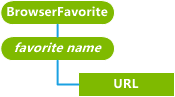

# BrowserFavorite CSP


The BrowserFavorite configuration service provider is used to add and remove URLs from the favorites list on a device.

> **Note**  BrowserFavorite CSP is only supported in Windows Phone 8.1.

 

The BrowserFavorite configuration service provider manages only the favorites at the root favorite folder level. It does not manage subfolders under the root favorite folder nor does it manage favorites under a subfolder.

> **Note**  
This configuration service provider requires the ID\_CAP\_CSP\_FOUNDATION and ID\_CAP\_INTERNET\_EXPLORER\_FAVORITES capabilities to be accessed from a network configuration application.

 

The following diagram shows the BrowserFavorite configuration service provider in tree format as used by Open Mobile Alliance Device (OMA) Client Provisioning. The OMA Device Management protocol is not supported with this configuration service provider.



<a href="" id="favorite-name-------------"></a>***favorite name***   
Required. Specifies the user-friendly name of the favorite URL that is displayed in the Favorites list of Internet Explorer.

> **Note**  The *favorite name* should contain only characters that are valid in the Windows file system. The invalid characters are: \\ / : \* ? " < > |

 

Adding the same favorite twice adds only one occurrence to the Favorites list. If a favorite is added when another favorite with the same name but a different URL is already in the Favorites list, the existing favorite is replaced with the new favorite.

<a href="" id="url"></a>**URL**  
Optional. Specifies the complete URL for the favorite.

## OMA client provisioning examples


Adding a new browser favorite.

```xml
<?xml version="1.0" encoding="UTF-8" ?>
<wap-provisioningdoc>
  <characteristic type="BrowserFavorite">
    <characteristic type="Help and how-to">
      <parm name="URL" value="http://www.microsoft.com/windowsphone/en-US/howto/wp7/default.aspx"/>
    </characteristic>
  </characteristic>
</wap-provisioningdoc>
```

## Microsoft Custom Elements


The following table shows the Microsoft custom elements that this configuration service provider supports for OMA Client Provisioning.

<table>
<colgroup>
<col width="50%" />
<col width="50%" />
</colgroup>
<thead>
<tr class="header">
<th>Elements</th>
<th>Available</th>
</tr>
</thead>
<tbody>
<tr class="odd">
<td><p>parm-query</p></td>
<td><p>Yes</p></td>
</tr>
<tr class="even">
<td><p>noparm</p></td>
<td><p>Yes</p></td>
</tr>
<tr class="odd">
<td><p>nocharacteristic</p></td>
<td><p>Yes</p></td>
</tr>
<tr class="even">
<td><p>characteristic-query</p></td>
<td><p>Yes</p>
<p>Recursive query: Yes</p>
<p>Top-level query: Yes</p></td>
</tr>
</tbody>
</table>

 

## Related topics


[Configuration service provider reference](configuration-service-provider-reference.md)

 

 


