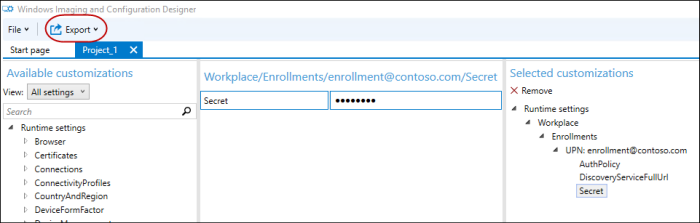
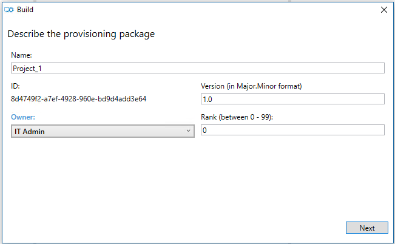

# Bulk enrollment

Bulk enrollment is an efficient way to set up a large number of devices to be managed by an MDM server without the need to re-image the devices. In Windows 10 desktop and mobile devices, you can use the [Provisioning CSP](provisioning-csp.md) for bulk enrollment, except for the Azure Active Directory Join (Cloud Domain Join) enrollment scenario.

## Typical use cases

-   Set up devices in bulk for large organizations to be managed by MDM.
-   Set up kiosks, such as ATMs or point-of-sale (POS) terminals.
-   Set up school computers.
-   Set up industrial machinery.
-   Set handheld POS devices.

On the desktop, you can create an Active Directory account, such as "enrollment@contoso.com" and give it only the ability to join the domain. Once the desktop is joined with that admin account, then standard users in the domain can log in to use it. This is especially useful in getting a large number of desktop ready to use within a domain.

On the desktop and mobile devices, you can use an enrollment certificate or enrollment username and password, such as "enroll@contoso.com" and "enrollmentpassword." These credentials are used in the provisioning package, which you can use to enroll multiple devices to the MDM service. Once the devices are joined, many users can use them.

> [!NOTE]
> -   Bulk-join is not supported in Azure Active Directory Join.
> -   Bulk enrollment does not work in Intune standalone environment.
> -   Bulk enrollment works in System Center Configuration Manager (SCCM) + Intune hybrid environment where the ppkg is generated from the SCCM console.

 

## What you need

-   Windows 10 devices
-   Windows Imaging and Configuration Designer (ICD) tool
    To get the ICD tool, download the [Windows Assessment and Deployment Kit (ADK)](https://developer.microsoft.com/windows/hardware/windows-assessment-deployment-kit). For more information about the ICD tool, see [Windows Imaging and Configuration Designer](https://msdn.microsoft.com/library/windows/hardware/dn916113) and [Getting started with Windows ICD](https://msdn.microsoft.com/library/windows/hardware/dn916112).
-   Enrollment credentials (domain account for enrollment, generic enrollment credentials for MDM, enrollment certificate for MDM.)
-   Wi-Fi credentials, computer name scheme, and anything else required by your organization.

    Some organizations require custom APNs to be provisioned before talking to the enrollment endpoint or custom VPN to join a domain.

## Create and apply a provisioning package for on-premises authentication

Using the ICD, create a provisioning package using the enrollment information required by your organization. Ensure that you have all the configuration settings.

1. Open the Windows ICD tool (by default, %windir%\\Program Files (x86)\\Windows Kits\\10\\Assessment and Deployment Kit\\Imaging and Configuration Designer\\x86\\ICD.exe).
2. Click **Advanced Provisioning**.

   
3. Enter a project name and click **Next**.
4. Select **All Windows editions**, since Provisioning CSP is common to all Windows 10 editions, then click **Next**.
5. Skip **Import a provisioning package (optional)** and click **Finish**.
6. Expand **Runtime settings** &gt; **Workplace**.
7. Click **Enrollments**, enter a value in **UPN**, and then click **Add**.
   The UPN is a unique identifier for the enrollment. For bulk enrollment, this must be a service account that is allowed to enroll multiple users, such as "enrollment@contoso.com".
8. On the left navigation pane, expand the **UPN** and then enter the information for the rest of the settings for enrollment process.
   Here is the list of available settings:
   -   **AuthPolicy** - Select **OnPremise**.
   -   **DiscoveryServiceFullUrl** - specify the full URL for the discovery service.
   -   **EnrollmentServiceFullUrl** - Optional and in most cases, it should be left blank.
   -   **PolicyServiceFullUrl** - Optional and in most cases, it should be left blank.
   -   **Secret** - Password
   For detailed descriptions of these settings, see [Provisioning CSP](provisioning-csp.md).
   Here is the screenshot of the ICD at this point.
   
9. Configure the other settings, such as the Wi-Fi connections so that the device can join a network before joining MDM (e.g., **Runtime settings** &gt; **ConnectivityProfiles** &gt; **WLANSetting**).
10. When you are done adding all the settings, on the **File** menu, click **Save**.
11. On the main menu click **Export** &gt; **Provisioning package**.

    
12. Enter the values for your package and specify the package output location.

    
    
    
13. Click **Build**.

    
14. Apply the package to some test devices and verify that they work. For more information, see [Apply a provisioning package](#apply-a-provisioning-package).
15. Apply the package to your devices.

## Create and apply a provisioning package for certificate authentication

Using the ICD, create a provisioning package using the enrollment information required by your organization. Ensure that you have all the configuration settings.

1. Open the Windows ICD tool (by default, %windir%\\Program Files (x86)\\Windows Kits\\10\\Assessment and Deployment Kit\\Imaging and Configuration Designer\\x86\\ICD.exe).
2. Click **Advanced Provisioning**.
3. Enter a project name and click **Next**.
4. Select **Common to all Windows editions**, since Provisioning CSP is common to all Windows 10 editions.
5. Skip **Import a provisioning package (optional)** and click **Finish**.
6. Specify the certificate.
   1.  Go to **Runtime settings** &gt; **Certificates** &gt; **ClientCertificates**.
   2.  Enter a **CertificateName** and then click **Add**.
   3.  Enter the **CertificatePasword**.
   4.  For **CertificatePath**, browse and select the certificate to be used.
   5.  Set **ExportCertificate** to False.
   6.  For **KeyLocation**, select **Software only**.

   
7. Specify the workplace settings.
   1. Got to **Workplace** &gt; **Enrollments**.
   2. Enter the **UPN** for the enrollment and then click **Add**.
      The UPN is a unique identifier for the enrollment. For bulk enrollment, this must be a service account that is allowed to enroll multiple users, such as "enrollment@contoso.com".
   3. On the left column, expand the **UPN** and then enter the information for the rest of the settings for enrollment process.
      Here is the list of available settings:
      -   **AuthPolicy** - Select **Certificate**.
      -   **DiscoveryServiceFullUrl** - specify the full URL for the discovery service.
      -   **EnrollmentServiceFullUrl** - Optional and in most cases, it should be left blank.
      -   **PolicyServiceFullUrl** - Optional and in most cases, it should be left blank.
      -   **Secret** - the certificate thumbprint.
      For detailed descriptions of these settings, see [Provisioning CSP](provisioning-csp.md).
8. Configure the other settings, such as the Wi-Fi connection so that the device can join a network before joining MDM (e.g., **Runtime settings** &gt; **ConnectivityProfiles** &gt; **WLANSetting**).
9. When you are done adding all the settings, on the **File** menu, click **Save**.
10. Export and build the package (steps 10-13 in the procedure above).
11. Apply the package to some test devices and verify that they work. For more information, see [Apply a provisioning package](#apply-a-provisioning-package).
12. Apply the package to your devices.

## Apply a provisioning package

Here's the list of topics about applying a provisioning package:

-   [Apply a package on the first-run setup screen (out-of-the-box experience)](https://technet.microsoft.com/itpro/windows/deploy/provision-pcs-for-initial-deployment#apply-package) - topic in Technet.
-   [Apply a package to a Windows 10 desktop edition image](https://msdn.microsoft.com/library/windows/hardware/dn916107.aspx#to_apply_a_provisioning_package_to_a_desktop_image) - topic in MSDN
-   [Apply a package to a Windows 10 Mobile image](https://msdn.microsoft.com/library/windows/hardware/dn916107.aspx#to_apply_a_provisioning_package_to_a_mobile_image) - topic in MSDN.
-   [Apply a package from the Settings menu](#apply-a-package-from-the-settings-menu) - topic below

## Apply a package from the Settings menu

1.  Go to **Settings** &gt; **Accounts** &gt; **Access work or school**.
2.  Click **Add or remove a provisioning package**.
3.  Click **Add a package**.

## Validate that the provisioning package was applied

1.  Go to **Settings** &gt; **Accounts** &gt; **Access work or school**.
2.  Click **Add or remove a provisioning package**.
    You should see the your package listed.

## Retry logic in case of a failure

If the provisioning engine receives a failure from a CSP it will retry to provision 3 times in a row.

If all immediate attempts fail, a delayed task is launched to try provisioning again later. It will retry 4 times at a decaying rate of 15 minutes -&gt; 1 hr -&gt; 4 hr -&gt; "Next System Start". These attempts will be run from a SYSTEM context.

It will also retry to apply the provisioning each time it is launched, if started from somewhere else as well.

In addition, provisioning will be restarted in a SYSTEM context after a login and the system has been idle ([details on idle conditions](https://msdn.microsoft.com/library/windows/desktop/aa383561.aspx)).

## Other provisioning topics

Here are links to step-by-step provisioning topics in Technet.

-   [Provision PCs with apps and certificates for initial deployment](https://technet.microsoft.com/itpro/windows/deploy/provision-pcs-with-apps-and-certificates)
-   [Provision PCs with common settings for initial deployment](https://technet.microsoft.com/itpro/windows/deploy/provision-pcs-for-initial-deployment)

 

