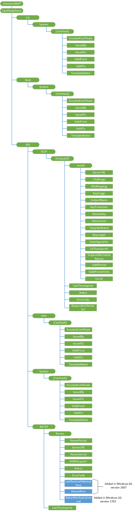

# CertificateStore CSP


The CertificateStore configuration service provider is used to add secure socket layers (SSL), intermediate, and self-signed certificates.

> **Note**   The CertificateStore configuration service provider does not support installing client certificates.

 

For the CertificateStore CSP, you cannot use the Replace command unless the node already exists.

The following diagram shows the CertificateStore configuration service provider management object in tree format as used by both Open Mobile Alliance Device Management (OMA DM) and OMA Client Provisioning.



<a href="" id="root-system"></a>**Root/System**  
Defines the certificate store that contains root, or self-signed, certificates.

Supported operation is Get.

> **Note**  Root/System is case sensitive. Please use the RootCATrustedCertificates CSP moving forward for installing root certificates.

 

<a href="" id="ca-system"></a>**CA/System**  
Defines the certificate store that contains cryptographic information, including intermediary certification authorities.

Supported operation is Get.

> **Note**  CA/System is case sensitive. Please use the RootCATrustedCertificates CSP moving forward for installing CA certificates.

 

<a href="" id="my-user"></a>**My/User**  
Defines the certificate store that contains public keys for client certificates. This is only used by enterprise servers to push down the public key of a client certificate. The client certificate is used by the device client to authenticate itself to the enterprise server for device management and downloading enterprise applications.

Supported operation is Get.

> **Note**  My/User is case sensitive.

 

<a href="" id="my-system"></a>**My/System**  
Defines the certificate store that contains public key for client certificate. This is only used by enterprise server to push down the public key of the client cert. The client cert is used by the device to authenticate itself to the enterprise server for device management and enterprise app downloading.

Supported operation is Get.

> **Note**  My/System is case sensitive.

 

<a href="" id="certhash"></a>***CertHash***  
Defines the SHA1 hash for the certificate. The 20-byte value of the SHA1 certificate hash is specified as a hexadecimal string value.

Supported operations are Get, Delete, and Replace.

<a href="" id="certhash-encodedcertificate"></a>***CertHash*/EncodedCertificate**  
Required. Specifies the X.509 certificate as a Base64-encoded string. The Base-64 string value cannot include extra formatting characters such as embedded linefeeds, etc.

Supported operations are Get, Add, Delete, and Replace.

<a href="" id="certhash-issuedby"></a>***CertHash*/IssuedBy**  
Required. Returns the name of the certificate issuer. This is equivalent to the *Issuer* member in the CERT\_INFO data structure.

Supported operation is Get.

<a href="" id="certhash-issuedto"></a>***CertHash*/IssuedTo**  
Required. Returns the name of the certificate subject. This is equivalent to the *Subject* member in the CERT\_INFO data structure.

Supported operation is Get.

<a href="" id="certhash-validfrom"></a>***CertHash*/ValidFrom**  
Required. Returns the starting date of the certificate's validity. This is equivalent to the *NotBefore* member in the CERT\_INFO structure.

Supported operation is Get.

<a href="" id="certhash-validto"></a>***CertHash*/ValidTo**  
Required. Returns the expiration date of the certificate. This is equivalent to the *NotAfter* member in the CERT\_INFO structure.

Supported operation is Get.

<a href="" id="certhash-templatename"></a>***CertHash*/TemplateName**  
Required. Returns the certificate template name.

Supported operation is Get.

<a href="" id="my-scep"></a>**My/SCEP**  
Required for Simple Certificate Enrollment Protocol (SCEP) certificate enrollment. The parent node grouping the SCEP certificate related settings.

Supported operation is Get.

> **Note**  Please use the ClientCertificateInstall CSP to install SCEP certificates moving forward. All enhancements to SCEP will happen in that CSP.

 

<a href="" id="my-scep-uniqueid"></a>**My/SCEP/****_UniqueID_**  
Required for SCEP certificate enrollment. A unique ID to differentiate certificate enrollment requests. Format is node.

Supported operations are Get, Add, Replace, and Delete.

<a href="" id="my-scep-uniqueid-install"></a>**My/SCEP/*UniqueID*/Install**  
Required for SCEP certificate enrollment. Parent node to group SCEP certificate install related request. Format is node.

Supported operations are Add, Replace, and Delete.

> **Note**   Though the children nodes under Install support Replace commands, after the Exec command is sent to the device, the device takes the values that are set when the Exec command is accepted. You should not expect the node value change that occurs after the Exec command is accepted to impact the current undergoing enrollment. You should check the Status node value and make sure that the device is not at an unknown stage before changing the children node values.

 

<a href="" id="my-scep-uniqueid-install-serverurl"></a>**My/SCEP/*UniqueID*/Install/ServerURL**  
Required for SCEP certificate enrollment. Specifies the certificate enrollment server. The server could specify multiple server URLs separated by a semicolon. Value type is string.

Supported operations are Get, Add, Delete, and Replace.

<a href="" id="my-scep-uniqueid-install-challenge"></a>**My/SCEP/*UniqueID*/Install/Challenge**  
Required for SCEP certificate enrollment. B64 encoded SCEP enrollment challenge. Value type is chr.

Supported operations are Get, Add, Replace, and Delete.

Challenge will be deleted shortly after the Exec command is accepted.

<a href="" id="my-scep-uniqueid-install-ekumapping"></a>**My/SCEP/*UniqueID*/Install/EKUMapping**  
Required. Specifies the extended key usages and subject to SCEP server configuration. The list of OIDs are separated by a plus sign **+**, such as OID1+OID2+OID3. Value type is chr.

Supported operations are Get, Add, Delete, and Replace.

<a href="" id="my-scep-uniqueid-install-keyusage"></a>**My/SCEP/*UniqueID*/Install/KeyUsage**  
Required for enrollment. Specifies the key usage bits (0x80, 0x20, 0xA0, etc.) for the certificate in decimal format. The value should at least have second (0x20) or fourth (0x80) or both bits set. If the value does not have those bits set, configuration will fail. Value type is an integer.

Supported operations are Get, Add, Delete, and Replace.

<a href="" id="my-scep-uniqueid-install-subjectname"></a>**My/SCEP/*UniqueID*/Install/SubjectName**  
Required. Specifies the subject name. Value type is chr.

Supported operations are Get, Add, Delete, and Replace.

<a href="" id="my-scep-uniqueid-install-keyprotection"></a>**My/SCEP/*UniqueID*/Install/KeyProtection**  
Optional. Specifies the location of the private key. Although the private key is protected by TPM, it is not protected with TPM PIN. SCEP enrolled certificate does not support TPM PIN protection.

Supported values are one of the following:

-   1 – Private key is protected by device TPM.

-   2 – Private key is protected by device TPM if the device supports TPM.

-   3 (default) – Private key is only saved in the software KSP.

Value type is an integer.

Supported operations are Get, Add, Delete, and Replace.

<a href="" id="my-scep-uniqueid-install-retrydelay"></a>**My/SCEP/*UniqueID*/Install/RetryDelay**  
Optional. Specifies the device retry waiting time in minutes when the SCEP server sends the pending status. Default value is 5 and the minimum value is 1. Value type is an integer.

Supported operations are Get, Add, and Delete.

<a href="" id="my-scep-uniqueid-install-retrycount"></a>**My/SCEP/*UniqueID*/Install/RetryCount**  
Optional. Special to SCEP. Specifies the device retry times when the SCEP server sends pending status. Value type is an integer. Default value is 3. Max value cannot be larger than 30. If it is larger than 30, the device will use 30. The min value is 0, which means no retry.

Supported operations are Get, Add, Delete, and Replace.

<a href="" id="my-scep-uniqueid-install-templatename"></a>**My/SCEP/*UniqueID*/Install/TemplateName**  
Optional. OID of certificate template name. Note that this name is typically ignored by the SCEP server; therefore, the MDM server typically does not need to provide it. Value type is chr.

Supported operations are Get, Add, and Delete.

<a href="" id="my-scep-uniqueid-install-keylength"></a>**My/SCEP/*UniqueID*/Install/KeyLength**  
Required for enrollment. Specify private key length (RSA). Value type is an integer. Valid values are 1024, 2048, 4096. NGC key lengths supported should be specified.

Supported operations are Get, Add, Delete, and Replace.

<a href="" id="my-scep-uniqueid-install-hashalgorithm"></a>**My/SCEP/*UniqueID*/Install/HashAlgorithm**  
Required for enrollment. Hash algorithm family (SHA-1, SHA-2, SHA-3) specified by the MDM server. If multiple hash algorithm families are specified, they must be separated with +.

Value type is chr.

Supported operations are Get, Add, Delete, and Replace.

<a href="" id="my-scep-uniqueid-install-cathumbprint"></a>**My/SCEP/*UniqueID*/Install/CAThumbprint**  
Required. Specifies the root CA thumbprint. It is a 20-byte value of the SHA1 certificate hash specified as a hexadecimal string value. When client authenticates the SCEP server, it checks CA certificate from SCEP server for a match with this certificate. If it does not match, the authentication fails. Value type is chr.

Supported operations are Get, Add, Delete, and Replace.

<a href="" id="my-scep-uniqueid-install-subjectalternativenames"></a>**My/SCEP/*UniqueID*/Install/SubjectAlternativeNames**  
Optional. Specifies the subject alternative name. Multiple alternative names can be specified. Each name is the combination of name format+actual name. Refer to the name type definition in MSDN. Each pair is separated by semicolon. For example, multiple subject alternative names are presented in the format *<nameformat1>*+*<actual name1>*;*<name format 2>*+*<actual name2>*. Value type is chr.

Supported operations are Get, Add, Delete, and Replace.

<a href="" id="my-scep-uniqueid-install-validperiod"></a>**My/SCEP/*UniqueID*/Install/ValidPeriod**  
Optional. Specifies the units for the valid period. Value type is chr.

Supported operations are Get, Add, Delete, and Replace.

Valid values are one of the following:

-   Days (default)
-   Months
-   Years

> **Note**   The device only sends the MDM server expected certificate validation period (ValidPeriodUnits + ValidPeriod) of the SCEP server as part of certificate enrollment request. How this valid period is used to create the certificate depends on the MDM server.

 

<a href="" id="my-scep-uniqueid-install-validperiodunits"></a>**My/SCEP/*UniqueID*/Install/ValidPeriodUnits**  
Optional. Specifies desired number of units used in validity period and subject to SCEP server configuration. Default is 0. The units are defined in ValidPeriod node. The valid period specified by MDM overwrites the valid period specified in the certificate template. For example, if ValidPeriod is days and ValidPeriodUnits is 30, it means the total valid duration is 30 days. Value type is an integer.

Supported operations are Get, Add, Delete, and Replace.

> **Note**   The device only sends the MDM server expected certificate validation period (ValidPeriodUnits + ValidPeriod) of the SCEP server as part of certificate enrollment request. How this valid period is used to create the certificate depends on the MDM server.

 

<a href="" id="my-scep-uniqueid-install-enroll"></a>**My/SCEP/*UniqueID*/Install/Enroll**  
Required. Triggers the device to start the certificate enrollment. The MDM server can later query the device to find out whether the new certificate is added. Value type is null, which means that this node does not contain a value.

Supported operation is Exec.

<a href="" id="my-wstep-certthumbprint"></a>**My/WSTEP/CertThumbprint**  
Optional. Returns the current MDM client certificate thumbprint. If renewal succeeds, it shows the renewed certificate thumbprint. If renewal fails or is in progress, it shows the thumbprint of the cert that needs to be renewed. Value type is chr.

Supported operation is Get.

<a href="" id="my-scep-uniqueid-status"></a>**My/SCEP/*UniqueID*/Status**  
Required. Specifies the latest status for the certificate due to enrollment request. Value type is chr.

Supported operation is Get.

Valid values are one of the following:

-   1 – Finished successfully.

-   2 – Pending. The device has not finished the action, but has received the SCEP server pending response.

-   16 - Action failed.

-   32 – Unknown.

<a href="" id="my-scep-uniqueid-errorcode"></a>**My/SCEP/*UniqueID*/ErrorCode**  
Optional. The integer value that indicates the HRESULT of the last enrollment error code.

Supported operation is Get.

<a href="" id="my-scep-uniqueid-certthumbprint"></a>**My/SCEP/*UniqueID*/CertThumbprint**  
Optional. Specifies the current certificate thumbprint if certificate enrollment succeeds. It is a 20-byte value of the SHA1 certificate hash specified as a hexadecimal string value. Value type is chr.

Supported operation is Get.

<a href="" id="my-scep-uniqueid-respondentserverurl"></a>**My/SCEP/*UniqueID*/RespondentServerUrl**  
Required. Returns the URL of the SCEP server that responded to the enrollment request. Value type is string.

Supported operation is Get.

<a href="" id="my-wstep"></a>**My/WSTEP**  
Required for MDM enrolled device. The parent node that hosts the MDM enrollment client certificate related settings that is enrolled via WSTEP. The nodes under WSTEP are mostly for MDM client certificate renew requests. Value type is node.

Supported operation is Get.

<a href="" id="my-wstep-renew"></a>**My/WSTEP/Renew**  
Optional. The parent node to group renewal related settings.

Supported operation is Get.

<a href="" id="my-wstep-renew-serverurl"></a>**My/WSTEP/Renew/ServerURL**  
Optional. Specifies the URL of certificate renewal server. If this node does not exist, the client uses the initial certificate enrollment URL.

> **Note**  The renewal process follows the same steps as device enrollment, which means that it starts with Discovery service, followed by Enrollment policy service, and then Enrollment web service.

 

Supported operations are Add, Get, Delete, and Replace.

<a href="" id="my-wstep-renew-renewalperiod"></a>**My/WSTEP/Renew/RenewalPeriod**  
Optional. The time (in days) to trigger the client to initiate the MDM client certificate renew process before the MDM certificate expires. The MDM server cannot set and update the renewal period. This parameter applies to both manual certificate renewal and request on behalf of (ROBO) certificate renewal. It is recommended that the renew period is set a couple of months before the certificate expires to ensure that the certificate gets renewed successfully with data connectivity.

The default value is 42 and the valid values are 1 – 1000. Value type is an integer.

Supported operations are Add, Get, Delete, and Replace.

> **Note**   When you set the renewal schedule over SyncML DM commands to ROBOSupport, RenewalPeriod, and RetryInterval, you must wrap them in Atomic commands.

 

<a href="" id="my-wstep-renew-retryinterval"></a>**My/WSTEP/Renew/RetryInterval**  
Optional. Specifies the retry interval (in days) when the previous renewal failed. It applies to both manual certificate renewal and ROBO automatic certificate renewal. The retry schedule stops at the certificate expiration date.

For ROBO renewal failure, the client retries the renewal periodically until the device reaches the certificate expiration date. This parameter specifies the waiting period for ROBO renewal retries.

For manual retry failure, there are no built-in retries. The user can retry later. At the next scheduled certificate renewal retry period, the device prompts the credential dialog again.

The default value is 7 and the valid values are 1 – 1000 AND =< RenewalPeriod, otherwise it will result in errors. Value type is an integer.

Supported operations are Add, Get, Delete, and Replace.

> **Note**   When you set the renewal schedule over SyncML DM commands to ROBOSupport, RenewalPeriod, and RetryInterval, you must wrap them in Atomic commands.

 

<a href="" id="my-wstep-renew-robosupport"></a>**My/WSTEP/Renew/ROBOSupport**  
Optional. Notifies the client if the MDM enrollment server supports ROBO auto certificate renewal. Value type is bool.

ROBO is the only supported renewal method for Windows 10. This value is ignored and always considered to be true.

Supported operations are Add, Get, Delete, and Replace.

> **Note**   When you set the renewal schedule over SyncML DM commands to ROBOSupport, RenewalPeriod, and RetryInterval, you must wrap them in Atomic commands.

 

<a href="" id="my-wstep-renew-status"></a>**My/WSTEP/Renew/Status**  
Required. Shows the latest action status for this certificate. Value type is an integer.

Supported operation is Get.

Supported values are one of the following:

-   0 – Not started.

-   1 – Renewal in progress.

-   2 – Renewal succeeded.

-   3 – Renewal failed.

<a href="" id="my-wstep-renew-errorcode"></a>**My/WSTEP/Renew/ErrorCode**  
Optional. If certificate renewal fails, this integer value indicates the HRESULT of the last error code during the renewal process. Value type is an integer.

Supported operation is Get.

<a href="" id="my-wstep-renew-lastrenewalattempttime"></a>**My/WSTEP/Renew/LastRenewalAttemptTime**  
Added in Windows 10, version 1607. Time of the last attempted renewal.

Supported operation is Get.

<a href="" id="my-wstep-renew-renewnow"></a>**My/WSTEP/Renew/RenewNow**  
Added in Windows 10, version 1607. Initiates a renewal now.

Supported operation is Execute.

<a href="" id="my-wstep-renew-retryafterexpiryinterval"></a>**My/WSTEP/Renew/RetryAfterExpiryInterval**  
Added in Windows 10, version 1703. How long after the enrollment certificate has expired before trying to renew.

Supported operations are Add, Get, and Replace.

## Examples


Add a root certificate to the MDM server.

``` syntax
<Add>
   <CmdID>1</CmdID>
   <Item>
      <Target>
         <LocURI>
./Vendor/MSFT/CertificateStore/Root/System/<CertificateHashInsertedhere>/EncodedCertificate
          </LocURI>
      </Target>
      <Data>B64EncodedCertInsertedHere</Data>
      <Meta>
         <Format xmlns="syncml:metinf">b64</Format>
      </Meta>
   </Item>
</Add>
```

Get all installed client certificates.

``` syntax
<Get>
   <CmdID>1</CmdID>
   <Item>
      <Target>
         <LocURI>
./Vendor/MSFT/CertificateStore/My/User?list=StructData
          </LocURI>
      </Target>
   </Item>
</Get>
```

Delete a root certificate.

``` syntax
<Delete>
   <CmdID>1</CmdID>
   <Item>
      <Target>
         <LocURI>
./Vendor/MSFT/CertificateStore/Root/System/<CertificateHashInsertedHere>
          </LocURI>
      </Target>
   </Item>
</Delete>
```

Configure the device to enroll a client certificate through SCEP.

``` syntax
<Atomic>
<CmdID>100</CmdID>
<Add>
   <CmdID>1</CmdID>
   <Item>
        <Target><LocURI>./Vendor/MSFT/CertificateStore/My/SCEP/CertSCEP1</LocURI>
        </Target>
        <Meta>
        <Format xmlns="syncml:metinf">node</Format>
        </Meta>
   </Item>
</Add>
<Add>
    <CmdID>2</CmdID>
    <Item>
        <Target><LocURI>./Vendor/MSFT/CertificateStore/My/SCEP/CertSCEP1/Install/RetryCount</LocURI>
        </Target>
    <Meta>
               <Format xmlns="syncml:metinf">int</Format>
    </Meta>
            <Data>1</Data>
    </Item>
</Add>
<Add>
         <CmdID>3</CmdID>
         <Item>
            <Target><LocURI>./Vendor/MSFT/CertificateStore/My/SCEP/CertSCEP1/Install/RetryDelay</LocURI>
            </Target>
            <Meta>
               <Format xmlns="syncml:metinf">int</Format>
            </Meta>
            <Data>1</Data>
         </Item>
</Add>
<Add>
         <CmdID>4</CmdID>
         <Item>
            <Target><LocURI>./Vendor/MSFT/CertificateStore/My/SCEP/CertSCEP1/Install/KeyUsage</LocURI>
            </Target>
            <Meta>
               <Format xmlns="syncml:metinf">int</Format>
            </Meta>
            <Data>160</Data>
         </Item>
</Add>
<Add>
         <CmdID>5</CmdID>
         <Item>
            <Target><LocURI>./Vendor/MSFT/CertificateStore/My/SCEP/CertSCEP1/Install/KeyLength</LocURI>
            </Target>
            <Meta>
               <Format xmlns="syncml:metinf">int</Format>
            </Meta>
            <Data>1024</Data>
         </Item>
</Add>
<Add>
         <CmdID>6</CmdID>
         <Item>
            <Target><LocURI>./Vendor/MSFT/CertificateStore/My/SCEP/CertSCEP1/Install/HashAlgorithm</LocURI>
            </Target>
            <Meta>
               <Format xmlns="syncml:metinf">chr</Format>
            </Meta>
            <Data>SHA-1</Data>
         </Item>
</Add>
<Add>
         <CmdID>7</CmdID>
         <Item>
            <Target><LocURI>./Vendor/MSFT/CertificateStore/My/SCEP/CertSCEP1/Install/SubjectName</LocURI>
            </Target>
            <Meta>
               <Format xmlns="syncml:metinf">chr</Format>
            </Meta>
            <Data>CN=AnnaLee</Data>
         </Item>
</Add>
<Add>
         <CmdID>8</CmdID>
         <Item>
            <Target><LocURI>./Vendor/MSFT/CertificateStore/My/SCEP/CertSCEP1/Install/SubjectAlternativeNames</LocURI>
            </Target>
            <Meta>
               <Format xmlns="syncml:metinf">chr</Format>
            </Meta>
            <Data>11+tom@MyDomain.Contoso.com;3+MyDomain.Contoso.com</Data>
         </Item>
</Add>
<Add>
         <CmdID>9</CmdID>
         <Item>
            <Target><LocURI>./Vendor/MSFT/CertificateStore/My/SCEP/CertSCEP1/Install/ValidPeriod</LocURI>
            </Target>
            <Meta>
               <Format xmlns="syncml:metinf">chr</Format>
            </Meta>
            <Data>Years</Data>
         </Item>
</Add>
<Add>
         <CmdID>10</CmdID>
         <Item>
            <Target><LocURI>./Vendor/MSFT/CertificateStore/My/SCEP/CertSCEP1/Install/ValidPeriodUnits</LocURI>
            </Target>
            <Meta>
               <Format xmlns="syncml:metinf">int</Format>
            </Meta>
            <Data>1</Data>
         </Item>
</Add>
<Add>
         <CmdID>11</CmdID>
         <Item>
            <Target><LocURI>./Vendor/MSFT/CertificateStore/My/SCEP/CertSCEP1/Install/EKUMapping</LocURI>
            </Target>
            <Meta>
               <Format xmlns="syncml:metinf">chr</Format>
            </Meta>
            <Data>1.3.6.1.4.1.311.10.3.12+1.3.6.1.4.1.311.10.3.4+1.3.6.1.4.1.311.20.2.2</Data>
         </Item>
</Add>
<Add>
         <CmdID>12</CmdID>
         <Item>
            <Target><LocURI>./Vendor/MSFT/CertificateStore/My/SCEP/CertSCEP1/Install/KeyProtection</LocURI>
            </Target>
            <Meta>
               <Format xmlns="syncml:metinf">int</Format>
            </Meta>
            <Data>3</Data>
         </Item>
</Add>
<Add>
         <CmdID>13</CmdID>
         <Item>
            <Target><LocURI>./Vendor/MSFT/CertificateStore/My/SCEP/CertSCEP1/Install/ServerURL</LocURI>
            </Target>
            <Meta>
               <Format xmlns="syncml:metinf">chr</Format>
            </Meta>
            <Data>https://contoso.com/certsrv/ctcep.dll</Data>
         </Item>
</Add>
<Add>
         <CmdID>14</CmdID>
         <Item>
            <Target><LocURI>./Vendor/MSFT/CertificateStore/My/SCEP/CertSCEP1/Install/Challenge</LocURI>
            </Target>
            <Meta>
               <Format xmlns="syncml:metinf">chr</Format>
            </Meta>
            <Data>ChallengeInsertedHere</Data>
         </Item>
</Add>
<Add>
         <CmdID>15</CmdID>
         <Item>
            <Target><LocURI>./Vendor/MSFT/CertificateStore/My/SCEP/CertSCEP1/Install/CAThumbprint</LocURI>
            </Target>
            <Meta>
               <Format xmlns="syncml:metinf">chr</Format>
            </Meta>
            <Data>CAThumbprintInsertedHere</Data>
         </Item>
</Add>
<Exec>
         <CmdID>16</CmdID>
         <Item>
            <Target><LocURI>./Vendor/MSFT/CertificateStore/My/SCEP/CertSCEP1/Install/Enroll</LocURI>
            </Target>
         </Item>
</Exec>
</Atomic>
```

Configure the device to automatically renew an MDM client certificate with the specified renew period and retry interval.

``` syntax
<Atomic>
   <CmdID>1</CmdID>
     <Replace>
         <CmdID>2</CmdID>
         <Item>
            <Target><LocURI>./Vendor/MSFT/CertificateStore/My/WSTEP/Renew/ROBOSupport</LocURI></Target>
            <Meta>
               <Format xmlns="syncml:metinf">bool</Format>
            </Meta>
            <Data>true</Data>
         </Item>
      </Replace>
      <Replace>
         <CmdID>3</CmdID>
         <Item>
            <Target><LocURI>./Vendor/MSFT/CertificateStore/My/WSTEP/Renew/RenewPeriod</LocURI></Target>
            <Meta>
               <Format xmlns="syncml:metinf">int</Format>
            </Meta>
            <Data>60</Data>
         </Item>
      </Replace>
      <Replace>
         <CmdID>4</CmdID>
         <Item>
            <Target><LocURI>./Vendor/MSFT/CertificateStore/My/WSTEP/Renew/RetryInterval</LocURI></Target>
            <Meta>
               <Format xmlns="syncml:metinf">int</Format>
            </Meta>
            <Data>4</Data>
         </Item>
      </Replace>
</Atomic>
```

## Related topics


[Configuration service provider reference](configuration-service-provider-reference.md)

 

 


