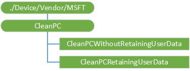

# CleanPC CSP

The CleanPC configuration service provider (CSP) allows removal of user-installed and pre-installed applications, with the option to persist user data. This CSP was added in Windows 10, version 1703.

The following diagram shows the CleanPC configuration service provider in tree format.

**./Device/Vendor/MSFT/CleanPC**  

The root node for the CleanPC configuration service provider.

**CleanPCWithoutRetainingUserData**  

An integer specifying a CleanPC operation without any retention of user data.

The only supported operation is Execute.

**CleanPCRetainingUserData**  

An integer specifying a CleanPC operation with retention of user data. 

The only supported operation is Execute.
