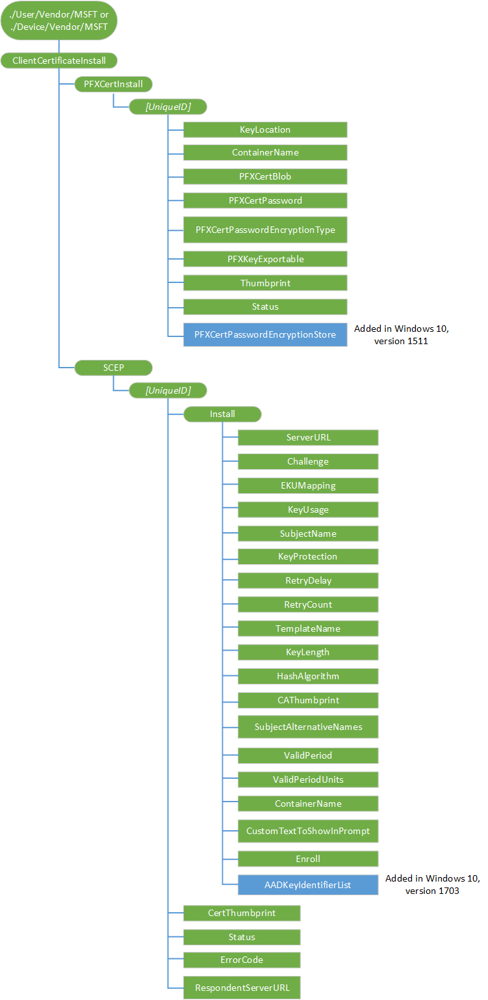

# ClientCertificateInstall CSP


The ClientCertificateInstall configuration service provider enables the enterprise to install client certificates. A client certificate has a unique ID, which is the *\[UniqueID\]* for this configuration. Each client certificate must have different UniqueIDs for the SCEP enrollment request. 

For PFX certificate installation and SCEP installation, the SyncML commands must be wrapped in atomic commands to ensure enrollment execution is not triggered until all settings are configured. The Enroll command must be the last item in the atomic block.

> **Note**  
Currently in Windows 10, version 1511, when using the ClientCertificateInstall to install certificates to the device store and the user store and both certificates are sent to the device in the same MDM payload, the certificate intended for the device store will also get installed in the user store. This may cause issues with Wi-Fi or VPN when choosing the correct certificate to establish a connection. We are working to fix this issue.

You can only set PFXKeyExportable to true if KeyLocation=3. For any other KeyLocation value, the CSP will fail.


The following image shows the ClientCertificateInstall configuration service provider in tree format.



<a href="" id="device-or-user"></a>**Device or User**
<p style="margin-left: 20px">For device certificates, use <strong>./Device/Vendor/MSFT</strong> path and for user certificates use <strong>./User/Vendor/MSFT</strong> path.

<a href="" id="clientcertificateinstall"></a>**ClientCertificateInstall**
<p style="margin-left: 20px">The root node for the ClientCertificateInstaller configuration service provider.

<a href="" id="clientcertificateinstall-pfxcertinstall"></a>**ClientCertificateInstall/PFXCertInstall**
<p style="margin-left: 20px">Required for PFX certificate installation. The parent node grouping the PFX certificate related settings.

<p style="margin-left: 20px">Supported operation is Get.

<a href="" id="clientcertificateinstall-pfxcertinstall-uniqueid"></a>**ClientCertificateInstall/PFXCertInstall/**<strong>*UniqueID*</strong>
<p style="margin-left: 20px">Required for PFX certificate installation. A unique ID to differentiate different certificate install requests.

<p style="margin-left: 20px">The data type format is node.

<p style="margin-left: 20px">Supported operations are Get, Add, and Replace.

<p style="margin-left: 20px">Calling Delete on this node should delete the certificates and the keys that were installed by the corresponding PFX blob.

<a href="" id="clientcertificateinstall-pfxcertinstall-uniqueid-keylocation"></a>**ClientCertificateInstall/PFXCertInstall/*UniqueID*/KeyLocation**
<p style="margin-left: 20px">Required for PFX certificate installation. Indicates the KeyStorage provider to target the private key installation to.

<p style="margin-left: 20px">Supported operations are Get, Add, and Replace.

<p style="margin-left: 20px">The data type is an integer corresponding to one of the following values:

| Value | Description                                                                                                   |
|-------|---------------------------------------------------------------------------------------------------------------|
| 1     | Install to TPM if present, fail if not present.                                                               |
| 2     | Install to TPM if present. If not present, fallback to software.                                              |
| 3     | Install to software.                                                                                          |
| 4     | Install to Windows Hello for Business (formerly known as Microsoft Passport for Work) whose name is specified |


<a href="" id="clientcertificateinstall-pfxcertinstall-uniqueid-containername"></a>**ClientCertificateInstall/PFXCertInstall/*UniqueID*/ContainerName**
<p style="margin-left: 20px">Optional. Specifies the Windows Hello for Business (formerly known as Microsoft Passport for Work) container name (if Windows Hello for Business storage provider (KSP) is chosen for the KeyLocation). If this node is not specified when Windows Hello for Business KSP is chosen, enrollment will fail.

<p style="margin-left: 20px">Date type is string.

<p style="margin-left: 20px">Supported operations are Get, Add, Delete, and Replace.

<a href="" id="clientcertificateinstall-pfxcertinstall-uniqueid-pfxcertblob"></a>**ClientCertificateInstall/PFXCertInstall/*UniqueID*/PFXCertBlob**
<p style="margin-left: 20px">CRYPT_DATA_BLOB structure that contains a PFX packet with the exported and encrypted certificates and keys. The Add operation triggers the addition to the PFX certificate. This requires that all the other nodes under UniqueID that are parameters for PFX installation (Container Name, KeyLocation, CertPassword, KeyExportable) are present before this is called. This also sets the Status node to the current Status of the operation.

<p style="margin-left: 20px">The data type format is binary.

<p style="margin-left: 20px">Supported operations are Get, Add, and Replace.

<p style="margin-left: 20px">If a blob already exists, the Add operation will fail. If Replace is called on this node, the existing certificates are overwritten.

<p style="margin-left: 20px">If Add is called on this node for a new PFX, the certificate will be added. When a certificate does not exist, Replace operation on this node will fail.

<p style="margin-left: 20px">In other words, using Replace or Add will result in the effect of either overwriting the old certificate or adding a new certificate CRYPT_DATA_BLOB, which can be found in <a href="https://go.microsoft.com/fwlink/p/?LinkId=523871" data-raw-source="[CRYPT\_INTEGER\_BLOB](https://go.microsoft.com/fwlink/p/?LinkId=523871)">CRYPT_INTEGER_BLOB</a>.

<a href="" id="clientcertificateinstall-pfxcertinstall-uniqueid-pfxcertpassword"></a>**ClientCertificateInstall/PFXCertInstall/*UniqueID*/PFXCertPassword**
<p style="margin-left: 20px">Password that protects the PFX blob. This is required if the PFX is password protected.

<p style="margin-left: 20px">Data Type is a string.

<p style="margin-left: 20px">Supported operations are Get, Add, and Replace.

<a href="" id="clientcertificateinstall-pfxcertinstall-uniqueid-pfxcertpasswordencryptiontype"></a>**ClientCertificateInstall/PFXCertInstall/*UniqueID*/PFXCertPasswordEncryptionType**
<p style="margin-left: 20px">Optional. Used to specify whether the PFX certificate password is encrypted with the MDM certificate by the MDM server.

<p style="margin-left: 20px">The data type is int. Valid values:

-   0 - Password is not encrypted.
-   1 - Password is encrypted with the MDM certificate.
-   2 - Password is encrypted with custom certificate.

<p style="margin-left: 20px">When PFXCertPasswordEncryptionType =2, you must specify the store name in PFXCertPasswordEncryptionStore setting.

<p style="margin-left: 20px">Supported operations are Get, Add, and Replace.

<a href="" id="clientcertificateinstall-pfxcertinstall-uniqueid-pfxkeyexportable"></a>**ClientCertificateInstall/PFXCertInstall/*UniqueID*/PFXKeyExportable**
<p style="margin-left: 20px">Optional. Used to specify if the private key installed is exportable (and can be exported later). The PFX is not exportable when it is installed to TPM.

> **Note**  You can only set PFXKeyExportable to true if KeyLocation=3. For any other KeyLocation value, the CSP will fail.

 
<p style="margin-left: 20px">The data type bool.

<p style="margin-left: 20px">Supported operations are Get, Add, and Replace.

<a href="" id="clientcertificateinstall-pfxcertinstall-uniqueid-thumbprint"></a>**ClientCertificateInstall/PFXCertInstall/*UniqueID*/Thumbprint**
<p style="margin-left: 20px">Returns the thumbprint of the installed PFX certificate.

<p style="margin-left: 20px">The datatype is a string.

<p style="margin-left: 20px">Supported operation is Get.

<a href="" id="clientcertificateinstall-pfxcertinstall-uniqueid-status"></a>**ClientCertificateInstall/PFXCertInstall/*UniqueID*/Status**
<p style="margin-left: 20px">Required. Returns the error code of the PFX installation from the GetLastError command called after the PfxImportCertStore.

<p style="margin-left: 20px">Data type is an integer.

<p style="margin-left: 20px">Supported operation is Get.

<a href="" id="clientcertificateinstall-pfxcertinstall-uniqueid-pfxcertpasswordencryptionstore"></a>**ClientCertificateInstall/PFXCertInstall/*UniqueID*/PFXCertPasswordEncryptionStore**
<p style="margin-left: 20px">Added in Windows 10, version 1511. When PFXCertPasswordEncryptionType = 2, it specifies the store name of the certificate used for decrypting the PFXCertPassword.

<p style="margin-left: 20px">Data type is string.

<p style="margin-left: 20px">Supported operations are Add, Get, and Replace.

<a href="" id="clientcertificateinstall-scep"></a>**ClientCertificateInstall/SCEP**
<p style="margin-left: 20px">Node for SCEP.

> **Note**  An alert is sent after the SCEP certificate is installed.

 
<a href="" id="clientcertificateinstall-scep-uniqueid"></a>**ClientCertificateInstall/SCEP/**<strong>*UniqueID*</strong>
<p style="margin-left: 20px">A unique ID to differentiate different certificate installation requests.


<a href="" id="clientcertificateinstall-scep-uniqueid-install"></a>**ClientCertificateInstall/SCEP/*UniqueID*/Install**
<p style="margin-left: 20px">A node required for SCEP certificate enrollment. Parent node to group SCEP cert installation related requests.

<p style="margin-left: 20px">Supported operations are Get, Add, Replace, and Delete.

> **Note**  Although the child nodes under Install support Replace commands, once the Exec command is sent to the device, the device will take the values that are set when the Exec command is accepted. The server should not expect the node value change after Exec command is accepted, as it will impact the current enrollment underway. The server should check the Status node value and make sure the device is not at an unknown state before changing child node values.

 
<a href="" id="clientcertificateinstall-scep-uniqueid-install-serverurl"></a>**ClientCertificateInstall/SCEP/*UniqueID*/Install/ServerURL**
<p style="margin-left: 20px">Required for SCEP certificate enrollment. Specifies the certificate enrollment server. Multiple server URLs can be listed, separated by semicolons.

<p style="margin-left: 20px">Data type is string.

<p style="margin-left: 20px">Supported operations are Get, Add, Delete, and Replace.

<a href="" id="clientcertificateinstall-scep-uniqueid-install-challenge"></a>**ClientCertificateInstall/SCEP/*UniqueID*/Install/Challenge**
<p style="margin-left: 20px">Required for SCEP certificate enrollment. B64 encoded SCEP enrollment challenge. Challenge is deleted shortly after the Exec command is accepted.

<p style="margin-left: 20px">Data type is string.

<p style="margin-left: 20px">Supported operations are Add, Get, Delete, and Replace.

<a href="" id="clientcertificateinstall-scep-uniqueid-install-ekumapping"></a>**ClientCertificateInstall/SCEP/*UniqueID*/Install/EKUMapping**
<p style="margin-left: 20px">Required. Specifies extended key usages. Subject to SCEP server configuration. The list of OIDs are separated by a plus <strong>+</strong>. For example, <em>OID1</em>+<em>OID2</em>+<em>OID3</em>.

Data type is string.
<p style="margin-left: 20px">Required for enrollment. Specifies the key usage bits (0x80, 0x20, 0xA0, etc.) for the certificate in decimal format. The value should at least have the second (0x20), fourth (0x80) or both bits set. If the value doesn’t have those bits set, the configuration will fail.

<p style="margin-left: 20px">Data type is int.

<p style="margin-left: 20px">Supported operations are Add, Get, Delete, and Replace.

<a href="" id="clientcertificateinstall-scep-uniqueid-install-subjectname"></a>**ClientCertificateInstall/SCEP/*UniqueID*/Install/SubjectName**
<p style="margin-left: 20px">Required. Specifies the subject name.

<p style="margin-left: 20px">Data type is string.

<p style="margin-left: 20px">Supported operations are Add, Get, and Replace.

<a href="" id="clientcertificateinstall-scep-uniqueid-install-keyprotection"></a>**ClientCertificateInstall/SCEP/*UniqueID*/Install/KeyProtection**
<p style="margin-left: 20px">Optional. Specifies where to keep the private key.

> **Note**  Even if the private key is protected by TPM, it is not protected with a TPM PIN.

 
<p style="margin-left: 20px">The data type is an integer corresponding to one of the following values:

| Value | Description                                                                                                                                                                                           |
|-------|-------------------------------------------------------------------------------------------------------------------------------------------------------------------------------------------------------|
| 1     | Private key protected by TPM.                                                                                                                                                                         |
| 2     | Private key protected by phone TPM if the device supports TPM. All Windows Phone 8.1 devices support TPM and will treat value 2 as 1.                                                                 |
| 3     | (Default) Private key saved in software KSP.                                                                                                                                                          |
| 4     | Private key protected by Windows Hello for Business (formerly known as Microsoft Passport for Work). If this option is specified, the ContainerName must be specifed, otherwise enrollment will fail. |

 
<p style="margin-left: 20px">Supported operations are Add, Get, Delete, and Replace.

<a href="" id="clientcertificateinstall-scep-uniqueid-install-keyusage"></a>**ClientCertificateInstall/SCEP/*UniqueID*/Install/KeyUsage**
<p style="margin-left: 20px">Required for enrollment. Specify the key usage bits (0x80, 0x20, 0xA0, etc.) for the certificate in decimal format. The value should at least have second (0x20) or forth (0x80) or both bits set. If the value doesn’t have those bits set, configuration will fail.

<p style="margin-left: 20px"> Supported operations are Add, Get, Delete, and Replace. Value type is integer.

<a href="" id="clientcertificateinstall-scep-uniqueid-install-retrydelay"></a>**ClientCertificateInstall/SCEP/*UniqueID*/Install/RetryDelay**
<p style="margin-left: 20px">Optional. When the SCEP server sends a pending status, this value specifies the device retry waiting time in minutes.

<p style="margin-left: 20px">Data type format is an integer.

<p style="margin-left: 20px">The default value is 5.

<p style="margin-left: 20px">The minimum value is 1.

<p style="margin-left: 20px">Supported operations are Add, Get, Delete, and Replace.

<a href="" id="clientcertificateinstall-scep-uniqueid-install-retrycount"></a>**ClientCertificateInstall/SCEP/*UniqueID*/Install/RetryCount**
<p style="margin-left: 20px">Optional. Unique to SCEP. Specifies the device retry times when the SCEP server sends a pending status.

<p style="margin-left: 20px">Data type is integer.

<p style="margin-left: 20px">Default value is 3.

<p style="margin-left: 20px">Maximum value is 30. If the value is larger than 30, the device will use 30.

<p style="margin-left: 20px">Minimum value is 0, which indicates no retry.

<p style="margin-left: 20px">Supported operations are Add, Get, Delete, and Replace.

<a href="" id="clientcertificateinstall-scep-uniqueid-install-templatename"></a>**ClientCertificateInstall/SCEP/*UniqueID*/Install/TemplateName**
<p style="margin-left: 20px">Optional. OID of certificate template name.

> **Note**  This name is typically ignored by the SCEP server; therefore the MDM server typically doesn’t need to provide it.

 
<p style="margin-left: 20px">Data type is string.

<p style="margin-left: 20px">Supported operations are Add, Get, Delete, and Replace.

<a href="" id="clientcertificateinstall-scep-uniqueid-install-keylength"></a>**ClientCertificateInstall/SCEP/*UniqueID*/Install/KeyLength**
<p style="margin-left: 20px">Required for enrollment. Specify private key length (RSA).

<p style="margin-left: 20px">Data type is integer.

<p style="margin-left: 20px">Valid values are 1024, 2048, and 4096.

<p style="margin-left: 20px">For Windows Hello for Business (formerly known as Microsoft Passport for Work) , only 2048 is the supported key length.

<p style="margin-left: 20px">Supported operations are Add, Get, Delete, and Replace.

<a href="" id="clientcertificateinstall-scep-uniqueid-install-hashalgorithm"></a>**ClientCertificateInstall/SCEP/*UniqueID*/Install/HashAlgorithm**
<p style="margin-left: 20px">Required. Hash algorithm family (SHA-1, SHA-2, SHA-3) specified by MDM server. If multiple hash algorithm families are specified, they must be separated with <strong>+</strong>.

<p style="margin-left: 20px">For Windows Hello for Business, only SHA256 is the supported algorithm.

<p style="margin-left: 20px">Data type is string.

<p style="margin-left: 20px">Supported operations are Add, Get, Delete, and Replace.

<a href="" id="clientcertificateinstall-scep-uniqueid-install-cathumbprint"></a>**ClientCertificateInstall/SCEP/*UniqueID*/Install/CAThumbprint**
<p style="margin-left: 20px">Required. Specifies Root CA thumbprint. This is a 20-byte value of the SHA1 certificate hash specified as a hexadecimal string value. When client authenticates the SCEP server, it checks the CA certificate from the SCEP server to verify a match with this certificate. If it is not a match, the authentication will fail.

<p style="margin-left: 20px">Data type is string.

<p style="margin-left: 20px">Supported operations are Add, Get, Delete, and Replace.

<a href="" id="clientcertificateinstall-scep-uniqueid-install-subjectalternativenames"></a>**ClientCertificateInstall/SCEP/*UniqueID*/Install/SubjectAlternativeNames**
<p style="margin-left: 20px">Optional. Specifies subject alternative names (SAN). Multiple alternative names can be specified by this node. Each name is the combination of name format+actual name. Refer to the name type definitions in MSDN for more information.

<p style="margin-left: 20px">Each pair is separated by semicolon. For example, multiple SANs are presented in the format of <em>[name format1]</em>+<em>[actual name1]</em>;<em>[name format 2]</em>+<em>[actual name2]</em>.

<p style="margin-left: 20px">Data type is string.

<p style="margin-left: 20px">Supported operations are Add, Get, Delete, and Replace.

<a href="" id="clientcertificateinstall-scep-uniqueid-install-validperiod"></a>**ClientCertificateInstall/SCEP/*UniqueID*/Install/ValidPeriod**
<p style="margin-left: 20px">Optional. Specifies the units for the valid certificate period.

<p style="margin-left: 20px">Data type is string.

<p style="margin-left: 20px">Valid values are:

-   Days (Default)
-   Months
-   Years

> **Note**  The device only sends the MDM server expected certificate validation period (ValidPeriodUnits + ValidPeriod) to the SCEP server as part of certificate enrollment request. Depending on the server configuration, the server defines how to use this valid period to create the certificate.

 
<p style="margin-left: 20px">Supported operations are Add, Get, Delete, and Replace.

<a href="" id="clientcertificateinstall-scep-uniqueid-install-validperiodunits"></a>**ClientCertificateInstall/SCEP/*UniqueID*/Install/ValidPeriodUnits**
<p style="margin-left: 20px">Optional. Specifies the desired number of units used in the validity period. This is subject to SCEP server configuration. Default value is 0. The unit type (days, months, or years) are defined in the ValidPeriod node. Note the valid period specified by MDM will overwrite the valid period specified in the certificate template. For example, if ValidPeriod is Days and ValidPeriodUnits is 30, it means the total valid duration is 30 days.

<p style="margin-left: 20px">Data type is string.

>**Note**  The device only sends the MDM server expected certificate validation period (ValidPeriodUnits + ValidPeriod) to the SCEP server as part of certificate enrollment request. Depending on the server configuration, the server defines how to use this valid period to create the certificate.

 
<p style="margin-left: 20px">Supported operations are Add, Get, Delete, and Replace.

<a href="" id="clientcertificateinstall-scep-uniqueid-install-containername"></a>**ClientCertificateInstall/SCEP/*UniqueID*/Install/ContainerName**
<p style="margin-left: 20px">Optional. Specifies the Windows Hello for Business container name (if Windows Hello for Business KSP is chosen for the node). If this node is not specified when Windows Hello for Business KSP is chosen, the enrollment will fail.

<p style="margin-left: 20px">Data type is string.

<p style="margin-left: 20px">Supported operations are Add, Get, Delete, and Replace.

<a href="" id="clientcertificateinstall-scep-uniqueid-install-customtexttoshowinprompt"></a>**ClientCertificateInstall/SCEP/*UniqueID*/Install/CustomTextToShowInPrompt**
<p style="margin-left: 20px">Optional. Specifies the custom text to show on the Windows Hello for Business PIN prompt during certificate enrollment. The admin can choose to provide more contextual information in this field for why the user needs to enter the PIN and what the certificate will be used for.

<p style="margin-left: 20px">Data type is string.

<p style="margin-left: 20px">Supported operations are Add, Get, Delete, and Replace.

<a href="" id="clientcertificateinstall-scep-uniqueid-install-enroll"></a>**ClientCertificateInstall/SCEP/*UniqueID*/Install/Enroll**
<p style="margin-left: 20px">Required. Triggers the device to start the certificate enrollment. The device will not notify MDM server after certificate enrollment is done. The MDM server could later query the device to find out whether new certificate is added.

<p style="margin-left: 20px">The date type format is Null, meaning this node doesn’t contain a value.

<p style="margin-left: 20px">The only supported operation is Execute.

<a href="" id="clientcertificateinstall-scep-uniqueid-install-aadkeyidentifierlist"></a>**ClientCertificateInstall/SCEP/*UniqueID*/Install/AADKeyIdentifierList**
<p style="margin-left: 20px">Optional. Specify the AAD Key Identifier List as a list of semicolon separated values. On Enroll, the values in this list are validated against the AAD Key present on the device. If no match is found, enrollment will fail.

<p style="margin-left: 20px">Data type is string.

<p style="margin-left: 20px">Supported operations are Add, Get, Delete, and Replace.

<a href="" id="clientcertificateinstall-scep-uniqueid-certthumbprint"></a>**ClientCertificateInstall/SCEP/*UniqueID*/CertThumbprint**
<p style="margin-left: 20px">Optional. Specifies the current certificate’s thumbprint if certificate enrollment succeeds. It is a 20-byte value of the SHA1 certificate hash specified as a hexadecimal string value.

<p style="margin-left: 20px">If the certificate on the device becomes invalid (Cert expired, Cert chain is not valid, private key deleted) then it will return an empty string.

<p style="margin-left: 20px">Data type is string.

<p style="margin-left: 20px">The only supported operation is Get.

<a href="" id="clientcertificateinstall-scep-uniqueid-status"></a>**ClientCertificateInstall/SCEP/*UniqueID*/Status**
<p style="margin-left: 20px">Required. Specifies latest status of the certificated during the enrollment request.

<p style="margin-left: 20px">Data type is string. Valid values:

<p style="margin-left: 20px">The only supported operation is Get.

| Value | Description                                                                                       |
|-------|---------------------------------------------------------------------------------------------------|
| 1     | Finished successfully                                                                             |
| 2     | Pending (the device hasn’t finished the action but has received the SCEP server pending response) |
| 16    | Action failed                                                                                     |
| 32    | Unknown                                                                                           |

 
<a href="" id="clientcertificateinstall-scep-uniqueid-errorcode"></a>**ClientCertificateInstall/SCEP/*UniqueID*/ErrorCode**
<p style="margin-left: 20px">Optional. An integer value that indicates the HRESULT of the last enrollment error code.

<p style="margin-left: 20px">The only supported operation is Get.

<a href="" id="clientcertificateinstall-scep-uniqueid-respondentserverurl"></a>**ClientCertificateInstall/SCEP/*UniqueID*/RespondentServerUrl**
<p style="margin-left: 20px">Required. Returns the URL of the SCEP server that responded to the enrollment request.

<p style="margin-left: 20px">Data type is string.

<p style="margin-left: 20px">The only supported operation is Get.

## Example


Enroll a client certificate through SCEP.

``` syntax
<SyncML xmlns="SYNCML:SYNCML1.2">
    <SyncBody>
        <Atomic>
        <Add>
            <CmdID>301</CmdID>
            <Item>
                <Target>
                    <LocURI>./Device/Vendor/MSFT/ClientCertificateInstall/SCEP/<InsertUniqueIDHere></LocURI>
                </Target>
                <Meta>
                    <Format xmlns="syncml:metinf">node</Format>
                </Meta>
            </Item>
        </Add>
        <Add>
            <CmdID>302</CmdID>
            <Item>
                <Target>
                    <LocURI>./Device/Vendor/MSFT/ClientCertificateInstall/SCEP/<InsertUniqueIDHere>/Install/RetryCount</LocURI>
                </Target>
                <Meta>
                    <Format xmlns="syncml:metinf">int</Format>
                </Meta>
                <Data>1</Data>
            </Item>
        </Add>
        <Add>
            <CmdID>303</CmdID>
            <Item>
                <Target>
                    <LocURI>./Device/Vendor/MSFT/ClientCertificateInstall/SCEP/<InsertUniqueIDHere>/Install/RetryDelay</LocURI>
                </Target>
                <Meta>
                    <Format xmlns="syncml:metinf">int</Format>
                </Meta>
                <Data>1</Data>
            </Item>
        </Add>
        <Add>
            <CmdID>304</CmdID>
            <Item>
                <Target>
                    <LocURI>./Device/Vendor/MSFT/ClientCertificateInstall/SCEP/<InsertUniqueIDHere>/Install/KeyUsage</LocURI>
                </Target>
                <Meta>
                    <Format xmlns="syncml:metinf">int</Format>
                </Meta>
                <Data>160</Data>
            </Item>
        </Add>
        <Add>
            <CmdID>305</CmdID>
            <Item>
                <Target>
                    <LocURI>./Device/Vendor/MSFT/ClientCertificateInstall/SCEP/<InsertUniqueIDHere>/Install/KeyLength</LocURI>
                </Target>
                <Meta>
                    <Format xmlns="syncml:metinf">int</Format>
                </Meta>
                <Data>1024</Data>
            </Item>
        </Add>
        <Add>
            <CmdID>306</CmdID>
            <Item>
                <Target>
                    <LocURI>./Device/Vendor/MSFT/ClientCertificateInstall/SCEP/<InsertUniqueIDHere>/Install/HashAlgorithm</LocURI>
                </Target>
                <Meta>
                    <Format xmlns="syncml:metinf">chr</Format>
                </Meta>
                <Data>SHA-1</Data>
            </Item>
        </Add>
        <Add>
            <CmdID>307</CmdID>
            <Item>
                <Target>
                    <LocURI>./Device/Vendor/MSFT/ClientCertificateInstall/SCEP/<InsertUniqueIDHere>/Install/SubjectName</LocURI>
                </Target>
                <Meta>
                    <Format xmlns="syncml:metinf">chr</Format>
                </Meta>
                <Data>CN=ContosoCSP</Data>
            </Item>
        </Add>
        <Add>
            <CmdID>308</CmdID>
            <Item>
                <Target>
                    <LocURI>./Device/Vendor/MSFT/ClientCertificateInstall/SCEP/<InsertUniqueIDHere>/Install/SubjectAlternativeNames</LocURI>
                </Target>
                <Meta>
                    <Format xmlns="syncml:metinf">chr</Format>
                </Meta>
                <Data></Data>
            </Item>
        </Add>
        <Add>
            <CmdID>309</CmdID>
            <Item>
                <Target>
                    <LocURI>./Device/Vendor/MSFT/ClientCertificateInstall/SCEP/<InsertUniqueIDHere>/Install/ValidPeriod</LocURI>
                </Target>
                <Meta>
                    <Format xmlns="syncml:metinf">chr</Format>
                </Meta>
                <Data>Years</Data>
            </Item>
        </Add>
        <Add>
            <CmdID>310</CmdID>
            <Item>
                <Target>
                    <LocURI>./Device/Vendor/MSFT/ClientCertificateInstall/SCEP/<InsertUniqueIDHere>/Install/ValidPeriodUnits</LocURI>
                </Target>
                <Meta>
                    <Format xmlns="syncml:metinf">int</Format>
                </Meta>
                <Data>1</Data>
            </Item>
        </Add>
        <Add>
            <CmdID>311</CmdID>
            <Item>
                <Target>
                    <LocURI>./Device/Vendor/MSFT/ClientCertificateInstall/SCEP/<InsertUniqueIDHere>/Install/EKUMapping</LocURI>
                </Target>
                <Meta>
                    <Format xmlns="syncml:metinf">chr</Format>
                </Meta>
                <Data>1.3.6.1.4.1.311.10.3.12+1.3.6.1.4.1.311.10.3.4+1.3.6.1.4.1.311.20.2.2+1.3.6.1.5.5.7.3.2</Data>
            </Item>
        </Add>
        <Add>
            <CmdID>312</CmdID>
            <Item>
                <Target>
                    <LocURI>./Device/Vendor/MSFT/ClientCertificateInstall/SCEP/<InsertUniqueIDHere>/Install/KeyProtection</LocURI>
                </Target>
                <Meta>
                    <Format xmlns="syncml:metinf">int</Format>
                </Meta>
                <Data>3</Data>
            </Item>
        </Add>
        <Add>
            <CmdID>313$</CmdID>
            <Item>
                <Target>
                    <LocURI>./Device/Vendor/MSFT/ClientCertificateInstall/SCEP/<InsertUniqueIDHere>/Install/ServerURL</LocURI>
                </Target>
                <Meta>
                    <Format xmlns="syncml:metinf">chr</Format>
                </Meta>
                <Data>http://constoso.com/certsrv/mscep/mscep.dll</Data>
            </Item>
        </Add>
        <Add>
            <CmdID>314</CmdID>
            <Item>
                <Target>
                    <LocURI>./Device/Vendor/MSFT/ClientCertificateInstall/SCEP/<InsertUniqueIDHere>/Install/Challenge</LocURI>
                </Target>
                <Meta>
                    <Format xmlns="syncml:metinf">chr</Format>
                </Meta>
                <Data>1234CB055B7EBF384A9486A22B7559A5</Data>
            </Item>
        </Add>
        <Add>
            <CmdID>315</CmdID>
            <Item>
                <Target>
                    <LocURI>./Device/Vendor/MSFT/ClientCertificateInstall/SCEP/<InsertUniqueIDHere>/Install/CAThumbprint</LocURI>
                </Target>
                <Meta>
                    <Format xmlns="syncml:metinf">chr</Format>
                </Meta>
                <Data>12345087E648875D1DF5D9F9FF89DD10</Data>
            </Item>
        </Add>
        <Exec>
            <CmdID>316</CmdID>
            <Item>
                <Target>
                    <LocURI>./Device/Vendor/MSFT/ClientCertificateInstall/SCEP/<InsertUniqueIDHere>/Install/Enroll</LocURI>
                </Target>
            </Item>
        </Exec>
        </Atomic>
        <Final/>
    </SyncBody>
</SyncML>
```

Add a PFX certificate. The PFX certificate password is encrypted with a custom certificate fro "My" store.

``` syntax
<SyncML>
    <SyncBody>
            <Delete>
                <CmdID>$CmdID$</CmdID>
                <Item>
                    <Target>
                        <LocURI>./User/Vendor/MSFT/ClientCertificateInstall/PFXCertInstall/813A171D7341E1DA90D4A01878DD5328D351900C</LocURI>
                    </Target>
                </Item>
            </Delete>
        <Atomic>
            <CmdID>$CmdID$</CmdID>
            <Add>
                <CmdID>$CmdID$</CmdID>
                <Item>
                    <Target>
                        <LocURI>./User/Vendor/MSFT/ClientCertificateInstall/PFXCertInstall/813A171D7341E1DA90D4A01878DD5328D351900C/KeyLocation</LocURI>
                    </Target>
                    <Meta>
                        <Format xmlns="syncml:metinf">int</Format>
                    </Meta>
                    <Data>2</Data>
                </Item>
            </Add>
            <Add>
                <CmdID>$CmdID$</CmdID>
                <Item>
                    <Target>
                        <LocURI>./User/Vendor/MSFT/ClientCertificateInstall/PFXCertInstall/813A171D7341E1DA90D4A01878DD5328D351900C/PFXCertBlob</LocURI>
                    </Target>
                     <Meta>
                        <Format xmlns="syncml:metinf">chr</Format>
                    </Meta>
                    <Data>Base64_Encode_Cert_Blob</Data>
                </Item>
            </Add>
            <Add>
                <CmdID>$CmdID$</CmdID>
                <Item>
                    <Target>
                        <LocURI>./User/Vendor/MSFT/ClientCertificateInstall/PFXCertInstall/813A171D7341E1DA90D4A01878DD5328D351900C/PFXCertPassword</LocURI>
                    </Target>
                     <Meta>
                        <Format xmlns="syncml:metinf">chr</Format>
                    </Meta>
                    <Data>Base64Encoded_Encrypted_Password_Blog</Data>
                </Item>
            </Add>
            <Add>
                <CmdID>$CmdID$</CmdID>
                <Item>
                    <Target>
                        <LocURI>./User/Vendor/MSFT/ClientCertificateInstall/PFXCertInstall/813A171D7341E1DA90D4A01878DD5328D351900C/PFXCertPasswordEncryptionType</LocURI>
                    </Target>
                    <Meta>
                        <Format xmlns="syncml:metinf">int</Format>
                    </Meta>
                    <Data>2</Data>
                </Item>
            </Add>
            <Add>
                <CmdID>$CmdID$</CmdID>
                <Item>
                    <Target>
                        <LocURI>./User/Vendor/MSFT/ClientCertificateInstall/PFXCertInstall/813A171D7341E1DA90D4A01878DD5328D351900C/PFXCertPasswordEncryptionStore</LocURI>
                    </Target>
                    <Meta>
                        <Format xmlns="syncml:metinf">chr</Format>
                    </Meta>
                    <Data>My</Data>
                </Item>
            </Add>

            <Add>
                <CmdID>$CmdID$</CmdID>
                <Item>
                    <Target>
                        <LocURI>./User/Vendor/MSFT/ClientCertificateInstall/PFXCertInstall/813A171D7341E1DA90D4A01878DD5328D351900C/PFXKeyExportable</LocURI>
                    </Target>
                    <Meta>
                        <Format xmlns="syncml:metinf">bool</Format>
                    </Meta>
                    <Data>true</Data>
                </Item>
            </Add>
        </Atomic>
    <Final/>
    </SyncBody>
</SyncML>
```

## Related topics


[Configuration service provider reference](configuration-service-provider-reference.md)

 

 


