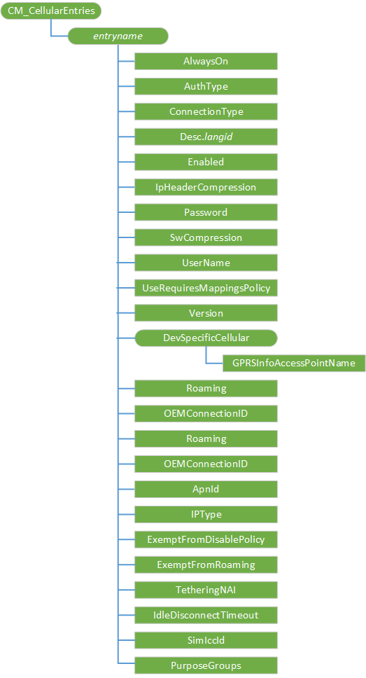

# CM\_CellularEntries CSP

The CM\_CellularEntries configuration service provider is used to configure the General Packet Radio Service (GPRS) entries on the device. It defines each GSM data access point.

This configuration service provider requires the ID\_CAP\_NETWORKING\_ADMIN capability to be accessed from a network configuration application.

The following diagram shows the CM\_CellularEntries configuration service provider management object in tree format as used by Open Mobile Alliance Client Provisioning (OMA CP). The OMA DM protocol is not supported with this configuration service provider.



<a href="" id="entryname"></a>**_entryname_**  
<p style="margin-left: 20px">Defines the name of the connection.</p>

<p style="margin-left: 20px">The [CMPolicy configuration service provider](cmpolicy-csp.md) uses the value of *entryname* to identify the connection that is associated with a policy and [CM\_ProxyEntries configuration service provider](cm-proxyentries-csp.md) uses the value of *entryname* to identify the connection that is associated with a proxy.</p>

<a href="" id="alwayson"></a>**AlwaysOn**  
<p style="margin-left: 20px">Type: Int. Specifies if the Connection Manager will automatically attempt to connect to the APN when a connection is available.

<p style="margin-left: 20px">A value of "0" specifies that AlwaysOn is not supported, and the Connection Manager will only attempt to connect to the APN when an application requests the connection. This setting is recommended for applications that use a connection occasionally, for example, an APN that only controls MMS.

<p style="margin-left: 20px">A value of "1" specifies that AlwaysOn is supported, and the Connection Manager will automatically attempt to connect to the APN when it is available. This setting is recommended for general purpose Internet APNs.

<p style="margin-left: 20px">There must be at least one AlwaysOn Internet connection provisioned for the mobile operator.

<a href="" id="authtype"></a>**AuthType**  
<p style="margin-left: 20px">Optional. Type: String. Specifies the method of authentication used for a connection.

<p style="margin-left: 20px">A value of "CHAP" specifies the Challenge Handshake Application Protocol. A value of "PAP" specifies the Password Authentication Protocol. A value of "None" specifies that the UserName and Password parameters are ignored. The default value is "None".

<a href="" id="connectiontype"></a>**ConnectionType**  
<p style="margin-left: 20px">Optional. Type: String. Specifies the type of connection used for the APN. The following connection types are available:

<table style="margin-left: 20px"><table>
<colgroup>
<col width="20%" />
<col width="80%" />
</colgroup>
<tbody>
<tr class="odd">
<td><p>gprs</p></td>
<td><p>Default. Used for GPRS type connections (GPRS + GSM + EDGE + UMTS + LTE).</p></td>
</tr>
<tr class="even">
<td><p>cdma</p></td>
<td><p>Used for CDMA type connections (1XRTT + EVDO).</p></td>
</tr>
<tr class="odd">
<td><p>lte</p></td>
<td><p>Used for LTE type connections (eHRPD + LTE) when the device is registered HOME.</p></td>
</tr>
<tr class="even">
<td><p>legacy</p></td>
<td><p>Used for GPRS + GSM + EDGE + UMTS connections.</p></td>
</tr>
<tr class="odd">
<td><p>lte_iwlan</p></td>
<td><p>Used for GPRS type connections that may be offloaded over WiFi</p></td>
</tr>
<tr class="even">
<td><p>iwlan</p></td>
<td><p>Used for connections that are implemented over WiFi offload only</p></td>
</tr>
</tbody>
</table>

 

<a href="" id="desc-langid"></a>**Desc.langid**  
<p style="margin-left: 20px">Optional. Specifies the UI display string used by the defined language ID.

<p style="margin-left: 20px"> A parameter name in the format of Desc.langid will be used as the language-specific identifier for the specified entry. For example, a parameter defined as `Desc.0409` with a value of `"GPRS Connection"` will force "GPRS Connection" to be displayed in the UI to represent this connection when the device is set to English language (language ID 0409). Descriptions for multiple languages may be provisioned using this mechanism, and the system will automatically switch among them if the user changes language preferences on the device. If no **Desc** parameter is provisioned for a given language, the system will default to the name used to create the entry.

<a href="" id="enabled"></a>**Enabled**  
<p style="margin-left: 20px"> Specifies if the connection is enabled.

<p style="margin-left: 20px"> A value of "0" specifies that the connection is disabled. A value of "1" specifies that the connection is enabled.

<a href="" id="ipheadercompression"></a>**IpHeaderCompression**  
<p style="margin-left: 20px"> Optional. Specifies if IP header compression is enabled.

<p style="margin-left: 20px"> A value of "0" specifies that IP header compression for the connection is disabled. A value of "1" specifies that IP header compression for the connection is enabled.

<a href="" id="password"></a>**Password**  
<p style="margin-left: 20px"> Required if AuthType is set to a value other than "None". Specifies the password used to connect to the APN.

<a href="" id="swcompression"></a>**SwCompression**  
<p style="margin-left: 20px"> Optional. Specifies if software compression is enabled.

<p style="margin-left: 20px"> A value of "0" specifies that software compression for the connection is disabled. A value of "1" specifies that software compression for the connection is enabled.

<a href="" id="username"></a>**UserName**  
<p style="margin-left: 20px"> Required if AuthType is set to a value other than "None". Specifies the user name used to connect to the APN.

<a href="" id="userequiresmappingspolicy"></a>**UseRequiresMappingsPolicy**  
<p style="margin-left: 20px"> Optional. Specifies if the connection requires a corresponding mappings policy.

<p style="margin-left: 20px"> A value of "0" specifies that the connection can be used for any general Internet communications. A value of "1" specifies that the connection is only used if a mapping policy is present.

<p style="margin-left: 20px"> For example, if the multimedia messaging service (MMS) APN should not have any other traffic except MMS, you can configure a mapping policy that sends MMS traffic to this connection. Then, you set the value of UseRequiresMappingsPolicy to be equal to "1" and Connection Manager will only use the connection for MMS traffic. Without this, Connection Manager will try to use the connection for any general purpose Internet traffic.

<a href="" id="version"></a>**Version**  
<p style="margin-left: 20px"> Type: Int. Specifies the XML version number and is used to verify that the XML is supported by Connection Manager's configuration service provider.

<p style="margin-left: 20px"> This value must be "1" if included.

<a href="" id="gprsinfoaccesspointname"></a>**GPRSInfoAccessPointName**  
<p style="margin-left: 20px"> Specifies the logical name to select the GPRS gateway. For more information about allowable values, see GSM specification 07.07 "10.1.1 Define PDP Context +CGDCONT".

<a href="" id="roaming"></a>**Roaming**  
<p style="margin-left: 20px"> Optional. Type: Int. This parameter specifies the roaming conditions under which the connection should be activated. The following conditions are available:

-   0 - Home network only.
-   1 (default)- All roaming conditions (home and roaming).
-   2 - Home and domestic roaming only.
-   3 - Domestic roaming only.
-   4 - Non-domestic roaming only.
-   5 - Roaming only.

<a href="" id="oemconnectionid"></a>**OEMConnectionID**  
<p style="margin-left: 20px"> Optional. Type: GUID. Specifies a GUID to use to identify a specific connection in the modem. If a value is not specified, the default value is 00000000-0000-0000-0000-000000000000. This parameter is only used on LTE devices.

<a href="" id="apnid"></a>**ApnId**  
<p style="margin-left: 20px"> Optional. Type: Int. Specifies the purpose of the APN. If a value is not specified, the default value is "0" (none). This parameter is only used on LTE devices.

<a href="" id="iptype"></a>**IPType**  
<p style="margin-left: 20px"> Optional. Type: String. Specifies the network protocol of the connection. Available values are "IPv4", "IPv6", "IPv4v6", and "IPv4v6xlat". If a value is not specified, the default value is "IPv4".

> [!Warning]  
> Do not use IPv6 or IPv4v6xlat on a device or network that does not support IPv6. Data functionality will not work. In addition, the device will not be able to connect to a roaming network that does not support IPv6 unless you configure roaming connections with an IPType of IPv4v6.

 

<a href="" id="exemptfromdisablepolicy"></a>**ExemptFromDisablePolicy**  
<p style="margin-left: 20px"> Added back in Windows 10, version 1511. Optional. Type: Int. This should only be specified for special purpose connections whose applications directly manage their disable state (such as MMS). A value of "0" specifies that the connection is subject to the disable policy used by general purpose connections (not exempt). A value of "1" specifies that the connection is exempt. If a value is not specified, the default value is "0" (not exempt).

<p style="margin-left: 20px"> To allow MMS when data is set to OFF, set both ExemptFromDisablePolicy and UseRequiresMappingsPolicy to "1". This indicates that the connection is a dedicated MMS connection and that it should not be disabled when all other connections are disabled. As a result, MMS can be sent and received when data is set to OFF. Note that sending MMS while roaming is still not allowed.

> [!Important]  
> Do not set ExemptFromDisablePolicy to "1", ExemptFromRoaming to "1", or UseRequiresMappingsPolicy to "1" for general purpose connections.

<p style="margin-left: 20px"> To avoid UX inconsistency with certain value combinations of ExemptFromDisablePolicy and AllowMmsIfDataIsOff, when you do not set ExemptFromDisablePolicy to 1 (default is 0), you should:

-   Hide the toggle for AllowMmsIfDataIsOff by setting AllowMmsIfDataIsOffEnabled to 0 (default is 1)
-   Set AllowMMSIfDataIsOff to 1 (default is 0)

 

<a href="" id="exemptfromroaming"></a>**ExemptFromRoaming**  
<p style="margin-left: 20px"> Added back in Windows 10, version 1511. Optional. Type: Int. This should be specified only for special purpose connections whose applications directly manage their roaming state. It should never be used with general purpose connections. A value of "0" specifies that the connection is subject to the roaming policy (not exempt). A value of "1" specifies that the connection is exempt (unaffected by the roaming policy). If a value is not specified, the default value is "0" (not exempt).

<a href="" id="tetheringnai"></a>**TetheringNAI**  
<p style="margin-left: 20px"> Optional. Type: Int. CDMA only. Specifies if the connection is a tethering connection. A value of "0" specifies that the connection is not a tethering connection. A value of "1" specifies that the connection is a tethering connection. If a value is not specified, the default value is "0".

<a href="" id="idledisconnecttimeout"></a>**IdleDisconnectTimeout**  
<p style="margin-left: 20px"> Optional. Type: Int. Specifies how long an on-demand connection can be unused before Connection Manager tears the connection down. This value is specified in seconds. Valid value range is 5 to 60 seconds. If not specified, the default is 30 seconds.

> [!Important]  
<p style="margin-left: 20px"> You must specify the IdleDisconnectTimeout value when updating an on-demand connection to ensure that the desired value is still configured. If it is not specified, the default value of 30 seconds may be used.

 

> [!Note]  
> If tear-down/activation requests occur too frequently, this value should be set to greater than 5 seconds.

 

<a href="" id="simiccid"></a>**SimIccId**  
<p style="margin-left: 20px"> For single SIM phones, this parm is optional. However, it is highly recommended to include this value when creating future updates. For dual SIM phones, this parm is required. Type: String. Specifies the SIM ICCID that services the connection.

<a href="" id="purposegroups"></a>**PurposeGroups**  
<p style="margin-left: 20px"> Required. Type: String. Specifies the purposes of the connection by a comma-separated list of GUIDs representing purpose values. The following purpose values are available:

-   Internet - 3E5545D2-1137-4DC8-A198-33F1C657515F
-   LTE attach - 11A6FE68-5B47-4859-9CB6-1EAC96A8F0BD
-   MMS - 53E2C5D3-D13C-4068-AA38-9C48FF2E55A8
-   IMS - 474D66ED-0E4B-476B-A455-19BB1239ED13
-   SUPL - 6D42669F-52A9-408E-9493-1071DCC437BD
-   Purchase - 95522B2B-A6D1-4E40-960B-05E6D3F962AB  
-   Administrative - 2FFD9261-C23C-4D27-8DCF-CDE4E14A3364  
-   Application - 52D7654A-00A8-4140-806C-087D66705306
-   eSIM provisioning - A36E171F-2377-4965-88FE-1F53EB4B47C0

## Additional information


To delete a connection, you must first delete any associated proxies and then delete the connection. The following example shows how to delete the proxy and then the connection.

``` syntax
<wap-provisioningdoc>
   <characteristic type="CM_ProxyEntries">
      <nocharacteristic type="GPRS_Proxy"/>
   </characteristic>  
   <characteristic type="CM_CellularEntries">
      <nocharacteristic type="GPRS1"/>
   </characteristic>
</wap-provisioningdoc>
```

## OMA client provisioning examples


Configuring a GPRS connection:

``` syntax
<wap-provisioningdoc>
   <characteristic type="CM_CellularEntries">
      <characteristic type="GPRSConn">
         <parm name="ConnectionType" value="gprs" />
         <characteristic type="DevSpecificCellular">
            <parm name="GPRSInfoAccessPointName" value="apn.adatum.com" />
         </characteristic>
         <parm name="AlwaysOn" value="0" />
         <parm name="Enabled" value="1" />
      </characteristic>
   </characteristic>
</wap-provisioningdoc>
```

Configuring an LTE connection:

``` syntax
<wap-provisioningdoc>
   <characteristic type="CM_CellularEntries">
      <characteristic type="LteConn">
         <parm name="ConnectionType" value="lte" />
         <characteristic type="DevSpecificCellular">
            <parm name="GPRSInfoAccessPointName" value="INTERNET_LTE" />
         </characteristic>
         <parm name="ApnId" value="0" />
         <parm name="IPType" value="IPv4v6" />
         <parm name="Enabled" value="1" />
         <parm name="OemConnectionId" value="01234567-89AB-CDEF-0123-456789ABCDEF" />
      </characteristic> 
   </characteristic>
</wap-provisioningdoc>
```

Configuring a CDMA connection:

``` syntax
<wap-provisioningdoc>
   <characteristic type="CM_CellularEntries">
      <characteristic type="CDMAConn">
         <parm name="Version" value="1"/>
         <parm name="AuthType" value="chap" />
         <parm name="ConnectionType" value="cdma"/>
         <parm name="Enabled" value="1"/>
         <parm name="AlwaysOn" value="0"/>
         <parm name="UseRequiresMappingsPolicy" value="0"/>
         <parm name="UserName" value="user@adatum.com"/>
         <parm name="Password" value="fakeuserpassword"/>
      </characteristic>
   </characteristic>
</wap-provisioningdoc>
```

## Microsoft Custom Elements


The following table shows the Microsoft custom elements that this configuration service provider supports for OMA Client Provisioning.

<table>
<colgroup>
<col width="50%" />
<col width="50%" />
</colgroup>
<thead>
<tr class="header">
<th>Element</th>
<th>Available</th>
</tr>
</thead>
<tbody>
<tr class="odd">
<td><p>nocharacteristic</p></td>
<td><p>Yes</p></td>
</tr>
<tr class="even">
<td><p>characteristic-query</p></td>
<td><p>Yes</p></td>
</tr>
<tr class="odd">
<td><p>parm-query</p></td>
<td><p>Yes</p></td>
</tr>
</tbody>
</table>

 

## Related topics


[Configuration service provider reference](configuration-service-provider-reference.md)

 

 


