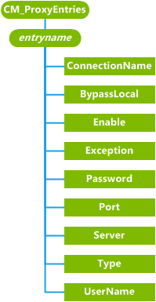

# CM\_ProxyEntries CSP


The CM\_ProxyEntries configuration service provider is used to configure proxy connections on the mobile device.

> **Note**  CM\_ProxyEntries CSP is only supported in Windows 10 Mobile.

 

> **Note**   This configuration service provider requires the ID\_CAP\_CSP\_FOUNDATION and ID\_CAP\_NETWORKING\_ADMIN capabilities to be accessed from a network configuration application.

 

The following diagram shows the CM\_ProxyEntries configuration service provider management object in tree format as used by Open Mobile Alliance Client Provisioning (OMA CP) and OMA Device Management(OMA DM). Support for OMA DM was added in Windows 10, version 1607.



<a href="" id="entryname"></a>**entryname**  
Defines the name of the connection proxy.

Each cellular entry can have only one proxy entry. For example, an Internet connection can have no more than one HTTP proxy specified but it might also have a WAP proxy. If two applications need access to the same APN but one application needs a proxy and the other application cannot have a proxy, two entries can be created with different names for the same APN.

<a href="" id="connectionname"></a>**ConnectionName**  
Specifies the name of the connection the proxy is associated with. This is the APN name of a connection configured using the [CM\_CellularEntries configuration service provider](cm-cellularentries-csp.md).

<a href="" id="bypasslocal"></a>**BypassLocal**  
Specifies if the proxy should be bypassed when local hosts are accessed by the device.

A value of "0" specifies that the proxy bypass for local hosts is disabled. A value of "1" specifies that the proxy bypass for local hosts is enabled.

<a href="" id="enable"></a>**Enable**  
Specifies if the proxy is enabled.

A value of "0" specifies that the proxy is disabled. A value of "1" specifies that the proxy is enabled.

<a href="" id="exception"></a>**Exception**  
Specifies a list of external hosts which should bypass the proxy when accessed.

The exception list is a semi-colon delimited list of host names. For example, to bypass the proxy when either MSN or Yahoo is accessed, the value for the Exception list would be "www.msn.com;www.yahoo.com".

<a href="" id="password"></a>**Password**  
Specifies the password used to connect to the proxy.

Passwords are only required for WAP and SOCKS proxies and are not used for HTTP proxies. Queries of this parameter return a string composed of asterisks (\*).

When setting the password, passing in the same string causes the new password to be ignored and does not change the existing password.

<a href="" id="port"></a>**Port**  
Specifies the port number of the proxy server.

<a href="" id="server"></a>**Server**  
Specifies the name of the proxy server.

<a href="" id="type"></a>**Type**  
Specifies the type of proxy connection for this entry.

The following list enumerates the values allowed for the Type parameter.

-   "0" = Null proxy

-   "1" = HTTP proxy

-   "2" = WAP proxy

-   "4" = SOCKS4 proxy

-   "5" = SOCKS5 proxy

The Null proxy can be used to allow Connection Manager to treat one network as a super set of another network by creating a null proxy from one network to the other.

<a href="" id="username"></a>**UserName**  
Specifies the username used to connect to the proxy.

## Additional information


To delete both a proxy and its associated connection, you must delete the proxy first, and then delete the connection. The following example shows how to delete the proxy and then the connection.

``` syntax
<wap-provisioningdoc>
   <characteristic type="CM_ProxyEntries">
      <nocharacteristic type="GPRS_Proxy"/>
   </characteristic>  
   <characteristic type="CM_CellularEntries">
      <nocharacteristic type="GPRS1"/>
   </characteristic>
</wap-provisioningdoc>
```

## Microsoft Custom Elements


The following table shows the Microsoft custom elements that this configuration service provider supports for OMA Client Provisioning.

<table>
<colgroup>
<col width="50%" />
<col width="50%" />
</colgroup>
<thead>
<tr class="header">
<th>Element</th>
<th>Available</th>
</tr>
</thead>
<tbody>
<tr class="odd">
<td><p>parm-query</p></td>
<td><p>Yes</p></td>
</tr>
<tr class="even">
<td><p>nocharacteristic</p></td>
<td><p>Yes</p></td>
</tr>
<tr class="odd">
<td><p>characteristic-query</p></td>
<td><p>Yes</p>
<p>Recursive query: Yes</p>
<p>Top level query: Yes</p></td>
</tr>
</tbody>
</table>

 

## Related topics


[Configuration service provider reference](configuration-service-provider-reference.md)

 

 


