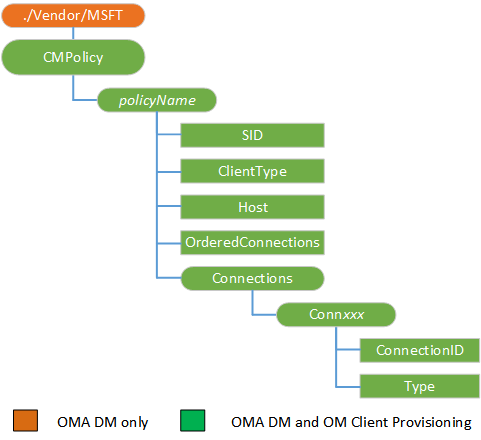

# CMPolicy CSP


The CMPolicy configuration service provider defines rules that the Connection Manager uses to identify the correct connection for a connection request.

> **Note**  
This configuration service provider requires the ID\_CAP\_CSP\_FOUNDATION and ID\_CAP\_NETWORKING\_ADMIN capabilities to be accessed from a network configuration application.

 

Each policy entry identifies one or more applications in combination with a host pattern. The policy entry is assigned a list of connection details that Connection Manager uses to satisfy connection requests matching the application and host patterns. CMPolicy configuration service provider can have multiple policies

**Policy Ordering**: There is no explicit ordering of policies. The general rule is that the most concrete or specific policy mappings take a higher precedence.

**Default Policies**: Policies are applied in order of their scope with the most specific policies considered before the more general policies. The phone’s default behavior applies to all applications and all domains and is only used when no other, more specific policy is available. The default policy is to use any available Wi-Fi network first and then any available APN.

The following diagram shows the CMPolicy configuration service provider management object in tree format as used by both Open Mobile Alliance (OMA) Client Provisioning and OMA Device Management.



<a href="" id="policyname"></a>***policyName***  
Defines the name of the policy.

<a href="" id="sid"></a>**SID**  
The value of SID depends on the ClientType.

For Universal Windows Platform (UWP) app-based mapping policies, SID is the Package family name without curly brackets {}, not the application.

For non-UWP application-based mapping policies, SID is the application product ID in GUID format. The curly brackets {} around the GUID are required.

For host-based mapping policies, SID must be set to `*`.

<a href="" id="clienttype"></a>**ClientType**  
Specifies the mapping policy type.

The following list describes the available mapping policy types:

-   Application-based mapping policies are applied to applications. To specify this mapping type, use the value `app`.

-   Host-based mapping policies are applied to all types of clients requesting connections to specified host(s). To specify this mapping type, use the value `*`.

<a href="" id="host"></a>**Host**  
Specifies the name of a host pattern. The host name is matched to the connection request to select the right policy to use.

The host pattern can have two wild cards, "\*" and "+". The host pattern is not a URL pattern and there is no concept of transport or paths on the specific host. For example, the host pattern might be "\*.host\_name.com" to match any prefix to the host\_name.com domains. The host pattern will match "www.host\_name.com" and "mail.host\_name.com", but it will not match "host\_name.com".

<a href="" id="orderedconnections"></a>**OrderedConnections**  
Specifies whether the list of connections is in preference order.

A value of "0" specifies that the connections are not listed in order of preference. A value of "1" indicates that the listed connections are in order of preference.

<a href="" id="connxxx"></a>**Conn**<strong>*XXX*</strong>  
Enumerates the connections associated with the policy. Element names begin with "Conn" followed by three digits which increment starting from "000". For example, a policy which applied to five connections would have element entries named "Conn000", "Conn001", "Conn002", "Conn003", and "Conn004".

<a href="" id="connectionid"></a>**ConnectionID**  
Specifies a unique identifier for a connection within a group of connections. The exact value is based on the Type parameter.

For `CMST_CONNECTION_NAME`, specify the connection name. For example, if you have a connection configured by using the CM\_CellularEntries configuration service provider, the connection name could be the name of the connection. If you have a NAP configured with the NAPID set to “GPRS1”, the connection name could be “GPRS1@WAP”.

For `CMST_CONNECTION_TYPE`, specify the GUID for the desired connection type. The curly brackets {} around the GUID are required. The following connection types are available:

<table>
<colgroup>
<col width="20%" />
<col width="80%" />
</colgroup>
<thead>
<tr class="header">
<th>Connection type</th>
<th>GUID</th>
</tr>
</thead>
<tbody>
<tr class="odd">
<td><p>GSM</p></td>
<td><p>{A05DC613-E393-40ad-AA89-CCCE04277CD9}</p></td>
</tr>
<tr class="even">
<td><p>CDMA</p></td>
<td><p>{274AD55A-4A70-4E35-93B3-AE2D2E6727FC}</p></td>
</tr>
<tr class="odd">
<td><p>Legacy 3GPP</p></td>
<td><p>{6DE4C04B-B74E-47FA-99E5-8F2097C06A92}</p></td>
</tr>
<tr class="even">
<td><p>LTE</p></td>
<td><p>{2378E547-8312-46A5-905E-5C581E92693B}</p></td>
</tr>
<tr class="odd">
<td><p>Wi-Fi</p></td>
<td><p>{8568B401-858E-4B7B-B3DF-0FD4927F131B}</p></td>
</tr>
<tr class="even">
<td><p>Wi-Fi hotspot</p></td>
<td><p>{072FC7DC-1D93-40D1-9BB0-2114D7D73434}</p></td>
</tr>
</tbody>
</table>

 

For `CMST_CONNECTION_NETWORK_TYPE`, specify the GUID for the desired network type. The curly brackets {} around the GUID are required. The following network types are available:

<table>
<colgroup>
<col width="20%" />
<col width="80%" />
</colgroup>
<thead>
<tr class="header">
<th>Network type</th>
<th>GUID</th>
</tr>
</thead>
<tbody>
<tr class="odd">
<td><p>GPRS</p></td>
<td><p>{AFB7D659-FC1F-4EA5-BDD0-0FDA62676D96}</p></td>
</tr>
<tr class="even">
<td><p>1XRTT</p></td>
<td><p>{B1E700AE-A62F-49FF-9BBE-B880C995F27D}</p></td>
</tr>
<tr class="odd">
<td><p>EDGE</p></td>
<td><p>{C347F8EC-7095-423D-B838-7C7A7F38CD03}</p></td>
</tr>
<tr class="even">
<td><p>WCDMA UMTS</p></td>
<td><p>{A72F04C6-9BE6-4151-B5EF-15A53E12C482}</p></td>
</tr>
<tr class="odd">
<td><p>WCDMA FOMA</p></td>
<td><p>{B8326098-F845-42F3-804E-8CC3FF7B50B4}</p></td>
</tr>
<tr class="even">
<td><p>1XEVDO</p></td>
<td><p>{DD42DF39-EBDF-407C-8146-1685416401B2}</p></td>
</tr>
<tr class="odd">
<td><p>1XEVDV</p></td>
<td><p>{61BF1BFD-5218-4CD4-949C-241CA3F326F6}</p></td>
</tr>
<tr class="even">
<td><p>HSPA HSDPA</p></td>
<td><p>{047F7282-BABD-4893-AA77-B8B312657F8C}</p></td>
</tr>
<tr class="odd">
<td><p>HSPA HSUPA</p></td>
<td><p>{1536A1C6-A4AF-423C-8884-6BDDA3656F84}</p></td>
</tr>
<tr class="even">
<td><p>LTE</p></td>
<td><p>{B41CBF43-6994-46FF-9C2F-D6CA6D45889B}</p></td>
</tr>
<tr class="odd">
<td><p>EHRPD</p></td>
<td><p>{7CFA04A5-0F3F-445C-88A4-C86ED2AD94EA}</p></td>
</tr>
<tr class="even">
<td><p>Ethernet 10Mbps</p></td>
<td><p>{97D3D1B3-854A-4C32-BD1C-C13069078370}</p></td>
</tr>
<tr class="odd">
<td><p>Ethernet 100Mbps</p></td>
<td><p>{A8F4FE66-8D04-43F5-9DD2-2A85BD21029B}</p></td>
</tr>
<tr class="even">
<td><p>Ethernet Gbps</p></td>
<td><p>{556C1E6B-B8D4-448E-836D-9451BA4CCE75}</p></td>
</tr>
</tbody>
</table>

 

For `CMST_CONNECTION_DEVICE_TYPE`, specify the GUID for the desired device type. The curly brackets {} around the GUID are required. The following device types are available:

<table>
<colgroup>
<col width="20%" />
<col width="80%" />
</colgroup>
<thead>
<tr class="header">
<th>Device type</th>
<th>GUID</th>
</tr>
</thead>
<tbody>
<tr class="odd">
<td><p>Cellular device</p></td>
<td><p>{F9A53167-4016-4198-9B41-86D9522DC019}</p></td>
</tr>
<tr class="even">
<td><p>Ethernet</p></td>
<td><p>{97844272-00C7-4572-B20A-D8D861C095F2}</p></td>
</tr>
<tr class="odd">
<td><p>Bluetooth</p></td>
<td><p>{1D793123-701A-4fd0-B6AE-9C3C57E99C2C}</p></td>
</tr>
<tr class="even">
<td><p>Virtual</p></td>
<td><p>{EAA02CE5-9C70-4E87-97FE-55C9DEC847D4}</p></td>
</tr>
</tbody>
</table>

 

<a href="" id="type"></a>**Type**  
Specifies the type of connection being referenced. The following list describes the available connection types:

-   `CMST_CONNECTION_NAME` – A connection specified by name.

-   `CMST_CONNECTION_TYPE` – Any connection of a specified type.

-   `CMST_CONNECTION_NETWORK_TYPE` – Any connection of a specified network type.

-   `CMST_CONNECTION_DEVICE_TYPE` – Any connection of the specified device type.

## OMA client provisioning examples


Adding an application-based mapping policy. In this example, the ConnectionId for type CMST\_CONNECTION\_NAME is set to the name of the connection (“GPRSConn1”) that is configured with the CM\_CellularEntries configuration service provider.

```xml
<wap-provisioningdoc>

   <characteristic type="CM_CellularEntries">
       <characteristic type="GPRSConn1">
          <parm name="ConnectionType" value="gprs" />
             <characteristic type="DevSpecificCellular">
                <parm name="GPRSInfoAccessPointName" value="apn.adatum.com" />
         </characteristic>
          <parm name="AlwaysOn" value="0" />
          <parm name="Enabled" value="1" />
       </characteristic>
    </characteristic>

   <characteristic type="CMPolicy">
      <characteristic type="Policy1">
       <parm name="SID" value="{A05D1234-F393-9385-AA89-CD3E049367D2}" />
       <parm name="ClientType" value="app" />
       <parm name="Host" value="*.+" />
       <parm name="OrderedConnections" value="1" />
       <characteristic type="Connections">
           <characteristic type="Conn000">
               <parm name="Type" value="CMST_CONNECTION_DEVICE_TYPE" /> 
               <parm name="ConnectionId" value="{F9A53167-4016-4198-9B41-86D9522DC019}" /> 
           </characteristic>
           <characteristic type="Conn001">
               <parm name="Type" value="CMST_CONNECTION_NETWORK_TYPE" /> 
               <parm name="ConnectionId" value="{AFB7D659-FC1F-4EA5-BDD0-0FDA62676D96}" /> 
           </characteristic>
           <characteristic type="Conn002">
               <parm name="Type" value="CMST_CONNECTION_NAME" /> 
               <parm name="ConnectionId" value="GPRSConn1" /> 
           </characteristic>
           <characteristic type="Conn003">
              <parm name="Type" value="CMST_CONNECTION_TYPE" /> 
              <parm name="ConnectionId" value="{072FC7DC-1D93-40d1-9BB0-2114D7D73434}" /> 
           </characteristic>
       </characteristic>
      </characteristic>
    </characteristic>
</wap-provisioningdoc>
```

Adding a host-based mapping policy. In this example, the ConnectionId for type CMST\_CONNECTION\_NAME is set to the name of the connection (“GPRSConn1”) that is configured with the CM\_CellularEntries configuration service provider.

```xml
<wap-provisioningdoc>

   <characteristic type="CM_CellularEntries">
       <characteristic type="GPRSConn1">
          <parm name="ConnectionType" value="gprs" />
             <characteristic type="DevSpecificCellular">
                <parm name="GPRSInfoAccessPointName" value="apn.adatum.com" />
         </characteristic>
          <parm name="AlwaysOn" value="0" />
          <parm name="Enabled" value="1" />
       </characteristic>
    </characteristic>

   <characteristic type="CMPolicy">
      <characteristic type="Policy3">
       <parm name="SID" value="*" />
       <parm name="ClientType" value="*" />
       <parm name="Host" value="*.contoso.com" />
       <parm name="OrderedConnections" value="1" />
       <characteristic type="Connections">
           <characteristic type="Conn000">
               <parm name="Type" value="CMST_CONNECTION_DEVICE_TYPE" /> 
               <parm name="ConnectionId" value="{F9A53167-4016-4198-9B41-86D9522DC019}" /> 
           </characteristic>
           <characteristic type="Conn001">
               <parm name="Type" value="CMST_CONNECTION_NETWORK_TYPE" /> 
               <parm name="ConnectionId" value="{AFB7D659-FC1F-4EA5-BDD0-0FDA62676D96}" /> 
           </characteristic>
           <characteristic type="Conn002">
               <parm name="Type" value="CMST_CONNECTION_NAME" /> 
               <parm name="ConnectionId" value="GPRSConn1" /> 
           </characteristic>
           <characteristic type="Conn003">
               <parm name="Type" value="CMST_CONNECTION_TYPE" /> 
               <parm name="ConnectionId" value="{072FC7DC-1D93-40d1-9BB0-2114D7D73434}" /> 
           </characteristic>
       </characteristic>
      </characteristic>
    </characteristic>

</wap-provisioningdoc>
```

## OMA DM examples


Adding an application-based mapping policy:

```xml
<SyncML>
    <SyncBody>
        <Atomic>
    <CmdID>8000</CmdID>
    <Add>
        <CmdID>8051</CmdID>
        <Item>
            <Target>
                <LocURI>./Vendor/MSFT/CMPolicy/BTHPolicy4/SID</LocURI>
            </Target>
            <Data>{A05D1234-F393-9385-AA89-CD3E049367D2}</Data>
        </Item>
    </Add>
    <Add>
        <CmdID>8052</CmdID>
        <Item>
            <Target>
                <LocURI>./Vendor/MSFT/CMPolicy/BTHPolicy4/ClientType</LocURI>
            </Target>
            <Data>app</Data>
        </Item>
    </Add>
    <Add>
        <CmdID>8053</CmdID>
        <Item>
            <Target>
                <LocURI>./Vendor/MSFT/CMPolicy/BTHPolicy4/Host</LocURI>
            </Target>
            <Data>*.+</Data>
        </Item>
    </Add>
    <Add>
        <CmdID>8054</CmdID>
        <Item>
            <Target>
                <LocURI>./Vendor/MSFT/CMPolicy/BTHPolicy4/OrderedConnections</LocURI>
            </Target>
            <Data>1</Data>
        </Item>
    </Add>
    <Add>
        <CmdID>8055</CmdID>
        <Item>
            <Target>
                <LocURI>./Vendor/MSFT/CMPolicy/BTHPolicy4/Connections/Conn000/ConnectionId</LocURI>
            </Target>
            <Data>{A05DC613-E393-40AD-AA89-CCCE04277CD9}</Data>
        </Item>
    </Add>
    <Add>
        <CmdID>8056</CmdID>
        <Item>
            <Target>
                <LocURI>./Vendor/MSFT/CMPolicy/BTHPolicy4/Connections/Conn000/Type</LocURI>
            </Target>
            <Data>CMST_CONNECTION_DEVICE_TYPE</Data>
        </Item>
    </Add>
        </Atomic> 
        <Final/>
    </SyncBody>
</SyncML>
```

Adding a host-based mapping policy:

```xml
<SyncML>
    <SyncBody>
        <Atomic>
    <CmdID>8000</CmdID>
    <Add>
        <CmdID>8049</CmdID>
        <Item>
            <Target>
                <LocURI>./Vendor/MSFT/CMPolicy/BTHPolicy6/SID</LocURI>
            </Target>
            <Data>*</Data>
        </Item>
    </Add>
    <Add>
        <CmdID>8050</CmdID>
        <Item>
            <Target>
                <LocURI>./Vendor/MSFT/CMPolicy/BTHPolicy6/ClientType</LocURI>
            </Target>
            <Data>*</Data>
        </Item>
    </Add>
    <Add>
        <CmdID>8051</CmdID>
        <Item>
            <Target>
                <LocURI>./Vendor/MSFT/CMPolicy/BTHPolicy6/Host</LocURI>
            </Target>
            <Data>*.contoso.com</Data>
        </Item>
    </Add>
    <Add>
        <CmdID>8052</CmdID>
        <Item>
            <Target>
                <LocURI>./Vendor/MSFT/CMPolicy/BTHPolicy6/OrderedConnections</LocURI>
            </Target>
            <Data>1</Data>
        </Item>
    </Add>
    <Add>
        <CmdID>8053</CmdID>
        <Item>
            <Target>
                <LocURI>./Vendor/MSFT/CMPolicy/BTHPolicy6/Connections/Conn000/ConnectionId</LocURI>
            </Target>
            <Data>{AFB7D659-FC1F-4EA5-BDD0-0FDA62676D96}</Data>
        </Item>
    </Add>
    <Add>
        <CmdID>8054</CmdID>
        <Item>
            <Target>
                <LocURI>./Vendor/MSFT/CMPolicy/BTHPolicy6/Connections/Conn000/Type</LocURI>
            </Target>
            <Data>CMST_CONNECTION_NETWORK_TYPE</Data>
        </Item>
    </Add>
        </Atomic>
        <Final/>
    </SyncBody>
</SyncML>
```

## Microsoft Custom Elements


<table>
<colgroup>
<col width="50%" />
<col width="50%" />
</colgroup>
<thead>
<tr class="header">
<th>Element</th>
<th>Available</th>
</tr>
</thead>
<tbody>
<tr class="odd">
<td><p>parm-query</p></td>
<td><p>Yes</p></td>
</tr>
<tr class="even">
<td><p>nocharacteristic</p></td>
<td><p>Yes</p></td>
</tr>
<tr class="odd">
<td><p>characteristic-query</p></td>
<td><p>Yes</p>
<p>Recursive query: Yes</p>
<p>Top level query: Yes</p></td>
</tr>
</tbody>
</table>

 

## Related topics


[Configuration service provider reference](configuration-service-provider-reference.md)

 

 


