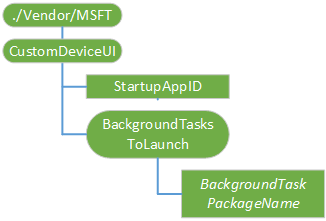

# CustomDeviceUI CSP

The CustomDeviceUI configuration service provider allows OEMs to implement their custom foreground application, as well as the background tasks to run on an IoT device running IoT Core. Only one foreground application is supported per device. Multiple background tasks are supported.
The following diagram shows the CustomDeviceUI configuration service provider in tree format as used by both the Open Mobile Alliance (OMA) Device Management (DM) and OMA Client Provisioning.

> **Note**  This configuration service provider only applies to Windows 10 IoT Core (IoT Core).



<a href="" id="./Vendor/MSFT/CustomDeviceUI"></a>**./Vendor/MSFT/CustomDeviceUI**  
The root node for the CustomDeviceUI configuration service provider. The supported operation is Get.

<a href="" id="StartupAppID"></a>**StartupAppID**  
AppID string value is the default appid/AUMID to launch during startup. The supported operations are Get and Replace.

<a href="" id="BackgroundTasksToLaunch"></a>**BackgroundTasksToLaunch**  
List of package names of background tasks that need to be launched on device startup. The supported operation is Get.

<a href="" id="BackgroundTasksToLaunch/BackgroundTaskPackageName"></a>**BackgroundTasksToLaunch/****_BackgroundTaskPackageName_**  
Package Full Name of the App that needs be launched in the background. This can contain no entry points, a single entry point, or multiple entry points. The supported operations are Add, Delete, Get, and Replace.

## SyncML examples


**Set StartupAppID**

``` syntax
<SyncML xmlns="SYNCML:SYNCML1.2">
  <SyncBody>      
        <Replace>
          <CmdID>1</CmdID>
          <Item>
            <Target>
              <LocURI>./Vendor/MSFT/CustomDeviceUI/StartupAppID</LocURI>
            </Target>       
             <Meta>
                <Format xmlns="syncml:metinf">chr</Format>
            </Meta>
            <Data>DefaultApp_cw5n1h2txyewy!App</Data>
        </Item>
        </Replace>        
     <Final/>
  </SyncBody>
</SyncML>
```

**Get all background tasks**

``` syntax
<SyncML xmlns="SYNCML:SYNCML1.2">
  <SyncBody>      
        <Get>
          <CmdID>1</CmdID>
          <Item>
            <Target>
                <LocURI>./Vendor/MSFT/CustomDeviceUI/BackgroundTaskstoLaunch?list=Struct</LocURI>
            </Target>
          </Item>
        </Get>        
     <Final/>
  </SyncBody>
</SyncML>
```

**Add background task**

``` syntax
<SyncML xmlns="SYNCML:SYNCML1.2">
  <SyncBody>      
        <Add>
          <CmdID>1</CmdID>
          <Item>
            <Target>
              <LocURI>./Vendor/MSFT/CustomDeviceUI/BackgroundTaskstoLaunch/BackgroundService1_1.3.0.1_neutral__8wekyb3d8bbwe</LocURI>
            </Target>
            <Meta>
                <Format xmlns="syncml:metinf">chr</Format>
            </Meta>
            <Data>0</Data>
          </Item>
        </Add>        
     <Final/>
  </SyncBody>
</SyncML>
```

 

 


