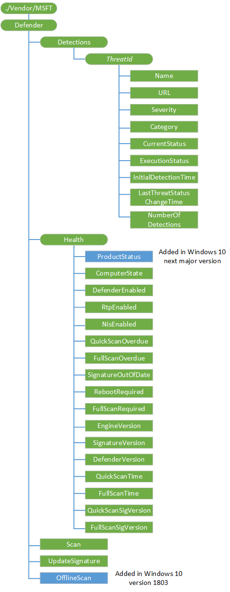

# Defender CSP

The Windows Defender configuration service provider is used to configure various Windows Defender actions across the enterprise.

The following image shows the Windows Defender configuration service provider in tree format

**Detections**  
An interior node to group all threats detected by Windows Defender.

Supported operation is Get.

**Detections/****_ThreatId_**  
The ID of a threat that has been detected by Windows Defender.

Supported operation is Get.

**Detections/*ThreatId*/Name**  
The name of the specific threat.

The data type is a string.

Supported operation is Get.

**Detections/*ThreatId*/URL**  
URL link for additional threat information.

The data type is a string.

Supported operation is Get.

**Detections/*ThreatId*/Severity**  
Threat severity ID.

The data type is a integer.

The following list shows the supported values:

-   0 = Unknown
-   1 = Low
-   2 = Moderate
-   4 = High
-   5 = Severe

Supported operation is Get.

**Detections/*ThreatId*/Category**  
Threat category ID.

The data type is a integer.

The following table describes the supported values:

| Value | Description                 |
|-------|-----------------------------|
| 0     | Invalid                     |
| 1     | Adware                      |
| 2     | Spyware                     |
| 3     | Password stealer            |
| 4     | Trojan downloader           |
| 5     | Worm                        |
| 6     | Backdoor                    |
| 7     | Remote access Trojan        |
| 8     | Trojan                      |
| 9     | Email flooder               |
| 10    | Keylogger                   |
| 11    | Dialer                      |
| 12    | Monitoring software         |
| 13    | Browser modifier            |
| 14    | Cookie                      |
| 15    | Browser plugin              |
| 16    | AOL exploit                 |
| 17    | Nuker                       |
| 18    | Security disabler           |
| 19    | Joke program                |
| 20    | Hostile ActiveX control     |
| 21    | Software bundler            |
| 22    | Stealth modifier            |
| 23    | Settings modifier           |
| 24    | Toolbar                     |
| 25    | Remote control software     |
| 26    | Trojan FTP                  |
| 27    | Potential unwanted software |
| 28    | ICQ exploit                 |
| 29    | Trojan telnet               |
| 30    | Exploit                     |
| 31    | File sharing program        |
| 32    | Malware creation tool       |
| 33    | Remote control software     |
| 34    | Tool                        |
| 36    | Trojan denial of service    |
| 37    | Trojan dropper              |
| 38    | Trojan mass mailer          |
| 39    | Trojan monitoring software  |
| 40    | Trojan proxy server         |
| 42    | Virus                       |
| 43    | Known                       |
| 44    | Unknown                     |
| 45    | SPP                         |
| 46    | Behavior                    |
| 47    | Vulnerability               |
| 48    | Policy                      |

 

Supported operation is Get.

**Detections/*ThreatId*/CurrentStatus**  
Information about the current status of the threat.

The data type is a integer.

The following list shows the supported values:

-   0 = Unknown
-   1 = Detected
-   2 = Cleaned
-   3 = Quarantined
-   4 = Removed
-   5 = Allowed
-   6 = Blocked
-   102 = Clean failed
-   103 = Quarantine failed
-   104 = Remove failed
-   105 = Allow failed
-   106 = Abandoned
-   107 = Block failed

Supported operation is Get.

**Detections/*ThreatId*/ExecutionStatus**  
Information about the execution status of the threat.

The data type is a integer.

Supported operation is Get.

**Detections/*ThreatId*/InitialDetectionTime**  
The first time this particular threat was detected.

The data type is a string.

Supported operation is Get.

**Detections/*ThreatId*/LastThreatStatusChangeTime**  
The last time this particular threat was changed.

The data type is a string.

Supported operation is Get.

**Detections/*ThreatId*/NumberOfDetections**  
Number of times this threat has been detected on a particular client.

The data type is a integer.

Supported operation is Get.

**Health**  
An interior node to group information about Windows Defender health status.

Supported operation is Get.

**Health/ComputerState**  
Provide the current state of the device.

The data type is a integer.

The following list shows the supported values:

-   0 = Clean
-   1 = Pending full scan
-   2 = Pending reboot
-   4 = Pending manual steps
-   8 = Pending offline scan
-   16 = Pending critical failure

Supported operation is Get.

**Health/DefenderEnabled**  
Indicates whether the Windows Defender service is running.

The data type is a boolean.

Supported operation is Get.

**Health/RtpEnabled**  
Indicates whether real-time protection is running.

The data type is a boolean.

Supported operation is Get.

**Health/NisEnabled**  
Indicates whether network protection is running.

The data type is a boolean.

Supported operation is Get.

**Health/QuickScanOverdue**  
Indicates whether a Windows Defender quick scan is overdue for the device.

The data type is a boolean.

Supported operation is Get.

**Health/FullScanOverdue**  
Indicates whether a Windows Defender full scan is overdue for the device.

The data type is a boolean.

Supported operation is Get.

**Health/SignatureOutOfDate**  
Indicates whether the Windows Defender signature is outdated.

The data type is a boolean.

Supported operation is Get.

**Health/RebootRequired**  
Indicates whether a device reboot is needed.

The data type is a boolean.

Supported operation is Get.

**Health/FullScanRequired**  
Indicates whether a Windows Defender full scan is required.

The data type is a boolean.

Supported operation is Get.

**Health/EngineVersion**  
Version number of the current Windows Defender engine on the device.

The data type is a string.

Supported operation is Get.

**Health/SignatureVersion**  
Version number of the current Windows Defender signatures on the device.

The data type is a string.

Supported operation is Get.

**Health/DefenderVersion**  
Version number of Windows Defender on the device.

The data type is a string.

Supported operation is Get.

**Health/QuickScanTime**  
Time of the last Windows Defender quick scan of the device.

The data type is a string.

Supported operation is Get.

**Health/FullScanTime**  
Time of the last Windows Defender full scan of the device.

The data type is a string.

Supported operation is Get.

**Health/QuickScanSigVersion**  
Signature version used for the last quick scan of the device.

The data type is a string.

Supported operation is Get.

**Health/FullScanSigVersion**  
Signature version used for the last full scan of the device.

The data type is a string.

Supported operation is Get.

**Scan**  
Node that can be used to start a Windows Defender scan on a device.

Valid values are:
- 1 - quick scan
- 2 - full scan

Supported operations are Get and Execute.

**UpdateSignature**  
Node that can be used to perform signature updates for Windows Defender.

Supported operations are Get and Execute.

## Related topics

[Configuration service provider reference](configuration-service-provider-reference.md)

 

 

