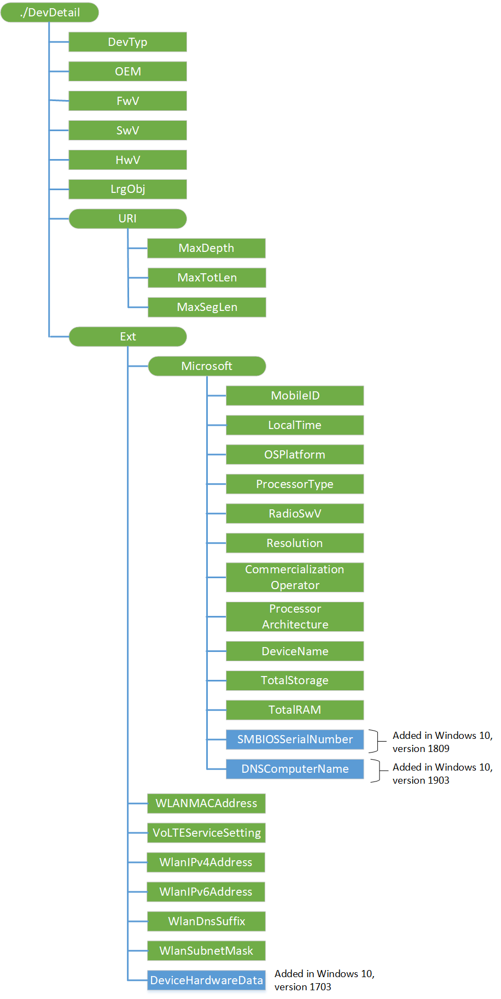

# DevDetail CSP

> [!WARNING]
> Some information relates to prereleased product which may be substantially modified before it's commercially released. Microsoft makes no warranties, express or implied, with respect to the information provided here.

The DevDetail configuration service provider handles the management object which provides device-specific parameters to the OMA DM server. These device parameters are not sent from the client to the server automatically, but can be queried by servers using OMA DM commands.

> [!NOTE]
> This configuration service provider requires the ID\_CAP\_CSP\_FOUNDATION and ID\_CAP\_DEVICE\_MANAGEMENT\_ADMIN capabilities to be accessed from a network configuration application.

For the DevDetail CSP, you cannot use the Replace command unless the node already exists.

The following diagram shows the DevDetail configuration service provider management object in tree format as used by OMA Device Management. The OMA Client Provisioning protocol is not supported for this configuration service provider.

**DevTyp**  

Required. Returns the device model name /SystemProductName as a string.

Supported operation is Get.

**OEM**  

Required. Returns the name of the Original Equipment Manufacturer (OEM) as a string, as defined in the specification SyncML Device Information, version 1.1.2.

Supported operation is Get.

**FwV**  

Required. Returns the firmware version, as defined in the registry key HKEY_LOCAL_MACHINE\System\Platform\DeviceTargetingInfo\PhoneFirmwareRevision.

For Windows 10 for desktop editions (Home, Pro, Enterprise, and Education), it returns the BIOS version as defined in the registry key HKEY_LOCAL_MACHINE\HARDWARE\DESCRIPTION\System\BIOS\BIOSVersion.

Supported operation is Get.

**SwV**  

Required. Returns the Windows 10 OS software version in the format MajorVersion.MinorVersion.BuildNumber.QFEnumber. Currently the BuildNumber returns the build number on the desktop and mobile build number on the phone. In the future, the build numbers may converge.

Supported operation is Get.

**HwV**  

Required. Returns the hardware version, as defined in the registry key HKEY_LOCAL_MACHINE\System\Platform\DeviceTargetingInfo\PhoneRadioHardwareRevision.

For Windows 10 for desktop editions, it returns the BIOS version as defined in the registry key HKEY_LOCAL_MACHINE\HARDWARE\DESCRIPTION\System\BIOS\BIOSVersion.

Supported operation is Get.

**LrgObj**  

Required. Returns whether the device uses OMA DM Large Object Handling, as defined in the specification SyncML Device Information, version 1.1.2.

Supported operation is Get.

**URI/MaxDepth**  

Required. Returns the maximum depth of the management tree that the device supports. The default is zero (0).

Supported operation is Get.

This is the maximum number of URI segments that the device supports. The default value zero (0) indicates that the device supports a URI of unlimited depth.

**URI/MaxTotLen**  

Required. Returns the maximum total length of any URI used to address a node or node property. The default is zero (0).

Supported operation is Get.

This is the largest number of characters in the URI that the device supports. The default value zero (0) indicates that the device supports a URI of unlimited length.

**URI/MaxSegLen**  

Required. Returns the total length of any URI segment in a URI that addresses a node or node property. The default is zero (0).

Supported operation is Get.

This is the largest number of characters that the device can support in a single URI segment. The default value zero (0) indicates that the device supports URI segment of unlimited length.

**Ext/Microsoft/MobileID**  

Required. Returns the mobile device ID associated with the cellular network. Returns 404 for devices that do not have a cellular network support.

Supported operation is Get.

The IMSI value is returned for GSM and UMTS networks. CDMA and worldwide phones will return a 404 Not Found status code error if queried for this element.

**Ext/Microsoft/LocalTime**  

Required. Returns the client local time in ISO 8601 format.

Supported operation is Get.

**Ext/Microsoft/OSPlatform**  

Required. Returns the OS platform of the device. For Windows 10 for desktop editions, it returns the ProductName as defined in HKLM\SOFTWARE\Microsoft\Windows NT\CurrentVersion\ProductName.

Supported operation is Get.

**Ext/Microsoft/ProcessorType**  

Required. Returns the processor type of the device as documented in SYSTEM_INFO.

Supported operation is Get.

**Ext/Microsoft/RadioSwV**  

Required. Returns the radio stack software version number.

Supported operation is Get.

**Ext/Microsoft/Resolution**  

Required. Returns the UI screen resolution of the device (example: &quot;480x800&quot;).

Supported operation is Get.

**Ext/Microsoft/CommercializationOperator**  

Required. Returns the name of the mobile operator if it exists; otherwise it returns 404..

Supported operation is Get.

**Ext/Microsoft/ProcessorArchitecture**  

Required. Returns the processor architecture of the device as &quot;arm&quot; or &quot;x86&quot;.

Supported operation is Get.

**Ext/Microsoft/DeviceName**  

Required. Contains the user-specified device name.

Support for Replace operation for Windows 10 Mobile was added in Windows 10, version 1511. Replace operation is not supported in the desktop or IoT Core. When you change the device name using this node, it triggers a dialog on the device asking the user to reboot. The new device name does not take effect until the device is restarted. If the user cancels the dialog, it will show again until a reboot occurs.

Value type is string.

Supported operations are Get and Replace.

**Ext/Microsoft/TotalStorage**  

Added in Windows 10, version 1511. Integer that specifies the total available storage in MB from first internal drive on the device (may be less than total physical storage).

Supported operation is Get.

> [!NOTE]
> This is only supported in Windows 10 Mobile.

**Ext/Microsoft/TotalRAM**  

Added in Windows 10, version 1511. Integer that specifies the total available memory in MB on the device (may be less than total physical memory).

Supported operation is Get.

**Ext/Microsoft/SMBIOSSerialNumber**  
Added in Windows 10, version 1809. SMBIOS Serial Number of the device.

Value type is string. Supported operation is Get.

**Ext/WLANMACAddress**  

The MAC address of the active WLAN connection, as a 12-digit hexadecimal number.

Supported operation is Get.

> [!NOTE]
> This is not supported in Windows 10 for desktop editions.

**Ext/VoLTEServiceSetting**  

Returns the VoLTE service to on or off. This is only exposed to mobile operator OMA-DM servers.

Supported operation is Get.

**Ext/WlanIPv4Address**  

Returns the IPv4 address of the active Wi-Fi connection. This is only exposed to enterprise OMA DM servers.

Supported operation is Get.

**Ext/WlanIPv6Address**  

Returns the IPv6 address of the active Wi-Fi connection. This is only exposed to enterprise OMA-DM servers.

Supported operation is Get.

**Ext/WlanDnsSuffix**  

Returns the DNS suffix of the active Wi-Fi connection. This is only exposed to enterprise OMA-DM servers.

Supported operation is Get.

**Ext/WlanSubnetMask**  

Returns the subnet mask for the active Wi-Fi connection. This is only exposed to enterprise OMA-DM servers.

Supported operation is Get.

**Ext/DeviceHardwareData**  

Added in Windows 10 version 1703. Returns a base64-encoded string of the hardware parameters of a device.

> [!NOTE]
> This node contains a raw blob used to identify a device in the cloud. It's not meant to be human readable by design and you cannot parse the content to get any meaningful hardware information.

Supported operation is Get.

## Related topics

[Configuration service provider reference](configuration-service-provider-reference.md)

 

 

