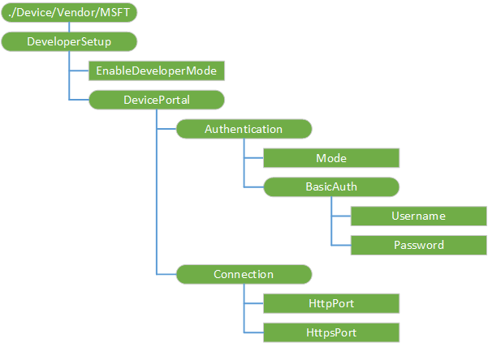

# DeveloperSetup CSP

The DeveloperSetup configuration service provider (CSP) is used to configure Developer Mode on the device and connect to the Windows Device Portal. For more information about the Windows Device Portal, see [Windows Device Portal overview](https://msdn.microsoft.com/windows/uwp/debug-test-perf/device-portal). This CSP was added in Windows 10, version 1703.

> [!NOTE]
The DeveloperSetup configuration service provider (CSP) is only supported in Windows 10 Holographic Enterprise edition and with runtime provisioning via provisioning packages. It is not supported in MDM.

The following diagram shows the DeveloperSetup configuration service provider in tree format.

**DeveloperSetup**  

The root node for the DeveloperSetup configuration service provider.

**EnableDeveloperMode**  

A Boolean value that is used to enable Developer Mode on the device. The default value is false.

The only supported operation is Replace.

**DevicePortal**   

The node for the Windows Device Portal.   

**DevicePortal/Authentication**  

The node that describes the characteristics of the authentication mechanism that is used for the Windows Device Portal.  

**DevicePortal/Authentication/Mode**   

An integer value that specifies the mode of authentication that is used when making requests to the Windows Device Portal.  

The only supported operation is Replace.

**DevicePortal/Authentication/BasicAuth**   

The node that describes the credentials that are used for basic authentication with the Windows Device Portal.  

**DevicePortal/Authentication/BasicAuth/Username**   

A string value that specifies the user name to use when performing basic authentication with the Windows Device Portal. 
The user name must contain only ASCII characters and cannot contain a colon (:).

The only supported operation is Replace.

**DevicePortal/Authentication/BasicAuth/Password**   

A string value that specifies the password to use when authenticating requests against the Windows Device Portal.  

The only supported operation is Replace.

**DevicePortal/Connection**  

The node for configuring connections to the Windows Device Portal service.   

**DevicePortal/Connection/HttpPort**   

An integer value that is used to configure the HTTP port for incoming connections to the Windows Device Portal service. 
If authentication is enabled, **HttpPort** will redirect the user to the (required) **HttpsPort**. 

The only supported operation is Replace.

**DevicePortal/Connection/HttpsPort**   

An integer value that is used to configure the HTTPS port for incoming connections to the Windows Device Portal service.  

The only supported operation is Replace.
