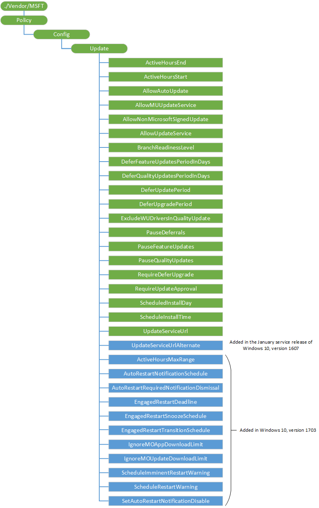

# Mobile device management (MDM) for device updates 

>[!TIP]
>If you're not a developer or administrator, you'll find more helpful information in the [Windows Update: Frequently Asked Questions](https://support.microsoft.com/help/12373/windows-update-faq).

In the current device landscape of PC, tablets, phones, and IoT devices, Mobile Device Management (MDM) solutions are becoming prevalent as a lightweight device management technology. In Windows 10, we are investing heavily in extending the management capabilities available to MDMs. One key feature we are adding is the ability for MDMs to keep devices up-to-date with the latest Microsoft updates.

In particular, Windows 10 provides APIs to enable MDMs to:

-   Ensure machines stay up-to-date by configuring Automatic Update policies.
-   Test updates on a smaller set of machines before enterprise-wide rollout by configuring which updates are approved for a given device.
-   Get compliance status of managed devices so IT can easily understand which machines still need a particular security patch, or how up-to-date is a particular machine.

This topic provides MDM independent software vendors (ISV) with the information they need to implement update management in Windows 10.

In Windows 10, the MDM protocol has been extended to better enable IT admins to manage updates. In particular, Windows has added configuration service providers (CSPs) that expose policies and actions for MDMs to:

-   Configure automatic update policies to ensure devices stay up-to-date.
-   Get device compliance information (the list of updates that are needed but not yet installed).
-   Specify a per-device update approval list, to ensure devices don’t install unapproved updates that have not been tested.
-   Approve EULAs on behalf of the end-user so update deployment can be automated even for updates with EULAs.

The OMA DM APIs for specifying update approvals and getting compliance status refer to updates by using an Update ID, which is a GUID that identifies a particular update. The MDM, of course, will want to expose IT-friendly information about the update (instead of a raw GUID), including the update’s title, description, KB, update type (for example, a security update or service pack). For more information, see [\[MS-WSUSSS\]: Windows Update Services: Server-Server Protocol](https://go.microsoft.com/fwlink/p/?LinkId=526707).

For more information about the CSPs, see [Update CSP](update-csp.md) and the update policy area of the [Policy CSP](policy-configuration-service-provider.md).

The following diagram provides a conceptual overview of how this works:


The diagram can be roughly divided into three areas:

-   The Device Management service syncs update information (title, description, applicability) from Microsoft Update using the Server-Server sync protocol (top of the diagram).
-   The Device Management service sets automatic update policies, obtains update compliance information, and sets approvals via OMA DM (left portion of the diagram).
-   The device gets updates from Microsoft Update using client/server protocol, but only downloads and installs updates that are both applicable to the device and approved by IT (right portion of the diagram).

## <a href="" id="gettingupdatemetadata"></a>Getting update metadata using the Server-Server sync protocol

The Microsoft Update Catalog is huge and contains many updates that are not needed by MDM-managed devices, including updates for legacy software (for example, updates to servers, down-level desktop operating systems, and legacy apps), and a large number of drivers. We recommend that the MDM use the Server-Server sync protocol to get update metadata for updates reported from the client.

This section describes how this is done. The following diagram shows the server-server sync protocol process.


MSDN provides much information about the Server-Server sync protocol. In particular:

-   It is a SOAP-based protocol, and you can get the WSDL in [Server Sync Web Service](https://go.microsoft.com/fwlink/p/?LinkId=526727). The WSDL can be used to generate calling proxies for many programming environments, which will simplify your development.
-   You can find code samples in [Protocol Examples](https://go.microsoft.com/fwlink/p/?LinkId=526720). The sample code shows raw SOAP commands, which can be used. Although it’s even simpler to make the call from a programming language like .NET (calling the WSDL-generated proxies). The stub generated by the Server Sync WSDL from the MSDN link above generates an incorrect binding URL. The binding URL should be set to https://fe2.update.microsoft.com/v6/ServerSyncWebService/serversyncwebservice.asmx.

Some important highlights:

-   The protocol has an authorization phase (calling GetAuthConfig, GetAuthorizationCookie, and GetCookie). In [Protocol Examples](https://go.microsoft.com/fwlink/p/?LinkId=526720), the **Sample 1: Authorization** code shows how this is done. Even though this is called the authorization phase, the protocol is completely open (no credentials are needed to run this phase of the protocol). This sequence of calls needs to be done to obtain a cookie for the main part of the sync protocol. As an optimization, you can cache the cookie and only call this sequence again if your cookie has expired.
-   The protocol allows the MDM to sync update metadata for a particular update by calling GetUpdateData. For more information, see [GetUpdateData](https://msdn.microsoft.com/library/dd304816.aspx) in MSDN. The LocURI to get the applicable updates with their revision Numbers is `<LocURI>./Vendor/MSFT/Update/InstallableUpdates?list=StructData</LocURI>`. Because not all updates are available via S2S sync, make sure you handle SOAP errors.
-   For mobile devices, you can either sync metadata for a particular update by calling GetUpdateData, or for a local on-premises solution, you can use WSUS and manually import the mobile updates from the Microsoft Update Catalog site. For more information, see [Process flow diagram and screenshots of server sync process](#process-flow-diagram-and-screenshots-of-server-sync-process).

> **Note**  On Microsoft Update, metadata for a given update gets modified over time (updating descriptive information, fixing bugs in applicability rules, localization changes, etc). Each time such a change is made that doesn’t affect the update itself, a new update revision is created. The identity of an update revision is a compound key containing both an UpdateID (GUID) and a RevisionNumber (int). The MDM should not expose the notion of an update revision to IT. Instead, for each UpdateID (GUID) the MDM should just keep the metadata for the later revision of that update (the one with the highest revision number).


## <a href="" id="examplesofupdatestructure"></a>Examples of update metadata XML structure and element descriptions

The response of the GetUpdateData call returns an array of ServerSyncUpdateData that contains the update metadata in the XmlUpdateBlob element. The schema of the update xml is available at [Protocol Examples](https://go.microsoft.com/fwlink/p/?LinkId=526720). Some of the key elements are described below:

-   **UpdateID** – The unique identifier for an update
-   **RevisionNumber** – Revision number for the update in case the update was modified.
-   **CreationDate** – the date on which this update was created.
-   **UpdateType** – The type of update which could include the following:
    -   **Detectoid** – if this update identity represents a compatibility logic
    -   **Category** – This could represent either of the following:
        -   A Product category the update belongs to. For example, Windows, MS office etc.
        -   The classification the update belongs to. For example, Drivers, security etc.
    -   **Software** – If the update is a software update.
    -   **Driver** – if the update is a driver update.
-   **LocalizedProperties** – represents the language the update is available in, title and description of the update. It has the following fields:
    -   **Language** – The language code identifier (LCID). For example, en or es.
    -   **Title** – Title of the update. For example, “Windows SharePoint Services 3.0 Service Pack 3 x64 Edition (KB2526305)”
    -   **Description** – Description of the update. For example, “Windows SharePoint Services 3.0 Service Pack 3 (KB2526305) provides the latest updates to Windows SharePoint Services 3.0. After you install this item, you may have to restart your computer. After you have installed this item, it cannot be removed.”
-   **KBArticleID** – The KB article number for this update that has details regarding the particular update. For example, <http://support.microsoft.com/kb/2902892>.

## <a href="" id="recommendedflow"></a>Recommended Flow for Using the Server-Server Sync Protocol

This section describes a possible algorithm for using the server-server sync protocol to pull in update metadata to the MDM.

First some background:

- If you have a multi-tenant MDM, the update metadata can be kept in a shared partition, since it is common to all tenants.
- A metadata sync service can then be implemented that periodically calls server-server sync to pull in metadata for the updates IT cares about.
- The MDM component that uses OMA DM to control devices (described in the next section) should send the metadata sync service the list of needed updates it gets from each client if those updates are not already known to the device.


The following procedure describes a basic algorithm for a metadata sync service:

-   Initialization, composed of the following:
    1.  Create an empty list of “needed update IDs to fault in”. This list will get updated by the MDM service component that uses OMA DM. We recommend not adding definition updates to this list, since those are temporary in nature (for example, Defender releases about 4 new definition updates per day, each of which is cumulative).
-   Sync periodically (we recommend once every 2 hours - no more than once/hour).
    1.  Implement the authorization phase of the protocol to get a cookie if you don’t already have a non-expired cookie. See **Sample 1: Authorization** in [Protocol Examples](https://go.microsoft.com/fwlink/p/?LinkId=526720).
    2.  Implement the metadata portion of the protocol (see **Sample 2: Metadata and Deployments Synchronization** in [Protocol Examples](https://go.microsoft.com/fwlink/p/?LinkId=526720)), and:
        -   Call GetUpdateData for all updates in the "needed update IDs to fault in" list if the update metadata has not already been pulled into the DB.
            -   If the update is a newer revision of an existing update (same UpdateID, higher revision number), replace the previous update metadata with the new one.
            -   Remove updates from the "needed update IDs to fault in" list once they have been brought in.

This provides an efficient way to pull in the information about the set of Microsoft Updates that IT needs to manage, so the information can be used in various update management scenarios. For example, at update approval time you can pull information so IT can see what updates they are approving, or for compliance reports to see what updates are needed but not yet installed.

## <a href="" id="managingupdates"></a>Managing updates using OMA DM

An MDM can manage updates via OMA DM. The details of how to use and integrate an MDM with the Windows OMA DM protocol, and how to enroll devices for MDM management, is documented the [Mobile device management](mobile-device-enrollment.md) topic. This section focuses on how to extend that integration to support update management. The key aspects of update management include the following:

-   Configure automatic update policies to ensure devices stay up-to-date.
-   Get device compliance information (the list of updates that are needed but not yet installed)
-   Specify a per-device update approval list to ensure devices don’t install unapproved updates that have not been tested.
-   Approve EULAs on behalf of the end-user so update deployment can be automated even for updates with EULAs

The following list describes a suggested model for applying updates.

1.  Have a "Test Group" and an "All Group".
2.  In the Test group, just let all updates flow.
3.  In the All Group, set up Quality Update deferral for 7 days and then Quality Updates will be auto approved after the 7 days.  Note that Definition Updates are excluded from Quality Update deferrals and will be auto approved when they are availible. This can be done by setting Update/DeferQualityUpdatesPeriodInDays to 7 and just letting updates flow after seven days or pushing Pause in case of issues.

Updates are configured using a combination of the [Update CSP](update-csp.md), and the update portion of the [Policy CSP](policy-configuration-service-provider.md). Please refer to these topics for details on configuring updates.

### Update policies

The enterprise IT can configure auto-update polices via OMA DM using the [Policy CSP](policy-configuration-service-provider.md) (this functionality is not supported in Windows 10 Mobile and Windows 10 Home). Here's the CSP diagram for the Update node in Policy CSP.

The following diagram shows the Update policies in a tree format.



<a href="" id="update-activehoursend"></a>**Update/ActiveHoursEnd**
> [!NOTE]
> This policy is available on Windows 10 Pro, Windows 10 Enterprise, Windows 10 Education, and Windows 10 Mobile Enterprise


<p style="margin-left: 20px">Added in Windows 10, version 1607. Allows the IT admin (when used with **Update/ActiveHoursStart**) to manage a range of active hours where update reboots are not scheduled. This value sets the end time. There is a 12 hour maximum from start time.

> [!NOTE]
> The default maximum difference from start time has been increased to 18 in Windows 10, version 1703. In this version of Windows 10, the maximum range of active hours can now be configured.  See **Update/ActiveHoursMaxRange** below for more information.

<p style="margin-left: 20px">Supported values are 0-23, where 0 is 12 AM, 1 is 1 AM, etc.

<p style="margin-left: 20px">The default is 17 (5 PM).

<a href="" id="update-activehoursmaxrange"></a>**Update/ActiveHoursMaxRange**
> [!NOTE]
> This policy is available on Windows 10 Pro, Windows 10 Enterprise, Windows 10 Education, and Windows 10 Mobile Enterprise


<p style="margin-left: 20px">Added in Windows 10, version 1703. Allows the IT admin to specify the max active hours range. This value sets max number of active hours from start time.

<p style="margin-left: 20px">Supported values are 8-18.

<p style="margin-left: 20px">The default value is 18 (hours).

<a href="" id="update-activehoursstart"></a>**Update/ActiveHoursStart**
> [!NOTE]
> This policy is available on Windows 10 Pro, Windows 10 Enterprise, Windows 10 Education, and Windows 10 Mobile Enterprise


<p style="margin-left: 20px">Added in Windows 10, version 1607. Allows the IT admin (when used with **Update/ActiveHoursEnd**) to manage a range of hours where update reboots are not scheduled. This value sets the start time. There is a 12 hour maximum from end time.

> [!NOTE]
> The default maximum difference from end time has been increased to 18 in Windows 10, version 1703. In this version of Windows 10, the maximum range of active hours can now be configured.  See **Update/ActiveHoursMaxRange** above for more information.

<p style="margin-left: 20px">Supported values are 0-23, where 0 is 12 AM, 1 is 1 AM, etc.

<p style="margin-left: 20px">The default value is 8 (8 AM).

<a href="" id="update-allowautoupdate"></a>**Update/AllowAutoUpdate**
> [!NOTE]
> This policy is available on Windows 10 Pro, Windows 10 Enterprise, Windows 10 Education, and Windows 10 Mobile Enterprise


<p style="margin-left: 20px">Enables the IT admin to manage automatic update behavior to scan, download, and install updates.

<p style="margin-left: 20px">Supported operations are Get and Replace.

<p style="margin-left: 20px">The following list shows the supported values:

-   0 – Notify the user before downloading the update. This policy is used by the enterprise who wants to enable the end-users to manage data usage. With this option users are notified when there are updates that apply to the device and are ready for download. Users can download and install the updates from the Windows Update control panel.
-   1 – Auto install the update and then notify the user to schedule a device restart. Updates are downloaded automatically on non-metered networks and installed during "Automatic Maintenance" when the device is not in use and is not running on battery power. If automatic maintenance is unable to install updates for two days, Windows Update will install updates immediately. If the installation requires a restart, the end-user is prompted to schedule the restart time. The end-user has up to seven days to schedule the restart and after that, a restart of the device is forced. Enabling the end-user to control the start time reduces the risk of accidental data loss caused by applications that do not shutdown properly on restart.
-   2 (default) – Auto install and restart. Updates are downloaded automatically on non-metered networks and installed during "Automatic Maintenance" when the device is not in use and is not running on battery power. If automatic maintenance is unable to install updates for two days, Windows Update will install updates right away. If a restart is required, then the device is automatically restarted when the device is not actively being used. This is the default behavior for unmanaged devices. Devices are updated quickly, but it increases the risk of accidental data loss caused by an application that does not shutdown properly on restart.
-   3 – Auto install and restart at a specified time. The IT specifies the installation day and time. If no day and time are specified, the default is 3 AM daily. Automatic installation happens at this time and device restart happens after a 15-minute countdown. If the user is logged in when Windows is ready to restart, the user can interrupt the 15-minute countdown to delay the restart.
-   4 – Auto install and restart without end-user control. Updates are downloaded automatically on non-metered networks and installed during "Automatic Maintenance" when the device is not in use and is not running on battery power. If automatic maintenance is unable to install updates for two days, Windows Update will install updates right away. If a restart is required, then the device is automatically restarted when the device is not actively being used. This setting option also sets the end-user control panel to read-only.
-   5 – Turn off automatic updates.

> [!IMPORTANT]
> This option should be used only for systems under regulatory compliance, as you will not get security updates as well.
 

<p style="margin-left: 20px">If the policy is not configured, end-users get the default behavior (Auto install and restart).

<a href="" id="update-allowmuupdateservice"></a>**Update/AllowMUUpdateService**
> [!NOTE]
> This policy is available on Windows 10 Pro, Windows 10 Enterprise, and Windows 10 Education


<p style="margin-left: 20px">Added in Windows 10, version 1607. Allows the IT admin to manage whether to scan for app updates from Microsoft Update.

<p style="margin-left: 20px">The following list shows the supported values:

-   0 – Not allowed or not configured.
-   1 – Allowed. Accepts updates received through Microsoft Update.

<a href="" id="update-allownonmicrosoftsignedupdate"></a>**Update/AllowNonMicrosoftSignedUpdate**
> [!NOTE]
> This policy is available on Windows 10 Pro, Windows 10 Enterprise, Windows 10 Education, and Windows 10 Mobile Enterprise


<p style="margin-left: 20px">Allows the IT admin to manage whether Automatic Updates accepts updates signed by entities other than Microsoft when the update is found at the UpdateServiceUrl location. This policy supports using WSUS for 3rd party software and patch distribution.

<p style="margin-left: 20px">Supported operations are Get and Replace.

<p style="margin-left: 20px">The following list shows the supported values:

-   0 – Not allowed or not configured. Updates from an intranet Microsoft update service location must be signed by Microsoft.
-   1 – Allowed. Accepts updates received through an intranet Microsoft update service location, if they are signed by a certificate found in the "Trusted Publishers" certificate store of the local computer.

<p style="margin-left: 20px">This policy is specific to desktop and local publishing via WSUS for 3rd party updates (binaries and updates not hosted on Microsoft Update) and allows IT to manage whether Automatic Updates accepts updates signed by entities other than Microsoft when the update is found on an intranet Microsoft update service location.

<a href="" id="update-allowupdateservice"></a>**Update/AllowUpdateService**
> [!NOTE]
> This policy is available on Windows 10 Pro, Windows 10 Enterprise, Windows 10 Education, and Windows 10 Mobile Enterprise


<p style="margin-left: 20px">Specifies whether the device could use Microsoft Update, Windows Server Update Services (WSUS), or Microsoft.

<p style="margin-left: 20px">Even when Windows Update is configured to receive updates from an intranet update service, it will periodically retrieve information from the public Windows Update service to enable future connections to Windows Update, and other services like Microsoft Update or the Microsoft

<p style="margin-left: 20px">Enabling this policy will disable that functionality, and may cause connection to public services such as the Microsoft to stop working.

<p style="margin-left: 20px">The following list shows the supported values:

-   0 – Update service is not allowed.
-   1 (default) – Update service is allowed.

> [!NOTE]
> This policy applies only when the desktop or device is configured to connect to an intranet update service using the "Specify intranet Microsoft update service location" policy.


<a href="" id="update-autorestartnotificationschedule"></a>**Update/AutoRestartNotificationSchedule**
> [!NOTE]
> This policy is available on Windows 10 Pro, Windows 10 Enterprise, Windows 10 Education, and Windows 10 Mobile Enterprise


<p style="margin-left: 20px">Added in Windows 10, version 1703. Allows the IT Admin to specify the period for auto-restart reminder notifications.

<p style="margin-left: 20px">Supported values are 15, 30, 60, 120, and 240 (minutes).

<p style="margin-left: 20px">The default value is 15 (minutes).

<a href="" id="update-autorestartrequirednotificationdismissal"></a>**Update/AutoRestartRequiredNotificationDismissal**
> [!NOTE]
> This policy is available on Windows 10 Pro, Windows 10 Enterprise, Windows 10 Education, and Windows 10 Mobile Enterprise


<p style="margin-left: 20px">Added in Windows 10, version 1703. Allows the IT Admin to specify the method by which the auto-restart required notification is dismissed.

<p style="margin-left: 20px">The following list shows the supported values:

-   1 (default) – Auto Dismissal.
-   2 – User Dismissal.

<a href="" id="update-branchreadinesslevel"></a>**Update/BranchReadinessLevel**
> [!NOTE]
> This policy is available on Windows 10 Pro, Windows 10 Enterprise, Windows 10 Education, and Windows 10 Mobile Enterprise


<p style="margin-left: 20px">Added in Windows 10, version 1607. Allows the IT admin to set which branch a device receives their updates from.

<p style="margin-left: 20px">The following list shows the supported values:

-   16 (default) – User gets all applicable upgrades from Current Branch (CB).
-   32 – User gets upgrades from Current Branch for Business (CBB).

<a href="" id="update-deferfeatureupdatesperiodindays"></a>**Update/DeferFeatureUpdatesPeriodInDays**
> [!NOTE]
> This policy is available on Windows 10 Pro, Windows 10 Enterprise, Windows 10 Education.
<p style="margin-left: 20px">Since this policy is not blocked, you will not get a failure message when you use it to configure a Windows 10 Mobile device. However, the policy will not take effect.


<p style="margin-left: 20px">Added in Windows 10, version 1607. Defers Feature Updates for the specified number of days.

<p style="margin-left: 20px">Supported values are 0-180.

<a href="" id="update-deferqualityupdatesperiodindays"></a>**Update/DeferQualityUpdatesPeriodInDays**
> [!NOTE]
> This policy is available on Windows 10 Pro, Windows 10 Enterprise, Windows 10 Education, and Windows 10 Mobile Enterprise


<p style="margin-left: 20px">Added in Windows 10, version 1607. Defers Quality Updates for the specified number of days.

<p style="margin-left: 20px">Supported values are 0-30.

<a href="" id="update-deferupdateperiod"></a>**Update/DeferUpdatePeriod**
> [!NOTE]
> This policy is available on Windows 10 Pro, Windows 10 Enterprise, Windows 10 Education, and Windows 10 Mobile Enterprise
>
> Don't use this policy in Windows 10, version 1607 devices, instead use the new policies listed in [Changes in Windows 10, version 1607 for update management](device-update-management.md#windows10version1607forupdatemanagement). You can continue to use DeferUpdatePeriod for Windows 10, version 1511 devices.


<p style="margin-left: 20px">Allows IT Admins to specify update delays for up to 4 weeks.

<p style="margin-left: 20px">Supported values are 0-4, which refers to the number of weeks to defer updates.

<p style="margin-left: 20px">In Windows 10 Mobile Enterprise version 1511 devices set to automatic updates, for DeferUpdatePeriod to work, you must set the following:

-   Update/RequireDeferUpgrade must be set to 1
-   System/AllowTelemetry must be set to 1 or higher

<p style="margin-left: 20px">If the "Specify intranet Microsoft update service location" policy is enabled, then the "Defer upgrades by", "Defer updates by" and "Pause Updates and Upgrades" settings have no effect.

<p style="margin-left: 20px">If the Allow Telemetry policy is enabled and the Options value is set to 0, then the "Defer upgrades by", "Defer updates by" and "Pause Updates and Upgrades" settings have no effect.

<table style="margin-left: 20px">
<colgroup>
<col width="25%" />
<col width="25%" />
<col width="25%" />
<col width="25%" />
</colgroup>
<thead>
<tr class="header">
<th>Update category</th>
<th>Maximum deferral</th>
<th>Deferral increment</th>
<th>Update type/notes</th>
</tr>
</thead>
<tbody>
<tr class="odd">
<td style="vertical-align:top"><p>OS upgrade</p></td>
<td style="vertical-align:top"><p>8 months</p></td>
<td style="vertical-align:top"><p>1 month</p></td>
<td style="vertical-align:top"><p>Upgrade - 3689BDC8-B205-4AF4-8D4A-A63924C5E9D5</p></td>
</tr>
<tr class="even">
<td style="vertical-align:top"><p>Update</p></td>
<td style="vertical-align:top"><p>1 month</p></td>
<td style="vertical-align:top"><p>1 week</p></td>
<td style="vertical-align:top"><div class="alert">
<strong>Note</strong>
If a machine has Microsoft Update enabled, any Microsoft Updates in these categories will also observe Defer / Pause logic.
</div>
<ul>
<li>Security Update - 0FA1201D-4330-4FA8-8AE9-B877473B6441</li>
<li>Critical Update - E6CF1350-C01B-414D-A61F-263D14D133B4</li>
<li>Update Rollup - 28BC880E-0592-4CBF-8F95-C79B17911D5F</li>
<li>Service Pack - 68C5B0A3-D1A6-4553-AE49-01D3A7827828</li>
<li>Tools - B4832BD8-E735-4761-8DAF-37F882276DAB</li>
<li>Feature Pack - B54E7D24-7ADD-428F-8B75-90A396FA584F</li>
<li>Update - CD5FFD1E-E932-4E3A-BF74-18BF0B1BBD83</li>
<li>Driver - EBFC1FC5-71A4-4F7B-9ACA-3B9A503104A0</li>
</ul></td>
</tr>
<tr class="odd">
<td style="vertical-align:top"><p>Other/cannot defer</p></td>
<td style="vertical-align:top"><p>No deferral</p></td>
<td style="vertical-align:top"><p>No deferral</p></td>
<td style="vertical-align:top"><p>Any update category not specifically enumerated above falls into this category.</p>
<p>Definition Update - E0789628-CE08-4437-BE74-2495B842F43B</p></td>
</tr>
</tbody>
</table>


<a href="" id="update-deferupgradeperiod"></a>**Update/DeferUpgradePeriod**
> [!NOTE]
> This policy is available on Windows 10 Pro, Windows 10 Enterprise, Windows 10 Education.
>
> Since this policy is not blocked, you will not get a failure message when you use it to configure a Windows 10 Mobile device. However, the policy will not take effect.
>
> Don't use this policy in Windows 10, version 1607 devices, instead use the new policies listed in [Changes in Windows 10, version 1607 for update management](device-update-management.md#windows10version1607forupdatemanagement). You can continue to use DeferUpgradePeriod for Windows 10, version 1511 devices.


<p style="margin-left: 20px">Allows IT Admins to specify additional upgrade delays for up to 8 months.

<p style="margin-left: 20px">Supported values are 0-8, which refers to the number of months to defer upgrades.

<p style="margin-left: 20px">If the "Specify intranet Microsoft update service location" policy is enabled, then the "Defer upgrades by", "Defer updates by" and "Pause Updates and Upgrades" settings have no effect.

<p style="margin-left: 20px">If the "Allow Telemetry" policy is enabled and the Options value is set to 0, then the "Defer upgrades by", "Defer updates by" and "Pause Updates and Upgrades" settings have no effect.

<a href="" id="update-engagedrestartdeadline"></a>**Update/EngagedRestartDeadline**
> [!NOTE]
> This policy is available on Windows 10 Pro, Windows 10 Enterprise, Windows 10 Education, and Windows 10 Mobile Enterprise


<p style="margin-left: 20px">Added in Windows 10, version 1703. Allows the IT Admin to specify the deadline in days before automatically scheduling and executing a pending restart outside of active hours. The deadline can be set between 2 and 30 days from the time the restart becomes pending. If configured, the pending restart will transition from Auto-restart to Engaged restart (pending user schedule) to be automatically executed within the specified period.  If no deadline is specified or deadline is set to 0, the restart will not be automatically executed and will remain Engaged restart (pending user scheduling).

<p style="margin-left: 20px">Supported values are 2-30 days.

<p style="margin-left: 20px">The default value is 0 days (not specified).

<a href="" id="update-engagedrestartsnoozeschedule"></a>**Update/EngagedRestartSnoozeSchedule**
> [!NOTE]
> This policy is available on Windows 10 Pro, Windows 10 Enterprise, Windows 10 Education, and Windows 10 Mobile Enterprise


<p style="margin-left: 20px">Added in Windows 10, version 1703. Allows the IT Admin to control the number of days a user can snooze Engaged restart reminder notifications.

<p style="margin-left: 20px">Supported values are 1-3 days.

<p style="margin-left: 20px">The default value is 3 days.

<a href="" id="update-engagedrestarttransitionschedule"></a>**Update/EngagedRestartTransitionSchedule**
> [!NOTE]
> This policy is available on Windows 10 Pro, Windows 10 Enterprise, Windows 10 Education, and Windows 10 Mobile Enterprise


<p style="margin-left: 20px">Added in Windows 10, version 1703. Allows the IT Admin to control the timing before transitioning from Auto restarts scheduled outside of active hours to Engaged restart, which requires the user to schedule. The period can be set between 2 and 30 days from the time the restart becomes pending.

<p style="margin-left: 20px">Supported values are 2-30 days.

<p style="margin-left: 20px">The default value is 7 days.

<a href="" id="update-excludewudriversinqualityupdate"></a>**Update/ExcludeWUDriversInQualityUpdate**
> [!NOTE]
> This policy is available on Windows 10 Pro, Windows 10 Enterprise, Windows 10 Education.
> Since this policy is not blocked, you will not get a failure message when you use it to configure a Windows 10 Mobile device. However, the policy will not take effect.

<p style="margin-left: 20px">Added in Windows 10, version 1607. Allows IT Admins to exclude Windows Update (WU) drivers during updates.

<p style="margin-left: 20px">The following list shows the supported values:

-   0 (default) – Allow Windows Update drivers.
-   1 – Exclude Windows Update drivers.

<a href="" id="update-ignoremoappdownloadlimit"></a>**Update/IgnoreMOAppDownloadLimit**
<p style="margin-left: 20px">Added in Windows 10, version 1703. Specifies whether to ignore the MO download limit (allow unlimited downloading) over a cellular network for apps and their updates. If lower-level limits (for example, mobile caps) are required, those limits are controlled by external policies.

> [!WARNING]
> Setting this policy might cause devices to incur costs from MO operators.

<p style="margin-left: 20px">The following list shows the supported values:

-   0 (default) – Do not ignore MO download limit for apps and their updates.
-   1 – Ignore MO download limit (allow unlimited downloading) for apps and their updates.

<p style="margin-left: 20px">To validate this policy:

1.  Enable the policy ensure the device is on a cellular network.
2.  Run the scheduled task on your device to check for app updates in the background. For example, on a mobile device, run the following commands in TShell:
      - `regd delete HKEY_USERS\S-1-5-21-2702878673-795188819-444038987-2781\software\microsoft\windows\currentversion\windowsupdate /v LastAutoAppUpdateSearchSuccessTime /f`

      - `exec-device schtasks.exe -arguments ""/run /tn """"\Microsoft\Windows\WindowsUpdate\Automatic App Update"""" /I""`

3.   Verify that any downloads that are above the download size limit will complete without being paused.


<a href="" id="update-ignoremoupdatedownloadlimit"></a>**Update/IgnoreMOUpdateDownloadLimit**
<p style="margin-left: 20px">Added in Windows 10, version 1703. Specifies whether to ignore the MO download limit (allow unlimited downloading) over a cellular network for OS updates. If lower-level limits (for example, mobile caps) are required, those limits are controlled by external policies.

> [!WARNING]
> Setting this policy might cause devices to incur costs from MO operators.

<p style="margin-left: 20px">The following list shows the supported values:

-   0 (default) – Do not ignore MO download limit for OS updates.
-   1 – Ignore MO download limit (allow unlimited downloading) for OS updates.

<p style="margin-left: 20px">To validate this policy:

1.  Enable the policy and ensure the device is on a cellular network.
2.  Run the scheduled task on phone to check for OS updates in the background. For example, on a mobile device, run the following commands in TShell:
      - `exec-device schtasks.exe -arguments ""/run /tn """"\Microsoft\Windows\WindowsUpdate\AUScheduledInstall"""" /I""`

3.   Verify that any downloads that are above the download size limit will complete without being paused.


<a href="" id="update-pausedeferrals"></a>**Update/PauseDeferrals**
> [!NOTE]
> This policy is available on Windows 10 Pro, Windows 10 Enterprise, Windows 10 Education, and Windows 10 Mobile Enterprise
>
> Don't use this policy in Windows 10, version 1607 devices, instead use the new policies listed in [Changes in Windows 10, version 1607 for update management](device-update-management.md#windows10version1607forupdatemanagement). You can continue to use PauseDeferrals for Windows 10, version 1511 devices.


<p style="margin-left: 20px">Allows IT Admins to pause updates and upgrades for up to 5 weeks. Paused deferrals will be reset after 5 weeks.

<p style="margin-left: 20px">The following list shows the supported values:

-   0 (default) – Deferrals are not paused.
-   1 – Deferrals are paused.

<p style="margin-left: 20px">If the "Specify intranet Microsoft update service location" policy is enabled, then the "Defer upgrades by", "Defer updates by" and "Pause Updates and Upgrades" settings have no effect.

<p style="margin-left: 20px">If the "Allow Telemetry" policy is enabled and the Options value is set to 0, then the "Defer upgrades by", "Defer updates by" and "Pause Updates and Upgrades" settings have no effect.

<a href="" id="update-pausefeatureupdates"></a>**Update/PauseFeatureUpdates**
> [!NOTE]
> This policy is available on Windows 10 Pro, Windows 10 Enterprise, Windows 10 Education.
<p style="margin-left: 20px">Since this policy is not blocked, you will not get a failure message when you use it to configure a Windows 10 Mobile device. However, the policy will not take effect.


<p style="margin-left: 20px">Added in Windows 10, version 1607. Allows IT Admins to pause Feature Updates for up to 60 days.

<p style="margin-left: 20px">The following list shows the supported values:

-   0 (default) – Feature Updates are not paused.
-   1 – Feature Updates are paused for 60 days or until value set to back to 0, whichever is sooner.

<a href="" id="update-pausequalityupdates"></a>**Update/PauseQualityUpdates**
> [!NOTE]
> This policy is available on Windows 10 Pro, Windows 10 Enterprise, Windows 10 Education, and Windows 10 Mobile Enterprise


<p style="margin-left: 20px">Added in Windows 10, version 1607. Allows IT Admins to pause Quality Updates.

<p style="margin-left: 20px">The following list shows the supported values:

-   0 (default) – Quality Updates are not paused.
-   1 – Quality Updates are paused for 35 days or until value set back to 0, whichever is sooner.

<a href="" id="update-requiredeferupgrade"></a>**Update/RequireDeferUpgrade**
> [!NOTE]
> This policy is available on Windows 10 Pro, Windows 10 Enterprise, Windows 10 Education, and Windows 10 Mobile Enterprise
>
> Don't use this policy in Windows 10, version 1607 devices, instead use the new policies listed in [Changes in Windows 10, version 1607 for update management](device-update-management.md#windows10version1607forupdatemanagement). You can continue to use RequireDeferUpgrade for Windows 10, version 1511 devices.


<p style="margin-left: 20px">Allows the IT admin to set a device to CBB train.

<p style="margin-left: 20px">The following list shows the supported values:

-   0 (default) – User gets upgrades from Current Branch.
-   1 – User gets upgrades from Current Branch for Business.

<a href="" id="update-requireupdateapproval"></a>**Update/RequireUpdateApproval**

> [!NOTE]
> This policy is available on Windows 10 Pro, Windows 10 Enterprise, Windows 10 Education, and Windows 10 Mobile Enterprise

<br>

> [!NOTE]
> If you previously used the **Update/PhoneUpdateRestrictions** policy in previous versions of Windows, it has been deprecated. Please use this policy instead.


<p style="margin-left: 20px">Allows the IT admin to restrict the updates that are installed on a device to only those on an update approval list. It enables IT to accept the End User License Agreement (EULA) associated with the approved update on behalf of the end-user. EULAs are approved once an update is approved.

<p style="margin-left: 20px">Supported operations are Get and Replace.

<p style="margin-left: 20px">The following list shows the supported values:

-   0 – Not configured. The device installs all applicable updates.
-   1 – The device only installs updates that are both applicable and on the Approved Updates list. Set this policy to 1 if IT wants to control the deployment of updates on devices, such as when testing is required prior to deployment.

<a href="" id="update-scheduleimminentrestartwarning"></a>**Update/ScheduleImminentRestartWarning**
> [!NOTE]
> This policy is available on Windows 10 Pro, Windows 10 Enterprise, Windows 10 Education, and Windows 10 Mobile Enterprise


<p style="margin-left: 20px">Added in Windows 10, version 1703. Allows the IT Admin to specify the period for auto-restart imminent warning notifications.

<p style="margin-left: 20px">Supported values are 15, 30, or 60 (minutes).

<p style="margin-left: 20px">The default value is 15 (minutes).

<a href="" id="update-scheduledinstallday"></a>**Update/ScheduledInstallDay**
> [!NOTE]
> This policy is available on Windows 10 Pro, Windows 10 Enterprise, Windows 10 Education, and Windows 10 Mobile Enterprise


<p style="margin-left: 20px">Enables the IT admin to schedule the day of the update installation.

<p style="margin-left: 20px">The data type is a string.

<p style="margin-left: 20px">Supported operations are Add, Delete, Get, and Replace.

<p style="margin-left: 20px">The following list shows the supported values:

-   0 (default) – Every day
-   1 – Sunday
-   2 – Monday
-   3 – Tuesday
-   4 – Wednesday
-   5 – Thursday
-   6 – Friday
-   7 – Saturday

<a href="" id="update-scheduledinstalltime"></a>**Update/ScheduledInstallTime**
> [!NOTE]
> This policy is available on Windows 10 Pro, Windows 10 Enterprise, Windows 10 Education, and Windows 10 Mobile Enterprise


<p style="margin-left: 20px">Enables the IT admin to schedule the time of the update installation.

<p style="margin-left: 20px">The data type is a string.

<p style="margin-left: 20px">Supported operations are Add, Delete, Get, and Replace.

<p style="margin-left: 20px">Supported values are 0-23, where 0 = 12 AM and 23 = 11 PM.

<p style="margin-left: 20px">The default value is 3.

<a href="" id="update-schedulerestartwarning"></a>**Update/ScheduleRestartWarning**
> [!NOTE]
> This policy is available on Windows 10 Pro, Windows 10 Enterprise, Windows 10 Education, and Windows 10 Mobile Enterprise


<p style="margin-left: 20px">Added in Windows 10, version 1703. Allows the IT Admin to specify the period for auto-restart warning reminder notifications.

<p style="margin-left: 20px">Supported values are 2, 4, 8, 12, or 24 (hours).

<p style="margin-left: 20px">The default value is 4 (hours).

<a href="" id="update-setautorestartnotificationdisable"></a>**Update/SetAutoRestartNotificationDisable**
> [!NOTE]
> This policy is available on Windows 10 Pro, Windows 10 Enterprise, Windows 10 Education, and Windows 10 Mobile Enterprise


<p style="margin-left: 20px">Added in Windows 10, version 1703. Allows the IT Admin to disable auto-restart notifications for update installations.

<p style="margin-left: 20px">The following list shows the supported values:

-   0 (default) – Enabled
-   1 – Disabled

<a href="" id="update-updateserviceurl"></a>**Update/UpdateServiceUrl**
> [!NOTE]
> This policy is available on Windows 10 Pro, Windows 10 Enterprise, Windows 10 Education, and Windows 10 Mobile Enterprise

> [!Important]
> Starting in Windows 10, version 1703 this policy is not supported in Windows 10 Mobile Enteprise and IoT Enterprise.

<p style="margin-left: 20px">Allows the device to check for updates from a WSUS server instead of Microsoft Update. This is useful for on-premises MDMs that need to update devices that cannot connect to the Internet.

<p style="margin-left: 20px">Supported operations are Get and Replace.

<p style="margin-left: 20px">The following list shows the supported values:

-   Not configured. The device checks for updates from Microsoft Update.
-   Set to a URL, such as `http://abcd-srv:8530`. The device checks for updates from the WSUS server at the specified URL.

Example

``` syntax
        <Replace>
            <CmdID>$CmdID$</CmdID>
            <Item>
                <Meta>
                    <Format>chr</Format>
                    <Type>text/plain</Type>
                </Meta>
                <Target>
                    <LocURI>./Vendor/MSFT/Policy/Config/Update/UpdateServiceUrl</LocURI>
                </Target>
                <Data>http://abcd-srv:8530</Data>
            </Item>
        </Replace>
```

<a href="" id="update-updateserviceurlalternate"></a>**Update/UpdateServiceUrlAlternate**

> **Note**  This policy is available on Windows 10 Pro, Windows 10 Enterprise, and Windows 10 Education.

<p style="margin-left: 20px">Added in the January service release of Windows 10, version 1607. Specifies an alternate intranet server to host updates from Microsoft Update. You can then use this update service to automatically update computers on your network.

<p style="margin-left: 20px">This setting lets you specify a server on your network to function as an internal update service. The Automatic Updates client will search this service for updates that apply to the computers on your network.

<p style="margin-left: 20px">To use this setting, you must set two server name values: the server from which the Automatic Updates client detects and downloads updates, and the server to which updated workstations upload statistics. You can set both values to be the same server.  An optional server name value can be specified to configure Windows Update agent, and download updates from an alternate download server instead of WSUS Server.

<p style="margin-left: 20px">Value type is string and the default value is an empty string, "". If the setting is not configured, and if Automatic Updates is not disabled by policy or user preference, the Automatic Updates client connects directly to the Windows Update site on the Internet.

> [!Note]
> If the "Configure Automatic Updates" Group Policy is disabled, then this policy has no effect.
> If the "Alternate Download Server" Group Policy is not set, it will use the WSUS server by default to download updates.
> This policy is not supported on Windows RT. Setting this policy will not have any effect on Windows RT PCs.

### Update management

The enterprise IT can configure the set of approved updates and get compliance status via OMA DM using the [Update CSP](update-csp.md). The following diagram shows the Update CSP in tree format..


<a href="" id="update"></a>**Update**
The root node.

Supported operation is Get.

<a href="" id="approvedupdates"></a>**ApprovedUpdates**
Node for update approvals and EULA acceptance on behalf of the end-user.

> **Note** When the RequireUpdateApproval policy is set, the MDM uses the ApprovedUpdates list to pass the approved GUIDs. These GUIDs should be a subset of the InstallableUpdates list.

The MDM must first present the EULA to IT and have them accept it before the update is approved. Failure to do this is a breach of legal or contractual obligations. The EULAs can be obtained from the update metadata and have their own EULA ID. It's possible for multiple updates to share the same EULA. It is only necessary to approve the EULA once per EULA ID, not one per update.

The update approval list enables IT to approve individual updates and update classifications. Auto-approval by update classifications allows IT to automatically approve Definition Updates (i.e., updates to the virus and spyware definitions on devices) and Security Updates (i.e., product-specific updates for security-related vulnerability). The update approval list does not support the uninstallation of updates by revoking approval of already installed updates. Updates are approved based on UpdateID, and an UpdateID only needs to be approved once. An update UpdateID and RevisionNumber are part of the UpdateIdentity type. An UpdateID can be associated to several UpdateIdentity GUIDs due to changes to the RevisionNumber setting. MDM services must synchronize the UpdateIdentity of an UpdateID based on the latest RevisionNumber to get the latest metadata for an update. However, update approval is based on UpdateID.

> **Note**  For the Windows 10 build, the client may need to reboot after additional updates are added.

 

Supported operations are Get and Add.

<a href="" id="approvedupdates-approved-update-guid"></a>**ApprovedUpdates/****_Approved Update Guid_**
Specifies the update GUID.

To auto-approve a class of updates, you can specify the [Update Classifications](https://go.microsoft.com/fwlink/p/?LinkId=526723) GUIDs. We strongly recommend to always specify the DefinitionsUpdates classification (E0789628-CE08-4437-BE74-2495B842F43B), which are used for anti-malware signatures. There are released periodically (several times a day). Some businesses may also want to auto-approve security updates to get them deployed quickly.

Supported operations are Get and Add.

Sample syncml:

```
<LocURI>./Vendor/MSFT/Update/ApprovedUpdates/%7ba317dafe-baf4-453f-b232-a7075efae36e%7d</LocURI>
```

<a href="" id="approvedupdates-approved-update-guid-approvedtime"></a>**ApprovedUpdates/*Approved Update Guid*/ApprovedTime**
Specifies the time the update gets approved.

Supported operations are Get and Add.

<a href="" id="failedupdates"></a>**FailedUpdates**
Specifies the approved updates that failed to install on a device.

Supported operation is Get.

<a href="" id="failedupdates-failed-update-guid"></a>**FailedUpdates/****_Failed Update Guid_**
Update identifier field of the UpdateIdentity GUID that represent an update that failed to download or install.

Supported operation is Get.

<a href="" id="failedupdates-failed-update-guid-hresult"></a>**FailedUpdates/*Failed Update Guid*/HResult**
The update failure error code.

Supported operation is Get.

<a href="" id="failedupdates-failed-update-guid-status"></a>**FailedUpdates/*Failed Update Guid*/Status**
Specifies the failed update status (for example, download, install).

Supported operation is Get.

<a href="" id="installedupdates"></a>**InstalledUpdates**
The updates that are installed on the device.

Supported operation is Get.

<a href="" id="installedupdates-installed-update-guid"></a>**InstalledUpdates/****_Installed Update Guid_**
UpdateIDs that represent the updates installed on a device.

Supported operation is Get.

<a href="" id="installableupdates"></a>**InstallableUpdates**
The updates that are applicable and not yet installed on the device. This includes updates that are not yet approved.

Supported operation is Get.

<a href="" id="installableupdates-installable-update-guid"></a>**InstallableUpdates/****_Installable Update Guid_**
Update identifiers that represent the updates applicable and not installed on a device.

Supported operation is Get.

<a href="" id="installableupdates-installable-update-guid-type"></a>**InstallableUpdates/*Installable Update Guid*/Type**
The UpdateClassification value of the update. Valid values are:

-   0 - None
-   1 - Security
-   2 = Critical

Supported operation is Get.

<a href="" id="installableupdates-installable-update-guid-revisionnumber"></a>**InstallableUpdates/*Installable Update Guid*/RevisionNumber**
The revision number for the update that must be passed in server to server sync to get the metadata for the update.

Supported operation is Get.

<a href="" id="pendingrebootupdates"></a>**PendingRebootUpdates**
The updates that require a reboot to complete the update session.

Supported operation is Get.

<a href="" id="pendingrebootupdates-pending-reboot-update-guid"></a>**PendingRebootUpdates/****_Pending Reboot Update Guid_**
Update identifiers for the pending reboot state.

Supported operation is Get.

<a href="" id="pendingrebootupdates-pending-reboot-update-guid-installedtime"></a>**PendingRebootUpdates/*Pending Reboot Update Guid*/InstalledTime**
The time the update is installed.

Supported operation is Get.

<a href="" id="lastsuccessfulscantime"></a>**LastSuccessfulScanTime**
The last successful scan time.

Supported operation is Get.

<a href="" id="deferupgrade"></a>**DeferUpgrade**
Upgrades deferred until the next period.

Supported operation is Get.


## <a href="" id="windows10version1607forupdatemanagement"></a> Windows 10, version 1607 for update management

Here are the new policies added in Windows 10, version 1607 in [Policy CSP](policy-configuration-service-provider.md). You should use these policies for the new Windows 10, version 1607 devices.

-   Update/ActiveHoursEnd
-   Update/ActiveHoursStart
-   Update/AllowMUUpdateService
-   Update/BranchReadinessLevel
-   Update/DeferFeatureUpdatePeriodInDays
-   Update/DeferQualityUpdatePeriodInDays
-   Update/ExcludeWUDriversInQualityUpdate
-   Update/PauseFeatureUpdates
-   Update/PauseQualityUpdates

Here's the list of corresponding Group Policy settings in HKLM\\Software\\Policies\\Microsoft\\Windows\\WindowsUpdate.

<table>
<colgroup>
<col width="33%" />
<col width="33%" />
<col width="33%" />
</colgroup>
<thead>
<tr class="header">
<th>GPO key</th>
<th>Type</th>
<th>Value</th>
</tr>
</thead>
<tbody>
<tr class="odd">
<td style="vertical-align:top"><p>BranchReadinessLevel</p></td>
<td style="vertical-align:top"><p>REG_DWORD</p></td>
<td style="vertical-align:top"><p>16: systems take Feature Updates on the Current Branch (CB) train</p>
<p>32: systems take Feature Updates on the Current Branch for Business</p>
<p>Other value or absent: receive all applicable updates (CB)</p></td>
</tr>
<tr class="even">
<td style="vertical-align:top"><p>DeferQualityUpdates</p></td>
<td style="vertical-align:top"><p>REG_DWORD</p></td>
<td style="vertical-align:top"><p>1: defer quality updates</p>
<p>Other value or absent: don’t defer quality updates</p></td>
</tr>
<tr class="odd">
<td style="vertical-align:top"><p>DeferQualityUpdatesPeriodInDays</p></td>
<td style="vertical-align:top"><p>REG_DWORD</p></td>
<td style="vertical-align:top"><p>0-30: days to defer quality updates</p></td>
</tr>
<tr class="even">
<td style="vertical-align:top"><p>PauseQualityUpdates</p></td>
<td style="vertical-align:top"><p>REG_DWORD</p></td>
<td style="vertical-align:top"><p>1: pause quality updates</p>
<p>Other value or absent: don’t pause quality updates</p></td>
</tr>
<tr class="odd">
<td style="vertical-align:top"><p>DeferFeatureUpdates</p></td>
<td style="vertical-align:top"><p>REG_DWORD</p></td>
<td style="vertical-align:top"><p>1: defer feature updates</p>
<p>Other value or absent: don’t defer feature updates</p></td>
</tr>
<tr class="even">
<td style="vertical-align:top"><p>DeferFeatureUpdatesPeriodInDays</p></td>
<td style="vertical-align:top"><p>REG_DWORD</p></td>
<td style="vertical-align:top"><p>0-180: days to defer feature updates</p></td>
</tr>
<tr class="odd">
<td style="vertical-align:top"><p>PauseFeatureUpdates</p></td>
<td style="vertical-align:top"><p>REG_DWORD</p></td>
<td style="vertical-align:top"><p>1: pause feature updates</p>
<p>Other value or absent: don’t pause feature updates</p></td>
</tr>
<tr class="even">
<td style="vertical-align:top"><p>ExcludeWUDriversInQualityUpdate</p></td>
<td style="vertical-align:top"><p>REG_DWORD</p></td>
<td style="vertical-align:top"><p>1: exclude WU drivers</p>
<p>Other value or absent: offer WU drivers</p></td>
</tr>
</tbody>
</table>

 

Here is the list of older policies that are still supported for backward compatibility. You can use these for Windows 10, version 1511 devices.

-   Update/RequireDeferUpgrade
-   Update/DeferUpgradePeriod
-   Update/DeferUpdatePeriod
-   Update/PauseDeferrals

For Windows Update for Business, here is the list of supported policies on Windows 10 Mobile Enterprise:

-   For Windows 10, version 1511 (Build 10586): Update/RequireDeferUpgrade, Update/DeferUpdatePeriod and Update/PauseDeferrals. To use DeferUpdatePeriod and PauseDeferrals the RequireDeferUpgrade has to be set to 1, which essentially means for a device running 1511, the Windows Update for Business policies can only be set when a device is configured for CBB servicing.
-   For Windows 10, version 1607 (Build 14393): Update/BranchReadinessLevel, Update/DeferQualityUpdatesPeriodInDays and Update/PauseQualityUpdates. In 1607 we added support where you can configure Windows Update for Business policies when a device is configured for CB/CBB servicing.

> **Note**  
For policies supported for Windows Update for Business, when you set policies for both Windows 10, version 1607 and Windows 10, version 1511 running on 1607, then 1607 policies will be configured (1607 trumps 1511).

For policies supported for Windows Update for Business, when you set 1511 policies on a device running 1607, the you will get the expected behavior for 1511 policies.

 

## <a href="" id="userexperiencescreenshot"></a>Update management user experience screenshot

The following screenshots of the administrator console shows the list of update titles, approval status, and additional metadata fields.


## <a href="" id="syncmlexample"></a>SyncML example

Set auto update to notify and defer.

``` syntax
<SyncML xmlns="SYNCML:SYNCML1.1">
    <SyncBody>
        <Replace xmlns="">
            <CmdID>1</CmdID>
            <Item>
                <Meta>
                    <Format>int</Format>
                    <Type>text/plain</Type>
                </Meta>
                <Target>
                    <LocURI>./Vendor/MSFT/Policy/Config/Update/AllowUpdateService</LocURI>
                </Target>
                <Data>0</Data>
            </Item>
            <CmdID>2</CmdID>
            <Item>
                <Meta>
                    <Format>int</Format>
                    <Type>text/plain</Type>
                </Meta>
                <Target>
                    <LocURI>./Vendor/MSFT/Policy/Config/Update/RequireDeferUpgrade </LocURI>
                </Target>
                <Data>0</Data>
            </Item>
            <CmdID>3</CmdID>
            <Item>
                <Meta>
                    <Format>int</Format>
                    <Type>text/plain</Type>
                </Meta>
                <Target>
                    <LocURI>./Vendor/MSFT/Policy/Config/Update/RequireUpdateApproval </LocURI>
               </Target>
                <Data>0</Data>
            </Item>
        </Replace>
       <Final/>
    </SyncBody>
</SyncML>
```

## Process flow diagram and screenshots of server sync process

The following diagram and screenshots show the process flow of the device update process using Windows Server Update Services and Microsoft Update Catalog.


 


