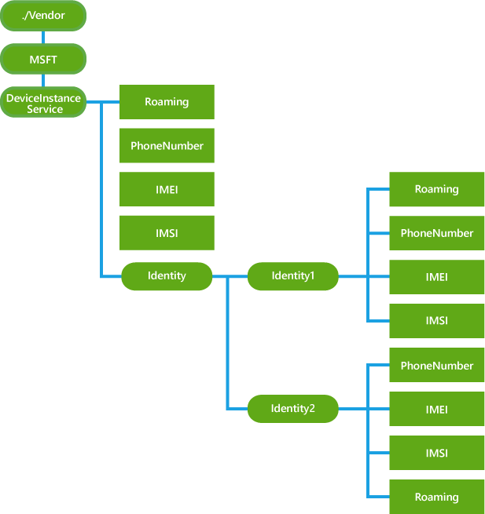

# DeviceInstanceService CSP


The DeviceInstanceService configuration service provider provides some device inventory information that could be useful for an enterprise. Additionally, this CSP supports querying two different phone numbers in the case of dual SIM. The URIs for SIM 1 and SIM 2 are ./Vendor/MSFT/DeviceInstanceService/Identity/Identity1 and ./Vendor/MSFT/DeviceInstanceService/Identity/Identity2 respectively.

> **Note**  
Stop using DeviceInstanceService CSP and use the updated [DeviceStatus CSP](devicestatus-csp.md) instead.

The DeviceInstance CSP is only supported in Windows 10 Mobile.

 

The following diagram shows the DeviceInstanceService configuration service provider in tree format.



<a href="" id="roaming"></a>**Roaming**  
A boolean value that specifies the roaming status of the device. In dual SIM mode when the device supports two different phone numbers, querying SIM 1 explicitly with ./Vendor/MSFT/DeviceInstanceService/Identify1/Roaming is functionally equivalent to using ./Vendor/MSFT/DeviceInstanceService/Roaming.

Supported operation is **Get**.

Returns **True** if the device is roaming; otherwise **False**.

<a href="" id="phonenumber"></a>**PhoneNumber**  
A string that represents the phone number of the device. In case of dual SIM mode when the device supports two different phone numbers, querying SIM 1 explicitly with ./Vendor/MSFT/DeviceInstanceService/Identify1/PhoneNumber is functionally equivalent to using ./Vendor/MSFT/DeviceInstanceService/PhoneNumber.

Value type is chr.

Supported operation is **Get**.

<a href="" id="imei"></a>**IMEI**  
A string the represents the International Mobile Station Equipment Identity (IMEI) of the device. In case of dual SIM mode when the device supports two different phone numbers, querying SIM 1 explicitly with ./Vendor/MSFT/DeviceInstanceService/Identify1/IMEI is functionally equivalent to using ./Vendor/MSFT/DeviceInstanceService/IMEI.

Value type is chr.

Supported operation is **Get**.

<a href="" id="imsi"></a>**IMSI**  
A string that represents the first six digits of device IMSI number (Mobile Country/region Code, Mobile Network Code) of the device. In case of dual SIM mode when the device supports two different phone numbers, querying SIM 1 explicitly with ./Vendor/MSFT/DeviceInstanceService/Identify1/IMSI is functionally equivalent to using ./Vendor/MSFT/DeviceInstanceService/IMSI.

Value type is chr.

Supported operation is **Get**.

<a href="" id="identity"></a>**Identity**  
The parent node to group per SIM specific information in case of dual SIM mode.

<a href="" id="identity1"></a>**Identity1**  
The parent node to group SIM1 specific information in case of dual SIM mode.

<a href="" id="identity2"></a>**Identity2**  
The parent node to group SIM2 specific information in case of dual SIM mode.

## Examples


The following sample shows how to query roaming status and phone number on the device.

``` syntax
<Get>
      <CmdID>2</CmdID>
      <Item>
        <Target>
          <LocURI>./Vendor/MSFT/DeviceInstanceService/Roaming</LocURI>
        </Target>
      </Item>
      <Item>
        <Target>
          <LocURI>./Vendor/MSFT/DeviceInstanceService/PhoneNumber</LocURI>
        </Target>
      </Item>
</Get>
```

Response from the phone.

``` syntax
<Results>
   <CmdID>3</CmdID>
   <MsgRef>1</MsgRef>
   <CmdRef>2</CmdRef>
   <Item>
      <Source><LocURI>./Vendor/MSFT/DeviceInstanceService/Roaming</LocURI></Source>
      <Meta><Format xmlns="syncml:metinf">bool</Format></Meta>
      <Data>false</Data>
   </Item>
   <Item>
      <Source><LocURI>./Vendor/MSFT/DeviceInstanceService/PhoneNumber</LocURI></Source>
      <Data>+14254458055</Data>
   </Item>
</Results>
```

## Related topics


[Configuration service provider reference](configuration-service-provider-reference.md)

 

 


