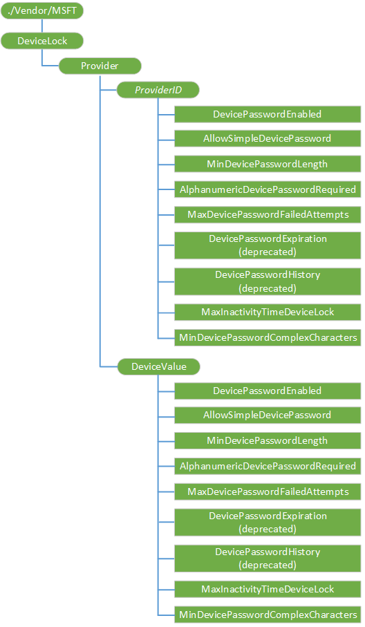

# DeviceLock CSP


The DeviceLock configuration service provider is used by the enterprise management server to configure device lock related policies. This configuration service provider is supported by an enterprise management server.

> **Note**   The DeviceLock CSP is supported in Windows 10 Mobile for backward compatibility. For Windows 10 devices you should use [Policy CSP](policy-configuration-service-provider.md) for various device lock settings. You can continue to use DeviceLock CSP for Windows Phone 8.1 and Windows Phone 8.1 GDR devices. The DeviceLock CSP will be deprecated some time in the future.

 

The DevicePasswordEnabled setting must be set to 0 (device password is enabled) for the following settings to take effect:

-   AllowSimpleDevicePassword
-   MinDevicePasswordLength
-   AlphanumericDevicePasswordRequired
-   MaxDevicePasswordFailedAttempts
-   MaxInactivityTimeDeviceLock
-   MinDevicePasswordComplexCharacters

The following image shows the DeviceLock configuration service provider in tree format.



<a href="" id="provider"></a>**Provider**  
Required. An interior node to group all policy providers. Scope is permanent. Supported operation is Get.

<a href="" id="---------------providerid"></a> ***ProviderID***  
Optional. The node that contains the configured management server's ProviderID. In Windows Phone 8, only one enterprise management server is supported. That is, there should be only one *ProviderID* node. Exchange ActiveSync policies set by Exchange are saved by the Sync client separately. Scope is dynamic. The following operations are supported:

-   **Add** - Add the management account to the configuration service provider tree.
-   **Delete** - Delete all policies set by this account. This command could be used in enterprise unenrollment for removing policy values set by the enterprise management server.
-   **Get** - Return all policies set by the management server.

> **Note**   The value cannot be changed after it is added. The **Replace** command isn't supported.

 

<a href="" id="providerid-devicepasswordenabled"></a>***ProviderID*/DevicePasswordEnabled**  
Optional. An integer value that specifies whether device lock is enabled. Possible values are one of the following:

-   0 - Device lock is enabled.
-   1 (default) - Device lock not enabled.

The scope is dynamic.

Supported operations are Get, Add, and Replace.

<a href="" id="providerid-allowsimpledevicepassword"></a>***ProviderID*/AllowSimpleDevicePassword**  
Optional. An integer value that specifies whether simple passwords, such as "1111" or "1234", are allowed. Possible values for this node are one of the following:

-   0 - Not allowed.
-   1 (default) - Allowed.

Invalid values are treated as a configuration failure. The scope is dynamic.

Supported operations are Get, Add, and Replace.

<a href="" id="providerid-mindevicepasswordlength"></a>***ProviderID*/MinDevicePasswordLength**  
Optional. An integer value that specifies the minimum number of characters required in the PIN. Valid values are 4 to 18 inclusive. The default value is 4. Invalid values are treated as a configuration failure. The scope is dynamic.

Supported operations are Get, Add, and Replace.

<a href="" id="providerid-alphanumericdevicepasswordrequired"></a>***ProviderID*/AlphanumericDevicePasswordRequired**  
Optional. An integer value that specifies the complexity of the password or PIN allowed.

Valid values are one of the following:

-   0 - Alphanumeric password required
-   1 - Users can choose a numeric or alphanumeric password
-   2 - Users can choose no password, numeric password, or alphanumeric password

Invalid values are treated as a configuration failure. The scope is dynamic.

Supported operations are Get, Add, and Replace.

<a href="" id="providerid-devicepasswordexpiration"></a>***ProviderID*/DevicePasswordExpiration**  
Deprecated in Windows 10.

<a href="" id="providerid-devicepasswordhistory"></a>***ProviderID*/DevicePasswordHistory**  
Deprecated in Windows 10.

<a href="" id="providerid-maxdevicepasswordfailedattempts"></a>***ProviderID*/MaxDevicePasswordFailedAttempts**  
Optional. An integer value that specifies the number of authentication failures allowed before the device will be wiped. Valid values are 0 to 999. The default value is 0, which indicates the device will not be wiped regardless of the number of authentication failures.

Invalid values are treated as a configuration failure. The scope is dynamic.

Supported operations are Get, Add, and Replace.

<a href="" id="providerid-maxinactivitytimedevicelock"></a>***ProviderID*/MaxInactivityTimeDeviceLock**  
Optional. An integer value that specifies the amount of time (in minutes) that the device can remain idle before it is password locked. Valid values are 0 to 999. A value of 0 indicates no time-out is specified. In this case, the maximum screen time-out allowed by the UI applies.

Invalid values are treated as a configuration failure. The scope is dynamic.

Supported operations are Get, Add, and Replace.

<a href="" id="providerid-mindevicepasswordcomplexcharacters"></a>***ProviderID*/MinDevicePasswordComplexCharacters**  
Optional. An integer value that specifies the number of complex element types (uppercase and lowercase letters, numbers, and punctuation) required for a strong password. Valid values are 1 to 4 for mobile and 1 to 3 for desktop. The default value is 1.

Invalid values are treated as a configuration failure. The scope is dynamic.

Supported operations are Get, Add, and Replace.

<a href="" id="devicevalue"></a>**DeviceValue**  
Required. A permanent node that groups the policy values applied to the device. The server can query this node to discover what policy values are actually applied to the device. The scope is permanent.

Supported operation is Get.

<a href="" id="devicevalue-devicepasswordenable-----mindevicepasswordcomplexcharacters"></a>**DeviceValue/DevicePasswordEnable, …, MinDevicePasswordComplexCharacters**  
Required. This node has the same set of policy nodes as the **ProviderID** node. All nodes under **DeviceValue** are read-only permanent nodes. Each node represents the current device lock policy. For detailed descriptions of each policy, see the ***ProviderID*** subnode descriptions.

## OMA DM examples


Set device lock policies:

``` syntax
<Atomic>
   <CmdID>13</CmdID>
   <Add>
      <CmdID>2</CmdID>
      <Item>
         <Target>
            <LocURI>
               ./Vendor/MSFT/DeviceLock/Provider/TestMDMServer/MaxDevicePasswordFailedAttempts
            </LocURI>
         </Target>
         <Meta>
            <Format xmlns="syncml:metinf">int</Format>
         </Meta>
         <Data>4</Data>
      </Item>
   </Add>
   <Add>
      <CmdID>3</CmdID>
      <Item>
         <Target>
            <LocURI>
               ./Vendor/MSFT/DeviceLock/Provider/TestMDMServer/DevicePasswordEnabled</LocURI>
         </Target>
         <Meta>
            <Format xmlns="syncml:metinf">int</Format>
         </Meta>
         <Data>0</Data>
      </Item>
   </Add>
   <Add>
      <CmdID>4</CmdID>
      <Item>
         <Target>
            <LocURI>
               ./Vendor/MSFT/DeviceLock/Provider/TestMDMServer/AllowSimpleDevicePassword
            </LocURI>
         </Target>
         <Meta>
            <Format xmlns="syncml:metinf">int</Format>
         </Meta>
         <Data>1</Data>
      </Item>
   </Add>
   <Add>
      <CmdID>5</CmdID>
      <Item>
         <Target>
            <LocURI>
               ./Vendor/MSFT/DeviceLock/Provider/TestMDMServer/MinDevicePasswordLength
            </LocURI>
         </Target>
         <Meta>
            <Format xmlns="syncml:metinf">int</Format>
         </Meta>
         <Data>5</Data>
      </Item>
   </Add>
   <Add>
      <CmdID>6</CmdID>
      <Item>
         <Target>
            <LocURI>
            ./Vendor/MSFT/DeviceLock/Provider/TestMDMServer/AlphanumericDevicePasswordRequired
            </LocURI>
         </Target>
         <Meta>
            <Format xmlns="syncml:metinf">int</Format>
         </Meta>
         <Data>1</Data>
      </Item>
   </Add>
   <Add>
      <CmdID>7</CmdID>
      <Item>
         <Target>
            <LocURI>
               ./Vendor/MSFT/DeviceLock/Provider/TestMDMServer/DevicePasswordExpiration
            </LocURI>
         </Target>
         <Meta>
            <Format xmlns="syncml:metinf">int</Format>
         </Meta>
         <Data>2</Data>
      </Item>
   </Add>
   <Add>
      <CmdID>8</CmdID>
      <Item>
         <Target>
            <LocURI>
               ./Vendor/MSFT/DeviceLock/Provider/TestMDMServer/DevicePasswordHistory
            </LocURI>
         </Target>
         <Meta>
            <Format xmlns="syncml:metinf">int</Format>
         </Meta>
         <Data>50</Data>
      </Item>
   </Add>
   <Add>
      <CmdID>9</CmdID>
      <Item>
         <Target>
            <LocURI>
               ./Vendor/MSFT/DeviceLock/Provider/TestMDMServer/MaxInactivityTimeDeviceLock
            </LocURI>
         </Target>
         <Meta>
            <Format xmlns="syncml:metinf">int</Format>
         </Meta>
         <Data>2</Data>
      </Item>
   </Add>
   <Add>
      <CmdID>10</CmdID>
      <Item>
         <Target>
            <LocURI>
            ./Vendor/MSFT/DeviceLock/Provider/TestMDMServer/MinDevicePasswordComplexCharacters
            </LocURI>
         </Target>
         <Meta>
            <Format xmlns="syncml:metinf">int</Format>
         </Meta>
         <Data>2</Data>
      </Item>
   </Add>
</Atomic>
```

## Remarks


All node values under the **ProviderID** interior node represent the policy values set by the management server.

-   An **Add** or **Replace** command on those nodes returns success in the following cases:

    -   The value is actually applied to the device.

    -   The value isn't applied to the device because the device has a more secure value set already.

        From a security perspective, the device complies with the policy request that is at least as secure as the one requested.

-   A **Get** command on those nodes returns the value the server pushes down to the device.

-   If a **Replace** command fails, the node value is set back to the value that was to be replaced.

-   If an **Add** command fails, the node is not created.

The value applied to the device can be queried via the nodes under the **DeviceValue** interior node.

## Related topics


[Configuration service provider reference](configuration-service-provider-reference.md)

 

 


