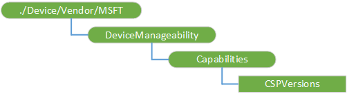

# DeviceManageability CSP

The DeviceManageability configuration service provider (CSP) is used retrieve the general information about MDM configuration capabilities on the device. This CSP was added in Windows 10, version 1607.

For performance reasons DeviceManageability CSP directly reads the CSP version from the registry. Specifically, the value csp\_version is used to determine each of the CSP versions. The csp\_version is a value under each of the CSP registration keys. To have consistency on the CSP version, the CSP GetProperty implementation for CFGMGR\_PROPERTY\_SEMANTICTYPE has to be updated to read from the registry as well, so that the both paths return the same information. 

The following diagram shows the DeviceManageability configuration service provider in a tree format.

**./Device/Vendor/MSFT/DeviceManageability**  
Root node to group information about runtime MDM configuration capability on the target device.

**Capabilities**  
Interior node.

**Capabilities/CSPVersions**  
Returns the versions of all configuration service providers supported on the device for the MDM service.

 

 

