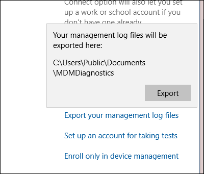
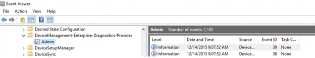
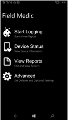
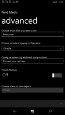
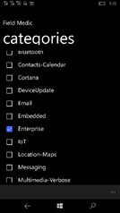
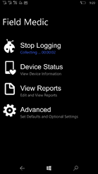
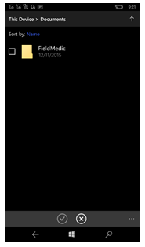
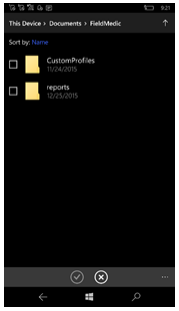
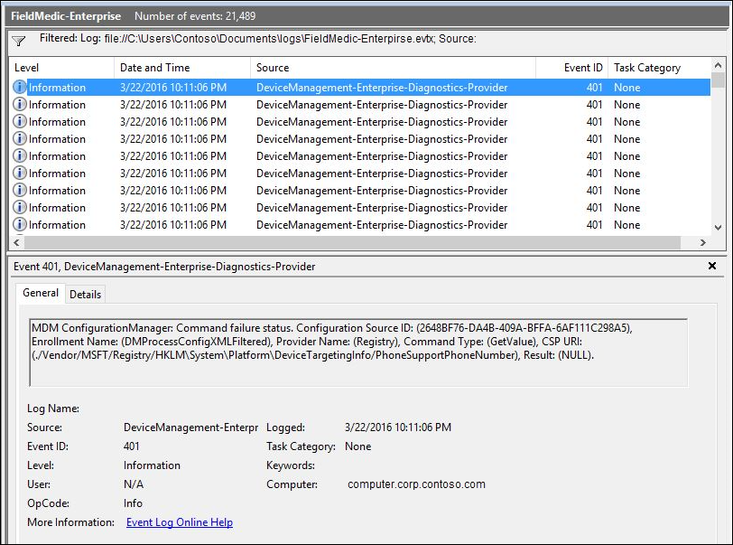

# Diagnose MDM failures in Windows 10

To help diagnose enrollment or device management issues in Windows 10 devices managed by an MDM server, you can examine the MDM logs collected from the desktop or mobile device. The following sections describe the procedures for collecting MDM logs.

## Download the MDM Diagnostic Information log from Windows 10 PCs

1. On your managed device go to **Settings** > **Accounts** > **Access work or school**.
1. Click your work or school account, then click **Info.**  
   

1. At the bottom of the **Settings** page, click **Create report**.  
   
1. A window opens that shows the path to the log files. Click **Export**.

   

1. In File Explorer, navigate to c:\Users\Public\Documents\MDMDiagnostics to see the report.

## Collect logs directly from Windows 10 PCs

Starting with the Windows 10, version 1511, MDM logs are captured in the Event Viewer in the following location:

-   Applications and Services Logs > Microsoft > Windows > DeviceManagement-Enterprise-Diagnostic-Provider

Here's a screenshot:



In this location, the **Admin** channel logs events by default. However, if you need more details logs you can enable **Debug** logs by choosing **Show Analytic and Debug** logs option in **View** menu in Event Viewer.

**To collect Admin logs**

1.  Right click on the **Admin** node.
2.  Select **Save all events as**.
3.  Choose a location and enter a filename.
4.  Click **Save**.
5.  Choose **Display information for these languages** and then select **English**.
6.  Click **Ok**.

For more detailed logging, you can enable **Debug** logs. Right click on the **Debug** node and then click **Enable Log**.

**To collect Debug logs**

1.  Right click on the **Debug** node.
2.  Select **Save all events as**.
3.  Choose a location and enter a filename.
4.  Click **Save**.
5.  Choose **Display information for these languages** and then select **English**.
6.  Click **Ok**.

You can open the log files (.evtx files) in the Event Viewer on a Windows 10 PC running the November 2015 update.

## Collect logs remotely from Windows 10 PCs

When the PC is already enrolled in MDM, you can remotely collect logs from the PC through the MDM channel if your MDM server supports this. The [DiagnosticLog CSP](diagnosticlog-csp.md) can be used to enable an event viewer channel by full name. Here are the Event Viewer names for the Admin and Debug channels:

-   Microsoft-Windows-DeviceManagement-Enterprise-Diagnostics-Provider%2FAdmin
-   Microsoft-Windows-DeviceManagement-Enterprise-Diagnostics-Provider%2FDebug

Example: Enable the Debug channel logging

``` syntax
<SyncML xmlns="SYNCML:SYNCML1.2">
    <SyncBody>
        <Replace>
            <CmdID>2</CmdID>
            <Item>
                <Target>
                    <LocURI>./Vendor/MSFT/DiagnosticLog/EtwLog/Channels/Microsoft-Windows-DeviceManagement-Enterprise-Diagnostics-Provider%2FDebug/State</LocURI>
                </Target>
                <Meta>
                    <Format xmlns="syncml:metinf">bool</Format>
                </Meta>
                <Data>true</Data>
            </Item>
        </Replace>
        <Final/>
    </SyncBody>
</SyncML>
```

Example: Export the Debug logs

``` syntax
<?xml version="1.0"?>
<SyncML xmlns="SYNCML:SYNCML1.2">
    <SyncBody>
        <Exec>
            <CmdID>2</CmdID>
            <Item>
                <Target>
                    <LocURI>./Vendor/MSFT/DiagnosticLog/EtwLog/Channels/Microsoft-Windows-DeviceManagement-Enterprise-Diagnostics-Provider%2FDebug/Export</LocURI>
                </Target>
            </Item>
        </Exec>
        <Final/>
    </SyncBody>
</SyncML>
```

## Collect logs from Windows 10 Mobile devices

Since there is no Event Viewer in Windows 10 Mobile, you can use the [Field Medic](https://www.microsoft.com/en-us/p/field-medic/9wzdncrfjb82?activetab=pivot%3aoverviewtab) app to collect logs.

**To collect logs manually**

1.  Download and install the [Field Medic]( http://go.microsoft.com/fwlink/p/?LinkId=718232) app from the store.
2.  Open the Field Medic app and then click on **Advanced**.

    

3.  Click on **Choose with ETW provider to use**.

    

4.  Check **Enterprise** and un-check the rest.

    

5.  In the app, click on **Start Logging** and then perform the operation that you want to troubleshoot.

    

6.  When the operation is done, click on **Stop Logging**.

    

7.  Save the logs. They will be stored in the Field Medic log location on the device.
8.  You can send the logs via email by attaching the files from **Documents > Field Medic > Reports > ...** folder.

    

The following table contains a list of common providers and their corresponding GUIDs.

| GUID                                 | Provider Name                                          |
|--------------------------------------|--------------------------------------------------------|
| 099614a5-5dd7-4788-8bc9-e29f43db28fc | Microsoft-Windows-LDAP-Client                          |
| 0f67e49f-fe51-4e9f-b490-6f2948cc6027 | Microsoft-Windows-Kernel-Processor-Power               |
| 0ff1c24b-7f05-45c0-abdc-3c8521be4f62 | Microsoft-Windows-Mobile-Broadband-Experience-SmsApi   |
| 10e4f0e0-9686-4e62-b2d6-fd010eb976d3 | Microsoft-WindowsPhone-Shell-Events                    |
| 1e39b4ce-d1e6-46ce-b65b-5ab05d6cc266 | Microsoft-Windows-Networking-RealTimeCommunication     |
| 22a7b160-f6e8-46b9-8e0b-a51989c85c66 | Microsoft-WindowsPhone-Bluetooth-AG                    |
| 2f94e1cc-a8c5-4fe7-a1c3-53d7bda8e73e | Microsoft-WindowsPhone-ConfigManager2                  |
| 331c3b3a-2005-44c2-ac5e-77220c37d6b4 | Microsoft-Windows-Kernel-Power                         |
| 33693e1d-246a-471b-83be-3e75f47a832d | Microsoft-Windows-BTH-BTHUSB                           |
| 3742be72-99a9-42e6-9fd5-c01a330e3625 | Microsoft-WindowsPhone-PhoneAudio                      |
| 3b9602ff-e09b-4c6c-bc19-1a3dfa8f2250 | Microsoft-WindowsPhone-OmaDm-Client-Provider           |
| 3da494e4-0fe2-415C-b895-fb5265c5c83b | Microsoft-WindowsPhone-Enterprise-Diagnostics-Provider |
| 3f471139-acb7-4a01-b7a7-ff5da4ba2d43 | Microsoft-Windows-AppXDeployment-Server                |
| 4180c4f7-e238-5519-338f-ec214f0b49aa | Microsoft.Windows.ResourceManager                      |
| 4637124c-1d40-4b4d-892f-2aaecf24ff06 | Microsoft-Windows-WinJson                              |
| 4d13548f-c7b8-4174-bb7a-d7f64bf22d29 | Microsoft-WindowsPhone-LocationServiceProvider         |
| 4eacb4d0-263b-4b93-8cd6-778a278e5642 | Microsoft-Windows-GenericRoaming                       |
| 4f386063-ef17-4629-863c-d71597af743d | Microsoft-WindowsPhone-NotificationService             |
| 55404e71-4db9-4deb-a5f5-8f86e46dde56 | Microsoft-Windows-Winsock-NameResolution               |
| 59819d0a-adaf-46b2-8d7c-990bc39c7c15 | Microsoft-Windows-Battery                              |
| 5c103042-7e75-4629-a748-bdfa67607fac | Microsoft-WindowsPhone-Power                           |
| 69c1c3f1-2b5c-41d0-a14a-c7ca5130640e | Microsoft-WindowsPhone-Cortana                         |
| 6ad52b32-d609-4be9-ae07-ce8dae937e39 | Microsoft-Windows-RPC                                  |
| 7263516b-6eb0-477b-b64f-17b91d29f239 | Microsoft-WindowsPhone-BatterySense                    |
| 7dd42a49-5329-4832-8dfd-43d979153a88 | Microsoft-Windows-Kernel-Network                       |
| ae4bd3be-f36f-45b6-8d21-bdd6fb832853 | Microsoft-Windows-Audio                                |
| daa6a96b-f3e7-4d4d-a0d6-31a350e6a445 | Microsoft-Windows-WLAN-Driver                          |
| 4d13548f-c7b8-4174-bb7a-d7f64bf22d29 | Microsoft-WindowsPhone-LocationServiceProvider         |
| 74e106b7-00be-4a55-b707-7ab58d6a9e90 | Microsoft-WindowsPhone-Shell-OOBE                      |
| cbda4dbf-8d5d-4f69-9578-be14aa540d22 | Microsoft-Windows-AppLocker                            |
| e595f735-b42a-494b-afcd-b68666945cd3 | Microsoft-Windows-Firewall                             |
| e5fc4a0f-7198-492f-9b0f-88fdcbfded48 | Microsoft-Windows Networking VPN                       |
| e5c16d49-2464-4382-bb20-97a4b5465db9 | Microsoft-Windows-WiFiNetworkManager                   |

 

## Collect logs remotely from Windows 10 Holographic or Windows 10 Mobile devices

For holographic or mobile devices already enrolled in MDM, you can remotely collect MDM logs through the MDM channel using the [DiagnosticLog CSP](diagnosticlog-csp.md).

You can use the DiagnosticLog CSP to enable the ETW provider. The provider ID is 3DA494E4-0FE2-415C-B895-FB5265C5C83B. The following examples show how to enable the ETW provider:

Add a collector node

``` syntax
<?xml version="1.0"?>
<SyncML xmlns="SYNCML:SYNCML1.2">
    <SyncBody>
        <Add>
            <CmdID>1</CmdID>
            <Item>
                <Target>
                   <LocURI>./Vendor/MSFT/DiagnosticLog/EtwLog/Collectors/MDM</LocURI>
                </Target>
                <Meta>
                    <Format xmlns="syncml:metinf">node</Format>
                </Meta>
            </Item>
        </Add>
        <Final/>
    </SyncBody>
</SyncML>
```

Add the ETW provider to the trace

``` syntax
<?xml version="1.0"?>
<SyncML xmlns="SYNCML:SYNCML1.2">
    <SyncBody>
        <Add>
            <CmdID>1</CmdID>
            <Item>
                <Target>
                    <LocURI>./Vendor/MSFT/DiagnosticLog/EtwLog/Collectors/MDM/Providers/3DA494E4-0FE2-415C-B895-FB5265C5C83B</LocURI>
                </Target>
                <Meta>
                    <Format xmlns="syncml:metinf">node</Format>
                </Meta>
            </Item>
        </Add>
        <Final/>
    </SyncBody>
</SyncML>
```

Start collector trace logging

``` syntax
<?xml version="1.0"?>
<SyncML xmlns="SYNCML:SYNCML1.2">
    <SyncBody>
        <Exec>
            <CmdID>2</CmdID>
            <Item>
                <Target>
                    <LocURI>./Vendor/MSFT/DiagnosticLog/EtwLog/Collectors/MDM/TraceControl</LocURI>
                </Target>
                <Meta>
                    <Format xmlns="syncml:metinf">chr</Format>
                </Meta>
                <Data>START</Data>
            </Item>
        </Exec>
        <Final/>
    </SyncBody>
</SyncML>
```

Stop collector trace logging

``` syntax
<?xml version="1.0"?>
<SyncML xmlns="SYNCML:SYNCML1.2">
    <SyncBody>
        <Exec>
            <CmdID>2</CmdID>
            <Item>
                <Target>
                    <LocURI>./Vendor/MSFT/DiagnosticLog/EtwLog/Collectors/MDM/TraceControl</LocURI>
                </Target>
                <Meta>
                    <Format xmlns="syncml:metinf">chr</Format>
                </Meta>
                <Data>STOP</Data>
            </Item>
        </Exec>
        <Final/>
    </SyncBody>
</SyncML>
```

After the logs are collected on the device, you can retrieve the files through the MDM channel using the FileDownload portion of the DiagnosticLog CSP. For details, see [DiagnosticLog CSP](diagnosticlog-csp.md).

## View logs

For best results, ensure that the PC or VM on which you are viewing logs matches the build of the OS from which the logs were collected.

1.  Open eventvwr.msc.
2.  Right-click on **Event Viewer(Local)** and select **Open Saved Log**.

    

3.  Navigate to the etl file that you got from the device and then open the file.
4.  Click **Yes** when prompted to save it to the new log format.

    

    

5.  The new view contains traces from the channel. Click on **Filter Current Log** from the **Actions** menu.

    

6.  Add a filter to Event sources by selecting **DeviceManagement-EnterpriseDiagnostics-Provider** and click **OK**.

    

7.  Now you are ready to start reviewing the logs.

    

## Collect device state data

Here's an example of how to collect current MDM device state data using the [DiagnosticLog CSP](diagnosticlog-csp.md), version 1.3, which was added in Windows 10, version 1607. You can collect the file from the device using the same FileDownload node in the CSP as you do for the etl files.

``` syntax
<?xml version="1.0"?>
<SyncML xmlns="SYNCML:SYNCML1.2">
  <SyncBody>
    <Exec>
      <CmdID>2</CmdID>
      <Item>
        <Target>
          <LocURI>./Vendor/MSFT/DiagnosticLog/DeviceStateData/MdmConfiguration</LocURI>
        </Target>
        <Meta>
           <Format xmlns="syncml:metinf">chr</Format>
        </Meta>
        <Data>SNAP</Data>
      </Item>
    </Exec>
    <Final/>
  </SyncBody>
</SyncML>
```

 


