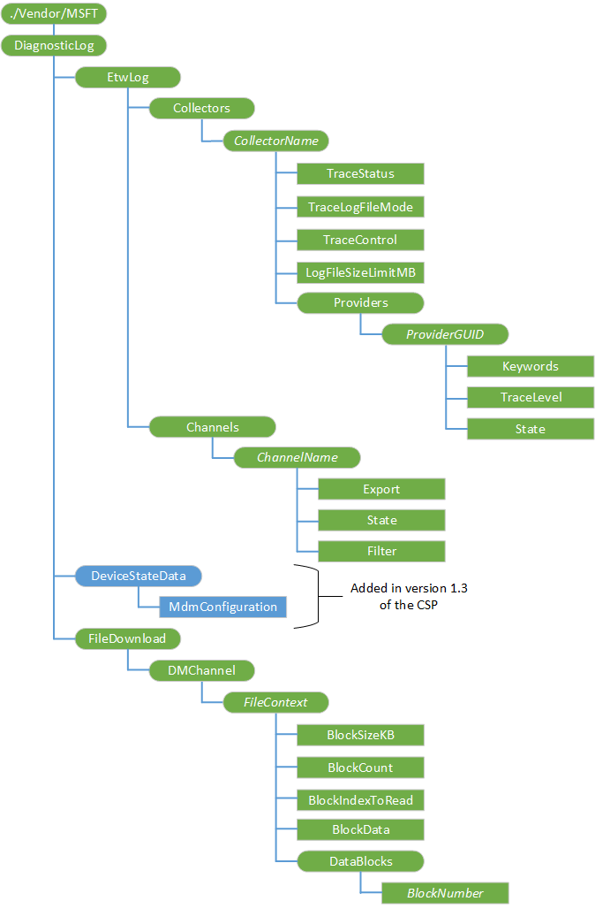

# DiagnosticLog CSP

The DiagnosticLog configuration service provider (CSP) is used in the following scenarios:  
- [Controlling ETW trace sessions](#diagnosticlog-csp-for-controlling-etw-trace-sessions)
- [Triggering devices to upload existing event logs, log files, and registry values to cloud storage](#diagnosticlog-csp-for-triggering-devices-to-upload-files-to-cloud)

## DiagnosticLog CSP for controlling ETW trace sessions
The DiagnosticLog CSP is used for generating and collecting diagnostic information from the device: Event Tracing for Windows (ETW) log files and current MDM configured state of the device.

DiagnosticLog CSP supports the following type of event tracing:

- Collector-based tracing
- Channel-based tracing

### Collector-based tracing

This type of event tracing simultaneously collects event data from a collection of registered ETW providers.

An event collector is a container of registered ETW providers. Users can add or delete a collector node and register or unregister multiple providers in this collector.

The ***CollectorName*** must be unique within the CSP and must not be a valid event channel name or a provider GUID.

The DiagnosticLog CSP maintains a log file for each collector node and the log file is overwritten if a start command is triggered again on the same collector node.

For each collector node, the user can:

-   Start or stop the session with all registered and enabled providers
-   Query session status
-   Change trace log file mode
-   Change trace log file size limit

The configurations log file mode and log file size limit does not take effect while trace session is in progress. These are applied when user stops the current session and then starts it again for this collector.

For each registered provider in this collector, the user can:

-   Specify keywords to filter events from this provider
-   Change trace level to filter events from this provider
-   Enable or disable the provider in the trace session

The changes on **State**, **Keywords** and **TraceLevel** takes effect immediately while trace session is in progress.

> [!Note]
> Microsoft-WindowsPhone-Enterprise-Diagnostics-Provider (GUID - 3da494e4-0fe2-415C-b895-fb5265c5c83b) has the required debug resource files built into Windows OS, which will allow the logs files to be decoded on the remote machine. Any other logs may not have the debug resources required to decode.

 ### Channel-based tracing

The type of event tracing exports event data from a specific channel. This is only supported on the desktop.

Users can add or delete a channel node using the full name, such as Microsoft-Windows-AppModel-Runtime/Admin.

The DiagnosticLog CSP maintains a log file for each channel node and the log file is overwritten if a start command is triggered again on the same channel node.

For each channel node, the user can:

-   Export channel event data into a log file (.evtx)
-   Enable or disable the channel from Event Log service to allow or disallow event data being written into the channel
-   Specify an XPath query to filter events while exporting the channel event data

For more information about using DiagnosticLog to collect logs remotely from a PC or mobile device, see [Diagnose MDM failures in Windows 10](diagnose-mdm-failures-in-windows-10.md).

Here are the links to the DDFs:

-   [DiagnosticLog CSP version 1.2](diagnosticlog-ddf.md#version-1-2)
-   [DiagnosticLog CSP version 1.3](diagnosticlog-ddf.md#version-1-3)
-   [DiagnosticLog CSP version 1.4](diagnosticlog-ddf.md#version-1-4)

The following diagram shows the DiagnosticLog CSP in tree format.



<a href="" id="--vendor-msft-diagnosticlog"></a>**./Vendor/MSFT/DiagnosticLog**  
The root node for the DiagnosticLog CSP.

To gather diagnostics using this CSP:

1.  Specify a *CollectorName* for the container of the target ETW providers.
2.  (Optional) Set logging and log file parameters using the following options:

    - <a href="#etwlog-collectors-collectorname-tracelogfilemode">TraceLogFileMode</a>
    - <a href="#etwlog-collectors-collectorname-logfilesizelimitmb">LogFileSizeLimitMB</a>

3.  Indicate one or more target ETW providers by supplying its *ProviderGUID* to the Add operation of EtwLog/Collectors/*CollectorName*/Providers/*ProviderGUID*.
4.  (Optional) Set logging and log file parameters using the following options:
    - <a href="#etwlog-collectors-collectorname-providers-providerguid-tracelevel">TraceLevel</a>
    -   <a href="#etwlog-collectors-collectorname-providers-providerguid-keywords">Keywords</a>
5.  Start logging using **TraceControl** EXECUTE command “START”.
6.  Perform actions on the target device that will generate activity in the log files.
7.  Stop logging using **TraceControl** EXECUTE command “STOP”.
8.  Collect the log file located in the `%temp%` folder using the method described in [Reading a log file](#reading-a-log-file).

<a href="" id="etwlog"></a>**EtwLog**  
Node to contain the Error Tracing for Windows log.

The supported operation is Get.

<a href="" id="etwlog-collectors"></a>**EtwLog/Collectors**  
Interior node to contain dynamic child interior nodes for active providers.

The supported operation is Get.

<a href="" id="etwlog-collectors-collectorname"></a>**EtwLog/Collectors/**<strong>*CollectorName*</strong>  
Dynamic nodes to represent active collector configuration.

Supported operations are Add, Delete, and Get.

Add a collector

```xml
<?xml version="1.0"?>
<SyncML xmlns="SYNCML:SYNCML1.2">
    <SyncBody>
        <Add>
            <CmdID>1</CmdID>
            <Item>
                <Target>
                    <LocURI>./Vendor/MSFT/DiagnosticLog/EtwLog/Collectors/DeviceManagement</LocURI>
                </Target>
                <Meta>
                    <Format xmlns="syncml:metinf">node</Format>
                </Meta>
            </Item>
        </Add>
        <Final/>
    </SyncBody>
</SyncML>
```

Delete a collector

```xml
<?xml version="1.0"?>
<SyncML xmlns="SYNCML:SYNCML1.2">
    <SyncBody>
        <Delete>
            <CmdID>1</CmdID>
            <Item>
                <Target>
                    <LocURI>./Vendor/MSFT/DiagnosticLog/EtwLog/Collectors/DeviceManagement</LocURI>
                </Target>
            </Item>
        </Delete>
        <Final/>
    </SyncBody>
</SyncML>
```

<a href="" id="etwlog-collectors-collectorname-tracestatus"></a>**EtwLog/Collectors/*CollectorName*/TraceStatus**  
Specifies whether the current logging status is running.

The data type is an integer.

The supported operation is Get.

The following table represents the possible values:

| Value | Description |
|-------|-------------|
| 0     | Stopped     |
| 1     | Started     |

<a href="" id="etwlog-collectors-collectorname-tracelogfilemode"></a>**EtwLog/Collectors/*CollectorName*/TraceLogFileMode**  
Specifies the log file logging mode.

The data type is an integer.

Supported operations are Get and Replace.

The following table lists the possible values:

| Value | Description        |
|-------|--------------------|
| EVENT_TRACE_FILE_MODE_SEQUENTIAL (0x00000001) | Writes events to a log file sequentially; stops when the file reaches its maximum size. |
| EVENT_TRACE_FILE_MODE_CIRCULAR (0x00000002)  | Writes events to a log file. After the file reaches the maximum size, the oldest events are replaced with incoming events.   |

<a href="" id="etwlog-collectors-collectorname-tracecontrol"></a>**EtwLog/Collectors/*CollectorName*/TraceControl**  
Specifies the logging and report action state.

The data type is a string.

The following table lists the possible values:

| Value | Description        |
|-------|--------------------|
| START | Start log tracing. |
| STOP  | Stop log tracing   |

The supported operation is Execute.

After you have added a logging task, you can start a trace by running an Execute command on this node with the value START.

To stop the trace, running an execute command on this node with the value STOP.

Start collector trace logging

```xml
<?xml version="1.0"?>
<SyncML xmlns="SYNCML:SYNCML1.2">
    <SyncBody>
        <Exec>
            <CmdID>2</CmdID>
            <Item>
                <Target>
                    <LocURI>./Vendor/MSFT/DiagnosticLog/EtwLog/Collectors/DeviceManagement/TraceControl</LocURI>
                </Target>
                <Meta>
                    <Format xmlns="syncml:metinf">chr</Format>
                </Meta>
                <Data>START</Data>
            </Item>
        </Exec>
        <Final/>
    </SyncBody>
</SyncML>
```

Stop collector trace logging

```xml
<?xml version="1.0"?>
<SyncML xmlns="SYNCML:SYNCML1.2">
    <SyncBody>
        <Exec>
            <CmdID>2</CmdID>
            <Item>
                <Target>
                    <LocURI>./Vendor/MSFT/DiagnosticLog/EtwLog/Collectors/DeviceManagement/TraceControl</LocURI>
                </Target>
                <Meta>
                    <Format xmlns="syncml:metinf">chr</Format>
                </Meta>
                <Data>STOP</Data>
            </Item>
        </Exec>
        <Final/>
    </SyncBody>
</SyncML>
```

<a href="" id="etwlog-collectors-collectorname-logfilesizelimitmb"></a>**EtwLog/Collectors/*CollectorName*/LogFileSizeLimitMB**  
Sets the log file size limit, in MB.

The data type is an integer.

Valid values are 1-2048. The default value is 4.

Supported operations are Get and Replace.

<a href="" id="etwlog-collectors-collectorname-providers"></a>**EtwLog/Collectors/*CollectorName*/Providers**  
Interior node to contain dynamic child interior nodes for active providers.

The supported operation is Get.

<a href="" id="etwlog-collectors-collectorname-providers-providerguid"></a>**EtwLog/Collectors/*CollectorName*/Providers/**<strong>*ProviderGUID*</strong>  
Dynamic nodes to represent active provider configuration per provider GUID.

> **Note**  Microsoft-WindowsPhone-Enterprise-Diagnostics-Provider (GUID - 3da494e4-0fe2-415C-b895-fb5265c5c83b) has the required debug resource files built into Windows OS, which will allow the logs files to be decoded on the remote machine. Any other logs may not have the debug resources required to decode.

Supported operations are Add, Delete, and Get.

Add a provider

```xml
<?xml version="1.0"?>
<SyncML xmlns="SYNCML:SYNCML1.2">
    <SyncBody>
        <Add>
            <CmdID>1</CmdID>
            <Item>
                <Target>
                    <LocURI>./Vendor/MSFT/DiagnosticLog/EtwLog/Collectors/DeviceManagement/Providers/3da494e4-0fe2-415C-b895-fb5265c5c83b</LocURI>
                </Target>
                <Meta>
                    <Format xmlns="syncml:metinf">node</Format>
                </Meta>
            </Item>
        </Add>
        <Final/>
    </SyncBody>
</SyncML>
```

Delete a provider

```xml
<?xml version="1.0"?>
<SyncML xmlns="SYNCML:SYNCML1.2">
    <SyncBody>
        <Delete>
            <CmdID>1</CmdID>
            <Item>
                <Target>
                    <LocURI>./Vendor/MSFT/DiagnosticLog/EtwLog/Collectors/DeviceManagement/Providers/3da494e4-0fe2-415C-b895-fb5265c5c83b</LocURI>
                </Target>
            </Item>
        </Delete>
        <Final/>
    </SyncBody>
</SyncML>
```

<a href="" id="etwlog-collectors-collectorname-providers-providerguid-tracelevel"></a>**EtwLog/Collectors/*CollectorName*/Providers/*ProviderGUID*/TraceLevel**  
Specifies the level of detail included in the trace log.

The data type is an integer.

Supported operations are Get and Replace.

The following table lists the possible values:

| Value | Description        |
|-------|--------------------|
| 1 – TRACE_LEVEL_CRITICAL | Abnormal exit or termination events |
| 2 – TRACE_LEVEL_ERROR  | Severe error events   |
| 3 – TRACE_LEVEL_WARNING  | Warning events such as allocation failures   |
| 4 – TRACE_LEVEL_INFORMATION  | Non-error events, such as entry or exit events   |
| 5 – TRACE_LEVEL_VERBOSE  | Detailed information   |

Set provider **TraceLevel**

```xml
<?xml version="1.0"?>
<SyncML xmlns="SYNCML:SYNCML1.2">
    <SyncBody>
        <Replace>
            <CmdID>2</CmdID>
            <Item>
                <Target>
                    <LocURI>./Vendor/MSFT/DiagnosticLog/EtwLog/Collectors/DeviceManagement/Providers/3da494e4-0fe2-415C-b895-fb5265c5c83b/TraceLevel</LocURI>
                </Target>
                <Meta>
                    <Format xmlns="syncml:metinf">int</Format>
                </Meta>
                <Data>1</Data>
            </Item>
        </Replace>
        <Final/>
    </SyncBody>
</SyncML>
```

<a href="" id="etwlog-collectors-collectorname-providers-providerguid-keywords"></a>**EtwLog/Collectors/*CollectorName*/Providers/*ProviderGUID*/Keywords**  
Specifies the provider keywords to be used as MatchAnyKeyword for this provider.

The data type is a string.

Supported operations are Get and Replace.

Default value is 0 meaning no keyword.

Get provider **Keywords**

```xml
<SyncML xmlns="SYNCML:SYNCML1.2">
  <SyncBody>
    <Get>
      <CmdID>1</CmdID>
      <Item>
        <Target>
          <LocURI>
            ./Vendor/MSFT/DiagnosticLog/EtwLog/Collectors/DeviceManagement/Providers/3da494e4-0fe2-415C-b895-fb5265c5c83b/Keywords
          </LocURI>
        </Target>
      </Item>
    </Get>
    <Final/> 
  </SyncBody>
</SyncML>
```

Set provider **Keywords**

```xml
<SyncML xmlns="SYNCML:SYNCML1.2">
  <SyncBody>
    <Replace>
      <CmdID>4</CmdID>
      <Item>
        <Target>
          <LocURI>
            ./Vendor/MSFT/DiagnosticLog/EtwLog/Collectors/DeviceManagement/Providers/3da494e4-0fe2-415C-b895-fb5265c5c83b/Keywords
          </LocURI>
        </Target>
        <Meta>
          <Format xmlns="syncml:metinf">chr</Format>
          <Type>text/plain</Type>
        </Meta>
        <Data>12345678FFFFFFFF</Data>
      </Item>
    </Replace>
    <Final/> 
  </SyncBody>
</SyncML>
```

<a href="" id="etwlog-collectors-collectorname-providers-providerguid-state"></a>**EtwLog/Collectors/*CollectorName*/Providers/*ProviderGUID*/State**  
Specifies if this provider is enabled in the trace session.

The data type is a boolean.

Supported operations are Get and Replace. This change will be effective during active trace session.

The following table lists the possible values:
| Value | Description        |
|-------|--------------------|
| TRUE | Provider is enabled in the trace session. This is the default. |
| FALSE  | Provider is disabled in the trace session.   |

Set provider **State**

```xml
<?xml version="1.0"?>
<SyncML xmlns="SYNCML:SYNCML1.2">
    <SyncBody>
        <Replace>
            <CmdID>2</CmdID>
            <Item>
                <Target>
                    <LocURI>./Vendor/MSFT/DiagnosticLog/EtwLog/Collectors/DeviceManagement/Providers/3da494e4-0fe2-415C-b895-fb5265c5c83b/State</LocURI>
                </Target>
                <Meta>
                    <Format xmlns="syncml:metinf">bool</Format>
                </Meta>
                <Data>false</Data>
            </Item>
        </Replace>
        <Final/>
    </SyncBody>
</SyncML>
```

<a href="" id="etwlog-channels"></a>**EtwLog/Channels**  
Interior node to contain dynamic child interior nodes for registered channels.

The supported operation is Get.

<a href="" id="etwlog-channels-channelname"></a>**EtwLog/Channels/**<strong>*ChannelName*</strong>  
Dynamic nodes to represent a registered channel. The node name must be a valid Windows event log channel name, such as "Microsoft-Client-Licensing-Platform%2FAdmin"

Supported operations are Add, Delete, and Get.

Add a channel

```xml
<?xml version="1.0"?>
<SyncML xmlns="SYNCML:SYNCML1.2">
    <SyncBody>
        <Add>
            <CmdID>1</CmdID>
            <Item>
                <Target>
                    <LocURI>./Vendor/MSFT/DiagnosticLog/EtwLog/Channels/Microsoft-Client-Licensing-Platform%2FAdmin</LocURI>
                </Target>
                <Meta>
                    <Format xmlns="syncml:metinf">node</Format>
                </Meta>
            </Item>
        </Add>
        <Final/>
    </SyncBody>
</SyncML>
```

Delete a channel

```xml
<?xml version="1.0"?>
<SyncML xmlns="SYNCML:SYNCML1.2">
    <SyncBody>
        <Delete>
            <CmdID>1</CmdID>
            <Item>
                <Target>
                    <LocURI>./Vendor/MSFT/DiagnosticLog/EtwLog/Channels/Microsoft-Client-Licensing-Platform%2FAdmin</LocURI>
                </Target>
            </Item>
        </Delete>
        <Final/>
    </SyncBody>
</SyncML>
```

<a href="" id="etwlog-channels-channelname-export"></a>**EtwLog/Channels/*ChannelName*/Export**  
Node to trigger the command to export channel event data into the log file.

The supported operation is Execute.

Export channel event data

```xml
<?xml version="1.0"?>
<SyncML xmlns="SYNCML:SYNCML1.2">
    <SyncBody>
        <Exec>
            <CmdID>2</CmdID>
            <Item>
                <Target>
                    <LocURI>./Vendor/MSFT/DiagnosticLog/EtwLog/Channels/Microsoft-Client-Licensing-Platform%2FAdmin/Export</LocURI>
                </Target>
            </Item>
        </Exec>
        <Final/>
    </SyncBody>
</SyncML>
```

<a href="" id="etwlog-channels-channelname-filter"></a>**EtwLog/Channels/*ChannelName*/Filter**  
Specifies the XPath query string to filter the events while exporting.

The data type is a string.

Supported operations are Get and Replace.

Default value is empty string.

Get channel **Filter**

```xml
<?xml version="1.0"?>
<SyncML xmlns="SYNCML:SYNCML1.2">
    <SyncBody>
        <Get>
            <CmdID>1</CmdID>
            <Item>
                <Target>
                    <LocURI>./Vendor/MSFT/DiagnosticLog/EtwLog/Channels/Microsoft-Client-Licensing-Platform%2FAdmin/Filter</LocURI>
                </Target>
            </Item>
        </Get>
        <Final/>
    </SyncBody>
</SyncML>
```

<a href="" id="etwlog-channels-channelname-state"></a>**EtwLog/Channels/*ChannelName*/State**  
Specifies if the Channel is enabled or disabled.

The data type is a boolean.

Supported operations are Get and Replace.

The following table lists the possible values:

| Value | Description        |
|-------|--------------------|
| TRUE | Channel is enabled. |
| FALSE  | Channel is disabled. |

Get channel **State**

```xml
<?xml version="1.0"?>
<SyncML xmlns="SYNCML:SYNCML1.2">
    <SyncBody>
        <Get>
            <CmdID>1</CmdID>
            <Item>
                <Target>
                    <LocURI>./Vendor/MSFT/DiagnosticLog/EtwLog/Channels/Microsoft-Client-Licensing-Platform%2FAdmin/State</LocURI>
                </Target>
            </Item>
        </Get>
        <Final/>
    </SyncBody>
</SyncML>
```

Set channel **State**

```xml
<?xml version="1.0"?>
<SyncML xmlns="SYNCML:SYNCML1.2">
    <SyncBody>
        <Replace>
            <CmdID>2</CmdID>
            <Item>
                <Target>
                    <LocURI>./Vendor/MSFT/DiagnosticLog/EtwLog/Channels/Microsoft-Client-Licensing-Platform%2FAdmin/State</LocURI>
                </Target>
                <Meta>
                    <Format xmlns="syncml:metinf">bool</Format>
                </Meta>
                <Data>false</Data>
            </Item>
        </Replace>
        <Final/>
    </SyncBody>
</SyncML>
```

<a href="" id="devicestatedata"></a>**DeviceStateData**  
Added in version 1.3 of the CSP in Windows 10, version 1607. Node for all types of device state data that are exposed.

<a href="" id="devicestatedata-mdmconfiguration"></a>**DeviceStateData/MdmConfiguration**  
Added in version 1.3 of the CSP in Windows 10, version 1607. Triggers the snapping of device management state data with SNAP.

The supported value is Execute.

```xml
<?xml version="1.0"?>
<SyncML xmlns="SYNCML:SYNCML1.2">
  <SyncBody>
    <Exec>
      <CmdID>2</CmdID>
      <Item>
        <Target>
          <LocURI>./Vendor/MSFT/DiagnosticLog/DeviceStateData/MdmConfiguration</LocURI>
        </Target>
        <Meta>
           <Format xmlns="syncml:metinf">chr</Format>
        </Meta>
        <Data>SNAP</Data>
      </Item>
    </Exec>
    <Final/>
  </SyncBody>
</SyncML>
```

<a href="" id="filedownload"></a>**FileDownload**  
Node to contain child nodes for log file transportation protocols and corresponding actions.

<a href="" id="filedownload-dmchannel"></a>**FileDownload/DMChannel**  
Node to contain child nodes using DM channel for transport protocol.

<a href="" id="filedownload-dmchannel-filecontext"></a>**FileDownload/DMChannel/**<strong>*FileContext*</strong>  
Dynamic interior nodes that represents per log file context.

<a href="" id="filedownload-dmchannel-filecontext-blocksizekb"></a>**FileDownload/DMChannel/*FileContext*/BlockSizeKB**  
Sets the log read buffer, in KB.

The data type is an integer.

Valid values are 1-16. The default value is 4.

Supported operations are Get and Replace.

Set **BlockSizeKB**

```xml
<?xml version="1.0"?>
<SyncML xmlns="SYNCML:SYNCML1.2">
    <SyncBody>
        <Replace>
            <CmdID>1</CmdID>
            <Item>
                <Target>
                    <LocURI>./Vendor/MSFT/DiagnosticLog/FileDownload/DMChannel/DeviceManagement/BlockSizeKB</LocURI>
                </Target>
                <Meta>
                    <Format xmlns="syncml:metinf">int</Format>
                </Meta>
                <Data>1</Data>
            </Item>
        </Replace>
        <Final/>
    </SyncBody>
</SyncML>
```

Get **BlockSizeKB**

```xml
<?xml version="1.0"?>
<SyncML xmlns="SYNCML:SYNCML1.2">
    <SyncBody>
        <Get>
            <CmdID>1</CmdID>
            <Item>
                <Target>
                    <LocURI>./Vendor/MSFT/DiagnosticLog/FileDownload/DMChannel/DeviceManagement/BlockSizeKB</LocURI>
                </Target>
            </Item>
        </Get>
        <Final/>
    </SyncBody>
</SyncML>
```

<a href="" id="filedownload-dmchannel-filecontext-blockcount"></a>**FileDownload/DMChannel/*FileContext*/BlockCount**  
Represents the total read block count for the log file.

The data type is an integer.

The only supported operation is Get.

Get **BlockCount**

```xml
<?xml version="1.0"?>
<SyncML xmlns="SYNCML:SYNCML1.2">
    <SyncBody>
        <Get>
            <CmdID>1</CmdID>
            <Item>
                <Target>
                    <LocURI>./Vendor/MSFT/DiagnosticLog/FileDownload/DMChannel/DeviceManagement/BlockCount</LocURI>
                </Target>
            </Item>
        </Get>
        <Final/>
    </SyncBody>
</SyncML>
```

<a href="" id="filedownload-dmchannel-filecontext-blockindextoread"></a>**FileDownload/DMChannel/*FileContext*/BlockIndexToRead**  
Represents the read block start location.

The data type is an integer.

Supported operations are Get and Replace.

Set **BlockIndexToRead** at 0

```xml
<?xml version="1.0"?>
<SyncML xmlns="SYNCML:SYNCML1.2">
    <SyncBody>
        <Replace>
            <CmdID>1</CmdID>
            <Item>
                <Target>
                    <LocURI>./Vendor/MSFT/DiagnosticLog/FileDownload/DMChannel/DeviceManagement/BlockIndexToRead</LocURI>
                </Target>
                <Meta>
                    <Format xmlns="syncml:metinf">int</Format>
                </Meta>
                <Data>0</Data>
            </Item>
        </Replace>
        <Final/>
    </SyncBody>
</SyncML>
```

Set **BlockIndexToRead** at 1

```xml
<?xml version="1.0"?>
<SyncML xmlns="SYNCML:SYNCML1.2">
    <SyncBody>
        <Replace>
            <CmdID>1</CmdID>
            <Item>
                <Target>
                    <LocURI>./Vendor/MSFT/DiagnosticLog/FileDownload/DMChannel/DeviceManagement/BlockIndexToRead</LocURI>
                </Target>
                <Meta>
                    <Format xmlns="syncml:metinf">int</Format>
                </Meta>
                <Data>1</Data>
            </Item>
        </Replace>
        <Final/>
    </SyncBody>
</SyncML>
```

<a href="" id="filedownload-dmchannel-filecontext-blockdata"></a>**FileDownload/DMChannel/*FileContext*/BlockData**  
The data type is Base64.

The only supported operation is Get.

Get **BlockData**

```xml
<?xml version="1.0"?>
<SyncML xmlns="SYNCML:SYNCML1.2">
    <SyncBody>
        <Get>
            <CmdID>1</CmdID>
            <Item>
                <Target>
                    <LocURI>./Vendor/MSFT/DiagnosticLog/FileDownload/DMChannel/DeviceManagement/BlockData</LocURI>
                </Target>
            </Item>
        </Get>
        <Final/>
    </SyncBody>
</SyncML>
```

<a href="" id="filedownload-dmchannel-filecontext-datablocks"></a>**FileDownload/DMChannel/*FileContext*/DataBlocks**  
Node to transfer the selected log file block to the DM server.

<a href="" id="filedownload-dmchannel-filecontext-datablocks-blocknumber"></a>**FileDownload/DMChannel/*FileContext*/DataBlocks/**<strong>*BlockNumber*</strong>  
The data type is Base64.

The supported operation is Get.

<a href="" id="policy"></a>**Policy**  
Added in version 1.4 of the CSP in Windows 10, version 1903. Root node to control settings for channels in Event Log.

The supported operation is Get.

<a href="" id="policy-channels"></a>**Policy/Channels**  
Added in version 1.4 of the CSP in Windows 10, version 1903. Node that contains Event Log channel settings.

The supported operation is Get.

<a href="" id="policy-channels-channelname"></a>**Policy/Channels/_ChannelName_**  
Added in version 1.4 of the CSP in Windows 10, version 1903. Dynamic node to represent a registered channel. The node name must be a valid Windows event log channel name, such as ``Microsoft-Client-Licensing-Platform%2FAdmin``. When specifying the name in the LocURI, it must be URL encoded, otherwise it may unexpectedly translate into a different URI.

Supported operations are Add, Delete, and Get.

Add **Channel**
``` xml
 <SyncML xmlns="SYNCML:SYNCML1.2">
  <SyncBody>​
    <Add>​
      <CmdID>2</CmdID>​
      <Item>​
        <Target>​
          <LocURI>​
            ./Vendor/MSFT/DiagnosticLog/Policy/Channels/ChannelName​
          </LocURI>​
        </Target>​
        <Meta>​
          <Format xmlns="syncml:metinf">node</Format>​
          <Type></Type>​
        </Meta>​
      </Item>​
    </Add>​
    <Final/> ​
  </SyncBody>​
</SyncML>
```
Delete **Channel**
``` xml
<SyncML xmlns="SYNCML:SYNCML1.2">
  <SyncBody>​
    <Delete>​
      <CmdID>3</CmdID>​
      <Item>​
        <Target>​
          <LocURI>​
            ./Vendor/MSFT/DiagnosticLog/Policy/Channels/ChannelName​
          </LocURI>​
        </Target>​
      </Item>​
    </Delete>​
    <Final/> ​
  </SyncBody>​
</SyncML>
```
Get **Channel**
``` xml
<SyncML xmlns="SYNCML:SYNCML1.2">
  <SyncBody>​
    <Get>​
      <CmdID>4</CmdID>​
      <Item>​
        <Target>​
          <LocURI>​
            ./Vendor/MSFT/DiagnosticLog/Policy/Channels/ChannelName​
          </LocURI>​
        </Target>​
      </Item>​
    </Get>​
    <Final/> ​
  </SyncBody>​
</SyncML>
```
<a href="" id="policy-channels-channelname-maximumfilesize"></a>**Policy/Channels/_ChannelName_/MaximumFileSize**  
Added in version 1.4 of the CSP in Windows 10, version 1903. This policy setting specifies the maximum size of the log file in megabytes.

If you enable this policy setting, you can configure the maximum log file size to be between 1 megabyte and 2 terabytes in megabyte increments.

If you disable or do not configure this policy setting, the maximum size of the log file will be set to the locally configured value. This value can be changed by the local administrator using the Log Properties dialog, and it defaults to 1 megabyte.

Supported operations are Add, Delete, Get, and Replace.

The data type is integer.

Add **MaximumFileSize**
``` xml
<SyncML xmlns="SYNCML:SYNCML1.2">
  <SyncBody>​
    <Add>​
      <CmdID>6</CmdID>​
      <Item>​
        <Target>​
          <LocURI>​
            ./Vendor/MSFT/DiagnosticLog/Policy/Channels/ChannelName/MaximumFileSize​
          </LocURI>​
        </Target>​
        <Meta>​
          <Format xmlns="syncml:metinf">int</Format>​
          <Type>text/plain</Type>​
        </Meta>​
        <Data>3</Data>​
      </Item>​
    </Add>​
    <Final/> ​
  </SyncBody>​
</SyncML>
```

Delete **MaximumFileSize**
``` xml
<SyncML xmlns="SYNCML:SYNCML1.2">
  <SyncBody>​
    <Delete>​
      <CmdID>7</CmdID>​
      <Item>​
        <Target>​
          <LocURI>​
            ./Vendor/MSFT/DiagnosticLog/Policy/Channels/ChannelName/MaximumFileSize​
          </LocURI>​
        </Target>​
      </Item>​
    </Delete>​
    <Final/> ​
  </SyncBody>​
</SyncML>
```
Get **MaximumFileSize**
``` xml
<SyncML xmlns="SYNCML:SYNCML1.2">
  <SyncBody>​
    <Get>​
      <CmdID>5</CmdID>​
      <Item>​
        <Target>​
          <LocURI>​
            ./Vendor/MSFT/DiagnosticLog/Policy/Channels/ChannelName/MaximumFileSize​
          </LocURI>​
        </Target>​
      </Item>​
    </Get>​
    <Final/> ​
  </SyncBody>​
</SyncML>
```

Replace **MaximumFileSize**
``` xml
<SyncML xmlns="SYNCML:SYNCML1.2">
  <SyncBody>​
    <Replace>​
      <CmdID>8</CmdID>​
      <Item>​
        <Target>​
          <LocURI>​
            ./Vendor/MSFT/DiagnosticLog/Policy/Channels/ChannelName/MaximumFileSize​
          </LocURI>​
        </Target>​
        <Meta>​
          <Format xmlns="syncml:metinf">int</Format>​
          <Type>text/plain</Type>​
        </Meta>​
        <Data>5</Data>​
      </Item>​
    </Replace>​
    <Final/> ​
  </SyncBody>​
</SyncML>
```

<a href="" id="policy-channels-channelname-sddl"></a>**Policy/Channels/_ChannelName_/SDDL**  
Added in version 1.4 of the CSP in Windows 10, version 1903. This policy setting represents SDDL string controlling access to the channel.

Supported operations are Add, Delete, Get, and Replace.

The data type is string.

Default string is as follows:

https://docs.microsoft.com/en-us/windows/desktop/WES/eventmanifestschema-channeltype-complextype. 

Add **SDDL**
``` xml
<SyncML xmlns="SYNCML:SYNCML1.2">
  <SyncBody>​
    <Add>​
      <CmdID>10</CmdID>​
      <Item>​
        <Target>​
          <LocURI>​
            ./Vendor/MSFT/DiagnosticLog/Policy/Channels/ChannelName/SDDL​
          </LocURI>​
        </Target>​
        <Meta>​
          <Format xmlns="syncml:metinf">chr</Format>​
          <Type>text/plain</Type>​
        </Meta>​
        <Data>YourSDDL</Data>​
      </Item>​
    </Add>​
    <Final/> ​
  </SyncBody>​
</SyncML>
```

Delete **SDDL**
``` xml

<SyncML xmlns="SYNCML:SYNCML1.2">
  <SyncBody>​
    <Delete>​
      <CmdID>11</CmdID>​
      <Item>​
        <Target>​
          <LocURI>​
            ./Vendor/MSFT/DiagnosticLog/Policy/Channels/ChannelName/SDDL​
          </LocURI>​
        </Target>​
      </Item>​
    </Delete>​
    <Final/> ​
  </SyncBody>​
</SyncML>
```

Get **SDDL**
``` xml
<SyncML xmlns="SYNCML:SYNCML1.2">
  <SyncBody>​
    <Get>​
      <CmdID>9</CmdID>​
      <Item>​
        <Target>​
          <LocURI>​
            ./Vendor/MSFT/DiagnosticLog/Policy/Channels/ChannelName/SDDL​
          </LocURI>​
        </Target>​
      </Item>​
    </Get>​
    <Final/> ​
  </SyncBody>​
</SyncML>
```

Replace **SDDL**
``` xml
<SyncML xmlns="SYNCML:SYNCML1.2">
  <SyncBody>​
    <Replace>​
      <CmdID>12</CmdID>​
      <Item>​
        <Target>​
          <LocURI>​
            ./Vendor/MSFT/DiagnosticLog/Policy/Channels/ChannelName/SDDL​
          </LocURI>​
        </Target>​
        <Meta>​
          <Format xmlns="syncml:metinf">chr</Format>​
          <Type>text/plain</Type>​
        </Meta>​
        <Data>YourNewSDDL</Data>​
      </Item>​
    </Replace>​
    <Final/> ​
  </SyncBody>​
</SyncML>
```

<a href="" id="policy-channels-channelname-actionwhenfull"></a>**Policy/Channels/_ChannelName_/ActionWhenFull**  
Added in version 1.4 of the CSP in Windows 10, version 1903. This policy setting controls Event Log behavior when the log file reaches its maximum size. 

Supported operations are Add, Delete, Get, and Replace.

The data type is string.

The following are the possible values:  
- Truncate — When the log file reaches its maximum file size, new events are not written to the log and are lost.
- Overwrite — When the log file reaches its maximum file size, new events overwrite old events.
- Archive — When the log file reaches its maximum size, the log file is saved to the location specified by the "Archive Location" policy setting. If archive location value is not set, the new file is saved in the same directory as current log file.

If you disable or do not configure this policy setting, the locally configured value will be used as default. Every channel that is installed, whether inbox or by ISVs, is responsible for defining its own local configuration, and that configuration can be changed by any administrator. Values set via this policy override but do not replace local configuration.


Add **ActionWhenFull**
``` xml
<SyncML xmlns="SYNCML:SYNCML1.2">
  <SyncBody>​
    <Add>​
      <CmdID>14</CmdID>​
      <Item>​
        <Target>​
          <LocURI>​
            ./Vendor/MSFT/DiagnosticLog/Policy/Channels/ChannelName/ActionWhenFull​
          </LocURI>​
        </Target>​
        <Meta>​
          <Format xmlns="syncml:metinf">chr</Format>​
          <Type>text/plain</Type>​
        </Meta>​
        <Data>Archive</Data>​
      </Item>​
    </Add>​
    <Final/> ​
  </SyncBody>​
</SyncML>
```

Delete **ActionWhenFull**
``` xml
<SyncML xmlns="SYNCML:SYNCML1.2">
  <SyncBody>​
    <Delete>​
      <CmdID>15</CmdID>​
      <Item>​
        <Target>​
          <LocURI>​
            ./Vendor/MSFT/DiagnosticLog/Policy/Channels/ChannelName/ActionWhenFull​
          </LocURI>​
        </Target>​
      </Item>​
    </Delete>​
    <Final/> ​
  </SyncBody>​
</SyncML>
```

Get **ActionWhenFull**
``` xml
<SyncML xmlns="SYNCML:SYNCML1.2">
  <SyncBody>​
    <Get>​
      <CmdID>13</CmdID>​
      <Item>​
        <Target>​
          <LocURI>​
            ./Vendor/MSFT/DiagnosticLog/Policy/Channels/ChannelName/ActionWhenFull​
          </LocURI>​
        </Target>​
      </Item>​
    </Get>​
    <Final/> ​
  </SyncBody>​
</SyncML>
```

Replace **ActionWhenFull**
``` xml
<SyncML xmlns="SYNCML:SYNCML1.2">
  <SyncBody>​
    <Replace>​
      <CmdID>16</CmdID>​
      <Item>​
        <Target>​
          <LocURI>​
            ./Vendor/MSFT/DiagnosticLog/Policy/Channels/ChannelName/ActionWhenFull​
          </LocURI>​
        </Target>​
        <Meta>​
          <Format xmlns="syncml:metinf">chr</Format>​
          <Type>text/plain</Type>​
        </Meta>​
        <Data>Truncate</Data>​
      </Item>​
    </Replace>​
    <Final/> ​
  </SyncBody>​
</SyncML>
```

<a href="" id="policy-channels-channelname-enabled"></a>**Policy/Channels/_ChannelName_/Enabled**  
Added in version 1.4 of the CSP in Windows 10, version 1903. This policy setting specifies whether the channel should be enabled or disabled.

Supported operations are Add, Delete, Get, and Replace.

The data type is boolean.

The following are the possible values:  
- TRUE — Enables the channel.
- FALSE — Disables the channel.

If you disable or do not configure this policy setting, the locally configured value is used as default.

Get **Enabled**
``` xml
<SyncML xmlns="SYNCML:SYNCML1.2">
  <SyncBody>​
    <Get>​
      <CmdID>17</CmdID>​
      <Item>​
        <Target>​
          <LocURI>​
            ./Vendor/MSFT/DiagnosticLog/Policy/Channels/ChannelName/Enabled​
          </LocURI>​
        </Target>​
      </Item>​
    </Get>​
    <Final/> ​
  </SyncBody>​
</SyncML>
```

Add **Enabled**
``` xml
<SyncML xmlns="SYNCML:SYNCML1.2">
  <SyncBody>​
    <Add>​
      <CmdID>18</CmdID>​
      <Item>​
        <Target>​
          <LocURI>​
            ./Vendor/MSFT/DiagnosticLog/Policy/Channels/ChannelName/Enabled​
          </LocURI>​
        </Target>​
        <Meta>​
          <Format xmlns="syncml:metinf">bool</Format>​
          <Type>text/plain</Type>​
        </Meta>​
        <Data>TRUE</Data>​
      </Item>​
    </Add>​
    <Final/> ​
  </SyncBody>​
</SyncML>
```

Delete **Enabled**
``` xml
<SyncML xmlns="SYNCML:SYNCML1.2">
  <SyncBody>​
    <Delete>​
      <CmdID>19</CmdID>​
      <Item>​
        <Target>​
          <LocURI>​
            ./Vendor/MSFT/DiagnosticLog/Policy/Channels/ChannelName/Enabled​
          </LocURI>​
        </Target>​
      </Item>​
    </Delete>​
    <Final/> ​
  </SyncBody>​
</SyncML>
```

Replace **Enabled**
``` xml
<SyncML xmlns="SYNCML:SYNCML1.2">
  <SyncBody>​
    <Replace>​
      <CmdID>20</CmdID>​
      <Item>​
        <Target>​
          <LocURI>​
            ./Vendor/MSFT/DiagnosticLog/Policy/Channels/ChannelName/Enabled​
          </LocURI>​
        </Target>​
        <Meta>​
          <Format xmlns="syncml:metinf">bool</Format>​
          <Type>text/plain</Type>​
        </Meta>​
        <Data>FALSE</Data>​
      </Item>​
    </Replace>​
    <Final/> ​
  </SyncBody>​
</SyncML>
```

## DiagnosticLog CSP for triggering devices to upload files to cloud
The DiagnosticLog CSP is used for triggering devices to upload existing event logs, log files, and registry values to cloud storage. The following section describes the nodes for the DiagnosticArchive functionality.

<a href="" id="diagnosticarchive"></a>**DiagnosticArchive**  
Added in version 1.4 of the CSP in Windows 10, version 1903. Root note for the DiagnosticArchive functionality. 

The supported operation is Get.

<a href="" id="diagnosticarchive-archivedefinition"></a>**DiagnosticArchive/ArchiveDefinition**  
Added in version 1.4 of the CSP in Windows 10, version 1903. 

The supported operations are Add and Execute.

The data type is string.

Expected value:
Set and Execute are functionality equivalent, and each accepts an XML snippet (as a string) describing what data to gather and where to upload it when done. This XML defines what should be collected and compressed into a zip file to be uploaded to Azure blog storage.

The following is an example of the XML. This example instructs that a zip file be created containing the output from a dump of the specified registry key, all the files in a folder, the output of two commands, all the files in another folder, the output of a command, all the Application events, two sets of files, and another command output. All of this will be uploaded to the blob storage URL as specified in the <SasUrl> tags and must be in the noted format with the container and the key in the URL. The administrator can retrieve this URL from Azure. The file uploaded will be in the format DiagLogs-{ComputerName}-YYYYMMDDTHHMMSSZ.zip.

``` xml
<Collection>
             <ID>f1e20cb4-9789-4f6b-8f6a-766989764c6d</ID>
             <SasUrl>{web address}/{container}{key}</SasUrl>
             <RegistryKey>HKLM\Software\Policies</RegistryKey>
             <FoldersFiles>C:\ProgramData\Microsoft\DiagnosticLogCSP\Collectors\*.etl</FoldersFiles>
             <Command>%windir%\system32\ipconfig.exe /all</Command>
             <Command>%windir%\system32\mdmdiagnosticstool.exe -out c:\ProgramData\temp\</Command>
             <FoldersFiles>c:\ProgramData\temp\*.*</FoldersFiles>
             <Command>%windir%\system32\ping.exe -n 50 localhost</Command>
             <Events>Application</Events>
             <FoldersFiles>%ProgramData%\Microsoft\DiagnosticLogCSP\Collectors\*.etl</FoldersFiles>
             <FoldersFiles>%SystemRoot%\System32\LogFiles\wmi\*.etl.*
             </FoldersFiles>
             <Command>%windir%\system32\pnputil.exe /enum-drivers</Command>
</Collection>

```
Where:

- ID is a unique GUID value that defines this particular run of the DiagnosticLog CSP.
- There can be multiple RegistryKey, FolderFiles, Command, and Events elements, which extract or execute and collect the output from the action specified. 
- SasUrl is generated from the Azure Blob Storage UX in Azure such that it will allow write access to the blob to upload the zip file created by all the actions specified. 

<a href="" id="diagnosticarchive-archiveresults"></a>**DiagnosticArchive/ArchiveResults**  
Added in version 1.4 of the CSP in Windows 10, version 1903. This policy setting displays the results of the last archive run. 

The supported operation is Get.

The data type is string. 

A Get to the above URI will return the results of the gathering of data for the last diagnostics request. For the example above it returns:

``` xml
<SyncML>
    <SyncHdr/>
      <SyncBody>
          <Status>
            <CmdID>1</CmdID>
            <MsgRef>1</MsgRef>
            <CmdRef>0</CmdRef>
            <Cmd>SyncHdr</Cmd>
            <Data>200</Data>
          </Status>
          <Status>
            <CmdID>2</CmdID>
            <MsgRef>1</MsgRef>
            <CmdRef>1</CmdRef>
            <Cmd>Get</Cmd>
            <Data>200</Data>
          </Status>
          <Results>
            <CmdID>3</CmdID>
            <MsgRef>1</MsgRef>
            <CmdRef>1</CmdRef>
          <Item>
            <Source>
            <LocURI>./Vendor/MSFT/DiagnosticLog/DiagnosticArchive/ArchiveResults</LocURI>
            </Source>
          <Data>
            <Collection HRESULT="0">
                <ID>f1e20cb4-9789-4f6b-8f6a-766989764c6d</ID>
                <RegistryKey HRESULT="0">HKLM\Software\Policies</RegistryKey>
                <FoldersFiles HRESULT="0">C:\ProgramData\Microsoft\DiagnosticLogCSP\Collectors\*.etl</FoldersFiles>
                <Command HRESULT="0">%windir%\system32\ipconfig.exe /all</Command>
                <Command HRESULT="-2147024637">%windir%\system32\mdmdiagnosticstool.exe -out c:\ProgramData\temp\</Command>
                <FoldersFiles HRESULT="0">c:\ProgramData\temp\*.*</FoldersFiles>
                <Command HRESULT="0">%windir%\system32\ping.exe -n 50 localhost</Command>
                <Events HRESULT="0">Application</Events>
                <FoldersFiles HRESULT="0">%ProgramData%\Microsoft\DiagnosticLogCSP\Collectors\*.etl</FoldersFiles>
                <FoldersFiles HRESULT="0">%SystemRoot%\System32\LogFiles\wmi\*.etl.*</FoldersFiles>
                <Command HRESULT="0">%windir%\system32\pnputil.exe /enum-drivers</Command>
              </Collection>
          </Data>
          </Item>
          </Results>
          <Final/>
      </SyncBody>
</SyncML>
```
> [!Note]
> Each data gathering node is annotated with the HRESULT of the option and the collection is also annotated with an HRESULT. In this example, note that the mdmdiagnosticstool.exe command failed.

## Reading a log file
To read a log file:  
1.  Enumerate log file under **./Vendor/MSFT/DiagnosticLog/FileDownload/DMChannel**.
2.  Select a log file in the Enumeration result.
3.  Set **BlockSizeKB** per DM server payload limitation.
4.  Get **BlockCount** to determine total read request.
5.  Set **BlockIndexToRead** to initialize read start point.
6.  Get **BlockData** for upload log block.
7.  Increase **BlockIndexToRead**.
8.  Repeat step 5 to 7 until **BlockIndexToRead == (BlockIndexToRead – 1)**.