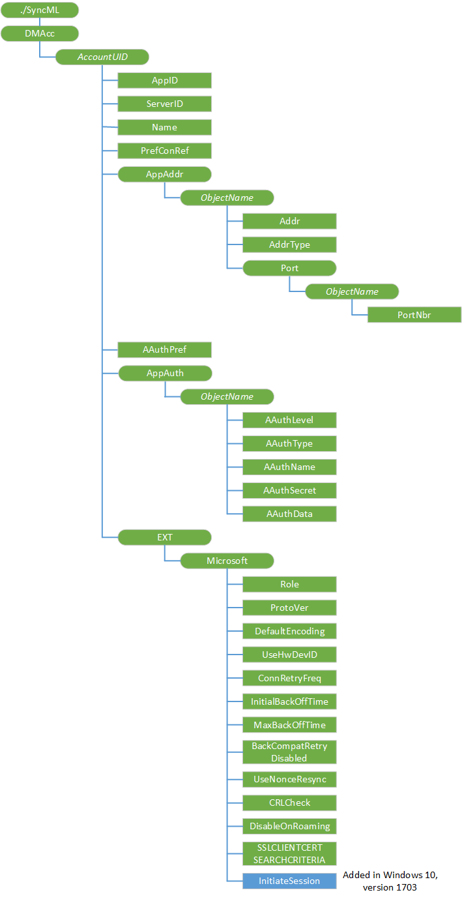

# DMAcc CSP


The DMAcc configuration service provider allows an OMA Device Management (DM) version 1.2 server to handle OMA DM account objects. The server can use this configuration service provider to add a new account or to manage an existing account, including an account that was bootstrapped by using the [w7 APPLICATION configuration service provider](w7-application-csp.md)

> **Note**  This configuration service provider requires the ID\_CAP\_CSP\_FOUNDATION and ID\_CAP\_DEVICE\_MANAGEMENT\_ADMIN capabilities to be accessed from a network configuration application.

 

For the DMAcc CSP, you cannot use the Replace command unless the node already exists.

The following diagram shows the DMAcc configuration service provider management object in tree format as used by OMA Device Management version 1.2. The OMA Client Provisioning protocol is not supported by this configuration service provider.



<a href="" id="dmacc"></a>**DMAcc**  
Required. Defines the root node of all OMA DM server accounts that use the OMA DM version 1.2 protocol.

<a href="" id="accountuid"></a>***AccountUID***  
Optional. Defines the unique identifier for an OMA DM server account that uses the OMA DM version 1.2 protocol.

For a [w7 APPLICATION configuration service provider](w7-application-csp.md) bootstrapped account, this element is assigned a unique name by the OMA DM Client. The unique name is the hexadecimal representation of the 256-bit SHA-2 hash of the provider ID. The OMA DM server can change this node name in subsequent OMA DM sessions.

<a href="" id="accountuid-appid"></a>***AccountUID*/AppID**  
Required. Specifies the application identifier for the OMA DM account.

This value must be set to "w7".

Value type is string. Supported operations are Add, Get, and Replace.

<a href="" id="accountuid-serverid"></a>***AccountUID*/ServerID**  
Required. Specifies the OMA DM server's unique identifier for the current OMA DM account. This value is case-sensitive.

Value type is string. Supported operations are Add, Get, and Replace.

<a href="" id="accountuid-name"></a>***AccountUID*/Name**  
Optional. Specifies the display name of the application.

Value type is string. Supported operations are Add, Get, and Replace.

<a href="" id="accountuid-prefconref"></a>***AccountUID*/PrefConRef**  
Optional. Specifies the preferred connectivity for the OMA DM account.

This element contains either a URI to a NAP management object or a connection GUID used by Connection Manager. If this element is missing, the device uses the default connection that is provided by Connection Manager.

Value type is string. Supported operations are Add, Get, and Replace.

<a href="" id="accountuid-appaddr"></a>***AccountUID*/AppAddr**  
Interior node for DM server address.

Required.

<a href="" id="appaddr-objectname"></a>**AppAddr/****_ObjectName_**  
Required. Defines the OMA DM server address. Only one server address can be configured.

When mapping the [w7 APPLICATION configuration service provider](w7-application-csp.md) to the DMAcc Configuration Service Provider, the name of this element is "1". This is the first DM address encountered in the w7 APPLICATION configuration service provider, other DM accounts are ignored.

<a href="" id="objectname-addr"></a>***ObjectName*/Addr**  
Required. Specifies the address of the OMA DM account. The type of address stored is specified by the AddrType element.

Value type is string. Supported operations are Add, Get, and Replace.

<a href="" id="objectname-addrtype"></a>***ObjectName*/AddrType**  
Required. Specifies the format and interpretation of the Addr node value. The default is "URI".

The default value of "URI" specifies that the OMA DM account address in **Addr** is a URI address. A value of "IPv4" specifies that the OMA DM account address in **Addr** is an IP address.

Value type is string. Supported operations are Add, Get, and Replace.

<a href="" id="objectname-port"></a>***ObjectName*/Port**  
Interior node for port information.

Optional.

<a href="" id="port-objectname"></a>**Port/****_ObjectName_**  
Required. Only one port number can be configured.

When mapping the [w7 APPLICATION configuration service provider](w7-application-csp.md) to the DMAcc Configuration Service Provider, the name of this element is "1".

<a href="" id="objectname-portnbr"></a>***ObjectName*/PortNbr**  
Required. Specifies the port number of the OMA MD account address. This must be a decimal number that fits within the range of a 16-bit unsigned integer.

Value type is string. Supported operations are Add, Get, and Replace.

<a href="" id="accountuid-aauthpref"></a>***AccountUID*/AAuthPref**  
Optional. Specifies the application authentication preference.

A value of "BASIC" specifies that the client attempts BASIC authentication. A value of "DIGEST' specifies that the client attempts MD5 authentication.

If this value is empty, the client attempts to use the authentication mechanism negotiated in the previous session if one exists. If the value is empty, no previous session exists, and MD5 credentials exist, clients try MD5 authorization first. If the criteria are not met then the client tries BASIC authorization first.

Value type is string. Supported operations are Add, Get, and Replace.

<a href="" id="accountuid-appauth"></a>***AccountUID*/AppAuth**  
Optional. Defines authentication settings.

<a href="" id="appauth-objectname"></a>**AppAuth/****_ObjectName_**  
Required. Defines one set of authentication settings.

When mapping the [w7 APPLICATION configuration service provider](w7-application-csp.md) to the DMAcc Configuration Service Provider, the name of this element is same name as the AAuthLevel value ("CLRED" or "SRVCRED").

<a href="" id="objectname-aauthlevel"></a>***ObjectName*/AAuthlevel**  
Required. Specifies the application authentication level.

A value of "CLCRED" indicates that the credentials client will authenticate itself to the OMA DM server at the OMA DM protocol level. A value of "SRVCRED" indicates that the credentials server will authenticate itself to the OMA DM Client at the OMA DM protocol level.

Value type is string. Supported operations are Add and Replace.

<a href="" id="objectname-aauthtype"></a>***ObjectName*/AAuthType**  
Required. Specifies the authentication type.

If the AAuthlevel is "CLCRED", the supported values are "BASIC" and "DIGEST". If the AAuthlevel is "SRVCRED", the supported value is "DIGEST".

Value type is string. Supported operations are Add, Get, and Replace.

<a href="" id="objectname-aauthname"></a>***ObjectName*/AAuthName**  
Optional. Specifies the authentication name.

Value type is string. Supported operations are Add, Get, and Replace.

<a href="" id="objectname-aauthsecret"></a>***ObjectName*/AAuthSecret**  
Optional. Specifies the password or secret used for authentication.

Value type is string. Supported operations are Add and Replace.

<a href="" id="objectname-aauthdata"></a>***ObjectName*/AAuthData**  
Optional. Specifies the next nonce used for authentication.

"Nonce" refers to a number used once. It is often a random or pseudo-random number issued in an authentication protocol to ensure that old communications cannot be reused in repeat attacks.

Value type is binary. Supported operations are Add and Replace.

<a href="" id="accountuid-ext"></a>***AccountUID*/Ext**  
Required. Defines a set of extended parameters.

This element holds vendor-specific information about the OMA DM account and is created automatically when the OMA DM account is created.

<a href="" id="ext-microsoft"></a>**Ext/Microsoft**  
Required. Defines a set of Microsoft-specific extended parameters.

This element is created automatically when the OMA DM account is created.

<a href="" id="microsoft-backcompatretrydisabled"></a>**Microsoft/BackCompatRetryDisabled**  
Optional. Specifies whether to retry resending a package with an older protocol version (for example, 1.1) in the SyncHdr on subsequent attempts (not including the first time). The default is "FALSE".

The default value of "FALSE" indicates that backward-compatible retries are enabled. A value of "TRUE" indicates that backward-compatible retries are disabled.

Value type is bool. Supported operations are Add, Get, and Replace.

<a href="" id="microsoft-connretryfreq"></a>**Microsoft/ConnRetryFreq**  
Optional. Specifies the number of retries the DM client performs when there are Connection Manager level or wininet level errors.

The default value is 3.

Value type is integer. Supported operations are Add, Get, and Replace.

<a href="" id="microsoft-defaultencoding"></a>**Microsoft/DefaultEncoding**  
Optional. Specifies whether the OMA DM client will use WBXML or XML for the DM package when communicating with the server. The default is "application/vnd.syncml.dm+xml".

The default value of "application/vnd.syncml.dm+xml" specifies that XML is used. A value of "application/vnd.syncml.dm+wbxml" specifies that WBXML is used.

Value type is string. Supported operations are Add, Get, and Replace.

<a href="" id="microsoft-initialbackofftime"></a>**Microsoft/InitialBackOffTime**  
Optional. Specifies the initial wait time in milliseconds when the OMA DM client retries for the first time. The wait time grows exponentially.

The default value is 16000.

Value type is integer. Supported operations are Add, Get, and Replace.

<a href="" id="microsoft-maxbackofftime"></a>**Microsoft/MaxBackOffTime**  
Optional. This node specifies the maximum number of milliseconds to wait before attempting a connection retry.

The default value is 86400000.

Value type is integer. Supported operations are Add, Get, and Replace.

<a href="" id="microsoft-protover"></a>**Microsoft/ProtoVer**  
Optional. Specifies the OMA DM Protocol version that the server supports. There is no default value.

Valid values are "1.1" and "1.2". The protocol version set by this element will match the protocol version that the DM client reports to the server in SyncHdr in package 1. If this element is not specified when adding a DM server account, the latest DM protocol version that the client supports is used. Windows 10 clients support version 1.2.

Value type is string. Supported operations are Add, Get, and Replace.

<a href="" id="microsoft-role"></a>**Microsoft/Role**  
Required. Specifies the role mask that the OMA DM session runs with when it communicates with the server.

If this parameter is not present, the DM session is given the role mask of the OMA DM session that the server created. The following list shows the valid security role masks and their values.

-   4 = SECROLE\_OPERATOR

-   8 = SECROLE\_MANAGER

-   16 = SECROLE\_USER\_AUTH

-   128 = SECROLE\_OPERATOR\_TPS

The acceptable access roles for this node cannot be more than the roles assigned to the DMAcc object.

Value type is integer. Supported operations are Get and Replace.

<a href="" id="microsoft-usehwdevid"></a>**Microsoft/UseHWDevID**  
Optional. Specifies whether to use the hardware ID for the ./DevInfo/DevID element in the DM account to identify the device. The default is "FALSE".

The default value of "FALSE" specifies that an application-specific GUID is returned for the ./DevInfo/DevID rather than the hardware device ID.

A value is "TRUE" specifies that the hardware device ID will be provided for the ./DevInfo/DevID element and the Source LocURI for the OMA DM package that is sent to the server. In this case:

-   For GSM phones, the IMEI is returned.

-   For CDMA phones, the MEID is returned.

-   For dual SIM phones, this value is retrieved from the UICC of the primary data line.

Value type is bool. Supported operations are Add, Get, and Replace.

<a href="" id="microsoft-usenonceresync"></a>**Microsoft/UseNonceResync**  
Optional. Specifies whether the OMA DM client should use the nonce resynchronization procedure if the server trigger notification fails authentication. The default is "FALSE".

If the authentication fails because the server nonce does not match the server nonce that is stored on the device, then the device can use the backup nonce as the server nonce. For this procedure to be successful, if the device did not authenticate with the preconfigured nonce value, the server must then use the backup nonce when sending the signed server notification message.

The default value of "FALSE" specifies that the client does not try to authenticate the notification with the backup server nonce if authentication to the stored nonce fails. A value of "TRUE" specifies that the client initiates a DM session if the backup server nonce is received after authentication failed.

Value type is bool. Supported operations are Add, Get, and Replace.

<a href="" id="crlcheck"></a>**CRLCheck**  
Optional. Allows connection to the DM server to check the Certificate Revocation List (CRL). Set to true to enable SSL revocation.

Value type is bool. Supported operations are Add, Get, and Replace.

<a href="" id="disableonroaming"></a>**DisableOnRoaming**  
Optional. Determines whether the OMA DM client should be launched when roaming.

Value type is bool. Supported operations are Add, Get, and Replace.

<a href="" id="sslclientcertsearchcriteria"></a>**SSLCLIENTCERTSEARCHCRITERIA**  
Optional. The SSLCLIENTCERTSEARCHCRITERIA parameter is used to specify the client certificate search criteria. This parameter supports search by subject attribute and certificate stores. If any other criteria are provided, it is ignored.

The string is a concatenation of name/value pairs, each member of the pair delimited by the "&" character. The name and values are delimited by the "=" character. If there are multiple values, each value is delimited by the Unicode character "U+F000". If the name or value contains characters not in the UNRESERVED set (as specified in RFC2396), then those characters are URI-escaped per the RFC.

The supported names are Subject and Stores; wildcard certificate search is not supported.

Stores specifies which certificate stores the DM client will search to find the SSL client certificate. The valid store value is My%5CUser. The store name is not case sensitive.

> **Note**   %EF%80%80 is the UTF8-encoded character U+F000.

 

Subject specifies the certificate to search for. For example, to specify that you want a certificate with a particular Subject attribute (“CN=Tester,O=Microsoft”), use the following:

``` syntax
<parm name="SSLCLIENTCERTSEARCHCRITERIA" 
   value="Subject=CN%3DTester,O%3DMicrosoft&amp;Stores=My%5CUser" />
```

Value type is string. Supported operations are Add, Get, and Replace.

<a href="" id="initiatesession"></a>**InitiateSession**  
Optional. When this node is added, a session is started with the MDM server.

Supported operations are Add, and Replace.

## Related topics


[Configuration service provider reference](configuration-service-provider-reference.md)

 

 


