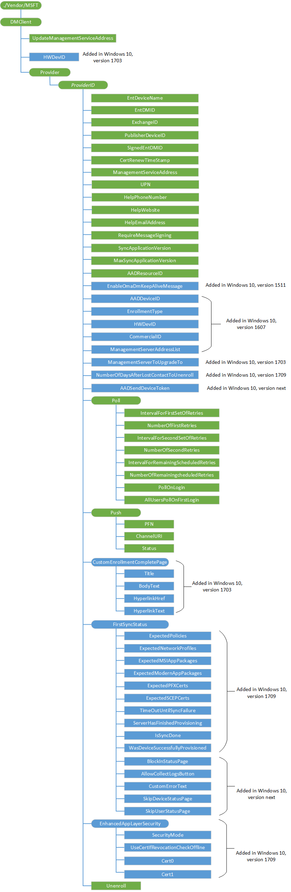

# DMClient CSP


The DMClient configuration service provider is used to specify additional enterprise-specific mobile device management configuration settings for identifying the device in the enterprise domain, security mitigation for certificate renewal, and server-triggered enterprise unenrollment.

The following diagram shows the DMClient configuration service provider in tree format.



<a href="" id="dmclient"></a>**DMClient**  
Root node for the CSP.

<a href="" id="updatemanagementserviceaddress"></a>**UpdateManagementServiceAddress**  
For provisioning packages only. Specifies the list of servers (semicolon delimited). The first server in the semi-colon delimited list is the server that will be used to instantiate MDM sessions. The list can be a permutation or a subset of the existing server list. You cannot add new servers to the list using this node.

<a href="" id="hwdevid"></a>**HWDevID**  
Added in Windows 10, version 1703. Returns the hardware device ID.

Supported operation is Get. Value type is string.

<a href="" id="provider"></a>**Provider**  
Required. The root node for all settings that belong to a single management server. Scope is permanent.

Supported operation is Get.

<a href="" id="provider-providerid"></a>**Provider/**<strong>*ProviderID*</strong>  
Required. This node contains the URI-encoded value of the bootstrapped device management account’s Provider ID. Scope is dynamic. This value is set and controlled by the MDM server. As a best practice, use text that doesn’t require XML/URI escaping.

For Intune, use **MS DM Server** for Windows desktop or **SCConfigMgr** for Windows mobile for the _ProviderID_.

Supported operations are Get and Add.

<a href="" id="provider-providerid-entdevicename"></a>**Provider/*ProviderID*/EntDeviceName**  
Optional. Character string that contains the user-friendly device name used by the IT admin console. The value is set during the enrollment process by way of the DMClient configuration service provider. You can retrieve it later during an OMA DM session.

Supported operations are Get and Add.

<a href="" id="provider-providerid-entdmid"></a>**Provider/*ProviderID*/EntDMID**  
Optional. Character string that contains the unique enterprise device ID. The value is set by the management server during the enrollment process by way of the DMClient configuration service provider. You can retrieve it later during an OMA DM session.

Supported operations are Get and Add.

> **Note**   Although hardware device IDs are guaranteed to be unique, there is a concern that this is not ultimately enforceable during a DM session. The device ID could be changed through the w7 APPLICATION configuration service provider’s **USEHWDEVID** parm by another management server. So during enterprise bootstrap and enrollment, a new device ID is specified by the enterprise server.
This node is required and must be set by the server before the client certificate renewal is triggered.

 

<a href="" id="provider-providerid-exchangeid"></a>**Provider/*ProviderID*/ExchangeID**  
Optional. Character string that contains the unique Exchange device ID used by the Outlook account of the user the session is running against. This is useful for the enterprise management server to correlate and merge records for a device that is managed by exchange and natively managed by a dedicated management server.

> **Note**  In some cases for the desktop, this node will return "not found" until the user sets up their email.

 

Supported operation is Get.

The following is a Get command example.

``` syntax
<Get>
   <CmdID>12</CmdID>
   <Item>
      <Target>
         <LocURI>./Vendor/MSFT/DMClient/Provider/<ProviderID>/ExchangeID</LocURI>
      </Target>
   </Item>
</Get>
```

<a href="" id="provider-providerid-publisherdeviceid"></a>**Provider/*ProviderID*/PublisherDeviceID**  
(Only for Windows 10 Mobile.) Optional. The PublisherDeviceID is a device-unique ID created based on the enterprise Publisher ID. Publisher ID is created based on the enterprise application token and enterprise ID via ./Vendor/MSFT/EnterpriseAppManagement/&lt;enterprise id&gt;/EnrollmentToken. It is to ensure that for one enterprise, each device has a unique ID associated with it. For the same device, if it has multiple enterprises’ applications, each enterprise is identified differently.

Supported operation is Get.

<a href="" id="provider-providerid-signedentdmid"></a>**Provider/*ProviderID*/SignedEntDMID**  
Optional. Character string that contains the device ID. This node and the nodes **CertRenewTimeStamp** can be used by the mobile device management server to verify client identity in order to update the registration record after the device certificate is renewed. The device signs the **EntDMID** with the old client certificate during the certificate renewal process and saves the signature locally.

Supported operation is Get.

<a href="" id="provider-providerid-certrenewtimestamp"></a>**Provider/*ProviderID*/CertRenewTimeStamp**  
Optional. The time in OMA DM standard time format. This node is designed to reduce the risk of the certificate being used by another device. The device records the time that the new certificate was created.

Supported operation is Get.

<a href="" id="provider-providerid-managementserviceaddress"></a>**Provider/*ProviderID*/ManagementServiceAddress**  
Required. The character string that contains the device management server address. It can be updated during an OMA DM session by the management server to allow the server to load balance to another server in situations where too many devices are connected to the server.

> **Note**  When the ManagementServerAddressList value is set, the device ignores the value in ManagementServiceAddress.

 

The DMClient configuration service provider will save the address to the same location as the w7 and DMS configuration service providers to ensure the management client has a single place to retrieve the current server address. The initial value for this node is the same server address value as bootstrapped via the [w7 APPLICATION configuration service provider](w7-application-csp.md).

Starting in Windows 10, version 1511, this node supports multiple server addresses in the format &lt;URL1&gt;&lt;URL2&gt;&lt;URL3&gt;. If there is only a single URL, then the &lt;&gt; are not required. This is supported for both desktop and mobile devices.

During a DM session, the device will use the first address on the list and then keep going down the list until a successful connection is achieved. The DM client should cache the successfully connected server URL for the next session.

Supported operations are Add, Get, and Replace.

<a href="" id="provider-providerid-upn"></a>**Provider/*ProviderID*/UPN**  
Optional. Allows the management server to update the User Principal Name (UPN) of the enrolled user. This is useful in scenarios where the user email address changes in the identity system, or in the scenario where the user enters an invalid UPN during enrollment, and fixes the UPN during federated enrollment. The UPN will be recorded and the UX will reflect the updated UPN.

Supported operations are Get and Replace.

<a href="" id="provider-providerid-helpphonenumber"></a>**Provider/*ProviderID*/HelpPhoneNumber**  
Optional. The character string that allows the user experience to include a customized help phone number that the end user will be able to view and use if they need help or support.

Supported operations are Get, Replace, and Delete.

<a href="" id="provider-providerid-helpwebsite"></a>**Provider/*ProviderID*/HelpWebsite**  
Optional. The character string that allows the user experience to include a customized help website that the end user will be able to view and use if they need help or support.

Supported operations are Get, Replace, and Delete

<a href="" id="provider-providerid-helpemailaddress"></a>**Provider/*ProviderID*/HelpEmailAddress**  
Optional. The character string that allows the user experience to include a customized help email address that the end user will be able to view and use if they need help or support.

Supported operations are Get, Replace, and Delete.

<a href="" id="provider-providerid-requiremessagesigning"></a>**Provider/*ProviderID*/RequireMessageSigning**  
Boolean type. Primarly used for SSL bridging mode where firewalls and proxies are deployed and where device client identity is required. When enabled, every SyncML message from the device will carry an additional HTTP header named MDM-Signature. This header contains BASE64-encoded Cryptographic Message Syntax using a Detached Signature of the complete SyncML message SHA-2 (inclusive of the SyncHdr and SyncBody). Signing is performed using the private key of the management session certificate that was enrolled as part of the enrollment process. The device public key and PKCS9 UTC signing time stamp are included as part of the authenticated attributes in the signature.

Default value is false, where the device management client does not include authentication information in the management session HTTP header. Optionally set to true, where the client authentication information is provided in the management session HTTP header.

When enabled, the MDM server should validate the signature and the timestamp using the device identify certificate enrolled as part of MS-MDE, ensure the certificate and time are valid, and verify that the signature is trusted by the MDM server.

Supported operations are Get, Replace, and Delete.

<a href="" id="provider-providerid-syncapplicationversion"></a>**Provider/*ProviderID*/SyncApplicationVersion**  
Optional. Used by the management server to set the DM session version that the server and device should use. Default is 1.0. In Windows 10, the DM session protocol version of the client is 2.0. If the server is updated to support 2.0, then you should set this value to 2.0. In the next session, check to see if there is a client behavior change between 1.0 and 2.0.

> **Note**  
This node is only supported in Windows 10 and later.

Once you set the value to 2.0, it will not go back to 1.0.

 

Supported operations are Get, Replace, and Delete.

<a href="" id="provider-providerid-maxsyncapplicationversion"></a>**Provider/*ProviderID*/MaxSyncApplicationVersion**  
Optional. Used by the client to indicate the latest DM session version that it supports. Default is 2.0.

When you query this node, a Windows 10 client will return 2.0 and a Windows 8.1 client will return an error code (404 node not found).

Supported operation is Get.

<a href="" id="provider-providerid-aadresourceid"></a>**Provider/*ProviderID*/AADResourceID**  
Optional. This is the ResourceID used when requesting the user token from the OMA DM session for Azure Active Directory enrollments (AAD Join or Add Accounts). The token is audience specific, which allows for different service principals (enrollment vs. device management). It can be an application ID or the endpoint that you are trying to access.

For more information about Azure Active Directory enrollment, see [Azure Active Directory integration with MDM](azure-active-directory-integration-with-mdm.md).

<a href="" id="provider-providerid-enableomadmkeepalivemessage"></a>**Provider/*ProviderID*/EnableOmaDmKeepAliveMessage**  
Added in Windows 10, version 1511. A boolean value that specifies whether the DM client should send out a request pending alert in case the device response to a DM request is too slow.

When the server sends a configuration request, sometimes it takes the client longer than the HTTP timeout to get all information together and then the session ends unexpectedly due to timeout. By default, the MDM client does not send an alert that a DM request is pending.

To work around the timeout, you can use this setting to keep the session alive by sending a heartbeat message back to the server. This is achieved by sending a SyncML message with a specific device alert element in the body until the client is able to respond back to the server with the requested information.

Here is an example of DM message sent by the device when it is in pending state:

``` syntax
<SyncML xmlns="SYNCML:SYNCML1.2">
  <SyncHdr>
<VerDTD>1.2</VerDTD>
        <VerProto>DM/1.2</VerProto>
        <SessionID>10</SessionID>
        <MsgID>2</MsgID>
      <Target>
         <LocURI>https://www.contoso.com/mgmt-server</LocURI>
      </Target>
      <Source>
         <LocURI>{unique device ID}</LocURI>
      </Source>
  </SyncHdr>
  <SyncBody>
<Alert>
    <CmdID>2</CmdID>
    <Data>1224</Data> 
    <Item>
        <Meta>
            <Type xmlns="syncml:metinf">Reversed-Domain-Name:com.microsoft.mdm.requestpending</Type>
        </Meta>
        <Data>1</Data>
    </Item>
</Alert>
  </SyncBody>
</SyncML>
```

<a href="" id="provider-providerid-aaddeviceid"></a>**Provider/*ProviderID*/AADDeviceID**  
Added in Windows 10, version 1607. Returns the device ID for the Azure Active Directory device registration.

Supported operation is Get.

<a href="" id="provider-providerid-enrollmenttype"></a>**Provider/*ProviderID*/EnrollmentType**  
Added in Windows 10, version 1607. Returns the enrollment type (Device or Full).

Supported operation is Get.

<a href="" id="provider-providerid-hwdevid"></a>**Provider/*ProviderID*/HWDevID**  
Added in Windows 10, version 1607. Returns the hardware device ID.

Supported operation is Get.

<a href="" id="provider-providerid-commercialid"></a>**Provider/*ProviderID*/CommercialID**  
Added in Windows 10, version 1607. Configures the identifier used to uniquely associate this diagnostic data of this device as belonging to a given organization. If your organization is participating in a program that requires this device to be identified as belonging to your organization then use this setting to provide that identification. The value for this setting will be provided by Microsoft as part of the onboarding process for the program. If you disable or do not configure this policy setting, then Microsoft will not be able to use this identifier to associate this machine and its diagnostic data with your organization..

Supported operations are Add, Get, Replace, and Delete.

<a href="" id="provider-providerid-managementserveraddresslist"></a>**Provider/*ProviderID*/ManagementServerAddressList**  
Added in Windows 10, version 1607. The list of management server URLs in the format &lt;URL1&gt;&lt;URL2&gt;&lt;URL3&gt;, etc... If there is only one, the angle brackets (&lt;&gt;) are not required.

> **Note**  The &lt; and &gt; should be escaped.

 

``` syntax
   <Replace>
       <CmdID>101</CmdID>
       <Item>
           <Target>
               <LocURI>
                  ./Vendor/MSFT/DMClient/Provider/<ProviderID>/ManagementServerAddressList
               </LocURI>
           </Target>
           <Data>&lt;https://server1&gt;&lt;https:// server2&gt; </Data>
       </Item>
   </Replace>
```

If ManagementServerAddressList node is set, the device will only use the server URL configured in this node and ignore the ManagementServiceAddress value.

When the server is not responding after a specified number of retries, the device tries to use the next server URL in the list until it gets a successful connection. After the server list is updated, the client uses the updated list at the next session starting with the first on in the list.

Supported operations are Get and Replace. Value type is string.

<a href="" id="provider-providerid-managementservertoupgradeto"></a>**Provider/*ProviderID*/ManagementServerToUpgradeTo**  
Optional. Added in Windows 10, version 1703. Specify the Discovery server URL of the MDM server to upgrade to for a Mobile Application Management (MAM) enrolled device.

Supported operations are Add, Delete, Get, and Replace. Value type is string.

<a href="" id="provider-providerid-numberofdaysafterlostcontacttounenroll"></a>**Provider/*ProviderID*/NumberOfDaysAfterLostContactToUnenroll**  
Optional. Number of days after last sucessful sync to unenroll.

Supported operations are Add, Delete, Get, and Replace. Value type is integer.

<a href="" id="provider-providerid-aadsenddevicetoken"></a>**Provider/*ProviderID*/AADSendDeviceToken**  
Device. Added in Windows 10 version 1803. For AZure AD backed enrollments, this will cause the client to send a Device Token if the User Token can not be obtained.

Supported operations are Add, Delete, Get, and Replace. Value type is bool.

<a href="" id="provider-providerid-poll"></a>**Provider/*ProviderID*/Poll**  
Optional. Polling schedules must utilize the DMClient CSP. The Registry paths previously associated with polling using the Registry CSP are now deprecated.

Supported operations are Get and Add.

There are three schedules managed under the Poll node which enable a rich polling schedule experience to provide greater flexibility in managing the way in which devices poll the management server. There are a variety of ways in which polling schedules may be set. If an invalid polling configuration is set, the device will correct or remove the schedules in order to restore the polling schedules back to a valid configuration.

If there is no infinite schedule set, then a 24-hour schedule is created and scheduled to launch in the maintenance window.

**Valid poll schedule: sigmoid polling schedule with infinite schedule (Recommended).**

<table>
<colgroup>
<col width="33%" />
<col width="33%" />
<col width="33%" />
</colgroup>
<thead>
<tr class="header">
<th>Schedule name</th>
<th>Schedule set by the server</th>
<th>Actual value queried on device</th>
</tr>
</thead>
<tbody>
<tr class="odd">
<td><p>IntervalForFirstSetOfRetries</p></td>
<td><p>15</p></td>
<td><p>15</p></td>
</tr>
<tr class="even">
<td><p>NumberOfFirstRetries</p></td>
<td><p>5</p></td>
<td><p>5</p></td>
</tr>
<tr class="odd">
<td><p>IntervalForSecondSetOfRetries</p></td>
<td><p>60</p></td>
<td><p>60</p></td>
</tr>
<tr class="even">
<td><p>NumberOfSecondRetries</p></td>
<td><p>10</p></td>
<td><p>10</p></td>
</tr>
<tr class="odd">
<td><p>IntervalForRemainingScheduledRetries</p></td>
<td><p>1440</p></td>
<td><p>1440</p></td>
</tr>
<tr class="even">
<td><p>NumberOfRemainingScheduledRetries</p></td>
<td><p>0</p></td>
<td><p>0</p></td>
</tr>
</tbody>
</table>

 

**Valid poll schedule: initial enrollment only \[no infinite schedule\]**

<table>
<colgroup>
<col width="33%" />
<col width="33%" />
<col width="33%" />
</colgroup>
<thead>
<tr class="header">
<th>Schedule name</th>
<th>Schedule set by the server</th>
<th>Actual value queried on device</th>
</tr>
</thead>
<tbody>
<tr class="odd">
<td><p>IntervalForFirstSetOfRetries</p></td>
<td><p>15</p></td>
<td><p>15</p></td>
</tr>
<tr class="even">
<td><p>NumberOfFirstRetries</p></td>
<td><p>5</p></td>
<td><p>5</p></td>
</tr>
<tr class="odd">
<td><p>IntervalForSecondSetOfRetries</p></td>
<td><p>60</p></td>
<td><p>60</p></td>
</tr>
<tr class="even">
<td><p>NumberOfSecondRetries</p></td>
<td><p>10</p></td>
<td><p>10</p></td>
</tr>
<tr class="odd">
<td><p>IntervalForRemainingScheduledRetries</p></td>
<td><p>0</p></td>
<td><p>0</p></td>
</tr>
<tr class="even">
<td><p>NumberOfRemainingScheduledRetries</p></td>
<td><p>0</p></td>
<td><p>0</p></td>
</tr>
</tbody>
</table>

 

**Invalid poll schedule: disable all poll schedules**

> **Note**   Disabling poll schedules results in UNDEFINED behavior and enrollment may fail if poll schedules are all set to zero.

 

<table>
<colgroup>
<col width="33%" />
<col width="33%" />
<col width="33%" />
</colgroup>
<thead>
<tr class="header">
<th>Schedule name</th>
<th>Schedule set by the server</th>
<th>Actual value queried on device</th>
</tr>
</thead>
<tbody>
<tr class="odd">
<td><p>IntervalForFirstSetOfRetries</p></td>
<td><p>0</p></td>
<td><p>0</p></td>
</tr>
<tr class="even">
<td><p>NumberOfFirstRetries</p></td>
<td><p>0</p></td>
<td><p>0</p></td>
</tr>
<tr class="odd">
<td><p>IntervalForSecondSetOfRetries</p></td>
<td><p>0</p></td>
<td><p>0</p></td>
</tr>
<tr class="even">
<td><p>NumberOfSecondRetries</p></td>
<td><p>0</p></td>
<td><p>0</p></td>
</tr>
<tr class="odd">
<td><p>IntervalForRemainingScheduledRetries</p></td>
<td><p>0</p></td>
<td><p>0</p></td>
</tr>
<tr class="even">
<td><p>NumberOfRemainingScheduledRetries</p></td>
<td><p>0</p></td>
<td><p>0</p></td>
</tr>
</tbody>
</table>

 

**Invalid poll schedule: two infinite schedules**

<table>
<colgroup>
<col width="25%" />
<col width="25%" />
<col width="25%" />
<col width="25%" />
</colgroup>
<thead>
<tr class="header">
<th>Schedule name</th>
<th>Schedule set by server</th>
<th>Actual schedule set on device</th>
<th>Actual experience</th>
</tr>
</thead>
<tbody>
<tr class="odd">
<td><p>IntervalForFirstSetOfRetries</p></td>
<td><p>15</p></td>
<td><p>15</p></td>
<td><p>Device polls</p></td>
</tr>
<tr class="even">
<td><p>NumberOfFirstRetries</p></td>
<td><p>5</p></td>
<td><p>5</p></td>
<td><p>Device polls</p></td>
</tr>
<tr class="odd">
<td><p>IntervalForSecondSetOfRetries</p></td>
<td><p>1440</p></td>
<td><p>1440</p></td>
<td><p>Device polls the server once in 24 hours</p></td>
</tr>
<tr class="even">
<td><p>NumberOfSecondRetries</p></td>
<td><p>0</p></td>
<td><p>0</p></td>
<td><p>Device polls the server once in 24 hours</p></td>
</tr>
<tr class="odd">
<td><p>IntervalForRemainingScheduledRetries</p></td>
<td><p>1440</p></td>
<td><p>0</p></td>
<td><p>Third schedule is disabled</p></td>
</tr>
<tr class="even">
<td><p>NumberOfRemainingScheduledRetries</p></td>
<td><p>0</p></td>
<td><p>0</p></td>
<td><p>Third schedule is disabled</p></td>
</tr>
</tbody>
</table>

 

If the device was previously enrolled in MDM with polling schedule configured via registry key values directly, the MDM server that supports using DMClient CSP to update polling schedule must first send an Add command to add a **./Vendor/MSFT/DMClient/Enrollment/&lt;ProviderID&gt;/Poll** node before it sends a Get/Replace command to query or update polling parameters via DMClient CSP

When using the DMClient CSP to configure polling schedule parameters, the server must not set all six polling parameters to 0, or set all 3 number of retry nodes to 0 because it will cause a configuration failure.

<a href="" id="provider-providerid-poll-intervalforfirstsetofretries"></a>**Provider/*ProviderID*/Poll/IntervalForFirstSetOfRetries**  
Optional. The waiting time (in minutes) for the initial set of retries as specified by the number of retries in /&lt;ProviderID&gt;/Poll/NumberOfFirstRetries. If IntervalForFirstSetOfRetries is not set, then the default value is used. The default value is 15. If the value is set to 0, this schedule is disabled.

Supported operations are Get and Replace.

The IntervalForFirstSetOfRetries replaces the deprecated HKLM\\Software\\Microsoft\\Enrollment\\OmaDmRetry\\AuxRetryInterval path that previously utilized the Registry CSP.

<a href="" id="provider-providerid-poll-numberoffirstretries"></a>**Provider/*ProviderID*/Poll/NumberOfFirstRetries**  
Optional. The number of times the DM client should retry to connect to the server when the client is initially configured or enrolled to communicate with the server. If the value is set to 0 and the IntervalForFirstSetOfRetries value is not 0, then the schedule will be set to repeat an infinite number of times and second set and this set of schedule will not set in this case. The default value is 10.

Supported operations are Get and Replace.

The NumberOfFirstRetries replaces the deprecated HKLM\\Software\\Microsoft\\Enrollment\\OmaDmRetry\\AuxNumRetries path that previously utilized the Registry CSP.

The first set of retries is intended to give the management server some buffered time to be ready to send policies and settings configuration to the device. The total time for first set of retries should not be more than a few hours. The server should not set NumberOfFirstRetries to be 0. RemainingScheduledRetries is used for the long run device polling schedule.

<a href="" id="provider-providerid-poll-intervalforsecondsetofretries"></a>**Provider/*ProviderID*/Poll/IntervalForSecondSetOfRetries**  
Optional. The waiting time (in minutes) for the second set of retries as specified by the number of retries in /&lt;ProviderID&gt;/Poll/NumberOfSecondRetries. Default value is 0. If this value is set to zero, then this schedule is disabled.

Supported operations are Get and Replace.

The IntervalForSecondSetOfRetries replaces the deprecated HKLM\\Software\\Microsoft\\Enrollment\\OmaDmRetry\\RetryInterval path that previously utilized the Registry CSP.

<a href="" id="provider-providerid-poll-numberofsecondretries"></a>**Provider/*ProviderID*/Poll/NumberOfSecondRetries**  
Optional. The number of times the DM client should retry a second round of connecting to the server when the client is initially configured/enrolled to communicate with the server. Default value is 0. If the value is set to 0 and IntervalForSecondSetOfRetries is not set to 0 AND the first set of retries is not set as infinite retries, then the schedule repeats an infinite number of times. However, if the first set of retries is set at infinite, then this schedule is disabled.

Supported operations are Get and Replace.

The NumberOfSecondRetries replaces the deprecated HKLM\\Software\\Microsoft\\Enrollment\\OmaDmRetry\\NumRetries path that previously utilized the Registry CSP.

The second set of retries is also optional and temporarily retries that the total duration should be last for more than a day. And the IntervalForSecondSetOfRetries should be longer than IntervalForFirstSetOfRetries. RemainingScheduledRetries is used for the long run device polling schedule.

<a href="" id="provider-providerid-poll-intervalforremainingscheduledretries"></a>**Provider/*ProviderID*/Poll/IntervalForRemainingScheduledRetries**  
Optional. The waiting time (in minutes) for the initial set of retries as specified by the number of retries in /&lt;ProviderID&gt;/Poll/NumberOfRemainingScheduledRetries. Default value is 0. If IntervalForRemainingScheduledRetries is set to 0, then this schedule is disabled.

Supported operations are Get and Replace.

The IntervalForRemainingScheduledRetries replaces the deprecated HKLM\\Software\\Microsoft\\Enrollment\\OmaDmRetry\\Aux2RetryInterval path that previously utilized the Registry CSP.

<a href="" id="provider-providerid-poll-numberofremainingscheduledretries"></a>**Provider/*ProviderID*/Poll/NumberOfRemainingScheduledRetries**  
Optional. The number of times the DM client should retry connecting to the server when the client is initially configured/enrolled to communicate with the server. Default value is 0. If the value is set to 0 and IntervalForRemainingScheduledRetries AND the first and second set of retries are not set as infinite retries, then the schedule will be set to repeat for an infinite number of times. However, if either or both of the first and second set of retries are set as infinite, then this schedule will be disabled.

Supported operations are Get and Replace.

The NumberOfRemainingScheduledRetries replaces the deprecated HKLM\\Software\\Microsoft\\Enrollment\\OmaDmRetry\\Aux2NumRetries path that previously utilized the Registry CSP.

The RemainingScheduledRetries is used for the long run device polling schedule. IntervalForRemainingScheduledRetries should not be set smaller than 1440 minutes (24 hours) in Windows Phone 8.1 device. Windows Phone 8.1 supports MDM server push.

<a href="" id="provider-providerid-poll-pollonlogin"></a>**Provider/*ProviderID*/Poll/PollOnLogin**  
Optional. Boolean value that allows the IT admin to require the device to start a management session on any user login, regardless of if the user has preciously logged in. Login is not the same as device unlock. Default value is false, where polling is disabled on first login. Supported values are true or false.

Supported operations are Add, Get, and Replace.

<a href="" id="provider-providerid-poll-alluserspollonfirstlogin"></a>**Provider/*ProviderID*/Poll/AllUsersPollOnFirstLogin**  
Optional. Boolean value that allows the IT admin to require the device to start a management session on first user login for all NT users. A session is only kicked off the first time a user logs in to the system; subsequent logins will not trigger an MDM session. Login is not the same as device unlock. Default value is false, where polling is disabled on first login. Supported values are true or false.

Supported operations are Add, Get, and Replace.

<a href="" id="provider-providerid-push"></a>**Provider/*ProviderID*/Push**  
Optional. Not configurable during WAP Provisioining XML. If removed, DM sessions triggered by Push will no longer be supported.

Supported operations are Add and Delete.

<a href="" id="provider-providerid-push-pfn"></a>**Provider/*ProviderID*/Push/PFN**  
Required. A string provided by the Windows 10 ecosystem for a Mobile Device Management solution. Used to register a device for Push Notifications. The server must use the same PFN as the devices it is managing.

Supported operations are Add, Get, and Replace.

<a href="" id="provider-providerid-push-channeluri"></a>**Provider/*ProviderID*/Push/ChannelURI**  
Required. A string that contains the channel that the WNS client has negotiated for the OMA DM client on the device based on the PFN that was provided. If no valid PFN is currently set, ChannelURI will return null.

Supported operation is Get.

<a href="" id="provider-providerid-push-status"></a>**Provider/*ProviderID*/Push/Status**  
Required. An integer that maps to a known error state or condition on the system.

Supported operation is Get.

The status error mapping is listed below.

<table>
<colgroup>
<col width="20%" />
<col width="80%" />
</colgroup>
<thead>
<tr class="header">
<th>Status</th>
<th>Description</th>
</tr>
</thead>
<tbody>
<tr class="odd">
<td><p>0</p></td>
<td><p>Success</p></td>
</tr>
<tr class="even">
<td><p>1</p></td>
<td><p>Failure: invalid PFN</p></td>
</tr>
<tr class="odd">
<td><p>2</p></td>
<td><p>Failure: invalid or expired device authentication with MSA</p></td>
</tr>
<tr class="even">
<td><p>3</p></td>
<td><p>Failure: WNS client registration failed due to an invalid or revoked PFN</p></td>
</tr>
<tr class="odd">
<td><p>4</p></td>
<td><p>Failure: no Channel URI assigned</p></td>
</tr>
<tr class="even">
<td><p>5</p></td>
<td><p>Failure: Channel URI has expired</p></td>
</tr>
<tr class="odd">
<td><p>6</p></td>
<td><p>Failure: Channel URI failed to be revoked</p></td>
</tr>
<tr class="even">
<td><p>7</p></td>
<td><p>Failure: push notification received, but unable to establish an OMA-DM session due to power or connectivity limitations.</p></td>
</tr>
<tr class="odd">
<td><p>8</p></td>
<td><p>Unknown error</p></td>
</tr>
</tbody>
</table>

 

<a href="" id="provider-providerid-customenrollmentcompletepage"></a>**Provider/*ProviderID*/CustomEnrollmentCompletePage**  
Optional. Added in Windows 10, version 1703.

Supported operations are Add, Delete, and Get.

<a href="" id="provider-providerid-customenrollmentcompletepage-title"></a>**Provider/*ProviderID*/CustomEnrollmentCompletePage/Title**  
Optional. Added in Windows 10, version 1703. Specifies the title of the all done page that appears at the end of the MDM enrollment flow.

Supported operations are Add, Delete, Get, and Replace. Value type is string.

<a href="" id="provider-providerid-customenrollmentcompletepage-bodytext"></a>**Provider/*ProviderID*/CustomEnrollmentCompletePage/BodyText**  
Optional. Added in Windows 10, version 1703. Specifies the body text of the all done page that appears at the end of the MDM enrollment flow.

Supported operations are Add, Delete, Get, and Replace. Value type is string.

<a href="" id="provider-providerid-customenrollmentcompletepage-hyperlinkhref"></a>**Provider/*ProviderID*/CustomEnrollmentCompletePage/HyperlinkHref**  
Optional. Added in Windows 10, version 1703. Specifies the URL that is shown at the end of the MDM enrollment flow.

Supported operations are Add, Delete, Get, and Replace. Value type is string.

<a href="" id="provider-providerid-customenrollmentcompletepage-hyperlinktext"></a>**Provider/*ProviderID*/CustomEnrollmentCompletePage/HyperlinkText**  
Optional. Added in Windows 10, version 1703. Specifies the display text for the URL that is shown at the end of the MDM enrollment flow.

Supported operations are Add, Delete, Get, and Replace. Value type is string.

<a href="" id="provider-providerid-firstsyncstatus-"></a>**Provider/*ProviderID*/FirstSyncStatus**  
Optional node. Added in Windows 10, version 1709.

<a href="" id="provider-providerid-firstsyncstatus-expectedpolicies"></a>**Provider/*ProviderID*/FirstSyncStatus/ExpectedPolicies**  
Required. Added in Windows 10, version 1709. This node contains a list of LocURIs that refer to policies the management service provider expects to provision, delimited by the character L"\xF000" (the CSP_LIST_DELIMITER).

Supported operations are Add, Delete, Get, and Replace. Value type is string.

<a href="" id="provider-providerid-firstsyncstatus-expectednetworkprofiles "></a>**Provider/*ProviderID*/FirstSyncStatus/ExpectedNetworkProfiles**  
Required. Added in Windows 10, version 1709. This node contains a list of LocURIs that refer to Wi-Fi profiles and VPN profiles the management service provider expects to provision, delimited by the character L"\xF000".

Supported operations are Add, Delete, Get, and Replace. Value type is string.

<a href="" id="provider-providerid-firstsyncstatus-expectedmsiapppackages"></a>**Provider/*ProviderID*/FirstSyncStatus/ExpectedMSIAppPackages**  
Required. Added in Windows 10, version 1709. This node contains a list of LocURIs that refer to App Packages the management service provider expects to provision via EnterpriseDesktopAppManagement CSP, delimited by the character L"\xF000".  The LocURI will be followed by a semicolon and a number, representing the amount of apps included in the App Package.  We will not verify that number. For example, `./User/Vendor/MSFT/EnterpriseDesktopAppManagement/MSI/ProductID1/Status;4"\xF000" ./User/Vendor/MSFT/EnterpriseDesktopAppManagement/MSI/ProductID2/Status;2`  This represents App Package ProductID1 containing 4 apps, and ProductID2 containing 2 apps.

Supported operations are Add, Delete, Get, and Replace. Value type is string.

<a href="" id="provider-providerid-firstsyncstatus-expectedmodernapppackages"></a>**Provider/*ProviderID*/FirstSyncStatus/ExpectedModernAppPackages**  
Required. Added in Windows 10, version 1709. This node contains a list of LocURIs that refer to App Packages the management service provider expects to provision via EnterpriseModernAppManagement CSP, delimited by the character L"\xF000".  The LocURI will be followed by a semicolon and a number, representing the amount of apps included in the App Package.  We will not verify that number.  For example, 

``` syntax
./Vendor/MSFT/EnterpriseModernAppManagement/AppManagement/AppStore/PackageFamilyName/PackageFullName/Name;4"\xF000" 
./Vendor/MSFT/EnterpriseModernAppManagement/AppManagement/AppStore/PackageFamilyName/PackageFullName2/Name;2
```

This represents App Package PackageFullName containing 4 apps, and PackageFullName2 containing 2 apps.

Supported operations are Add, Delete, Get, and Replace. Value type is string.

<a href="" id="provider-providerid-firstsyncstatus-expectedpfxcerts"></a>**Provider/*ProviderID*/FirstSyncStatus/ExpectedPFXCerts**  
Required. Added in Windows 10, version 1709. This node contains a list of LocURIs that refer to certs the management service provider expects to provision via ClientCertificateInstall CSP, delimited by the character L"\xF000" (the CSP_LIST_DELIMITER).

Supported operations are Add, Delete, Get, and Replace. Value type is string.

<a href="" id="provider-providerid-firstsyncstatus-expectedscepcerts"></a>**Provider/*ProviderID*/FirstSyncStatus/ExpectedSCEPCerts**  
Required. Added in Windows 10, version 1709. This node contains a list of LocURIs that refer to SCEP certs the management service provider expects to provision via ClientCertificateInstall CSP, delimited by the character L"\xF000" (the CSP_LIST_DELIMITER).

Supported operations are Add, Delete, Get, and Replace. Value type is string.

<a href="" id="provider-providerid-firstsyncstatus-timeoutuntilsyncfailure"></a>**Provider/*ProviderID*/FirstSyncStatus/TimeOutUntilSyncFailure**  
Required. Added in Windows 10, version 1709. This node determines how long we will poll until we surface an error message to the user.  The unit of measurement is minutes.  Default value will be 60, while maximum value will be 1,440 (one day).  

Supported operations are Get and Replace. Value type is integer.

<a href="" id="provider-providerid-firstsyncstatus-serverhasfinishedprovisioning"></a>**Provider/*ProviderID*/FirstSyncStatus/ServerHasFinishedProvisioning**  
Required. Added in Windows 10, version 1709. This node is set by the server to inform the UX that the server has finished provisioning the device. This was added so that the server can “change its mind" about what it needs to provision on the device. When this node is set, many other DM Client nodes will no longer be able to be changed. If this node is not True, the UX will consider the provisioning a failure. Once set to true, it would reject attempts to change it back to false with CFGMGR_E_COMMANDNOTALLOWED. This node applies to the per user expected policies and resources lists.

Supported operations are Get and Replace. Value type is boolean.

<a href="" id="provider-providerid-firstsyncstatus-issyncdone"></a>**Provider/*ProviderID*/FirstSyncStatus/IsSyncDone**  
Required. Added in Windows 10, version 1709. This node, when doing a get, tells the server if the “First Syncs" are done and the device is fully provisioned. When doing a Set, this triggers the UX to override whatever state it is in and tell the user that the device is provisioned. It cannot be set from True to False (it will not change its mind on whether or not the sync is done), and it cannot be set from True to True (to prevent notifications from firing multiple times). This node only applies to the user MDM status page (on a per user basis).

Supported operations are Get and Replace. Value type is boolean.

<a href="" id="provider-providerid-firstsyncstatus-wasdevicesuccessfullyprovisioned"></a>**Provider/*ProviderID*/FirstSyncStatus/WasDeviceSuccessfullyProvisioned**  
Required. Added in Windows 10, version 1709. Integer node determining if a device was successfully provisioned.  0 is failure, 1 is success, 2 is in progress.  Once the value is changed to 0 or 1, the value cannot be changed again. The client will change the value of success or failure and update the node. The server can, however, force a failure or success message to appear on the device by setting this value and then setting the IsSyncDone node to true. This node only applies to the user MDM status page (on a per user basis).

Supported operations are Get and Replace. Value type is integer.

<a href="" id="provider-providerid-firstsyncstatus-blockinstatuspage"></a>**Provider/*ProviderID*/FirstSyncStatus/BlockInStatusPage**  
Required. Device Only. Added in Windows 10, version 1803. This node determines whether or not the MDM progress page is blocking in the Azure AD joined or DJ++ case, as well as which remediation options are available.

Supported operations are Get and Replace. Value type is integer.

<a href="" id="provider-providerid-firstsyncstatus-allowcollectlogsbutton"></a>**Provider/*ProviderID*/FirstSyncStatus/AllowCollectLogsButton**  
Required. Added in Windows 10, version 1803. This node decides whether or not the MDM progress page displays the Collect Logs button.  

Supported operations are Get and Replace. Value type is bool.

<a href="" id="provider-providerid-firstsyncstatus-customerrortext"></a>**Provider/*ProviderID*/FirstSyncStatus/CustomErrorText**  
Required. Added in Windows 10, version 1803. This node allows the MDM to set custom error text, detailing what the user needs to do in case of error.  

Supported operations are Add, Get, Delete, and Replace. Value type is string.

<a href="" id="provider-providerid-firstsyncstatus-skipdevicestatuspage"></a>**Provider/*ProviderID*/FirstSyncStatus/SkipDeviceStatusPage**  
Required. Device only. Added in Windows 10, version 1803. This node decides whether or not the MDM device progress page skips after Azure AD joined or Hybrid Azure AD joined in OOBE.

Supported operations are Get and Replace. Value type is bool.

<a href="" id="provider-providerid-firstsyncstatus-skipuserstatuspage"></a>**Provider/*ProviderID*/FirstSyncStatus/SkipUserStatusPage**  
Required. Device only. Added in Windows 10, version 1803. This node decides whether or not the MDM user progress page skips after Azure AD joined or DJ++ after user login.

Supported operations are Get and Replace. Value type is bool.

<a href="" id="provider-providerid-enhancedapplayersecurity"></a>**Provider/*ProviderID*/EnhancedAppLayerSecurity**  
Required node. Added in Windows 10, version 1709.

Supported operation is Get.

<a href="" id="provider-providerid-enhancedapplayersecurity-securitymode"></a>**Provider/*ProviderID*/EnhancedAppLayerSecurity/SecurityMode**  
Required. Added in Windows 10, version 1709. This node specifies how the client will perform the app layer signing and encryption. 0: no op; 1: sign only; 2: encrypt only; 3: sign and encrypt. The default value is 0.

Supported operations are Add, Get, Replace, and Delete. Value type is integer.

<a href="" id="provider-providerid-enhancedapplayersecurity-usecertifrevocationcheckoffline"></a>**Provider/*ProviderID*/EnhancedAppLayerSecurity/UseCertIfRevocationCheckOffline**  
Required. Added in Windows 10, version 1709. This node, when it is set, tells the client to use the certificate even when the client cannot check the certificate's revocation status because the device is offline. The default value is set.

Supported operations are Add, Get, Replace, and Delete. Value type is boolean.

<a href="" id="provider-providerid-enhancedapplayersecurity-cert0"></a>**Provider/*ProviderID*/EnhancedAppLayerSecurity/Cert0**  
Required. Added in Windows 10, version 1709. The node contains the primary certificate - the public key to use.

Supported operations are Add, Get, Replace, and Delete. Value type is string.

<a href="" id="provider-providerid-enhancedapplayersecurity-cert1"></a>**Provider/*ProviderID*/EnhancedAppLayerSecurity/Cert1**  
Required. Added in Windows 10, version 1709. The node contains the secondary certificate - the public key to use.

Supported operations are Add, Get, Replace, and Delete. Value type is string.

<a href="" id="provider-providerid-unenroll"></a>**Provider/*ProviderID*/Unenroll**  
Required. The node accepts unenrollment requests by way of the OMA DM Exec command and calls the enrollment client to unenroll the device from the management server whose provider ID is specified in the `<Data>` tag under the `<Item>` element. Scope is permanent.

Supported operations are Get and Exec.

Note that &lt;LocURI&gt;./Vendor/MSFT/DMClient/Unenroll&lt;/LocURI&gt; is supported for backward compatibility.

The following SyncML shows how to remotely unenroll the device. Note that this command should be inserted in the general DM packages sent from the server to the device.

``` syntax
    <Exec>
       <CmdID>2</CmdID>
       <Item>
          <Target>
             <LocURI>./Vendor/MSFT/DMClient/Provider/<ProviderID>/Unenroll</LocURI>
          </Target>
          <Meta>
             <Format xmlns=”syncml:metinf”>chr</Format>
          </Meta>
          <Data>TestMDMServer</Data> 
          <!-- Data Field in Threshold is now IGNORED -->
       </Item>
    </Exec>
```

## Related topics


[Configuration service provider reference](configuration-service-provider-reference.md)

 

 


