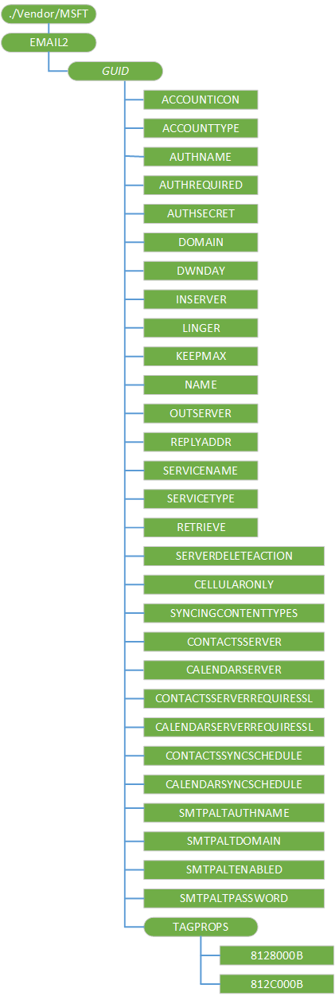

# EMAIL2 CSP

The EMAIL2 configuration service provider (CSP) is used to configure Simple Mail Transfer Protocol (SMTP) email accounts.

> **Note**   This configuration service provider requires the ID\_CAP\_CSP\_FOUNDATION and ID\_CAP\_CSP\_MAIL capabilities to be accessed from a network configuration application.
On the desktop, only per user configuration is supported.

 

The following diagram shows the EMAIL2 configuration service provider management object in tree format as used by both OMA DM and OMA Client Provisioning.

In Windows 10 Mobile, after the user’s out of box experience, an OEM or mobile operator can use the EMAIL2 configuration service provider to provision the device with a mobile operator’s proprietary mail over the air. After provisioning, the **Start** screen has a tile for the proprietary mail provider and there is also a link to it in the applications list under **Settings, email & accounts**. After an account has been updated over-the-air by the EMAIL2 CSP, the device must be powered off and then powered back on to see the sync status.

Configuration data is not encrypted when sent over the air (OTA). Be aware that this is a potential security risk when sending sensitive configuration data, such as passwords.

> [!IMPORTANT]
> All Add and Replace commands need to be wrapped in an Atomic section.

**EMAIL2**  
The configuration service provider root node.

Supported operation is Get.

***GUID***  
Defines a specific email account. A globally unique identifier (GUID) must be generated for each email account on the device. Provisioning with an account that has the same GUID as an existing one does not create the new account and Add command will fail in this case.

Supported operations are Get, Add, and Delete.

The braces {} around the GUID are required in the EMAIL2 configuration service provider.

-   For OMA Client Provisioning, the braces can be sent literally. For example, `<characteristic type="{C556E16F-56C4-4edb-9C64-D9469EE1FBE0}"/>`.

-   For OMA DM, the braces must be sent using ASCII values of 0x7B and 0x7D respectively. For example, `<Target><LocURI>./Vendor/MSFT/EMAIL2/0x7BC556E16F-56C4-4edb-9C64-D9469EE1FBE0x7D</LocURI></Target>`

**ACCOUNTICON**  
Optional. Returns the location of the icon associated with the account.

Supported operations are Get, Add, Replace and Delete.

The account icon can be used as a tile in the **Start** list or an icon in the applications list under **Settings, email & accounts**. Some icons are already provided on the device. The suggested icon for POP/IMAP or generic ActiveSync accounts is at res://AccountSettingsSharedRes{*ScreenResolution*}!%s.genericmail.png. The suggested icon for Exchange Accounts is at res://AccountSettingsSharedRes{*ScreenResolution*}!%s.office.outlook.png. Custom icons can be added if desired.

**ACCOUNTTYPE**  
Required. Specifies the type of account.

Supported operations are Get, Add, Replace and Delete.

Valid values are:

-   Email: normal email

-   VVM: visual voice mail

**AUTHNAME**  
Required. Character string that specifies the name used to authorize the user to a specific email account (also known as the user's logon name).

Supported operations are Get, Add, Replace and Delete.

**AUTHREQUIRED**  
Optional. Character string that specifies whether the outgoing server requires authentication.

Supported operations are Get, Add, Replace and Delete.

Valid values are one of the following:

-   0 - Server authentication is not required.
-   1 - Server authentication is required.

> **Note**  If this value is not specified, then no SMTP authentication is done. Also, this is different from SMTPALTENABLED.

 

**AUTHSECRET**  
Optional. Character string that specifies the user's password. The same password is used for SMTP authentication.

Supported operations are Get, Add, Replace and Delete.

**DOMAIN**  
Optional. Character string that specifies the incoming server credentials domain. Limited to 255 characters.

Supported operations are Get, Add, Replace and Delete.

**DWNDAY**  
Optional. Character string that specifies how many days' worth of email should be downloaded from the server.

Supported operations are Get, Add, Replace and Delete.

Valid values are one of the following:

-   -1: Specifies that all email currently on the server should be downloaded.

-   7: Specifies that 7 days’ worth of email should be downloaded.

-   14: Specifies that 14 days’ worth of email should be downloaded.

-   30: Specifies that 30 days’ worth of email should be downloaded.

**INSERVER**  
Required. Character string that specifies the name of the incoming server name and port number. This is limited to 62 characters. If the standard port number is used, then you don't have to specify the port number. The value format is:

-   server name:port number

Supported operations are Get, Add and Replace.

**LINGER**  
Optional. Character string that specifies the length of time between email send/receive updates in minutes.

Supported operations are Get, Add, Replace and Delete.

Valid values are:

-   0 - Email updates must be performed manually.

-   15 (default) - Wait for 15 minutes between updates.

-   30 - Wait for 30 minutes between updates.

-   60 - Wait for 60 minutes between updates.

-   120 - Wait for 120 minutes between updates.

**KEEPMAX**  
Optional. Specifies the maximum size for a message attachment. Attachments beyond this size will not be downloaded but it will remain on the server. The message itself will be downloaded. This value can be set only for IMAP4 accounts.

The limit is specified in KB

Valid values are 0, 25, 50, 125, and 250.

A value of 0 meaning that no limit will be enforced.

Supported operations are Get, Add, Replace and Delete.

**NAME**  
Optional. Character string that specifies the name of the sender displayed on a sent email. It should be set to the user’s name. Limited to 255 characters.

Supported operations are Get, Add, Replace and Delete.

**OUTSERVER**  
Required. Character string that specifies the name of the messaging service's outgoing email server. Limited to 62 characters. The value format is:

-   server name:port number

Supported operations are Get, Add, Delete, and Replace.

**REPLYADDR**  
Required. Character string that specifies the reply email address of the user (usually the same as the user email address). Sending email will fail without it. Limited to 255 characters.

Supported operations are Get, Add, Delete and Replace.

**SERVICENAME**  
Required. Character string that specifies the name of the email service to create or edit (32 characters maximum).

Supported operations are Get, Add, Replace, and Delete.

> **Note**   The EMAIL2 Configuration Service Provider does not support the OMA DM **Replace** command on the parameters **SERVICENAME** and **SERVICETYPE**. To replace either the email account name or the account service type, the existing email account must be deleted and then a new one must be created.

 

**SERVICETYPE**  
Required. Character string that specifies the type of email service to create or edit (for example, "IMAP4" or "POP3").

Supported operations are Get, Add, Replace, and Delete.

> **Note**   The EMAIL2 Configuration Service Provider does not support the OMA DM **Replace** command on the parameters **SERVICENAME** and **SERVICETYPE**. To replace either the email account name or the account service type, the existing email account must be deleted and then a new one must be created.

 

**RETRIEVE**  
Optional. Specifies the maximum size in bytes for messages retrieved from the incoming email server. Messages beyond this size are retrieved, but truncated.

Valid values are 512, 1024, 2048, 5120, 20480, and 51200.

Supported operations are Get, Add, Replace, and Delete.

**SERVERDELETEACTION**  
Optional. Character string that specifies how message is deleted on server. Valid values:

-   1 - delete message on the server
-   2 - keep the message on the server (delete to the Trash folder).

Any other value results in default action, which depends on the transport.

Supported operations are Get, Add, Replace, and Delete.

**CELLULARONLY**  
Optional. If this flag is set, the account only uses the cellular network and not Wi-Fi.

Value type is string. Supported operations are Get, Add, Replace, and Delete.

**SYNCINGCONTENTTYPES**  
Required. Specifies a bitmask for which content types are supported for syncing (eg: Mail, Contacts, Calendar).

-   No data (0x0)
-   Contacts (0x1)
-   Mail (0x2)
-   Appointments (0x4)
-   Tasks (0x8)
-   Notes (0x10)
-   Feeds (0x60)
-   Network Photo (0x180)
-   Group and room (0x200)
-   Chat (0x400)
-   Email Recipient Email (0x800)
-   Server Link (0x1000)
-   All items (0xffffffff)

Supported operations are Get, Add, Replace, and Delete.

**CONTACTSSERVER**  
Optional. Server for contact sync if it is different from the email server.

Supported operations are Get, Add, Replace, and Delete.

**CALENDARSERVER**  
Optional. Server for calendar sync if it is different from the email server.

Supported operations are Get, Add, Replace, and Delete.

**CONTACTSSERVERREQUIRESSL**  
Optional. Indicates if the connection to the contact server requires SSL.

Supported operations are Get, Add, Replace, and Delete.

**CALENDARSERVERREQUIRESSL**  
Optional. Indicates if the connection to the calendar server requires SSL.

Supported operations are Get, Add, Replace, and Delete.

**CONTACTSSYNCSCHEDULE**  
Optional. Sets the schedule for syncing contact items.

Supported operations are Get, Add, Replace, and Delete.

**CALENDARSYNCSCHEDULE**  
Optional. Sets the schedule for syncing calendar items.

Supported operations are Get, Add, Replace, and Delete.

**SMTPALTAUTHNAME**  
Optional. Character string that specifies the display name associated with the user's alternative SMTP email account.

Supported operations are Get, Add, Replace and Delete.

**SMTPALTDOMAIN**  
Optional. Character string that specifies the domain name for the user's alternative SMTP account.

Supported operations are Get, Add, Replace and Delete.

**SMTPALTENABLED**  
Optional. Character string that specifies if the user's alternate SMTP account is enabled.

Supported operations are Get, Add, Replace and Delete.

A value of "FALSE" specifies that the user's alternate SMTP email account is disabled. A value of "TRUE" specifies that the user's alternate SMTP email account is enabled.

**SMTPALTPASSWORD**  
Optional. Character string that specifies the password for the user's alternate SMTP account.

Supported operations are Get, Add, Replace and Delete.

**TAGPROPS**  
Optional. Defines a group of properties with non-standard element names.

Supported operations are Get, Add, Replace and Delete.

**TAGPROPS/8128000B**  
Optional. Character string that specifies if the incoming email server requires SSL.

Supported operations are Get, Add, Replace and Delete.

Value is one of the following:

-   0 - SSL is not required.
-   1 - SSL is required.

**TAGPROPS/812C000B**  
Optional. Character string that specifies if the outgoing email server requires SSL.

Supported operations are Get and Replace.

Value is one of the following:

-   0 - SSL is not required.
-   1 - SSL is required.

## Remarks

When an application removal or configuration roll-back is provisioned, the EMAIL2 CSP passes the request to Configuration Manager, which handles the transaction externally. When a MAPI application is removed, the accounts that were created with it are deleted and all messages and other properties that the transport (for example, Short Message Service \[SMS\], Post Office Protocol \[POP\], or Simple Mail Transfer Protocol \[SMTP\]) might have stored, are lost. If an attempt to create a new email account is unsuccessful, the new account is automatically deleted. If an attempt to edit an existing account is unsuccessful, the original configuration is automatically rolled back (restored).

For OMA DM, the EMAIL2 CSP handles the Replace command differently from most other configuration service providers. For the EMAIL2 CSP, Configuration Manager implicitly adds the missing part of the node to be replaced or any segment in the path of the node if it is left out in the \<LocURI>\</LocURI\> block. There are separate parameters defined for the outgoing server logon credentials. The following are the usage rules for these credentials:

-   The incoming server logon credentials are used (AUTHNAME, AUTHSECRET, and DOMAIN) unless the outgoing server credentials are set.

-   If some but not all of the outgoing server credentials parameters are present then the EMAIL2 Configuration Service Provider will be considered in error.

-   Account details cannot be queried unless the account GUID is known. Currently, there is no way to perform a top-level query for account GUIDs.

Windows 10 Mobile supports Transport Layer Security (TLS), but this cannot be explicitly enabled through this configuration service provider, and the user cannot enable TLS through the UI. If the connection to the mail server is initiated with deferred SSL, the mail server can send STARTTLS as a server capability and TLS will be enabled. The following steps show how to enable TLS.

1.  The device attempts to connect to the mail server using SSL.

2.  If the SSL connection fails, the device attempts to connect using deferred SSL.

3.  If the connection fails over both SSL and deferred SSL, and the user selected **Server requires encrypted (SSL) connection**, the device does not attempt another connection.

4.  If the user did not select **Server requires encrypted (SSL) connection**, the device attempts to establish a non-SSL connection.

5.  If the connection succeeds using any of the encryption protocols, the device requests the server capabilities.

6.  If one of the capabilities sent by the mail server is STARTTLS and the connection is deferred SSL, the device enables TLS. TLS is not enabled on connections using SSL or non-SSL.

## Related topics

[Configuration service provider reference](configuration-service-provider-reference.md)

 

 

