# Enable offline upgrades to Windows 10 for Windows Embedded 8.1 Handheld devices


Like any Windows devices, Windows 10 Mobile devices use Microsoft Update by default to download updates over the Internet. However, in some enterprise environments, devices may not be able to access the Internet to retrieve their updates. Because of network restrictions or other enterprise policies, devices must download their updates from an internal location. This document describes how to enable offline updates using System Center Configuration Manager.

Here is a table of update path to Windows 10 Mobile.

<table>
<colgroup>
<col width="50%" />
<col width="50%" />
</colgroup>
<thead>
<tr class="header">
<th>Starting SKU</th>
<th>Upgrade to Windows 10 Mobile</th>
</tr>
</thead>
<tbody>
<tr class="odd">
<td><p>Windows Mobile 6.5</p></td>
<td><p>No</p></td>
</tr>
<tr class="even">
<td><p>Windows Phone 8</p></td>
<td><p>No</p></td>
</tr>
<tr class="odd">
<td><p>Windows Phone 8.1</p></td>
<td><p>Yes</p></td>
</tr>
</tbody>
</table>

 
To configure the MDM service provider and enable the mobile devices to download updates from a predefined internal location, an IT administrator or device administrator must perform a series of manual and automated steps.

Here is the outline of the process:

1.  Prepare a test device that can connect to the Internet to download the released update packages. 
2.  After the updates are downloaded and before pressing the install button, retrieve an XML file on the device that contains all the metadata about each update package.
3.  Check the status code in the XML file.
4.  Check for registry dependencies.
5.  Using a script that we provide, parse the XML file to extract download URLs for the update packages.
6.  Download the update packages using the download URLs.
7.  Place the downloaded packages on an internal share that is accessible to devices you are updating.
8.  Create two additional XML files that define the specific updates to download and the specific locations from which to download the updates, and deploy them onto the production device.
9.  Start the update process from the devices.

As a part of the update process, Windows will run data migrators to bring forward configured settings and data on the device. For instance, if the device was configured with a maintenance time or other update policy in Windows Embedded 8.1 Handheld, these settings will automatically get migrated to Windows 10 as part of the update process. If the Handheld device was configured for assigned access lockdown, then this configuration will also get migrated to Windows 10 as part of the update process. This includes ProductId & AumId conversion for all internal apps (including buttonremapping apps).

Note that the migrators do not take care of the following:

-   3rd party apps provided by OEMs
-   deprecated 1st party apps, such as Bing News
-   deprecated system/application settings, such as Microsoft.Game, Microsoft.IE

In the event of an Enterprise Reset, these migrated settings are automatically persisted.

Down the road, after the upgrade to Windows 10 is complete, if you decide to push down a new wehlockdown.xml, you would need to take the following steps to ensure that the updated settings are persisted through an Enterprise Reset:

1.  Delete the TPK\*ppkg and push down a new ppkg with your new configuration to the persistent folder.
2.  Push down a new ppkg with your new configuration with higher priority. Note that in ICD, Owner=Microsoft, Rank=0 is the lowest priority; and vise versa. With this step, the old assigned access lockdown configuration will be overwritten.

**Requirements:**

-   The test device must be same as the other production devices that are receiving the updates.
-   Your test device must be enrolled with System Center Configuration Manager.
-   Your device can connect to the Internet.
-   Your device must have an SD card with at least 0.5 GB of free space.
-   Ensure that the settings app and PhoneUpdate applet are available via Assigned Access.

The following diagram is a high-level overview of the process.

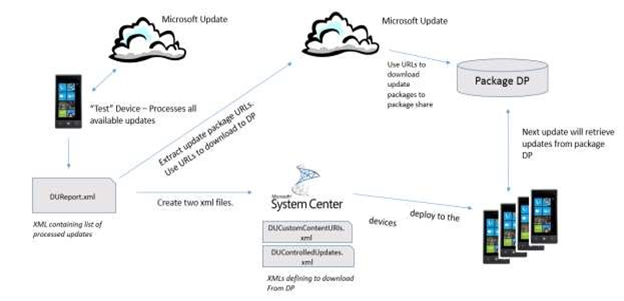

## Step 1: Prepare a test device to download updates from Microsoft Update


Define the baseline update set that will be applied to other devices. Use a device that is running the most recent image as the test device.

Trigger the device to check for updates either manually or using System Center Configuration Manager.

**Manually**

1.  From the device, go to **Settings** &gt; **Phone updates** &gt; **Check for updates**.
2.  Sync the device. Go to **Settings** &gt; **Workplace** &gt; **Enrolled** and click the refresh icon. Repeat as needed.
3.  Follow the prompts to download the updates, but do not press the install button.

> **Note**  There is a bug in all OS versions up to GDR2 where the CSP will not set the assigned value. There is no way to change or set this until GDR2 is deployed onto the device.


**Using System Center Configuration Manager**

1.  Remotely trigger a scan of the test device by deploying a Trigger Scan Configuration Baseline.

    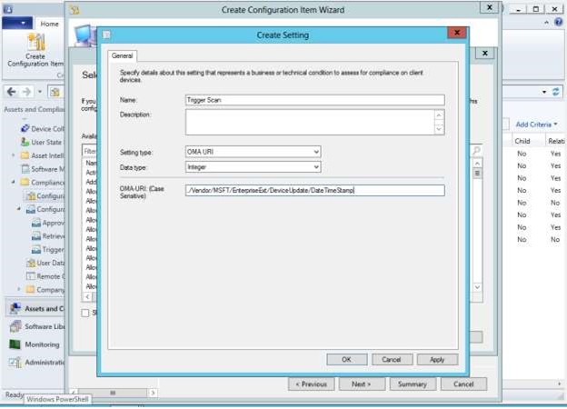

2.  Set the value of this OMA-URI by browsing to the settings of this Configuration Item and selecting the newly created Trigger Scan settings from the previous step.

    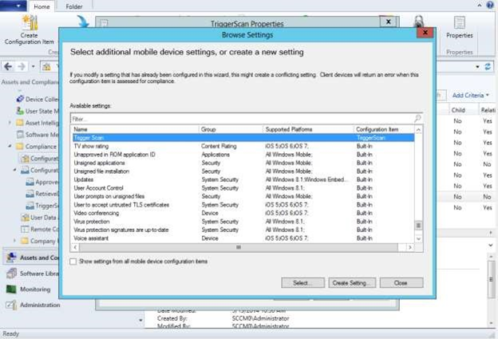

3.  Ensure that the value that is specified for this URI is greater than the value on the device(s) and that the Remediate noncompliant rules when supported option is checked. For the first time, any value that is greater than 0 will work, but for subsequent configurations, ensure that you specify an incremented value.

    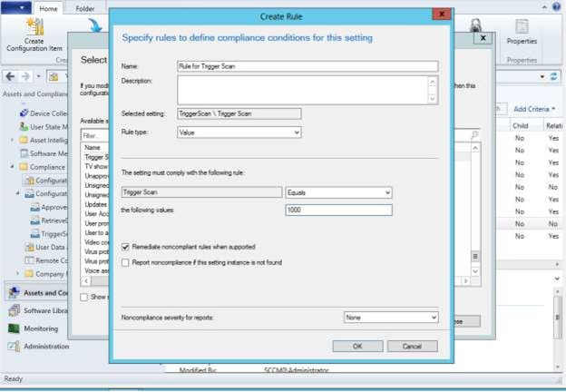

4.  Create a Configuration Baseline for TriggerScan and Deploy. It is recommended that this Configuration Baseline be deployed after the Controlled Updates Baseline has been applied to the device (the corresponding files are deployed on the device through a device sync session).
5.  Follow the prompts for downloading the updates, but do not install the updates on the device.


## <a href="" id="step2"></a>Step 2: Retrieve the device update report XML from the device

After updates are downloaded (but not installed on the device), the process generates an XML file that contains information about the packages it downloaded. You must retrieve this XML file.

There are two ways to retrieve this file from the device; one pre-GDR1 and one post-GDR1.

**Pre-GDR1: Parse a compliance log from the device in ConfigMgr**

1.  Create a Configuration Item using ConfigMgr to look at the registry entry ./Vendor/MSFT/EnterpriseExt/DeviceUpdate/ApprovedUpdatesXml.

    > **Note**  In System Center Configuration Manager, you may see an error about exceeding the file limit when using ApprovedUpdatesXml. However, the process still completes even if the file is large.

    If the XML file is greater than 32K you can also use ./Vendor/MSFT/FileSystem/&lt;*filename*&gt;.
2.  Set a baseline for this Configuration Item with a “dummy” value (such as zzz), and ensure that you do not remediate it.

    The dummy value is not be set; it is only used for comparison.
3.  After the report XML is sent to the device, System Center Configuration Manager displays a compliance log that contains the report information. The log can contain significant amount of data.
4.  Parse this log for the report XML content.

For a step-by-step walkthrough, see [How to retrieve a device update report using System Center Configuration Manager logs](#how-to-retrieve-a-device-update-report-using-system-center-configuration-manager-logs).

**Post-GDR1: Retrieve the report xml file using an SD card**

1.  Create a Configuration Item using ConfigMgr to set a registry value for ./Vendor/MSFT/EnterpriseExt/DeviceUpdate/CopyUpdateReportToSDCard.
2.  The value that you define for this Configuration Item is defined by the relative path to the SD card which includes the filename of the XML file (such as SDCardRoot\\Update\\DUReport.xml).
3.  Remove the SD card from device and copy the XML file to your PC.

## Step 3: Check the status code in the XML file
Make sure that the status code is set to 0000-0000 (success).

## Step 4: Check for registry dependencies
Remove any registry dependencies in the XML file.

## Step 5: Extract download URLs from the report XML

Use the [example PowerShell script](#example-powershell-script) to extract the download URLs from the XML file or parse it manually.

## Step 6: Retrieve update packages using download URLs

Use a script or manually download each update package to a PC or an internal share.

## Step 7: Place the update packages on an accessible share

Put all the update packages into an internal share that is accessible to all the devices that need these updates. Ensure that the internal share can support multiple devices trying to access the updates at the same time.

## Step 8: Create two XML files for production devices to select updates and download locations

Here are the two files.

<table>
<colgroup>
<col width="50%" />
<col width="50%" />
</colgroup>
<thead>
<tr class="header">
<th>Term</th>
<th>Description</th>
</tr>
</thead>
<tbody>
<tr class="odd">
<td><p><strong>DUControlledUpdates.xml</strong></p></td>
<td><p>This is the same file as the report XML retrieved in Step 2 with a different name. This file tells the device the specific update packages to download. See Appendix for example</p>
<p></p></td>
</tr>
<tr class="even">
<td><p><strong>DUCustomContentUris.xml</strong></p></td>
<td><p>This file maps the update packages in DUControlledUpdates.xml to the internal share location.</p></td>
</tr>
</tbody>
</table>

 

For a walkthrough of these steps, [How to deploy controlled updates](#how-to-deploy-controlled-updates). Ensure that the trigger scan configuration baseline HAS NOT been deployed.

<a href="" id="deploy-controlled-updates"></a>
### How to deploy controlled updates

This process has three parts:

-   Create a configuration item for DUControlledUpdates.xml
-   Create a configuration item for DUCustomContentURIs.xml
-   Create a configuration item for approved updates.

<a href="" id="create-ducontrolledupdates"></a>
**Create a configuration item for DUControlledUpdates.xml**

1.  Create a configuration item. In the **Browse Settings** window, select **Device File** as a filter, and then click **Select**.

    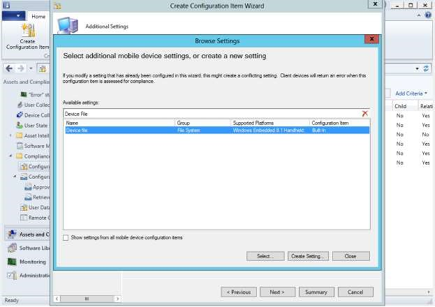

2.  Browse to the DUControlledUpdates.xml that was created from the test device and specify that file path and name on the device as `NonPersistent\DUControlledUpdates.xml`.

    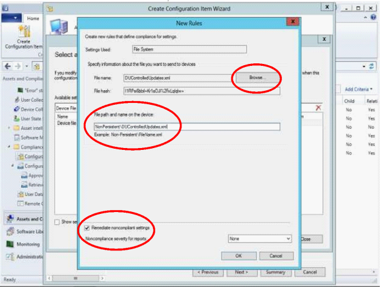

3.  Check the box **Remediate noncompliant settings**.
4.  Click **OK**.

<a href="" id="create-ducustomcontent"></a>
**Create a configuration item for DUCustomContentURIs.xml**

1.  Create a configuration item and specify that file path and name on the device as `NonPersistent\DUCustomContentURIs.xml`
2.  Check the box **Remediate noncompliant settings**.

    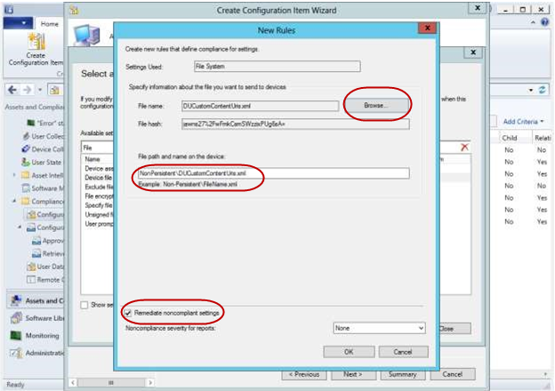

3.  Click **OK**.

<a href="" id="create-config-baseline"></a>
**Create a configuration baseline for approved updates**

1.  Create a configuration baseline item and give it a name (such as ControlledUpdates).
2.  Add the DUControlledUpdates and DUCustomContentURIs configuration items, and then click **OK**.

    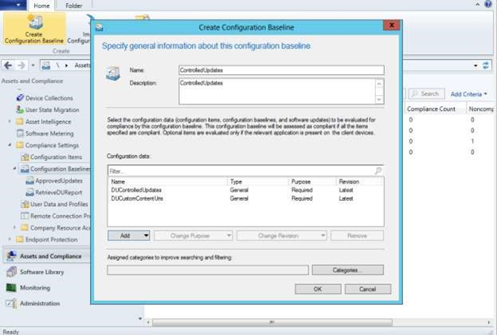

3.  Deploy the configuration baseline to the appropriate device or device collection.

    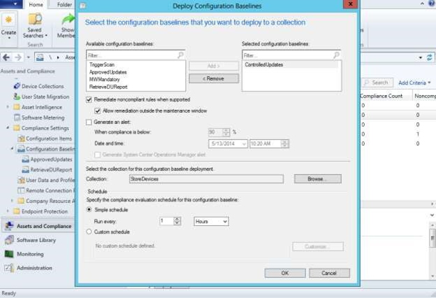

4.  Click **OK**.

## Step 7: Trigger the other devices to scan, download, and install updates

Now that the other "production" or "in-store" devices have the necessary information to download updates from an internal share, the devices are ready for updates.

### Use this process for unmanaged devices

If the update policy of the device is not managed or restricted by System Center Configuration Manager, an update process can be initiated on the device in one of the following ways:

-   Initiated by a periodic scan that the device automatically performs.
-   Initiated manually through **Settings** -&gt; **Phone Update** -&gt; **Check for Updates**.

### Use this process for managed devices

If the update policy of the device is managed or restricted by MDM, an update process can be initiated on the device in one of the following ways:

-   Trigger the device to scan for updates through System Center Configuration Manager.

    Ensure that the trigger scan has successfully executed, and then remove the trigger scan configuration baseline.

    > **Note**  Ensure that the PhoneUpdateRestriction Policy is set to a value of 0, to ensure that the device will not perform an automatic scan.


-   Trigger the device to scan as part of a Maintenance Window defined by the IT Admin in System Center Configuration Manager.

After the installation of updates is completed, the IT Admin can use the DUReport generated in the production devices to determine if the device successfully installed the list of updates. If the device did not, error codes are provided in the DUReport.xml. To retrieve the device update report from a device, perform the same steps defined in [Step 2](#step2).

<a href="" id="example-script"></a>
## Example PowerShell script

``` syntax
param (
# [Parameter (Mandatory=$true, HelpMessage="Input File")]
        [String]$inputFile,

# [Parameter (Mandatory=$true, HelpMessage="Download Cache Location")]
        [String]$downloadCache,

# [Parameter (Mandatory=$true, HelpMessage="Local Cache URL")]
        [String]$localCacheURL
       )

#DownloadFiles Function
function DownloadFiles($inputFile, $downloadCache, $localCacheURL)
{
    $customContentURIFileCreationError = "Not able to create Custom Content URI File"
#Read the Input File
    $report = [xml](Get-Content $inputFile)
    
# this is where the document will be saved
    $customContentURLFile = "$downloadCache\DUCustomContentUris.xml"
    New-Item -Path $customContentURLFile -ItemType File -force -ErrorAction SilentlyContinue -ErrorVariable NewItemError > $null
    if ($NewItemError -ne "")
    {
       PrintMessageAndExit $customContentURIFileCreationError
    }

# get an XMLTextWriter to create the XML
    $XmlWriter = New-Object System.XMl.XmlTextWriter($customContentURLFile,$Null)

# choose a pretty formatting:
    $xmlWriter.Formatting = 'Indented'
    $xmlWriter.Indentation = 1
    $XmlWriter.IndentChar = "`t"
 
# write the header
    $xmlWriter.WriteStartDocument()
    $xmlWriter.WriteStartElement('CustomContentUrls')
    foreach ($update in $report.UpdateData.coreUpdateMetadata.updateSet.update)
    {
        if (!$update.destinationFilePath -or !$update.contentUrl) 
        {
            continue;
        }

        $destFilePath = $update.destinationFilePath.Trim();
        $contentUrl = $update.contentUrl.Trim();

        Write-Host "Pre-Processing Line: $destFilePath#$contentUrl"
        if (($destFilePath -ne "") -and ($destFilePath.Contains("\")) -and ($contentUrl -ne "") -and ($contentUrl.Contains("/")) )
        {
            $isBundle = $update.isBundle
            $revisionId = $update.revisionId
            $updateId = $update.updateId
            $revisionNum = $update.revisionNum

            $fileName = $destFilePath.Substring($destFilePath.LastIndexOf("\") + 1);
#Write-Host "Processing Line: $destFilePath#$contentUrl"
            if ($fileName -ne "")
            {
                $destination = $downloadCache + "\" + $fileName;
                Try
                {
                    $wc = New-Object System.Net.WebClient
                    $wc.DownloadFile($contentUrl, $destination)
                    Write-Host "Successfull Download: $contentUrl#$destination";

                    $XmlWriter.WriteStartElement('contentUrl')
                    $XmlWriter.WriteAttributeString('isBundle', $isBundle)
                    $XmlWriter.WriteAttributeString('revisionId', $revisionId)
                    $XmlWriter.WriteAttributeString('updateId', $updateId)
                    $XmlWriter.WriteAttributeString('revisionNum', $revisionNum)
                    $XmlWriter.WriteRaw($localCacheURL + $fileName)
                    $xmlWriter.WriteEndElement()
                }
                Catch [ArgumentNullException]
                {
                    Write-Host "Content URL is null";
                }
                Catch [WebException]
                {
                    Write-Host "Invalid Content URL: $contentUrl";
                }
                Catch 
                {
                    Write-Host "Exception in Download: $contentUrl";
                }
            }
            else
            {
                Write-Host "Ignored Input Line: $contentUrl"
            }
        }
        else
        {
            Write-Host "Ignored Input Line: $contentUrl"
        }
    }

# close the "CustomContentUrls" node
    $xmlWriter.WriteEndElement()
 
# finalize the document
    $xmlWriter.WriteEndDocument()
    $xmlWriter.Flush()
    $xmlWriter.Close()

    Write-Host "Successfully Created Custom Content URL File: $customContentURLFile"
}

#PrintMessage Function
function PrintMessageAndExit($ErrorMessage)
{
    Write-Host $ErrorMessage
    exit 1
}

#PrintMessage Function
function PrintUsageAndExit()
{
    Write-Host "Usage: Download.ps1 -inputFile <InputFilePath> -downloadCache <CachePath> -localCacheURL <URL>"
    exit 1
}

if (($inputFile -eq "") -or ($downloadCache -eq "") -or ($localCacheURL -eq ""))
{
    PrintUsageAndExit
}
if (!$localCacheURL.EndsWith("/")) 
{
    $localCacheURL = $localCacheURL + "/";
}
$inputFileErrorString = "Input File does not exist";
$downloadCacheErrorString = "Download Cache does not exist";
$downloadCacheAddError = "Access Denied in creating the Download Cache Folder";
$downloadCacheRemoveError = "Not able to delete files from Download Cache"
$downloadCacheClearWarningString = "Download Cache not empty. Do you want to Clear";

#Check if Input File Exist
$inputFileExists = Test-Path $inputFile;
if(!$inputFileExists) 
{
    PrintMessageAndExit($inputFileErrorString)
}

#Check if Download Cache Exist
$downloadCacheExists = Test-Path $downloadCache;
if(!$downloadCacheExists)
{
    PrintMessageAndExit($downloadCacheErrorString)
}

$downloadCacheFileCount = (Get-ChildItem $downloadCache).Length;
if ($downloadCacheFileCount -ne 0)
{
#Clear the directory
    Remove-Item $downloadCache -Recurse -Force -Confirm -ErrorVariable RemoveItemError -ErrorAction SilentlyContinue > $null
    if ($RemoveItemError -ne "")
    {
        PrintMessageAndExit $downloadCacheRemoveError
    }

    $childItem = Get-ChildItem $downloadCache -ErrorAction SilentlyContinue > $null
    $downloadCacheFileCount = ($childItem).Length;
    if ($downloadCacheFileCount -ne 0)
    {
        PrintMessageAndExit $downloadCacheRemoveError
    }

#Create a new directory
    New-Item -Path $downloadCache -ItemType Directory -ErrorAction SilentlyContinue -ErrorVariable NewItemError > $null
    if ($NewItemError -ne "")
    {
       PrintMessageAndExit $downloadCacheAddError
    }
}

DownloadFiles $inputFile $downloadCache $localCacheURL
```

<a href="" id="how-to-retrieve"></a>
## How to retrieve a device update report using System Center Configuration Manager logs

Use this procedure for pre-GDR1 devices.

**For pre-GDR1 devices**

1.  Trigger a device scan. Go to **Settings** -&gt; **Phone Update** -&gt; **Check for Updates**.

    Since the DUReport settings have not been remedied, you should see a non-compliance.
2.  In System Center Configuration Manager under **Assets and Compliance** &gt; **Compliance Settings**, right-click on **Configuration Items**.
3.  Select **Create Configuration Item**.

    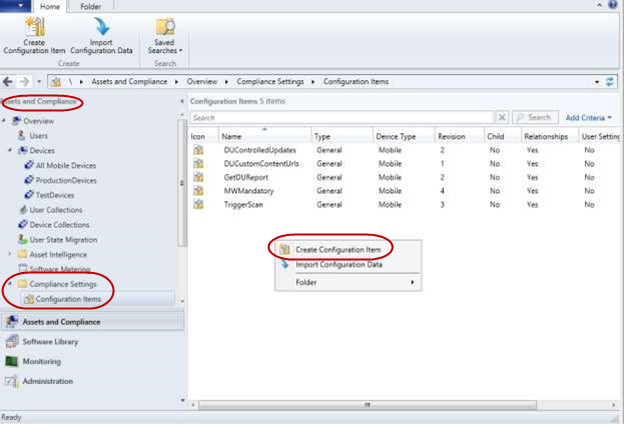
4.  Enter a filename (such as GetDUReport) and then choose **Mobile Device**.
5.  In the **Mobile Device Settings** page, check the box **Configure Additional Settings that are not in the default settings group**, and the click **Next**.

    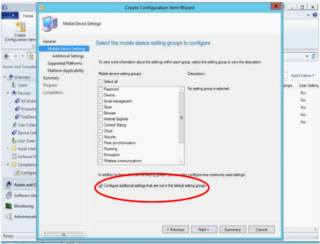
6.  In the **Additional Settings** page, click **Add**.

    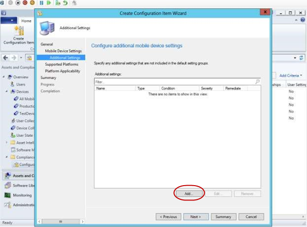
7.  In the **Browse Settings** page, click **Create Setting**.

    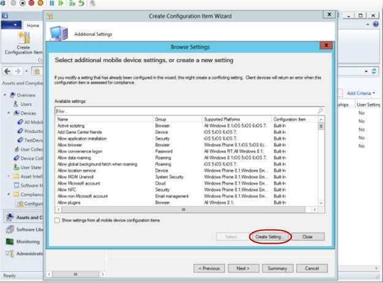
8.  Enter a unique **Name**. For the **Setting type**, select **OMA-URI** and for the **Data type**, select **String**.
9.  In the **OMA-URI** text box, enter `./Vendor/MSFT/EnterpriseExt/DeviceUpdate/UpdatesResultXml`, the click **OK**.

    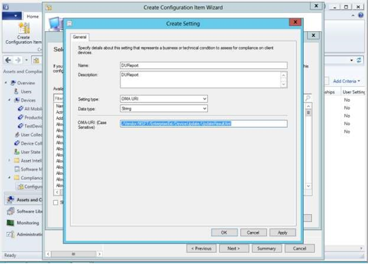
10. In the **Browse Settings** page, click **Close**.
11. In the **Create Configuration Item Wizard** page, check **All Windows Embedded 8.1 Handheld** as the supported platform, and then click **Next**.

    
12. Close the **Create Configuration Item Wizard** page.
13. Right-click on the newly create configuration item, and then select the **Compliance Rules** tab.
14. Click the new created mobile device setting (such as DUReport) and then click **Select**.
15. Enter a dummy value (such as zzz) that is different from the one on the device.

    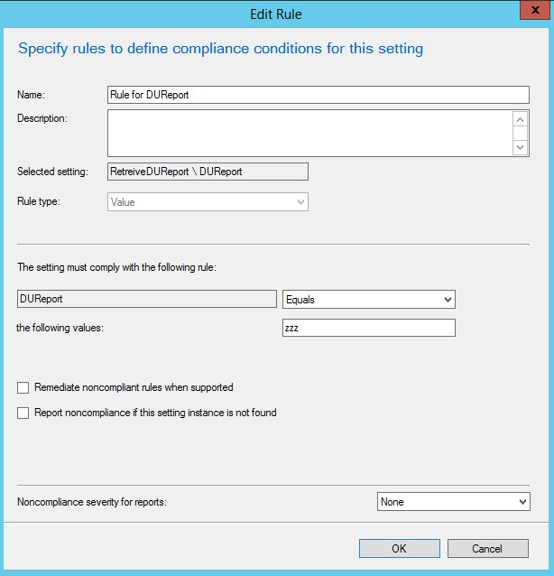
16. Disable remediation by unchecking the **Remediate noncompliant rules when supported** option.
17. Click **OK** to close the Edit Rule page.
18. Create a new configuration baseline. Under **Assets and Compliance** &gt; **Compliance Settings**, right-click on **Configuration Baselines**.
19. Select **Create Configuration Item**.

    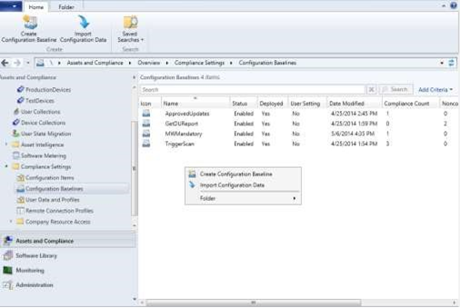
20. Enter a baseline name (such as RetrieveDUReport).
21. Add the configuration item that you just created. Select **Add** and then select the configuration item that you just created (such as DUReport).

    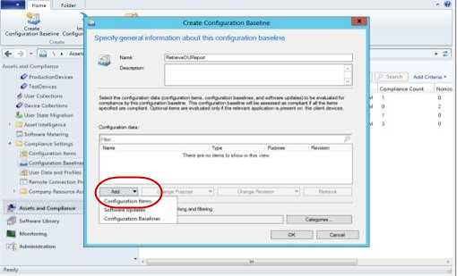
22. Click **OK**, then click **OK** again to complete the configuration baseline.
23. Deploy the newly created configuration baseline to the appropriate device collection. Right-click on the configuration baseline that you created and the select **Deploy**.

    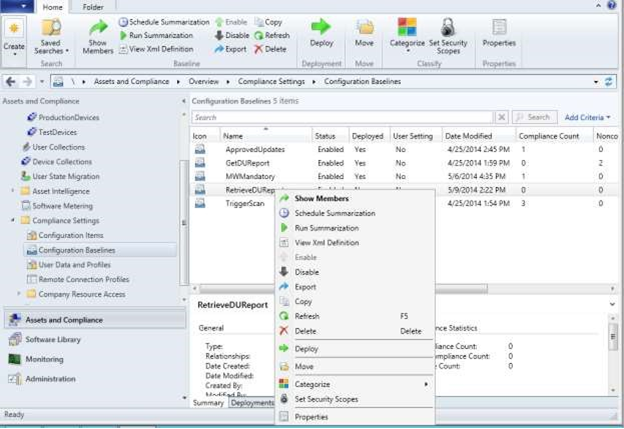
24. Check the check box **Remediate noncompliant rules when supported**.
25. Select the appropriate device collection and define the schedule.

    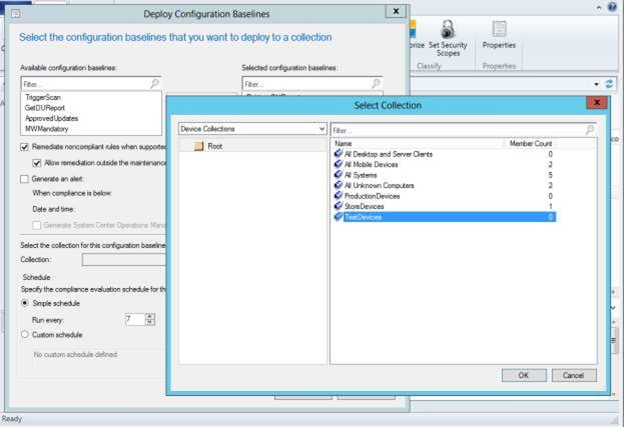
26. To view the DUReport content, select the appropriate deployment for the configuration saseline that you created. Right-click on the deployment and select **View Status**.
27. Click **Run Summarization** and then click **Refresh**. On the Non-Compliant tab, the test device(s) should be listed.
28. Under **Asset Details**, right-click on the test device, and then select **Mode Details**.

    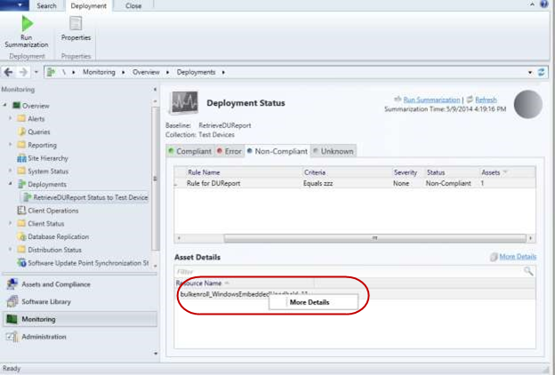
29. In the Non-compliant tab, you will see the DUReport, but you cannot retrieve the content from here.

    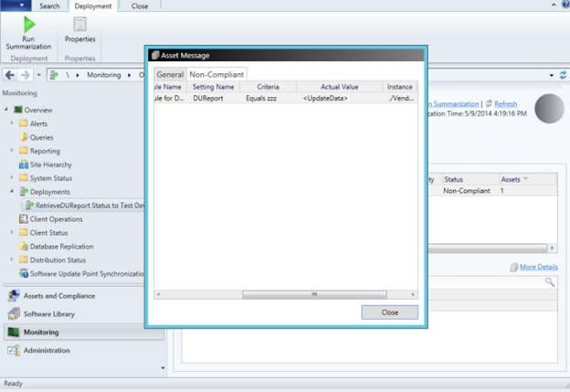
30. To retrieve the DUReport, open an Explorer windows to C:\\Program Files\\SMS\_CCM\\SMS\_DM.log.
31. In the log file, search from the bottom for "./Vendor/MSFT/EnterpriseExt/DeviceUpdate/UpdatesResultXml" RuleExression="Equals zzz" where zzz is the dummy value. Just above this copy the information for UpdateData and use this information to create the DUControlledUpdates.xml.

 


