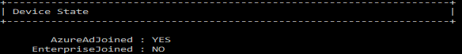
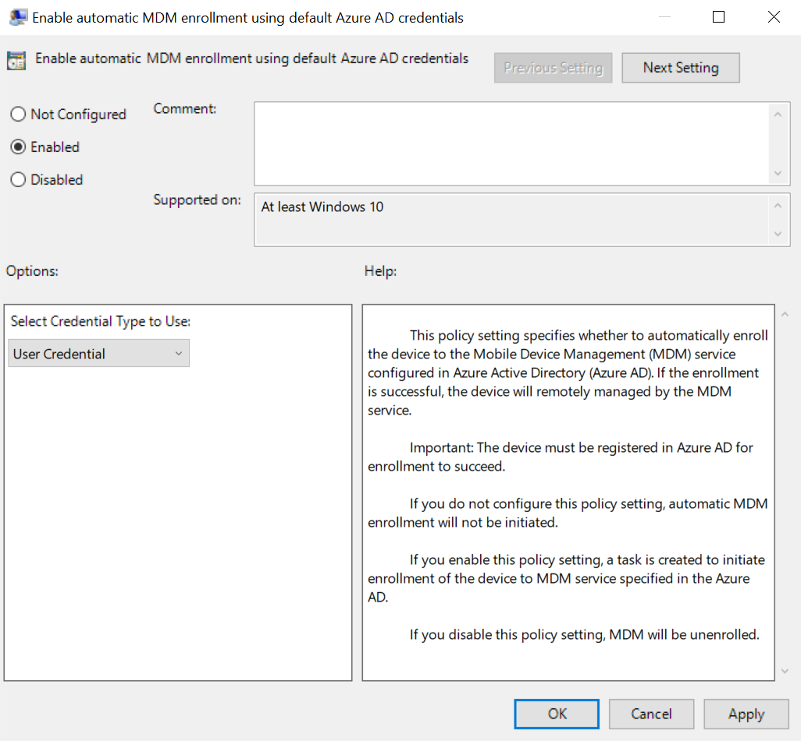
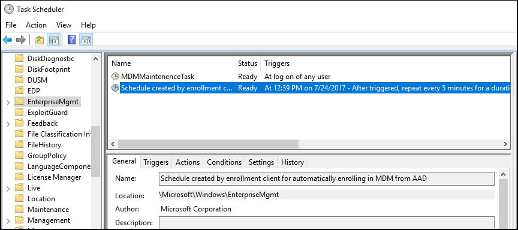

# Enroll a Windows 10 device automatically using Group Policy

Starting in Windows 10, version 1709, you can use a Group Policy to trigger auto-enrollment to MDM for Active Directory (AD) domain-joined devices. 

Requirements:
- AD-joined PC running Windows 10, version 1709 or later
- The enterprise has configured a mobile device management (MDM) service  
- The enterprise AD must be [registered with Azure Active Directory (Azure AD)](azure-active-directory-integration-with-mdm.md)
- The device should not already be enrolled in Intune using the classic agents (devices managed using agents will fail enrollment with `error 0x80180026`)

> [!TIP]
> [How to configure automatic registration of Windows domain-joined devices with Azure Active Directory](https://docs.microsoft.com/azure/active-directory/active-directory-conditional-access-automatic-device-registration-setup)

To verify if the device is Azure AD registered, run `dsregcmd /status` from the command line.

Here is a partial screenshot of the result:

The auto-enrollment relies of the presence of an MDM service and the Azure Active Directory registration for the PC. Starting in Windows 10, version 1607, once the enterprise has registered its AD with Azure AD, a Windows PC that is domain joined is automatically AAD registered.

> [!NOTE]
> In Windows 10, version 1709, the enrollment protocol was updated to check whether the device is domain-joined. For details, see [\[MS-MDE2\]: Mobile Device Enrollment Protocol Version 2](https://msdn.microsoft.com/library/mt221945.aspx). For examples, see section 4.3.1 RequestSecurityToken of the MS-MDE2 protocol documentation. 

When the auto-enrollment Group Policy is enabled, a task is created in the background that initiates the MDM enrollment. The task will use the existing MDM service configuration from the Azure  Active Directory information of the user. If multi-factor authentication is required, the user will get a prompt to complete the authentication. Once the enrollment is configured, the user can check the status in the Settings page.

In Windows 10, version 1709, when the same policy is configured in GP and MDM, the GP policy wins (GP policy takes precedence over MDM). Since Windows 10, version 1803, a new setting allows you to change the policy conflict winner to MDM. See [Windows 10 Group Policy vs. Intune MDM Policy who wins?](https://blogs.technet.microsoft.com/cbernier/2018/04/02/windows-10-group-policy-vs-intune-mdm-policy-who-wins/) to learn more.

For this policy to work, you must verify that the MDM service provider allows the GP triggered MDM enrollment for domain joined devices.

## Configure the auto-enrollment Group Policy for a single PC

This procedure is only for illustration purposes to show how the new auto-enrollment policy works. It is not recommended for the production environment in the enterprise. For bulk deployment, you should use the [Group Policy Management Console process](#configure-the-auto-enrollment-for-a-group-of-devices).

Requirements:
- AD-joined PC running Windows 10, version 1709
- Enterprise has MDM service already configured 
- Enterprise AD must be registered with Azure AD

1.	Run GPEdit.msc

    Click Start, then in the text box type gpedit. 

    

2. Under **Best match**, click **Edit group policy** to launch it.

3.  In **Local Computer Policy**, click **Administrative Templates** > **Windows Components** > **MDM**.

    

4.	Double-click **Auto MDM Enrollment with AAD Token**.

    

5.	Click **Enable**, then click **OK**.

     A task is created and scheduled to run every 5 minutes for the duration of 1 day. The task is called " Schedule created by enrollment client for automatically enrolling in MDM from AAD." 

     To see the scheduled task, launch the [Task Scheduler app](#task-scheduler-app).

     If two-factor authentication is required, you will be prompted to complete the process. Here is an example screenshot.

     

6.	To verify successful enrollment to MDM , click **Start > Settings > Accounts > Access work or school**, then select your domain account.

7.	Click **Info** to see the MDM enrollment information.

    

    If you do not see the **Info** button or the enrollment information, it is possible that the enrollment failed. Check the status in [Task Scheduler app](#task-scheduler-app).

### Task Scheduler app

1. Click **Start**, then in the text box type **task scheduler**.

   

2.	Under **Best match**, click **Task Scheduler** to launch it.

3.	In **Task Scheduler Library**, open **Microsoft > Windows** , then click **EnterpriseMgmt**. 

    

    To see the result of the task, move the scroll bar to the right to see the **Last Run Result**. Note that **0x80180026** is a failure message (MENROLL\_E_DEVICE\_MANAGEMENT_BLOCKED). You can see the logs in the **History** tab. 

    If the device enrollment is blocked, your IT admin may have enabled the **Disable MDM Enrollment** policy. Note that the GPEdit console does not reflect the status of policies set by your IT admin on your device. It is only used by the user to set policies.

## Configure the auto-enrollment for a group of devices

Requirements:
- AD-joined PC running Windows 10, version 1709
- Enterprise has MDM service already configured (with Intune or a third party service provider)
- Enterprise AD must be integrated with Azure AD.
- Ensure that PCs belong to same computer group.

>[!IMPORTANT]
>If you do not see the policy, it may be because you don’t have the ADMX installed for Windows 10, version 1803 or version 1809. To fix the issue, follow these steps:        
>   1. Download:  
>   1803 -->[Administrative Templates (.admx) for Windows 10 April 2018 Update (1803)](https://www.microsoft.com/en-us/download/details.aspx?id=56880) or  
>   1809 --> [Administrative Templates for Windows 10 October 2018 Update (1809)](https://www.microsoft.com/en-us/download/details.aspx?id=57576).
>   2. Install the package on the Primary Domain Controller (PDC).
>   3. Navigate, depending on the version to the folder:
>   1803 --> **C:\Program Files (x86)\Microsoft Group Policy\Windows 10 April 2018 Update (1803) v2**, or  
>   1809 --> **C:\Program Files (x86)\Microsoft Group Policy\Windows 10 October 2018 Update (1809) v2**
>   4. Copy policy definitions folder to **C:\Windows\SYSVOL\domain\Policies**.
>   5. Restart the Primary Domain Controller for the policy to be available.
>   This procedure will work for any future version as well.

1.	Create a Group Policy Object (GPO) and enable the Group Policy **Computer Configuration** > **Policies** > **Administrative Templates** > **Windows Components** > **MDM** > **Enable automatic MDM enrollment using default Azure AD credentials**.
2.	Create a Security Group for the PCs.
3.	Link the GPO.
4.	Filter using Security Groups.
5.	Enforce a GPO link.

> [!NOTE]
> Version 1903 (March 2019) is actually on the Insider program and doesn't yet contain a downloadable version of Templates (version 1903).

### Related topics

- [Group Policy Management Console](https://technet.microsoft.com/library/cc753298(v=ws.11).aspx)
- [Create and Edit a Group Policy Object](https://technet.microsoft.com/library/cc754740(v=ws.11).aspx)
- [Link a Group Policy Object](https://technet.microsoft.com/library/cc732979(v=ws.11).aspx)
- [Filter Using Security Groups](https://technet.microsoft.com/library/cc752992(v=ws.11).aspx)
- [Enforce a Group Policy Object Link](https://technet.microsoft.com/library/cc753909(v=ws.11).aspx)

### Useful Links
- [Windows 10 Administrative Templates for Windows 10 April 2018 Update 1803](https://www.microsoft.com/download/details.aspx?id=56880)
- [Windows 10 Administrative Templates for Windows 10 October 2018 Update 1809](https://www.microsoft.com/download/details.aspx?id=57576)
 
