# Enroll a Windows 10 device automatically using Group Policy

Starting in Windows 10, version 1709, you can use a Group Policy to trigger auto-enrollment to MDM for Active Directory (AD) domain-joined devices. 

The enrollment into Intune is triggered by a group policy created on your local AD and happens without any user interaction. This means you can automatically mass-enroll a large number of domain-joined corporate devices into Microsoft Intune. The enrollment process starts in the background once you sign in to the device with your Azure AD account.

Requirements:
- AD-joined PC running Windows 10, version 1709 or later
- The enterprise has configured a mobile device management (MDM) service  
- The enterprise AD must be [registered with Azure Active Directory (Azure AD)](azure-active-directory-integration-with-mdm.md)
- The device should not already be enrolled in Intune using the classic agents (devices managed using agents will fail enrollment with `error 0x80180026`)

> [!TIP]
> [How to configure automatic registration of Windows domain-joined devices with Azure Active Directory](https://docs.microsoft.com/azure/active-directory/active-directory-conditional-access-automatic-device-registration-setup)

The auto-enrollment relies on the presence of an MDM service and the Azure Active Directory registration for the PC. Starting in Windows 10, version 1607, once the enterprise has registered its AD with Azure AD, a Windows PC that is domain joined is automatically AAD registered.

> [!NOTE]
> In Windows 10, version 1709, the enrollment protocol was updated to check whether the device is domain-joined. For details, see [\[MS-MDE2\]: Mobile Device Enrollment Protocol Version 2](https://msdn.microsoft.com/library/mt221945.aspx). For examples, see section 4.3.1 RequestSecurityToken of the MS-MDE2 protocol documentation. 

When the auto-enrollment Group Policy is enabled, a task is created in the background that initiates the MDM enrollment. The task will use the existing MDM service configuration from the Azure  Active Directory information of the user. If multi-factor authentication is required, the user will get a prompt to complete the authentication. Once the enrollment is configured, the user can check the status in the Settings page.

In Windows 10, version 1709, when the same policy is configured in GP and MDM, the GP policy wins (GP policy takes precedence over MDM). Since Windows 10, version 1803, a new setting allows you to change the policy conflict winner to MDM. See [Windows 10 Group Policy vs. Intune MDM Policy who wins?](https://blogs.technet.microsoft.com/cbernier/2018/04/02/windows-10-group-policy-vs-intune-mdm-policy-who-wins/) to learn more.

For this policy to work, you must verify that the MDM service provider allows the GP triggered MDM enrollment for domain joined devices.

## Verify auto-enrollment requirements and settings
To ensure that the auto-enrollment feature is working as expected, you must verify that various requirements and settings are configured correctly. 
The following verification steps are mandatory and must be correctly implemented.
1. Verify that the user who is going to enroll the device has a valid Intune license.

    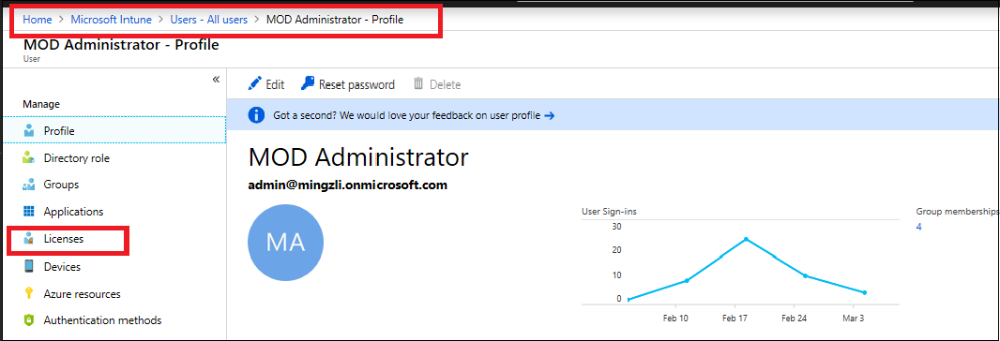

2. Verify that auto-enrollment is activated for those users who are going to enroll the devices into Intune. For additional details, see [Azure AD and Microsoft Intune: Automatic MDM enrollment in the new Portal](https://docs.microsoft.com/en-us/windows/client-management/mdm/azure-ad-and-microsoft-intune-automatic-mdm-enrollment-in-the-new-portal). 
Also verify that the MAM User scope is set to **None**. Otherwise, it will have precedence over the MDM scope that will lead to issues. 

    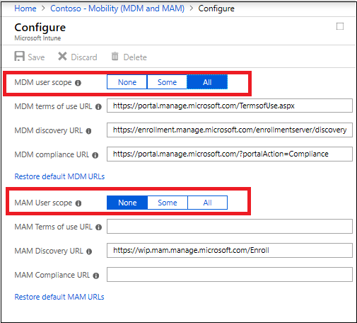

3. Verify that the device OS version is Windows 10, version 1709 or later.
4. Auto-enrollment into Intune via Group Policy is valid only for devices which are hybrid Azure AD joined. This means that the device must be joined into both local Active Directory and Azure Active Directory. To verify that the device is  hybrid Azure AD joined, run  `dsregcmd /status` from the command line.

    You can confirm that the device is properly hybrid-joined if both **AzureAdJoined** and **DomainJoined** are set to **YES**.

    

    Additionally, verify that the SSO State section displays **AzureAdPrt** as **YES**.

    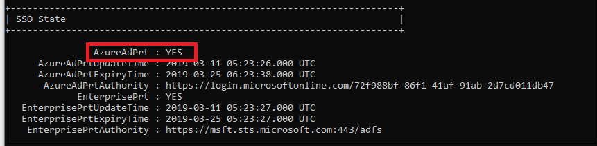

    This information can also be found on the Azure AD device list.

    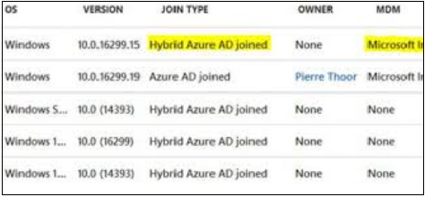

5. Verify that the MDM discovery URL during auto-enrollment is https://enrollment.manage.microsoft.com/enrollmentserver/discovery.

    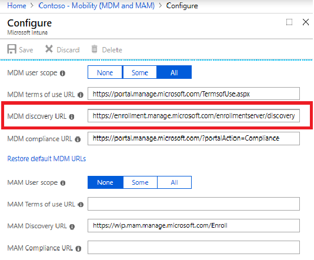

6. Some tenants might have both **Microsoft Intune** and **Microsoft Intune Enrollment** under **Mobility**. Make sure that your auto-enrollment settings are configured under **Microsoft Intune** instead of **Microsoft Intune Enrollment**.

    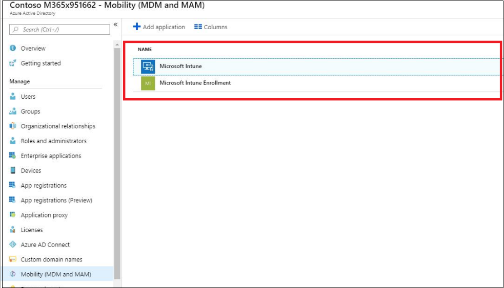

7. Verify that the *Enable automatic MDM enrollment using default Azure AD credentials* group policy (Local Group Policy Editor > Computer Configuration > Policies > Administrative Templates > Windows Components > MDM) is properly deployed to all devices which should be enrolled into Intune. 
You may contact your domain administrators to verify if the group policy has been deployed successfully.

8. Verify that the device is not enrolled with the old Intune client used on the Intune Silverlight Portal (this is the Intune portal used before the Azure portal).
9. Verify that Azure AD allows the logon user to enroll devices.
    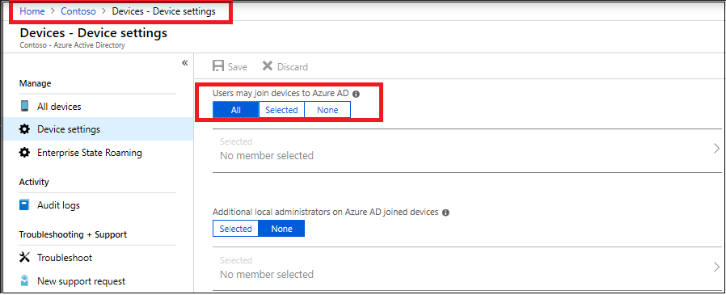
10. Verify that Microsoft Intune should allow enrollment of Windows devices.
    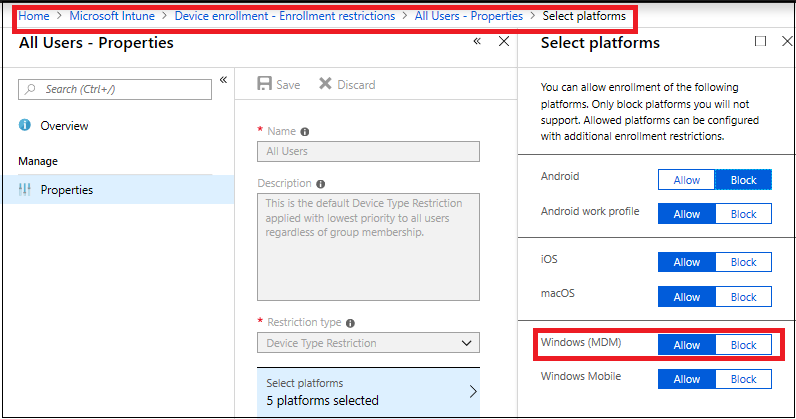

## Configure the auto-enrollment Group Policy for a single PC

This procedure is only for illustration purposes to show how the new auto-enrollment policy works. It is not recommended for the production environment in the enterprise. For bulk deployment, you should use the [Group Policy Management Console process](#configure-the-auto-enrollment-for-a-group-of-devices).

Requirements:
- AD-joined PC running Windows 10, version 1709
- Enterprise has MDM service already configured 
- Enterprise AD must be registered with Azure AD

1. Run GPEdit.msc

    Click Start, then in the text box type gpedit. 

    

2. Under **Best match**, click **Edit group policy** to launch it.

3.  In **Local Computer Policy**, click **Administrative Templates** > **Windows Components** > **MDM**.

    

4. Double-click **Auto MDM Enrollment with AAD Token**.

    

5. Click **Enable**, then click **OK**.

     A task is created and scheduled to run every 5 minutes for the duration of 1 day. The task is called " Schedule created by enrollment client for automatically enrolling in MDM from AAD." 

     To see the scheduled task, launch the [Task Scheduler app](#task-scheduler-app).

     If two-factor authentication is required, you will be prompted to complete the process. Here is an example screenshot.

     

6. To verify successful enrollment to MDM , click **Start > Settings > Accounts > Access work or school**, then select your domain account.

7. Click **Info** to see the MDM enrollment information.

    

    If you do not see the **Info** button or the enrollment information, it is possible that the enrollment failed. Check the status in [Task Scheduler app](#task-scheduler-app).

### Task Scheduler app

1. Click **Start**, then in the text box type **task scheduler**.

   

2. Under **Best match**, click **Task Scheduler** to launch it.

3. In **Task Scheduler Library**, open **Microsoft > Windows** , then click **EnterpriseMgmt**. 

    

    To see the result of the task, move the scroll bar to the right to see the **Last Run Result**. Note that **0x80180026** is a failure message (MENROLL\_E_DEVICE\_MANAGEMENT_BLOCKED). You can see the logs in the **History** tab. 

    If the device enrollment is blocked, your IT admin may have enabled the **Disable MDM Enrollment** policy. Note that the GPEdit console does not reflect the status of policies set by your IT admin on your device. It is only used by the user to set policies.

## Configure the auto-enrollment for a group of devices

Requirements:
- AD-joined PC running Windows 10, version 1709
- Enterprise has MDM service already configured (with Intune or a third party service provider)
- Enterprise AD must be integrated with Azure AD.
- Ensure that PCs belong to same computer group.

>[!IMPORTANT]
>If you do not see the policy, it may be because you don’t have the ADMX installed for Windows 10, version 1803 or version 1809. To fix the issue, follow these steps:        
>   1. Download:  
>   1803 -->[Administrative Templates (.admx) for Windows 10 April 2018 Update (1803)](https://www.microsoft.com/en-us/download/details.aspx?id=56880) or  
>   1809 --> [Administrative Templates for Windows 10 October 2018 Update (1809)](https://www.microsoft.com/en-us/download/details.aspx?id=57576).
>   2. Install the package on the Primary Domain Controller (PDC).
>   3. Navigate, depending on the version to the folder:
>   1803 --> **C:\Program Files (x86)\Microsoft Group Policy\Windows 10 April 2018 Update (1803) v2**, or  
>   1809 --> **C:\Program Files (x86)\Microsoft Group Policy\Windows 10 October 2018 Update (1809) v2**
>   4. Copy policy definitions folder to **C:\Windows\SYSVOL\domain\Policies**.
>   5. Restart the Primary Domain Controller for the policy to be available.
>   This procedure will work for any future version as well.

1. Create a Group Policy Object (GPO) and enable the Group Policy **Computer Configuration** > **Policies** > **Administrative Templates** > **Windows Components** > **MDM** > **Enable automatic MDM enrollment using default Azure AD credentials**.
2. Create a Security Group for the PCs.
3. Link the GPO.
4. Filter using Security Groups.
5. Enforce a GPO link.

> [!NOTE]
> Version 1903 (March 2019) is actually on the Insider program and doesn't yet contain a downloadable version of Templates (version 1903).

## Troubleshoot auto-enrollment of devices
Investigate the log file if you have issues even after performing all the mandatory verification steps. The first log file to investigate is the event log on the target Windows 10 device. 

To collect Event Viewer logs:

1. Open Event Viewer.
2. Navigate to Applications and Services Logs > Microsoft > Windows > DeviceManagement-Enterprise-Diagnostic-Provider > Admin.

    > [!Tip]
    > For guidance on how to collect event logs for Intune, see [Collect MDM Event Viewer Log YouTube video](https://www.youtube.com/watch?v=U_oCe2RmQEc).

3. Search for event ID 75, which represents a successful auto-enrollment. Here is an example screenshot that shows the auto-enrollment completed successfully:
    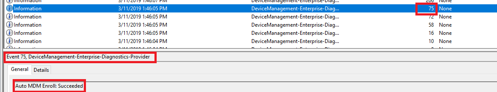

    If you cannot find event ID 75 in the logs, it indicates that the auto-enrollment failed. This can happen because of the following reasons:
    - The enrollment failed with error. In this case, search for event ID 76, which represents failed auto-enrollment. Here is an example screenshot that shows that the auto-enrollment failed:
    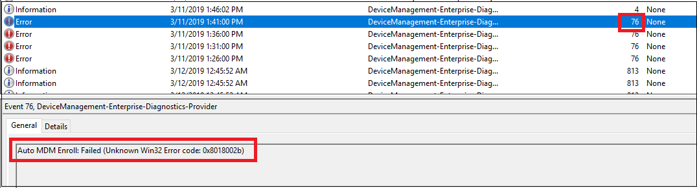
    To troubleshoot, check the error code that appears in the event. See [Troubleshooting Windows device enrollment problems in Microsoft Intune](https://support.microsoft.com/en-ph/help/4469913/troubleshooting-windows-device-enrollment-problems-in-microsoft-intune) for more information.
    - The auto-enrollment did not trigger at all. In this case, you will not find event ID 75 and event ID 76. To know why, you must understand the internal mechanisms happening on the device:

    The auto-enrollment process is triggered by a task (Microsoft > Windows > EnterpriseMgmt) within the task-scheduler. This task appears if the *Enable automatic MDM enrollment using default Azure AD credentials* group policy (Computer Configuration > Policies > Administrative Templates > Windows Components > MDM) is successfully deployed to the target machine as shown in the following screenshot:
    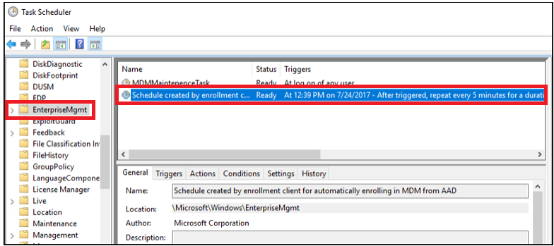

    This task runs every 5 minutes for the duration of 1 day. To confirm if the task succeeded, check the task scheduler event logs:
    Applications and Services Logs > Microsoft > Windows > Task Scheduler > Operational.
    Look for an entry where the task scheduler created by enrollment client for automatically enrolling in MDM from AAD is triggered by event ID 107.

    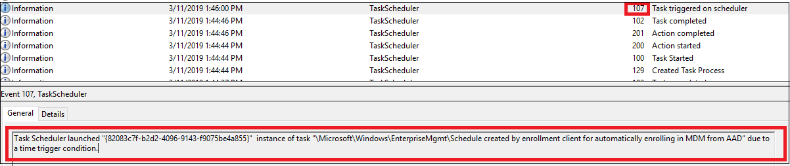

    When the task is completed, a new event ID 102 is logged.
    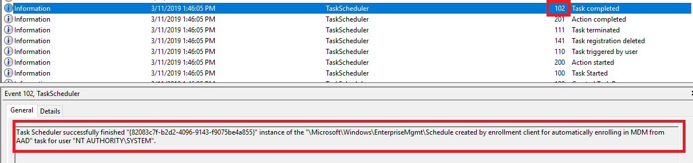

    Note that the task scheduler log displays event ID 102 (task completed) regardless of the auto-enrollment success or failure. This means that the task scheduler log is only useful to confirm if the auto-enrollment task is triggered or not. It does not indicate the success or failure of auto-enrollment.

    If you cannot see from the log that task Schedule created by enrollment client for automatically enrolling in MDM from AAD is initiated, there is possibly issue with the group policy. Immediately run the command `gpupdate /force` in command prompt to get the GPO applied. If this still does not help, further troubleshooting on the Active Directory is required. 
    One frequently seen error is related to some outdated enrollment entries in the registry on the target client device (HKLM > Software > Microsoft > Enrollments). If a device has been enrolled (can be any MDM solution and not only Intune), some enrollment information added into the registry is seen:

    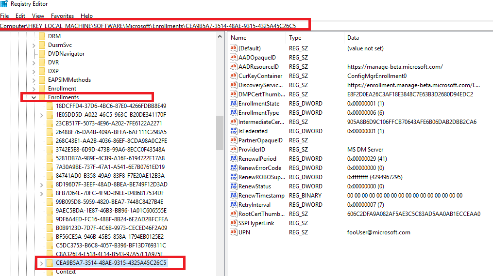

    By default, these entries are removed when the device is un-enrolled, but occasionally the registry key remains even after un-enrollment. In this case, `gpupdate /force` fails to initiate the auto-enrollment task and error code 2149056522 is displayed in the Applications and Services Logs > Microsoft > Windows > Task Scheduler > Operational event log file under event ID 7016. 
    A resolution to this issue is to remove the registry key manually. If you do not know which registry key to remove, go for the key which displays most entries as the screenshot above. All other keys will display less entries as in below screenshot:

    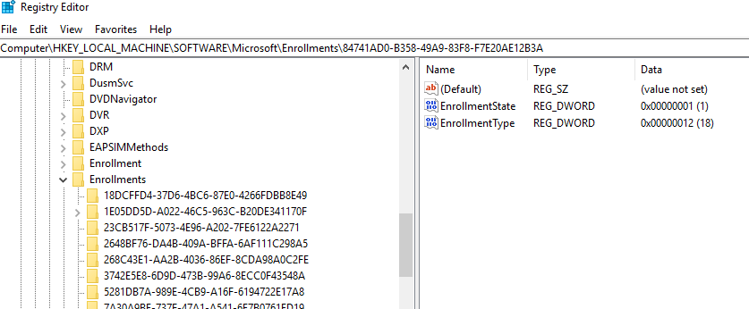

### Related topics

- [Group Policy Management Console](https://technet.microsoft.com/library/cc753298(v=ws.11).aspx)
- [Create and Edit a Group Policy Object](https://technet.microsoft.com/library/cc754740(v=ws.11).aspx)
- [Link a Group Policy Object](https://technet.microsoft.com/library/cc732979(v=ws.11).aspx)
- [Filter Using Security Groups](https://technet.microsoft.com/library/cc752992(v=ws.11).aspx)
- [Enforce a Group Policy Object Link](https://technet.microsoft.com/library/cc753909(v=ws.11).aspx)

### Useful Links

- [Windows 10 Administrative Templates for Windows 10 October 2018 Update 1809](https://www.microsoft.com/download/details.aspx?id=57576)
- [Windows 10 Administrative Templates for Windows 10 April 2018 Update 1803](https://www.microsoft.com/download/details.aspx?id=56880)
