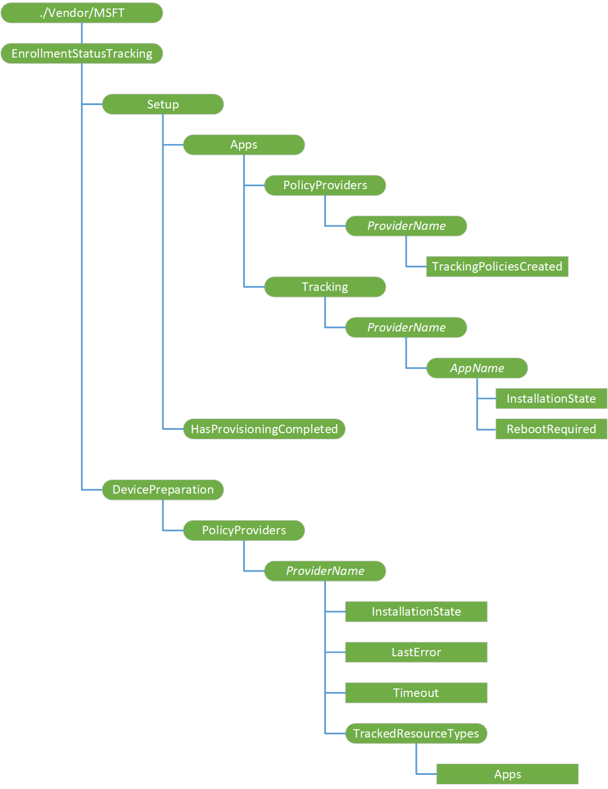

# EnrollmentStatusTracking CSP

During Autopilot deployment, you can configure the Enrollment Status Page (ESP) to block the device use until the required apps are installed. You can select the apps that must be installed before using the device. The EnrollmentStatusTracking configuration service provider (CSP) is used by Intune's agents, such as SideCar to configure ESP for blocking the device use until the required Win32 apps are installed. It tracks the installation status of the required policy providers and the apps they install and sends it to ESP, which displays the installation progress message to the user. For more information on ESP, see [Windows Autopilot Enrollment Status page](https://docs.microsoft.com/windows/deployment/windows-autopilot/enrollment-status).

ESP uses the EnrollmentStatusTracking CSP along with the DMClient CSP to track the installation of different apps. The EnrollmentStatusTracking CSP tracks Win32 apps installations and DMClient CSP tracks MSI and Universal Windows Platform apps installations. In DMClient CSP, the **FirstSyncStatus/ExpectedMSIAppPackages** and **FirstSyncStatus/ExpectedModernAppPackages** nodes list the apps to track their installation. See [DMClient CSP](dmclient-csp.md) for more information.

The EnrollmentStatusTracking CSP was added in Windows 10, version 1903.

The following diagram shows the EnrollmentStatusTracking CSP in tree format.

**./Vendor/MSFT**  
For device context, use **./Device/Vendor/MSFT** path and for user context, use **./User/Vendor/MSFT** path.

**EnrollmentStatusTracking**  
Required. Root node for the CSP. This node is supported in both user context and device context.  
Provides the settings to communicate what policies the ESP must block on. Using these settings, policy providers register themselves and the set of policies that must be tracked. The ESP includes the counts of these policy settings in the status message that is displayed to the user. It also blocks ESP until all the policies are provisioned. The policy provider is expected to drive the status updates by updating the appropriate node values, which are then reflected in the ESP status message.

Scope is permanent. Supported operation is Get.

**EnrollmentStatusTracking/DevicePreparation**  
Required. This node is supported only in device context.  
Specifies the settings that ESP reads during the device preparation phase. These settings are used to orchestrate any setup activities prior to provisioning the device in the device setup phase of the ESP.

Scope is permanent. Supported operation is Get.

**EnrollmentStatusTracking/DevicePreparation/PolicyProviders**  
Required. This node is supported only in device context.  
Indicates to the ESP that it should wait in the device preparation phase until all the policy providers have their InstallationState node set as 2 (NotRequired) or 3 (Completed).

Scope is permanent. Supported operation is Get.

**EnrollmentStatusTracking/DevicePreparation/PolicyProviders/_ProviderName_**  
Optional. This node is supported only in device context.  
Represents a policy provider for the ESP. The node should be given a unique name for the policy provider. Registration of a policy provider indicates to ESP that it should block in the device preparation phase until the provider sets its InstallationState node to 2 (NotRequired) or 3 (Completed). Once all the registered policy providers are marked as Completed or NotRequired, the ESP progresses to the device setup phase.

Scope is dynamic. Supported operations are Get, Add, Delete, and Replace.

**EnrollmentStatusTracking/DevicePreparation/PolicyProviders/*ProviderName*/InstallationState**  
Required. This node is supported only in device context.  
Communicates the policy provider installation state back to ESP.

Scope is dynamic. Supported operations are Get, Add, Delete, and Replace.

Value type is integer. Expected values are as follows:
- 1 — NotInstalled
- 2 — NotRequired
- 3 — Completed
- 4 — Error

**EnrollmentStatusTracking/DevicePreparation/PolicyProviders/*ProviderName*/LastError**  
Required. This node is supported only in device context.  
Represents the last error code during the application installation process. If a policy provider fails to install, it can optionally set an HRESULT error code that the ESP can display in an error message to the user. ESP reads this node only when the provider's InstallationState node is set to 4 (Error). This node must be set only by the policy provider, and not by the MDM server.

Scope is dynamic. Supported operations are Get, Add, Delete, and Replace.

Value type is integer.

**EnrollmentStatusTracking/DevicePreparation/PolicyProviders/*ProviderName*/Timeout**  
Optional. This node is supported only in device context.  
Represents the amount of time, in minutes, that the provider installation process can run before the ESP shows an error. Provider installation is complete when the InstallationState node is set to 2 (NotRequired) or 3 (Completed).  If no timeout value is specified, ESP selects the default timeout value of 15 minutes.

Scope is dynamic. Supported operations are Get, Add, Delete, and Replace.

Value type is integer. The default is 15 minutes.

**EnrollmentStatusTracking/DevicePreparation/PolicyProviders/*ProviderName*/TrackedResourceTypes**  
Required. This node is supported only in device context.  
This node's children register which resource types the policy provider supports for provisioning. Only registered providers for a particular resource type will have their policies incorporated with ESP tracking message.

Scope is dynamic. Supported operations are Get, Add, Delete, and Replace.

**EnrollmentStatusTracking/DevicePreparation/PolicyProviders/*ProviderName*/TrackedResourceTypes/Apps**  
Required. This node is supported only in device context.  
This node specifies if the policy provider is registered for app provisioning.

Scope is dynamic. Supported operations are Get, Add, Delete, and Replace.

Value type is boolean. Expected values are as follows:
- false — Indicates that the policy provider is not registered for app provisioning. This is the default.
- true — Indicates that the policy provider is registered for app provisioning.

**EnrollmentStatusTracking/Setup**  
Required. This node is supported in both user context and device context.  
Provides the settings that ESP reads during the account setup phase in the user context and device setup phase in the device context. Policy providers use this node to communicate progress status back to the ESP, which is then displayed to the user through progress messages.

Scope is permanent. Supported operation is Get.

**EnrollmentStatusTracking/Setup/Apps**  
Required. This node is supported in both user context and device context.  
Provides the settings to communicate to the ESP which app installations it should block on and provide progress in the status message to the user.

Scope is permanent. Supported operation is Get.

**EnrollmentStatusTracking/Setup/Apps/PolicyProviders**  
Required. This node is supported in both user context and device context.  
Specifies the app policy providers for this CSP. These are the policy providers the ESP should wait on before showing the tracking message with the status to the user.

Scope is permanent. Supported operation is Get.

**EnrollmentStatusTracking/Setup/Apps/PolicyProviders**/***ProviderName***  
Optional. This node is supported in both user context and device context.  
Represents an app policy provider for the ESP. Existence of this node indicates to the ESP that it should not show the tracking status message until the TrackingPoliciesCreated node has been set to true.

Scope is dynamic. Supported operations are Get, Add, Delete, and Replace.

**EnrollmentStatusTracking/Setup/Apps/PolicyProviders/*ProviderName*/TrackingPoliciesCreated**  
Required. This node is supported in both user context and device context.  
Indicates if the provider has created the required policies for the ESP to use for tracking app installation progress. The policy provider itself is expected to set the value of this node, not the MDM server.

Scope is dynamic. Supported operations are Get, Add, Delete, and Replace.

Value type is boolean. The expected values are as follows:
- true — Indicates that the provider has created the required policies.
- false — Indicates that the provider has not created the required policies. This is the default.

**EnrollmentStatusTracking/Setup/Apps/Tracking**  
Required. This node is supported in both user context and device context.  
Root node for the app installations being tracked by the ESP.

Scope is permanent. Supported operation is Get.

**EnrollmentStatusTracking/Setup/Apps/Tracking/_ProviderName_**  
Optional. This node is supported in both user context and device context.  
Indicates the provider name responsible for installing the apps and providing status back to ESP.

Scope is dynamic. Supported operations are Get, Add, Delete, and Replace.

**EnrollmentStatusTracking/Setup/Apps/Tracking/*ProviderName*/_AppName_**  
Optional. This node is supported in both user context and device context.  
Represents a unique name for the app whose progress should be tracked by the ESP. The policy provider can define any arbitrary app name as ESP does not use the app name directly.

Scope is dynamic. Supported operations are Get, Add, Delete, and Replace.

**EnrollmentStatusTracking/Setup/Apps/Tracking/*ProviderName*/*AppName*/InstallationState**  
Optional. This node is supported in both user context and device context.  
Represents the installation state for the app. The policy providers (not the MDM server) must update this node for the ESP to track the installation progress and update the status message.

Scope is dynamic. Supported operations are Get, Add, Delete, and Replace.

Value type is integer. Expected values are as follows:
- 1 — NotInstalled
- 2 — InProgress
- 3 — Completed
- 4 — Error

**EnrollmentStatusTracking/Setup/Apps/Tracking/*ProviderName*/*AppName*/RebootRequired**  
Optional. This node is supported in both user context and device context.  
Indicates if the app installation requires ESP to issue a reboot. The policy providers installing the app (not the MDM server) must set this node. If the policy providers do not set this node, the ESP will not reboot the device for the app installation.

Scope is dynamic. Supported operations are Get, Add, Delete, and Replace.

Value type is integer. Expected values are as follows:
- 1 — NotRequired
- 2 — SoftReboot
- 3 — HardReboot

**EnrollmentStatusTracking/Setup/HasProvisioningCompleted**  
Required. This node is supported in both user context and device context.  
ESP sets this node when it completes. Providers can query this node to determine if the ESP is showing, which allows them to determine if they still need to provide status updates for the ESP through this CSP.

Scope is permanent. Supported operation is Get.

Value type is boolean. Expected values are as follows:
- true — Indicates that ESP has completed. This is the default.
- false — Indicates that ESP is displayed, and provisioning is still going.