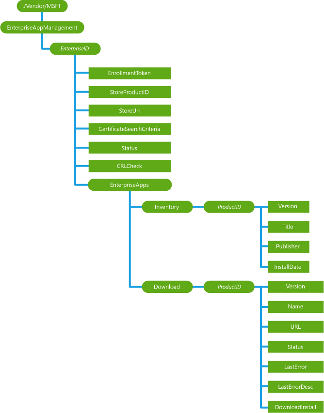

# EnterpriseAppManagement CSP


The EnterpriseAppManagement enterprise configuration service provider is used to handle enterprise application management tasks such as installing an enterprise application token, the first auto-downloadable app link, querying installed enterprise applications (name and version), auto updating already installed enterprise applications, and removing all installed enterprise apps (including the enterprise app token) during unenrollment.

> **Note**   The EnterpriseAppManagement CSP is only supported in Windows 10 Mobile.

 

The following diagram shows the EnterpriseAppManagement configuration service provider in tree format.



<a href="" id="enterpriseid"></a>***EnterpriseID***
Optional. A dynamic node that represents the EnterpriseID as a GUID. It is used to enroll or unenroll enterprise applications.

Supported operations are Add, Delete, and Get.

<a href="" id="enterpriseid-enrollmenttoken"></a>***EnterpriseID*/EnrollmentToken**
Required. Used to install or update the binary representation of the application enrollment token (AET) and initiate "phone home" token validation. Scope is dynamic.

Supported operations are Get, Add, and Replace.

<a href="" id="enterpriseid-storeproductid"></a>***EnterpriseID*/StoreProductID**
Required. The node to host the ProductId node. Scope is dynamic.

Supported operation is Get.

<a href="" id="-storeproductid-productid"></a>**/StoreProductID/ProductId**
The character string that contains the ID of the first enterprise application (usually a Company Hub app), which is automatically installed on the device. Scope is dynamic.

Supported operations are Get and Add.

<a href="" id="enterpriseid-storeuri"></a>***EnterpriseID*/StoreUri**
Optional. The character string that contains the URI of the first enterprise application to be installed on the device. The enrollment client downloads and installs the application from this URI. Scope is dynamic.

Supported operations are Get and Add.

<a href="" id="enterpriseid-certificatesearchcriteria"></a>***EnterpriseID*/CertificateSearchCriteria**
Optional. The character string that contains the search criteria to search for the DM-enrolled client certificate. The certificate is used for client authentication during enterprise application download. The company's application content server should use the enterprise-enrolled client certificate to authenticate the device. The value must be a URL encoded representation of the X.500 distinguished name of the client certificates Subject property. The X.500 name must conform to the format required by the [CertStrToName](https://go.microsoft.com/fwlink/p/?LinkId=523869) function. This search parameter is case sensitive. Scope is dynamic.

Supported operations are Get and Add.

> **Note**   Do NOT use Subject=CN%3DB1C43CD0-1624-5FBB-8E54-34CF17DFD3A1\\x00. The server must replace this value in the supplied client certificate. If your server returns a client certificate containing the same Subject value, this can cause unexpected behavior. The server should always override the subject value and not use the default device-provided Device ID Subject= Subject=CN%3DB1C43CD0-1624-5FBB-8E54-34CF17DFD3A1\\x00

 

<a href="" id="enterpriseid-status"></a>***EnterpriseID*/Status**
Required. The integer value that indicates the current status of the application enrollment. Valid values are 0 (ENABLED), 1 (INSTALL\_DISABLED), 2 (REVOKED), and 3 (INVALID). Scope is dynamic.

Supported operation is Get.

<a href="" id="enterpriseid-crlcheck"></a>***EnterpriseID*/CRLCheck**
Optional. Character value that specifies whether the device should do a CRL check when using a certificate to authenticate the server. Valid values are "1" (CRL check required), "0" (CRL check not required). Scope is dynamic.

Supported operations are Get, Add, and Replace.

<a href="" id="enterpriseid-enterpriseapps"></a>***EnterpriseID*/EnterpriseApps**
Required. The root node to for individual enterprise application related settings. Scope is dynamic (this node is automatically created when EnterpriseID is added to the configuration service provider).

Supported operation is Get.

<a href="" id="-enterpriseapps-inventory"></a>**/EnterpriseApps/Inventory**
Required. The root node for individual enterprise application inventory settings. Scope is dynamic (this node is automatically created when EnterpriseID is added to the configuration service provider).

Supported operation is Get.

<a href="" id="-inventory-productid"></a>**/Inventory/**<strong>*ProductID*</strong>
Optional. A node that contains s single enterprise application product ID in GUID format. Scope is dynamic.

Supported operation is Get.

<a href="" id="-inventory-productid-version"></a>**/Inventory/*ProductID*/Version**
Required. The character string that contains the current version of the installed enterprise application. Scope is dynamic.

Supported operation is Get.

<a href="" id="-inventory-productid-title"></a>**/Inventory/*ProductID*/Title**
Required. The character string that contains the name of the installed enterprise application. Scope is dynamic.

Supported operation is Get.

<a href="" id="-inventory-productid-publisher"></a>**/Inventory/*ProductID*/Publisher**
Required. The character string that contains the name of the publisher of the installed enterprise application. Scope is dynamic.

Supported operation is Get.

<a href="" id="-inventory-productid-installdate"></a>**/Inventory/*ProductID*/InstallDate**
Required. The time (in the character format YYYY-MM-DD-HH:MM:SS) that the application was installed or updated. Scope is dynamic.

Supported operation is Get.

<a href="" id="-enterpriseapps-download"></a>**/EnterpriseApps/Download**
Required. This node groups application download-related parameters. The enterprise server can only automatically update currently installed enterprise applications. The end user controls which enterprise applications to download and install. Scope is dynamic.

Supported operation is Get.

<a href="" id="-download-productid"></a>**/Download/**<strong>*ProductID*</strong>
Optional. This node contains the GUID for the installed enterprise application. Each installed application has a unique ID. Scope is dynamic.

Supported operations are Get, Add, and Replace.

<a href="" id="-download-productid-version"></a>**/Download/*ProductID*/Version**
Optional. The character string that contains version information (set by the caller) for the application currently being downloaded. Scope is dynamic.

Supported operations are Get, Add, and Replace.

<a href="" id="-download-productid-name"></a>**/Download/*ProductID*/Name**
Required. The character string that contains the name of the installed application. Scope is dynamic.

Supported operation is Get.

<a href="" id="-download-productid-url"></a>**/Download/*ProductID*/URL**
Optional. The character string that contains the URL for the updated version of the installed application. The device will download application updates from this link. Scope is dynamic.

Supported operations are Get, Add, and Replace.

<a href="" id="-download-productid-status"></a>**/Download/*ProductID*/Status**
Required. The integer value that indicates the status of the current download process. The following table shows the possible values.

<table>
<colgroup>
<col width="50%" />
<col width="50%" />
</colgroup>
<tbody>
<tr class="odd">
<td><p>0: CONFIRM</p></td>
<td><p>Waiting for confirmation from user.</p></td>
</tr>
<tr class="even">
<td><p>1: QUEUED</p></td>
<td><p>Waiting for download to start.</p></td>
</tr>
<tr class="odd">
<td><p>2: DOWNLOADING</p></td>
<td><p>In the process of downloading.</p></td>
</tr>
<tr class="even">
<td><p>3: DOWNLOADED</p></td>
<td><p>Waiting for installation to start.</p></td>
</tr>
<tr class="odd">
<td><p>4: INSTALLING</p></td>
<td><p>Handed off for installation.</p></td>
</tr>
<tr class="even">
<td><p>5: INSTALLED</p></td>
<td><p>Successfully installed</p></td>
</tr>
<tr class="odd">
<td><p>6: FAILED</p></td>
<td><p>Application was rejected (not signed properly, bad XAP format, not enrolled properly, etc.)</p></td>
</tr>
<tr class="even">
<td><p>7:DOWNLOAD_FAILED</p></td>
<td><p>Unable to connect to server, file doesn&#39;t exist, etc.</p></td>
</tr>
</tbody>
</table>

 

Scope is dynamic. Supported operations are Get, Add, and Replace.

<a href="" id="-download-productid-lasterror"></a>**/Download/*ProductID*/LastError**
Required. The integer value that indicates the HRESULT of the last error code. If there are no errors, the value is 0 (S\_OK). Scope is dynamic.

Supported operation is Get.

<a href="" id="-download-productid-lasterrordesc"></a>**/Download/*ProductID*/LastErrorDesc**
Required. The character string that contains the human readable description of the last error code.

<a href="" id="-download-productid-downloadinstall"></a>**/Download/*ProductID*/DownloadInstall**
Required. The node to allow the server to trigger the download and installation for an updated version of the user installed application. The format for this node is null. The server must query the device later to determine the status. For each product ID, the status field is retained for up to one week. Scope is dynamic.

Supported operation is Exec.

## Remarks


### Install and Update Line of Business (LOB) applications

A workplace can automatically install and update Line of Business applications during a management session. Line of Business applications support a variety of file types including XAP (8.0 and 8.1), AppX, and AppXBundles. A workplace can also update applications from XAP file formats to Appx and AppxBundle formats through the same channel. For more information, see the Examples section.

### Uninstall Line of Business (LOB) applications

A workplace can also remotely uninstall Line of Business applications on the device. It is not possible to use this mechanism to uninstall Store applications on the device or Line of Business applications that are not installed by the enrolled workplace (for side-loaded application scenarios). For more information, see the Examples section

### Query installed Store application

You can determine if a Store application is installed on a system. First, you need the Store application GUID. You can get the Store application GUID by going to the URL for the Store application.

The Microsoft Store application has a GUID of d5dc1ebb-a7f1-df11-9264-00237de2db9e.

Use the following SyncML format to query to see if the application is installed on a managed device:

```xml
<Get>
      <CmdID>1</CmdID>
      <Item>
        <Target>
          <LocURI>./Vendor/MSFT/EnterpriseAppManagement/4000000001/EnterpriseApps/Inventory/%7B D5DC1EBB-A7F1-DF11-9264-00237DE2DB9E%7D</LocURI>
        </Target>
      </Item>
    </Get>
```

Response from the device (it contains list of subnodes if this app is installed in the device).

```xml
<Results>
   <CmdID>3</CmdID>
   <MsgRef>1</MsgRef>
   <CmdRef>2</CmdRef>
   <Item>
      <Source>
          <LocURI>
             ./Vendor/MSFT/EnterpriseAppManagement/4000000001/EnterpriseApps/Inventory/%7B D5DC1EBB-A7F1-DF11-9264-00237DE2DB9E%7D</LocURI>
      </Source>
      <Meta>
         <Format xmlns="syncml:metinf">node</Format>
         <Type xmlns="syncml:metinf"></Type>
      </Meta>
<Data>Version/Title/Publisher/InstallDate</Data>
   </Item>
</Results>
```

### Node Values

All node values under the ProviderID interior node represent the policy values that the management server wants to set.

-   An Add or Replace command on those nodes returns success in both of the following cases:

    -   The value is actually applied to the device.

    -   The value isn’t applied to the device because the device has a more secure value set already.

From a security perspective, the device complies with the policy request that is at least as secure as the one requested.

-   A Get command on those nodes returns the value that the server pushes down to the device.

-   If a Replace command fails, the node value is set to be the previous value before Replace command was applied.

-   If an Add command fails, the node is not created.

The value actually applied to the device can be queried via the nodes under the DeviceValue interior node.

## OMA DM examples


Enroll enterprise ID “4000000001” for the first time:

```xml
<Add>
   <CmdID>2</CmdID>
   <Item>
      <Target>
         <LocURI>./Vendor/MSFT/EnterpriseAppManagement/4000000001/EnrollmentToken</LocURI>
      </Target>
      <Meta>
         <Format xmlns="syncml:metinf">chr</Format>
      </Meta>
      <Data>InsertTokenHere</Data>
   </Item>
   <Item>
      <Target>
         <LocURI>./Vendor/MSFT/EnterpriseAppManagement/4000000001/CertificateSearchCriteria
         </LocURI>
      </Target>
      <Meta>
         <Format xmlns="syncml:metinf">chr</Format>
      </Meta>
      <Data>SearchCriteriaInsertedHere</Data>
   </Item>
</Add>
```

Update the enrollment token (for example, to update an expired application enrollment token):

```xml
<Replace>
   <CmdID>2</CmdID>
   <Item>
      <Target>
         <LocURI>./Vendor/MSFT/EnterpriseAppManagement/4000000001/EnrollmentToken</LocURI>
      </Target>
      <Meta>
         <Format xmlns="syncml:metinf">chr</Format>
      </Meta>
      <Data>InsertUpdaedTokenHere</Data>
   </Item>
</Replace>
```

Query all installed applications that belong to enterprise id “4000000001”:

```xml
<Get>
   <CmdID>2</CmdID>
   <Item>
      <Target>
          <LocURI>
    ./Vendor/MSFT/EnterpriseAppManagement/4000000001/EnterpriseApps/Inventory?list=StructData
          </LocURI>
      </Target>
   </Item>
</Get>
```

Response from the device (that contains two installed applications):

```xml
<Results>
   <CmdID>3</CmdID>
   <MsgRef>1</MsgRef>
   <CmdRef>2</CmdRef>
   <Item>
      <Source>
          <LocURI>
             ./Vendor/MSFT/EnterpriseAppManagement/4000000001/EnterpriseApps/Inventory
          </LocURI>
      </Source>
      <Meta>
         <Format xmlns="syncml:metinf">node</Format>
         <Type xmlns="syncml:metinf"></Type>
      </Meta>
   </Item>
   <Item>
      <Source>
         <LocURI>
./Vendor/MSFT/EnterpriseAppManagement/4000000001/EnterpriseApps/Inventory/%7BB316008A-141D-4A79-810F-8B764C4CFDFB%7D
         </LocURI>
      </Source>
      <Meta>
         <Format xmlns="syncml:metinf">node</Format>
         <Type xmlns="syncml:metinf"></Type>
      </Meta>
   </Item>
   <Item>
      <Source>
         <LocURI>
./Vendor/MSFT/EnterpriseAppManagement/4000000001/EnterpriseApps/Inventory/%7BB0322158-C3C2-44EB-8A31-D14A9FEC450E%7D
         </LocURI>
      </Source>
      <Meta>
         <Format xmlns="syncml:metinf">node</Format>
         <Type xmlns="syncml:metinf"></Type>
      </Meta>
   </Item>
   <Item>
      <Source>
         <LocURI>
./Vendor/MSFT/EnterpriseAppManagement/4000000001/EnterpriseApps/Inventory/%7BB0322158-C3C2-44EB-8A31-D14A9FEC450E%7D/Version
         </LocURI>
      </Source>
      <Data>1.0.0.0</Data>
   </Item>
   <Item>
      <Source>
         <LocURI>
./Vendor/MSFT/EnterpriseAppManagement/4000000001/EnterpriseApps/Inventory/%7BB0322158-C3C2-44EB-8A31-D14A9FEC450E%7D/Title
         </LocURI>
      </Source>
      <Data>Sample1</Data>
   </Item>
   <Item>
      <Source>
         <LocURI>
./Vendor/MSFT/EnterpriseAppManagement/4000000001/EnterpriseApps/Inventory/%7BB0322158-C3C2-44EB-8A31-D14A9FEC450E%7D/Publisher
         </LocURI>
      </Source>
      <Data>ExamplePublisher</Data>
   </Item>
   <Item>
      <Source>
         <LocURI>
./Vendor/MSFT/EnterpriseAppManagement/4000000001/EnterpriseApps/Inventory/%7BB0322158-C3C2-44EB-8A31-D14A9FEC450E%7D/InstallDate
         </LocURI>
      </Source>
      <Data>2012-10-30T21:09:52Z</Data>
   </Item>
   <Item>
      <Source>
         <LocURI>
./Vendor/MSFT/EnterpriseAppManagement/4000000001/EnterpriseApps/Inventory/%7BB0322158-C3C2-44EB-8A31-D14A9FEC450E%7D/Version
         </LocURI>
      </Source>
      <Data>1.0.0.0</Data>
   </Item>
   <Item>
      <Source>
         <LocURI>
./Vendor/MSFT/EnterpriseAppManagement/4000000001/EnterpriseApps/Inventory/%7BB0322158-C3C2-44EB-8A31-D14A9FEC450E%7D/Title
         </LocURI>
      </Source>
      <Data>Sample2</Data>
   </Item>
   <Item>
      <Source>
         <LocURI>
./Vendor/MSFT/EnterpriseAppManagement/4000000001/EnterpriseApps/Inventory/%7BB0322158-C3C2-44EB-8A31-D14A9FEC450E%7D/Publisher
         </LocURI>
      </Source>
      <Data>Contoso</Data>
   </Item>
   <Item>
      <Source>
         <LocURI>
./Vendor/MSFT/EnterpriseAppManagement/4000000001/EnterpriseApps/Inventory/%7BB0322158-C3C2-44EB-8A31-D14A9FEC450E%7D/InstallDate
         </LocURI>
      </Source>
      <Data>2012-10-31T21:23:31Z</Data>
   </Item>
</Results>
```

## Install and update an enterprise application


Install or update the installed app with the product ID “{B316008A-141D-4A79-810F-8B764C4CFDFB}”.

To perform an XAP update, create the Name, URL, Version, and DownloadInstall nodes first, then perform an “execute” on the “DownloadInstall” node (all within an “Atomic” operation). If the application does not exist, the application will be silently installed without any user interaction. If the application cannot be installed, the user will be notified with an Alert dialog.

> **Note**  
> 1.  If a previous app-update node existed for this product ID (the node can persist for up to 1 week or 7 days after an installation has completed), then a 418 (already exist) error would be returned on the “Add”. To get around the 418 error, the server should issue a Replace command for the Name, URL, and Version nodes, and then execute on the “DownloadInstall” (within an “Atomic” operation).

2. The application product ID curly braces need to be escaped where { is %7B and } is %7D.

 

```xml
<Atomic>
   <CmdID>2</CmdID>
   <!-- The Add command can be used if the download node does not have a matching product ID
        node in it or if the application was installer 7 or more days old. Otherwise, use the Replace command. -->
   <Add>
      <CmdID>3</CmdID>
      <Item>
         <Target>
            <LocURI>
./Vendor/MSFT/EnterpriseAppManagement/4000000001/EnterpriseApps/Download/%7BB316008A-141D-4A79-810F-8B764C4CFDFB%7D/Name
            </LocURI>
         </Target>
         <Meta>
            <Format xmlns="syncml:metinf">chr</Format>
         </Meta>
         <Data>ContosoApp1</Data>
      </Item>
      <Item>
         <Target>
            <LocURI>
./Vendor/MSFT/EnterpriseAppManagement/4000000001/EnterpriseApps/Download/%7BB316008A-141D-4A79-810F-8B764C4CFDFB%7D/URL
            </LocURI>
         </Target>
         <Meta>
            <Format xmlns="syncml:metinf">chr</Format>
         </Meta>
         <Data>http://contoso.com/enterpriseapps/ContosoApp1.xap</Data>
      </Item>
      <Item>
         <Target>
            <LocURI>
./Vendor/MSFT/EnterpriseAppManagement/4000000001/EnterpriseApps/Download/%7BB316008A-141D-4A79-810F-8B764C4CFDFB%7D/Version</LocURI>
         </Target>
         <Meta>
            <Format xmlns="syncml:metinf">chr</Format>
         </Meta>
         <Data>2.0.0.0</Data>
      </Item>
      <Item>
         <Target>
            <LocURI>
./Vendor/MSFT/EnterpriseAppManagement/4000000001/EnterpriseApps/Download%7BB316008A-141D-4A79-810F-8B764C4CFDFB%7D/DownloadInstall
            </LocURI>
         </Target>
         <Data>1</Data>
      </Item>
   </Add>
   <Exec>
      <CmdID>4</CmdID>
      <Item>
         <Target>
            <LocURI>
./Vendor/MSFT/EnterpriseAppManagement/4000000001/EnterpriseApps/Download/%7BB316008A-141D-4A79-810F-8B764C4CFDFB%7D/DownloadInstall
            </LocURI>
         </Target>
         <Meta>
            <Format xmlns="syncml:metinf">int</Format>
         </Meta>
         <Data>0</Data>
      </Item>
   </Exec>
</Atomic>
```

## Uninstall enterprise application


Uninstall an installed enterprise application with product ID “{7BB316008A-141D-4A79-810F-8B764C4CFDFB }”:

```xml
<SyncML xmlns="SYNCML:SYNCML1.2">
  <SyncBody>
    <Delete>
      <CmdID>2</CmdID>
      <Item>
        <Target>
          <LocURI>./Vendor/MSFT/EnterpriseAppManagement/4000000001/EnterpriseApps/Inventory/%7BB316008A-141D-4A79-810F-8B764C4CFDFB%7D</LocURI>
        </Target>
      </Item>
    </Delete>
    <Final/>
  </SyncBody>
</SyncML>
```

## Related topics


[Configuration service provider reference](configuration-service-provider-reference.md)

 

 


