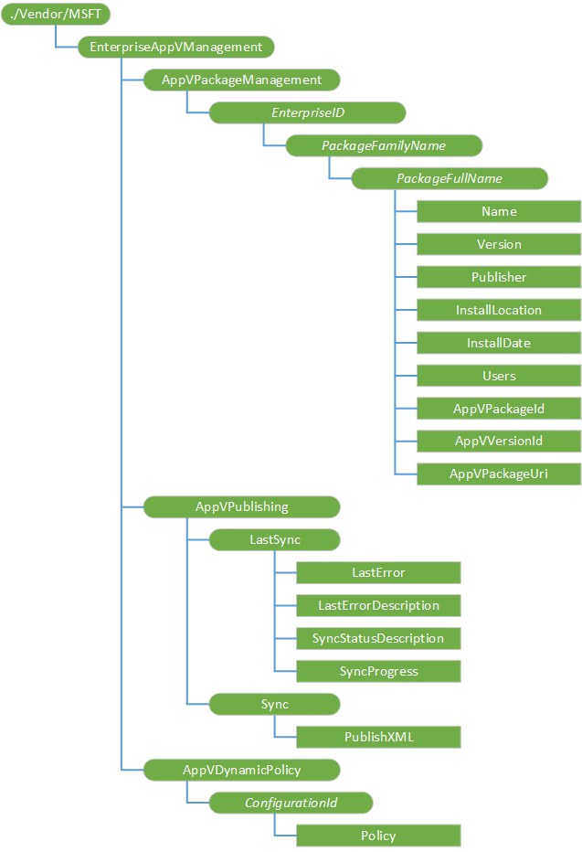

# EnterpriseAppVManagement CSP

The EnterpriseAppVManagement configuration service provider (CSP) is used to manage virtual applications in Windows 10 PCs (Enterprise and Education editions). This CSP was added in Windows 10, version 1703.

The following diagram shows the EnterpriseAppVManagement configuration service provider in tree format.

**./Vendor/MSFT/EnterpriseAppVManagement**  

Root node for the EnterpriseAppVManagement configuration service provider.

**AppVPackageManagement**  

Used to query App-V package information (post-publish).
 

**AppVPackageManagement/EnterpriseID**  

Used to query package information. Value is always "HostedInstall".

**AppVPackageManagement/EnterpriseID/PackageFamilyName**  

Package ID of the published App-V package.

**AppVPackageManagement/_EnterpriseID_/_PackageFamilyName_/_PackageFullName_**  

Version ID of the published App-V package.

**AppVPackageManagement/_EnterpriseID_/_PackageFamilyName_/_PackageFullName_/Name**  

Name specified in the published AppV package.

Value type is string. Supported operation is Get.

**AppVPackageManagement/_EnterpriseID_/_PackageFamilyName_/_PackageFullName_/Version**  

Version specified in the published AppV package.

Value type is string. Supported operation is Get.

**AppVPackageManagement/_EnterpriseID_/_PackageFamilyName_/_PackageFullName_/Publisher**  

Publisher as specified in the published asset information of the AppV package.

Value type is string. Supported operation is Get.

**AppVPackageManagement/_EnterpriseID_/_PackageFamilyName_/_PackageFullName_/InstallLocation**  

Local package path specified in the published asset information of the AppV package.

Value type is string. Supported operation is Get.

**AppVPackageManagement/_EnterpriseID_/_PackageFamilyName_/_PackageFullName_/InstallDate**  

Date the app was installed, as specified in the published asset information of the AppV package.

Value type is string. Supported operation is Get.

**AppVPackageManagement/_EnterpriseID_/_PackageFamilyName_/_PackageFullName_/Users**  

Registered users for app, as specified in the published asset information of the AppV package.

Value type is string. Supported operation is Get.

**AppVPackageManagement/_EnterpriseID_/_PackageFamilyName_/_PackageFullName_/AppVPackageId**  

   Package ID of the published App-V package.

Value type is string. Supported operation is Get.

**AppVPackageManagement/_EnterpriseID_/_PackageFamilyName_/_PackageFullName_/AppVVersionId**  

Version ID of the published App-V package.

Value type is string. Supported operation is Get.

**AppVPackageManagement/_EnterpriseID_/_PackageFamilyName_/_PackageFullName_/AppVPackageUri**  

Package URI of the published App-V package.

Value type is string. Supported operation is Get.

**AppVPublishing**  

Used to monitor publishing operations on App-V.

**AppVPublishing/LastSync**  

Used to monitor publishing status of last sync operation.

**AppVPublishing/LastSync/LastError**  

Error code and error description of last sync operation.

Value type is string. Supported operation is Get.

**AppVPublishing/LastSync/LastErrorDescription**  

Last sync error status. One of the following values may be returned:

- SYNC\_ERR_NONE (0) - No errors during publish.
- SYNC\_ERR\_UNPUBLISH_GROUPS (1) - Unpublish groups failed during publish.
- SYNC\_ERR\_PUBLISH\_NONGROUP_PACKAGES (2) - Publish no-group packages failed during publish.
- SYNC\_ERR\_PUBLISH\_GROUP_PACKAGES (3) - Publish group packages failed during publish.
- SYNC\_ERR\_UNPUBLISH_PACKAGES (4) - Unpublish packages failed during publish.
- SYNC\_ERR\_NEW_POLICY_WRITE (5) - New policy write failed during publish.
- SYNC\_ERR\_MULTIPLE\_DURING_PUBLISH (6) - Multiple non-fatal errors occured during publish.

Value type is string. Supported operation is Get.

**AppVPublishing/LastSync/SyncStatusDescription**  

Latest sync in-progress stage. One of the following values may be returned:

- SYNC\_PROGRESS_IDLE (0) - App-V publishing is idle.
- SYNC\_PROGRESS\_UNPUBLISH_GROUPS (1) - App-V connection groups publish in progress.
- SYN\_PROGRESS\_PUBLISH\_NONGROUP_PACKAGES (2) - App-V packages (non connection group) publish in progress.
- SYNC\_PROGRESS\_PUBLISH\_GROUP_PACKAGES (3) - App-V packages (connection group) publish in progress.
- SYN\C_PROGRESS_UNPUBLISH_PACKAGES (4) - App-V packages unpublish in progress.

Value type is string. Supported operation is Get.

                
**AppVPublishing/LastSync/SyncProgress**  

Latest sync state. One of the following values may be returned:

- SYNC\_STATUS_IDLE (0) - App-V Sync is idle.
- SYNC\_STATUS\_PUBLISH_STARTED (1) - App-V Sync is initializing.
- SYNC\_STATUS\_PUBLISH\_IN_PROGRESS (2) - App-V Sync is in progress.
- SYNC\_STATUS\_PUBLISH\_COMPLETED (3) - App-V Sync is complete.
- SYNC\_STATUS\_PUBLISH\_REBOOT_REQUIRED (4) - App-V Sync requires device reboot.

Value type is string. Supported operation is Get.

**AppVPublishing/Sync**  

Used to perform App-V synchronization.

**AppVPublishing/Sync/PublishXML**  

Used to execute the App-V synchronization using the Publishing protocol. For more information about the protocol see [[MS-VAPR]: Virtual Application Publishing and Reporting (App-V) Protocol](https://msdn.microsoft.com/library/mt739986.aspx).

Supported operations are Get, Delete, and Execute.

**AppVDynamicPolicy**  

Used to set App-V Policy Configuration documents for publishing packages.

**AppVDynamicPolicy/_ConfigurationId_**  

ID for App-V Policy Configuration document for publishing packages (referenced in the Publishing protocol document).

**AppVDynamicPolicy/_ConfigurationId_/Policy**  

XML for App-V Policy Configuration documents for publishing packages.

Value type is xml. Supported operations are Add, Get, Delete, and Replace.

