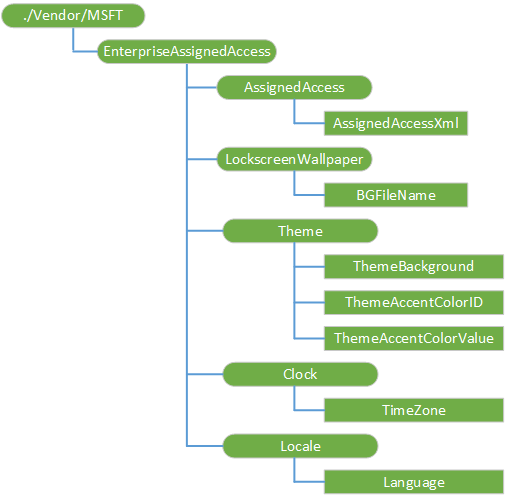
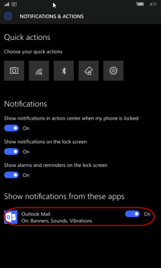

# EnterpriseAssignedAccess CSP


The EnterpriseAssignedAccess configuration service provider allows IT administrators to configure settings, such as language and themes, lock down a device, and configure custom layouts on a device. For example, the administrator can lock down a device so that only applications specified in an Allow list are available. Apps not on the Allow list remain installed on the device, but are hidden from view and blocked from launching.

> **Note**   The EnterpriseAssignedAccess CSP is only supported in Windows 10 Mobile.


To use an app to create a lockdown XML see [Use the Lockdown Designer app to create a Lockdown XML file](https://docs.microsoft.com/windows/configuration/mobile-devices/mobile-lockdown-designer). For more information about how to interact with the lockdown XML at runtime, see [**DeviceLockdownProfile class**](https://msdn.microsoft.com/library/windows/hardware/mt186983).

The following diagram shows the EnterpriseAssignedAccess configuration service provider in tree format as used by both the Open Mobile Alliance (OMA) Device Management (DM) and OMA Client Provisioning.



The following list shows the characteristics and parameters.

<a href="" id="-vendor-msft-enterpriseassignedaccess-"></a>**./Vendor/MSFT/EnterpriseAssignedAccess/**
The root node for the EnterpriseAssignedAccess configuration service provider. Supported operations are Add, Delete, Get and Replace.

<a href="" id="assignedaccess-"></a>**AssignedAccess/**
The parent node of assigned access XML.

<a href="" id="assignedaccess-assignedaccessxml"></a>**AssignedAccess/AssignedAccessXml**
The XML code that controls the assigned access settings that will be applied to the device.

Supported operations are Add, Delete, Get and Replace.

The Apps and Settings sections of lockdown XML constitute an Allow list. Any app or setting that is not specified in AssignedAccessXML will not be available on the device to users. The following table describes the entries in lockdown XML.

> [!IMPORTANT]
> When using the AssignedAccessXml in the EnterpriseAssignedAccess CSP through an MDM, the XML must use escaped characters, such as \< instead of < because it is embedded in an XML. The examples provided in the topic are formatted for readability.

When using the AssignedAccessXml in a provisioning package using the Windows Configuration Designer tool, do not use escaped characters.

Entry | Description
----------- | ------------
ActionCenter | You can enable or disable the Action Center (formerly known as Notification Center) on the device. Set to true to enable the Action Center, or set to false to disable the Action Center.
ActionCenter | Example: `<ActionCenter enabled="true"></ActionCenter>`
ActionCenter | In Windows 10, when the Action Center is disabled, Above Lock notifications and toasts are also disabled. When the Action Center is enabled, the following policies are also enabled;  **AboveLock/AllowActionCenterNotifications** and **AboveLock/AllowToasts**. For more information about these policies, see [Policy CSP](policy-configuration-service-provider.md)
ActionCenter | You can also add the following optional attributes to the ActionCenter element to override the default behavior: **aboveLockToastEnabled** and **actionCenterNotificationEnabled**. Valid values are 0 (policy disabled), 1 (policy enabled), and -1 (not set, policy enabled). In this example, the Action Center is enabled and both policies are disabled.: `<ActionCenter enabled="true" aboveLockToastEnabled="0" actionCenterNotificationEnabled="0"/>`
ActionCenter | These optional attributes are independent of each other. In this example, Action Center is enabled, the notifications policy is disabled, and the toast policy is enabled by default because it is not set. `<ActionCenter enabled="true" actionCenterNotificationEnabled="0"/>`
StartScreenSize | Specify the size of the Start screen. In addition to 4/6 columns, you can also use 4/6/8 depending on screen resolutions. Valid values: **Small** - sets the width to 4 columns on device with short axis <400epx or 6 columns on devices with short axis >=400epx. **Large** - sets the width to 6 columns on devices with short axis <400epx or 8 columns on devices with short axis >=400epx.
StartScreenSize | If you have existing lockdown XML, you must update it if your device has >=400epx on its short axis so that tiles on Start can fill all 8 columns if you want to use all 8 columns instead of 6, or use 6 columns instead of 4. Example: `<StartScreenSize>Large</StartScreenSize>`
Application | Provide the product ID for each app that will be available on the device. You can find the product ID for a locally developed app in the AppManifest.xml file of the app. For the list of product ID and AUMID see [ProductIDs in Windows 10 Mobile](#productid).
Application | To turn on the notification for a Windows app, you must include the application's AUMID in the lockdown XML. However, the user can change the setting at any time from user interface. Example: `<Application productId="{A558FEBA-85D7-4665-B5D8-A2FF9C19799B}" aumid="microsoft.windowscommunicationsapps_8wekyb3d8bbwe!microsoft.windowslive.mail"/>`
Application | 
Application | Include PinToStart to display an app on the Start screen. For apps pinned to the Start screen, identify a tile size (small, medium, or large), and a location. The size of a small tile is 1 column x 1 row, a medium tile is 2 x 2, and a large tile is 4 x 2. For the tile location, the first value indicates the column and the second value indicates the row. A value of 0 (zero) indicates the first column, a value of 1 indicates the second column, and so on. Include autoRun as an attribute to configure the application to run automatically.

Application example:
``` syntax
<Application productId="{2A4E62D8-8809-4787-89F8-69D0F01654FB}" autoRun="true">
   <PinToStart>
      <Size>Large</Size>
      <Location>
         <LocationX>0</LocationX>
         <LocationY>2</LocationY>
      </Location>
   </PinToStart>
</Application>
```

Entry | Description
----------- | ------------
Application | Multiple App Packages enable multiple apps to exist inside the same package. Since ProductIds identify packages and not applications, specifying a ProductId is not enough to distinguish between individual apps inside a multiple app package. Trying to include application from a multiple app package with just a ProductId can result in unexpected behavior. To support pinning applications in multiple app packages, use an AUMID parameter in lockdown XML. For the list of product ID and AUMID, see [ProductIDs in Windows 10 Mobile](#productid). The following example shows how to pin both Outlook mail and Outlook calendar.

Application example:
``` syntax
<Apps>
    <!-- Outlook Calendar -->
    <Application productId="{A558FEBA-85D7-4665-B5D8-A2FF9C19799B}"
aumid="microsoft.windowscommunicationsapps_8wekyb3d8bbwe!microsoft.windowslive.calendar">
        <PinToStart>
            <Size>Large</Size>
            <Location>
                <LocationX>1</LocationX>
                <LocationY>4</LocationY>
            </Location>
        </PinToStart>
    </Application>
    <!-- Outlook Mail-->
    <Application productId="{A558FEBA-85D7-4665-B5D8-A2FF9C19799B}"
aumid="microsoft.windowscommunicationsapps_8wekyb3d8bbwe!microsoft.windowslive.mail">
        <PinToStart>
            <Size>Large</Size>
            <Location>
                <LocationX>1</LocationX>
                <LocationY>6</LocationY>
            </Location>
        </PinToStart>
    </Application>
</Apps>
```

Entry | Description
----------- | ------------
Folder | A folder should be contained in `<Applications/>` node among with other `<Application/>` nodes, it shares most grammar with the Application Node, **folderId** is mandatory, **folderName** is optional, which is the folder name displayed on Start. **folderId** is a unique unsigned integer for each folder.

Folder example:
``` syntax
<Application folderId="4" folderName="foldername">
    <PinToStart>
        <Size>Large</Size>
        <Location>
            <LocationX>0</LocationX>
            <LocationY>2</LocationY>
        </Location>
    </PinToStart>
</Application>
```
An application that belongs in the folder would add an optional attribute **ParentFolderId**, which maps to **folderId** of the folder. In this case, the location of this application will be located inside the folder.

``` syntax
<Application productId="{2A4E62D8-8809-4787-89F8-69D0F01654FB}">
    <PinToStart>
        <Size>Medium</Size>
        <Location>
            <LocationX>0</LocationX>
            <LocationY>0</LocationY>
        </Location>
        <ParentFolderId>2</ParentFolderId>
    </PinToStart>
</Application>
```

Entry | Description
----------- | ------------
Settings | Starting in Windows 10, version 1511, you can specify the following settings pages in the lockdown XML file. For Windows 10, version 1703, see the instructions below for the new way to specify the settings pages.

<ul>
<li>System (main menu) - SettingsPageGroupPCSystem
<ul>
<li>Display - SettingsPageDisplay</li>
<li>Notifications &amp; actions - SettingsPageAppsNotifications</li>
<li>Phone - SettingsPageCalls</li>
<li>Messaging - SettingsPageMessaging</li>
<li>Battery saver - SettingsPageBatterySaver</li>
<li>Storage - SettingsPageStorageSenseStorageOverview</li>
<li>Driving mode - SettingsPageDrivingMode</li>
<li>Offline maps - SettingsPageMaps</li>
<li>About - SettingsPagePCSystemInfo</li>
<li>Apps for websites - SettingsPageAppsForWebsites</li>
</ul></li>
<li>Devices (main menu) - SettingsPageGroupDevices
<ul>
<li>Default camera - SettingsPagePhotos</li>
<li>Bluetooth - SettingsPagePCSystemBluetooth</li>
<li>NFC - SettingsPagePhoneNFC</li>
<li>Mouse - SettingsPageMouseTouchpad</li>
<li>USB - SettingsPageUsb</li>
</ul></li>
<li>Network and wireless (main menu) - SettingsPageGroupNetwork
<ul>
<li>Cellular and SIM - SettingsPageNetworkCellular</li>
<li>Wi-Fi - SettingsPageNetworkWiFi</li>
<li>Airplane mode - SettingsPageNetworkAirplaneMode</li>
<li>Data usage - SettingsPageDataSenseOverview</li>
<li>Mobile hotspot - SettingsPageNetworkMobileHotspot</li>
<li>VPN - SettingsPageNetworkVPN</li>
<li></li>
</ul></li>
<li>Personalization (main menu) - SettingsPageGroupPersonalization
<ul>
<li>Start - SettingsPageBackGround</li>
<li>Colors - SettingsPageColors</li>
<li>Sounds - SettingsPageSounds</li>
<li>Lock screen - SettingsPageLockscreen</li>
<li>Glance - SettingsPageGlance</li>
<li>Navigation bar - SettingsNavigationBar</li>
</ul></li>
<li>Accounts (main menu) - SettingsPageGroupAccounts
<ul>
<li>Your account - SettingsPageAccountsPicture</li>
<li>Sign-in options - SettingsPageAccountsSignInOptions</li>
<li>Work access - SettingsPageWorkAccess</li>
<li>Sync your settings - SettingsPageAccountsSync</li>
<li>Apps corner* - SettingsPageAppsCorner</li>
<li>Email - SettingsPageAccountsEmailApp</li>
</ul></li>
<li>Time and language (main menu) - SettingsPageGroupTimeRegion
<ul>
<li>Date and time - SettingsPageTimeRegionDateTime</li>
<li>Language - SettingsPageTimeLanguage</li>
<li>Region - SettingsPageRegion</li>
<li>Keyboard - SettingsPageKeyboard</li>
<li>Speech - SettingsPageSpeech</li>
</ul></li>
<li>Ease of access (main menu) - SettingsPageGroupEaseOfAccess
<ul>
<li>Narrator - SettingsPageEaseOfAccessNarrator</li>
<li>Magnifier - SettingsPageEaseOfAccessMagnifier</li>
<li>High contrast - SettingsPageEaseOfAccessHighContrast</li>
<li>Closed captions - SettingsPageEaseOfAccessClosedCaptioning</li>
<li>More options - SettingsPageEaseOfAccessMoreOptions</li>
</ul></li>
<li>Privacy (main menu) - SettingsPageGroupPrivacy
<ul>
<li>Location - SettingsPagePrivacyLocation</li>
<li>Camera - SettingsPagePrivacyWebcam</li>
<li>Microphone - SettingsPagePrivacyMicrophone</li>
<li>Motion - SettingsPagePrivacyMotionData</li>
<li>Speech inking and typing - SettingsPagePrivacyPersonalization</li>
<li>Account info - SettingsPagePrivacyAccountInfo</li>
<li>Contacts - SettingsPagePrivacyContacts</li>
<li>Calendar - SettingsPagePrivacyCalendar</li>
<li>Messaging - SettingsPagePrivacyMessaging</li>
<li>Radios - SettingsPagePrivacyRadios</li>
<li>Background apps - SettingsPagePrivacyBackgroundApps</li>
<li>Accessory apps - SettingsPageAccessories</li>
<li>Advertising ID - SettingsPagePrivacyAdvertisingId</li>
<li>Other devices - SettingsPagePrivacyCustomPeripherals</li>
<li>Feedback &amp; diagnostics - SettingsPagePrivacySIUFSettings</li>
<li>Call history - SettingsPagePrivacyCallHistory</li>
<li>Email - SettingsPagePrivacyEmail</li>
<li>Phone call - SettingsPagePrivacyPhoneCall</li>
<li>Notifications - SettingsPagePrivacyNotifications</li>
<li>CDP - SettingsPagePrivacyCDP</li>
</ul></li>
<li>Update and Security (main menu) - SettingsPageGroupRestore
<ul>
<li>Phone update - SettingsPageRestoreMusUpdate</li>
<li>Backup - SettingsPageRestoreOneBackup</li>
<li>Find my phone - SettingsPageFindMyDevice</li>
<li>For developers - SettingsPageSystemDeveloperOptions</li>
<li>Windows Insider Program - SettingsPageFlights</li>
<li>Device encryption - SettingsPageGroupPCSystemDeviceEncryption</li>
</ul></li>
<li>OEM (main menu) - SettingsPageGroupExtensibility
<ul>
<li>Extensibility - SettingsPageExtensibility</li>
</ul></li>
</ul>

Entry | Description
----------- | ------------
Settings | Starting in Windows 10, version 1703, you can specify the settings pages using the settings URI.

For example, in place of SettingPageDisplay, you would use ms-settings:display. See [ms-settings: URI scheme reference](https://docs.microsoft.com/windows/uwp/launch-resume/launch-settings-app#ms-settings-uri-scheme-reference) to find the URI for each settings page.

Here is an example for Windows 10, version 1703.

``` syntax
<Settings>
  <System name="ms-settings:display"/>
  <System name="ms-settings:appsforwebsites"/>
  <System name="ms-settings:about"/>
  <System name="ms-settings:camera"/>
  <System name="ms-settings:nfctransactions"/>
  <System name="ms-settings:mousetouchpad"/>
  <System name="ms-settings:usb"/>
</Settings>
```

**Quick action settings**

Starting in Windows 10, version 1511, you can specify the following quick action settings in the lockdown XML file. The following list shows the quick action settings and settings page dependencies (group and page).

> [!NOTE]
> Only Windows 10, versions 1511 and 1607, the dependent settings group and pages are automatically added when the quick action item is specified in the lockdown XML. In Windows 10, version 1703, Quick action settings no longer require any dependencies from related group or page.

<ul>
<li><p>SystemSettings_System_Display_QuickAction_Brightness</p>
<p>Dependencies - SettingsPageSystemDisplay, SettingsPageDisplay</p></li>
<li><p>SystemSettings_System_Display_Internal_Rotation</p>
<p>Dependencies - SettingsPageSystemDisplay, SettingsPageDisplay</p></li>
<li><p>SystemSettings_QuickAction_WiFi</p>
<p>Dependencies - SettingsPageGroupNetwork, SettingsPageNetworkWiFi</p></li>
<li><p>SystemSettings_QuickAction_InternetSharing</p>
<p>Dependencies - SettingsPageGroupNetwork, SettingsPageInternetSharing</p></li>
<li><p>SystemSettings_QuickAction_CellularData</p>
<p>Dependencies - SettingsPageGroupNetwork, SettingsPageNetworkCellular</p></li>
<li><p>SystemSettings_QuickAction_AirplaneMode</p>
<p>Dependencies - SettingsPageGroupNetwork, SettingsPageNetworkAirplaneMode</p></li>
<li><p>SystemSettings_Privacy_LocationEnabledUserPhone</p>
<p>Dependencies - SettingsGroupPrivacyLocationGlobals, SettingsPagePrivacyLocation</p></li>
<li><p>SystemSettings_Network_VPN_QuickAction</p>
<p>Dependencies - SettingsPageGroupNetwork, SettingsPageNetworkVPN</p></li>
<li><p>SystemSettings_Launcher_QuickNote</p>
<p>Dependencies - none</p></li>
<li><p>SystemSettings_Flashlight_Toggle</p>
<p>Dependencies - none</p></li>
<li><p>SystemSettings_Device_BluetoothQuickAction</p>
<p>Dependencies - SettingsPageGroupDevices, SettingsPagePCSystemBluetooth</p></li>
<li><p>SystemSettings_BatterySaver_LandingPage_OverrideControl</p>
<p>Dependencies - BatterySaver_LandingPage_SettingsConfiguration, SettingsPageBatterySaver</p></li>
<li><p>QuickActions_Launcher_DeviceDiscovery</p>
<p>Dependencies - none</p></li>
<li><p>QuickActions_Launcher_AllSettings</p>
<p>Dependencies - none</p></li>
<li><p>SystemSettings_QuickAction_QuietHours</p>
<p>Dependencies - none</p></li>
<li><p>SystemSettings_QuickAction_Camera</p>
<p>Dependencies - none</p></li>
</ul>

Starting in Windows 10, version 1703, Quick action settings no longer require any dependencis from related group or page. Here is the list:
- QuickActions_Launcher_AllSettings
- QuickActions_Launcher_DeviceDiscovery
- SystemSettings_BatterySaver_LandingPage_OverrideControl
- SystemSettings_Device_BluetoothQuickAction
- SystemSettings_Flashlight_Toggle
- SystemSettings_Launcher_QuickNote
- SystemSettings_Network_VPN_QuickAction
- SystemSettings_Privacy_LocationEnabledUserPhone
- SystemSettings_QuickAction_AirplaneMode
- SystemSettings_QuickAction_Camera
- SystemSettings_QuickAction_CellularData
- SystemSettings_QuickAction_InternetSharing
- SystemSettings_QuickAction_QuietHours
- SystemSettings_QuickAction_WiFi
- SystemSettings_System_Display_Internal_Rotation
- SystemSettings_System_Display_QuickAction_Brightness


In this example, all settings pages and quick action settings are allowed. An empty \<Settings> node indicates that none of the settings are blocked.

``` syntax
<Settings>
</Settings>
```

In this example for Windows 10, version 1511, all System setting pages are enabled. Note that the System page group is added as well as all of the System subpage names.

``` syntax
<Settings>
  <System name="SettingsPageGroupPCSystem" />
  <System name="SettingsPageDisplay" />
  <System name="SettingsPageAppsNotifications" />
  <System name="SettingsPageCalls" />
  <System name="SettingsPageMessaging" />
  <System name="SettingsPageBatterySaver" />
  <System name="SettingsPageStorageSenseStorageOverview" />
  <System name="SettingsPageGroupPCSystemDeviceEncryption" />
  <System name="SettingsPageDrivingMode" />
  <System name="SettingsPagePCSystemInfo" />
 </Settings>
```
Here is an example for Windows 10, version 1703.

``` syntax
<Settings>
  <System name="ms-settings:display"/>
  <System name="ms-settings:appsforwebsites"/>
  <System name="ms-settings:about"/>
  <System name="ms-settings:camera"/>
  <System name="ms-settings:nfctransactions"/>
  <System name="ms-settings:mousetouchpad"/>
  <System name="ms-settings:usb"/>
</Settings>
```

Entry | Description
----------- | ------------
Buttons | The following list identifies the hardware buttons on the device that you can lock down in <strong>ButtonLockdownList</strong>. When a user taps a button that is in the lockdown list, nothing will happen.

<ul>
<li><p>Start</p>
<li><p>Back</p></li>
<li><p>Search</p></li>
<li><p>Camera</p></li>
<li><p>Custom1</p></li>
<li><p>Custom2</p></li>
<li><p>Custom3</p></li>
</ul>

> [!NOTE]
> Lock down of the Start button only prevents the press and hold event.
>
> Custom buttons are hardware buttons that can be added to devices by OEMs.

Buttons example:
``` syntax
<Buttons>
   <ButtonLockdownList>
      <!-- Lockdown all buttons -->
         <Button name="Search">
         </Button>
         <Button name="Camera">
         </Button>
         <Button name="Custom1">
         </Button>
         <Button name="Custom2">
         </Button>
         <Button name="Custom3">
         </Button>
   </ButtonLockdownList>
```
The Search and custom buttons can be <em>remapped</em> or configured to open a specific application. Button remapping takes effect for the device and applies to all users.

> [!NOTE]
> The lockdown settings for a button, per user role, will apply regardless of the button mapping.
>
> Button remapping can enable a user to open an application that is not in the Allow list. Use button lock down to prevent application access for a user role.

To remap a button in lockdown XML, you supply the button name, the button event (typically "press"), and the product ID for the application the button will open.

``` syntax
<ButtonRemapList>
   <Button name="Search">
      <ButtonEvent name="Press">
         <!-- Alarms -->
         <Application productId="{08179793-ED2E-45EA-BA12-BDE3EE9C3CE3}" parameters="" />
          </ButtonEvent>
   </Button>
</ButtonRemapList>
```
**Disabling navigation buttons**
To disable navigation buttons (such as Home or Back) in lockdown XML, you supply the name (for example, Start) and button event (typically "press").

The following section contains a sample lockdown XML file that shows how to disable navigation buttons.

```xml
<?xml version="1.0" encoding="utf-8"?>
<HandheldLockdown version="1.0" >
    <Default>
        <ActionCenter enabled="false" />
        <Apps>
            <!-- Settings -->
            <Application productId="{2A4E62D8-8809-4787-89F8-69D0F01654FB}">
                <PinToStart>
                    <Size>Large</Size>
                    <Location>
                        <LocationX>0</LocationX>
                        <LocationY>0</LocationY>
                    </Location>
                </PinToStart>
            </Application>

            <!-- Phone Apps -->
            <Application productId="{F41B5D0E-EE94-4F47-9CFE-3D3934C5A2C7}">
                <PinToStart>
                    <Size>Small</Size>
                    <Location>
                        <LocationX>2</LocationX>
                        <LocationY>2</LocationY>
                    </Location>
                </PinToStart>
            </Application>
        </Apps>
        <Buttons>
            <ButtonLockdownList>
                <Button name="Start">
                    <ButtonEvent name="Press" />
                </Button>
                <Button name="Back">
                    <ButtonEvent name="Press" />
                    <ButtonEvent name="PressAndHold" />
                </Button>
                <Button name="Search">
                    <ButtonEvent name="All" />
                </Button>
                <Button name="Camera">
                    <ButtonEvent name="Press" />
                    <ButtonEvent name="PressAndHold" />
                </Button>
                <Button name="Custom1">
                    <ButtonEvent name="Press" />
                    <ButtonEvent name="PressAndHold" />
                </Button>
                <Button name="Custom2">
                    <ButtonEvent name="Press" />
                    <ButtonEvent name="PressAndHold" />
                </Button>
                <Button name="Custom3">
                    <ButtonEvent name="Press" />
                    <ButtonEvent name="PressAndHold" />
                </Button>
            </ButtonLockdownList>
            <ButtonRemapList />
        </Buttons>
        <MenuItems>
            <DisableMenuItems/>
        </MenuItems>
        <Settings>
        </Settings>
        <Tiles>
            <EnableTileManipulation/>
        </Tiles>
        <StartScreenSize>Small</StartScreenSize>
    </Default>
</HandheldLockdown>
```

Entry | Description
----------- | ------------
MenuItems | Use **DisableMenuItems** to prevent use of the context menu, which is displayed when a user presses and holds an application in the All Programs list. You can include this entry in the default profile and in any additional user role profiles that you create.

> [!IMPORTANT]
> If **DisableMenuItems** is not included in a profile, users of that profile can uninstall apps.

MenuItems example:

``` syntax
<MenuItems>
   <DisableMenuItems/>
</MenuItems>
```

Entry | Description
----------- | ------------
Tiles | **Turning-on tile manipulation** - By default, under Assigned Access, tile manipulation is turned off (blocked) and only available if enabled in the user’s profile. If tile manipulation is enabled in the user’s profile, they can pin/unpin, move, and resize tiles based on their preferences. When multiple people use one device and you want to enable tile manipulation for multiple users, you must enable it for each user in their user profile.

> [!IMPORTANT]
>  If a device is turned off then back on, the tiles reset to their predefined layout. If a device has only one profile, the only way to reset the tiles is to turn off then turn on the device. If a device has multiple profiles, the device resets the tiles to the predefined layout based on the logged-in user’s profile.

The following sample file contains configuration for enabling tile manipulation.

> [!NOTE]
> Tile manipulation is disabled when you don’t have a `<Tiles>` node in lockdown XML, or if you have a `<Tiles>` node but don’t have the `<EnableTileManipulation>` node.

```xml
<?xml version="1.0" encoding="utf-8"?>
<HandheldLockdown version="1.0" >
    <Default>
        <ActionCenter enabled="false" />
        <Apps>
            <!-- Settings -->
            <Application productId="{2A4E62D8-8809-4787-89F8-69D0F01654FB}">
                <PinToStart>
                    <Size>Large</Size>
                    <Location>
                        <LocationX>0</LocationX>
                        <LocationY>0</LocationY>
                    </Location>
                </PinToStart>
            </Application>

            <!-- Phone Apps -->
            <Application productId="{F41B5D0E-EE94-4F47-9CFE-3D3934C5A2C7}">
                <PinToStart>
                    <Size>Small</Size>
                    <Location>
                        <LocationX>2</LocationX>
                        <LocationY>2</LocationY>
                    </Location>
                </PinToStart>
            </Application>
        </Apps>
        <Buttons>
            <ButtonLockdownList>
                <Button name="Start">
                    <ButtonEvent name="Press" />
                </Button>
                <Button name="Back">
                    <ButtonEvent name="Press" />
                    <ButtonEvent name="PressAndHold" />
                </Button>
                <Button name="Search">
                    <ButtonEvent name="All" />
                </Button>
                <Button name="Camera">
                    <ButtonEvent name="Press" />
                    <ButtonEvent name="PressAndHold" />
                </Button>
                <Button name="Custom1">
                    <ButtonEvent name="Press" />
                    <ButtonEvent name="PressAndHold" />
                </Button>
                <Button name="Custom2">
                    <ButtonEvent name="Press" />
                    <ButtonEvent name="PressAndHold" />
                </Button>
                <Button name="Custom3">
                    <ButtonEvent name="Press" />
                    <ButtonEvent name="PressAndHold" />
                </Button>
            </ButtonLockdownList>
            <ButtonRemapList />
        </Buttons>
        <MenuItems>
            <DisableMenuItems/>
        </MenuItems>
        <Settings>
        </Settings>
        <Tiles>
            <EnableTileManipulation/>
        </Tiles>
        <StartScreenSize>Small</StartScreenSize>
    </Default>
</HandheldLockdown>
```

Entry | Description
----------- | ------------
CSP Runner | Allows CSPs to be executed on the device per user role. You can use this to implement role specific policies, such as changing the color scheme when an admin logs on the device, or to set configurations per role.
 

<a href="" id="lockscreenwallpaper-"></a>**LockscreenWallpaper/**
The parent node of the lock screen-related parameters that let administrators query and manage the lock screen image on devices. Supported operations are Add, Delete, Get and Replace.

<a href="" id="lockscreenwallpaper-bgfilename"></a>**LockscreenWallpaper/BGFileName**
The file name of the lock screen. The image file for the lock screen can be in .jpg or .png format and must not exceed 2 MB. The file name can also be in the Universal Naming Convention (UNC) format, in which case the device downloads it from the shared network and then sets it as the lock screen wallpaper.

Supported operations are Add, Get, and Replace.

<a href="" id="theme-"></a>**Theme/**
The parent node of theme-related parameters.

Supported operations are Add, Delete, Get and Replace.

<a href="" id="theme-themebackground"></a>**Theme/ThemeBackground**
Indicates whether the background color is light or dark. Set to **0** for light; set to **1** for dark.

Supported operations are Get and Replace.

<a href="" id="theme-themeaccentcolorid"></a>**Theme/ThemeAccentColorID**
The accent color to apply as the foreground color for tiles, controls, and other visual elements on the device. The following table shows the possible values.

<table>
<colgroup>
<col width="50%" />
<col width="50%" />
</colgroup>
<thead>
<tr class="header">
<th>Value</th>
<th>Description</th>
</tr>
</thead>
<tbody>
<tr class="odd">
<td><p><strong>0</strong></p></td>
<td><p>Lime</p></td>
</tr>
<tr class="even">
<td><p><strong>1</strong></p></td>
<td><p>Green</p></td>
</tr>
<tr class="odd">
<td><p><strong>2</strong></p></td>
<td><p>Emerald</p></td>
</tr>
<tr class="even">
<td><p><strong>3</strong></p></td>
<td><p>Teal (Viridian)</p></td>
</tr>
<tr class="odd">
<td><p><strong>4</strong></p></td>
<td><p>Cyan (Blue)</p></td>
</tr>
<tr class="even">
<td><p><strong>5</strong></p></td>
<td><p>Cobalt</p></td>
</tr>
<tr class="odd">
<td><p><strong>6</strong></p></td>
<td><p>Indigo</p></td>
</tr>
<tr class="even">
<td><p><strong>7</strong></p></td>
<td><p>Violet (Purple)</p></td>
</tr>
<tr class="odd">
<td><p><strong>8</strong></p></td>
<td><p>Pink</p></td>
</tr>
<tr class="even">
<td><p><strong>9</strong></p></td>
<td><p>Magenta</p></td>
</tr>
<tr class="odd">
<td><p><strong>10</strong></p></td>
<td><p>Crimson</p></td>
</tr>
<tr class="even">
<td><p><strong>11</strong></p></td>
<td><p>Red</p></td>
</tr>
<tr class="odd">
<td><p><strong>12</strong></p></td>
<td><p>Orange (Mango)</p></td>
</tr>
<tr class="even">
<td><p><strong>13</strong></p></td>
<td><p>Amber</p></td>
</tr>
<tr class="odd">
<td><p><strong>14</strong></p></td>
<td><p>Yellow</p></td>
</tr>
<tr class="even">
<td><p><strong>15</strong></p></td>
<td><p>Brown</p></td>
</tr>
<tr class="odd">
<td><p><strong>16</strong></p></td>
<td><p>Olive</p></td>
</tr>
<tr class="even">
<td><p><strong>17</strong></p></td>
<td><p>Steel</p></td>
</tr>
<tr class="odd">
<td><p><strong>18</strong></p></td>
<td><p>Mauve</p></td>
</tr>
<tr class="even">
<td><p><strong>19</strong></p></td>
<td><p>Sienna</p></td>
</tr>
<tr class="odd">
<td><p><strong>101</strong> through <strong>104</strong></p></td>
<td><p>Optional colors, as defined by the OEM</p></td>
</tr>
<tr class="even">
<td><p><strong>151</strong></p></td>
<td><p>Custom accent color for Enterprise</p></td>
</tr>
</tbody>
</table>

 

Supported operations are Get and Replace.

<a href="" id="theme-themeaccentcolorvalue"></a>**Theme/ThemeAccentColorValue**
A 6-character string for the accent color to apply to controls and other visual elements.

To use a custom accent color for Enterprise, enter **151** for *ThemeAccentColorID* before *ThemeAccentColorValue* in lockdown XML. *ThemeAccentColorValue* configures the custom accent color using hex values for red, green, and blue, in RRGGBB format. For example, enter FF0000 for red.

Supported operations are Get and Replace.

<a href="" id="persistdata"></a>**PersistData**
Not supported in Windows 10.

The parent node of whether to persist data that has been provisioned on the device.

<a href="" id="persistdata-persistprovisioneddata"></a>**PersistData/PersistProvisionedData**
Not supported in Windows 10. Use doWipePersistProvisionedData in [RemoteWipe CSP](remotewipe-csp.md) instead.

<a href="" id="clock-timezone-"></a>**Clock/TimeZone/**
An integer that specifies the time zone of the device. The following table shows the possible values.

Supported operations are Get and Replace.

<table>
<colgroup>
<col width="20%" />
<col width="80%" />
</colgroup>
<thead>
<tr class="header">
<th>Value</th>
<th>Time zone</th>
</tr>
</thead>
<tbody>
<tr class="odd">
<td><p><strong>0</strong></p></td>
<td><p>UTC-12 International Date Line West</p></td>
</tr>
<tr class="even">
<td><p><strong>100</strong></p></td>
<td><p>UTC+13 Samoa</p></td>
</tr>
<tr class="odd">
<td><p><strong>110</strong></p></td>
<td><p>UTC-11 Coordinated Universal Time-11</p></td>
</tr>
<tr class="even">
<td><p><strong>200</strong></p></td>
<td><p>UTC-10 Hawaii</p></td>
</tr>
<tr class="odd">
<td><p><strong>300</strong></p></td>
<td><p>UTC-09 Alaska</p></td>
</tr>
<tr class="even">
<td><p><strong>400</strong></p></td>
<td><p>UTC-08 Pacific Time (US &amp; Canada)</p></td>
</tr>
<tr class="odd">
<td><p><strong>410</strong></p></td>
<td><p>UTC-08 Baja California</p></td>
</tr>
<tr class="even">
<td><p><strong>500</strong></p></td>
<td><p>UTC-07 Mountain Time (US &amp; Canada)</p></td>
</tr>
<tr class="odd">
<td><p><strong>510</strong></p></td>
<td><p>UTC-07 Chihuahua, La Paz, Mazatlan</p></td>
</tr>
<tr class="even">
<td><p><strong>520</strong></p></td>
<td><p>UTC-07 Arizona</p></td>
</tr>
<tr class="odd">
<td><p><strong>600</strong></p></td>
<td><p>UTC-06 Saskatchewan</p></td>
</tr>
<tr class="even">
<td><p><strong>610</strong></p></td>
<td><p>UTC-06 Central America</p></td>
</tr>
<tr class="odd">
<td><p><strong>620</strong></p></td>
<td><p>UTC-06 Central Time (US &amp; Canada)</p></td>
</tr>
<tr class="even">
<td><p><strong>630</strong></p></td>
<td><p>UTC-06 Guadalajara, Mexico City, Monterrey</p></td>
</tr>
<tr class="odd">
<td><p><strong>700</strong></p></td>
<td><p>UTC-05 Eastern Time (US &amp; Canada)</p></td>
</tr>
<tr class="even">
<td><p><strong>710</strong></p></td>
<td><p>UTC-05 Bogota, Lima, Quito</p></td>
</tr>
<tr class="odd">
<td><p><strong>720</strong></p></td>
<td><p>UTC-05 Indiana (East)</p></td>
</tr>
<tr class="even">
<td><p><strong>800</strong></p></td>
<td><p>UTC-04 Atlantic Time (Canada)</p></td>
</tr>
<tr class="odd">
<td><p><strong>810</strong></p></td>
<td><p>UTC-04 Cuiaba</p></td>
</tr>
<tr class="even">
<td><p><strong>820</strong></p></td>
<td><p>UTC-04 Santiago</p></td>
</tr>
<tr class="odd">
<td><p><strong>830</strong></p></td>
<td><p>UTC-04 Georgetown, La Paz, Manaus, San Juan</p></td>
</tr>
<tr class="even">
<td><p><strong>840</strong></p></td>
<td><p>UTC-04 Caracas</p></td>
</tr>
<tr class="odd">
<td><p><strong>850</strong></p></td>
<td><p>UTC-04 Asuncion</p></td>
</tr>
<tr class="even">
<td><p><strong>900</strong></p></td>
<td><p>UTC-03:30 Newfoundland</p></td>
</tr>
<tr class="odd">
<td><p><strong>910</strong></p></td>
<td><p>UTC-03 Brasilia</p></td>
</tr>
<tr class="even">
<td><p><strong>920</strong></p></td>
<td><p>UTC-03 Greenland</p></td>
</tr>
<tr class="odd">
<td><p><strong>930</strong></p></td>
<td><p>UTC-03 Montevideo</p></td>
</tr>
<tr class="even">
<td><p><strong>940</strong></p></td>
<td><p>UTC-03 Cayenne, Fortaleza</p></td>
</tr>
<tr class="odd">
<td><p><strong>950</strong></p></td>
<td><p>UTC-03 Buenos Aires</p></td>
</tr>
<tr class="even">
<td><p><strong>960</strong></p></td>
<td><p>UTC-03 Salvador</p></td>
</tr>
<tr class="odd">
<td><p><strong>1000</strong></p></td>
<td><p>UTC-02 Mid-Atlantic</p></td>
</tr>
<tr class="even">
<td><p><strong>1010</strong></p></td>
<td><p>UTC-02 Coordinated Universal Time-02</p></td>
</tr>
<tr class="odd">
<td><p><strong>1100</strong></p></td>
<td><p>UTC-01 Azores</p></td>
</tr>
<tr class="even">
<td><p><strong>1110</strong></p></td>
<td><p>UTC-01 Cabo Verde</p></td>
</tr>
<tr class="odd">
<td><p><strong>1200</strong></p></td>
<td><p>UTC Dublin, Edinburgh, Lisbon, London</p></td>
</tr>
<tr class="even">
<td><p><strong>1210</strong></p></td>
<td><p>UTC Monrovia, Reykjavik</p></td>
</tr>
<tr class="odd">
<td><p><strong>1220</strong></p></td>
<td><p>UTC Casablanca</p></td>
</tr>
<tr class="even">
<td><p><strong>1230</strong></p></td>
<td><p>UTC Coordinated Universal Time</p></td>
</tr>
<tr class="odd">
<td><p><strong>1300</strong></p></td>
<td><p>UTC+01 Belgrade, Bratislava, Budapest, Ljubljana, Prague</p></td>
</tr>
<tr class="even">
<td><p><strong>1310</strong></p></td>
<td><p>UTC+01 Sarajevo, Skopje, Warsaw, Zagreb</p></td>
</tr>
<tr class="odd">
<td><p><strong>1320</strong></p></td>
<td><p>UTC+01 Brussels, Copenhagen, Madrid, Paris</p></td>
</tr>
<tr class="even">
<td><p><strong>1330</strong></p></td>
<td><p>UTC+01 West Central Africa</p></td>
</tr>
<tr class="odd">
<td><p><strong>1340</strong></p></td>
<td><p>UTC+01 Amsterdam, Berlin, Bern, Rome, Stockholm, Vienna</p></td>
</tr>
<tr class="even">
<td><p><strong>1350</strong></p></td>
<td><p>UTC+01 Windhoek</p></td>
</tr>
<tr class="odd">
<td><p><strong>1360</strong></p></td>
<td><p>UTC+01 Tripoli</p></td>
</tr>
<tr class="even">
<td><p><strong>1400</strong></p></td>
<td><p>UTC+02 E. Europe</p></td>
</tr>
<tr class="odd">
<td><p><strong>1410</strong></p></td>
<td><p>UTC+02 Cairo</p></td>
</tr>
<tr class="even">
<td><p><strong>1420</strong></p></td>
<td><p>UTC+02 Helsinki, Kyiv, Riga, Sofia, Tallinn, Vilnius</p></td>
</tr>
<tr class="odd">
<td><p><strong>1430</strong></p></td>
<td><p>UTC+02 Athens, Bucharest</p></td>
</tr>
<tr class="even">
<td><p><strong>1440</strong></p></td>
<td><p>UTC+02 Jerusalem</p></td>
</tr>
<tr class="odd">
<td><p><strong>1450</strong></p></td>
<td><p>UTC+02 Amman</p></td>
</tr>
<tr class="even">
<td><p><strong>1460</strong></p></td>
<td><p>UTC+02 Beirut</p></td>
</tr>
<tr class="odd">
<td><p><strong>1470</strong></p></td>
<td><p>UTC+02 Harare, Pretoria</p></td>
</tr>
<tr class="even">
<td><p><strong>1480</strong></p></td>
<td><p>UTC+02 Damascus</p></td>
</tr>
<tr class="odd">
<td><p><strong>1490</strong></p></td>
<td><p>UTC+02 Istanbul</p></td>
</tr>
<tr class="even">
<td><p><strong>1500</strong></p></td>
<td><p>UTC+03 Kuwait, Riyadh</p></td>
</tr>
<tr class="odd">
<td><p><strong>1510</strong></p></td>
<td><p>UTC+03 Baghdad</p></td>
</tr>
<tr class="even">
<td><p><strong>1520</strong></p></td>
<td><p>UTC+03 Nairobi</p></td>
</tr>
<tr class="odd">
<td><p><strong>1530</strong></p></td>
<td><p>UTC+03 Kaliningrad, Minsk</p></td>
</tr>
<tr class="even">
<td><p><strong>1540</strong></p></td>
<td><p>UTC+04 Moscow, St. Petersburg, Volgograd</p></td>
</tr>
<tr class="odd">
<td><p><strong>1550</strong></p></td>
<td><p>UTC+03 Tehran</p></td>
</tr>
<tr class="even">
<td><p><strong>1600</strong></p></td>
<td><p>UTC+04 Abu Dhabi, Muscat</p></td>
</tr>
<tr class="odd">
<td><p><strong>1610</strong></p></td>
<td><p>UTC+04 Baku</p></td>
</tr>
<tr class="even">
<td><p><strong>1620</strong></p></td>
<td><p>UTC+04 Yerevan</p></td>
</tr>
<tr class="odd">
<td><p><strong>1630</strong></p></td>
<td><p>UTC+04 Kabul</p></td>
</tr>
<tr class="even">
<td><p><strong>1640</strong></p></td>
<td><p>UTC+04 Tbilisi</p></td>
</tr>
<tr class="odd">
<td><p><strong>1650</strong></p></td>
<td><p>UTC+04 Port Louis</p></td>
</tr>
<tr class="even">
<td><p><strong>1700</strong></p></td>
<td><p>UTC+06 Ekaterinburg</p></td>
</tr>
<tr class="odd">
<td><p><strong>1710</strong></p></td>
<td><p>UTC+05 Tashkent</p></td>
</tr>
<tr class="even">
<td><p><strong>1720</strong></p></td>
<td><p>UTC+05 Chennai, Kolkata, Mumbai, New Delhi</p></td>
</tr>
<tr class="odd">
<td><p><strong>1730</strong></p></td>
<td><p>UTC+05 Sri Jayawardenepura</p></td>
</tr>
<tr class="even">
<td><p><strong>1740</strong></p></td>
<td><p>UTC+05 Kathmandu</p></td>
</tr>
<tr class="odd">
<td><p><strong>1750</strong></p></td>
<td><p>UTC+05 Islamabad, Karachi</p></td>
</tr>
<tr class="even">
<td><p><strong>1800</strong></p></td>
<td><p>UTC+06 Astana</p></td>
</tr>
<tr class="odd">
<td><p><strong>1810</strong></p></td>
<td><p>UTC+07 Novosibirsk</p></td>
</tr>
<tr class="even">
<td><p><strong>1820</strong></p></td>
<td><p>UTC+06 Yangon (Rangoon)</p></td>
</tr>
<tr class="odd">
<td><p><strong>1830</strong></p></td>
<td><p>UTC+06 Dhaka</p></td>
</tr>
<tr class="even">
<td><p><strong>1900</strong></p></td>
<td><p>UTC+08 Krasnoyarsk</p></td>
</tr>
<tr class="odd">
<td><p><strong>1910</strong></p></td>
<td><p>UTC+07 Bangkok, Hanoi, Jakarta</p></td>
</tr>
<tr class="even">
<td><p><strong>1900</strong></p></td>
<td><p>UTC+08 Krasnoyarsk</p></td>
</tr>
<tr class="odd">
<td><p><strong>2000</strong></p></td>
<td><p>UTC+08 Beijing, Chongqing, Hong Kong SAR, Urumqi</p></td>
</tr>
<tr class="even">
<td><p><strong>2010</strong></p></td>
<td><p>UTC+09 Irkutsk</p></td>
</tr>
<tr class="odd">
<td><p><strong>2020</strong></p></td>
<td><p>UTC+08 Kuala Lumpur, Singapore</p></td>
</tr>
<tr class="even">
<td><p><strong>2030</strong></p></td>
<td><p>UTC+08 Taipei</p></td>
</tr>
<tr class="odd">
<td><p><strong>2040</strong></p></td>
<td><p>UTC+08 Perth</p></td>
</tr>
<tr class="even">
<td><p><strong>2050</strong></p></td>
<td><p>UTC+08 Ulaanbaatar</p></td>
</tr>
<tr class="odd">
<td><p><strong>2100</strong></p></td>
<td><p>UTC+09 Seoul</p></td>
</tr>
<tr class="even">
<td><p><strong>2110</strong></p></td>
<td><p>UTC+09 Osaka, Sapporo, Tokyo</p></td>
</tr>
<tr class="odd">
<td><p><strong>2120</strong></p></td>
<td><p>UTC+10 Yakutsk</p></td>
</tr>
<tr class="even">
<td><p><strong>2130</strong></p></td>
<td><p>UTC+09 Darwin</p></td>
</tr>
<tr class="odd">
<td><p><strong>2140</strong></p></td>
<td><p>UTC+09 Adelaide</p></td>
</tr>
<tr class="even">
<td><p><strong>2200</strong></p></td>
<td><p>UTC+10 Canberra, Melbourne, Sydney</p></td>
</tr>
<tr class="odd">
<td><p><strong>2210</strong></p></td>
<td><p>UTC+10 Brisbane</p></td>
</tr>
<tr class="even">
<td><p><strong>2220</strong></p></td>
<td><p>UTC+10 Hobart</p></td>
</tr>
<tr class="odd">
<td><p><strong>2230</strong></p></td>
<td><p>UTC+11 Vladivostok</p></td>
</tr>
<tr class="even">
<td><p><strong>2240</strong></p></td>
<td><p>UTC+10 Guam, Port Moresby</p></td>
</tr>
<tr class="odd">
<td><p><strong>2300</strong></p></td>
<td><p>UTC+11 Solomon Is., New Caledonia</p></td>
</tr>
<tr class="even">
<td><p><strong>2310</strong></p></td>
<td><p>UTC+12 Magadan</p></td>
</tr>
<tr class="odd">
<td><p><strong>2400</strong></p></td>
<td><p>UTC+12 Fiji</p></td>
</tr>
<tr class="even">
<td><p><strong>2410</strong></p></td>
<td><p>UTC+12 Auckland, Wellington</p></td>
</tr>
<tr class="odd">
<td><p><strong>2420</strong></p></td>
<td><p>UTC+12 Petropavlovsk-Kamchatsky</p></td>
</tr>
<tr class="even">
<td><p><strong>2430</strong></p></td>
<td><p>UTC+12 Coordinated Universal Time +12</p></td>
</tr>
<tr class="odd">
<td><p><strong>2500</strong></p></td>
<td><p>UTC+13 Nuku&#39;alofa</p></td>
</tr>
</tbody>
</table>


<a href="" id="locale-language-"></a>**Locale/Language/**
The culture code that identifies the language to display on a device, and specifies the formatting of numbers, currencies, time, and dates. For language values, see [Locale IDs Assigned by Microsoft](https://go.microsoft.com/fwlink/p/?LinkID=189567).

The language setting is configured in the Default User profile only.

> **Note**  Apply the Locale ID only after the corresponding language packs are built into and supported for the OS image running on the device. The specified language will be applied as the phone language and a restart may be required.

Supported operations are Get and Replace.

## OMA client provisioning examples


The XML examples in this section show how to perform various tasks by using OMA client provisioning.

> **Note**  These examples are XML snippets and do not include all sections that are required for a complete lockdown XML file.

 

### Assigned Access settings

The following example shows how to add a new policy.

``` syntax
<wap-provisioningdoc>
  <characteristic type="EnterpriseAssignedAccess">
    <characteristic type="AssignedAccess">
      <parm name=" AssignedAccessXml" datatype="string"
            value="<?xml version="1.0" encoding="utf-8"?><HandheldLockdown version="1.0"><Default><Apps><Application productId="{5B04B775-356B-4AA0-AAF8-6491FFEA5615}" pinToStart="1"/><Application productId="{5B04B775-356B-4AA0-AAF8-6491FFEA5612}" pinToStart="0"/></Apps><Settings><System name="Microsoft.Themes" /><System name="Microsoft.About" /></Settings><Buttons><ButtonLockdownList><Button name="Start"><ButtonEvent name="Press" /><ButtonEvent name="PressAndHold" /></Button><Button name="Camera"><ButtonEvent name="Press" /><ButtonEvent name="PressAndHold" /></Button><Button name="Search"><ButtonEvent name="Press" /><ButtonEvent name="PressAndHold" /></Button></ButtonLockdownList><ButtonRemapList/></Buttons><MenuItems><DisableMenuItems/></MenuItems></Default><RoleList><Role guid="{76C01983-A872-4C4E-B4C6-321EAC709CEA}" name="Associate"><Apps><Application productId="{5B04B775-356B-4AA0-AAF8-6491FFEA5615}" pinToStart="1"/></Apps><Settings><System name="Microsoft.Themes" /><System name="Microsoft.About" /></Settings><Buttons><ButtonLockdownList><Button name="Start"><ButtonEvent name="Press" /><ButtonEvent name="PressAndHold" /></Button><Button name="Camera"><ButtonEvent name="Press" /><ButtonEvent name="PressAndHold" /></Button></ButtonLockdownList><ButtonRemapList/></Buttons><MenuItems><DisableMenuItems/></MenuItems></Role><Role guid="{8ABB8A10-4418-4467-9E18-99D11FA54E30}" name="Manager"><Apps><Application productId="{5B04B775-356B-4AA0-AAF8-6491FFEA5612}" pinToStart="1"/></Apps><Settings><System name="Microsoft.Themes" /></Settings><Buttons><ButtonLockdownList><Button name="Start"><ButtonEvent name="Press" /><ButtonEvent name="PressAndHold" /></Button></ButtonLockdownList><ButtonRemapList/></Buttons><MenuItems><DisableMenuItems/></MenuItems></Role></RoleList></HandheldLockdown>"/>
    </characteristic>
  </characteristic>
</wap-provisioningdoc>
```

### Language

The following example shows how to specify the language to display on the device.

``` syntax
<wap-provisioningdoc>
   <characteristic type="EnterpriseAssignedAccess">
  <characteristic type="Language">
      <parm name="Language" datatype="string"
   <parm name="Language" value="1033" />
   </characteristic>
</wap-provisioningdoc>
```

## OMA DM examples


These XML examples show how to perform various tasks using OMA DM.

### Assigned access settings

The following example shows how to lock down a device.

``` syntax
<SyncML xmlns="SYNCML:SYNCML1.2">
   <SyncBody>
      <Add>
         <CmdID>2</CmdID>
         <Item>
            <Target>
               <LocURI>./Vendor/MSFT/EnterpriseAssignedAccess/AssignedAccess/AssignedAccessXml</LocURI>
            </Target>
            <Data><?xml version="1.0" encoding="utf-8"?><HandheldLockdown version="1.0"><Default><Apps><Application productId="{5B04B775-356B-4AA0-AAF8-6491FFEA5615}" pinToStart="1"/><Application productId="{5B04B775-356B-4AA0-AAF8-6491FFEA5612}" pinToStart="2"/></Apps><Settings><System name="Microsoft.Themes" /><System name="Microsoft.About" /></Settings><Buttons><Button name="Start" disableEvents="PressAndHold" /><Button name="Camera" disableEvents="All" /><Button name="Search" disableEvents="All" /></Buttons><MenuItems><DisableMenuItems/></MenuItems></Default><RoleList><Role guid="{76C01983-A872-4C4E-B4C6-321EAC709CEA}" name="Associate"><Apps><Application productId="{5B04B775-356B-4AA0-AAF8-6491FFEA5615}" pinToStart="1"/></Apps><Settings><System name="Microsoft.Themes" /><System name="Microsoft.About" /></Settings><Buttons><Button name="Start" disableEvents="PressAndHold" /><Button name="Camera" disableEvents="All" /></Buttons><MenuItems><DisableMenuItems/></MenuItems></Role><Role guid="{8ABB8A10-4418-4467-9E18-99D11FA54E30}" name="Manager"><Apps><Application productId="{5B04B775-356B-4AA0-AAF8-6491FFEA5612}" pinToStart="1"/></Apps><Settings><System name="Microsoft.Themes" /></Settings><Buttons><Button name="Start" disableEvents="PressAndHold" /></Buttons><MenuItems><DisableMenuItems/></MenuItems></Role></RoleList></HandheldLockdown></Data>
         </Item>
      </Add>
      <Final/>
   </SyncBody>
</SyncML>
```

### Theme

The following example shows how to change the accent color to one of the standard colors.

``` syntax
<SyncML xmlns="SYNCML:SYNCML1.2">
   <SyncBody>
      <Replace>
         <CmdID>1</CmdID>
         <Item>
            <Target>
             <LocURI>./Vendor/MSFT/EnterpriseAssignedAccess/Theme/ThemeAccentColorID</LocURI>
            </Target>
            <Meta>
               <Format xmlns="syncml:metinf">int</Format>
            </Meta>
            <!-- zero based index of available theme colors -->
            <Data>7</Data>
         </Item>
      </Replace>
      <Final/>
   </SyncBody>
</SyncML>
```

The following example shows how to change the theme.

``` syntax
<SyncML xmlns="SYNCML:SYNCML1.2">
   <SyncBody>
       <Replace>
           <CmdID>1</CmdID>
           <Item>
               <Target>
                   <LocURI>./Vendor/MSFT/EnterpriseAssignedAccess/Theme/ThemeBackground</LocURI>
               </Target>
               <Meta>
                   <Format xmlns="syncml:metinf">int</Format>
               </Meta>
               <!-- 0 for "light", 1 for "dark" -->
               <Data>1</Data>
           </Item>
       </Replace>
       <Final/>
   </SyncBody>
</SyncML>
```

The following example shows how to set a custom theme accent color for the enterprise environment.

``` syntax
<SyncBody>
   <Replace>
      <CmdID>1</CmdID>
      <Item>
         <Target>
             <LocURI>./Vendor/MSFT/EnterpriseAssignedAccess/Theme/ThemeAccentColorID</LocURI>
         </Target>
         <Meta>
            <Format xmlns="syncml:metinf">int</Format>
         </Meta>
         <!—set to Enterprise custom -->
         <Data>151</Data>
      </Item>
   </Replace>
   <Replace>
      <CmdID>2</CmdID>
      <Item>
         <Target>
            <LocURI>./Vendor/MSFT/EnterpriseAssignedAccess/Theme/ThemeAccentColorValue</LocURI>
         </Target>
         <Meta>
            <Format xmlns="syncml:metinf">chr</Format>
         </Meta>
         <!—sets custom accent color of red -->
         <Data>FF0000</Data>
      </Item>
   </Replace>
   <Final/>
</SyncBody>
```

### Lock screen

Use the examples in this section to set a new lock screen and manage the lock screen features. If using a UNC path, format the LocURI as \\\\host\\share\\image.jpg.

``` syntax
<Add>
  <CmdID>2</CmdID>
  <Item>
    <Target>
      <LocURI>./Vendor/MSFT/EnterpriseAssignedAccess/LockScreenWallpaper/BGFileName</LocURI>
    <Meta>
      <Format xmlns="syncml:metinf">chr</Format>
      <Type xmlns="syncml:metinf">text/plain</Type>
    </Meta>
    <Data>c:\windows\system32\lockscreen\480x800\Wallpaper_015.jpg </Data>
    </Target>
  </Item>
</Add>
```

The following example shows how to query the device for the file being used as the lock screen.

``` syntax
<Get>
  <CmdID>2</CmdID>
  <Item>
    <Target>
      <LocURI>./Vendor/MSFT/EnterpriseAssignedAccess/LockScreenWallpaper/BGFileName</LocURI>
    </Target>
  </Item>
</Get>
```

The following example shows how to change the existing lock screen image to one of your choosing.

``` syntax
<SyncML xmlns="SYNCML:SYNCML1.2">
   <SyncBody>
      <Replace>
         <CmdID>2</CmdID>
         <Item>
            <Target>
               <LocURI>./Vendor/MSFT/EnterpriseAssignedAccess/LockScreenWallpaper/BGFileName</LocURI>
            </Target>
            <Meta>
               <Format xmlns="syncml:metinf">chr</Format>
               <Type xmlns="syncml:metinf">text/plain</Type>
            </Meta>
            <Data>c:\windows\system32\lockscreen\480x800\Wallpaper_015.jpg</Data>
         </Item>
      </Replace>
      <Final/>
   </SyncBody>
</SyncML>
```

### Time zone

The following example shows how to set the time zone to UTC-07 Mountain Time (US & Canada).

``` syntax
<SyncML xmlns="SYNCML:SYNCML1.2">
   <SyncBody>
      <Replace>
         <CmdID>2</CmdID>
         <Item>
            <Target>
               <LocURI>./Vendor/MSFT/EnterpriseAssignedAccess/Clock/TimeZone</LocURI>
            </Target>
            <Meta>
               <Format xmlns="syncml:metinf">int</Format>
            </Meta>
            <Data>500</Data>
         </Item>
      </Replace>
      <Final/>
   </SyncBody>
</SyncML>
```

The following example shows how to set the time zone to Pacific Standard Time (UTC-08:00) without observing daylight savings time (UTC+01:00).

``` syntax
<SyncML xmlns="SYNCML:SYNCML1.2">
   <SyncBody>
      <Replace>
         <CmdID>2</CmdID>
         <Item>
            <Target>
               <LocURI>./Vendor/MSFT/EnterpriseAssignedAccess/Clock/TimeZone</LocURI>
            </Target>
            <Meta>
               <Format xmlns="syncml:metinf">int</Format>
            </Meta>
            <Data>400 </Data>
         </Item>
      </Replace>
      <Final/>
   </SyncBody>
</SyncML>
```

### Language

The following example shows how to set the language.

``` syntax
<SyncML xmlns="SYNCML:SYNCML1.2">
   <SyncBody>
      <Replace>
         <CmdID>1</CmdID>
         <Item>
            <Target>
               <LocURI>./Vendor/MSFT/EnterpriseAssignedAccess/Locale/Language</LocURI>
            </Target>
            <Meta>
               <Format xmlns="syncml:metinf">int</Format>
            </Meta>
            <Data>1033</Data>
         </Item>
      </Replace>
      <Final/>
   </SyncBody>
</SyncML>
```

## <a href="" id="productid"></a>Product IDs in Windows 10 Mobile


The following table lists the product ID and AUMID for each app that is included in Windows 10 Mobile.

<table>
<colgroup>
<col width="33%" />
<col width="33%" />
<col width="33%" />
</colgroup>
<thead>
<tr class="header">
<th>App</th>
<th>Product ID</th>
<th>AUMID</th>
</tr>
</thead>
<tbody>
<tr class="odd">
<td>Alarms and clock</td>
<td>44F7D2B4-553D-4BEC-A8B7-634CE897ED5F</td>
<td>Microsoft.WindowsAlarms_8wekyb3d8bbwe!App</td>
</tr>
<tr class="even">
<td>Calculator</td>
<td>B58171C6-C70C-4266-A2E8-8F9C994F4456</td>
<td>Microsoft.WindowsCalculator_8wekyb3d8bbwe!App</td>
</tr>
<tr class="odd">
<td>Camera</td>
<td>F0D8FEFD-31CD-43A1-A45A-D0276DB069F1</td>
<td>Microsoft.WindowsCamera_8wekyb3d8bbwe!App</td>
</tr>
<tr class="even">
<td>Contact Support</td>
<td>0DB5FCFF-4544-458A-B320-E352DFD9CA2B</td>
<td>Windows.ContactSupport_cw5n1h2txyewy!App</td>
</tr>
<tr class="odd">
<td>Cortana</td>
<td>FD68DCF4-166F-4C55-A4CA-348020F71B94</td>
<td>Microsoft.Windows.Cortana_cw5n1h2txyewy!CortanaUI</td>
</tr>
<tr class="even">
<td>Excel</td>
<td>EAD3E7C0-FAE6-4603-8699-6A448138F4DC</td>
<td>Microsoft.Office.Excel_8wekyb3d8bbwe!microsoft.excel</td>
</tr>
<tr class="odd">
<td>Facebook</td>
<td>82A23635-5BD9-DF11-A844-00237DE2DB9E</td>
<td>Microsoft.MSFacebook_8wekyb3d8bbwe!x82a236355bd9df11a84400237de2db9e</td>
</tr>
<tr class="even">
<td>File Explorer</td>
<td>C5E2524A-EA46-4F67-841F-6A9465D9D515</td>
<td>c5e2524a-ea46-4f67-841f-6a9465d9d515_cw5n1h2txyewy!App</td>
</tr>
<tr class="odd">
<td>FM Radio</td>
<td>F725010E-455D-4C09-AC48-BCDEF0D4B626</td>
<td>N/A</td>
</tr>
<tr class="even">
<td>Get Started</td>
<td>B3726308-3D74-4A14-A84C-867C8C735C3C</td>
<td>Microsoft.Getstarted_8wekyb3d8bbwe!App</td>
</tr>
<tr class="odd">
<td>Groove Music</td>
<td>D2B6A184-DA39-4C9A-9E0A-8B589B03DEC0</td>
<td>Microsoft.ZuneMusic_8wekyb3d8bbwe!Microsoft.ZuneMusic</td>
</tr>
<tr class="even">
<td>Maps</td>
<td>ED27A07E-AF57-416B-BC0C-2596B622EF7D</td>
<td>Microsoft.WindowsMaps_8wekyb3d8bbwe!App</td>
</tr>
<tr class="odd">
<td>Messaging</td>
<td>27E26F40-E031-48A6-B130-D1F20388991A</td>
<td>Microsoft.Messaging_8wekyb3d8bbwe!x27e26f40ye031y48a6yb130yd1f20388991ax</td>
</tr>
<tr class="even">
<td>Microsoft Edge</td>
<td>395589FB-5884-4709-B9DF-F7D558663FFD</td>
<td>Microsoft.MicrosoftEdge_8wekyb3d8bbwe!MicrosoftEdge</td>
</tr>
<tr class="odd">
<td>Money</td>
<td>1E0440F1-7ABF-4B9A-863D-177970EEFB5E</td>
<td>Microsoft.BingFinance_8wekyb3d8bbwe!AppexFinance</td>
</tr>
<tr class="even">
<td>Movies and TV</td>
<td>6AFFE59E-0467-4701-851F-7AC026E21665</td>
<td>Microsoft.ZuneVideo_8wekyb3d8bbwe!Microsoft.ZuneVideo</td>
</tr>
<tr class="odd">
<td>News</td>
<td>9C3E8CAD-6702-4842-8F61-B8B33CC9CAF1</td>
<td>Microsoft.BingNews_8wekyb3d8bbwe!AppexNews</td>
</tr>
<tr class="even">
<td>OneDrive</td>
<td>AD543082-80EC-45BB-AA02-FFE7F4182BA8</td>
<td>Microsoft.MicrosoftSkydrive_8wekyb3d8bbwe!App</td>
</tr>
<tr class="odd">
<td>OneNote</td>
<td>CA05B3AB-F157-450C-8C49-A1F127F5E71D</td>
<td>Microsoft.Office.OneNote_8wekyb3d8bbwe!microsoft.onenoteim</td>
</tr>
<tr class="even">
<td>Outlook Calendar</td>
<td><p>A558FEBA-85D7-4665-B5D8-A2FF9C19799B</p></td>
<td><p>Microsoft.WindowsCommunicationsApps_8wekyb3d8bbwe!Microsoft.WindowsLive.Calendar</p></td>
</tr>
<tr class="odd">
<td>Outlook Mail</td>
<td><p>A558FEBA-85D7-4665-B5D8-A2FF9C19799B</p></td>
<td><p>Microsoft.WindowsCommunicationsApps_8wekyb3d8bbwe!Microsoft.WindowsLive.Mail</p></td>
</tr>
<tr class="even">
<td>People</td>
<td>60BE1FB8-3291-4B21-BD39-2221AB166481</td>
<td>Microsoft.People_8wekyb3d8bbwe!xb94d6231y84ddy49a8yace3ybc955e769e85x</td>
</tr>
<tr class="odd">
<td>Phone (dialer)</td>
<td>F41B5D0E-EE94-4F47-9CFE-3D3934C5A2C7</td>
<td>Microsoft.CommsPhone_8wekyb3d8bbwe!App</td>
</tr>
<tr class="even">
<td>Photos</td>
<td>FCA55E1B-B9A4-4289-882F-084EF4145005</td>
<td>Microsoft.Windows.Photos_8wekyb3d8bbwe!App</td>
</tr>
<tr class="odd">
<td>Podcasts</td>
<td>C3215724-B279-4206-8C3E-61D1A9D63ED3</td>
<td>Microsoft.MSPodcast_8wekyb3d8bbwe!xc3215724yb279y4206y8c3ey61d1a9d63ed3x</td>
</tr>
<tr class="even">
<td>Powerpoint</td>
<td>B50483C4-8046-4E1B-81BA-590B24935798</td>
<td>Microsoft.Office.PowerPoint_8wekyb3d8bbwe!microsoft.pptim</td>
</tr>
<tr class="odd">
<td>Settings</td>
<td>2A4E62D8-8809-4787-89F8-69D0F01654FB</td>
<td>2a4e62d8-8809-4787-89f8-69d0f01654fb_8wekyb3d8bbwe!App</td>
</tr>
<tr class="even">
<td>Skype</td>
<td>C3F8E570-68B3-4D6A-BDBB-C0A3F4360A51</td>
<td>Microsoft.SkypeApp_kzf8qxf38zg5c!Skype.AppId</td>
</tr>
<tr class="odd">
<td>Skype Video</td>
<td>27E26F40-E031-48A6-B130-D1F20388991A</td>
<td>Microsoft.Messaging_8wekyb3d8bbwe!App</td>
</tr>
<tr class="even">
<td>Sports</td>
<td>0F4C8C7E-7114-4E1E-A84C-50664DB13B17</td>
<td>Microsoft.BingSports_8wekyb3d8bbwe!AppexSports</td>
</tr>
<tr class="odd">
<td>Storage</td>
<td>5B04B775-356B-4AA0-AAF8-6491FFEA564D</td>
<td>N/A</td>
</tr>
<tr class="even">
<td>Store</td>
<td>7D47D89A-7900-47C5-93F2-46EB6D94C159</td>
<td>Microsoft.WindowsStore_8wekyb3d8bbwe!App</td>
</tr>
<tr class="odd">
<td>Voice recorder</td>
<td>7311B9C5-A4E9-4C74-BC3C-55B06BA95AD0</td>
<td>Microsoft.WindowsSoundRecorder_8wekyb3d8bbwe!App</td>
</tr>
<tr class="even">
<td>Wallet</td>
<td>587A4577-7868-4745-A29E-F996203F1462</td>
<td>Microsoft.MicrosoftWallet_8wekyb3d8bbwe!App</td>
</tr>
<tr class="odd">
<td>Weather</td>
<td>63C2A117-8604-44E7-8CEF-DF10BE3A57C8</td>
<td>Microsoft.BingWeather_8wekyb3d8bbwe!App</td>
</tr>
<tr class="even">
<td>Windows Feedback</td>
<td>7604089D-D13F-4A2D-9998-33FC02B63CE3</td>
<td>Microsoft.WindowsFeedback_8wekyb3d8bbwe!App</td>
</tr>
<tr class="odd">
<td>Word</td>
<td>258F115C-48F4-4ADB-9A68-1387E634459B</td>
<td>Microsoft.Office.Word_8wekyb3d8bbwe!microsoft.word</td>
</tr>
<tr class="even">
<td>Xbox</td>
<td>B806836F-EEBE-41C9-8669-19E243B81B83</td>
<td>Microsoft.XboxApp_8wekyb3d8bbwe!Microsoft.XboxApp</td>
</tr>
</tbody>
</table>