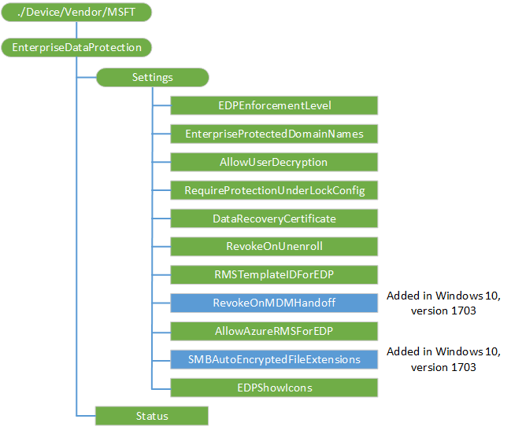

# EnterpriseDataProtection CSP

The EnterpriseDataProtection configuration service provider (CSP) is used to configure Windows Information Protection (WIP) (formerly known as Enterprise Data Protection) specific settings. For more information about WIP, see [Protect your enterprise data using Windows Information Protection (WIP)](https://technet.microsoft.com/itpro/windows/keep-secure/protect-enterprise-data-using-wip).

> **Note**  
>- To make WIP functional the AppLocker CSP and the network isolation specific settings must also be configured. For more information, see [AppLocker CSP](applocker-csp.md) and NetworkIsolation policies in [Policy CSP](policy-configuration-service-provider.md).
>- This CSP was added in Windows 10, version 1607.

 

While WIP has no hard dependency on VPN, for best results you should configure VPN profiles first before you configure the WIP policies. For VPN best practice recommendations, see [VPNv2 CSP](vpnv2-csp.md).

To learn more about WIP, see the following TechNet topics:

-   [Create a Windows Information Protection (WIP) policy](https://technet.microsoft.com/itpro/windows/keep-secure/overview-create-wip-policy)
-   [General guidance and best practices for Windows Information Protection (WIP)](https://technet.microsoft.com/itpro/windows/keep-secure/guidance-and-best-practices-wip)

The following diagram shows the EnterpriseDataProtection CSP in tree format.



<a href="" id="--device-vendor-msft-enterprisedataprotection"></a>**./Device/Vendor/MSFT/EnterpriseDataProtection**  
<p style="margin-left: 20px">The root node for the CSP.

<a href="" id="settings"></a>**Settings**  
<p style="margin-left: 20px">The root node for the Windows Information Protection (WIP) configuration settings.

<a href="" id="settings-edpenforcementlevel"></a>**Settings/EDPEnforcementLevel**  
<p style="margin-left: 20px">Set the WIP enforcement level. Note that setting this value is not sufficient to enable WIP on the device. Attempts to change this value will fail when the WIP cleanup is running.

<p style="margin-left: 20px">The following list shows the supported values:

-   0 (default) – Off / No protection (decrypts previously protected data).
-   1 – Silent mode (encrypt and audit only).
-   2 – Allow override mode (encrypt, prompt and allow overrides, and audit).
-   3 – Hides overrides (encrypt, prompt but hide overrides, and audit).

<p style="margin-left: 20px">Supported operations are Add, Get, Replace and Delete. Value type is integer.

<a href="" id="settings-enterpriseprotecteddomainnames"></a>**Settings/EnterpriseProtectedDomainNames**  
<p style="margin-left: 20px">A list of domains used by the enterprise for its user identities separated by pipes ("|").The first domain in the list must be the primary enterprise ID, that is, the one representing the managing authority for WIP. User identities from one of these domains is considered an enterprise managed account and data associated with it should be protected. For example, the domains for all email accounts owned by the enterprise would be expected to appear in this list. Attempts to change this value will fail when the WIP cleanup is running.

<p style="margin-left: 20px">Changing the primary enterprise ID is not supported and may cause unexpected behavior on the client.

> **Note**  The client requires domain name to be canonical, otherwise the setting will be rejected by the client.

 

<p style="margin-left: 20px">Here are the steps to create canonical domain names:

1.  Transform the ASCII characters (A-Z only) to lower case. For example, Microsoft.COM -> microsoft.com.
2.  Call [IdnToAscii](https://msdn.microsoft.com/library/windows/desktop/dd318149.aspx) with IDN\_USE\_STD3\_ASCII\_RULES as the flags.
3.  Call [IdnToUnicode](https://msdn.microsoft.com/library/windows/desktop/dd318151.aspx) with no flags set (dwFlags = 0).

<p style="margin-left: 20px">Supported operations are Add, Get, Replace and Delete. Value type is string.

<a href="" id="settings-allowuserdecryption"></a>**Settings/AllowUserDecryption**  
<p style="margin-left: 20px">Allows the user to decrypt files. If this is set to 0 (Not Allowed), then the user will not be able to remove protection from enterprise content through the operating system or the application user experiences.

> [!Important]  
> Starting in Windows 10, version 1703, AllowUserDecryption is no longer supported.

<p style="margin-left: 20px">The following list shows the supported values:

-   0 – Not allowed.
-   1 (default) – Allowed.

<p style="margin-left: 20px">Most restricted value is 0.

<p style="margin-left: 20px">Supported operations are Add, Get, Replace and Delete. Value type is integer.

<a href="" id="settings-requireprotectionunderlockconfig"></a>**Settings/RequireProtectionUnderLockConfig**  
<p style="margin-left: 20px">Specifies whether the protection under lock feature (also known as encrypt under pin) should be configured. A PIN must be configured on the device before you can apply this policy.

<p style="margin-left: 20px">The following list shows the supported values:

-   0 (default) – Not required.
-   1 – Required.

<p style="margin-left: 20px">Most restricted value is 1.

<p style="margin-left: 20px">The CSP checks the current edition and hardware support (TPM), and returns an error message if the device does not have the required hardware.

> **Note**  This setting is only supported in Windows 10 Mobile.

 

<p style="margin-left: 20px">Supported operations are Add, Get, Replace and Delete. Value type is integer.

<a href="" id="settings-datarecoverycertificate"></a>**Settings/DataRecoveryCertificate**  
<p style="margin-left: 20px">Specifies a recovery certificate that can be used for data recovery of encrypted files. This is the same as the data recovery agent (DRA) certificate for encrypting file system (EFS), only delivered through MDM instead of Group Policy.

> **Note**  If this policy and the corresponding Group Policy setting are both configured, the Group Policy setting is enforced.

<p style="margin-left: 20px">DRA information from MDM policy must be a serialized binary blob identical to what we expect from GP.
The binary blob is the serialized version of following structure:

``` syntax
//
//  Recovery Policy Data Structures
//
 
typedef struct _RECOVERY_POLICY_HEADER {
    USHORT      MajorRevision;
    USHORT      MinorRevision;
    ULONG       RecoveryKeyCount;
} RECOVERY_POLICY_HEADER, *PRECOVERY_POLICY_HEADER;
 
typedef struct _RECOVERY_POLICY_1_1    {
        RECOVERY_POLICY_HEADER  RecoveryPolicyHeader;
        RECOVERY_KEY_1_1        RecoveryKeyList[1];
}   RECOVERY_POLICY_1_1, *PRECOVERY_POLICY_1_1;
 
#define EFS_RECOVERY_POLICY_MAJOR_REVISION_1   (1)
#define EFS_RECOVERY_POLICY_MINOR_REVISION_0   (0)
 
#define EFS_RECOVERY_POLICY_MINOR_REVISION_1   (1)
 
///////////////////////////////////////////////////////////////////////////////
//                                                                            /
//  RECOVERY_KEY Data Structure                                               /
//                                                                            /
///////////////////////////////////////////////////////////////////////////////
 
//
// Current format of recovery data.
//
 
typedef struct _RECOVERY_KEY_1_1   {
        ULONG               TotalLength;
        EFS_PUBLIC_KEY_INFO PublicKeyInfo;
} RECOVERY_KEY_1_1, *PRECOVERY_KEY_1_1;
 
 
typedef struct _EFS_PUBLIC_KEY_INFO {
 
    //
    // The length of this entire structure, including string data
    // appended to the end. The length should be a multiple of 8 for
    // 64 bit alignment
    //
 
    ULONG Length;
 
    //
    // Sid of owner of the public key (regardless of format).
   // This field is to be treated as a hint only.
    //
 
    ULONG PossibleKeyOwner;
 
    //
    // Contains information describing how to interpret
    // the public key information
    //
 
    ULONG KeySourceTag;
 
    union {
 
        struct {
 
            //
            // The following fields contain offsets based at the
            // beginning of the structure.  Each offset is to
            // a NULL terminated WCHAR string.
            //
 
            ULONG ContainerName;
            ULONG ProviderName;
 
            //
            // The exported public key used to encrypt the FEK.
            // This field contains an offset from the beginning of the
            // structure.
            //
 
            ULONG PublicKeyBlob;
 
            //
            // Length of the PublicKeyBlob in bytes
            //
 
            ULONG PublicKeyBlobLength;
 
        } ContainerInfo;
 
        struct {
 
            ULONG CertificateLength;       // in bytes
            ULONG Certificate;             // offset from start of structure
 
        } CertificateInfo;
 
 
        struct {
 
            ULONG ThumbprintLength;        // in bytes
            ULONG CertHashData;            // offset from start of structure
 
        } CertificateThumbprint;
    };
 
 
 
} EFS_PUBLIC_KEY_INFO, *PEFS_PUBLIC_KEY_INFO;
 
//
// Possible KeyTag values
//
 
typedef enum _PUBLIC_KEY_SOURCE_TAG {
    EfsCryptoAPIContainer = 1,
    EfsCertificate,
    EfsCertificateThumbprint
} PUBLIC_KEY_SOURCE_TAG, *PPUBLIC_KEY_SOURCE_TAG;
 
```

<p style="margin-left: 20px">For EFSCertificate KeyTag, it is expected to be a DER ENCODED binary certificate.

<p style="margin-left: 20px">Supported operations are Add, Get, Replace and Delete. Value type is base-64 encoded certificate.

<a href="" id="settings-revokeonunenroll"></a>**Settings/RevokeOnUnenroll**  
<p style="margin-left: 20px">This policy controls whether to revoke the WIP keys when a device unenrolls from the management service. If set to 0 (Don't revoke keys), the keys will not be revoked and the user will continue to have access to protected files after unenrollment. If the keys are not revoked, there will be no revoked file cleanup subsequently. Prior to sending the unenroll command, when you want a device to do a selective wipe when it is unenrolled, then you should explicitly set this policy to 1.

<p style="margin-left: 20px">The following list shows the supported values:

-   0 – Don't revoke keys.
-   1 (default) – Revoke keys.

<p style="margin-left: 20px">Supported operations are Add, Get, Replace and Delete. Value type is integer.

<a href="" id="settings-revokeonmdmhandoff"></a>**Settings/RevokeOnMDMHandoff**  
<p style="margin-left: 20px">Added in Windows 10, version 1703. This policy controls whether to revoke the WIP keys when a device upgrades from MAM to MDM. If set to 0 (Don't revoke keys), the keys will not be revoked and the user will continue to have access to protected files after upgrade. This is recommended if the MDM service is configured with the same WIP EnterpriseID as the MAM service.

- 0 - Don't revoke keys
- 1 (dafault) - Revoke keys

<p style="margin-left: 20px">Supported operations are Add, Get, Replace and Delete. Value type is integer.

<a href="" id="settings-rmstemplateidforedp"></a>**Settings/RMSTemplateIDForEDP**  
<p style="margin-left: 20px">TemplateID GUID to use for RMS encryption. The RMS template allows the IT admin to configure the details about who has access to RMS-protected file and how long they have access.

<p style="margin-left: 20px">Supported operations are Add, Get, Replace and Delete. Value type is string (GUID).

<a href="" id="settings-allowazurermsforedp"></a>**Settings/AllowAzureRMSForEDP**  
<p style="margin-left: 20px">Specifies whether to allow Azure RMS encryption for WIP.

-   0 (default) – Don't use RMS.
-   1 – Use RMS.

<p style="margin-left: 20px">Supported operations are Add, Get, Replace and Delete. Value type is integer.

<a href="" id="settings-smbautoencryptedfileextensions"></a>**Settings/SMBAutoEncryptedFileExtensions**  
<p style="margin-left: 20px">Added in Windows 10, version 1703. Specifies a list of file extensions, so that files with these extensions are encrypted when copying from an SMB share within the corporate boundary as defined in the Policy CSP nodes for [NetworkIsolation/EnterpriseIPRange](policy-configuration-service-provider.md#networkisolation-enterpriseiprange) and [NetworkIsolation/EnterpriseNetworkDomainNames](policy-configuration-service-provider.md#networkisolation-enterprisenetworkdomainnames). Use semicolon (;) delimiter in the list.
<p style="margin-left: 20px">When this policy is not specified, the existing auto-encryption behavior is applied.  When this policy is configured, only files with the extensions in the list will be encrypted.
<p style="margin-left: 20px">Supported operations are Add, Get, Replace and Delete. Value type is string.

<a href="" id="settings-edpshowicons"></a>**Settings/EDPShowIcons**  
<p style="margin-left: 20px">Determines whether overlays are added to icons for WIP protected files in Explorer and enterprise only app tiles in the Start menu. Starting in Windows 10, version 1703 this setting also configures the visibility of the WIP icon in the title bar of a WIP-protected app.

<p style="margin-left: 20px">The following list shows the supported values:

-   0 (default) - No WIP overlays on icons or tiles.
-   1 - Show WIP overlays on protected files and apps that can only create enterprise content.

<p style="margin-left: 20px">Supported operations are Add, Get, Replace and Delete. Value type is integer.

<a href="" id="status"></a>**Status**  
<p style="margin-left: 20px">A read-only bit mask that indicates the current state of WIP on the Device. The MDM service can use this value to determine the current overall state of WIP. WIP is only on (bit 0 = 1) if WIP mandatory policies and WIP AppLocker settings are configured.

<p style="margin-left: 20px">Suggested values:

<table>
<colgroup>
<col width="20%" />
<col width="20%" />
<col width="20%" />
<col width="20%" />
<col width="20%" />
</colgroup>
<tbody>
<tr class="odd">
<td><p>Reserved for future use</p></td>
<td><p>WIP mandatory settings</p>
<p>Set = 1</p>
<p>Not set = 0</p></td>
<td><p>Reserved for future use</p></td>
<td><p>AppLocker configured</p>
<p>Yes = 1</p>
<p>No = 0</p></td>
<td><p>WIP on = 1</p>
<p>WIP off = 0</p></td>
</tr>
<tr class="even">
<td><p>4</p></td>
<td><p>3</p></td>
<td><p>2</p></td>
<td><p>1</p></td>
<td><p>0</p></td>
</tr>
</tbody>
</table>

 

<p style="margin-left: 20px">Bit 0 indicates whether WIP is on or off.

<p style="margin-left: 20px">Bit 1 indicates whether AppLocker WIP policies are set.

<p style="margin-left: 20px">Bit 3 indicates whether the mandatory WIP policies are configured. If one or more of the mandatory WIP policies are not configured, the bit 3 is set to 0 (zero).

<p style="margin-left: 20px">Here's the list of mandatory WIP policies:

-   EDPEnforcementLevel in EnterpriseDataProtection CSP
-   DataRecoveryCertificate in EnterpriseDataProtection CSP
-   EnterpriseProtectedDomainNames in EnterpriseDataProtection CSP
-   NetworkIsolation/EnterpriseIPRange in Policy CSP
-   NetworkIsolation/EnterpriseNetworkDomainNames in Policy CSP

<p style="margin-left: 20px">Bits 2 and 4 are reserved for future use.

<p style="margin-left: 20px">Supported operation is Get. Value type is integer.

 

 


