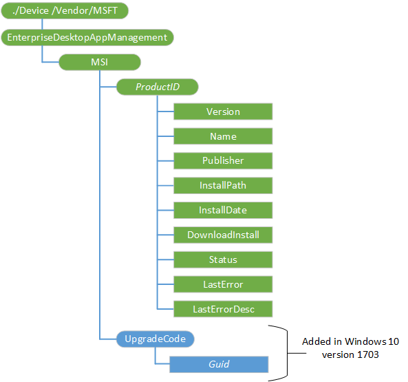

# EnterpriseDesktopAppManagement CSP


The EnterpriseDesktopAppManagement configuration service provider is used to handle enterprise desktop application management tasks, such as querying installed enterprise applications, installing applications, or removing applications.

Application installations can take some time to complete, hence they are done asynchronously. When the Exec command is completed, the client can send a generic alert to the management server with a status, whether it's a failure or success. For a SyncML example, see [Alert example](#alert-example).

The following diagram shows the EnterpriseDesktopAppManagement CSP in tree format.



<a href="" id="--vendor-msft-enterprisedesktopappmanagement"></a>**./Device/Vendor/MSFT/EnterpriseDesktopAppManagement**
The root node for the EnterpriseDesktopAppManagement configuration service provider.

<a href="" id="msi"></a>**MSI**
Node for all settings.

<a href="" id="msi-productid"></a>**MSI/**<strong>*ProductID*</strong>
The MSI product code for the application.

<a href="" id="msi-productid-version"></a>**MSI/*ProductID*/Version**
Version number. Value type is string. Supported operation is Get.

<a href="" id="msi-productid-name"></a>**MSI/*ProductID*/Name**
Name of the application. Value type is string. Supported operation is Get.

<a href="" id="msi-productid-publisher"></a>**MSI/*ProductID*/Publisher**
Publisher of application. Value type is string. Supported operation is Get.

<a href="" id="msi-productid-installpath"></a>**MSI/*ProductID*/InstallPath**
Installation path of the application. Value type is string. Supported operation is Get.

<a href="" id="msi-productid-installdate"></a>**MSI/*ProductID*/InstallDate**
Installation date of the application. Value type is string. Supported operation is Get.

<a href="" id="msi-productid-downloadinstall"></a>**MSI/*ProductID*/DownloadInstall**
Executes the download and installation of the application. Value type is string. Supported operations are Execute and Get.

In Windows 10, version 1703 service release, a new tag \<DownloadFromAad\> was added to the \<Enforcement\> section of the XML. The default value is 0 (do not send token). This tag is optional and needs to be set to 1 in case the server wants the download URL to get the AADUserToken.

Here is an example:

```xml
<Enforcement>
  <CommandLine>/quiet</CommandLine>
  <TimeOut>5</TimeOut>
  <RetryCount>3</RetryCount>
  <RetryInterval>5</RetryInterval>
  <DownloadFromAad>1</DownloadFromAad>
</Enforcement>
```

<a href="" id="msi-productid-status"></a>**MSI/*ProductID*/Status**
Status of the application. Value type is string. Supported operation is Get.

| Status                    | Value |
|---------------------------|-------|
| Initialized               | 10    |
| Download In Progress      | 20    |
| Pending Download Retry    | 25    |
| Download Failed           | 30    |
| Download Completed        | 40    |
| Pending User Session      | 48    |
| Enforcement In Progress   | 50    |
| Pending Enforcement Retry | 55    |
| Enforcement Failed        | 60    |
| Enforcement Completed     | 70    |

 

<a href="" id="msi-productid-lasterror"></a>**MSI/*ProductID*/LastError**
The last error code during the application installation process. This is typically stored as an HRESULT format. Depending on what was occurring when the error happened, this could be the result of executing MSIExec.exe or the error result from an API that failed.

Value type is string. Supported operation is Get.

<a href="" id="msi-productid-lasterrordesc"></a>**MSI/*ProductID*/LastErrorDesc**
Contains the last error code description. The LastErrorDesc value is looked up for the matching LastError value. Sometimes there is no LastErrorDesc returned.

Value type is string. Supported operation is Get.

<a href="" id="msi-upgradecode"></a>**MSI/UpgradeCode**
Added in the March service release of Windows 10, version 1607.

<a href="" id="msi-upgradecode"></a>**MSI/UpgradeCode/_Guid_**
Added in the March service release of Windows 10, version 1607. A gateway (or device management server) uses this method to detect matching upgrade MSI product when a Admin wants to update an existing MSI app. If the same upgrade product is installed, then the update is allowed.

Value type is string. Supported operation is Get.


## Examples


**SyncML to request CSP version information**

```xml
<SyncML xmlns="SYNCML:SYNCML1.1">
  <SyncBody>
    <Get>
      <CmdID>12345</CmdID>
      <Item>
        <Target>
          <LocURI>./Device/Vendor/MSFT/EnterpriseDesktopAppManagement?prop=Type</LocURI>
        </Target>
      </Item>
    </Get>
    <Final/>
  </SyncBody>
</SyncML>
```

The following table describes the fields in the previous sample:

| Name   | Description                                                                                                                   |
|--------|-------------------------------------------------------------------------------------------------------------------------------|
| Get    | Operation being performed. The Get operation is a request to return information.                                              |
| CmdID  | Input value used to reference the request. Responses will include this value which can be used to match request and response. |
| LocURI | Path to Win32 CSP command processor.                                                                                          |

 

**SyncML to perform MSI operations for application uninstall**

```xml
<SyncML xmlns="SYNCML:SYNCML1.1">
  <SyncBody>
    <Delete>
      <CmdID>12345</CmdID>
      <Item>
        <Target>
          <LocURI>./Device/Vendor/MSFT/EnterpriseDesktopAppManagement/MSI/%7B1803A630-3C38-4D2B-9B9A-0CB37243539C%7D</LocURI>
        </Target>
      </Item>
    </Delete>
    <Final/>
  </SyncBody>
</SyncML>
```

The following table describes the fields in the previous sample:

| Name   | Description                                                                                                                                                                                                         |
|--------|---------------------------------------------------------------------------------------------------------------------------------------------------------------------------------------------------------------------|
| Delete | Operation being performed. The Delete operation is a request to delete the CSP node that represents the specified MSI installed application and to perform and uninstall of the application as part of the process. |
| CmdID  | Input value used to reference the request. Responses will include this value which can be used to match request and response.                                                                                       |
| LocURI | Path to Win32 CSP command processor, including the Product ID (in this example, 1803A630-3C38-4D2B-9B9A-0CB37243539C) property escaped for XML formatting.                                                          |

 

**SyncML to perform MSI operations for application status reporting**

```xml
<SyncML xmlns="SYNCML:SYNCML1.1">
  <SyncBody>
    <Get>
      <CmdID>12345</CmdID>
      <Item>
        <Target>
          <LocURI>./Device/Vendor/MSFT/EnterpriseDesktopAppManagement/MSI/%7B1803A630-3C38-4D2B-9B9A-0CB37243539C%7D</LocURI>
        </Target>
      </Item>
    </Get>
    <Final/>
  </SyncBody>
</SyncML>
```

The following table describes the fields in the previous sample:

| Name   | Description                                                                                                                                                |
|--------|------------------------------------------------------------------------------------------------------------------------------------------------------------|
| Get    | Operation being performed. The Get operation is a request to report the status of the specified MSI installed application.                                 |
| CmdID  | Input value used to reference the request. Responses will include this value which can be used to match request and response.                              |
| LocURI | Path to Win32 CSP command processor, including the Product ID (in this example, 1803A630-3C38-4D2B-9B9A-0CB37243539C) property escaped for XML formatting. |

 

**SyncML to perform MSI install operations for an application targeted to a specific user on the device. The Add command is required to preceed the Exec command.**

```xml
<SyncML xmlns="SYNCML:SYNCML1.1">
  <SyncBody>
    <Add>
      <CmdID>1</CmdID>
      <Item>
        <Target>
        <LocURI>./User/Vendor/MSFT/EnterpriseDesktopAppManagement/MSI/%7B1803A630-3C384D2B-9B9A-0CB37243539C%7D/DownloadInstall</LocURI>
        </Target>
      </Item>
    </Add>
    <Exec>
      <CmdID>6</CmdID>
      <Item>
        <Target>
          <LocURI>./User/Vendor/MSFT/EnterpriseDesktopAppManagement/MSI/%7B1803A630-3C38-4D2B-9B9A-0CB37243539C%7D/DownloadInstall</LocURI>
        </Target>
        <Meta>
          <Format xmlns="syncml:metinf">xml</Format>
          <Type xmlns="syncml:metinf">text/plain</Type>
        </Meta>
        <Data>
          <MsiInstallJob id="{9BD4F7CD-880A-40B5-B74C-1BEECB51E596}">
            <Product Version="1.0.0">
              <Download>
                <ContentURLList>
                  <ContentURL>
                    http://bcl-w2k12r2-vm/testapps/msi/reboot/reboot.msi
                  </ContentURL>
                  <ContentURL>https://dp2.com/packages/myApp.msi</ContentURL>
                </ContentURLList>
              </Download>
              <Validation>
<FileHash>134D8F1F7C3C036DC3DCDA9F97515C8C7951DB154B73365C9C22962BD23E3EB3</FileHash>
              </Validation>
              <Enforcement>
                <CommandLine>/quiet</CommandLine>
                <TimeOut>5</TimeOut>
                <RetryCount>3</RetryCount>
                <RetryInterval>5</RetryInterval>
              </Enforcement>
            </Product>
          </MsiInstallJob>
        </Data>
      </Item>
    </Exec>
    <Final/>
  </SyncBody>
</SyncML>
```

The following table describes the fields in the previous sample:

<table>
<colgroup>
<col width="50%" />
<col width="50%" />
</colgroup>
<thead>
<tr class="header">
<th>Name</th>
<th>Description</th>
</tr>
</thead>
<tbody>
<tr class="odd">
<td>Add</td>
<td>This is required to precede the Exec command.
<ul>
<li>CmdID - Input value used to reference the request. Responses includes this value, which can be use to match the request and response.</li>
<li>LocURI - Path to Win32 CSP command processor, including the Product ID (in this example, 1803A630-3C38-4D2B-9B9A-0CB37243539C) property escaped for XML formatting.</li>
</ul></td>
</tr>
<tr class="even">
<td>Exec</td>
<td>The Exec node includes the parameters and properties requires to locate, download, validate and perform product installation.
<ul>
<li>CmdID - Input value used to reference the request. Responses will include this value which can be used to match request and response.</li>
<li>LocURI - Path to Win32 CSP command processor, including the Product ID (in this example, 1803A630-3C38-4D2B-9B9A-0CB37243539C) property escaped for XML formatting.</li>
<li>Data - The Data node contains an embedded XML, of type “MsiInstallJob”</li>
<li>MsiInstallJob - Contains all information required for the successful download, validation and execution of the MSI installation process (see section at the end of this document for details on this embedded data object).</li>
</ul></td>
</tr>
</tbody>
</table>

 

> **Note**  Information status on the MSI job will be reported using standard OMA-DM notification mechanism. The status reported is represented using standard MSIEXEC return codes as HRESULT as defined in the MSIEXEC topic on Microsoft TechNet at <https://technet.microsoft.com/library/cc759262(v=ws.10).aspx>.

 

**SyncML to perform MSI install operations for an application targeted to all users on the device (per-device installation)**

```xml
<SyncML xmlns="SYNCML:SYNCML1.1">
  <SyncBody>
    <Add>
      <CmdID>1</CmdID>
      <Item>
        <Target>
          <LocURI>./Device /Vendor/MSFT/EnterpriseDesktopAppManagement/MSI/%7B6F7CB29F-1319-4816-B345-0856916EB801%7D/DownloadInstall
          </LocURI>
      </Target>
    </Item>
  </Add>
    <Exec>
      <CmdID>67890</CmdID>
      <Item>
        <Target>
          <LocURI>./Device /Vendor/MSFT/EnterpriseDesktopAppManagement/MSI/%7B6F7CB29F-1319-4816-B345-0856916EB801%7D/DownloadInstall</LocURI>
        </Target>
        <Meta>
          <Format xmlns="syncml:metinf">xml</Format>
          <Type xmlns="syncml:metinf">text/plain</Type>
        </Meta>
        <Data>
          <MsiInstallJob id="{9BD4F7CD-880A-40B5-B74C-1BEECB51E596}">
            <Product Version="1.0.0">
              <Download>
                <ContentURLList>
                  <ContentURL>http://bcl-w2k12r2-vm/testapps/msi/Orca/Orca.msi</ContentURL>
                  <ContentURL>https://dp2.com/packages/myApp.msi</ContentURL>
                </ContentURLList>
              </Download>
              <Validation>
                <FileHash>4525065777EF18B9444ABF71DD4B48E5F64F4F0E1E029995FB8DA441CDE4296E</FileHash>
              </Validation>
              <Enforcement>
                <CommandLine>/quiet</CommandLine>
                <TimeOut>5</TimeOut>
                <RetryCount>3</RetryCount>
                <RetryInterval>5</RetryInterval>
              </Enforcement>
            </Product>
          </MsiInstallJob>
        </Data>
      </Item>
    </Exec>
    <Final/>
  </SyncBody>
</SyncML>
```

The following table MsiInstallJob describes the schema elements.

<table>
<colgroup>
<col width="50%" />
<col width="50%" />
</colgroup>
<thead>
<tr class="header">
<th>Element</th>
<th>Description</th>
</tr>
</thead>
<tbody>
<tr class="odd">
<td>MsiInstallJob</td>
<td>root element
<p>&quot;Attribute: &quot;id - the application identifier of the application being installed</p></td>
</tr>
<tr class="even">
<td>Product</td>
<td>child element of MsiInstallJob
<p>Attribute: “Version” – string representation of application version</p></td>
</tr>
<tr class="odd">
<td>Download</td>
<td>child element of Product. Container for download configuration information.</td>
</tr>
<tr class="even">
<td>ContentURLList</td>
<td>child element of Download. Contains list of 1 or more content download URL locators in the form of ContentURL elements.</td>
</tr>
<tr class="odd">
<td>ContentURL</td>
<td>Location content should be downloaded from. Must be a property formatted URL that points to the .MSI file.</td>
</tr>
<tr class="even">
<td>Validation</td>
<td>Contains information used to validate contend authenticity. • FileHash – SHA256 hash value of file content</td>
</tr>
<tr class="odd">
<td>FileHash</td>
<td>SHA256 hash value of file content</td>
</tr>
<tr class="even">
<td>Enforcement</td>
<td>installation properties to be used when installing this MSI</td>
</tr>
<tr class="odd">
<td>CommandLine</td>
<td>Command-line options to be used when calling MSIEXEC.exe</td>
</tr>
<tr class="even">
<td>Timeout</td>
<td>Amount of time, in minutes that the installation process can run before the installer considers the installation may have failed and no longer monitors the installation operation.</td>
</tr>
<tr class="odd">
<td>RetryCount</td>
<td>The number of times the download and installation operation will be retried before the installation will be marked as failed.</td>
</tr>
<tr class="even">
<td>RetryInterval</td>
<td>Amount of time, in minutes between retry operations.</td>
</tr>
</tbody>
</table>

 

Here is an example of a common response to a request

```xml
<?xml version="1.0" encoding="utf-16"?>
<SyncML>
  <SyncHdr />
  <SyncBody>
    <Status>
      <CmdID>12345</CmdID>
      <MsgRef>1</MsgRef>
      <CmdRef>0</CmdRef>
      <Cmd>SyncHdr</Cmd>
      <Data>200</Data>
    </Status>
    <Status>
      <CmdID>67890</CmdID>
      <MsgRef>1</MsgRef>
      <CmdRef>1</CmdRef>
      <Cmd>Add</Cmd>
      <Data>200</Data>
    </Status>
    <Final />
  </SyncBody>
</SyncML>
```

## How to determine which installation context to use for an MSI package


The following tables shows how app targeting and MSI package type (per-user, per machine, or dual mode) are installed in the client.

For Intune standalone environment, the MSI package will determine the MSI execution context.

<table>
<colgroup>
<col width="25%" />
<col width="25%" />
<col width="25%" />
<col width="25%" />
</colgroup>
<thead>
<tr class="header">
<th>Target</th>
<th>Per-user MSI</th>
<th>Per-machine MSI</th>
<th>Dual mode MSI</th>
</tr>
</thead>
<tbody>
<tr class="odd">
<td>User</td>
<td>Install the MSI per-user
<p>LocURI contains a User prefix, such as ./User</p></td>
<td>Install the MSI per-device
<p>LocURI contains a Device prefix, such as ./Device</p></td>
<td>Install the MSI per-user
<p>LocURI contains a User prefix, such as ./User</p></td>
</tr>
<tr class="even">
<td>System</td>
<td>Install the MSI per-user
<p>LocURI contains a User prefix, such as ./User</p></td>
<td>Install the MSI per-device
<p>LocURI contains a Device prefix, such as ./Device</p></td>
<td>Install the MSI per-user
<p>LocURI contains a User prefix, such as ./User</p></td>
</tr>
</tbody>
</table>

 

The following table applies to SCCM hybrid environment.

<table>
<colgroup>
<col width="25%" />
<col width="25%" />
<col width="25%" />
<col width="25%" />
</colgroup>
<thead>
<tr class="header">
<th>Target</th>
<th>Per-user MSI</th>
<th>Per-machine MSI</th>
<th>Dual mode MSI</th>
</tr>
</thead>
<tbody>
<tr class="odd">
<td>User</td>
<td>Install the MSI per-user
<p>LocURI contains a User prefix, such as ./User</p></td>
<td>Install the MSI per-device
<p>LocURI contains a Device prefix, such as ./Device</p></td>
<td>Install the MSI per-user
<p>LocURI contains a User prefix, such as ./User</p></td>
</tr>
<tr class="even">
<td>System</td>
<td>Install the MSI per-user
<p>LocURI contains a User prefix, such as ./User</p></td>
<td>Install the MSI per-device
<p>LocURI contains a Device prefix, such as ./Device</p></td>
<td>Install the MSI per- system context
<p>LocURI contains a Device prefix, such as ./Device</p></td>
</tr>
</tbody>
</table>

 

## How to determine the package type from the MSI package


-   ALLUSERS="" - per-user package type
-   ALLUSERS=1 - per-machine package type
-   ALLUSERS=2, MSIINSTALLPERUSER=1 - dual mode package type

Properties can be specified in the package, passed through the command line, modified by a transform, or (more commonly) selected through a user interface dialog.

Here's a list of references:

-   [Using Windows Installer](https://technet.microsoft.com/library/cc782896.aspx)
-   [Authoring a single package for Per-User or Per-Machine Installation context in Windows 7](https://blogs.msdn.com/b/windows_installer_team/archive/2009/09/02/authoring-a-single-package-for-per-user-or-per-machine-installation-context-in-windows-7.aspx)
-   SyncML Representation Protocol, Draft Version 1.3 - 27 Aug 2009 (OMA-TS-SyncML\_RepPro-V1\_3-20090827-D)

## Alert example


```xml
<Alert>
       <CmdID>4</CmdID>
       <Data>1224</Data>
       <Item>
          <Source>
             <LocURI>./Device/Vendor/MSFT/EnterpriseDesktopAppManagement/MSI/{AF9257BA-6BBD-4624-AA9B-0182D50292C3}/DownloadInstall</LocURI>
          </Source>
          <Meta>
             <Type xmlns="syncml:metinf">Reversed-Domain-Name:com.microsoft.mdm.win32csp_install</Type>
             <Format xmlns="syncml:metinf">int</Format>
             <Mark xmlns="syncml:metinf">informational</Mark>
          </Meta>
          <Data>0</Data>
       </Item>
</Alert>
```

 

 


