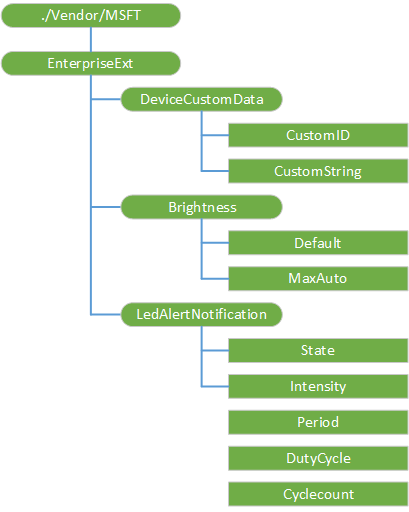

# EnterpriseExt CSP


The EnterpriseExt configuration service provider allows OEMs to set their own unique ID for their devices, set display brightness values, and set the LED behavior.

> **Note**   The EnterpriseExt CSP is only supported in Windows 10 Mobile.

 

The following diagram shows the EnterpriseExt configuration service provider in tree format as used by both the Open Mobile Alliance (OMA) Device Management (DM) and OMA Client Provisioning.



The following list shows the characteristics and parameters.

<a href="" id="--vendor-msft-enterpriseext"></a>**./Vendor/MSFT/EnterpriseExt**  
The root node for the EnterpriseExt configuration service provider. Supported operations is Get.

<a href="" id="devicecustomdata"></a>**DeviceCustomData**  
Node for setting the custom device ID and string.

<a href="" id="devicecustomdata-customid"></a>**DeviceCustomData/CustomID**  
Any string value as the device ID. This value appears in **Settings** > **About** > **Info**.

Here's an example for getting custom data.

``` syntax
<?xml version="1.0"?>
<SyncML xmlns="SYNCML:SYNCML1.2">
    <SyncBody>
        <Get>
            <CmdID>1</CmdID>
            <Item>
                <Target>
                    <LocURI>./Vendor/MSFT/EnterpriseExt/DeviceCustomData/CustomID</LocURI>
                </Target>
            </Item>
            <Item>
                <Target>
                    <LocURI>./Vendor/MSFT/EnterpriseExt/DeviceCustomData/CustomString</LocURI>
                </Target>
            </Item>
        </Get>
        <Final/>
    </SyncBody>
</SyncML>
```

<a href="" id="devicecustomdata-customstring"></a>**DeviceCustomData/CustomString**  
Any string value that is associated with the device.

Here's an example for setting custom data.

``` syntax
<?xml version="1.0"?>
<SyncML xmlns="SYNCML:SYNCML1.2">
    <SyncBody>
        <Replace>
            <CmdID>1</CmdID>
            <Item>
                <Target>
                    <LocURI>./Vendor/MSFT/EnterpriseExt/DeviceCustomData/CustomID</LocURI>
                </Target>
                <Data>urn:uuid:130CCE0D-0187-5866-855A-DE7406F76046</Data> 
            </Item>
            <Item>
                <Target>
                    <LocURI>./Vendor/MSFT/EnterpriseExt/DeviceCustomData/CustomString</LocURI>
                </Target>
                <Data>{"firstName":"John","lastName":"Doe"}</Data> 
            </Item>
        </Replace>
        <Final/>
    </SyncBody>
</SyncML>
```

<a href="" id="brightness"></a>**Brightness**  
Node for setting device brightness values.

<a href="" id="brightness-default"></a>**Brightness/Default**  
Default display brightness value. For example, you can maximize battery life by reducing the default value or set it to medium in a facility that is generally darker.

The valid values are:

-   Automatic - the device determines the brightness
-   Low
-   Medium
-   High

The supported operations are Get and Replace.

Here's an example for getting the current default value.

``` syntax
<?xml version="1.0"?>
<SyncML xmlns="SYNCML:SYNCML1.2">
  <SyncBody>
    <Get>
      <CmdID>2</CmdID>
      <Item>
        <Target>
          <LocURI>./Vendor/MSFT/EnterpriseExt/Brightness/Default</LocURI>
        </Target>
      </Item>
    </Get>
    <Final/>
  </SyncBody>
</SyncML>
```

Here's an example for setting the default value to medium.

``` syntax
<?xml version="1.0"?>
<SyncML xmlns="SYNCML:SYNCML1.2">
  <SyncBody>
    <Replace>
      <CmdID>2</CmdID>
      <Item>
        <Target>
          <LocURI>./Vendor/MSFT/EnterpriseExt/Brightness/Default</LocURI>
        </Target>
        <Data>medium</Data>
      </Item>
    </Replace>
    <Final/>
  </SyncBody>
</SyncML>
```

<a href="" id="brightness-maxauto"></a>**Brightness/MaxAuto**  
Maximum display brightness value when the device is set to automatic mode. The device brightness will never be higher than the MaxAuto value. The value values are:

-   Low
-   Medium
-   High

The supported operations are Get and Replace.

Here's an example for setting the maximum auto-brightness to medium.

``` syntax
<?xml version="1.0"?>
<SyncML xmlns="SYNCML:SYNCML1.2">
  <SyncBody>
    <Replace>
      <CmdID>2</CmdID>
      <Item>
        <Target>
          <LocURI>./Vendor/MSFT/EnterpriseExt/Brightness/MaxAuto</LocURI>
        </Target>
        <Data>medium</Data>
      </Item>
    </Replace>
    <Final/>
  </SyncBody>
</SyncML>
```

<a href="" id="ledalertnotification"></a>**LedAlertNotification**  
Node for setting LED behavior of the device.

<a href="" id="ledalertnotification-state"></a>**LedAlertNotification/State**  
LED state. The valid values are:

-   0 - off
-   1 - on
-   2 - blink

Example: LED On

``` syntax
<?xml version="1.0"?>
<SyncML xmlns="SYNCML:SYNCML1.2">
  <SyncBody>
    <Replace>
      <CmdID>3</CmdID>
      <Item>
        <Target>
          <LocURI>./Vendor/MSFT/EnterpriseExt/LedAlertNotification/Intensity</LocURI>
        </Target>
        <Meta>
          <Format xmlns="syncml:metinf">int</Format>
        </Meta>        
        <Data>100</Data>
      </Item>
      <Item>
        <Target>
          <LocURI>./Vendor/MSFT/EnterpriseExt/LedAlertNotification/State</LocURI>
        </Target>
        <Meta>
          <Format xmlns="syncml:metinf">int</Format>
        </Meta>        
        <Data>1</Data>
      </Item>
    </Replace>
    <Final/>
  </SyncBody>
</SyncML>
```

Example: LED Off

``` syntax
<?xml version="1.0"?>
<SyncML xmlns="SYNCML:SYNCML1.2">
  <SyncBody>
    <Replace>
      <CmdID>3</CmdID>
      <Item>
        <Target>
          <LocURI>./Vendor/MSFT/EnterpriseExt/LedAlertNotification/State</LocURI>
        </Target>
        <Meta>
          <Format xmlns="syncml:metinf">int</Format>
        </Meta>        
        <Data>0</Data>
      </Item>
    </Replace>
    <Final/>
  </SyncBody>
</SyncML>
```

<a href="" id="ledalertnotification-intensity"></a>**LedAlertNotification/Intensity**  
Intensity of the LED brightness. You can set the value between 1 - 100.

Example: LED blink

``` syntax
<?xml version="1.0"?>
<SyncML xmlns="SYNCML:SYNCML1.2">
  <SyncBody>
    <Replace>
      <CmdID>3</CmdID>
      <Item>
        <Target>
          <LocURI>./Vendor/MSFT/EnterpriseExt/LedAlertNotification/Period</LocURI>
        </Target>
        <Meta>
          <Format xmlns="syncml:metinf">int</Format>
        </Meta>        
        <Data>500</Data>
      </Item>
      <Item>
        <Target>
          <LocURI>./Vendor/MSFT/EnterpriseExt/LedAlertNotification/Dutycycle</LocURI>
        </Target>
        <Meta>
          <Format xmlns="syncml:metinf">int</Format>
        </Meta>        
        <Data>70</Data>
      </Item>
      <Item>
        <Target>
          <LocURI>./Vendor/MSFT/EnterpriseExt/LedAlertNotification/Intensity</LocURI>
        </Target>
        <Meta>
          <Format xmlns="syncml:metinf">int</Format>
        </Meta>        
        <Data>100</Data>
      </Item>
      <Item>
        <Target>
          <LocURI>./Vendor/MSFT/EnterpriseExt/LedAlertNotification/Cyclecount</LocURI>
        </Target>
        <Meta>
          <Format xmlns="syncml:metinf">int</Format>
        </Meta>        
        <Data>543210</Data>
      </Item>
      <Item>
        <Target>
          <LocURI>./Vendor/MSFT/EnterpriseExt/LedAlertNotification/State</LocURI>
        </Target>
        <Meta>
          <Format xmlns="syncml:metinf">int</Format>
        </Meta>        
        <Data>2</Data>
      </Item>
    </Replace>
    <Final/>
  </SyncBody>
</SyncML>
```

<a href="" id="ledalertnotification-period"></a>**LedAlertNotification/Period**  
Duration of each blink, which is the time of ON + OFF. The value is in milliseconds. This is valid only for blink.

<a href="" id="ledalertnotification-dutycycle"></a>**LedAlertNotification/DutyCycle**  
LED ON duration during one blink cycle. You can set the value between 1 - 100. This is valid only for blink.

<a href="" id="ledalertnotification-cyclecount"></a>**LedAlertNotification/Cyclecount**  
Number of blink cycles. The data type is a 4-byte signed integer. Any negative value or zero results in an error. This node is only valid for blink.

<a href="" id="devicereboot"></a>**DeviceReboot**  
Removed in Windows 10.

<a href="" id="devicereboot-waittime"></a>**DeviceReboot/WaitTime**  
Removed in Windows 10.

<a href="" id="maintenancewindow"></a>**MaintenanceWindow**  
Removed in Windows 10.

<a href="" id="maintenancewindow-maintenanceallowed"></a>**MaintenanceWindow/MaintenanceAllowed**  
Removed in Windows 10.

<a href="" id="maintenancewindow-mwmandatory"></a>**MaintenanceWindow/MWMandatory**  
Removed in Windows 10.

<a href="" id="maintenancewindow-schedulexml"></a>**MaintenanceWindow/ScheduleXML**  
Removed in Windows 10.

<a href="" id="maintenancewindow-mwnotificationduration"></a>**MaintenanceWindow/MWNotificationDuration**  
Removed in Windows 10.

<a href="" id="maintenancewindow-mwminimumduration"></a>**MaintenanceWindow/MWminimumDuration**  
Removed in Windows 10.

<a href="" id="deviceupdate"></a>**DeviceUpdate**  
Removed in Windows 10.

<a href="" id="deviceupdate-datetimestamp"></a>**DeviceUpdate/DateTimeStamp**  
Removed in Windows 10.

<a href="" id="deviceupdate-updateresultxml"></a>**DeviceUpdate/UpdateResultXml**  
Removed in Windows 10.

<a href="" id="mdm"></a>**MDM**  
Removed in Windows 10.

<a href="" id="mdm-server"></a>**MDM/Server**  
Removed in Windows 10.

<a href="" id="mdm-username"></a>**MDM/Username**  
Removed in Windows 10.

<a href="" id="mdm-password"></a>**MDM/Password**  
Removed in Windows 10.

<a href="" id="mdm-enabledeviceenrollment"></a>**MDM/EnableDeviceEnrollment**  
Removed in Windows 10.

<a href="" id="pfx"></a>**Pfx**  
Removed in Windows 10.

<a href="" id="disableenterprisevalidation"></a>**DisableEnterpriseValidation**  
Removed in Windows 10.

 

 

10/10/2016


