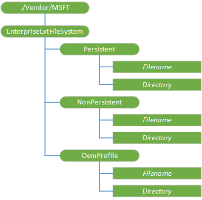

# EnterpriseExtFileSystem CSP


The EnterpriseExtFileSystem configuration service provider (CSP) allows IT administrators to add, retrieve, or change files in the file system through the Mobile Device Management (MDM) service. For example, you can use this configuration service provider to push a provisioning XML file or a new lock screen background image file to a device through the MDM service, and also retrieve logs from the device in the enterprise environment.

> **Note**  The EnterpriseExtFileSystem CSP is only supported in Windows 10 Mobile.

 

File contents are embedded directly into the syncML message, so there is a limit to the size of the file that can be retrieved from the device. The default limit is 0x100000 (1 MB). You can configure this limit by using the following registry key: **Software\\Microsoft\\Provisioning\\CSPs\\.\\Vendor\\MSFT\\EnterpriseExtFileSystem\\MaxFileReadSize**.

The following diagram shows the EnterpriseExtFileSystem configuration service provider in tree format as used by the Open Mobile Alliance (OMA) Device Management (DM).



The following list describes the characteristics and parameters.

<a href="" id="--vendor-msft-enterpriseextfilesystem"></a>**./Vendor/MSFT/EnterpriseExtFileSystem**  
<p style="margin-left: 25px">The root node for the EnterpriseExtFileSystem configuration service provider. Supported operations are Add and Get.</p>

<a href="" id="persistent"></a>**Persistent**  
<p style="margin-left: 25px">The EnterpriseExtFileSystem CSP allows an enterprise to read, write, delete and list files in this folder. When an app writes data to the Persistent folder, it accesses that data from the EnterpriseExtFileSystem\Persistent node. Files written to the Persistent folder persists over ordinary power cycles.</p>

> **Important**  There is a limit to the amount of data that can be persisted, which varies depending on how much disk space is available on one of the partitions. This data cap amount (that can be persisted) varies by manufacturer.
> 
> 
> 
> **Note**   When the IT admin triggers a **doWipePersistProvisionedData** action using [RemoteWipe CSP](remotewipe-csp.md), items stored in the Persistent folder are persisted over wipe and restored when the device boots again. The contents are not persisted if a **doWipe** action is triggered.

 

<a href="" id="nonpersistent"></a>**NonPersistent**  
<p style="margin-left: 25px">The EnterpriseExtFileSystem CSP allows an enterprise to read, write, delete and list files in this folder. When an app writes data to the Non-Persistent folder, it accesses that data from the EnterpriseExtFileSystem\NonPersistent node. Files written to the NonPersistent folder will persist over ordinary power cycles.</p>  

<p style="margin-left: 25px">When the device is wiped, any data stored in the NonPersistent folder is deleted.</p>

<a href="" id="oemprofile"></a>**OemProfile**  
<p style="margin-left: 25px">Added in Windows 10, version 1511. The EnterpriseExtFileSystem CSP allows an enterprise to deploy an OEM profile on the device, such as a barcode scanner profile then can be consumed by the OEM barcode scanner driver. The file is placed into the \data\shareddata\oem\public\profile\ folder of the device.</p>

<a href="" id="directory"></a>***Directory***  
<p style="margin-left: 25px">The name of a directory in the device file system. Any <em>Directory</em> node can have directories and files as child nodes.</p>

<p style="margin-left: 25px">Use the Add command to create a new directory. You cannot use it to add a new directory under a file system root.</p>

<p style="margin-left: 25px">Use the Get command to return the list of child node names under <em>Directory</em>.</p>

<p style="margin-left: 25px">Use the Get command with ?List=Struct to recursively return all child node names, including subdirectory names, under <em>Directory</em>.</p>

<a href="" id="filename"></a>***Filename***  
<p style="margin-left: 25px">The name of a file in the device file system.</p>

Supported operations is Get.

## OMA DM examples


The following example shows how to retrieve a file from the device.

``` syntax
<Get>
    <CmdID>2</CmdID>
    <Item>
        <Target>
            <LocURI>./Vendor/MSFT/EnterpriseExtFileSystem/Persistent/file.txt</LocURI>
        </Target>
    </Item>
</Get>
```

The following example shows the file name that is returned in the body of the response syncML code. In this example, the full path of the file on the device is C:/data/test/bin/filename.txt.

``` syntax
<Results>
    <CmdID>3</CmdID>
    <MsgRef>1</MsgRef>
    <CmdRef>2</CmdRef>
    <Item>
        <Source>
            <LocURI>./Vendor/MSFT/EnterpriseExtFileSystem/Persistent/filename.txt</LocURI>
        </Source>
        <Meta>
            <Format xmlns="syncml:metinf">b64</Format>
            <Type xmlns="syncml:metinf">application/octet-stream</Type>
        </Meta>
        <Data>aGVsbG8gd29ybGQ=</Data>
    </Item>
</Results>
```

The following example shows how to push a file to the device.

``` syntax
<Add>
   <CmdID>2</CmdID>
   <Item>
      <Target>
         <LocURI>./Vendor/MSFT/EnterpriseExtFileSystem/Persistent/new.txt</LocURI>
      </Target>
      <Meta>
          <Format xmlns="syncml:metinf">b64</Format>
          <Type xmlns="syncml:metinf">application/octet-stream</Type>
      </Meta>
      <Data>aGVsbG8gd29ybGQ=</Data>
   </Item>
</Add>
```

 

 


