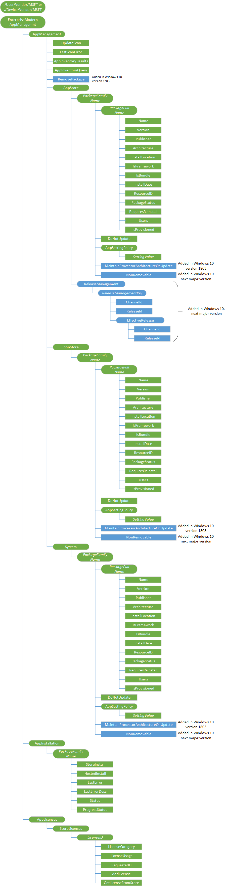

# EnterpriseModernAppManagement CSP

> [!WARNING]
> Some information relates to prereleased product which may be substantially modified before it's commercially released. Microsoft makes no warranties, express or implied, with respect to the information provided here.

The EnterpriseModernAppManagement configuration service provider (CSP) is used for the provisioning and reporting of modern enterprise apps. For details about how to use this CSP to for reporting apps inventory, installation and removal of apps for users, provisioning apps to devices, and managing app licenses, see [Enterprise app management](enterprise-app-management.md).

> [!Note]
> Windows Holographic only supports per-user configuration of the EnterpriseModernAppManagement CSP.

The following image shows the EnterpriseModernAppManagement configuration service provider in tree format.



<a href="" id="device-or-user-context"></a>**Device or User context**  
For user context, use **./User/Vendor/MSFT** path and for device context, use **./Device/Vendor/MSFT** path.

> [!Note]
> Windows Holographic and Windows 10 Mobile only support per-user configuration of the EnterpriseModernAppManagement CSP.

<a href="" id="appmanagement"></a>**AppManagement**  
Required. Used for inventory and app management (post-install).

<a href="" id="appmanagement-updatescan"></a>**AppManagement/UpdateScan**  
Required. Used to start the Windows Update scan.

Supported operation is Execute.

<a href="" id="appmanagement-lastscanerror"></a>**AppManagement/LastScanError**  
Required. Reports the last error code returned by the update scan.

Supported operation is Get.

<a href="" id="appmanagement-appinventoryresults"></a>**AppManagement/AppInventoryResults**  
Added in Windows 10, version 1511. Required. Returns the results for app inventory that was created after the AppInventoryQuery operation.

Supported operation is Get.

Here's an example of AppInventoryResults operation.

``` syntax
<Get>
   <CmdID>11</CmdID>
   <Item>
      <Target>
         <LocURI>./User/Vendor/MSFT/EnterpriseModernAppManagement/AppManagement/AppInventoryResults</LocURI>
      </Target>
   </Item>
</Get>
```

<a href="" id="appmanagement-appinventoryquery"></a>**AppManagement/AppInventoryQuery**  
Added in Windows 10, version 1511. Required. Specifies the query for app inventory.

Query parameters:

-   Output - Specifies the parameters for the information returned in AppInventoryResults operation. Mutiple value must be separate by |. Valid values are:
    -   PackagesName - returns the *PackageFamilyName* and *PackageFullName* of the app. Default if nothing is specified.
    -   PackageDetails - returns all inventory attributes of the package. This includes all information from PackageNames parameter, but does not validate RequiresReinstall.
    -   RequiredReinstall - Validates the app status of the apps in the inventory query to determine if they require a reinstallation. This attribute may impact system performance depending on the number of apps installed. Requiring reinstall occurs when resource package updates or when the app is in a tampered state.
-   Source - specifies the app classification that aligns to the existing inventory nodes. You can use a specific filter or if no filter is specified then all sources will be returned. If no value is specified, all classifications are returned. Valid values are:
    -   AppStore - This classification is for apps that were acquired from Microsoft Store. These were apps directly installed from Microsoft Store or enterprise apps from Microsoft Store for Business.
    -   nonStore - This classification is for apps that were not acquired from the Microsoft Store.
    -   System - Apps that are part of the OS. You cannot uninstall these apps. This classification is read-only and can only be inventoried.
-   PackageTypeFilter - Specifies one or multiple types of packages you can use to query the user or device. Multiple values must be separated by |. Valid values are:

    -   Main - returns the main installed package.
    -   Bundle - returns installed bundle packages.
    -   Framework - returns installed framework packages.
    -   Resource - returns installed resources packages. Resources are either language, scale, or DirectX resources. They are parts of a bundle.
    -   XAP - returns XAP package types. This filter is not supported on devices other than Windows Mobile. 
    -   All - returns all package types.

    If no value is specified, the combination of Main, Bundle, and Framework are returned.

-   PackageFamilyName - specifies the name of a particular package. If you specify this parameter, it returns the Package Family name if the package contains this value.

    If you do not specify this value, then all packages are returned.

-   Publisher - specifies the publisher of a particular package. If you specify this parameter, it returns the publisher if the value exists in the Publisher field.

    If you do not specify this value, then all publishers are returned.


Supported operation is Get and Replace.

The following example sets the inventory query for the package names and checks the status for reinstallation for all main packages that are nonStore apps.

``` syntax
<Replace>
   <CmdID>10</CmdID>
   <Item>
      <Target>
         <LocURI>./User/Vendor/MSFT/EnterpriseModernAppManagement/AppManagement/AppInventoryQuery</LocURI>
      </Target>
      <Meta><Format xmlns="syncml:metinf">xml</Format></Meta>
      <Data><Inventory Output="PackageNames|RequiresReinstall" Source="nonStore" PackageTypeFilter="Main" /></Data>
   </Item>
</Replace>
```
<a href="" id="appmanagement-removepackage"></a>**AppManagement/RemovePackage**  
Added in Windows 10, version 1703. Used to remove packages. Not supported for ./User/Vendor/MSFT.

Parameters:
<ul>
   <li>Package
      <ul>
         <li>Name: Specifies the PackageFullName of the particular package to remove.</li>
         <li>RemoveForAllUsers: 
            <ul>
               <li>0 (default) – Package will be un-provisioned so that new users do not receive the package. The package will remain installed for current users. This is not currently supported.</li>
               <li>1 – Package will be removed for all users only if it is a provisioned package.</li>
            </ul>
         </li>
      </ul>
   </li>
   <li>User (optional): Specifies the SID of the particular user for whom to remove the package; only the package for the specified user can be removed.</li>
</ul>  
    
Supported operation is Execute.

The following example removes a package for all users:

````XML
<Exec>
   <CmdID>10</CmdID>
   <Item>
      <Target>
         <LocURI>./Device/Vendor/MSFT/EnterpriseModernAppManagement/AppManagement/RemovePackage</LocURI>
      </Target>
      <Meta><Format xmlns="syncml:metinf">xml</Format></Meta>
      <Data>
          <Package Name="{PackageFullName}" RemoveForAllUsers=1 />
      </Data>
   </Item>
</Exec>
````

<a href="" id="appmanagement-nonstore"></a>**AppManagement/nonStore**  
Used to manage enterprise apps or developer apps that were not acquired from the Microsoft Store.

Supported operation is Get.

<a href="" id="appmanagement-system"></a>**AppManagement/System**  
Reports apps installed as part of the operating system.

Supported operation is Get.

<a href="" id="appmanagement-appstore"></a>**AppManagement/AppStore**  
Required. Used for managing apps from the Microsoft Store.

Supported operations are Get and Delete.

<a href="" id="appmanagement-releasemanagement"></a>**AppManagement/AppStore/ReleaseManagement**  
Added in Windows 10, version 1809. Interior node for the managing updates through the Microsoft Store. These settings allow the IT admin to specify update channels for apps that they want their users to use for receiving updates. It allows the IT admin to assign a specific release to a smaller group for testing before the large deployment to the rest of the organization.

> [!Note]  
> ReleaseManagement settings only apply to updates through the Microsoft Store.

<a href="" id="appmanagement-releasemanagement-releasemanagementkey"></a>**AppManagement/AppStore/ReleaseManagement/_ReleaseManagementKey_**  
Added in Windows 10, version 1809. Identifier for the app or set of apps. If there is only one app, it is the PackageFamilyName. If it is for a set of apps, it is the PackageFamilyName of the main app.


<a href="" id="appmanagement-releasemanagement-releasemanagementkey-channelid"></a>**AppManagement/AppStore/ReleaseManagement/_ReleaseManagementKey_/ChannelId**  
Added in Windows 10, version 1809. Specifies the app channel ID.

Value type is string. Supported operations are Add, Get, Replace, and Delete.

<a href="" id="appmanagement-releasemanagement-releasemanagementkey-releasemanagementid"></a>**AppManagement/AppStore/ReleaseManagement/_ReleaseManagementKey_/ReleaseManagementId**  
Added in Windows 10, version 1809. The IT admin can specify a release ID to indicate a specific release they would like the user or device to be on.

Value type is string. Supported operations are Add, Get, Replace, and Delete.

<a href="" id="appmanagement-releasemanagement-releasemanagementkey-effectiverelease"></a>**AppManagement/AppStore/ReleaseManagement/_ReleaseManagementKey_/EffectiveRelease**  
Added in Windows 10, version 1809. Interior node used to specify the effective app release to use when multiple user policies are set on the device. The device policy or last user policy is used.

<a href="" id="appmanagement-releasemanagement-releasemanagementkey-effectiverelease-channelid"></a>**AppManagement/AppStore/ReleaseManagement/_ReleaseManagementKey_/EffectiveRelease/ChannelId**  
Added in Windows 10, version 1809. Returns the last user channel ID on the device.

Value type is string. Supported operation is Get.

<a href="" id="appmanagement-releasemanagement-releasemanagementkey-effectiverelease-releasemanagementid"></a>**AppManagement/AppStore/ReleaseManagement/_ReleaseManagementKey_/EffectiveRelease/ReleaseManagementId**  
Added in Windows 10, version 1809. Returns the last user release ID on the device.

Value type is string. Supported operation is Get.

<a href="" id="----packagefamilyname"></a>**.../****_PackageFamilyName_**  
Optional. Package family name (PFN) of the app. There is one for each PFN on the device when reporting inventory. These items are rooted under their signing origin.

Supported operations are Get and Delete.

> [!Note]
> XAP files use a product ID in place of PackageFamilyName. Here's an example of XAP product ID (including the braces), {12345678-9012-3456-7890-123456789012}.


Here's an example for uninstalling an app:

``` syntax
<SyncML xmlns="SYNCML:SYNCML1.2">
  <SyncBody>
        <!-- Uninstall app -->
        <delete>
           <CmdID>2</CmdID>
              <Item>
                 <Target>
                    <LocURI>./User/Vendor/MSFT/EnterpriseModernAppManagement/AppManagement/AppStore/%7b12345678-9012-3456-7890-123456789012%7D</LocURI>
                 </Target>
              </Item>
        </delete>
     <Final/>
  </SyncBody>
</SyncML>
```

<a href="" id="----packagefamilyname-packagefullname"></a>**.../*PackageFamilyName*/****_PackageFullName_**  
Optional. Full name of the package installed.

Supported operations are Get and Delete.

> [!Note]
> XAP files use a product ID in place of PackageFullName. Here's an example of XAP product ID (including the braces), {12345678-9012-3456-7890-123456789012}.

 
<a href="" id="----packagefamilyname-packagefullname-name"></a>**.../*PackageFamilyName*/*PackageFullName*/Name**  
Required. Name of the app. Value type is string.

Supported operation is Get.

<a href="" id="----packagefamilyname-packagefullname-version"></a>**.../*PackageFamilyName*/*PackageFullName*/Version**  
Required. Version of the app. Value type is string.

Supported operation is Get.

<a href="" id="----packagefamilyname-packagefullname-publisher"></a>**.../*PackageFamilyName*/*PackageFullName*/Publisher**  
Required. Publisher name of the app. Value type is string.

Supported operation is Get.

<a href="" id="----packagefamilyname-packagefullname-architecture"></a>**.../*PackageFamilyName*/*PackageFullName*/Architecture**  
Required. Architecture of installed package. Value type is string.

> [!Note]
> Not applicable to XAP files.

Supported operation is Get.

<a href="" id="----packagefamilyname-packagefullname-installlocation"></a>**.../*PackageFamilyName*/*PackageFullName*/InstallLocation**  
Required. Install location of the app on the device. Value type is string.

> [!Note]
> Not applicable to XAP files.
 
Supported operation is Get.

<a href="" id="----packagefamilyname-packagefullname-isframework"></a>**.../*PackageFamilyName*/*PackageFullName*/IsFramework**  
Required. Whether or not the app is a framework package. Value type is int. The value is 1 if the app is a framework package and 0 (zero) for all other cases.

> [!Note]
> Not applicable to XAP files.

 Supported operation is Get.

<a href="" id="----packagefamilyname-packagefullname-isbundle"></a>**.../*PackageFamilyName*/*PackageFullName*/IsBundle**  
Required. The value is 1 if the package is an app bundle and 0 (zero) for all other cases. Value type is int.

Supported operation is Get.

<a href="" id="----packagefamilyname-packagefullname-installdate"></a>**.../*PackageFamilyName*/*PackageFullName*/InstallDate**  
Required. Date the app was installed. Value type is string.

Supported operation is Get.

<a href="" id="----packagefamilyname-packagefullname-resourceid"></a>**.../*PackageFamilyName*/*PackageFullName*/ResourceID**  
Required. Resource ID of the app. This is null for the main app, ~ for a bundle, and contains resource information for resources packages. Value type is string.

> [!Note]
> Not applicable to XAP files.
 
Supported operation is Get.

<a href="" id="----packagefamilyname-packagefullname-packagestatus"></a>**.../*PackageFamilyName*/*PackageFullName*/PackageStatus**  
Required. Provides information about the status of the package. Value type is int. Valid values are:

-   OK (0) - The package is usable.
-   LicenseIssue (1) - The license of the package is not valid.
-   Modified (2) - The package payload was modified by an unknown source.
-   Tampered (4) - The package payload was tampered intentionally.
-   Disabled (8) - The package is not available for use. It can still be serviced.

> [!Note]
> Not applicable to XAP files.

Supported operation is Get.

<a href="" id="----packagefamilyname-packagefullname-requiresreinstall"></a>**.../*PackageFamilyName*/*PackageFullName*/RequiresReinstall**  
Required. Specifies whether the package state has changed and requires a reinstallation of the app. This can occur when new app resources are required, such as when a device has a change in language preference or a new DPI. It can also occur of the package was corrupted. If the value is 1, reinstallation of the app is performed. Value type is int.

> [!Note]
> Not applicable to XAP files.
 
Supported operation is Get.

<a href="" id="----packagefamilyname-packagefullname-users"></a>**.../*PackageFamilyName*/*PackageFullName*/Users**  
Required. Registered users of the app and the package install state. If the query is at the device level, it returns all the registered users of the device. If you query the user context, it will only return the current user. Value type is string.

-   Not Installed = 0
-   Staged = 1
-   Installed = 2
-   Paused = 6

Supported operation is Get.

<a href="" id="----packagefamilyname-packagefullname-isprovisioned"></a>**.../*PackageFamilyName*/*PackageFullName*/IsProvisioned**  
Required. The value is 0 or 1 that indicates if the app is provisioned on the device. The value type is int.

Supported operation is Get.

<a href="" id="----packagefamilyname-donotupdate"></a>**.../*PackageFamilyName*/DoNotUpdate**  
Required. Specifies whether you want to block a specific app from being updated via auto-updates.

Supported operations are Add, Get, Delete, and Replace.

<a href="" id="----packagefamilyname-appsettingpolicy---only-for---user-vendor-msft-"></a>**.../*PackageFamilyName*/AppSettingPolicy** (only for ./User/Vendor/MSFT)  
Added in Windows 10, version 1511. Interior node for all managed app setting values. This node is only supported in the user context.

<a href="" id="----packagefamilyname-appsettingpolicy-settingvalue---only-for---user-vendor-msft-"></a>**.../*PackageFamilyName*/AppSettingPolicy/****_SettingValue_** (only for ./User/Vendor/MSFT)  
Added in Windows 10, version 1511. The *SettingValue* and data represent a key value pair to be configured for the app. The node represents the name of the key and the data represents the value. You can find this value in LocalSettings in the Managed.App.Settings container.

This setting only works for apps that support the feature and it is only supported in the user context.

Value type is string. Supported operations are Add, Get, Replace, and Delete.

The following example sets the value for the 'Server'

``` syntax
<!— Configure app settings -->
<Add>
   <CmdID>0</CmdID>
   <Item>
      <Target>
         <LocURI>./User/Vendor/MSFT/EnterpriseModernAppManagement/AppManagement/AppStore/PackageFamilyName/AppSettingPolicy/Server</LocURI>
      </Target>
      <Meta>
         <Format xmlns="syncml:metinf">chr</Format>
      </Meta>
      <Data>server1.contoso.com</Data>
   </Item>
</Add>
```

The following example gets all managed app settings for a specific app.

``` syntax
<!—Get app settings -->
<Get>
   <CmdID>0</CmdID>
   <Item>
      <Target>
         <LocURI>./User/Vendor/MSFT/EnterpriseModernAppManagement/AppManagement/AppStore/PackageFamilyName/AppSettingPolicy?list=StructData</LocURI>
      </Target>
   </Item>
</Get>
```

<a href="" id="----packagefamilyname-maintainprocessorarchitectureonupdate"></a>**.../_PackageFamilyName_/MaintainProcessorArchitectureOnUpdate**  
Added in Windows 10, version 1803. Specify whether on a AMD64 device, across an app update, the architecture of the installed app must not change. For example if you have the x86 flavor of a Windows app installed, with this setting enabled, across an update, the x86 flavor will be installed even when x64 flavor is available.

Supported operations are Add, Get, Delete, and Replace. Value type is integer.

Expected Behavior on an AMD64 machine that has x86 flavor of an app installed (Most restrictive wins).

|Applicability Setting |CSP state  |Result  |
|---------|---------|---------|
|True |Not configured     |X86 flavor is picked         |
|True |Enabled    |X86 flavor is picked         |
|True |Disabled         |X86 flavor is picked         |
|False (not set) |Not configured         |X64 flavor is picked          |

<a href="" id="----packagefamilyname-nonremovable"></a>**.../_PackageFamilyName_/NonRemovable**  
Added in Windows 10, version 1809. Specifies if an app is nonremovable by the user. 

This setting allows the IT admin to set an app to be nonremovable, or unable to be uninstalled by a user. This is useful in enterprise and education scenarios, where the IT admin might want to ensure that everyone always has certain apps and they won't be removed accidentally. This is also useful when there are multiple users per device, and you want to ensure that one user doesn’t remove it for all users.  

NonRemovable requires admin permission. This can only be set per device, not per user. You can query the setting using AppInventoryQuery or AppInventoryResults.

Value type is integer. Supported operations are Add, Get, and Replace.

Valid values:  
-	0 – app is not in the nonremovable app policy list
-	1 – app is included in the nonremovable app policy list

**Examples:**

Add an app to the nonremovable app policy list 
```
<SyncML xmlns="SYNCML:SYNCML1.2">  
    <SyncBody> 
        <Add> 
            <CmdID>1</CmdID> 
            <Item> 
                <Target> 
                    <LocURI>./Device/Vendor/MSFT/EnterpriseModernAppManagement/AppManagement/AppStore/PackageFamilyName/NonRemovable</LocURI> 
                </Target> 
                <Meta> 
                    <Format xmlns="syncml:metinf">int</Format> 
                </Meta> 
                <Data>1</Data> 
            </Item> 
        </Add> 
        <Final/> 
      </SyncBody> 
</SyncML> 
```

Get the status for a particular app  
```
<SyncML xmlns="SYNCML:SYNCML1.2"> 
    <SyncBody> 
        <Get> 
            <CmdID>1</CmdID> 
            <Item> 
                <Target> 
                    <LocURI>./Device/Vendor/MSFT/EnterpriseModernAppManagement/AppManagement/AppStore/PackageFamilyName/NonRemovable</LocURI> 
                </Target> 
            </Item> 
        </Get> 
        <Final/> 
    </SyncBody> 
</SyncML> 
```

Replace an app in the nonremovable app policy list  
Data 0 = app is not in the app policy list  
Data 1 = app is in the app policy list
```
<SyncML xmlns="SYNCML:SYNCML1.2"> 
    <SyncBody> 
        <Replace> 
            <CmdID>1</CmdID> 
            <Item> 
                <Target> 
                    <LocURI>./Device/Vendor/MSFT/EnterpriseModernAppManagement/AppManagement/AppStore/PackageFamilyName/NonRemovable</LocURI> 
                </Target> 
                <Meta> 
                    <Format xmlns="syncml:metinf">int</Format> 
                </Meta> 
                <Data>0</Data> 
            </Item> 
        </Replace> 
        <Final/> 
    </SyncBody> 
</SyncML> 
```

<a href="" id="appinstallation"></a>**AppInstallation**  
Required node. Used to perform app installation.

<a href="" id="appinstallation-packagefamilyname"></a>**AppInstallation/****_PackageFamilyName_**  
Optional node. Package family name (PFN) of the app. There is one for each PFN on the device when reporting inventory. These items are rooted under their signing origin.

Supported operations are Get and Add.

> [!Note]
> XAP files use a product ID in place of PackageFamilyName. Here's an example of XAP product ID (including the braces), {12345678-9012-3456-7890-123456789012}.

 
<a href="" id="appinstallation-packagefamilyname-storeinstall"></a>**AppInstallation/*PackageFamilyName*/StoreInstall**  
Required. Command to perform an install of an app and a license from the Microsoft Store.

Supported operation is Execute, Add, Delete, and Get.

<a href="" id="appinstallation-packagefamilyname-hostedinstall"></a>**AppInstallation/*PackageFamilyName*/HostedInstall**  
Required. Command to perform an install of an app package from a hosted location (this can be a local drive, a UNC, or https data source).

Supported operation is Execute, Add, Delete, and Get.

<a href="" id="appinstallation-packagefamilyname-lasterror"></a>**AppInstallation/*PackageFamilyName*/LastError**  
Required. Last error relating to the app installation.

Supported operation is Get.

> [!Note]
> This element is not present after the app is installed.

 

<a href="" id="appinstallation-packagefamilyname-lasterrordescription"></a>**AppInstallation/*PackageFamilyName*/LastErrorDescription**  
Required. Description of last error relating to the app installation.

Supported operation is Get.

> [!Note]
> This element is not present after the app is installed.

 
<a href="" id="appinstallation-packagefamilyname-status"></a>**AppInstallation/*PackageFamilyName*/Status**  
Required. Status of app installation. The following values are returned:

-   NOT\_INSTALLED (0) - The node was added, but the execution has not completed.
-   INSTALLING (1) - Execution has started, but the deployment has not completed. If the deployment completes regardless of success, this value is updated.
-   FAILED (2) - Installation failed. The details of the error can be found under LastError and LastErrorDescription.
-   INSTALLED (3) - Once an install is successful this node is cleaned up, however in the event the clean up action has not completed, this state may briefly appear.

Supported operation is Get.

> [!Note]
> This element is not present after the app is installed.

 
<a href="" id="appinstallation-packagefamilyname-progessstatus"></a>**AppInstallation/*PackageFamilyName*/ProgessStatus**  
Required. An integer the indicates the progress of the app installation. For https locations, this indicates the download progress. ProgressStatus is not available for provisioning and it is only for user-based installations. In provisioning, the value is always 0 (zero).

Supported operation is Get.

> [!Note]
> This element is not present after the app is installed.

 
<a href="" id="applicenses"></a>**AppLicenses**  
Required node. Used to manage licenses for app scenarios.

<a href="" id="applicenses-storelicenses"></a>**AppLicenses/StoreLicenses**  
Required node. Used to manage licenses for store apps.

<a href="" id="applicenses-storelicenses-licenseid"></a>**AppLicenses/StoreLicenses/****_LicenseID_**  
Optional node. License ID for a store installed app. The license ID is generally the PFN of the app.

Supported operations are Add, Get, and Delete.

<a href="" id="applicenses-storelicenses-licenseid-licensecategory"></a>**AppLicenses/StoreLicenses/*LicenseID*/LicenseCategory**  
Added in Windows 10, version 1511. Required. Category of license that is used to classify various license sources. Valid value:

-   Unknown - unknown license category
-   Retail - license sold through retail channels, typically from the Microsoft Store
-   Enterprise - license sold through the enterprise sales channel, typically from the Store for Business
-   OEM - license issued to an OEM
-   Developer - developer license, typically installed during the app development or side-loading scernarios.

Supported operation is Get.

<a href="" id="applicenses-storelicenses-licenseid-licenseusage"></a>**AppLicenses/StoreLicenses/*LicenseID*/LicenseUsage**  
Added in Windows 10, version 1511. Required. Indicates the allowed usage for the license. Valid values:

-   Unknown - usage is unknown
-   Online - the license is only valid for online usage. This is for applications with concurrence requirements, such as an app used on several computers, but can only be used on one at any given time.
-   Offline - license is valid for use offline. You don't need a connection to the internet to use this license.
-   Enterprise Root -

Supported operation is Get.

<a href="" id="applicenses-storelicenses-licenseid-requesterid"></a>**AppLicenses/StoreLicenses/*LicenseID*/RequesterID**  
Added in Windows 10, version 1511. Required. Identifier for the entity that requested the license, such as the client who acquired the license. For example, all licenses issued by the Store for Business for a particular enterprise client has the same RequesterID.

Supported operation is Get.

<a href="" id="applicenses-storelicenses-licenseid-addlicense"></a>**AppLicenses/StoreLicenses/*LicenseID*/AddLicense**  
Required. Command to add license.

Supported operation is Execute.

<a href="" id="applicenses-storelicenses-licenseid-getlicensefromstore"></a>**AppLicenses/StoreLicenses/*LicenseID*/GetLicenseFromStore**  
Added in Windows 10, version 1511. Required. Command to get license from the store.

Supported operation is Execute.

## Examples


For examples of how to use this CSP to for reporting apps inventory, installation and removal of apps for users, provisioning apps to devices, and managing app licenses, see [Enterprise app management](enterprise-app-management.md).

Query the device for a specific app subcategory, such as nonStore apps.

``` syntax
<Get>
  <CmdID>1</CmdID>
  <Item>
    <Target>
      <LocURI>./Device/Vendor/MSFT/EnterpriseModernAppManagement/AppManagement/nonStore</LocURI>
    </Target>
  </Item>
</Get>
```

The result contains a list of apps, such as \<Data>App1/App2/App\</Data\>.

Subsequent query for a specific app for its properties.

``` syntax
  
<Get>
   <CmdID>1</CmdID>
   <Item>
     <Target>
       <LocURI>./Device/Vendor/MSFT/EnterpriseModernAppManagement/AppManagement/nonStore/App1?list=StructData</LocURI>
     </Target>
   </Item>
</Get>
<Get>
  <CmdID>2</CmdID>
  <Item>
    <Target>
      <LocURI>./Device/Vendor/MSFT/EnterpriseModernAppManagement/AppManagement/nonStore/App2?list=StructData</LocURI>
    </Target>
  </Item>
</Get>
```

## Related topics

[Configuration service provider reference](configuration-service-provider-reference.md)

 

 


