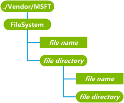

# FileSystem CSP

The FileSystem configuration service provider is used to query, add, modify, and delete files, file directories, and file attributes on the mobile device. It can retrieve information about or manage files in ROM, files in persistent store and files on any removable storage card that is present in the device. It works for files that are hidden from the user as well as those that are visible to the user.

> **Note**  FileSystem CSP is only supported in Windows 10 Mobile.

 

> **Note**   This configuration service provider requires the ID\_CAP\_CSP\_FOUNDATION and ID\_CAP\_CSP\_OEM capabilities to be accessed from a network configuration application.

 

The following diagram shows the FileSystem configuration service provider management object in tree format as used by OMA DM. The OMA Client Provisioning protocol is not supported by this configuration service provider.

**FileSystem**  
Required. Defines the root of the file system management object. It functions as the root directory for file system queries.

Recursive queries or deletes are not supported for this element. Add commands will add a new file or directory under the root path.

The following properties are supported for the root node:

-   `Name`: The root node name. The Get command is the only supported command.

-   `Type`: The MIME type of the file, which is com.microsoft/windowsmobile/1.1/FileSystemMO. The Get command is the only supported command.

-   `Format`: The format, which is `node`. The Get command is the only supported command.

-   `TStamp`: A standard OMA property that indicates the last time the file directory was changed. The value is represented by a string containing a UTC based, ISO 8601 basic format, complete representation of a date and time value, e.g. 20010711T163817Z means July 11, 2001 at 16 hours, 38 minutes and 17 seconds. The Get command is the only supported command.

-   `Size`: Not supported.

-   `msft:SystemAttributes`: A custom property that contains file directory attributes. This value is an integer bit mask that corresponds to the FILE\_ATTRIBUTE values and flags defined in the header file winnt.h. This supports the Get command and the Replace command.

***file directory***  
Optional. Returns the name of a directory in the device file system. Any *file directory* element can contain directories and files as child elements.

The Get command returns the name of the file directory. The Get command with `?List=Struct` will recursively return all child element names (including sub-directory names). The Get command with `?list=StructData` query is not supported and returns a 406 error code.

The Add command is used to create a new directory. Adding a new directory under the file system root is not supported and returns a 405 error code.

The Replace command is not supported.

The Delete command is used to delete all files and subfolders under this *file directory*.

The following properties are supported for file directories:

-   `Name`: The file directory name. The Get command is the only supported command.

-   `Type`: The MIME type of the file, which an empty string for directories that are not the root node. The Get command is the only supported command.

-   `Format`: The format, which is `node`. The Get command is the only supported command.

-   `TStamp`: A standard OMA property that indicates the last time the file directory was changed. The value is represented by a string containing a UTC based, ISO 8601 basic format, complete representation of a date and time value, e.g. 20010711T163817Z means July 11, 2001 at 16 hours, 38 minutes and 17 seconds. The Get command is the only supported command.

-   `Size`: Not supported.

-   `msft:SystemAttributes`: A custom property that contains file directory attributes. This value is an integer bit mask that corresponds to the FILE\_ATTRIBUTE values and flags defined in the header file winnt.h. This supports the Get command and the Replace command.

***file name***  
Optional. Return a file in binary format. If the file is too large for the configuration service to return, it returns error code 413 (Request entity too large) instead.

The Delete command deletes the file.

The Replace command updates an entire file with new file contents.

The Add command adds the file to the file directory

The Get command is not supported on a *file name* element, only on the properties of the element.

The following properties are supported for files:

-   `Name`: The file name. The Get command is the only supported command.

-   `Type`: The MIME type of the file. This value is always set to the generic MIME type: `application/octet-stream`. The Get command is the only supported command.

-   `Format`: The format, which is b64 encoded for binary data is sent over XML, and bin format for binary data sent over wbxml. The Get command is the only supported command.

-   `TStamp`: A standard OMA property that indicates the last time the file was changed. The value is represented by a string containing a UTC based, ISO 8601 basic format, complete representation of a date and time value, e.g. 20010711T163817Z means July 11, 2001 at 16 hours, 38 minutes and 17 seconds. The Get command is the only supported command.

-   `Size`: The unencoded file content size in bytes. The Get command is the only supported command.

-   `msft:SystemAttributes`: A custom property that contains file attributes. This value is an integer bit mask that corresponds to the FILE\_ATTRIBUTE values and flags defined in the header file winnt.h. This supports the Get command and the Replace command.

## Related topics

[Configuration service provider reference](configuration-service-provider-reference.md)

 

 

