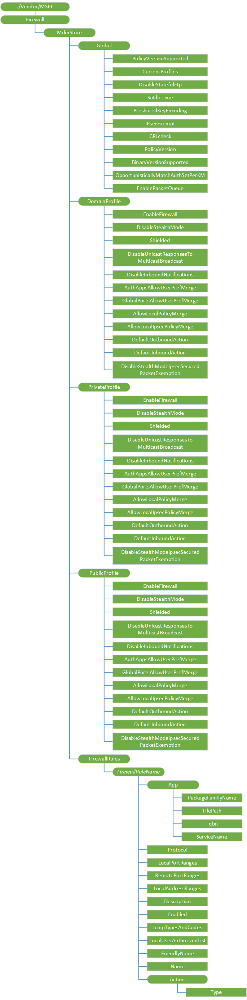

# Firewall CSP


The Firewall configuration service provider (CSP) allows the mobile device management (MDM) server to configure the Windows Defender Firewall global settings, per profile settings, as well as the desired set of custom rules to be enforced on the device.  Using the Firewall CSP the IT admin can now manage non-domain devices, and reduce the risk of network security threats across all systems connecting to the corporate network.  This CSP was added Windows 10, version 1709.
 
Firewall rules in the FirewallRules section must be wrapped in an Atomic block in SyncML, either individually or collectively.

For detailed information on some of the fields below see [[MS-FASP]: Firewall and Advanced Security Protocol documentation](https://msdn.microsoft.com/library/mt620101.aspx).

The following diagram shows the Firewall configuration service provider in tree format. 



<a href="" id="--vendor-msft-applocker"></a>**./Vendor/MSFT/Firewall**
<p style="margin-left: 20px">Root node for the Firewall configuration service provider.</p>

<a href="" id="mdmstore"></a>**MdmStore**
<p style="margin-left: 20px">Interior node.</p>
<p style="margin-left: 20px">Supported operation is Get.</p>

<a href="" id="global"></a>**MdmStore/Global**
<p style="margin-left: 20px">Interior node.</p>
<p style="margin-left: 20px">Supported operations are Get. </p>

<a href="" id="policyversionsupported"></a>**MdmStore/Global/PolicyVersionSupported**
<p style="margin-left: 20px">Integer value that contains the maximum policy version that the server host can accept. The version number is two octets in size. The lowest-order octet is the minor version; the second-to-lowest octet is the major version. This value is not merged and is always a fixed value for a particular firewall and advanced security components software build.</p>
<p style="margin-left: 20px">Value type in integer. Supported operation is Get.</p>

<a href="" id="currentprofiles"></a>**MdmStore/Global/CurrentProfiles**
<p style="margin-left: 20px">Integer value that contains a bitmask of the current enforced profiles that are maintained by the server firewall host. See [FW_PROFILE_TYPE](https://msdn.microsoft.com/library/cc231559.aspx) for the bitmasks that are used to identify profile types. This value is available only in the dynamic store; therefore, it is not merged and has no merge law.</p>
<p style="margin-left: 20px">Value type in integer. Supported operation is Get.</p>

<a href="" id="disablestatefulftp"></a>**MdmStore/Global/DisableStatefulFtp**
<p style="margin-left: 20px">Boolean value. If false, the firewall performs stateful File Transfer Protocol (FTP) filtering to allow secondary connections. True means stateful FTP is disabled. The merge law for this option is to let "true" values win.</p>
<p style="margin-left: 20px">Default value is false.</p>
<p style="margin-left: 20px">Data type is bool. Supported operations are Add, Get, Replace, and Delete. </p>

<a href="" id="saidletime"></a>**MdmStore/Global/SaIdleTime**
<p style="margin-left: 20px">This value configures the security association idle time, in seconds. Security associations are deleted after network traffic is not seen for this specified period of time. The value is integer and MUST be in the range of 300 to 3,600 inclusive. The merge law for this option is to let the value of the GroupPolicyRSoPStore win if it is configured; otherwise, use the local store value.</p>
<p style="margin-left: 20px">Default value is 300.</p>
<p style="margin-left: 20px">Value type is integer. Supported operations are Add, Get, Replace, and Delete.</p>

<a href="" id="presharedkeyencoding"></a>**MdmStore/Global/PresharedKeyEncoding**
<p style="margin-left: 20px">Specifies the preshared key encoding that is used. The value is integer and MUST be a valid value from the [PRESHARED_KEY_ENCODING_VALUES enumeration](https://msdn.microsoft.com/library/cc231525.aspx). The merge law for this option is to let the value of the GroupPolicyRSoPStore win if it is configured; otherwise, use the local store value.</p>
<p style="margin-left: 20px">Default value is 1.</p>
<p style="margin-left: 20px">Value type is integer. Supported operations are Add, Get, Replace, and Delete.</p>

<a href="" id="ipsecexempt"></a>**MdmStore/Global/IPsecExempt**
<p style="margin-left: 20px">This value configures IPsec exceptions. The value is integer and MUST be a combination of the valid flags that are defined in [IPSEC_EXEMPT_VALUES](https://msdn.microsoft.com/library/cc231523.aspx); therefore, the maximum value MUST always be IPSEC_EXEMPT_MAX-1 for servers supporting a schema version of 0x0201 and IPSEC_EXEMPT_MAX_V2_0-1 for servers supporting a schema version of 0x0200. If the maximum value is exceeded when the method RRPC_FWSetGlobalConfig (Opnum 4) is called, the method returns ERROR_INVALID_PARAMETER. This error code is returned if no other preceding error is discovered. The merge law for this option is to let the value of the GroupPolicyRSoPStore win if it is configured; otherwise, use the local store value.</p>
<p style="margin-left: 20px">Default value is 0.</p>
<p style="margin-left: 20px">Value type is integer. Supported operations are Add, Get, Replace, and Delete.</p>

<a href="" id="crlcheck"></a>**MdmStore/Global/CRLcheck**
<p style="margin-left: 20px">This value specifies how certificate revocation list (CRL) verification is enforced. The value is integer and MUST be 0, 1, or 2. The merge law for this option is to let the value of the GroupPolicyRSoPStore win if it is configured; otherwise, use the local store value. Valid valued:</p>
<ul>
<li>0 disables CRL checking</li>
<li>1 specifies that CRL checking is attempted and that certificate validation fails only if the certificate is revoked. Other failures that are encountered during CRL checking (such as the revocation URL being unreachable) do not cause certificate validation to fail.</li>
<li>2 means that checking is required and that certificate validation fails if any error is encountered during CRL processing</li>
</ul>
<p style="margin-left: 20px">Default value is 0.</p>
<p style="margin-left: 20px">Value type is integer. Supported operations are Add, Get, Replace, and Delete.</p>

<a href="" id="policyversion"></a>**MdmStore/Global/PolicyVersion**
<p style="margin-left: 20px">This value contains the policy version of the policy store being managed. This value is not merged and therefore, has no merge law.</p>
<p style="margin-left: 20px">Value type is string. Supported operation is Get.</p>

<a href="" id="binaryversionsupported"></a>**MdmStore/Global/BinaryVersionSupported**
<p style="margin-left: 20px">This value contains the binary version of the structures and data types that are supported by the server. This value is not merged. In addition, this value is always a fixed value for a specific firewall and advanced security component's software build. This value identifies a policy configuration option that is supported only on servers that have a schema version of 0x0201.</p>
<p style="margin-left: 20px">Value type is string. Supported operation is Get.</p>

<a href="" id="opportunisticallymatchauthsetperkm"></a>**MdmStore/Global/OpportunisticallyMatchAuthSetPerKM**
<p style="margin-left: 20px">This value is bool used as an on/off switch. When this option is false (off), keying modules MUST ignore the entire authentication set if they do not support all of the authentication suites specified in the set. When this option is true (on), keying modules MUST ignore only the authentication suites that they don’t support. For schema versions 0x0200, 0x0201, and 0x020A, this value is invalid and MUST NOT be used.</p>
<p style="margin-left: 20px">Boolean value. Supported operations are Add, Get, Replace, and Delete.</p>

<a href="" id="enablepacketqueue"></a>**MdmStore/Global/EnablePacketQueue**
<p style="margin-left: 20px">This value specifies how scaling for the software on the receive side is enabled for both the encrypted receive and clear text forward path for the IPsec tunnel gateway scenario. Use of this option also ensures that the packet order is preserved. The data type for this option value is integer and is a combination of flags. Valid values:</p>

<ul>
<li>0x00 indicates that all queuing is to be disabled</li>
<li>0x01 specifies that inbound encrypted packets are to be queued</li>
<li>0x02 specifies that packets are to be queued after decryption is performed for forwarding</li>
</ul>

<p style="margin-left: 20px">Default value is 0.</p>
<p style="margin-left: 20px">Value type is integer. Supported operations are Add, Get, Replace, and Delete.</p>

<a href="" id="domainprofile"></a>**MdmStore/DomainProfile**
<p style="margin-left: 20px">Interior node. Supported operation is Get.</p>

<a href="" id="privateprofile"></a>**MdmStore/PrivateProfile**
<p style="margin-left: 20px">Interior node. Supported operation is Get.</p>

<a href="" id="publicprofile"></a>**MdmStore/PublicProfile**
<p style="margin-left: 20px">Interior node. Supported operation is Get.</p>

<a href="" id="enablefirewall"></a>**/EnableFirewall**
<p style="margin-left: 20px">Boolean value for the firewall and advanced security enforcement. If this value is false, the server MUST NOT block any network traffic, regardless of other policy settings. The merge law for this option is to let the value of the GroupPolicyRSoPStore win if it is configured; otherwise, the local store value is used.</p>
<p style="margin-left: 20px">Default value is true.</p>
<p style="margin-left: 20px">Value type is bool. Supported operations are Add, Get and Replace.</p>

<a href="" id="disablestealthmode"></a>**/DisableStealthMode**
<p style="margin-left: 20px">Boolean value. When this option is false, the server operates in stealth mode. The firewall rules used to enforce stealth mode are implementation-specific. The merge law for this option is to let the value of the GroupPolicyRSoPStore win if it is configured; otherwise, the local store value is used.</p>
<p style="margin-left: 20px">Default value is false.</p>
<p style="margin-left: 20px">Value type is bool. Supported operations are Add, Get and Replace.</p>

<a href="" id="shielded"></a>**/Shielded**
<p style="margin-left: 20px">Boolean value. If this value is true and EnableFirewall is on, the server MUST block all incoming traffic regardless of other policy settings. The merge law for this option is to let "true" values win.</p>
<p style="margin-left: 20px">Default value is false.</p>
<p style="margin-left: 20px">Value type is bool. Supported operations are Get and Replace.</p>

<a href="" id="disableunicastresponsestomulticastbroadcast"></a>**/DisableUnicastResponsesToMulticastBroadcast**
<p style="margin-left: 20px">Boolean value. If it is true, unicast responses to multicast broadcast traffic is blocked. The merge law for this option is to let the value of the GroupPolicyRSoPStore win if it is configured; otherwise, the local store value is used.</p>
<p style="margin-left: 20px">Default value is false.</p>
<p style="margin-left: 20px">Value type is bool. Supported operations are Add, Get and Replace.</p>

<a href="" id="disableinboundnotifications"></a>**/DisableInboundNotifications**
<p style="margin-left: 20px">Boolean value. If this value is false, the firewall MAY display a notification to the user when an application is blocked from listening on a port.  If this value is on, the firewall MUST NOT display such a notification. The merge law for this option is to let the value of the GroupPolicyRSoPStore win if it is configured; otherwise, the local store value is used.</p>
<p style="margin-left: 20px">Default value is false.</p>
<p style="margin-left: 20px">Value type is bool. Supported operations are Add, Get and Replace.</p>

<a href="" id="authappsallowuserprefmerge"></a>**/AuthAppsAllowUserPrefMerge**
<p style="margin-left: 20px">Boolean value. If this value is false, authorized application firewall rules in the local store are ignored and not enforced. The merge law for this option is to let the value of the GroupPolicyRSoPStore win if it is configured; otherwise, the local store value is used.</p>
<p style="margin-left: 20px">Default value is true.</p>
<p style="margin-left: 20px">Value type is bool. Supported operations are Add, Get and Replace.</p>

<a href="" id="globalportsallowuserprefmerge"></a>**/GlobalPortsAllowUserPrefMerge**
<p style="margin-left: 20px">Boolean value. If this value is false, global port firewall rules in the local store are ignored and not enforced. The setting only has meaning if it is set or enumerated in the Group Policy store or if it is enumerated from the GroupPolicyRSoPStore. The merge law for this option is to let the value GroupPolicyRSoPStore win if it is configured; otherwise, the local store value is used.</p>
<p style="margin-left: 20px">Default value is true.</p>
<p style="margin-left: 20px">Value type is bool. Supported operations are Add, Get and Replace.</p>

<a href="" id="allowlocalpolicymerge"></a>**/AllowLocalPolicyMerge**
<p style="margin-left: 20px">Boolean value. If this value is false, firewall rules from the local store are ignored and not enforced. The merge law for this option is to always use the value of the GroupPolicyRSoPStore. This value is valid for all schema versions.</p>
<p style="margin-left: 20px">Default value is true.</p>
<p style="margin-left: 20px">Value type is bool. Supported operations are Add, Get and Replace.</p>

<a href="" id="allowlocalipsecpolicymerge"></a>**/AllowLocalIpsecPolicyMerge**
<p style="margin-left: 20px">Boolean value. If this value is false, connection security rules from the local store are ignored and not enforced, regardless of the schema version and connection security rule version. The merge law for this option is to always use the value of the GroupPolicyRSoPStore.</p>
<p style="margin-left: 20px">Default value is true.</p>
<p style="margin-left: 20px">Value type is bool. Supported operations are Add, Get and Replace.</p>

<a href="" id="defaultoutboundaction"></a>**/DefaultOutboundAction**
<p style="margin-left: 20px">This value is the action that the firewall does by default (and evaluates at the very end) on outbound connections. The merge law for this option is to let the value of the GroupPolicyRSoPStore win if it is configured; otherwise, the local store value is used. DefaultOutboundAction will block all outbound traffic unless it is explicitly specified not to block.</p>
<ul>
<li>0x00000000 - allow</li>
<li>0x00000001 - block</li>
</ul>
<p style="margin-left: 20px">Default value is 0 (allow).</p>
<p style="margin-left: 20px">Value type is integer. Supported operations are Add, Get and Replace.</p>

Sample syncxml to provision the firewall settings to evaluate

``` syntax
<?xml version="1.0" encoding="utf-8"?>
<SyncML xmlns="SYNCML:SYNCML1.1">
<SyncBody>
    <!-- Block Outbound by default -->
    <Add>
      <CmdID>2010</CmdID>
      <Item>
        <Target>
          <LocURI>./Vendor/MSFT/Firewall/MdmStore/DomainProfile/DefaultOutboundAction</LocURI>
        </Target>
        <Meta>
          <Format xmlns="syncml:metinf">int</Format>
        </Meta>
        <Data>1</Data>
      </Item>
    </Add>
<Final/>
</SyncBody>
</SyncML>

```
<a href="" id="defaultinboundaction"></a>**/DefaultInboundAction**
<p style="margin-left: 20px">This value is the action that the firewall does by default (and evaluates at the very end) on inbound connections. The merge law for this option is to let the value of the GroupPolicyRSoPStore.win if it is configured; otherwise, the local store value is used.</p>
<ul>
<li>0x00000000 - allow</li>
<li>0x00000001 - block</li>
</ul>
<p style="margin-left: 20px">Default value is 1 (block).</p>
<p style="margin-left: 20px">Value type is integer. Supported operations are Add, Get and Replace.</p>

<a href="" id="disablestealthmodeipsecsecuredpacketexemption"></a>**/DisableStealthModeIpsecSecuredPacketExemption**
<p style="margin-left: 20px">Boolean value. This option is ignored if DisableStealthMode is true. Otherwise, when this option is true, the firewall's stealth mode rules MUST NOT prevent the host computer from responding to unsolicited network traffic if that traffic is secured by IPsec. The merge law for this option is to let the value of the GroupPolicyRSoPStore win if it is configured; otherwise, the local store value is used. For schema versions 0x0200, 0x0201, and 0x020A, this value is invalid and MUST NOT be used.</p>
<p style="margin-left: 20px">Default value is true.</p>
<p style="margin-left: 20px">Value type is bool. Supported operations are Add, Get and Replace.</p>

<a href="" id="firewallrules"></a>**FirewallRules**
<p style="margin-left: 20px">A list of rules controlling traffic through the Windows Firewall.  Each Rule ID is OR'ed.  Within each rule ID each Filter type is AND'ed.</p>

<a href="" id="firewallrulename"></a>**FirewallRules/_FirewallRuleName_**
<p style="margin-left: 20px">Unique alpha numeric identifier for the rule.  The rule name must not include a forward slash (/).</p>
<p style="margin-left: 20px">Supported operations are Add, Get, Replace, and Delete.</p>

<a href="" id="app"></a>**FirewallRules/_FirewallRuleName_/App**
<p style="margin-left: 20px">Rules that control connections for an app, program, or service. Specified based on the intersection of the following nodes:</p>
<ul>
<li>PackageFamilyName</li>
<li>FilePath</li>
<li>FQBN</li>
<li>ServiceName</li>
</ul>
<p style="margin-left: 20px">If not specified, the default is All.</p>
<p style="margin-left: 20px">Supported operation is Get.</p>

<a href="" id="packagefamilyname"></a>**FirewallRules/_FirewallRuleName_/App/PackageFamilyName**
<p style="margin-left: 20px">This App/Id value represents the PackageFamilyName of the app. The PackageFamilyName is the unique name of a Microsoft Store application.</p>
<p style="margin-left: 20px">Value type is string. Supported operations are Add, Get, Replace, and Delete.</p>

<a href="" id="filepath"></a>**FirewallRules/_FirewallRuleName_/App/FilePath**
<p style="margin-left: 20px">This App/Id value represents the full file path of the app. For example, C:\Windows\System\Notepad.exe.</p>
<p style="margin-left: 20px">Value type is string. Supported operations are Add, Get, Replace, and Delete.</p>

<a href="" id="fqbn"></a>**FirewallRules/_FirewallRuleName_/App/Fqbn**
<p style="margin-left: 20px">Fully Qualified Binary Name</p>
<p style="margin-left: 20px">Value type is string. Supported operations are Add, Get, Replace, and Delete.</p>

<a href="" id="servicename"></a>**FirewallRules/_FirewallRuleName_/App/ServiceName**
<p style="margin-left: 20px">This is a service name used in cases when a service, not an application, is sending or receiving traffic.</p>
<p style="margin-left: 20px">Value type is string. Supported operations are Add, Get, Replace, and Delete.</p>

<a href="" id="protocol"></a>**FirewallRules/_FirewallRuleName_/Protocol**
<p style="margin-left: 20px">0-255 number representing the ip protocol (TCP = 6, UDP = 17)</p>
<p style="margin-left: 20px">If not specified, the default is All.</p>
<p style="margin-left: 20px">Value type is integer. Supported operations are Add, Get, Replace, and Delete.</p>

<a href="" id="localportranges"></a>**FirewallRules/_FirewallRuleName_/LocalPortRanges**
<p style="margin-left: 20px">Comma separated list of ranges. For example, 100-120,200,300-320.</p>
<p style="margin-left: 20px">If not specified, the default is All.</p>
<p style="margin-left: 20px">Value type is string. Supported operations are Add, Get, Replace, and Delete.</p>

<a href="" id="remoteportranges"></a>**FirewallRules/_FirewallRuleName_/RemotePortRanges**
<p style="margin-left: 20px">Comma separated list of ranges, For example, 100-120,200,300-320.</p>
<p style="margin-left: 20px">If not specified, the default is All.</p>
<p style="margin-left: 20px">Value type is string. Supported operations are Add, Get, Replace, and Delete.</p>

<a href="" id="localaddressranges"></a>**FirewallRules/_FirewallRuleName_/LocalAddressRanges**
<p style="margin-left: 20px">Comma separated list of local addresses covered by the rule. The default value is "\*". Valid tokens include:</p>
<ul>
<li>"\*" indicates any local address. If present, this must be the only token included.</li>
<li>A subnet can be specified using either the subnet mask or network prefix notation. If neither a subnet mask not a network prefix is specified, the subnet mask defaults to 255.255.255.255.</li>
<li>A valid IPv6 address.</li>
<li>An IPv4 address range in the format of "start address - end address" with no spaces included.</li>
<li>An IPv6 address range in the format of "start address - end address" with no spaces included.</li>
</ul>
<p style="margin-left: 20px">If not specified, the default is All.</p>
<p style="margin-left: 20px">Value type is string. Supported operations are Add, Get, Replace, and Delete.</p>

<a href="" id="remoteaddressranges"></a>**FirewallRules/_FirewallRuleName_/RemoteAddressRanges**
<p style="margin-left: 20px">List of comma separated tokens specifying the remote addresses covered by the rule. The default value is "\*". Valid tokens include:</p>
<ul>
<li>"\*" indicates any remote address. If present, this must be the only token included.</li>
<li>"Defaultgateway"</li>
<li>"DHCP"</li>
<li>"DNS"</li>
<li>"WINS"</li>
<li>"Intranet"</li>
<li>"RmtIntranet"</li>
<li>"Internet"</li>
<li>"Ply2Renders"</li>
<li>"LocalSubnet" indicates any local address on the local subnet. This token is not case-sensitive.</li>
<li>A subnet can be specified using either the subnet mask or network prefix notation. If neither a subnet mask not a network prefix is specified, the subnet mask defaults to 255.255.255.255.</li>
<li>A valid IPv6 address.</li>
<li>An IPv4 address range in the format of "start address - end address" with no spaces included.</li>
<li>An IPv6 address range in the format of "start address - end address" with no spaces included.</li>
</ul>
<p style="margin-left: 20px">If not specified, the default is All.</p>
<p style="margin-left: 20px">Value type is string. Supported operations are Add, Get, Replace, and Delete.</p>
<p style="margin-left: 20px">The tokens "Intranet", "RmtIntranet", "Internet" and "Ply2Renders" are supported on Windows 10, version 1809, and later.</p>

<a href="" id="description"></a>**FirewallRules/_FirewallRuleName_/Description**
<p style="margin-left: 20px">Specifies the description of the rule.</p>
<p style="margin-left: 20px">Value type is string. Supported operations are Add, Get, Replace, and Delete.</p>

<a href="" id="enabled"></a>**FirewallRules/_FirewallRuleName_/Enabled**
<p style="margin-left: 20px">Indicates whether the rule is enabled or disabled. If the rule must be enabled, this value must be set to true.
<p style="margin-left: 20px">If not specified - a new rule is enabled by default.</p>
<p style="margin-left: 20px">Boolean value. Supported operations are Get and Replace.</p>

<a href="" id="profiles"></a>**FirewallRules/_FirewallRuleName_/Profiles**
<p style="margin-left: 20px">Specifies the profiles to which the rule belongs: Domain, Private, Public. .  See [FW_PROFILE_TYPE](https://msdn.microsoft.com/library/cc231559.aspx) for the bitmasks that are used to identify profile types.</p>
<p style="margin-left: 20px">If not specified, the default is All.</p>
<p style="margin-left: 20px">Value type is integer. Supported operations are Get and Replace.</p>

<a href="" id="action"></a>**FirewallRules/_FirewallRuleName_/Action**
<p style="margin-left: 20px">Specifies the action for the rule.</p>
<p style="margin-left: 20px">Supported operation is Get.</p>

<a href="" id="type"></a>**FirewallRules/_FirewallRuleName_/Action/Type**
<p style="margin-left: 20px">Specifies the action the rule enforces. Supported values:</p>
<ul>
<li>0 - Block</li>
<li>1 - Allow</li>
</ul>
<p style="margin-left: 20px">If not specified, the default is allow.</p>
<p style="margin-left: 20px">Value type is integer. Supported operations are Get and Replace.</p>

<a href="" id="direction"></a>**FirewallRules/_FirewallRuleName_/Direction**
<p style="margin-left: 20px">The rule is enabled based on the traffic direction as following. Supported values:</p>
<ul>
<li>IN - the rule applies to inbound traffic.</li>
<li>OUT - the rule applies to outbound traffic.</li>
<li>If not specified, the default is Out.</li>
</ul>
<p style="margin-left: 20px">Value type is string. Supported operations are Get and Replace.</p>

<a href="" id="interfacetypes"></a>**FirewallRules/_FirewallRuleName_/InterfaceTypes**
<p style="margin-left: 20px">Comma separated list of interface types. Valid values:</p>
<ul>
<li>RemoteAccess</li>
<li>Wireless</li>
<li>Lan</li>
</ul>
<p style="margin-left: 20px">If not specified, the default is All.</p>
<p style="margin-left: 20px">Value type is string. Supported operations are Get and Replace.</p>

<a href="" id="edgetraversal"></a>**FirewallRules/_FirewallRuleName_/EdgeTraversal**
<p style="margin-left: 20px">Indicates whether edge traversal is enabled or disabled for this rule.</p>
<p style="margin-left: 20px">The EdgeTraversal setting indicates that specific inbound traffic is allowed to tunnel through NATs and other edge devices using the Teredo tunneling technology. In order for this setting to work correctly, the application or service with the inbound firewall rule needs to support IPv6. The primary application of this setting allows listeners on the host to be globally addressable through a Teredo IPv6 address.</p>
<p style="margin-left: 20px">New rules have the EdgeTraversal property disabled by default.</p>
<p style="margin-left: 20px">Value type is bool. Supported operations are Add, Get, Replace, and Delete.</p>

<a href="" id="localuserauthorizedlist"></a>**FirewallRules/_FirewallRuleName_/LocalUserAuthorizationList**
<p style="margin-left: 20px">Specifies the list of authorized local users for this rule. This is a string in Security Descriptor Definition Language (SDDL) format.</p>
<p style="margin-left: 20px">Value type is string. Supported operations are Add, Get, Replace, and Delete.</p>

<a href="" id="status"></a>**FirewallRules/_FirewallRuleName_/Status**
<p style="margin-left: 20px">Provides information about the specific version of the rule in deployment for monitoring purposes.</p>
<p style="margin-left: 20px">Value type is string. Supported operation is Get.</p>

<a href="" id="name"></a>**FirewallRules/_FirewallRuleName_/Name**
<p style="margin-left: 20px">Name of the rule.</p>
<p style="margin-left: 20px">Value type is string. Supported operations are Add, Get, Replace, and Delete.</p>
