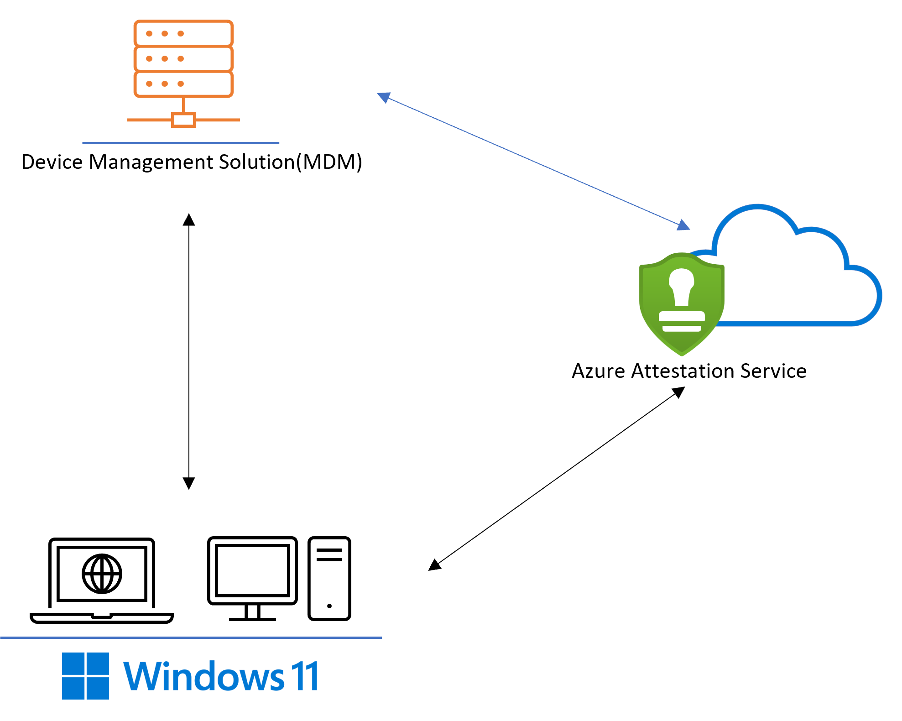

<!-- Auto-Generated CSP Document -->

<!-- HealthAttestation-Begin -->
# HealthAttestation CSP

<!-- HealthAttestation-Editable-Begin -->
<!-- Add any additional information about this policy here. Anything outside this section will get overwritten. -->
The Device HealthAttestation configuration service provider (DHA-CSP) enables enterprise IT administrators to assess if a device is booted to a trusted and compliant state, and to take enterprise policy actions.

The following list is a description of the functions performed by the Device HealthAttestation CSP:

- Collects device boot logs, Trusted Platform Module (TPM) audit trails and the TPM certificate (DHA-BootData) from a managed device
- Forwards DHA-BootData to a Device Health Attestation Service (DHA-Service)
- Receives an encrypted blob (DHA-EncBlob) from DHA-Service, and stores it in a local cache on the device
- Receives attestation requests (DHA-Requests) from a DHA-Enabled MDM, and replies with Device Health Attestation data (DHA-Data)
<!-- HealthAttestation-Editable-End -->

<!-- HealthAttestation-Tree-Begin -->
The following list shows the HealthAttestation configuration service provider nodes:

- ./Vendor/MSFT/HealthAttestation
  - [AttestStatus](#atteststatus)
  - [Certificate](#certificate)
  - [CorrelationID](#correlationid)
  - [CurrentProtocolVersion](#currentprotocolversion)
  - [ForceRetrieve](#forceretrieve)
  - [GetAttestReport](#getattestreport)
  - [GetServiceCorrelationIDs](#getservicecorrelationids)
  - [HASEndpoint](#hasendpoint)
  - [MaxSupportedProtocolVersion](#maxsupportedprotocolversion)
  - [Nonce](#nonce)
  - [PreferredMaxProtocolVersion](#preferredmaxprotocolversion)
  - [Status](#status)
  - [TpmReadyStatus](#tpmreadystatus)
  - [TriggerAttestation](#triggerattestation)
  - [VerifyHealth](#verifyhealth)
<!-- HealthAttestation-Tree-End -->

<!-- Device-AttestStatus-Begin -->
## AttestStatus

<!-- Device-AttestStatus-Applicability-Begin -->
| Scope | Editions | Applicable OS |
|:--|:--|:--|
| ✅ Device <br> ❌ User | ✅ Pro <br> ✅ Enterprise <br> ✅ Education <br> ✅ Windows SE <br> ✅ IoT Enterprise / IoT Enterprise LTSC | ✅ Windows 11, version 21H2 [10.0.22000] and later |
<!-- Device-AttestStatus-Applicability-End -->

<!-- Device-AttestStatus-OmaUri-Begin -->
```Device
./Vendor/MSFT/HealthAttestation/AttestStatus
```
<!-- Device-AttestStatus-OmaUri-End -->

<!-- Device-AttestStatus-Description-Begin -->
<!-- Description-Source-DDF -->
AttestStatus maintains the success or failure status code for the last attestation session.
<!-- Device-AttestStatus-Description-End -->

<!-- Device-AttestStatus-Editable-Begin -->
<!-- Add any additional information about this policy here. Anything outside this section will get overwritten. -->
The status is always cleared prior to making the attest service call.
<!-- Device-AttestStatus-Editable-End -->

<!-- Device-AttestStatus-DFProperties-Begin -->
**Description framework properties**:

| Property name | Property value |
|:--|:--|
| Format | `int` |
| Access Type | Get |
<!-- Device-AttestStatus-DFProperties-End -->

<!-- Device-AttestStatus-Examples-Begin -->
<!-- Add any examples for this policy here. Examples outside this section will get overwritten. -->
**Example**:

- Templated SyncML Call:

    ```xml
    <SyncML xmlns="SYNCML:SYNCML1.2">
        <SyncBody>
        <Get>
            <Item>
            <Target>
                <LocURI>
                ./Device/Vendor/MSFT/HealthAttestation/AttestStatus
                </LocURI>
            </Target>
            </Item>
        </Get>
        <Final/>
        </SyncBody>
    </SyncML>
    ```

- Sample Response:

    ```console
    If Successful: 0
    If Failed: A corresponding HRESULT error code. Example: 0x80072efd,  WININET_E_CANNOT_CONNECT
    ```
<!-- Device-AttestStatus-Examples-End -->

<!-- Device-AttestStatus-End -->

<!-- Device-Certificate-Begin -->
## Certificate

<!-- Device-Certificate-Applicability-Begin -->
| Scope | Editions | Applicable OS |
|:--|:--|:--|
| ✅ Device <br> ❌ User | ✅ Pro <br> ✅ Enterprise <br> ✅ Education <br> ✅ Windows SE <br> ✅ IoT Enterprise / IoT Enterprise LTSC | ✅ Windows 10, version 1511 [10.0.10586] and later |
<!-- Device-Certificate-Applicability-End -->

<!-- Device-Certificate-OmaUri-Begin -->
```Device
./Vendor/MSFT/HealthAttestation/Certificate
```
<!-- Device-Certificate-OmaUri-End -->

<!-- Device-Certificate-Description-Begin -->
<!-- Description-Source-DDF -->
Instructs the DHA-CSP to forward DHA-Data to the MDM server.
<!-- Device-Certificate-Description-End -->

<!-- Device-Certificate-Editable-Begin -->
<!-- Add any additional information about this policy here. Anything outside this section will get overwritten. -->
Value type is a base64 string.
<!-- Device-Certificate-Editable-End -->

<!-- Device-Certificate-DFProperties-Begin -->
**Description framework properties**:

| Property name | Property value |
|:--|:--|
| Format | `chr` (string) |
| Access Type | Get |
<!-- Device-Certificate-DFProperties-End -->

<!-- Device-Certificate-Examples-Begin -->
<!-- Add any examples for this policy here. Examples outside this section will get overwritten. -->
<!-- Device-Certificate-Examples-End -->

<!-- Device-Certificate-End -->

<!-- Device-CorrelationID-Begin -->
## CorrelationID

<!-- Device-CorrelationID-Applicability-Begin -->
| Scope | Editions | Applicable OS |
|:--|:--|:--|
| ✅ Device <br> ❌ User | ✅ Pro <br> ✅ Enterprise <br> ✅ Education <br> ✅ Windows SE <br> ✅ IoT Enterprise / IoT Enterprise LTSC | ✅ Windows 10, version 1511 [10.0.10586] and later |
<!-- Device-CorrelationID-Applicability-End -->

<!-- Device-CorrelationID-OmaUri-Begin -->
```Device
./Vendor/MSFT/HealthAttestation/CorrelationID
```
<!-- Device-CorrelationID-OmaUri-End -->

<!-- Device-CorrelationID-Description-Begin -->
<!-- Description-Source-DDF -->
Identifies a unique device health attestation session. CorrelationId is used to correlate DHA-Service logs with the MDM server events and Client event logs for debug and troubleshooting.
<!-- Device-CorrelationID-Description-End -->

<!-- Device-CorrelationID-Editable-Begin -->
<!-- Add any additional information about this policy here. Anything outside this section will get overwritten. -->
<!-- Device-CorrelationID-Editable-End -->

<!-- Device-CorrelationID-DFProperties-Begin -->
**Description framework properties**:

| Property name | Property value |
|:--|:--|
| Format | `chr` (string) |
| Access Type | Get |
<!-- Device-CorrelationID-DFProperties-End -->

<!-- Device-CorrelationID-Examples-Begin -->
<!-- Add any examples for this policy here. Examples outside this section will get overwritten. -->
<!-- Device-CorrelationID-Examples-End -->

<!-- Device-CorrelationID-End -->

<!-- Device-CurrentProtocolVersion-Begin -->
## CurrentProtocolVersion

<!-- Device-CurrentProtocolVersion-Applicability-Begin -->
| Scope | Editions | Applicable OS |
|:--|:--|:--|
| ✅ Device <br> ❌ User | ✅ Pro <br> ✅ Enterprise <br> ✅ Education <br> ✅ Windows SE <br> ✅ IoT Enterprise / IoT Enterprise LTSC | ✅ Windows 10, version 1709 [10.0.16299] and later |
<!-- Device-CurrentProtocolVersion-Applicability-End -->

<!-- Device-CurrentProtocolVersion-OmaUri-Begin -->
```Device
./Vendor/MSFT/HealthAttestation/CurrentProtocolVersion
```
<!-- Device-CurrentProtocolVersion-OmaUri-End -->

<!-- Device-CurrentProtocolVersion-Description-Begin -->
<!-- Description-Source-DDF -->
Provides the current protocol version that the client is using to communicate with the Health Attestation Service.
<!-- Device-CurrentProtocolVersion-Description-End -->

<!-- Device-CurrentProtocolVersion-Editable-Begin -->
<!-- Add any additional information about this policy here. Anything outside this section will get overwritten. -->
<!-- Device-CurrentProtocolVersion-Editable-End -->

<!-- Device-CurrentProtocolVersion-DFProperties-Begin -->
**Description framework properties**:

| Property name | Property value |
|:--|:--|
| Format | `int` |
| Access Type | Get |
<!-- Device-CurrentProtocolVersion-DFProperties-End -->

<!-- Device-CurrentProtocolVersion-Examples-Begin -->
<!-- Add any examples for this policy here. Examples outside this section will get overwritten. -->
<!-- Device-CurrentProtocolVersion-Examples-End -->

<!-- Device-CurrentProtocolVersion-End -->

<!-- Device-ForceRetrieve-Begin -->
## ForceRetrieve

<!-- Device-ForceRetrieve-Applicability-Begin -->
| Scope | Editions | Applicable OS |
|:--|:--|:--|
| ✅ Device <br> ❌ User | ✅ Pro <br> ✅ Enterprise <br> ✅ Education <br> ✅ Windows SE <br> ✅ IoT Enterprise / IoT Enterprise LTSC | ✅ Windows 10, version 1511 [10.0.10586] and later |
<!-- Device-ForceRetrieve-Applicability-End -->

<!-- Device-ForceRetrieve-OmaUri-Begin -->
```Device
./Vendor/MSFT/HealthAttestation/ForceRetrieve
```
<!-- Device-ForceRetrieve-OmaUri-End -->

<!-- Device-ForceRetrieve-Description-Begin -->
<!-- Description-Source-DDF -->
Instructs the client to initiate a new request to DHA-Service, and get a new DHA-EncBlob (a summary of the boot state that's issued by DHA-Service). This option should only be used if the MDM server enforces a certificate freshness policy, which needs to force a device to get a fresh encrypted blob from DHA-Service.
<!-- Device-ForceRetrieve-Description-End -->

<!-- Device-ForceRetrieve-Editable-Begin -->
<!-- Add any additional information about this policy here. Anything outside this section will get overwritten. -->
<!-- Device-ForceRetrieve-Editable-End -->

<!-- Device-ForceRetrieve-DFProperties-Begin -->
**Description framework properties**:

| Property name | Property value |
|:--|:--|
| Format | `bool` |
| Access Type | Get, Replace |
| Default Value  | False |
<!-- Device-ForceRetrieve-DFProperties-End -->

<!-- Device-ForceRetrieve-AllowedValues-Begin -->
**Allowed values**:

| Value | Description |
|:--|:--|
| false (Default) | False. |
| true | True. |
<!-- Device-ForceRetrieve-AllowedValues-End -->

<!-- Device-ForceRetrieve-Examples-Begin -->
<!-- Add any examples for this policy here. Examples outside this section will get overwritten. -->
<!-- Device-ForceRetrieve-Examples-End -->

<!-- Device-ForceRetrieve-End -->

<!-- Device-GetAttestReport-Begin -->
## GetAttestReport

<!-- Device-GetAttestReport-Applicability-Begin -->
| Scope | Editions | Applicable OS |
|:--|:--|:--|
| ✅ Device <br> ❌ User | ✅ Pro <br> ✅ Enterprise <br> ✅ Education <br> ✅ Windows SE <br> ✅ IoT Enterprise / IoT Enterprise LTSC | ✅ Windows 11, version 21H2 [10.0.22000] and later |
<!-- Device-GetAttestReport-Applicability-End -->

<!-- Device-GetAttestReport-OmaUri-Begin -->
```Device
./Vendor/MSFT/HealthAttestation/GetAttestReport
```
<!-- Device-GetAttestReport-OmaUri-End -->

<!-- Device-GetAttestReport-Description-Begin -->
<!-- Description-Source-DDF -->
Retrieve attestation session report if exists.
<!-- Device-GetAttestReport-Description-End -->

<!-- Device-GetAttestReport-Editable-Begin -->
<!-- Add any additional information about this policy here. Anything outside this section will get overwritten. -->
The report is stored in a registry key in the respective MDM enrollment store.
<!-- Device-GetAttestReport-Editable-End -->

<!-- Device-GetAttestReport-DFProperties-Begin -->
**Description framework properties**:

| Property name | Property value |
|:--|:--|
| Format | `chr` (string) |
| Access Type | Get |
<!-- Device-GetAttestReport-DFProperties-End -->

<!-- Device-GetAttestReport-Examples-Begin -->
<!-- Add any examples for this policy here. Examples outside this section will get overwritten. -->
**Example**:

- Templated SyncML Call:

    ```xml
    <SyncML xmlns="SYNCML:SYNCML1.2">
    <SyncBody>
        <Get>
        <Item>
            <Target>
            <LocURI>
                ./Device/Vendor/MSFT/HealthAttestation/GetAttestReport
            </LocURI>
            </Target>
        </Item>
        </Get>
        <Final/>
    </SyncBody>
    </SyncML>
    ```

- Sample data:

    ```console
    If Success: JWT token: aaaaaaaaaaaaa.bbbbbbbbbbbbb.cccccccccc
    If failed: Previously cached report if available (the token may have already expired per the attestation policy).
               OR Sync ML 404 error if no cached report available.
    ```
<!-- Device-GetAttestReport-Examples-End -->

<!-- Device-GetAttestReport-End -->

<!-- Device-GetServiceCorrelationIDs-Begin -->
## GetServiceCorrelationIDs

<!-- Device-GetServiceCorrelationIDs-Applicability-Begin -->
| Scope | Editions | Applicable OS |
|:--|:--|:--|
| ✅ Device <br> ❌ User | ✅ Pro <br> ✅ Enterprise <br> ✅ Education <br> ✅ Windows SE <br> ✅ IoT Enterprise / IoT Enterprise LTSC | ✅ Windows 11, version 21H2 [10.0.22000] and later |
<!-- Device-GetServiceCorrelationIDs-Applicability-End -->

<!-- Device-GetServiceCorrelationIDs-OmaUri-Begin -->
```Device
./Vendor/MSFT/HealthAttestation/GetServiceCorrelationIDs
```
<!-- Device-GetServiceCorrelationIDs-OmaUri-End -->

<!-- Device-GetServiceCorrelationIDs-Description-Begin -->
<!-- Description-Source-DDF -->
Retrieve service correlation IDs if exist.
<!-- Device-GetServiceCorrelationIDs-Description-End -->

<!-- Device-GetServiceCorrelationIDs-Editable-Begin -->
<!-- Add any additional information about this policy here. Anything outside this section will get overwritten. -->
If there's more than one correlation ID, they're separated by ";" in the string.
<!-- Device-GetServiceCorrelationIDs-Editable-End -->

<!-- Device-GetServiceCorrelationIDs-DFProperties-Begin -->
**Description framework properties**:

| Property name | Property value |
|:--|:--|
| Format | `chr` (string) |
| Access Type | Get |
<!-- Device-GetServiceCorrelationIDs-DFProperties-End -->

<!-- Device-GetServiceCorrelationIDs-Examples-Begin -->
<!-- Add any examples for this policy here. Examples outside this section will get overwritten. -->
**Example**:

- Templated SyncML Call:

    ```xml
    <SyncML xmlns="SYNCML:SYNCML1.2">
      <SyncBody>
        <Get>
        <Item>
          <Target>
          <LocURI>
            ./Device/Vendor/MSFT/HealthAttestation/GetServiceCorrelationIDs
          </LocURI>
          </Target>
        </Item>
        </Get>
        <Final/>
      </SyncBody>
    </SyncML>
    ```

- Sample data:

    ```console
    If success: GUID returned by the attestation service: 1k9+vQOn00S8ZK33;CMc969r1JEuHwDpM
    If Trigger Attestation call failed and no previous data is present: The field remains empty.
    Otherwise, the last service correlation id will be returned.
    In a successful attestation there are two calls between client and MAA and for each call the GUID is separated by semicolon.
    ```
<!-- Device-GetServiceCorrelationIDs-Examples-End -->

<!-- Device-GetServiceCorrelationIDs-End -->

<!-- Device-HASEndpoint-Begin -->
## HASEndpoint

<!-- Device-HASEndpoint-Applicability-Begin -->
| Scope | Editions | Applicable OS |
|:--|:--|:--|
| ✅ Device <br> ❌ User | ✅ Pro <br> ✅ Enterprise <br> ✅ Education <br> ✅ Windows SE <br> ✅ IoT Enterprise / IoT Enterprise LTSC | ✅ Windows 10, version 1511 [10.0.10586] and later |
<!-- Device-HASEndpoint-Applicability-End -->

<!-- Device-HASEndpoint-OmaUri-Begin -->
```Device
./Vendor/MSFT/HealthAttestation/HASEndpoint
```
<!-- Device-HASEndpoint-OmaUri-End -->

<!-- Device-HASEndpoint-Description-Begin -->
<!-- Description-Source-DDF -->
Identifies the fully qualified domain name (FQDN) of the DHA-Service that's assigned to perform attestation. If an FQDN isn't assigned, DHA-Cloud (Microsoft owned and operated cloud service) will be used as the default attestation service.
<!-- Device-HASEndpoint-Description-End -->

<!-- Device-HASEndpoint-Editable-Begin -->
<!-- Add any additional information about this policy here. Anything outside this section will get overwritten. -->
<!-- Device-HASEndpoint-Editable-End -->

<!-- Device-HASEndpoint-DFProperties-Begin -->
**Description framework properties**:

| Property name | Property value |
|:--|:--|
| Format | `chr` (string) |
| Access Type | Get, Replace |
| Default Value  | has.spserv.microsoft.com. |
<!-- Device-HASEndpoint-DFProperties-End -->

<!-- Device-HASEndpoint-Examples-Begin -->
<!-- Add any examples for this policy here. Examples outside this section will get overwritten. -->
<!-- Device-HASEndpoint-Examples-End -->

<!-- Device-HASEndpoint-End -->

<!-- Device-MaxSupportedProtocolVersion-Begin -->
## MaxSupportedProtocolVersion

<!-- Device-MaxSupportedProtocolVersion-Applicability-Begin -->
| Scope | Editions | Applicable OS |
|:--|:--|:--|
| ✅ Device <br> ❌ User | ✅ Pro <br> ✅ Enterprise <br> ✅ Education <br> ✅ Windows SE <br> ✅ IoT Enterprise / IoT Enterprise LTSC | ✅ Windows 10, version 1709 [10.0.16299] and later |
<!-- Device-MaxSupportedProtocolVersion-Applicability-End -->

<!-- Device-MaxSupportedProtocolVersion-OmaUri-Begin -->
```Device
./Vendor/MSFT/HealthAttestation/MaxSupportedProtocolVersion
```
<!-- Device-MaxSupportedProtocolVersion-OmaUri-End -->

<!-- Device-MaxSupportedProtocolVersion-Description-Begin -->
<!-- Description-Source-DDF -->
Returns the maximum protocol version that this client can support.
<!-- Device-MaxSupportedProtocolVersion-Description-End -->

<!-- Device-MaxSupportedProtocolVersion-Editable-Begin -->
<!-- Add any additional information about this policy here. Anything outside this section will get overwritten. -->
<!-- Device-MaxSupportedProtocolVersion-Editable-End -->

<!-- Device-MaxSupportedProtocolVersion-DFProperties-Begin -->
**Description framework properties**:

| Property name | Property value |
|:--|:--|
| Format | `int` |
| Access Type | Get |
<!-- Device-MaxSupportedProtocolVersion-DFProperties-End -->

<!-- Device-MaxSupportedProtocolVersion-Examples-Begin -->
<!-- Add any examples for this policy here. Examples outside this section will get overwritten. -->
<!-- Device-MaxSupportedProtocolVersion-Examples-End -->

<!-- Device-MaxSupportedProtocolVersion-End -->

<!-- Device-Nonce-Begin -->
## Nonce

<!-- Device-Nonce-Applicability-Begin -->
| Scope | Editions | Applicable OS |
|:--|:--|:--|
| ✅ Device <br> ❌ User | ✅ Pro <br> ✅ Enterprise <br> ✅ Education <br> ✅ Windows SE <br> ✅ IoT Enterprise / IoT Enterprise LTSC | ✅ Windows 10, version 1511 [10.0.10586] and later |
<!-- Device-Nonce-Applicability-End -->

<!-- Device-Nonce-OmaUri-Begin -->
```Device
./Vendor/MSFT/HealthAttestation/Nonce
```
<!-- Device-Nonce-OmaUri-End -->

<!-- Device-Nonce-Description-Begin -->
<!-- Description-Source-DDF -->
Enables MDMs to protect the device health attestation communications from man-in-the-middle type (MITM) attacks with a crypt-protected random value that's generated by the MDM Server. The nonce is in hex format, with a minimum size of 8 bytes, and a maximum size of 32 bytes.
<!-- Device-Nonce-Description-End -->

<!-- Device-Nonce-Editable-Begin -->
<!-- Add any additional information about this policy here. Anything outside this section will get overwritten. -->
<!-- Device-Nonce-Editable-End -->

<!-- Device-Nonce-DFProperties-Begin -->
**Description framework properties**:

| Property name | Property value |
|:--|:--|
| Format | `chr` (string) |
| Access Type | Get, Replace |
| Default Value  | \0 |
<!-- Device-Nonce-DFProperties-End -->

<!-- Device-Nonce-Examples-Begin -->
<!-- Add any examples for this policy here. Examples outside this section will get overwritten. -->
<!-- Device-Nonce-Examples-End -->

<!-- Device-Nonce-End -->

<!-- Device-PreferredMaxProtocolVersion-Begin -->
## PreferredMaxProtocolVersion

<!-- Device-PreferredMaxProtocolVersion-Applicability-Begin -->
| Scope | Editions | Applicable OS |
|:--|:--|:--|
| ✅ Device <br> ❌ User | ✅ Pro <br> ✅ Enterprise <br> ✅ Education <br> ✅ Windows SE <br> ✅ IoT Enterprise / IoT Enterprise LTSC | ✅ Windows 10, version 1709 [10.0.16299] and later |
<!-- Device-PreferredMaxProtocolVersion-Applicability-End -->

<!-- Device-PreferredMaxProtocolVersion-OmaUri-Begin -->
```Device
./Vendor/MSFT/HealthAttestation/PreferredMaxProtocolVersion
```
<!-- Device-PreferredMaxProtocolVersion-OmaUri-End -->

<!-- Device-PreferredMaxProtocolVersion-Description-Begin -->
<!-- Description-Source-DDF -->
Provides the maximum preferred protocol version that the client is configured to communicate over. If this is higher than the protocol versions supported by the client it will use the highest protocol version available to it.
<!-- Device-PreferredMaxProtocolVersion-Description-End -->

<!-- Device-PreferredMaxProtocolVersion-Editable-Begin -->
<!-- Add any additional information about this policy here. Anything outside this section will get overwritten. -->
<!-- Device-PreferredMaxProtocolVersion-Editable-End -->

<!-- Device-PreferredMaxProtocolVersion-DFProperties-Begin -->
**Description framework properties**:

| Property name | Property value |
|:--|:--|
| Format | `int` |
| Access Type | Get, Replace |
| Default Value  | 3 |
<!-- Device-PreferredMaxProtocolVersion-DFProperties-End -->

<!-- Device-PreferredMaxProtocolVersion-Examples-Begin -->
<!-- Add any examples for this policy here. Examples outside this section will get overwritten. -->
<!-- Device-PreferredMaxProtocolVersion-Examples-End -->

<!-- Device-PreferredMaxProtocolVersion-End -->

<!-- Device-Status-Begin -->
## Status

<!-- Device-Status-Applicability-Begin -->
| Scope | Editions | Applicable OS |
|:--|:--|:--|
| ✅ Device <br> ❌ User | ✅ Pro <br> ✅ Enterprise <br> ✅ Education <br> ✅ Windows SE <br> ✅ IoT Enterprise / IoT Enterprise LTSC | ✅ Windows 10, version 1511 [10.0.10586] and later |
<!-- Device-Status-Applicability-End -->

<!-- Device-Status-OmaUri-Begin -->
```Device
./Vendor/MSFT/HealthAttestation/Status
```
<!-- Device-Status-OmaUri-End -->

<!-- Device-Status-Description-Begin -->
<!-- Description-Source-DDF -->
Provides the current status of the device health request. For the complete list of status values, see [HealthAttestation CSP status and error codes](#healthattestation-csp-status-and-error-codes).
<!-- Device-Status-Description-End -->

<!-- Device-Status-Editable-Begin -->
<!-- Add any additional information about this policy here. Anything outside this section will get overwritten. -->
<!-- Device-Status-Editable-End -->

<!-- Device-Status-DFProperties-Begin -->
**Description framework properties**:

| Property name | Property value |
|:--|:--|
| Format | `int` |
| Access Type | Get |
<!-- Device-Status-DFProperties-End -->

<!-- Device-Status-Examples-Begin -->
<!-- Add any examples for this policy here. Examples outside this section will get overwritten. -->
<!-- Device-Status-Examples-End -->

<!-- Device-Status-End -->

<!-- Device-TpmReadyStatus-Begin -->
## TpmReadyStatus

<!-- Device-TpmReadyStatus-Applicability-Begin -->
| Scope | Editions | Applicable OS |
|:--|:--|:--|
| ✅ Device <br> ❌ User | ✅ Pro <br> ✅ Enterprise <br> ✅ Education <br> ✅ Windows SE <br> ✅ IoT Enterprise / IoT Enterprise LTSC | ✅ Windows 10, version 1607 [10.0.14393] and later |
<!-- Device-TpmReadyStatus-Applicability-End -->

<!-- Device-TpmReadyStatus-OmaUri-Begin -->
```Device
./Vendor/MSFT/HealthAttestation/TpmReadyStatus
```
<!-- Device-TpmReadyStatus-OmaUri-End -->

<!-- Device-TpmReadyStatus-Description-Begin -->
<!-- Description-Source-DDF -->
Returns a bitmask of information describing the state of TPM. It indicates whether the TPM of the device is in a ready and trusted state.
<!-- Device-TpmReadyStatus-Description-End -->

<!-- Device-TpmReadyStatus-Editable-Begin -->
<!-- Add any additional information about this policy here. Anything outside this section will get overwritten. -->
<!-- Device-TpmReadyStatus-Editable-End -->

<!-- Device-TpmReadyStatus-DFProperties-Begin -->
**Description framework properties**:

| Property name | Property value |
|:--|:--|
| Format | `int` |
| Access Type | Get |
<!-- Device-TpmReadyStatus-DFProperties-End -->

<!-- Device-TpmReadyStatus-Examples-Begin -->
<!-- Add any examples for this policy here. Examples outside this section will get overwritten. -->
<!-- Device-TpmReadyStatus-Examples-End -->

<!-- Device-TpmReadyStatus-End -->

<!-- Device-TriggerAttestation-Begin -->
## TriggerAttestation

<!-- Device-TriggerAttestation-Applicability-Begin -->
| Scope | Editions | Applicable OS |
|:--|:--|:--|
| ✅ Device <br> ❌ User | ✅ Pro <br> ✅ Enterprise <br> ✅ Education <br> ✅ Windows SE <br> ✅ IoT Enterprise / IoT Enterprise LTSC | ✅ Windows 11, version 21H2 [10.0.22000] and later |
<!-- Device-TriggerAttestation-Applicability-End -->

<!-- Device-TriggerAttestation-OmaUri-Begin -->
```Device
./Vendor/MSFT/HealthAttestation/TriggerAttestation
```
<!-- Device-TriggerAttestation-OmaUri-End -->

<!-- Device-TriggerAttestation-Description-Begin -->
<!-- Description-Source-DDF -->
Notifies the device to trigger an attestation session asynchronously.
<!-- Device-TriggerAttestation-Description-End -->

<!-- Device-TriggerAttestation-Editable-Begin -->
<!-- Add any additional information about this policy here. Anything outside this section will get overwritten. -->
If the attestation process is launched successfully, this node will return code 202 indicating the request is received and being processed. Otherwise, an error will be returned.
<!-- Device-TriggerAttestation-Editable-End -->

<!-- Device-TriggerAttestation-DFProperties-Begin -->
**Description framework properties**:

| Property name | Property value |
|:--|:--|
| Format | `chr` (string) |
| Access Type | Exec |
<!-- Device-TriggerAttestation-DFProperties-End -->

<!-- Device-TriggerAttestation-Examples-Begin -->
<!-- Add any examples for this policy here. Examples outside this section will get overwritten. -->
**Example**:

- Templated SyncML Call:

    ```xml
    <SyncML xmlns="SYNCML:SYNCML1.2">
        <SyncBody>
            <Exec>
                <CmdID>VERIFYHEALTHV2</CmdID>
                <Item>
                    <Target>
                        <LocURI>
                            ./Vendor/MSFT/HealthAttestation/TriggerAttestation
                        </LocURI>
                    </Target>
                    <Data>
                        {
                        rpID : "rpID", serviceEndpoint : "MAA endpoint",
                        nonce : "nonce", aadToken : "aadToken", "cv" : "CorrelationVector"
                        }
                    </Data>
                </Item>
            </Exec>
            <Final/>
        </SyncBody>
    </SyncML>
    ```

- Data fields:

  - rpID (Relying Party Identifier): This field contains an identifier that can be used to help determine the caller.
  - serviceEndpoint : This field contains the complete URL of the Microsoft Azure Attestation provider instance to be used for evaluation.
  - nonce: This field contains an arbitrary number that can be used only once in a cryptographic communication. It's often a random or pseudo-random number issued in an authentication protocol to ensure that old communications can't be reused in replay attacks.
  - aadToken: The Azure Active Directory token to be used for authentication against the Microsoft Azure Attestation service.
  - cv: This field contains an identifier(Correlation Vector) that will be passed in to the service call, and that can be used for diagnostics purposes.

- Sample `<Data>`:

    ```json
    {
      "rpid" : "https://www.contoso.com/attestation",
      "endpoint" : "https://contoso.eus.attest.azure.net/attest/tpm?api-version=2020-10-01",
      "nonce" : "5468697320697320612054657374204e6f6e6365",
      "aadToken" : "dummytokenstring",
      "cv" : "testonboarded"
    }
    ```
<!-- Device-TriggerAttestation-Examples-End -->

<!-- Device-TriggerAttestation-End -->

<!-- Device-VerifyHealth-Begin -->
## VerifyHealth

<!-- Device-VerifyHealth-Applicability-Begin -->
| Scope | Editions | Applicable OS |
|:--|:--|:--|
| ✅ Device <br> ❌ User | ✅ Pro <br> ✅ Enterprise <br> ✅ Education <br> ✅ Windows SE <br> ✅ IoT Enterprise / IoT Enterprise LTSC | ✅ Windows 10, version 1511 [10.0.10586] and later |
<!-- Device-VerifyHealth-Applicability-End -->

<!-- Device-VerifyHealth-OmaUri-Begin -->
```Device
./Vendor/MSFT/HealthAttestation/VerifyHealth
```
<!-- Device-VerifyHealth-OmaUri-End -->

<!-- Device-VerifyHealth-Description-Begin -->
<!-- Description-Source-DDF -->
Notifies the device to prepare a device health verification request.
<!-- Device-VerifyHealth-Description-End -->

<!-- Device-VerifyHealth-Editable-Begin -->
<!-- Add any additional information about this policy here. Anything outside this section will get overwritten. -->
<!-- Device-VerifyHealth-Editable-End -->

<!-- Device-VerifyHealth-DFProperties-Begin -->
**Description framework properties**:

| Property name | Property value |
|:--|:--|
| Format | `null` |
| Access Type | Exec |
<!-- Device-VerifyHealth-DFProperties-End -->

<!-- Device-VerifyHealth-Examples-Begin -->
<!-- Add any examples for this policy here. Examples outside this section will get overwritten. -->
<!-- Device-VerifyHealth-Examples-End -->

<!-- Device-VerifyHealth-End -->

<!-- HealthAttestation-CspMoreInfo-Begin -->
<!-- Add any additional information about this CSP here. Anything outside this section will get overwritten. -->
## Windows 11 Device health attestation

Windows 11 introduces an update to the device health attestation feature. This update helps add support for deeper insights to Windows boot security, supporting a zero trust approach to device security. Device health attestation on Windows can be accessed by using the HealthAttestation CSP. This CSP helps assess if a device is booted to a trusted and compliant state and then to take appropriate action. Windows 11 introduces more child nodes to the HealthAttestation node for the MDM providers to connect to the Microsoft Azure Attestation service, which provides a simplified approach to attestation.

The attestation report provides a health assessment of the boot-time properties of the device to ensure that the devices are automatically secure as soon as they power on. The health attestation result can then be used to allow or deny access to networks, apps, or services, depending on the health of the device.

Terms used:

- **TPM (Trusted Platform Module)**: TPM is a specialized hardware-protected logic that performs a series of hardware protected security operations including providing protected storage, random number generation, encryption, and signing.
- **DHA (Device HealthAttestation) feature**: The Device HealthAttestation (DHA) feature enables enterprise IT administrators to monitor the security posture of managed devices remotely by using hardware (TPM) protected and attested data via a tamper-resistant and tamper-evident communication channel.
- **MAA-Session (Microsoft Azure Attestation service based device HealthAttestation session)**: The Microsoft Azure Attestation service-based device HealthAttestation session (MAA-Session) describes the end-to-end communication flow that is performed in one device health attestation session.
- **MAA-CSP Nodes (Microsoft Azure Attestation based Configuration Service Provider)**: The Configuration Service Provider nodes added to Windows 11 to integrate with Microsoft Azure Attestation Service. The following list of operations is performed by MAA-CSP:
  - Receives attestation trigger requests from a HealthAttestation enabled MDM provider.
  - The device collects Attestation Evidence (device boot logs, TPM audit trails and the TPM certificate) from a managed device.
  - Forwards the Attestation Evidence to the Azure Attestation Service instance as configured by the MDM provider.
  - Receives a signed report from the Azure Attestation Service instance and stores it in a local cache on the device.
- **MAA endpoint**: Microsoft Azure attestation service is an Azure resource, and every instance of the service gets administrator configured URL. The URI generated is unique in nature and for the purposes of device health attestation is known as the MAA endpoint.
- **JWT (JSON Web Token)**: JSON Web Token (JWT) is an open standard RFC7519 method for securely transmitting information between parties as a JavaScript Object Notation (JSON) object. This information can be verified and trusted because it's digitally signed. JWTs can be signed using a secret or a public/private key pair.

### Attestation Flow with Microsoft Azure Attestation Service



Attestation flow can be broadly in three main steps:

- An instance of the Azure Attestation service is set up with an appropriate attestation policy. The attestation policy allows the MDM provider to attest to particular events in the boot as well security features.
- The MDM provider triggers a call to the attestation service, the device then performs an attestation check keeping the report ready to be retrieved.
- The MDM provider after verifying the token is coming from the attestation service it can parse the attestation token to reflect on the attested state of the device.

For more information, see [Attestation Protocol](/azure/attestation/virtualization-based-security-protocol).

### MAA CSP Integration Steps

1. Set up an MAA provider instance: MAA instance can be created following the steps at [Quickstart: Set up Azure Attestation by using the Azure portal](/azure/attestation/quickstart-portal).

2. Update the provider with an appropriate policy: The MAA instance should be updated with an appropriate policy. For more information, see [How to author an Azure Attestation policy](/azure/attestation/claim-rule-grammar).

    A Sample attestation policy:

    ```console
    version=1.2;

    configurationrules{
    };

    authorizationrules {
        => permit();
    };

    issuancerules {

        // SecureBoot enabled
        c:[type == "events", issuer=="AttestationService"] => add(type = "efiConfigVariables", value = JmesPath(c.value, "Events[?EventTypeString == 'EV_EFI_VARIABLE_DRIVER_CONFIG' && ProcessedData.VariableGuid == '8BE4DF61-93CA-11D2-AA0D-00E098032B8C']"));
        c:[type == "efiConfigVariables", issuer=="AttestationPolicy"]=> issue(type = "secureBootEnabled", value = JsonToClaimValue(JmesPath(c.value, "[?ProcessedData.UnicodeName == 'SecureBoot'] | length(@) == `1` && @[0].ProcessedData.VariableData == 'AQ'")));
        ![type=="secureBootEnabled", issuer=="AttestationPolicy"] => issue(type="secureBootEnabled", value=false);

        // Retrieve bool properties
        c:[type=="events", issuer=="AttestationService"] => add(type="boolProperties", value=JmesPath(c.value, "Events[? EventTypeString == 'EV_EVENT_TAG' && (PcrIndex == `12` || PcrIndex == `13` || PcrIndex == `19` || PcrIndex == `20`)].ProcessedData.EVENT_TRUSTBOUNDARY"));
        c:[type=="boolProperties", issuer=="AttestationPolicy"] => add(type="codeIntegrityEnabledSet", value=JsonToClaimValue(JmesPath(c.value, "[*].EVENT_CODEINTEGRITY")));
        c:[type=="codeIntegrityEnabledSet", issuer=="AttestationPolicy"] => issue(type="codeIntegrityEnabled", value=ContainsOnlyValue(c.value, true));
        ![type=="codeIntegrityEnabled", issuer=="AttestationPolicy"] => issue(type="codeIntegrityEnabled", value=false);

        // Bitlocker Boot Status, The first non zero measurement or zero.
        c:[type=="events", issuer=="AttestationService"] => add(type="srtmDrtmEventPcr", value=JmesPath(c.value, "Events[? EventTypeString == 'EV_EVENT_TAG' && (PcrIndex == `12` || PcrIndex == `19`)].ProcessedData.EVENT_TRUSTBOUNDARY"));
        c:[type=="srtmDrtmEventPcr", issuer=="AttestationPolicy"] => issue(type="bitlockerEnabledValue", value=JsonToClaimValue(JmesPath(c.value, "[*].EVENT_BITLOCKER_UNLOCK | @[? Value != `0`].Value | @[0]")));
        [type=="bitlockerEnabledValue"] => issue(type="bitlockerEnabled", value=true);
        ![type=="bitlockerEnabledValue"] => issue(type="bitlockerEnabled", value=false);

        // Elam Driver (windows defender) Loaded
        c:[type=="boolProperties", issuer=="AttestationPolicy"] => add(type="elamDriverLoaded", value=JsonToClaimValue(JmesPath(c.value, "[*].EVENT_LOADEDMODULE_AGGREGATION[] | [? EVENT_IMAGEVALIDATED == `true` && (equals_ignore_case(EVENT_FILEPATH, '\\windows\\system32\\drivers\\wdboot.sys') || equals_ignore_case(EVENT_FILEPATH, '\\windows\\system32\\drivers\\wd\\wdboot.sys'))] | @ != `null`")));
        [type=="elamDriverLoaded", issuer=="AttestationPolicy"] => issue(type="WindowsDefenderElamDriverLoaded", value=true);
        ![type=="elamDriverLoaded", issuer=="AttestationPolicy"] => issue(type="WindowsDefenderElamDriverLoaded", value=false);

        // Boot debugging
        c:[type=="boolProperties", issuer=="AttestationPolicy"] => add(type="bootDebuggingEnabledSet", value=JsonToClaimValue(JmesPath(c.value, "[*].EVENT_BOOTDEBUGGING")));
        c:[type=="bootDebuggingEnabledSet", issuer=="AttestationPolicy"] => issue(type="bootDebuggingDisabled", value=ContainsOnlyValue(c.value, false));
        ![type=="bootDebuggingDisabled", issuer=="AttestationPolicy"] => issue(type="bootDebuggingDisabled", value=false);

        // Kernel Debugging
        c:[type=="boolProperties", issuer=="AttestationPolicy"] => add(type="osKernelDebuggingEnabledSet", value=JsonToClaimValue(JmesPath(c.value, "[*].EVENT_OSKERNELDEBUG")));
        c:[type=="osKernelDebuggingEnabledSet", issuer=="AttestationPolicy"] => issue(type="osKernelDebuggingDisabled", value=ContainsOnlyValue(c.value, false));
        ![type=="osKernelDebuggingDisabled", issuer=="AttestationPolicy"] => issue(type="osKernelDebuggingDisabled", value=false);

        // DEP Policy
        c:[type=="boolProperties", issuer=="AttestationPolicy"] => issue(type="depPolicy", value=JsonToClaimValue(JmesPath(c.value, "[*].EVENT_DATAEXECUTIONPREVENTION.Value | @[-1]")));
        ![type=="depPolicy"] => issue(type="depPolicy", value=0);

        // Test Signing
        c:[type=="boolProperties", issuer=="AttestationPolicy"] => add(type="testSigningEnabledSet", value=JsonToClaimValue(JmesPath(c.value, "[*].EVENT_TESTSIGNING")));
        c:[type=="testSigningEnabledSet", issuer=="AttestationPolicy"] => issue(type="testSigningDisabled", value=ContainsOnlyValue(c.value, false));
        ![type=="testSigningDisabled", issuer=="AttestationPolicy"] => issue(type="testSigningDisabled", value=false);

        // Flight Signing
        c:[type=="boolProperties", issuer=="AttestationPolicy"] => add(type="flightSigningEnabledSet", value=JsonToClaimValue(JmesPath(c.value, "[*].EVENT_FLIGHTSIGNING")));
        c:[type=="flightSigningEnabledSet", issuer=="AttestationPolicy"] => issue(type="flightSigningNotEnabled", value=ContainsOnlyValue(c.value, false));
        ![type=="flightSigningNotEnabled", issuer=="AttestationPolicy"] => issue(type="flightSigningNotEnabled", value=false);

        // VSM enabled
        c:[type=="events", issuer=="AttestationService"] => add(type="srtmDrtmEventPcr", value=JmesPath(c.value, "Events[? EventTypeString == 'EV_EVENT_TAG' && (PcrIndex == `12` || PcrIndex == `19`)].ProcessedData.EVENT_TRUSTBOUNDARY"));
        c:[type=="srtmDrtmEventPcr", issuer=="AttestationPolicy"] => add(type="vbsEnabledSet", value=JsonToClaimValue(JmesPath(c.value, "[*].EVENT_VBS_VSM_REQUIRED")));
        c:[type=="srtmDrtmEventPcr", issuer=="AttestationPolicy"] => add(type="vbsEnabledSet", value=JsonToClaimValue(JmesPath(c.value, "[*].EVENT_VBS_MANDATORY_ENFORCEMENT")));
        c:[type=="vbsEnabledSet", issuer=="AttestationPolicy"] => issue(type="vbsEnabled", value=ContainsOnlyValue(c.value, true));
        ![type=="vbsEnabled", issuer=="AttestationPolicy"] => issue(type="vbsEnabled", value=false);
        c:[type=="vbsEnabled", issuer=="AttestationPolicy"] => issue(type="vbsEnabled", value=c.value);

        // HVCI
        c:[type=="srtmDrtmEventPcr", issuer=="AttestationPolicy"] => add(type="hvciEnabledSet", value=JsonToClaimValue(JmesPath(c.value, "[*].EVENT_VBS_HVCI_POLICY | @[?String == 'HypervisorEnforcedCodeIntegrityEnable'].Value")));
        c:[type=="hvciEnabledSet", issuer=="AttestationPolicy"] => issue(type="hvciEnabled", value=ContainsOnlyValue(c.value, 1));
        ![type=="hvciEnabled", issuer=="AttestationPolicy"] => issue(type="hvciEnabled", value=false);

        // IOMMU
        c:[type=="boolProperties", issuer=="AttestationPolicy"] => add(type="iommuEnabledSet", value=JsonToClaimValue(JmesPath(c.value, "[*].EVENT_VBS_IOMMU_REQUIRED")));
        c:[type=="iommuEnabledSet", issuer=="AttestationPolicy"] => issue(type="iommuEnabled", value=ContainsOnlyValue(c.value, true));
        ![type=="iommuEnabled", issuer=="AttestationPolicy"] => issue(type="iommuEnabled", value=false);

        // Find the Boot Manager SVN, this is measured as part of a sequence and find the various measurements
        // Find the first EV_SEPARATOR in PCR 12, 13, Or 14
        c:[type=="events", issuer=="AttestationService"] => add(type="evSeparatorSeq", value=JmesPath(c.value, "Events[? EventTypeString == 'EV_SEPARATOR' && (PcrIndex == `12` || PcrIndex == `13` || PcrIndex == `14`)] | @[0].EventSeq"));
        c:[type=="evSeparatorSeq", value != "null", issuer=="AttestationPolicy"] => add(type="beforeEvSepClause", value=AppendString(AppendString("Events[? EventSeq < `", c.value), "`"));
        [type=="evSeparatorSeq", value=="null", issuer=="AttestationPolicy"] => add(type="beforeEvSepClause", value="Events[? `true` ");

        // Find the first EVENT_APPLICATION_SVN.
        c:[type=="beforeEvSepClause", issuer=="AttestationPolicy"] => add(type="bootMgrSvnSeqQuery", value=AppendString(c.value, " && EventTypeString == 'EV_EVENT_TAG' && PcrIndex == `12` && ProcessedData.EVENT_TRUSTBOUNDARY.EVENT_APPLICATION_SVN] | @[0].EventSeq"));
        c1:[type=="bootMgrSvnSeqQuery", issuer=="AttestationPolicy"] && c2:[type=="events", issuer=="AttestationService"] => add(type="bootMgrSvnSeq", value=JmesPath(c2.value, c1.value));
        c:[type=="bootMgrSvnSeq", value!="null", issuer=="AttestationPolicy"] => add(type="bootMgrSvnQuery", value=AppendString(AppendString("Events[? EventSeq == `", c.value), "`].ProcessedData.EVENT_TRUSTBOUNDARY.EVENT_APPLICATION_SVN | @[0]"));

        // The first EVENT_APPLICATION_SVN. That value is the Boot Manager SVN
        c1:[type=="bootMgrSvnQuery", issuer=="AttestationPolicy"] && c2:[type=="events", issuer=="AttestationService"] => issue(type="bootMgrSvn", value=JsonToClaimValue(JmesPath(c2.value, c1.value)));

        // OS Rev List Info
        c:[type=="events", issuer=="AttestationService"] => issue(type="osRevListInfo", value=JsonToClaimValue(JmesPath(c.value, "Events[? EventTypeString == 'EV_EVENT_TAG' && PcrIndex == `13`].ProcessedData.EVENT_TRUSTBOUNDARY.EVENT_OS_REVOCATION_LIST.RawData | @[0]")));

        // Safe mode
        c:[type=="boolProperties", issuer=="AttestationPolicy"] => add(type="safeModeEnabledSet", value=JsonToClaimValue(JmesPath(c.value, "[*].EVENT_SAFEMODE")));
        c:[type=="safeModeEnabledSet", issuer=="AttestationPolicy"] => issue(type="notSafeMode", value=ContainsOnlyValue(c.value, false));
        ![type=="notSafeMode", issuer=="AttestationPolicy"] => issue(type="notSafeMode", value=true);

        // Win PE
        c:[type=="boolProperties", issuer=="AttestationPolicy"] => add(type="winPEEnabledSet", value=JsonToClaimValue(JmesPath(c.value, "[*].EVENT_WINPE")));
        c:[type=="winPEEnabledSet", issuer=="AttestationPolicy"] => issue(type="notWinPE", value=ContainsOnlyValue(c.value, false));
        ![type=="notWinPE", issuer=="AttestationPolicy"] => issue(type="notWinPE", value=true);

        // CI Policy
        c:[type=="events", issuer=="AttestationService"] => issue(type="codeIntegrityPolicy", value=JsonToClaimValue(JmesPath(c.value, "Events[? EventTypeString == 'EV_EVENT_TAG' && PcrIndex == `13`].ProcessedData.EVENT_TRUSTBOUNDARY.EVENT_SI_POLICY[].RawData")));

        // Secure Boot Custom Policy
        c:[type=="events", issuer=="AttestationService"] => issue(type="secureBootCustomPolicy", value=JsonToClaimValue(JmesPath(c.value, "Events[? EventTypeString == 'EV_EFI_VARIABLE_DRIVER_CONFIG' && PcrIndex == `7` && ProcessedData.UnicodeName == 'CurrentPolicy' && ProcessedData.VariableGuid == '77FA9ABD-0359-4D32-BD60-28F4E78F784B'].ProcessedData.VariableData | @[0]")));

        // Find the first EV_SEPARATOR in PCR 12, 13, Or 14
        c:[type=="events", issuer=="AttestationService"] => add(type="evSeparatorSeq", value=JmesPath(c.value, "Events[? EventTypeString == 'EV_SEPARATOR' && (PcrIndex == `12` || PcrIndex == `13` || PcrIndex == `14`)] | @[0].EventSeq"));
        c:[type=="evSeparatorSeq", value != "null", issuer=="AttestationPolicy"] => add(type="beforeEvSepClause", value=AppendString(AppendString("Events[? EventSeq < `", c.value), "`"));
        [type=="evSeparatorSeq", value=="null", issuer=="AttestationPolicy"] => add(type="beforeEvSepClause", value="Events[? `true` "); // No restriction of EV_SEPARATOR in case it's not present

        //Finding the Boot App SVN
        // Find the first EVENT_TRANSFER_CONTROL with value 1 or 2 in PCR 12 which is before the EV_SEPARATOR
        c1:[type=="beforeEvSepClause", issuer=="AttestationPolicy"] && c2:[type=="bootMgrSvnSeq", value != "null", issuer=="AttestationPolicy"] => add(type="beforeEvSepAfterBootMgrSvnClause", value=AppendString(AppendString(AppendString(c1.value, "&& EventSeq >= `"), c2.value), "`"));
        c:[type=="beforeEvSepAfterBootMgrSvnClause", issuer=="AttestationPolicy"] => add(type="tranferControlQuery", value=AppendString(c.value, " && EventTypeString == 'EV_EVENT_TAG' && PcrIndex == `12`&& (ProcessedData.EVENT_TRUSTBOUNDARY.EVENT_TRANSFER_CONTROL.Value == `1` || ProcessedData.EVENT_TRUSTBOUNDARY.EVENT_TRANSFER_CONTROL.Value == `2`)] | @[0].EventSeq"));
        c1:[type=="tranferControlQuery", issuer=="AttestationPolicy"] && c2:[type=="events", issuer=="AttestationService"] => add(type="tranferControlSeq", value=JmesPath(c2.value, c1.value));

        // Find the first non-null EVENT_MODULE_SVN in PCR 13 after the transfer control.
        c:[type=="tranferControlSeq", value!="null", issuer=="AttestationPolicy"] => add(type="afterTransferCtrlClause", value=AppendString(AppendString(" && EventSeq > `", c.value), "`"));
        c1:[type=="beforeEvSepClause", issuer=="AttestationPolicy"] && c2:[type=="afterTransferCtrlClause", issuer=="AttestationPolicy"] => add(type="moduleQuery", value=AppendString(AppendString(c1.value, c2.value), " && EventTypeString == 'EV_EVENT_TAG' && PcrIndex == `13` && ((ProcessedData.EVENT_TRUSTBOUNDARY.EVENT_LOADEDMODULE_AGGREGATION[].EVENT_MODULE_SVN | @[0]) || (ProcessedData.EVENT_LOADEDMODULE_AGGREGATION[].EVENT_MODULE_SVN | @[0]))].EventSeq | @[0]"));
        c1:[type=="moduleQuery", issuer=="AttestationPolicy"] && c2:[type=="events", issuer=="AttestationService"] => add(type="moduleSeq", value=JmesPath(c2.value, c1.value));

        // Find the first EVENT_APPLICATION_SVN after EV_EVENT_TAG in PCR 12.
        c:[type=="moduleSeq", value!="null", issuer=="AttestationPolicy"] => add(type="applicationSvnAfterModuleClause", value=AppendString(AppendString(" && EventSeq > `", c.value), "`"));
        c1:[type=="beforeEvSepClause", issuer=="AttestationPolicy"] && c2:[type=="applicationSvnAfterModuleClause", issuer=="AttestationPolicy"] => add(type="bootAppSvnQuery", value=AppendString(AppendString(c1.value, c2.value), " && EventTypeString == 'EV_EVENT_TAG' && PcrIndex == `12`].ProcessedData.EVENT_TRUSTBOUNDARY.EVENT_APPLICATION_SVN | @[0]"));
        c1:[type=="bootAppSvnQuery", issuer=="AttestationPolicy"] && c2:[type=="events", issuer=="AttestationService"] => issue(type="bootAppSvn", value=JsonToClaimValue(JmesPath(c2.value, c1.value)));

        // Finding the Boot Rev List Info
        c:[type=="events", issuer=="AttestationService"] => issue(type="bootRevListInfo", value=JsonToClaimValue(JmesPath(c.value, "Events[? EventTypeString == 'EV_EVENT_TAG' && PcrIndex == `13`].ProcessedData.EVENT_TRUSTBOUNDARY.EVENT_BOOT_REVOCATION_LIST.RawData | @[0]")));

    };
    ```

3. Call TriggerAttestation with your `rpid`, `Azure Active Directory token` and the `attestURI`: Use the Attestation URL generated in step 1, and append the appropriate api version you want to hit. For more information about the api version, see [Attestation - Attest Tpm - REST API](/rest/api/attestation/attestation/attest-tpm).

4. Call GetAttestReport and decode and parse the report to ensure the attested report contains the required properties: GetAttestReport return the signed attestation token as a JWT. The JWT can be decoded to parse the information per the attestation policy.

    ```json
        {
          "typ": "JWT",
          "alg": "RS256",
          "x5c": [
            "MIIE.....=",
            "MIIG.....=",
            "MIIF.....="
          ],
          "kid": "8FUer20z6wzf1rod044wOAFdjsg"
        }.{
          "nbf": 1633664812,
          "exp": 1634010712,
          "iat": 1633665112,
          "iss": "https://contosopolicy.eus.attest.azure.net",
          "jti": "2b63663acbcafefa004d20969991c0b1f063c9be",
          "ver": "1.0",
          "x-ms-ver": "1.0",
          "rp_data": "AQIDBA",
          "nonce": "AQIDBA",
          "cnf": {
            "jwk": {
              "kty": "RSA",
              "n": "yZGC3-1rFZBt6n6vRHjRjvrOYlH69TftIQWOXiEHz__viQ_Z3qxWVa4TfrUxiQyDQnxJ8-f8tBRmlunMdFDIQWhnew_rc3-UYMUPNcTQ0IkrLBDG6qDjFFeEAMbn8gqr0rRWu_Qt7Cb_Cq1upoEBkv0RXk8yR6JXmFIvLuSdewGs-xCWlHhd5w3n1rVk0hjtRk9ZErlbPXt74E5l-ZZQUIyeYEZ1FmbivOIL-2f6NnKJ-cR4cdhEU8i9CH1YV0r578ry89nGvBJ5u4_3Ib9Ragdmxm259npH53hpnwf0I6V-_ZhGPyF6LBVUG_7x4CyxuHCU20uI0vXKXJNlbj1wsQ",
              "e": "AQAB"
            }
          },
          "x-ms-policy-hash": "GiGQCTOylCohHt4rd3pEppD9arh5mXC3ifF1m1hONh0",
          "WindowsDefenderElamDriverLoaded": true,
          "bitlockerEnabled": true,
          "bitlockerEnabledValue": 4,
          "bootAppSvn": 1,
          "bootDebuggingDisabled": true,
          "bootMgrSvn": 1,
          "bootRevListInfo": "gHWqR2F-1wEgAAAACwBxrZXHbaiuTuO0PSaJ7WQMF8yz37Z2ATgSNTTlRkwcTw",
          "codeIntegrityEnabled": true,
          "codeIntegrityPolicy": [
            "AAABAAAAAQBWAAsAIAAAAHsAOABmAGIANAA4ADYANQBlAC0AZQA5ADAAYgAtADQANAA0AGYALQBiADUAYgA1AC0AZQAyAGEAYQA1ADEAZAA4ADkAMABmAGQAfQAuAEMASQBQAAAAVnW86ERqAg5n9QT1UKFr-bOP2AlNtBaaHXjZODnNLlk", "AAAAAAAACgBWAAsAIAAAAHsAYgBjADQAYgBmADYAZAA3AC0AYwBjADYAMAAtADQAMABmADAALQA4ADYANAA0AC0AMQBlADYANAA5ADEANgBmADgAMQA4ADMAfQAuAEMASQBQAAAAQ7vOXuAbBRIMglSSg7g_LHNeHoR4GrY-M-2W5MNvf0o", "AAAAAAAACgBWAAsAIAAAAHsAYgAzADEAOAA5ADkAOQBhAC0AYgAxADMAZQAtADQANAA3ADUALQBiAGMAZgBkAC0AMQBiADEANgBlADMAMABlADYAMAAzADAAfQAuAEMASQBQAAAALTmwU3eadNtg0GyAyKIAkYed127RJCSgmfFmO1jN_aI", "AAAAAAAACgBWAAsAIAAAAHsAZgBlADgAMgBkADUAOAA5AC0ANwA3AGQAMQAtADQAYwA3ADYALQA5AGEANABhAC0AZQA0ADUANQA0ADYAOAA4ADkANAAxAGIAfQAuAEMASQBQAAAA8HGUwA85gHN_ThItTYtu6sw657gVuOb4fOhYl-YJRoc", "AACRVwAACgAmAAsAIAAAAEQAcgBpAHYAZQByAFMAaQBQAG8AbABpAGMAeQAuAHAANwBiAAAAYcVuY0HdW4Iqr5B-6Sl85kwIXRG9bqr43pVhkirg4qM"
          ],
          "depPolicy": 0,
          "flightSigningNotEnabled": false,
          "hvciEnabled": true,
          "iommuEnabled": true,
          "notSafeMode": true,
          "notWinPE": true,
          "osKernelDebuggingDisabled": true,
          "osRevListInfo": "gHLuW2F-1wEgAAAACwDLyDTUQILjdz_RfNlShVgNYT9EghL7ceMReWg9TuwdKA",
          "secureBootEnabled": true,
          "testSigningDisabled": true,
          "vbsEnabled": true
        }.[Signature]
    ```

### Learn More

More information about TPM attestation can be found here: [Microsoft Azure Attestation](/azure/attestation/).

## Windows 10 Device HealthAttestation

Terms used:

- **TPM (Trusted Platform Module)**: TPM is a specialized hardware-protected logic that performs a series of hardware protected security operations including providing protected storage, random number generation, encryption, and signing.
- **DHA (Device HealthAttestation) feature**: The Device HealthAttestation (DHA) feature enables enterprise IT administrators to monitor the security posture of managed devices remotely by using hardware (TPM) protected and attested data via a tamper-resistant and tamper-evident communication channel.
- **DHA-Enabled device (Device HealthAttestation enabled device)**: A Device HealthAttestation enabled (DHA-Enabled) device is a computing device (phone, desktop, laptop, tablet, server) that runs Windows 10 and supports TPM version 1.2 or 2.0.
- **DHA-Session (Device HealthAttestation session)**: The Device HealthAttestation session (DHA-Session) describes the end-to-end communication flow that is performed in one device health attestation session. The following list of transactions is performed in one DHA-Session:

  

  - DHA-CSP and DHA-Service communication:
    - DHA-CSP forwards device boot data (DHA-BootData) to DHA-Service
    - DHA-Service replies with an encrypted data blob (DHA-EncBlob)
  - DHA-CSP and MDM-Server communication:
    - MDM-Server sends a device health verification request to DHA-CSP
    - DHA-CSP replies with a payload called DHA-Data that includes an encrypted (DHA-EncBlob) and a signed (DHA-SignedBlob) data blob
  - MDM-Server and DHA-Service communication:
    - MDM-Server posts data it receives from devices to DHA-Service
    - DHA-Service reviews the data it receives, and replies with a device health report (DHA-Report)
- **DHA session data (Device HealthAttestation session data)**: The following list of data is produced or consumed in one DHA-Transaction:
  - DHA-BootData: the device boot data (TCG logs, PCR values, device/TPM certificate, boot, and TPM counters) that are required for validating device boot health.
  - DHA-EncBlob: an encrypted summary report that DHA-Service issues to a device after reviewing the DHA-BootData it receives from devices.
  - DHA-SignedBlob: it's a signed snapshot of the current state of a device's runtime that is captured by DHA-CSP at device health attestation time.
  - DHA-Data: an XML formatted data blob that devices forward for device health validation to DHA-Service via MDM-Server. DHA-Data has two parts:
    - DHA-EncBlob: the encrypted data blob that the device receives from DHA-Service
    - DHA-SignedBlob: a current snapshot of the current security state of the device that is generated by DHA-CSP
  - DHA-Report: the report that is issued by DHA-Service to MDM-Server
  - Nonce: a crypto protected number that is generated by MDM-Server, which protects the DHA-Session from man-in-the-middle type attacks
- **DHA-Enabled MDM (Device HealthAttestation enabled device management solution)**: Device HealthAttestation enabled (DHA-Enabled) device management solution is a device management tool that is integrated with the DHA feature. DHA-Enabled device management solutions enable enterprise IT managers to raise the security protection bar for their managed devices based on hardware (TPM) protected data that can be trusted even if a device is compromised by advanced security threats or running a malicious (jailbroken) operating system. The following list of operations is performed by DHA-Enabled-MDM:
  - Enables the DHA feature on a DHA-Enabled device
  - Issues device health attestation requests to enrolled/managed devices
  - Collects device health attestation data (DHA-Data), and sends it to Device Health Attestation Service (DHA-Service) for verification
  - Gets the device health report (DHA-Report) from DHA-Service, which triggers compliance action
- **DHA-CSP (Device HealthAttestation Configuration Service Provider)**: The Device HealthAttestation Configuration Service Provider (DHA-CSP) uses a device's TPM and firmware to measure critical security properties of the device's BIOS and Windows boot, such that even on a system infected with kernel level malware or a rootkit, these properties can't be spoofed. The following list of operations is performed by DHA-CSP:
  - Collects device boot data (DHA-BootData) from a managed device
  - Forwards DHA-BootData to Device Health Attestation Service (DHA-Service)
  - Receives an encrypted blob (DHA-EncBlob) from DHA-Service, and stores it in a local cache on the device
  - Receives attestation requests (DHA-Requests) from a DHA-Enabled MDM, and replies with Device Health Attestation data (DHA-Data)
- **DHA-Service (Device HealthAttestation Service)**: Device HealthAttestation Service (DHA-Service) validates the data it receives from DHA-CSP and issues a highly trusted hardware (TPM) protected report (DHA-Report) to DHA-Enabled device management solutions through a tamper resistant and tamper evident communication channel. DHA-Service is available in two flavors: "DHA-Cloud" and "DHA-Server2016". DHA-Service supports various implementation scenarios including cloud, on premises, air-gapped, and hybrid scenarios. The following list of operations is performed by DHA-Service:
  - Receives device boot data (DHA-BootData) from a DHA-Enabled device
  - Forwards DHA-BootData to Device Health Attestation Service (DHA-Service)
  - Receives an encrypted blob (DHA-EncBlob) from DHA-Service, and stores it in a local cache on the device
  - Receives attestation requests (DHA-Requests) from a DHA-Enabled-MDM, and replies with a device health report (DHA-Report)


|DHA-Service type|Description|Operation cost|
|--- |--- |--- |
|Device Health Attestation - Cloud (DHA-Cloud)|DHA-Cloud is a Microsoft owned and operated DHA-Service that is:<li>Available in Windows for free<li>Running on a high-availability and geo-balanced cloud infrastructure <li>Supported by most DHA-Enabled device management solutions as the default device attestation service provider<li>Accessible to all enterprise-managed devices via following:<ul><li>FQDN = has.spserv.microsoft.com port<li>Port = 443<li>Protocol = TCP|No cost</ul></li>|
|Device Health Attestation - On Premise(DHA-OnPrem)|DHA-OnPrem refers to DHA-Service that is running on premises:<li>Offered to Windows Server 2016 customer (no added licensing cost for enabling/running DHA-Service) <li>Hosted on an enterprise owned and managed server device/hardware<li>Supported by 1st and 3rd party DHA-Enabled device management solution providers that support on-premises and hybrid (Cloud + OnPrem) hardware attestation scenarios<li>Accessible to all enterprise-managed devices via following settings:<ul><li>FQDN = (enterprise assigned)<li>Port = (enterprise assigned)<li>Protocol = TCP|The operation cost of running one or more instances of Server 2016 on-premises.</ul></li>|
|Device Health Attestation - Enterprise-Managed Cloud(DHA-EMC)|DHA-EMC refers to an enterprise-managed DHA-Service that is running as a virtual host/service on a Windows Server 2016 compatible - enterprise-managed cloud service, such as Microsoft Azure.<li>Offered to Windows Server 2016 customers with no extra licensing cost (no added licensing cost for enabling/running DHA-Service)<li>Supported by 1st and 3rd party DHA-Enabled device management solution providers that support on-premises and hybrid (Cloud + OnPrem) hardware attestation scenarios <li>Accessible to all enterprise-managed devices via following settings:<ul> <li>FQDN = (enterprise assigned)<li>Port = (enterprise assigned)<li>Protocol = TCP|The operation cost of running Server 2016 on a compatible cloud service, such as Microsoft Azure.</ul></li>|

### DHA-CSP integration steps

The following list of validation and development tasks are required for integrating the Microsoft Device Health Attestation feature with a Windows Mobile device management solution (MDM):

1. [Verify HTTPS access](#verify-access)
2. [Assign an enterprise trusted DHA-Service](#assign-trusted-dha-service)
3. [Instruct client to prepare DHA-data for verification](#prepare-health-data)
4. [Take action based on the clients response](#take-action-client-response)
5. [Instruct the client to forward DHA-data for verification](#forward-health-attestation)
6. [Post DHA-data to DHA-service](#forward-data-to-has)
7. [Receive response from DHA-service](#receive-has-response)
8. [Parse DHA-Report data. Take appropriate policy action based on evaluation results](#take-policy-action)

Each step is described in detail in the following sections of this topic.

### <a name="verify-access"></a>Step 1: Verify HTTPS access

Validate that both the MDM server and the device (MDM client) can access has.spserv.microsoft.com using the TCP protocol over port 443 (HTTPS).

You can use OpenSSL to validate access to DHA-Service. Here's a sample OpenSSL command and the response that was generated by DHA-Service:

```console
PS C:\openssl> ./openssl.exe s_client -connect has.spserv.microsoft.com:443
CONNECTED(000001A8)
---
Certificate chain
 0 s:/CN=*.spserv.microsoft.com
   i:/C=US/ST=Washington/L=Redmond/O=Microsoft Corporation/OU=Microsoft IT/CN=Microsoft IT SSL SHA2
 1 s:/C=US/ST=Washington/L=Redmond/O=Microsoft Corporation/OU=Microsoft IT/CN=Microsoft IT SSL SHA2
   i:/C=IE/O=Baltimore/OU=CyberTrust/CN=Baltimore CyberTrust Root
---
Server certificate
-----BEGIN CERTIFICATE-----
MIIGOTCCBCGgAwIBAgITWgAA1KJb40tpukQoewABAADUojANBgkqhkiG9w0BAQsFA4ICAQCJaKewFQuqQwR5fkAr9kZOmtq5fk03p82eHWLaftXlc4RDvVFp4a2ciSjZL8f3f+XWPVdUj9DAi3bCSddlrcNOPRXNepFC1OEmKtE9jM0r7M8qnqFkIfbNrVNUtPxHoraQeMIgbk0SHEOlShY2GXETVBqZdDZ5Rmk4rA+3ggoeV8hNzm2dfNp0iGSrZzawbLzWU1D2Tped1k5IV63yb+cU/TmM ……………………………………………………………………………………………………………………………………
………………………………………………………………………………………………………………………………………………………………………………………………………………………………
……………2RXXwogn1UM8TZduCEjz+b05mAkvytugzzaI4wXkCP4OgNyy8gul2z5Gj/51pCTN
-----END CERTIFICATE-----
subject=/CN=*.spserv.microsoft.com
issuer=/C=US/ST=Washington/L=Redmond/O=Microsoft Corporation/OU=Microsoft IT/CN=Microsoft IT SSL SHA2
---
No client certificate CA names sent
Peer signing digest: SHA1
Server Temp Key: ECDH, P-384, 384 bits
---
SSL handshake has read 3681 bytes and written 561 bytes
New, TLSv1/SSLv3, Cipher is ECDHE-RSA-AES256-SHA384
Server public key is 2048 bit
Secure Renegotiation IS supported
Compression: NONE
Expansion: NONE
No ALPN negotiated
SSL-Session:
    Protocol: TLSv1.2
    Cipher: ECDHE-RSA-AES256-SHA384
    Session-ID: B22300009621370F84A4A3A7D9FC40D584E047C090604E5226083A02ED239C93
    Session-ID-ctx:
    Master-Key: 9E3F6BE5B3D3B55C070470CA2B62EF59CC1D5ED9187EF5B3D1BBF4C101EE90BEB04F34FFD748A13C92A387104B8D1DE7
    Key-Arg: None
    PSK identity: None
    PSK identity hint: None
    SRP username: None
    Start Time: 1432078420
    Timeout: 300 (sec)
    Verify return code: 20 (unable to get local issuer certificate)
```

### <a name="assign-trusted-dha-service"></a>Step 2: Assign an enterprise trusted DHA-Service

There are three types of DHA-Service:

- Device Health Attestation - Cloud (owned and operated by Microsoft)
- Device Health Attestation - On Premise (owned and operated by an enterprise, runs on Windows Server 2016 on premises)
- Device Health Attestation - Enterprise-Managed Cloud (owned and operated by an enterprise, runs on Windows Server 2016 compatible enterprise-managed cloud)

DHA-Cloud is the default setting. No further action is required if an enterprise is planning to use Microsoft DHA-Cloud as the trusted DHA-Service provider.

For DHA-OnPrem & DHA-EMC scenarios, send a SyncML command to the HASEndpoint node to instruct a managed device to communicate with the enterprise trusted DHA-Service.

The following example shows a sample call that instructs a managed device to communicate with an enterprise-managed DHA-Service.

```xml
<Replace>
    <CmdID>1</CmdID>
    <Item>
      <Target>
          <LocURI>./Vendor/MSFT/HealthAttestation/HASEndpoint</LocURI>
      </Target>
      <Data> www.ContosoDHA-Service</Data>
    </Item>
</Replace>
```

### <a name="prepare-health-data"></a>Step 3: Instruct client to prepare health data for verification

Send a SyncML call to start collection of the DHA-Data.

The following example shows a sample call that triggers collection and verification of health attestation data from a managed device.

```xml
<Exec>
    <CmdID>1</CmdID>
    <Item>
      <Target>
          <LocURI>./Vendor/MSFT/HealthAttestation/VerifyHealth</LocURI>
      </Target>
    </Item>
</Exec>

<Get>
    <CmdID>2</CmdID>
    <Item>
      <Target>
          <LocURI>./Vendor/MSFT/HealthAttestation/Status</LocURI>
      </Target>
    </Item>
</Get>
```

### <a name="take-action-client-response"></a>Step 4: Take action based on the client's response

After the client receives the health attestation request, it sends a response. The following list describes the responses, along with a recommended action to take.

- If the response is HEALTHATTESTATION\_CERT_RETRIEVAL_COMPLETE (3) then proceed to the next section.
- If the response is HEALTHATTESTATION_CERT_RETRIEVAL_REQUESTED (1) or HEALTHATTESTATION_CERT_RETRIEVAL_UNINITIALIZED (0) wait for an alert, then proceed to the next section.

Here's a sample alert that is issued by DHA_CSP:

```xml
<Alert>
    <CmdID>1</CmdID>
    <Data>1226</Data>
    <Item>
        <Source>
            <LocURI>./Vendor/MSFT/HealthAttestation/VerifyHealth</LocURI>
        </Source>
        <Meta>
            <Type xmlns="syncml:metinf">com.microsoft.mdm:HealthAttestation.Result</Type>
            <Format xmlns="syncml:metinf">int</Format>
        </Meta>
        <Data>3</Data>
    </Item>
</Alert>
```

- If the response to the status node isn't 0, 1 or 3, then troubleshoot the issue. For the complete list of status codes, see [HealthAttestation CSP status and error codes](#healthattestation-csp-status-and-error-codes).

### <a name="forward-health-attestation"></a>Step 5: Instruct the client to forward health attestation data for verification

Create a call to the **Nonce**, **Certificate** and **CorrelationId** nodes, and pick up an encrypted payload that includes a health certificate and related data from the device.

Here's an example:

```xml
<Replace>
    <CmdID>1</CmdID>
    <Item>
        <Target>
            <LocURI>./Vendor/MSFT/HealthAttestation/Nonce</LocURI>
        </Target>
        <Data>AAAAAAAAAFFFFFFF</Data>
    </Item>
</Replace>

<Get>
    <CmdID>2</CmdID>
    <Item>
        <Target>
            <LocURI>./Vendor/MSFT/HealthAttestation/Certificate</LocURI>
        </Target>
    </Item>
</Get>

<Get>
    <CmdID>3</CmdID>
    <Item>
        <Target>
            <LocURI>./Vendor/MSFT/HealthAttestation/CorrelationId </LocURI>
        </Target>
    </Item>
</Get>
```

### <a name="forward-data-to-has"></a>Step 6: Forward device health attestation data to DHA-service

In response to the request that was sent in the previous step, the MDM client forwards an XML formatted blob (response from ./Vendor/MSFT/HealthAttestation/Certificate node) and a call identifier called CorrelationId (response to ./Vendor/MSFT/HealthAttestation/CorrelationId node).

When the MDM-Server receives the above data, it must:

- Log the CorrelationId it receives from the device (for future troubleshooting/reference), correlated to the call.
- Decode the XML formatted data blob it receives from the device
- Append the nonce that was generated by MDM service (add the nonce that was forwarded to the device in Step 5) to the XML structure that was forwarded by the device in following format:

  ```xml
  <?xml version='1.0' encoding='utf-8' ?>
  <HealthCertificateValidationRequest ProtocolVersion='1' xmlns='http://schemas.microsoft.com/windows/security/healthcertificate/validation/request/v1'>
      <Nonce>[INT]</Nonce>
      <Claims> [base64 blob, eg ‘ABc123+/…==’] </Claims>
      <HealthCertificateBlob> [base64 blob, eg ‘ABc123+/...==’]
      </HealthCertificateBlob>
  </HealthCertificateValidationRequest>
  ```

- Forward (HTTP Post) the XML data struct (including the nonce that was appended in the previous step) to the assigned DHA-Service that runs on:

  - DHA-Cloud (Microsoft owned and operated DHA-Service) scenario: `https://has.spserv.microsoft.com/DeviceHealthAttestation/ValidateHealthCertificate/v3`
  - DHA-OnPrem or DHA-EMC: `https://FullyQualifiedDomainName-FDQN/DeviceHealthAttestation/ValidateHealthCertificate/v3`

### <a name="receive-has-response"></a>Step 7: Receive response from the DHA-service

When the Microsoft Device Health Attestation Service receives a request for verification, it performs the following steps:

- Decrypts the encrypted data it receives.
- Validates the data it has received.
- Creates a report, and shares the evaluation results to the MDM server via SSL in XML format.

### <a name="take-policy-action"></a>Step 8: Take appropriate policy action based on evaluation results

After the MDM server receives the verified data, the information can be used to make policy decisions by evaluating the data. Some possible actions would be:

- Allow the device access.
- Allow the device to access the resources, but flag the device for further investigation.
- Prevent a device from accessing resources.

### DHA-Report V3 schema

```xml
<?xml version="1.0" encoding="UTF-8"?>
<xs:schema xmlns:xs="http://www.w3.org/2001/XMLSchema"
           xmlns="http://schemas.microsoft.com/windows/security/healthcertificate/validation/response/v3"
           targetNamespace="http://schemas.microsoft.com/windows/security/healthcertificate/validation/response/v3"
           elementFormDefault="qualified">

    <xs:element name="HealthCertificateValidationResponse" type="HealthCertificateValidationResponse_T"/>
    <xs:complexType name="ResponseCommon_T">
        <xs:attribute name="ErrorCode" type="xs:int" use="required"/>
        <xs:attribute name="ErrorMessage" type="xs:string" use="required"/>
        <xs:attribute name="ProtocolVersion" use="required">
          <xs:simpleType>
            <xs:restriction base="xs:int">
              <xs:minInclusive value="3"/>
            </xs:restriction>
          </xs:simpleType>
        </xs:attribute>
    </xs:complexType>
    <xs:complexType name="HealthCertificatePublicProperties_T">
        <xs:annotation>
            <xs:documentation>Health certificate non machine identifiable properties </xs:documentation>
        </xs:annotation>
        <xs:sequence>
            <xs:element name="Issued"                       type="xs:dateTime"/>
            <xs:element name="AIKPresent"                   type="Boolean_T" />
            <xs:element name="ResetCount"                   type="xs:unsignedInt"/>
            <xs:element name="RestartCount"                 type="xs:unsignedInt"/>
            <xs:element name="DEPPolicy"                    type="xs:unsignedInt"/>
            <xs:element name="BitlockerStatus"              type="xs:unsignedInt"/>
            <xs:element name="BootManagerRevListVersion"    type="xs:unsignedInt"/>
            <xs:element name="CodeIntegrityRevListVersion"  type="xs:unsignedInt"/>
            <xs:element name="SecureBootEnabled"            type="Boolean_T"/>
            <xs:element name="BootDebuggingEnabled"         type="Boolean_T"/>
            <xs:element name="OSKernelDebuggingEnabled"     type="Boolean_T"/>
            <xs:element name="CodeIntegrityEnabled"         type="Boolean_T"/>
            <xs:element name="TestSigningEnabled"           type="Boolean_T"/>
            <xs:element name="SafeMode"                     type="Boolean_T"/>
            <xs:element name="WinPE"                        type="Boolean_T"/>
            <xs:element name="ELAMDriverLoaded"             type="Boolean_T"/>
            <xs:element name="VSMEnabled"                   type="Boolean_T"/>
            <xs:element name="PCRHashAlgorithmID"           type="xs:unsignedInt"/>
            <xs:element name="BootAppSVN"                   type="xs:unsignedInt"/>
            <xs:element name="BootManagerSVN"               type="xs:unsignedInt"/>
            <xs:element name="TpmVersion"                   type="xs:unsignedInt"/>
            <xs:element name="PCR0"                         type="xs:hexBinary"/>
            <xs:element name="CIPolicy"                     type="xs:hexBinary" minOccurs ="0" maxOccurs ="1"/>
            <xs:element name="SBCPHash"                     type="xs:hexBinary" minOccurs ="0" maxOccurs ="1"/>
            <xs:element name="BootRevListInfo"              type="xs:hexBinary" minOccurs ="0" maxOccurs ="1"/>
            <xs:element name="OSRevListInfo"                type="xs:hexBinary" minOccurs ="0" maxOccurs ="1"/>

          <!--
<xs:element name="PCRCount"                     type="xs:unsignedInt"/>
<xs:element name="PCRSize"                      type="xs:unsignedShort"/>
<xs:element name="PCRHashAlgorithmID"           type="xs:unsignedShort"/>

<xs:element name="PCR"                          type="xs:hexBinary"/>
            -->
        </xs:sequence>
    </xs:complexType>

    <xs:complexType name="HealthStatusMismatchFlags_T">
        <xs:annotation>
            <xs:documentation>If there's a status mismatch, these flags will be set</xs:documentation>
        </xs:annotation>
        <xs:sequence>
            <!-- Hibernate/Resume count -->
            <xs:element name="ResumeCount"                   type="Boolean_T"/>
            <!-- Reboot count -->
            <xs:element name="RebootCount"                   type="Boolean_T"/>
            <xs:element name="PCR"                           type="Boolean_T"/>
            <xs:element name="BootAppSVN"                   type="Boolean_T"/>
            <xs:element name="BootManagerSVNChain"           type="Boolean_T"/>
            <xs:element name="BootAppSVNChain"              type="Boolean_T"/>
        </xs:sequence>
    </xs:complexType>

    <xs:complexType name="HealthCertificateValidationResponse_T" >
        <xs:annotation>
            <xs:documentation>Health certificate validation response </xs:documentation>
        </xs:annotation>
        <xs:complexContent>
            <xs:extension base="ResponseCommon_T">
<xs:sequence>
    <!--Optional element, present only when the certificate can be verified and decrypted-->
    <xs:element name="HealthCertificateProperties"  type="HealthCertificatePublicProperties_T"  minOccurs="0"/>
    <!--Optional element, present only when the reason for a validation failure is a mismatch between the
                    current health state and the certificate health state-->
    <xs:element name="HealthStatusMismatchFlags"       type="HealthStatusMismatchFlags_T"             minOccurs="0"/>
</xs:sequence>
            </xs:extension>
        </xs:complexContent>
    </xs:complexType>
    <xs:simpleType name="Boolean_T">
        <xs:restriction base="xs:boolean">
            <xs:pattern value="true|false"/>
        </xs:restriction>
    </xs:simpleType>
</xs:schema>
```

The following list of data points is verified by the DHA-Service in DHA-Report version 3.

- **Issued**: The date and time DHA-report was evaluated or issued to MDM.

- **AIKPresent**: When an Attestation Identity Key (AIK) is present on a device, it indicates that the device has an endorsement key (EK) certificate. It can be trusted more than a device that doesn't have an EK certificate.

  If AIKPresent = True (1), then allow access.

  If AIKPresent = False (0), then take one of the following actions that align with your enterprise policies:

  - Disallow all access.
  - Disallow access to HBI assets.
  - Allow conditional access based on other data points that are present at evaluation time. For example, other attributes on the health certificate, or a device's past activities and trust history.
  - Take one of the previous actions and additionally place the device in a watch list to monitor the device more closely for potential risks.

- **ResetCount** (Reported only for devices that support TPM 2.0): This attribute reports the number of times a PC device has hibernated or resumed.

- **RestartCount** (Reported only for devices that support TPM 2.0): This attribute reports the number of times a PC device has rebooted.

- **DEPPolicy**: A device can be trusted more if the DEP Policy is enabled on the device.

  Data Execution Prevention (DEP) Policy defines a set of hardware and software technologies that perform extra checks on memory to help prevent malicious code from running on a system. Secure boot allows a limited list on x86/amd64 and on ARM NTOS locks it to on.

  DEPPolicy can be disabled or enabled by using the following commands in WMI or a PowerShell script:

  - To disable DEP, type **bcdedit.exe /set {current} nx AlwaysOff**
  - To enable DEP, type **bcdedit.exe /set {current} nx AlwaysOn**

  If DEPPolicy = 1 (On), then allow access.

  If DEPPolicy = 0 (Off), then take one of the following actions that align with your enterprise policies:

  - Disallow all access.
  - Disallow access to HBI assets.
  - Allow conditional access based on other data points that are present at evaluation time. For example, other attributes on the health certificate, or a device's past activities and trust history.
  - Take one of the previous actions and additionally place the device in a watch list to monitor the device more closely for potential risks.

  DEP policy evaluation is a non binary status when queried. It is then mapped to an On/Off state.

  |DEP policy level |Description | Attestation reported level | Property value |
  |--------------|-----------|------------|-------------|
  |OptIn (default configuration) |Only Windows system components and services have DEP applied. | 0 | 2 |
  |OptOut |DEP is enabled for all processes. Administrators can manually create a list of specific applications that do not have DEP applied. | 1 | 3 |
  |AlwaysOn |DEP is enabled for all processess. | 3 | 1 |
  |AlwaysOff |DEP is not enabled for any process. | 2 | 0 |

- **BitLockerStatus** (Reports if BitLocker was enabled during initial boot.):

  When BitLocker is reported "on" at boot time, the device is able to protect data that is stored on the drive from unauthorized access, when the system is turned off or goes to hibernation.

  Windows BitLocker Drive Encryption, encrypts all data stored on the Windows operating system volume. BitLocker uses the TPM to help protect the Windows operating system and user data and helps to ensure that a computer isn't tampered with, even if it's left unattended, lost, or stolen.

  If the computer is equipped with a compatible TPM, BitLocker uses the TPM to lock the encryption keys that protect the data. As a result, the keys can't be accessed until the TPM has verified the state of the computer.

  If BitLockerStatus = 1 (On), then allow access.

  If BitLockerStatus = 0 (Off), then take one of the following actions that align with your enterprise policies:

  - Disallow all access.
  - Disallow access to HBI assets.
  - Allow conditional access based on other data points that are present at evaluation time. For example, other attributes on the health certificate, or a device's past activities and trust history.
  - Take one of the previous actions and additionally place the device in a watch list to monitor the device more closely for potential risks.

- **BootManagerRevListVersion**: This attribute indicates the version of the Boot Manager that is running on the device, to allow you to track and manage the security of the boot sequence/environment.

  If BootManagerRevListVersion = [CurrentVersion], then allow access.

  If `BootManagerRevListVersion !`= [CurrentVersion], then take one of the following actions that align with your enterprise policies:

  - Disallow all access.
  - Disallow access to HBI and MBI assets.
  - Place the device in a watch list to monitor the device more closely for potential risks.
  - Trigger a corrective action, such as informing the technical support team to contact the owner investigate the issue.

- **CodeIntegrityRevListVersion**: This attribute indicates the version of the code that is performing integrity checks during the boot sequence. Using this attribute can help you detect if the device is running the latest version of the code that performs integrity checks, or if it's exposed to security risks (revoked), and enforce an appropriate policy action.

  If CodeIntegrityRevListVersion = [CurrentVersion], then allow access.

  If `CodeIntegrityRevListVersion !`= [CurrentVersion], then take one of the following actions that align with your enterprise policies:

  - Disallow all access.
  - Disallow access to HBI and MBI assets.
  - Place the device in a watch list to monitor the device more closely for potential risks.
  - Trigger a corrective action, such as informing the technical support team to contact the owner investigate the issue.

- **SecureBootEnabled**: When Secure Boot is enabled, the core components used to boot the machine must have correct cryptographic signatures that are trusted by the organization that manufactured the device. The UEFI firmware verifies this requirement before it lets the machine start. If any files have been tampered with, breaking their signature, the system won't boot.

  If SecureBootEnabled = 1 (True), then allow access.

  If SecurebootEnabled = 0 (False), then take one of the following actions that align with your enterprise policies:

  - Disallow all access.
  - Disallow access to HBI assets.
  - Allow conditional access based on other data points that are present at evaluation time. For example, other attributes on the health certificate, or a device's past activities and trust history.
  - Take one of the previous actions and additionally place the device in a watch list to monitor the device more closely for potential risks.

- **BootDebuggingEnabled**: Boot debug-enabled points to a device that is used in development and testing. Devices that are used for test and development typically are less secure: the device may run unstable code, or be configured with fewer security restrictions that is required for testing and development.

  Boot debugging can be disabled or enabled by using the following commands in WMI or a PowerShell script:

  - To disable boot debugging, type **bcdedit.exe /set {current} bootdebug off**.
  - To enable boot debugging, type **bcdedit.exe /set {current} bootdebug on**.

  If BootdebuggingEnabled = 0 (False), then allow access.

  If BootDebuggingEnabled = 1 (True), then take one of the following actions that align with your enterprise policies:

  - Disallow all access.
  - Disallow access to HBI assets.
  - Place the device in a watch list to monitor the device more closely for potential risks.
  - Trigger a corrective action, such as enabling VSM using WMI or a PowerShell script.

- **OSKernelDebuggingEnabled**: OSKernelDebuggingEnabled points to a device that is used in development and testing. Devices that are used for test and development typically are less secure: they may run unstable code, or be configured with fewer security restrictions required for testing and development.

  If OSKernelDebuggingEnabled = 0 (False), then allow access.

  If OSKernelDebuggingEnabled = 1 (True), then take one of the following actions that align with your enterprise policies:

  - Disallow all access.
  - Disallow access to HBI assets.
  - Place the device in a watch list to monitor the device more closely for potential risks.
  - Trigger a corrective action, such as informing the technical support team to contact the owner investigate the issue.

- **CodeIntegrityEnabled**: When code integrity is enabled, code execution is restricted to integrity verified code.

  Code integrity is a feature that validates the integrity of a driver or system file each time it's loaded into memory. Code integrity detects whether an unsigned driver or system file is being loaded into the kernel, or whether a system file has been modified by malicious software that is being run by a user account with administrator privileges.

  On x64-based versions of the operating system, kernel-mode drivers must be digitally signed.

  If CodeIntegrityEnabled = 1 (True), then allow access.

  If CodeIntegrityEnabled = 0 (False), then take one of the following actions that align with your enterprise policies:

  - Disallow all access.
  - Disallow access to HBI assets.
  - Allow conditional access based on other data points that are present at evaluation time. For example, other attributes on the health certificate, or a device's past activities and trust history.
  - Take one of the previous actions and additionally place the device in a watch list to monitor the device more closely for potential risks.

- **TestSigningEnabled**: When test signing is enabled, the device doesn't enforce signature validation during boot, and allows the unsigned drivers (such as unsigned UEFI modules) to load during boot.

  Test signing can be disabled or enabled by using the following commands in WMI or a PowerShell script:

  - To disable boot debugging, type **bcdedit.exe /set {current} testsigning off**.
  - To enable boot debugging, type **bcdedit.exe /set {current} testsigning on**.

  If TestSigningEnabled = 0 (False), then allow access.

  If TestSigningEnabled = 1 (True), then take one of the following actions that align with your enterprise policies:

  - Disallow all access.
  - Disallow access to HBI and MBI assets.
  - Place the device in a watch list to monitor the device more closely for potential risks.
  - Trigger a corrective action, such as enabling test signing using WMI or a PowerShell script.

- **SafeMode**: Safe mode is a troubleshooting option for Windows that starts your computer in a limited state. Only the basic files and drivers necessary to run Windows are started.

  If SafeMode = 0 (False), then allow access.

  If SafeMode = 1 (True), then take one of the following actions that align with your enterprise policies:

  - Disallow all access.
  - Disallow access to HBI assets.
  - Trigger a corrective action, such as informing the technical support team to contact the owner investigate the issue.

- **WinPE**: Windows pre-installation Environment (Windows PE) is a minimal operating system with limited services that is used to prepare a computer for Windows installation, to copy disk images from a network file server, and to initiate Windows Setup.

  If WinPE = 0 (False), then allow access.

  If WinPE = 1 (True), then limit access to remote resources that are required for Windows OS installation.

- **ELAMDriverLoaded** (Windows Defender): To use this reporting feature, you must disable "Hybrid Resume" on the device. Early launch anti-malware (ELAM) provides protection for the computers in your network when they start up and before third-party drivers initialize.

  In the current release, this attribute only monitors/reports if a Microsoft first-party ELAM  (Windows Defender) was loaded during initial boot.

  If a device is expected to use a third-party antivirus program, ignore the reported state.

  If a device is expected to use Windows Defender and ELAMDriverLoaded = 1 (True), then allow access.

  If a device is expected to use Windows Defender and ELAMDriverLoaded = 0 (False), then take one of the following actions that align with your enterprise policies:

  - Disallow all access.
  - Disallow access to HBI assets.
  - Trigger a corrective action, such as informing the technical support team to contact the owner investigate the issue.

- **VSMEnabled**: Virtual Secure Mode (VSM) is a container that protects high value assets from a compromised kernel. VSM requires about 1 GB of memory – it has enough capability to run the LSA service that is used for all authentication brokering.

  VSM can be enabled by using the following command in WMI or a PowerShell script:

  `bcdedit.exe /set {current} vsmlaunchtype auto`

  If VSMEnabled = 1 (True), then allow access.
  If VSMEnabled = 0 (False), then take one of the following actions that align with your enterprise policies:

  - Disallow all access.
  - Disallow access to HBI assets.
  - Trigger a corrective action, such as informing the technical support team to contact the owner investigate the issue

- **PCRHashAlgorithmID**: This attribute is an informational attribute that identifies the HASH algorithm that was used by TPM; no compliance action required.

- **BootAppSVN**: This attribute identifies the security version number of the Boot Application that was loaded during initial boot on the attested device

  If reported BootAppSVN equals an accepted value, then allow access.

  If reported BootAppSVN doesn't equal an accepted value, then take one of the following actions that align with your enterprise policies:

  - Disallow all access.
  - Direct the device to an enterprise honeypot, to further monitor the device's activities.

- **BootManagerSVN**: This attribute identifies the security version number of the Boot Manager that was loaded during initial boot on the attested device.

  If reported BootManagerSVN equals an accepted value, then allow access.

  If reported BootManagerSVN doesn't equal an accepted value, then take one of the following actions that align with your enterprise policies:

  - Disallow all access.
  - Direct the device to an enterprise honeypot, to further monitor the device's activities.

- **TPMVersion**: This attribute identifies the version of the TPM that is running on the attested device. TPMVersion node provides to replies "1" and "2":

  - 1 means TPM specification version 1.2
  - 2 means TPM specification version 2.0

  Based on the reply you receive from TPMVersion node:

  - If reported TPMVersion equals an accepted value, then allow access.
  - If reported TPMVersion doesn't equal an accepted value, then take one of the following actions that align with your enterprise policies:
    - Disallow all access
    - Direct the device to an enterprise honeypot, to further monitor the device's activities.

- **PCR0**: The measurement that is captured in PCR[0] typically represents a consistent view of the Host Platform between boot cycles. It contains a measurement of components that are provided by the host platform manufacturer.

  Enterprise managers can create an allowlist of trusted PCR[0] values, compare the PCR[0] value of the managed devices (the value that is verified and reported by HAS) with the allowlist, and then make a trust decision based on the result of the comparison.

  If your enterprise doesn't have an allowlist of accepted PCR[0] values, then take no action.
  If PCR[0] equals an accepted allowlist value, then allow access.

  If PCR[0] doesn't equal any accepted listed value, then take one of the following actions that align with your enterprise policies:

  - Disallow all access.
  - Direct the device to an enterprise honeypot, to further monitor the device's activities.

- **SBCPHash**: SBCPHash is the finger print of the Custom Secure Boot Configuration Policy (SBCP) that was loaded during boot in Windows devices, except PCs.

  If SBCPHash isn't present, or is an accepted allow-listed value, then allow access.

  If SBCPHash is present in DHA-Report, and isn't an allowlisted value, then take one of the following actions that align with your enterprise policies:

  - Disallow all access.
  - Place the device in a watch list to monitor the device more closely for potential risks.

- **CIPolicy**: This attribute indicates the Code Integrity policy that is controlling the security of the boot environment.

  If CIPolicy isn't present, or is an accepted allow-listed value, then allow access.

  If CIPolicy is present and isn't an allow-listed value, then take one of the following actions that align with your enterprise policies:

  - Disallow all access.
  - Place the device in a watch list to monitor the device more closely for potential risks.

- **BootRevListInfo**: This attribute identifies the Boot Revision List that was loaded during initial boot on the attested device.

  If reported BootRevListInfo version equals an accepted value, then allow access.

  If reported BootRevListInfo version doesn't equal an accepted value, then take one of the following actions that align with your enterprise policies:

  - Disallow all access.
  - Direct the device to an enterprise honeypot, to further monitor the device's activities.

- **OSRevListInfo**: This attribute identifies the Operating System Revision List that was loaded during initial boot on the attested device.

  If reported OSRevListInfo version equals an accepted value, then allow access.

  If reported OSRevListInfo version doesn't equal an accepted value, then take one of the following actions that align with your enterprise policies:

  - Disallow all access.
  - Direct the device to an enterprise honeypot, to further monitor the device's activities.

- **HealthStatusMismatchFlags**: HealthStatusMismatchFlags attribute appears if DHA-Service detects an integrity issue (mismatch) in the DHA-Data it receives from device management solutions, for validation.

  If an issue is detected, a list of impacted DHA-report elements will be listed under the HealthStatusMismatchFlags attribute.

### DHA-Report example

```xml
<?xml version="1.0" encoding="utf-8"?>
<HealthCertificateValidationResponse xmlns:xsd="http://www.w3.org/2001/XMLSchema"
xmlns:xsi="http://www.w3.org/2001/XMLSchema-instance" ErrorCode="0" ProtocolVersion="0"
xmlns="http://schemas.microsoft.com/windows/security/healthcertificate/validation/response/v3">
<HealthCertificateProperties>
     <Issued>2016-10-21T02:12:58.6656577Z</Issued>
     <AIKPresent>false</AIKPresent>
     <ResetCount>2107533174</ResetCount>
     <RestartCount>2749041230</RestartCount>
     <DEPPolicy>0</DEPPolicy>
     <BitlockerStatus>0</BitlockerStatus>
     <BootManagerRevListVersion>0</BootManagerRevListVersion>
     <CodeIntegrityRevListVersion>0</CodeIntegrityRevListVersion>
     <SecureBootEnabled>false</SecureBootEnabled>
     <BootDebuggingEnabled>false</BootDebuggingEnabled>
     <OSKernelDebuggingEnabled>false</OSKernelDebuggingEnabled>
     <CodeIntegrityEnabled>true</CodeIntegrityEnabled>
     <TestSigningEnabled>true</TestSigningEnabled>
     <SafeMode>false</SafeMode>
     <WinPE>false</WinPE>
     <ELAMDriverLoaded>true</ELAMDriverLoaded>
     <VSMEnabled>false</VSMEnabled>
     <PCRHashAlgorithmID>0</PCRHashAlgorithmID>
     <BootAppSVN>1</BootAppSVN>
     <BootManagerSVN>1</BootManagerSVN>
     <TpmVersion>2</TpmVersion>
     <PCR0>4ACCBE0ADB9627FFD6285C2E06EC5AC59ABF62C7</PCR0>
     <CIPolicy>00000000000001001A000B00200000005300690050006F006C006900630079002E007000370062000000A4BF7EF05585876A61CBFF7CAE8123BE756D58B1BBE04F9719D15D6271514CF5</CIPolicy>
     <BootRevListInfo>005D447A7CC6D101200000000B00CBB56E8B19267E24A2986C4A616CCB58B4D53F6020AC8FD5FC205C20F2AB00BC</BootRevListInfo>
     <OSRevListInfo>8073EEA7F8FAD001200000000B00A8285B04DE618ACF4174C59F07AECC002D11DD7D97FA5D464F190C9D9E3479BA</OSRevListInfo>
 </HealthCertificateProperties>
</HealthCertificateValidationResponse>
```

### HealthAttestation CSP status and error codes

| Error Code | Error Name | Error Description |
|---|---|---|
| 0 | HEALTHATTESTATION_CERT_RETRIEVAL_UNINITIALIZED | This state is the initial state for devices that have never participated in a DHA-Session. |
| 1 | HEALTHATTESTATION_CERT_RETRIEVAL_REQUESTED | This state signifies that MDM client's Exec call on the node VerifyHealth has been triggered and now the OS is trying to retrieve DHA-EncBlob from DHA-Server. |
| 2 | HEALTHATTESTATION_CERT_RETRIEVAL_FAILED | This state signifies that the device failed to retrieve DHA-EncBlob from DHA-Server. |
| 3 | HEALTHATTESTATION_CERT_RETRIEVAL_COMPLETE | This state signifies that the device has successfully retrieved DHA-EncBlob from the DHA-Server. |
| 4 | HEALTHATTESTATION_CERT_RETRIEVAL_PCR_FAIL | Deprecated in Windows 10, version 1607. |
| 5 | HEALTHATTESTATION_CERT_RETRIEVAL_GETQUOTE_FAIL | DHA-CSP failed to get a claim quote. |
| 6 | HEALTHATTESTATION_CERT_RETRIEVAL_DEVICE_NOT_READY | DHA-CSP failed in opening a handle to Microsoft Platform Crypto Provider. |
| 7 | HEALTHATTESTATION_CERT_RETRIEVAL_WINDOWS_AIK_FAIL | DHA-CSP failed in retrieving Windows AIK |
| 8 | HEALTHATTESTATION_CERT_RETRIEVAL_FROM_WEB_FAIL | Deprecated in Windows 10, version 1607. |
| 9 | HEALTHATTESTATION_CERT_RETRIEVAL_INVALID_TPM_VERSION | Invalid TPM version (TPM version isn't 1.2 or 2.0) |
| 10 | HEALTHATTESTATION_CERT_RETRIEVAL_GETNONCE_FAIL | Nonce wasn't found in the registry. |
| 11 | HEALTHATTESTATION_CERT_RETRIEVAL_GETCORRELATIONID_FAIL | Correlation ID wasn't found in the registry. |
| 12 | HEALTHATTESTATION_CERT_RETRIEVAL_GETCERT_FAIL | Deprecated in Windows 10, version 1607. |
| 13 | HEALTHATTESTATION_CERT_RETRIEVAL_GETCLAIM_FAIL | Deprecated in Windows 10, version 1607. |
| 14 | HEALTHATTESTATION_CERT_RETRIEVAL_ENCODING_FAIL | Failure in Encoding functions. (Extremely unlikely scenario) |
| 15 | HEALTHATTESTATION_CERT_RETRIEVAL_ENDPOINTOVERRIDE_FAIL | Deprecated in Windows 10, version 1607. |
| 16 | HEALTHATTESTATION_CERT_RETRIEVAL_FAILED_LOAD_XML  | DHA-CSP failed to load the payload it received from DHA-Service. |
| 17 | HEALTHATTESTATION_CERT_RETRIEVAL_FAILED_CORRUPT_XML | DHA-CSP received a corrupted response from DHA-Service. |
| 18 | HEALTHATTESTATION_CERT_RETRIEVAL_FAILED_EMPTY | DHA-CSP received an empty response from DHA-Service. |
| 19 | HEALTHATTESTATION_CERT_RETRIEVAL_FAILED_DECRYPT_AES_EK | DHA-CSP failed in decrypting the AES key from the EK challenge. |
| 20 | HEALTHATTESTATION_CERT_RETRIEVAL_FAILED_DECRYPT_CERT_AES_EK | DHA-CSP failed in decrypting the health cert with the AES key. |
| 21 | HEALTHATTESTATION_CERT_RETRIEVAL_FAILED_EXPORT_AIKPUB | DHA-CSP failed in exporting the AIK Public Key. |
| 22 | HEALTHATTESTATION_CERT_RETRIEVAL_FAILED_CREATE_CLAIMAUTHORITYONLY | DHA-CSP failed in trying to create a claim with AIK attestation data. |
| 23 | HEALTHATTESTATION_CERT_RETRIEVAL_FAILED_APPEND_AIKPUB | DHA-CSP failed in appending the AIK Pub to the request blob. |
| 24 | HEALTHATTESTATION_CERT_RETRIEVAL_FAILED_APPEND_AIKCERT | DHA-CSP failed in appending the AIK Cert to the request blob. |
| 25 | HEALTHATTESTATION_CERT_RETRIEVAL_FAILED_INIT_HTTPHANDLE | DHA-CSP failed to obtain a Session handle. |
| 26 | HEALTHATTESTATION_CERT_RETRIEVAL_FAILED_GETTARGET_HTTPHANDLE | DHA-CSP failed to connect to the DHA-Service. |
| 27 | HEALTHATTESTATION_CERT_RETRIEVAL_FAILED_CREATE_HTTPHAND | DHA-CSP failed to create an HTTP request handle. |
| 28 | HEALTHATTESTATION_CERT_RETRIEVAL_FAILED_SET_INTERNETOPTION | DHA-CSP failed to set options. |
| 29 | HEALTHATTESTATION_CERT_RETRIEVAL_FAILED_ADD_REQUESTHEADERS | DHA-CSP failed to add request headers. |
| 30 | HEALTHATTESTATION_CERT_RETRIEVAL_FAILED_SEND_REQUEST | DHA-CSP failed to send the HTTP request. |
| 31 | HEALTHATTESTATION_CERT_RETRIEVAL_FAILED_RECEIVE_RESPONSE | DHA-CSP failed to receive a response from the DHA-Service. |
| 32 | HEALTHATTESTATION_CERT_RETRIEVAL_FAILED_QUERY_HEADERS | DHA-CSP failed to query headers when trying to get HTTP status code. |
| 33 | HEALTHATTESTATION_CERT_RETRIEVAL_FAILED_EMPTY_RESPONSE | DHA-CSP received an empty response from DHA-Service even though HTTP status was OK. |
| 34 | HEALTHATTESTATION_CERT_RETRIEVAL_FAILED_MISSING_RESPONSE | DHA-CSP received an empty response along with an HTTP error code from DHA-Service. |
| 35 | HEALTHATTESTATION_CERT_RETRIEVAL_FAILED_IMPERSONATE_USER | DHA-CSP failed to impersonate user. |
| 36 | HEALTHATTESTATION_CERT_RETRIEVAL_FAILED_ACQUIRE_PDCNETWORKACTIVATOR | DHA-CSP failed to acquire the PDC activators that are needed for network communication when the device is in Connected standby mode. |
| 0xFFFF | HEALTHATTESTATION_CERT_RETRIEVAL_FAILED_UNKNOWN | DHA-CSP failed due to an unknown reason, this error is highly unlikely to occur. |
| 400 | Bad_Request_From_Client | DHA-CSP has received a bad (malformed) attestation request. |
| 404 | Endpoint_Not_Reachable | DHA-Service isn't reachable by DHA-CSP |

## Security Considerations

DHA anchors its trust in the TPM and its measurements. If TPM measurements can be spoofed or tampered, DHA can't provide any guarantee of device health for that device.

For more information, see [PC Client TPM Certification](https://trustedcomputinggroup.org/resource/pc-client-tpm-certification/).
<!-- HealthAttestation-CspMoreInfo-End -->

<!-- HealthAttestation-End -->

## Related articles

[Configuration service provider reference](configuration-service-provider-reference.md)
