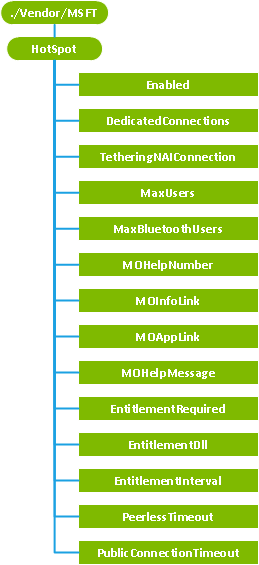

# HotSpot CSP


The HotSpot configuration service provider is used to configure and enable Internet sharing on the device, in which the device can be configured to share its cellular connection over Wi-Fi with up to eight client devices or computers.

> **Note**  HotSpot CSP is only supported in Windows 10 Mobile.

 

> **Note**   This configuration service provider requires the ID\_CAP\_CSP\_FOUNDATION capability to be accessed from a network configuration application.

 

The following diagram shows the HotSpot configuration service provider management object in tree format as used by OMA Client Provisioning. The OMA DM protocol is not supported by this configuration service provider.



<a href="" id="enabled"></a>**Enabled**
Required. Specifies whether to enable Internet sharing on the device. The default is false.

If this is initially set to false, the feature is turned off and the Internet sharing screen is removed from Settings so that the user cannot access it. Configuration changes or connection sharing state changes will not be possible.

When this is set to true, the Internet sharing screen is added to Settings, though sharing is turned off by default until the user turns it on.

This setting can be provisioned over the air, but it may require a reboot if Settings was open when this was enabled for the first time.

<a href="" id="dedicatedconnections"></a>**DedicatedConnections**
Optional. Specifies the semicolon separated list of Connection Manager cellular connections that Internet sharing will use as the public connections.

By default, any available connection will be used as a public connection. However, this node allows a mobile operator to specify one or more connection names to use as public connections.

Specified connections will be mapped, by policy, to the Internet sharing service. All attempts to enumerate Connection Manager connections for the Internet sharing service will return only the mapped connections.

> **Note**   The mapping policy will also include the connection specified in the **TetheringNAIConnection** value as well.

 

If the specified connections do not exist, Internet sharing will not start because it will not have any cellular connections available to share

If the Internet sharing service is already in a sharing state, setting this node will not take effect until sharing is stopped and restarted.

<a href="" id="tetheringnaiconnection"></a>**TetheringNAIConnection**
Optional. Specifies the CDMA TetheringNAI Connection Manager cellular connection that Internet sharing will use as a public connection.

If a CDMA mobile operator requires using a Tethering NAI during Internet sharing, they must use the [CM\_CellularEntries configuration service provider](cm-cellularentries-csp.md) to provision a TetheringNAI connection and then specify the provisioned connection in this node.

Specified connections will be mapped, by policy, to the Internet sharing service. All attempts to enumerate Connection Manager connections for the Internet sharing service will return only the mapped connections.

> **Note**   The mapping policy will also include the connections specified in the **DedicatedConnections** as well.

 

If the specified connections do not exist, Internet sharing will not start because it will not have any cellular connections available to share

If the Internet sharing service is already in a sharing state, setting this node will not take effect until sharing is stopped and restarted.

<a href="" id="maxusers"></a>**MaxUsers**
Optional. Specifies the maximum number of simultaneous users that can be connected to a device while in a sharing state. The value must be between 1 and 8 inclusive. The default value is 5.

If the Internet sharing service is already in a sharing state, setting this node will not take effect until sharing is stopped and restarted.

<a href="" id="maxbluetoothusers"></a>**MaxBluetoothUsers**
Optional. Specifies the maximum number of simultaneous Bluetooth users that can be connected to a device while sharing over Bluetooth. The value must be between 1 and 7 inclusive. The default value is 7.

<a href="" id="mohelpnumber"></a>**MOHelpNumber**
Optional. A mobile operator–specified device number that is displayed to the user when the Internet sharing service fails to start. The user interface displays a message informing the user that they can call the specified number for help.

<a href="" id="moinfolink"></a>**MOInfoLink**
Optional. A mobile operator–specified HTTP link that is displayed to the user when Internet sharing is disabled or the device is not entitled. The user interface displays a message informing the user that they can visit the specified link for more information about how to enable the feature.

<a href="" id="moapplink"></a>**MOAppLink**
Optional. A Windows device application link that points to a preinstalled application, provided by the mobile operator, that will help a user to subscribe to the mobile operator’s Internet sharing service when Internet sharing is not provisioned or entitlement fails. The general format for the link is `app://MOapp`.

<a href="" id="mohelpmessage"></a>**MOHelpMessage**
Optional. Reference to a localized string, provided by the mobile operator, that is displayed when Internet sharing is not enabled due to entitlement failure. The node takes a language-neutral registry value string, which has the following form:

`@<path_to_res_dll>,-<str_id>`

Where `<path_to_res_dll>` is the path to the resource dll that contains the string and `<str_id>` is the string identifier. For more information on language-neutral string resource registry values, see [Using Registry String Redirection](https://msdn.microsoft.com/library/windows/desktop/dd374120.aspx) on MSDN.

> **Note**  MOAppLink is required to use the MOHelpMessage setting.

 

<a href="" id="entitlementrequired"></a>**EntitlementRequired**
Optional. Specifies whether the device requires an entitlement check to determine if Internet sharing should be enabled. This node is set to a Boolean value. The default value is **True**.

By default the Internet sharing service will check entitlement every time an attempt is made to enable Internet sharing. Internet sharing should be set to **False** for carrier-unlocked devices.

<a href="" id="entitlementdll"></a>**EntitlementDll**
Required if `EntitlementRequired` is set to true. The path to the entitlement DLL used to make entitlement checks that verify that the device is entitled to use the Internet sharing service on a mobile operator’s network. The value is a string that represents a valid file system path to the entitlement DLL. By default, the Internet sharing service fails entitlement checks if this setting is missing or empty. For more information, see [Creating an Entitlement DLL](#creating-entitlement-dll) later in this topic.

<a href="" id="entitlementinterval"></a>**EntitlementInterval**
Optional. The time interval, in seconds, between entitlement checks. The default value is 86,400 seconds (24 hours).

If a periodic entitlement check fails, Internet sharing is automatically disabled.

<a href="" id="peerlesstimeout"></a>**PeerlessTimeout**
Optional. The time-out period, in minutes, after which Internet sharing should automatically turn off if there are no longer any active clients. This node can be set to any value between 1 and 120 inclusive. A value of 0 is not supported. The default value is 5 minutes.

A reboot may be required before changes to this node take effect.

<a href="" id="publicconnectiontimeout"></a>**PublicConnectionTimeout**
Optional. The time-out value, in minutes, after which Internet sharing is automatically turned off if a cellular connection is not available. This node can be set to any value between 1 and 60 inclusive. The default value is 20 minutes. A time-out is required, so a value of 0 is not supported.

Changes to this node require a reboot.

<a href="" id="minwifikeylength"></a>**MinWifiKeyLength**
> **Important**   This parm is no longer supported for Windows Phone 8.1. The enforced minimum allowed length of the Wi-Fi key is 8.

 

<a href="" id="minwifissidlength"></a>**MinWifiSSIDLength**
> **Important**   This parm is no longer supported for Windows Phone 8.1. The enforced minimum allowed length of the Wi-Fi SSID is 1.

 

## Additional requirements for CDMA networks


For CDMA networks that use a separate Network Access Identity (NAI) for Internet sharing, a new parm, TetheringNAI, has been added in the [CM\_CellularEntries configuration service provider](cm-cellularentries-csp.md) configuration service provider. The following sample demonstrates how to specify the connection.

``` syntax
<wap-provisioningdoc>
    <characteristic type="CM_CellularEntries">
        <characteristic type="TetheringNAIConn">
            <parm name="Version" value="1"/>
            <parm name="UserName" value=""/>
            <parm name="Password" value=""/>
            <parm name="TetheringNAI" value="1"/>
        </characteristic>
    </characteristic>
    <characteristic type="HotSpot">
        <parm name="Enabled" value="true" datatype="boolean"/>
        <parm name="EntitlementRequired" value="false" datatype="boolean"/>
        <parm name="TetheringNAIConnection" value="TetheringNAIConn" datatype="string"/>
    </characteristic>
</wap-provisioningdoc>
```

> **Note**  CDMA devices are limited to one active data connection at a time. This means any application or service (such as email or MMS) that is bound to another connection may not work while Internet sharing is turned on.

 

## <a href="" id="creating-entitlement-dll"></a>Creating an Entitlement DLL


For mobile operator networks that require an entitlement check, the OEM must provide a DLL in the device image that implements a function with the following signature:

`ICS_ENTITLEMENT_RESULT IsEntitled(void);`

The `EntitlementDll` parm of the HotSpot configuration service provider must be set to a string that is the path to this DLL.

The DLL must be code signed in a specific way, see [Sign binaries and packages](https://msdn.microsoft.com/library/windows/hardware/dn789217(v=vs.85).aspx).

During an entitlement check the Internet Sharing service loads the specified DLL and then call the `IsEntitled` function. The function must connect to the server to perform any required validation, then return one of the following **ICS\_ENTITLEMENT\_RESULT** enumeration values.

<table>
<colgroup>
<col width="50%" />
<col width="50%" />
</colgroup>
<thead>
<tr class="header">
<th>Value</th>
<th>Description</th>
</tr>
</thead>
<tbody>
<tr class="odd">
<td><p><strong>ENTITLEMENT_SUCCESS</strong></p></td>
<td><p>The device is allowed to connect to the server.</p></td>
</tr>
<tr class="even">
<td><p><strong>ENTITLEMENT_FAILED</strong></p></td>
<td><p>The device is not allowed to connect to the server</p></td>
</tr>
<tr class="odd">
<td><p><strong>ENTITLEMENT_UNAVAILABLE</strong></p></td>
<td><p>The entitlement check failed because the device could not contact the server or acquire a connection to verify entitlement.</p></td>
</tr>
</tbody>
</table>

 

The definition for the **ICS\_ENTITLEMENT\_RESULT** is in the header file `IcsEntitlementh`, which ships with the Windows Adaptation Kit.

## Related topics


[Configuration service provider reference](configuration-service-provider-reference.md)

 

 


