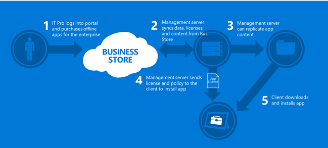
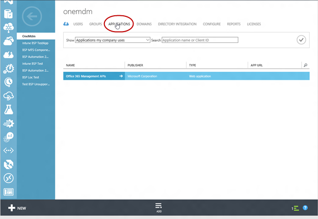
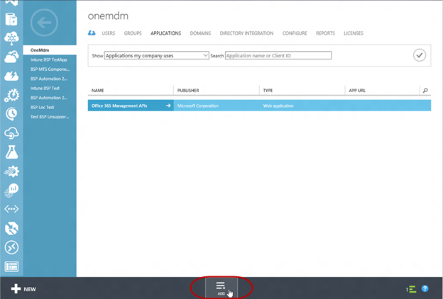
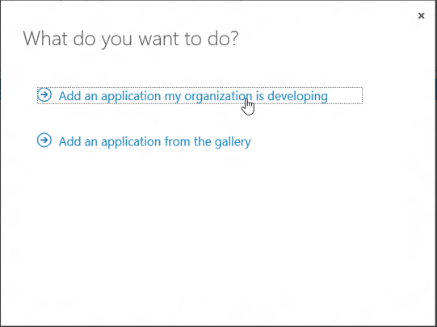
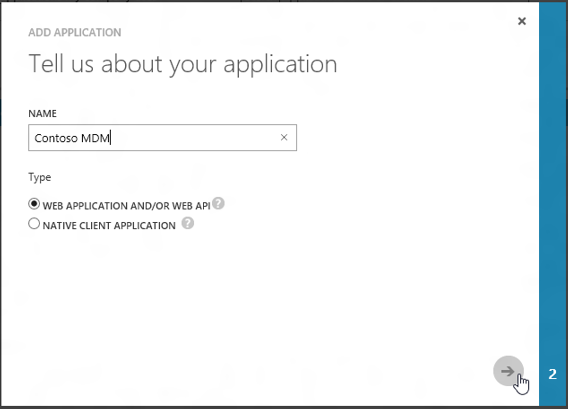
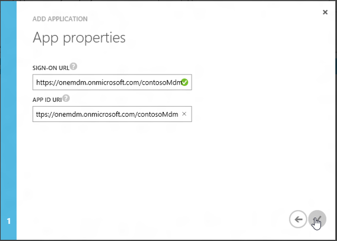
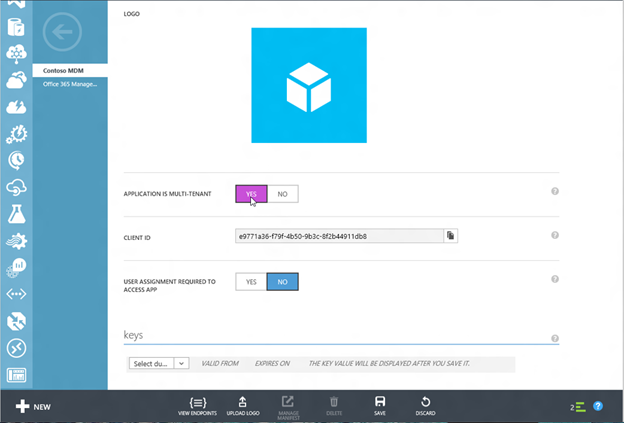
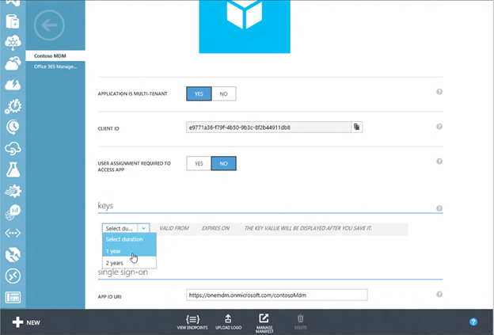

# Management tool for the Microsoft Store for Business

The Microsoft Store for Business has a new web service designed for the enterprise to acquire, manage, and distribute applications in bulk. The Store for Business enables several capabilities that are required for the enterprise to manage the lifecycle of applications from acquisition to updates.

Here's the list of the available capabilities:

-   Support for enterprise identities – Enables end users within an organization to use the identity that has been provided to them within the organization. This enables an organization to retain control of the application and eliminates the need for an organization to maintain another set of identities for their users.
-   Bulk acquisition support of applications – Enables an IT administrator to acquire applications in bulk. IT departments can now take control over the procurement and distribution of applications. Previously, users acquire applications manually.
-   License reclaim and re-use – Enables an enterprise to retain value in their purchases by allowing the ability to un-assign access to an application, and then reassign the application to another user. In Microsoft Store today, when a user with a Microsoft account leaves the organization he retains ownership of the application.
-   Flexible distribution models for Microsoft Store apps – Allows the enterprise to integrate with an organization's infrastructure the processes to distribute applications to devices that are connected to Store for Business services and to devices without connectivity to the Store for Business services.
-   Custom Line of Business app support –Enables management and distribution of enterprise applications through the Store for Business.
-   Support for Windows desktop and mobile devices - The Store for Business supports both desktop and mobile devices.

For additional information about Store for Business, see the TechNet topics in [Microsoft Store for Business](https://technet.microsoft.com/library/mt606951.aspx).

## Management services

The Store for Business provides services that enable a management tool to synchronize new and updated applications on behalf of an organization. Once synchronized, you can distribute new and updated applications using the Windows Management framework. The services provides several capabilities including providing application data, the ability to assign and reclaim applications, and the ability to download offline-licensed application packages.

<table>
<colgroup>
<col width="50%" />
<col width="50%" />
</colgroup>
<tbody>
<tr class="odd">
<td style="vertical-align:top">
Application data
</td>
<td style="vertical-align:top">
The Store for Business service provides metadata for the applications that have been acquired via the Store for Business. This includes the application identifier that is used to deploy online license applications, artwork for an application that is used to create a company portal, and localized descriptions for applications.
</td>
</tr>
<tr class="even">
<td style="vertical-align:top">
Licensing models
</td>
<td style="vertical-align:top">
<strong>Offline vs. Online</strong>

Online-licensed applications require connectivity to the Microsoft Store. Users require an Azure Active Directory identity and rely on the store services on the device to be able to acquire an application from the store. It is similar to how applications are acquired from the Microsoft Store using a Microsoft account. Assigning or reclaiming seats for an application require a call to the Store for Business services.

Offline-licensed applications enable an organization to use the application for imaging and for devices that may not have connectivity to the store or may not have Azure Active Directory. Offline-licensed application do not require connectivity to the store, however it can be updated directly from the store if the device has connectivity and the app update policies allow updates to be distributed via the store.
</td>
</tr>
</tbody>
</table>

 

### Offline-licensed application distribution

The following diagram provides an overview of app distribution from acquisition of an offline-licensed application to distribution to a client. Once synchronized from the Store for Business, the management tool can use the Windows management framework to distribute applications to devices.

### Online-licensed application distribution

The following diagram provides an overview of app distribution from acquisition of an online-licensed application to distribution to a client. Once synchronized from the Store for Business, the management tool can use the Windows management framework to distribute applications to devices. For online-licensed applications, the management tool calls back into the Store for Business management services to assign an application prior to issuing the policy to install the application.

## Integrate with Azure Active Directory

The Store for Business services rely on Azure Active Directory for authentication. The management tool must be registered as an Azure AD application within an organization tenant to authenticate against the Store for Business.

To learn more about Azure AD and how to register your application within Azure AD, here are some topics to get you started:

-   Adding an application to Azure Active Directory - [Azure Active Directory integration with MDM](azure-active-directory-integration-with-mdm.md)
-   Accessing other Web applications and configuring your application to access other APIs - [Integrating Applications with Azure Active Directory](https://go.microsoft.com/fwlink/p/?LinkId=623021)
-   Authenticating to the Store for Business services via Azure AD - [Authentication Scenarios for Azure Active Directory](https://go.microsoft.com/fwlink/p/?LinkId=623023)

For code samples, see [Microsoft Azure Active Directory Samples and Documentation](https://go.microsoft.com/fwlink/p/?LinkId=623024) in GitHub. Patterns are very similar to [Daemon-DotNet](https://go.microsoft.com/fwlink/p/?LinkId=623025) and [ConsoleApp-GraphAPI-DotNet](https://go.microsoft.com/fwlink/p/?LinkId=623026).

## Configure your Azure AD application

Here are the steps to configure your Azure AD app. For additional information, see [Integrating Applications with Azure Active Directory](https://go.microsoft.com/fwlink/p/?LinkId=623021):

1.  Log into Microsoft Azure Management Portal (https:manage.windowsazure.com)
2.  Go to the Active Directory module.
3.  Select your directory.
4.  Click the **Applications** tab.

    

5.  Click **Add**.

    

6.  Select **Add an application that my organization is developing**.

    

7.  Specify a name and then select **WEB APPLICATION AND/OR WEB API**.

    

8.  Specify the **SIGN-ON URL** to your application.

    

9.  Specify whether your app is multi-tenant or single tenant. For more information, see [Integrating Applications with Azure Active Directory](https://go.microsoft.com/fwlink/p/?LinkId=623021).

    

10. Create a client key.

    

   > **Note**  In the prior version of the tool, an update to the app manifest was required to authorize the application. This is no longer necessary.
     
11. Login to Store for Business and enable your application. For step-by-step guide, see [Configure an MDM provider](https://technet.microsoft.com/library/mt606939.aspx).

## Azure AD Authentication for MTS

MTS requires calls to be authenticated using an Azure AD OAuth bearer token. The authorization token is for the Azure AD application representing the MDM component (service/daemon/on-prem instance) within the context of the directory/tenant it will be working on behalf-of.

Here are the details for requesting an authorization token:

-   Login Authority = https://login.windows.net/\<TargetTenantId\>
-   Resource/audience\* = https://onestore.microsoft.com
-   ClientId = your AAD application client id
-   ClientSecret = your AAD application client secret/key

\* The token audience URI is meant as an identifier of the application for which the token is being generated, and it is not a URL for a service endpoint or a web-page.

## Using the management tool

After registering your management tool with Azure AD, the management tool can call into the management services. There are a couple of call patterns:

-   First the ability to get new or updated applications.
-   Second the ability to assign or reclaim applications.

The diagram below shows the call patterns for acquiring a new or updated application.

**Here is the list of available operations**:

-   [Get Inventory](get-inventory.md)
-   [Get product details](get-product-details.md)
-   [Get localized product details](get-localized-product-details.md)
-   [Get offline license](get-offline-license.md)
-   [Get product packages](get-product-packages.md)
-   [Get product package](get-product-package.md)
-   [Get seats](get-seats.md)
-   [Get seat](get-seat.md)
-   [Assign seats](assign-seats.md)
-   [Reclaim seat from user](reclaim-seat-from-user.md)
-   [Bulk assign and reclaim seats for users](bulk-assign-and-reclaim-seats-from-user.md)
-   [Get seats assigned to a user](get-seats-assigned-to-a-user.md)

 

