# MDM enrollment of Windows-based devices

This topic describes the user experience of enrolling Windows 10-based PCs and devices.

In today’s cloud-first world, enterprise IT departments increasingly want to let employees bring their own devices, or even choose and purchase corporate-owned devices. Connecting your devices to work makes it easy for you to access your organization’s resources (such as apps, the corporate network, and email).

> **Note**  When you connect your device using mobile device management (MDM) enrollment, your organization may enforce certain policies on your device.

 

## Connecting corporate-owned Windows 10-based devices

Corporate owned devices can be connected to work either by joining the device to an Active Directory domain or an Azure Active Directory (Azure AD) domain. Windows 10 does not require a personal Microsoft account on devices joined to Azure AD or an on-premises Active Directory domain.

### Connecting your device to an Active Directory domain (Join a domain)

Devices running Windows 10 Pro, Windows 10 Enterprise, or Windows 10 Education can be connected to an Active Directory domain. These devices can be connected using the Settings app.

> **Note**  Mobile devices cannot be connected to an Active Directory domain.

 

### Out-of-box-experience (OOBE)

Because joining your device to an Active Directory domain during the OOBE is not supported, you’ll need to first create a local account and then connect the device using the Settings app.

1.  On the **Who Owns this PC?** page, select **My work or school owns it**.

    

2.  Next, select **Join a domain**.

    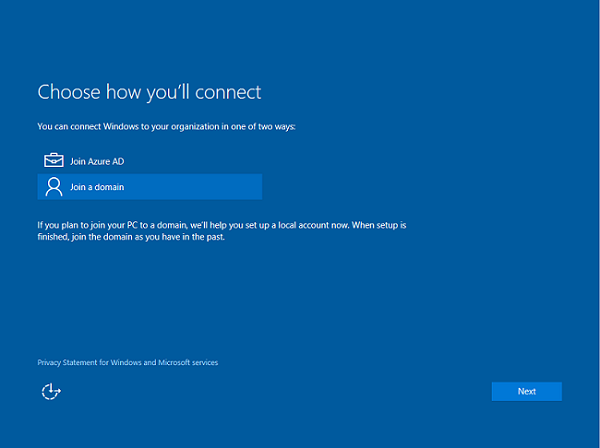

3.  You will next see a prompt to set up a local account on the device. Enter your local account details and then click **Next** to continue.

    

### Using the Settings app

1.  Launch the Settings app.

    

2.  Next, select **Accounts**.

    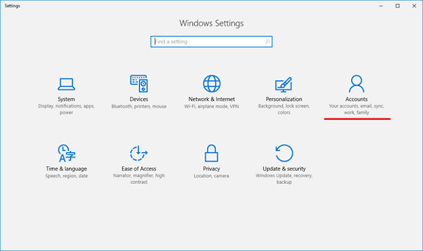

3.  Navigate to **Access work or school**.

    

4.  Click **Connect**.

    

5.  Under **Alternate actions**, click **Join this device to a local Active Directory domain**.

    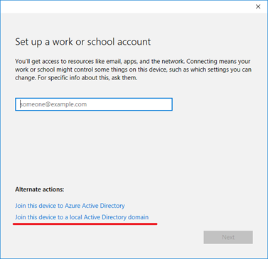

6.  Type in your domain name, follow the instructions, and then click **Next** to continue. After you complete the flow and reboot your device, it should be connected to your Active Directory domain. You can now log into the device using your domain credentials.

    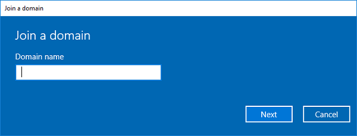

### Help with connecting to an Active Directory domain

There are a few instances where your device cannot be connected to an Active Directory domain:

| Connection issue                                                | Explanation                                                                                                                                                                                                               |
|-----------------------------------------------------------------|---------------------------------------------------------------------------------------------------------------------------------------------------------------------------------------------------------------------------|
| Your device is already connected to an Active Directory domain. | Your device can be connected to only a single Active Directory domain at a time.                                                                                                                                          |
| Your device is connected to an Azure AD domain.                 | Your device can either be connected to an Azure AD domain or an Active Directory domain. You cannot connect to both simultaneously.                                                                                       |
| You are logged in as a standard user.                           | Your device can only be connected to an Azure AD domain if you are logged in as an administrative user. You’ll need to switch to an administrator account to continue.                                                    |
| Your device is running Windows 10 Home.                         | This feature is not available on Windows 10 Home, so you will be unable to connect to an Active Directory domain. You will need to upgrade to Windows 10 Pro, Windows 10 Enterprise, or Windows 10 Education to continue. |

 

### Connecting your device to an Azure AD domain (Join Azure AD)

All Windows devices can be connected to an Azure AD domain. These devices can be connected during OOBE. Additionally, desktop devices can be connected to an Azure AD domain using the Settings app.

### Out-of-box-experience (OOBE)

1.  Select **My work or school owns it**, then click **Next.**

    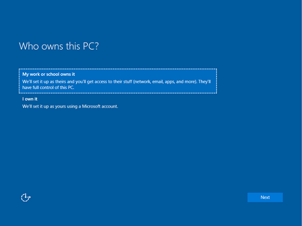

2.  Click **Join Azure AD**, then click **Next.**

    

3.  Type in your Azure AD username. This is the email address you use to log into Microsoft Office 365 and similar services.

    If the tenant is a cloud-only, password hash sync, or pass-through authentication tenant, this page will change to show the organization's custom branding, and you will be able to enter your password directly on this page. If the tenant is part of a federated domain, you will be redirected to the organization's on-premises federation server, such as Active Directory Federation Services (AD FS) for authentication.

    Based on IT policy, you may also be prompted to provide a second factor of authentication at this point. If your Azure AD tenant has auto-enrollment configured, your device will also be enrolled into MDM during this flow. For more information, see [these steps](azure-ad-and-microsoft-intune-automatic-mdm-enrollment-in-the-new-portal.md). If your tenant is not configured for auto-enrollment, you will have to go through the enrollment flow a second time to connect your device to MDM. After you complete the flow, your device will be connected to your organization’s Azure AD domain.

    

### Using the Settings app

1.  Launch the Settings app.

    

2.  Next, navigate to **Accounts**.

    

3.  Navigate to **Access work or school**.

    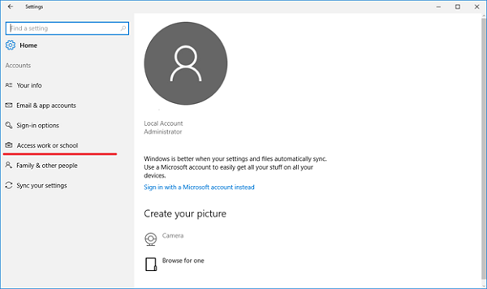

4.  Click **Connect**.

    

5.  Under **Alternate Actions**, click **Join this device to Azure Active Directory**.

    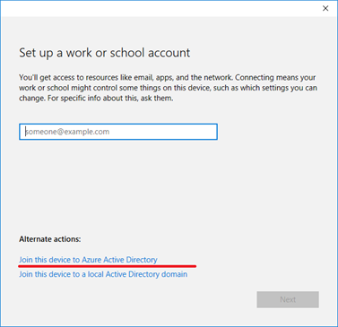

6.  Type in your Azure AD username. This is the email address you use to log into Office 365 and similar services.

    

7.  If the tenant is a cloud only, password hash sync, or pass-through authentication tenant, this page will change to show the organization's custom branding, and you will be able to enter your password directly on this page. If the tenant is part of a federated domain, you will be redirected to the organization's on-premises federation server, such as AD FS, for authentication.

    Based on IT policy, you may also be prompted to provide a second factor of authentication at this point.

    If your Azure AD tenant has auto-enrollment configured, your device will also be enrolled into MDM during this flow. For more information, see [this blog post](https://blogs.technet.microsoft.com/enterprisemobility/2015/08/14/windows-10-azure-ad-and-microsoft-intune-automatic-mdm-enrollment-powered-by-the-cloud/). If your tenant is not configured for auto-enrollment, you will have to go through the enrollment flow a second time to connect your device to MDM.

    After you reach the end of the flow, your device should be connected to your organization’s Azure AD domain. You may now log out of your current account and sign in using your Azure AD username.

    

### Help with connecting to an Azure AD domain

There are a few instances where your device cannot be connected to an Azure AD domain:

| Connection issue                                                | Explanation                                                                                                                                                                                                                |
|-----------------------------------------------------------------|----------------------------------------------------------------------------------------------------------------------------------------------------------------------------------------------------------------------------|
| Your device is connected to an Azure AD domain.                 | Your device can only be connected to a single Azure AD domain at a time.                                                                                                                                                   |
| Your device is already connected to an Active Directory domain. | Your device can either be connected to an Azure AD domain or an Active Directory domain. You cannot connect to both simultaneously.                                                                                        |
| Your device already has a user connected to a work account.     | You can either connect to an Azure AD domain or connect to a work or school account. You cannot connect to both simultaneously.                                                                                            |
| You are logged in as a standard user.                           | Your device can only be connected to an Azure AD domain if you are logged in as an administrative user. You’ll need to switch to an administrator account to continue.                                                     |
| Your device is already managed by MDM.                          | The connect to Azure AD flow will attempt to enroll your device into MDM if your Azure AD tenant has a preconfigured MDM endpoint. Your device must be unenrolled from MDM to be able to connect to Azure AD in this case. |
| Your device is running Windows 10 Home.                         | This feature is not available on Windows 10 Home, so you will be unable to connect to an Azure AD domain. You will need to upgrade to Windows 10 Pro, Windows 10 Enterprise, or Windows 10 Education to continue.          |

 

## Connecting personally-owned devices (Bring your own device)

Personally owned devices, also known as bring your own device or BYOD, can be connected to a work or school account or to MDM. Windows 10 does not require a personal Microsoft account on devices to connect to work or school.

### Connecting to a work or school account

All Windows 10-based devices can be connected to a work or school account. You can connect to a work or school account either through the Settings app or through any of the numerous Universal Windows Platform (UWP) apps such as the universal Office apps.

### Using the Settings app

1.  Launch the Settings app and then click **Accounts**. Click **Start**, then the Settings icon, and then select **Accounts**

    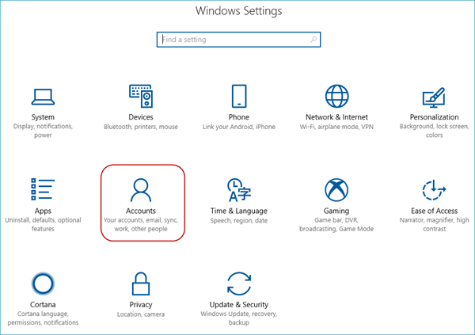

2.  Navigate to **Access work or school**.

    

3.  Click **Connect**.

    

4.  Type in your Azure AD username. This is the email address you use to log into Office 365 and similar services.

    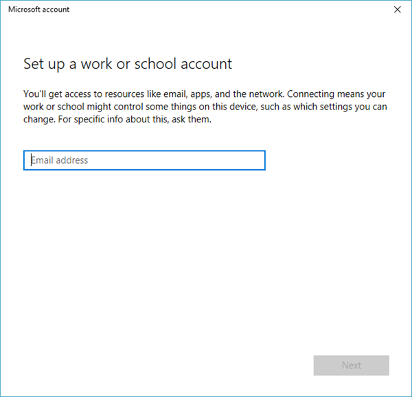

5.  If the tenant is a cloud only, password hash sync, or pass-through authentication tenant, this page will change to show the organization's custom branding, and you will be able to enter your password directly into the page. If the tenant is part of a federated domain, you will be redirected to the organization's on-premises federation server, such as AD FS, for authentication.

    Based on IT policy, you may also be prompted to provide a second factor of authentication at this point.

    If your Azure AD tenant has auto-enrollment configured, your device will also be enrolled into MDM during this flow. For more information, see [this blog post](https://blogs.technet.microsoft.com/enterprisemobility/2015/08/14/windows-10-azure-ad-and-microsoft-intune-automatic-mdm-enrollment-powered-by-the-cloud/). If your tenant is not configured for auto-enrollment, you will have to go through the enrollment flow a second time to connect your device to MDM.

    Starting in Windows 10, version 1709, you will see the status page that shows the progress of your device being set up.

    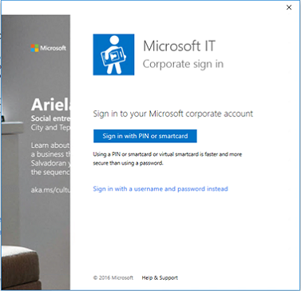

6.  After you complete the flow, your Microsoft account will be connected to your work or school account.

    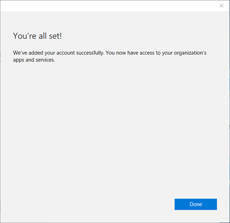

### Connecting to MDM on a desktop (Enrolling in device management)

All Windows 10-based devices can be connected to an MDM. You can connect to an MDM through the Settings app.

### Using the Settings app

1. Launch the Settings app.

   

2. Next, navigate to **Accounts**.

   

3. Navigate to **Access work or school**.

   

4. Click the **Enroll only in device management** link (available in servicing build 14393.82, KB3176934) . For older builds, use [Connecting your Windows 10-based device to work using a deep link](#connecting-your-windows-10-based-device-to-work-using-a-deep-link).

   

5. Type in your work email address.

   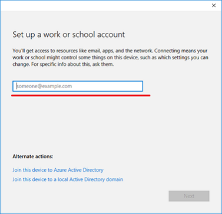

6. If the device finds an endpoint that only supports on-premises authentication, this page will change and ask you for your password. If the device finds an MDM endpoint that supports federated authentication, you’ll be presented with a new window that will ask you for additional authentication information.

   Based on IT policy, you may also be prompted to provide a second factor of authentication at this point. Starting in Windows 10, version 1709, you will see the enrollment progress on screen.

   

   After you complete the flow, your device will be connected to your organization’s MDM.
   

### Connecting to MDM on a phone (Enrolling in device management)

1.  Launch the **Settings** app and then click **Accounts**.

    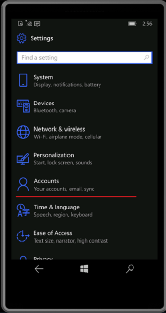

2.  Click **Access work or school**.

    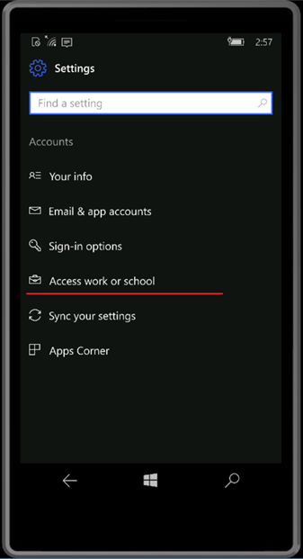

3.  Click the **Enroll only in device management** link. This is only available in the servicing build 14393.82 (KB3176934). For older builds, use [Connecting your Windows 10-based device to work using a deep link](#connecting-your-windows-10-based-device-to-work-using-a-deep-link).

    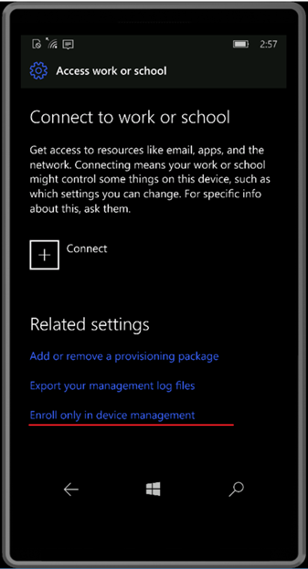

4.  Enter your work email address.

    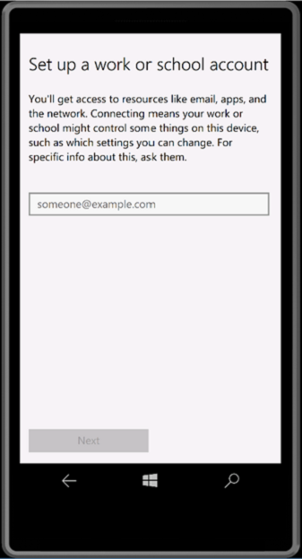

5.  If the device finds an endpoint that only supports on-premises authentication, this page will change and ask you for your password. If the device finds an MDM endpoint that supports federated authentication, you’ll be presented with a new window that will ask you for additional authentication information.

    Based on IT policy, you may also be prompted to provide a second factor of authentication at this point.

6.  After you complete the flow, your device will be connected to your organization’s MDM.

    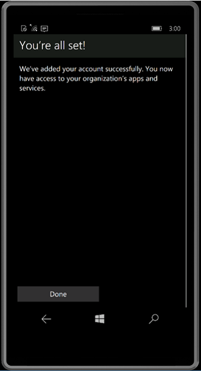

### Help with connecting personally-owned devices

There are a few instances where your device may not be able to connect to work, as described in the following table.

| Error Message                                                                                                                                                                              | Description                                                                                         |
|--------------------------------------------------------------------------------------------------------------------------------------------------------------------------------------------|-----------------------------------------------------------------------------------------------------|
| Your device is already connected to your organization’s cloud.                                                                                                                             | Your device is already connected to either Azure AD, a work or school account, or an AD domain.     |
| We could not find your identity in your organization’s cloud.                                                                                                                              | The username you entered was not found on your Azure AD tenant.                                     |
| Your device is already being managed by an organization.                                                                                                                                   | Your device is either already managed by MDM or System Center Configuration Manager.                |
| You don’t have the right privileges to perform this operation. Please talk to your admin.                                                                                                  | You cannot enroll your device into MDM as a standard user. You must be on an administrator account. |
| We couldn’t auto-discover a management endpoint matching the username entered. Please check your username and try again. If you know the URL to your management endpoint, please enter it. | You need to provide the server URL for your MDM or check the spelling of the username you entered.  |

 

## Connecting your Windows 10-based device to work using a deep link

Windows 10-based devices may be connected to work using a deep link. Users will be able to click or open a link in a particular format from anywhere in Windows 10 and be directed to the new enrollment experience.

In Windows 10, version 1607, deep linking will only be supported for connecting devices to MDM. It will not support adding a work or school account, joining a device to Azure AD, and joining a device to Active Directory.

The deep link used for connecting your device to work will always use the following format:

**ms-device-enrollment:?mode={mode\_name}**

| Parameter | Description                                                  | Supported Value for Windows 10|
|-----------|--------------------------------------------------------------|----------------------------------------------|
| mode      | Describes which mode will be executed in the enrollment app. Added in Windows 10, version 1607| MDM (Mobile Device Management), AWA (Adding Work Account), and AADJ (Azure Active Directory Joined).                                       |
|username  | Specifies the email address or UPN of the user who should be enrolled into MDM. Added in Windows 10, version 1703. | string |
| servername | Specifies the MDM server URL that will be used to enroll the device. Added in Windows 10, version 1703. | string|
| accesstoken | Custom parameter for MDM servers to use as they see fit. Typically, this can be used as a token to validate the enrollment request. Added in Windows 10, version 1703. | string |
| deviceidentifier | Custom parameter for MDM servers to use as they see fit. Typically, this can be used to pass in a unique device identifier. Added in Windows 10, version 1703. | GUID |
| tenantidentifier | Custom parameter for MDM servers to use as they see fit. Typically, this can be used to identify which tenant the device or user belongs to. Added in Windows 10, version 1703. | GUID or string |
| ownership | Custom parameter for MDM servers to use as they see fit. Typically, this can be used to determine whether the device is BYOD or Corp Owned. Added in Windows 10, version 1703. | 1, 2, or 3 |

> **Note**  "awa" and "aadj" values for mode are only supported on Windows 10, version 1709 and later. 

### Connecting to MDM using a deep link

> **Note** Deep links only work with Internet Explorer or Edge browsers.
When connecting to MDM using a deep link, the URI you should use is

**ms-device-enrollment:?mode=mdm**
**ms-device-enrollment:?mode=mdm&username=someone@example.com&servername=<https://example.server.com>**

The following procedure describes how users can connect their devices to MDM using deep links.

1.  Starting with Windows 10, version 1607, you can create a link to launch the built-in enrollment app using the URI **ms-device-enrollment:?mode=mdm** and user-friendly display text, such as **Click here to connect Windows to work**:

    > **Note**  This will launch the flow equivalent to the Enroll into device management option in Windows 10, version 1511.

    - IT admins can add this link to a welcome email that users can click on to enroll into MDM.

      

    - IT admins can also add this link to an internal web page that users refer to enrollment instructions.

2.  After clicking the link or running it, Windows 10 will launch the enrollment app in a special mode that only allows MDM enrollments (similar to the Enroll into device management option in Windows 10, version 1511).

    Type in your work email address.

    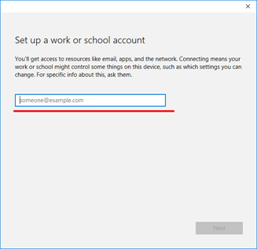

3.  If the device finds an endpoint that only supports on-premises authentication, this page will change and ask you for your password. If the device finds an MDM endpoint that supports federated authentication, you’ll be presented with a new window that will ask you for additional authentication information.

    > **Note**  Based on IT policy, you may also be prompted to provide a second factor of authentication at this point.

    After you complete the flow, your device will be connected to your organization’s MDM.

    

## Managing connections

Your work or school connections can be managed on the **Settings** &gt; **Accounts** &gt; **Access work or school** page. Your connections will show on this page and clicking on one will expand options for that connection.

### Info

The **Info** button can be found on work or school connections involving MDM. This includes the following scenarios:

-   Connecting your device to an Azure AD domain that has auto-enroll into MDM configured.
-   Connecting your device to a work or school account that has auto-enroll into MDM configured.
-   Connecting your device to MDM.

Clicking the **Info** button will open a new page in the Settings app that provides details about your MDM connection. You’ll be able to view your organization’s support information (if configured) on this page. You’ll also be able to start a sync session which will force your device to communicate to the MDM server and fetch any updates to policies if needed.

Starting in Windows 10, version 1709, clicking the **Info** button will show a list of policies and line-of-business apps installed by your organization. Here is an example screehshot.

> [Note] Starting in Windows 10, version 1709, the **Manage** button is no longer available. 

### Disconnect

The **Disconnect** button can be found on all work connections. Generally, clicking the **Disconnect** button will remove the connection from the device. There are a few exceptions to this:

-   Devices that enforce the AllowManualMDMUnenrollment policy will not allow users to remove MDM enrollments. These connections must be removed by a server-initiated unenroll command.
-   On mobile devices, you cannot disconnect from Azure AD. These connections can only be removed by wiping the device.

> **Warning**  Disconnecting might result in the loss of data on the device.

## Collecting diagnostic logs

You can collect diagnostic logs around your work connections by going to **Settings** &gt; **Accounts** &gt; **Access work or school**, and clicking the **Export your management logs** link under **Related Settings**. After you click the link, click **Export** and follow the path displayed to retrieve your management log files.

Starting in Windows 10, version 1709, you can get the advanced diagnostic report by going to **Settings** &gt; **Accounts** &gt; **Access work or school**, and clicking the **Info** button. At the bottom of the Settings page you will see the button to create a report. Here is an example screenshot.

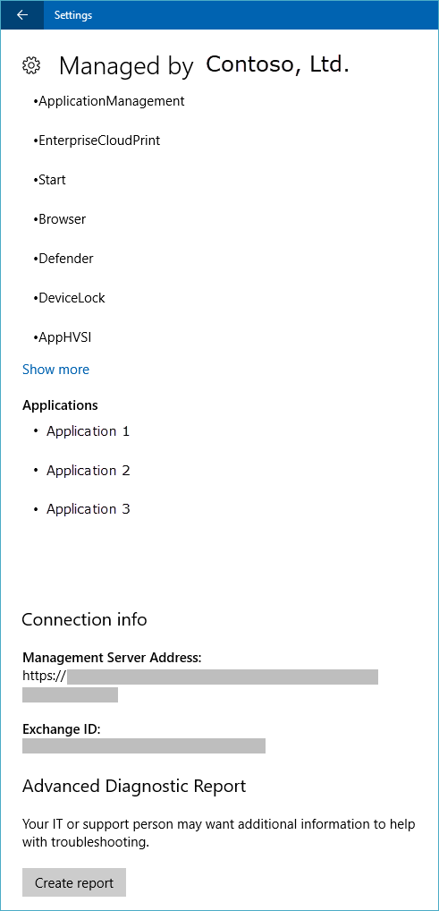

 

