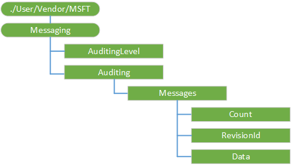

# Messaging CSP

The Messaging configuration service provider is used to configure the ability to get text messages audited on a mobile device. This CSP was added in Windows 10, version 1703.

The following diagram shows the Messaging configuration service provider in tree format.



<a href="" id="--user-msft-applocker"></a>**./User/Vendor/MSFT/Messaging**  

<p>Root node for the Messaging configuration service provider.</p>

<a href="" id="auditinglevel"></a>**AuditingLevel**  
<p>Turns on the &quot;Text&quot; auditing feature.</p>
<p>The following list shows the supported values:</p>
<ul>
<li>0 (Default) - Off</li>
<li>1 - On</li>
</ul>
<p>Supported operations are Get and Replace.</p>

<a href="" id="auditing"></a>**Auditing**  
<p>Node for auditing.</p>
<p>Supported operation is Get.</p>

<a href="" id="messages"></a>**Messages**  
<p>Node for messages.</p>
<p>Supported operation is Get.</p>

<a href="" id="count"></a>**Count**  
<p>The number of messages to return in the Data setting. The default is 100.</p>
<p>Supported operations are Get and Replace.</p>

<a href="" id="revisionid"></a>**RevisionId**  
<p>Retrieves messages whose revision ID is greater than RevisionId.</p>
<p>Supported operations are Get and Replace.</p>

<a href="" id="data"></a>**Data**  
<p>The JSON string of text messages on the device.</p>
<p>Supported operations are Get and Replace.</p>


**SyncML example**

```xml
 <SyncML xmlns="SYNCML:SYNCML1.2">
  <SyncBody>
    <Replace>
      <CmdID>2</CmdID>
      <Item>
        <Target>
          <LocURI>
            ./User/Vendor/MSFT/Messaging/Auditing/Messages/Count
          </LocURI>
        </Target>
        <Meta>
          <Format xmlns="syncml:metinf">int</Format>
          <Type>text/plain</Type>
        </Meta>
        <Data>100</Data>
      </Item>
    </Replace>
    <Replace>
      <CmdID>3</CmdID>
      <Item>
        <Target>
          <LocURI>
            ./User/Vendor/MSFT/Messaging/Auditing/Messages/RevisionId
          </LocURI>
        </Target>
        <Meta>
          <Format xmlns="syncml:metinf">chr</Format>
          <Type>text/plain</Type>
        </Meta>
        <Data>0</Data>
      </Item>
    </Replace>
    <Get>
      <CmdID>4</CmdID>
      <Item>
        <Target>
          <LocURI>
            ./User/Vendor/MSFT/Messaging/Auditing/Messages/Data
          </LocURI>
        </Target>
      </Item>
    </Get>
    <Final/>
  </SyncBody>
</SyncML>
```
