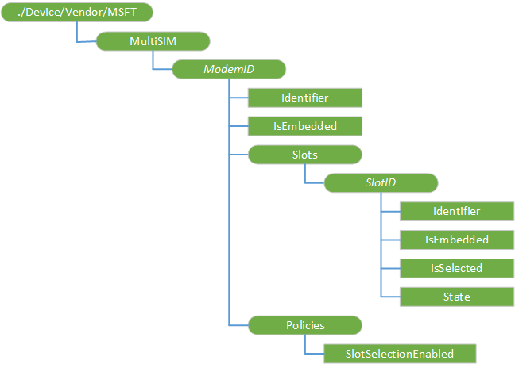

# MultiSIM CSP 


The MultiSIM configuration service provider (CSP) is used by the enterprise to manage devices with dual SIM single active configuration. An enterprise can set policies on whether that user can switch between SIM slots, specify which slot is the default, and whether the slot is embedded. This CSP was added in Windows 10, version 1803.


The following diagram shows the MultiSIM configuration service provider in tree format.

 

<a href="" id="multisim"></a>**./Device/Vendor/MSFT/MultiSIM**  
Root node.

<a href="" id="modemid"></a>**_ModemID_**  
Node representing a Mobile Broadband Modem. The node name is the modem ID. Modem ID is a GUID without curly braces, with exception of "Embedded" which represents the embedded modem.

<a href="" id="modemid-identifier"></a>**_ModemID_/Identifier**  
Modem ID.

Supported operation is Get. Value type is string.

<a href="" id="modemid-isembedded"></a>**_ModemID_/IsEmbedded**  
Indicates whether this modem is embedded or external.

Supported operation is Get. Value type is bool.

<a href="" id="modemid-slots"></a>**_ModemID_/Slots**  
Represents all SIM slots in the Modem.

<a href="" id="modemid-slots-slotid"></a>**_ModemID_/Slots/_SlotID_**  
Node representing a SIM Slot. The node name is the Slot ID. SIM Slot ID format is "0", "1", etc., with exception of "Embedded" which represents the embedded Slot.

<a href="" id="modemid-slots-slotid-identifier"></a>**_ModemID_/Slots/_SlotID_/Identifier**  
Slot ID.

Supported operation is Get. Value type is integer.

<a href="" id="modemid-slots-slotid-isembedded"></a>**_ModemID_/Slots/_SlotID_/IsEmbedded**  
Indicates whether this Slot is embedded or a physical SIM slot.

Supported operation is Get. Value type is bool.

<a href="" id="modemid-slots-slotid-isselected"></a>**_ModemID_/Slots/_SlotID_/IsSelected**  
Indicates whether this Slot is selected or not.

Supported operation is Get and Replace. Value type is bool.

<a href="" id="modemid-slots-slotid-state"></a>**_ModemID_/Slots/_SlotID_/State**  
Slot state (Unknown = 0, OffEmpty = 1, Off = 2, Empty = 3, NotReady = 4, Active = 5, Error = 6, ActiveEsim = 7, ActiveEsimNoProfile = 8)

Supported operation is Get. Value type is integer.

<a href="" id="modemid-policies"></a>**_ModemID_/Policies**  
Policies associated with the Modem.

<a href="" id="modemid-policies-slotselectionenabled"></a>**_ModemID_/Policies/SlotSelectionEnabled**  
Determines whether the user is allowed to change slots in the Cellular settings UI. Default is true.

Supported operation is Get and Replace. Value type is bool.

## Examples

Get modem
``` syntax
<SyncML xmlns="SYNCML:SYNCML1.2">
  <SyncBody>
    <Get>
      <CmdID>1</CmdID>
      <Item>
        <Target>
          <LocURI>
            ./Vendor/MSFT/MultiSIM
          </LocURI>
        </Target>
      </Item>
    </Get>
    <Final/> 
  </SyncBody>
</SyncML>
```

Get slots
``` syntax
<SyncML xmlns="SYNCML:SYNCML1.2">
  <SyncBody>
    <Get>
      <CmdID>1</CmdID>
      <Item>
        <Target>
          <LocURI>
            ./Vendor/MSFT/MultiSIM/Embedded/Slots
          </LocURI>
        </Target>
      </Item>
    </Get>
    <Final/> 
  </SyncBody>
</SyncML>
```

Get slot state
``` syntax
<SyncML xmlns="SYNCML:SYNCML1.2">
  <SyncBody>
    <Get>
      <CmdID>1</CmdID>
      <Item>
        <Target>
          <LocURI>
            ./Vendor/MSFT/MultiSIM/Embedded/Slots/Embedded/State
          </LocURI>
        </Target>
      </Item>
    </Get>
    <Final/> 
  </SyncBody>
</SyncML>
```

Select slot
``` syntax
<SyncML xmlns="SYNCML:SYNCML1.2">
  <SyncBody>
    <Replace>
      <CmdID>1</CmdID>
      <Item>
        <Target>
          <LocURI>
            ./Vendor/MSFT/MultiSIM/Embedded/Slots/0/IsSelected
          </LocURI>
        </Target>
        <Meta>
          <Format xmlns="syncml:metinf">bool</Format>
          <Type>text/plain</Type>
        </Meta>
        <Data>true</Data>
      </Item>
    </Replace>
    <Final/> 
  </SyncBody>
</SyncML>
```
