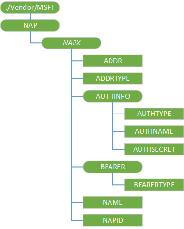

# NAP CSP

The NAP (Network Access Point) Configuration Service Provider is used to manage and query GPRS and CDMA connections.

> **Note**   This configuration service provider requires the ID\_CAP\_CSP\_FOUNDATION and ID\_CAP\_NETWORKING\_ADMIN capabilities to be accessed from a network configuration application.

 

For the NAP CSP, you cannot use the Replace command unless the node already exists.

The following diagram shows the NAP configuration service provider management object in tree format as used by OMA DM. The OMA Client Provisioning protocol is not supported by this configuration service provider.

**./Vendor/MSFT/NAP**  
Root node.

***NAPX***  
Required. Defines the name of the network access point.

It is recommended that this element name is specified as a numbered node beginning at zero. For example, to provision two network access points, use "NAP0" and "NAP1" as the element names. Any unique name can be used if desired (such as "GPRS-NAP"), but no spaces may appear in the name (use %20 instead).

***NAPX*/NAPID**  
Required. Specifies the identifier of the destination network.

The NAPID value must not include a "@" character. If the NAPDEF configuration service provider defines it as “connectionID@WAP”, this value should be set to “connectionID”.

***NAPX*/NAME**  
Optional. Specifies the user-friendly name of the connection.

***NAPX*/ADDR**  
Required. Specifies the address of the destination network.

The ADDR may be the URL of an access point, the APN name for a GPRS access point, the telephone number of an answering modem, or any other string used to uniquely identify the address of the destination network.

***NAPX*/ADDRTYPE**  
Required. Specifies the type of address used to identify the destination network.

The following table shows some commonly used ADDRTYPE values and the types of connection that corresponds with each value.

<table>
<colgroup>
<col width="50%" />
<col width="50%" />
</colgroup>
<thead>
<tr class="header">
<th>ADDRTYPE Value</th>
<th>Connection Type</th>
</tr>
</thead>
<tbody>
<tr class="odd">
<td>
E164
</td>
<td>
RAS connections
</td>
</tr>
<tr class="even">
<td>
APN
</td>
<td>
GPRS connections
</td>
</tr>
<tr class="odd">
<td>
ALPHA
</td>
<td>
Wi-Fi-based connections
</td>
</tr>
</tbody>
</table>

 

***NAPX*/AuthInfo**  
Optional node. Specifies the authentication information, including the protocol, user name, and password.

***NAPX*/AuthInfo/AuthType**  
Optional. Specifies the method of authentication. Some supported protocols are PAP, CHAP, HTTP-BASIC, HTTP-DIGEST, WTLS-SS, MD5.

***NAPX*/AuthInfo/AuthName**  
Optional. Specifies the user name and domain to be used during authentication. This field is in the form *Domain*\\*UserName*.

***NAPX*/AuthInfo/AuthSecret**  
Optional. Specifies the password used during authentication.

Queries of this field will return a string composed of sixteen asterisks (\*).

***NAPX*/Bearer**  
Node.

***NAPX*/Bearer/BearerType**  
Required. Specifies the network type of the destination network. This can be set to GPRS, CDMA2000, WCDMA, TDMA, CSD, DTPT, WiFi.

## Related topics

[Configuration service provider reference](configuration-service-provider-reference.md)

 

 

