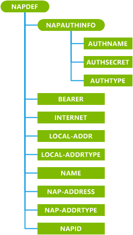
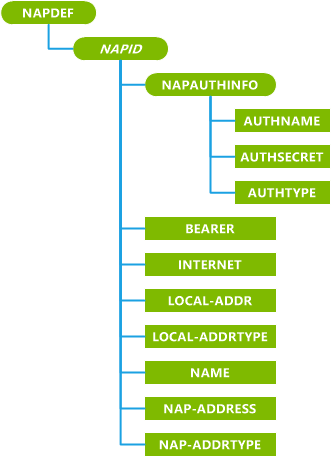

# NAPDEF CSP

The NAPDEF configuration service provider is used to add, modify, or delete WAP network access points (NAPs). For complete information about these settings, see the standard WAP specification WAP-183-ProvCont-20010724-a.

> **Note**  You cannot use NAPDEF CSP on the desktop to update the Push Proxy Gateway (PPG) list.

 

> **Note**   This configuration service provider requires the ID\_CAP\_CSP\_FOUNDATION and ID\_CAP\_NETWORKING\_ADMIN capabilities to be accessed from a network configuration application.

 

The following diagram shows the NAPDEF configuration service provider management object in tree format as used by OMA Client Provisioning for **initial bootstrapping of the phone**. The OMA DM protocol is not supported by this configuration service provider.

The following diagram shows the NAPDEF configuration service provider management object in tree format as used by OMA Client Provisioning for **updating the bootstrapping of the phone**. The OMA DM protocol is not supported by this configuration service provider.

**NAPAUTHINFO**  
Defines a group of authentication settings.

**AUTHNAME**  
Specifies the name used to authenticate the user.

**AUTHSECRET**  
Specifies the password used to authenticate the user.

A query of this parameter returns asterisks (\*) in the results.

**AUTHTYPE**  
Specifies the protocol used to authenticate the user.

The only permitted values for this element are "POP" (Password Authentication Protocol) and "CHAP" (Challenge Handshake Authentication Protocol) authentication protocols. Note

> **Note**  **AuthName** and **AuthSecret** are not created if **AuthType** is not included in the initial device configuration. **AuthName** and **AuthSecret** cannot be changed if **AuthType** is not included in the provisioning XML used to make the change.

 

**BEARER**  
Specifies the type of bearer.

Only Global System for Mobile Communication (GSM) and GSM-General Packet Radio Services (GPRS) are supported.

**INTERNET**  
Optional. Specifies whether this is an AlwaysOn connection.

If **INTERNET** exists, the connection is an AlwaysOn connection and does not require a connection manager policy.

If **INTERNET** does not exist, the connection is not an AlwaysOn connection and the connection requires a connection manager connection policy to be set.

**LOCAL-ADDR**  
Required for GPRS. Specifies the local address of the WAP client for GPRS access points.

**LOCAL-ADDRTYPE**  
Required for GPRS. Specifies the address format of the **LOCAL-ADDR** element.

The value of LOCAL-ADDRTYPE can be "IPv4".

**NAME**  
Specifies the logical, user-readable identity of the NAP.

**NAP-ADDRESS**  
Specifies the address of the NAP.

**NAP-ADDRTYPE**  
Specifies the format and protocol of the **NAP-ADDRESS** element.

Only Access Point Name (APN) and E164 are supported.

**NAPID**  
Required for initial bootstrapping. Specifies the name of the NAP.

The maximum length of the **NAPID** value is 16 characters.

***NAPID***  
Required for bootstrapping updating. Defines the name of the NAP.

The name of the *NAPID* element is the same as the value passed during initial bootstrapping. In addition, the Microsoft format for NAPDEF contains the provisioning XML attribute mwid. This custom attribute is optional when adding a NAP or a proxy. It is required for *NAPID* when updating and deleting existing NAPs and proxies and must have its value set to 1.

## Microsoft Custom Elements

The following table shows the Microsoft custom elements that this configuration service provider supports for OMA Client Provisioning.

<table>
<colgroup>
<col width="20%" />
<col width="80%" />
</colgroup>
<thead>
<tr class="header">
<th>ELements</th>
<th>Available</th>
</tr>
</thead>
<tbody>
<tr class="odd">
<td>
parm-query
</td>
<td>
Yes

Note that some GPRS parameters will not necessarily contain the exact same value as was set.
</td>
</tr>
<tr class="even">
<td>
noparm
</td>
<td>
Yes
</td>
</tr>
<tr class="odd">
<td>
nocharacteristic
</td>
<td>
Yes
</td>
</tr>
<tr class="even">
<td>
characteristic-query
</td>
<td>
Yes
</td>
</tr>
</tbody>
</table>

 

## Related topics

[Configuration service provider reference](configuration-service-provider-reference.md)

 

 

