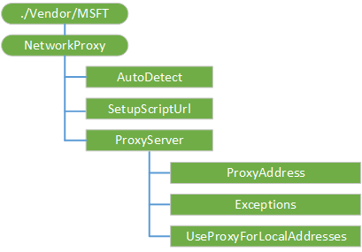

# NetworkProxy CSP

The NetworkProxy configuration service provider (CSP) is used to configure a proxy server for ethernet and Wi-Fi connections. These settings do not apply to VPN connections. This CSP was added in Windows 10, version 1703.

> [!NOTE]
> In Windows 10 Mobile, the NetworkProxy CSP only works in ethernet connections. Use the WiFi CSP to configure per-network proxy for Wi-Fi connections in mobile devices.  

How the settings work:  

<ol>
<li>If auto-detect is enabled, the system tries to find the path to a proxy auto config (PAC) script and download it.</li>
<li>If #1 fails and a setup script is specified, the system tries to download the explicitly configured PAC script.</li>
<li>If #2 fails and a proxy server is specified, the system tries to use the explicitly configured proxy server.</li>
<li>Otherwise, the system tries to reach the site directly.</li>
</ol>


The following diagram shows the NetworkProxy configuration service provider in tree format.



<a href="" id="networkproxy"></a>**./Vendor/MSFT/NetworkProxy**  
The root node for the NetworkProxy configuration service provider..

<a href="" id="proxysettingsperuser"></a>**ProxySettingsPerUser**  
Added in Windows 10, version 1803. When set to 0, it enables proxy configuration as global, machine wide.

Supported operations are Add, Get, Replace, and Delete.

> [!Note]
> Per user proxy configuration setting is not supported using a configuration file, only modifying registry settings on a local machine.

<a href="" id="autodetect"></a>**AutoDetect**
Automatically detect settings. If enabled, the system tries to find the path to a PAC script.

Valid values:
<ul>
<li>0 - Disabled</li>
<li>1 (default) - Enabled</li>
</ul>

The data type is integer. Supported operations are Get and Replace. Starting in Windows 10, version 1803, the Delete operation is also supported.

<a href="" id="setupscripturl"></a>**SetupScriptUrl**
Address to the PAC script you want to use.

The data type is string. Supported operations are Get and Replace. Starting in Windows 10, version 1803, the Delete operation is also supported.

<a href="" id="proxyserver"></a>**ProxyServer**  
Node for configuring a static proxy for Ethernet and Wi-Fi connections. The same proxy server is used for all protocols - including HTTP, HTTPS, FTP, and SOCKS. These settings do not apply to VPN connections.

Supported operation is Get.

<a href="" id="proxyaddress"></a>**ProxyAddress**  
Address to the proxy server. Specify an address in the format &lt;server&gt;[“:”&lt;port&gt;]. 

The data type is string. Supported operations are Get and Replace. Starting in Windows 10, version 1803, the Delete operation is also supported.

<a href="" id="exceptions"></a>**Exceptions**  
Addresses that should not use the proxy server. The system will not use the proxy server for addresses beginning with what is specified in this node. Use semicolons (;) to separate entries. 

The data type is string. Supported operations are Get and Replace. Starting in Windows 10, version 1803, the Delete operation is also supported.

<a href="" id="useproxyforlocaladdresses"></a>**UseProxyForLocalAddresses**  
Specifies whether the proxy server should be used for local (intranet) addresses. 
Valid values:
<ul>
<li>0 (default) - Use proxy server for local addresses</li>
<li>1 - Do not use proxy server for local addresses</li>
</ul>

The data type is integer. Supported operations are Get and Replace. Starting in Window 10, version 1803, the Delete operation is also supported.

# Configuration Example

These generic code portions for the options **ProxySettingsPerUser**, **Autodetect**, and **SetupScriptURL** can be used for a specific operation, for example Replace.  Only enter the portion of code needed in the **Replace** section.
```xml
<Replace>
    <CmdID>1</CmdID>
    <Item>
		<Target>
			<LocURI>./Vendor/MSFT/NetworkProxy/ProxySettingsPerUser</LocURI>
		</Target>
		<Meta>
			<Format xmlns="syncml:metinf">int</Format>
			<Type>text/plain</Type>
		</Meta>
		<Data>0</Data>
	</Item>

</Replace>


<Replace>
    <CmdID>2</CmdID>
    <Item>
        <Target>
            <LocURI>./Vendor/MSFT/NetworkProxy/AutoDetect</LocURI>
		</Target>
		<Meta>
            <Format xmlns="syncml:metinf">int</Format>
			<Type>text/plain</Type>
        </Meta>
        <Data>1</Data>
    </Item>
</Replace> 


<Replace>

    <CmdID>3</CmdID>
    <Item>
        <Target>
            <LocURI>./Vendor/MSFT/NetworkProxy/SetupScriptUrl</LocURI>
        </Target>
        <Meta>
            <Format xmlns="syncml:metinf">chr</Format>
            <Type>text/plain</Type>
        </Meta>
        <Data>Insert the proxy PAC URL location here:</Data>
    </Item>
</Replace>
```xml
