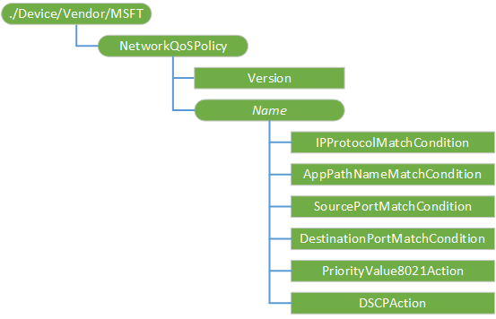

# NetworkQoSPolicy CSP

The NetworkQoSPolicy configuration service provider creates network Quality of Service (QoS) policies. A QoS policy performs a set of actions on network traffic based on a set of matching conditions. This CSP was added in Windows 10, version 1703.

The following conditions are supported:
-	Network traffic from a specific application name
-	Network traffic from specific source or destination ports
-	Network traffic from a specific IP protocol (TCP, UDP, or both)
 
The following actions are supported:
-	Layer 2 tagging using a IEEE 802.1p priority value
-	Layer 3 tagging using a differentiated services code point (DSCP) value

> [!NOTE]
> The NetworkQoSPolicy configuration service provider is supported only in Microsoft Surface Hub.

The following diagram shows the NetworkQoSPolicy configuration service provider in tree format.

**NetworkQoSPolicy**   

The root node for the NetworkQoSPolicy configuration service provider.

**Version**  

Specifies the version information.

The data type is int. 

The only supported operation is Get.

**_Name_**  

Node for the QoS policy name.

**_Name_/IPProtocolMatchCondition**  

Specifies the IP protocol used to match the network traffic. 

Valid values are:

   - 0 (default) - Both TCP and UDP 
   - 1 - TCP
   - 2 - UDP

The data type is int. 

The supported operations are Add, Get, Delete, and Replace.

**_Name_/AppPathNameMatchCondition**  

Specifies the name of an application to be used to match the network traffic, such as application.exe or %ProgramFiles%\application.exe.

The data type is char. 

The supported operations are Add, Get, Delete, and Replace.

**_Name_/SourcePortMatchCondition**  

Specifies a single port or a range of ports to be used to match the network traffic source. 

Valid values are: 

-   A range of source ports: _[first port number]_-_[last port number]_
-   A single source port: _[port number]_
   

The data type is char. 

The supported operations are Add, Get, Delete, and Replace.

**_Name_/DestinationPortMatchCondition**  

Specifies a single source port or a range of ports to be used to match the network traffic destination.

Valid values are: 

-   A range of destination ports: _[first port number]_-_[last port number]_
-   A single destination port: _[port number]_
   

The data type is char. 

The supported operations are Add, Get, Delete, and Replace.

**_Name_/PriorityValue8021Action**  

Specifies the IEEE 802.1p priority value to apply to matching network traffic.

Valid values are 0-7.

The data type is int.

The supported operations are Add, Get, Delete, and Replace.

**_Name_/DSCPAction**  

The differentiated services code point (DSCP) value to apply to matching network traffic.

Valid values are 0-63.

The data type is int.

The supported operations are Add, Get, Delete, and Replace.

