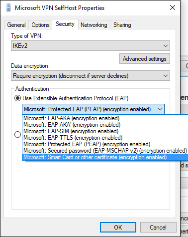
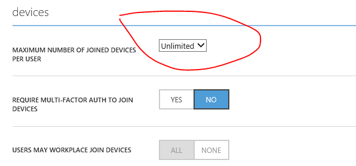

# What's new in mobile device enrollment and management


This topic provides information about what's new and breaking changes in Windows 10 mobile device management (MDM) enrollment and management experience across all Windows 10 devices.

For details about Microsoft mobile device management protocols for Windows 10 see [\[MS-MDM\]: Mobile Device Management Protocol](https://go.microsoft.com/fwlink/p/?LinkId=619346) and [\[MS-MDE2\]: Mobile Device Enrollment Protocol Version 2]( http://go.microsoft.com/fwlink/p/?LinkId=619347). 

- **What’s new in MDM for Windows 10 versions**
  - [What’s new in MDM for Windows 10, version 1903](#whats-new-in-mdm-for-windows-10-version-1903)
  - [What’s new in MDM for Windows 10, version 1809](#whats-new-in-mdm-for-windows-10-version-1809)
  - [What’s new in MDM for Windows 10, version 1803](#whats-new-in-mdm-for-windows-10-version-1803)
  - [What’s new in MDM for Windows 10, version 1709](#whats-new-in-mdm-for-windows-10-version-1709)
  - [What’s new in MDM for Windows 10, version 1703](#whats-new-in-mdm-for-windows-10-version-1703)
  - [What’s new in MDM for Windows 10, version 1607](#whats-new-in-mdm-for-windows-10-version-1607)
  - [What’s new in MDM for Windows 10, version 1511](#whats-new-in-mdm-for-windows-10-version-1511)

- **Breaking changes and known issues**
  - [Get command inside an atomic command is not supported](#get-command-inside-an-atomic-command-is-not-supported)
  - [Notification channel URI not preserved during upgrade from Windows 8.1 to Windows 10](#notification-channel-uri-not-preserved-during-upgrade-from-windows-81-to-windows-10)
  - [Apps installed using WMI classes are not removed](#apps-installed-using-wmi-classes-are-not-removed)
  - [Passing CDATA in SyncML does not work](#passing-cdata-in-syncml-does-not-work)
  - [SSL settings in IIS server for SCEP must be set to "Ignore"](#ssl-settings-in-iis-server-for-scep-must-be-set-to-ignore)
  - [MDM enrollment fails on the mobile device when traffic is going through proxy](#mdm-enrollment-fails-on-the-mobile-device-when-traffic-is-going-through-proxy)
  - [Server-initiated unenrollment failure](#server-initiated-unenrollment-failure)
  - [Certificates causing issues with Wi-Fi and VPN](#certificates-causing-issues-with-wi-fi-and-vpn)
  - [Version information for mobile devices](#version-information-for-mobile-devices)
  - [Upgrading Windows Phone 8.1 devices with app whitelisting using ApplicationRestriction policy has issues](#upgrading-windows-phone-81-devices-with-app-whitelisting-using-applicationrestriction-policy-has-issues)
  - [Apps dependent on Microsoft Frameworks may get blocked in phones prior to build 10586.218](#apps-dependent-on-microsoft-frameworks-may-get-blocked-in-phones-prior-to-build-10586218)
  - [Multiple certificates might cause Wi-Fi connection instabilities in Windows 10 Mobile](#multiple-certificates-might-cause-wi-fi-connection-instabilities-in-windows-10-mobile)
  - [Remote PIN reset not supported in Azure Active Directory joined mobile devices](#remote-pin-reset-not-supported-in-azure-active-directory-joined-mobile-devices)
  - [MDM client will immediately check-in with the MDM server after client renews WNS channel URI](#mdm-client-will-immediately-check-in-with-the-mdm-server-after-client-renews-wns-channel-uri)
  - [User provisioning failure in Azure Active Directory joined Windows 10 PC](#user-provisioning-failure-in-azure-active-directory-joined-windows-10-pc)
  - [Requirements to note for VPN certificates also used for Kerberos Authentication](#requirements-to-note-for-vpn-certificates-also-used-for-kerberos-authentication)
  - [Device management agent for the push-button reset is not working](#device-management-agent-for-the-push-button-reset-is-not-working)

- **Frequently Asked Questions**
  - [Can there be more than 1 MDM server to enroll and manage devices in Windows 10?](#can-there-be-more-than-1-mdm-server-to-enroll-and-manage-devices-in-windows-10)
  - [How do I set the maximum number of Azure Active Directory joined devices per user?](#how-do-i-set-the-maximum-number-of-azure-active-directory-joined-devices-per-user)
  - [What is dmwappushsvc?](#what-is-dmwappushsvc)

- **Change history in MDM documentation**
    - [July 2019](#july-2019)
    - [June 2019](#june-2019)
    - [May 2019](#may-2019)
    - [April 2019](#april-2019)
    - [March 2019](#march-2019)
    - [February 2019](#february-2019)
    - [January 2019](#january-2019)
    - [December 2018](#december-2018)
    - [September 2018](#september-2018)
    - [August 2018](#august-2018)
    - [July 2018](#july-2018)
    - [June 2018](#june-2018)
    - [May 2018](#may-2018)
    - [April 2018](#april-2018)
    - [March 2018](#march-2018)
    - [February 2018](#february-2018)
    - [January 2018](#january-2018)
    - [December 2017](#december-2017)
    - [November 2017](#november-2017)
    - [October 2017](#october-2017)
    - [September 2017](#september-2017)
    - [August 2017](#august-2017)

## What’s new in MDM for Windows 10, version 1903
<table class="mx-tdBreakAll">
<colgroup>
<col width="25%" />
<col width="75%" />
</colgroup>
<thead>
<tr class="header">
<th>New or updated topic</th>
<th>Description</th>
</tr>
</thead>
<tbody>
<tr>
<td style="vertical-align:top"><a href="policy-configuration-service-provider.md" data-raw-source="[Policy CSP](policy-configuration-service-provider.md)">Policy CSP</a></td>
<td style="vertical-align:top"><p>Added the following new policies in Windows 10, version 1903:</p>
<ul>
<li><a href="policy-csp-deliveryoptimization.md#deliveryoptimization-dodelaycacheserverfallbackbackground" data-raw-source="[DeliveryOptimization/DODelayCacheServerFallbackBackground](policy-csp-deliveryoptimization.md#deliveryoptimization-dodelaycacheserverfallbackbackground)">DeliveryOptimization/DODelayCacheServerFallbackBackground</a></li>
<li><a href="policy-csp-deliveryoptimization.md#deliveryoptimization-dodelaycacheserverfallbackforeground" data-raw-source="[DeliveryOptimization/DODelayCacheServerFallbackForeground](policy-csp-deliveryoptimization.md#deliveryoptimization-dodelaycacheserverfallbackforeground)">DeliveryOptimization/DODelayCacheServerFallbackForeground</a></li>
<li><a href="policy-csp-devicehealthmonitoring.md#devicehealthmonitoring-allowdevicehealthmonitoring" data-raw-source="[DeviceHealthMonitoring/AllowDeviceHealthMonitoring](policy-csp-devicehealthmonitoring.md#devicehealthmonitoring-allowdevicehealthmonitoring)">DeviceHealthMonitoring/AllowDeviceHealthMonitoring</a></li>
<li><a href="policy-csp-devicehealthmonitoring.md#devicehealthmonitoring-configdevicehealthmonitoringscope" data-raw-source="[DeviceHealthMonitoring/ConfigDeviceHealthMonitoringScope](policy-csp-devicehealthmonitoring.md#devicehealthmonitoring-configdevicehealthmonitoringscope)">DeviceHealthMonitoring/ConfigDeviceHealthMonitoringScope</a></li>
<li><a href="policy-csp-devicehealthmonitoring.md#devicehealthmonitoring-configdevicehealthmonitoringuploaddestination" data-raw-source="[DeviceHealthMonitoring/ConfigDeviceHealthMonitoringUploadDestination](policy-csp-devicehealthmonitoring.md#devicehealthmonitoring-configdevicehealthmonitoringuploaddestination)">DeviceHealthMonitoring/ConfigDeviceHealthMonitoringUploadDestination</a></li>
<li><a href="policy-csp-experience.md#experience-showlockonusertile" data-raw-source="[Experience/ShowLockOnUserTile](policy-csp-experience.md#experience-showlockonusertile)">Experience/ShowLockOnUserTile</a></li>
<li><a href="policy-csp-internetexplorer.md#internetexplorer-allowenhancedsuggestionsinaddressbar" data-raw-source="[InternetExplorer/AllowEnhancedSuggestionsInAddressBar](policy-csp-internetexplorer.md#internetexplorer-allowenhancedsuggestionsinaddressbar)">InternetExplorer/AllowEnhancedSuggestionsInAddressBar</a></li>
<li><a href="policy-csp-internetexplorer.md#internetexplorer-disableactivexversionlistautodownload" data-raw-source="[InternetExplorer/DisableActiveXVersionListAutoDownload](policy-csp-internetexplorer.md#internetexplorer-disableactivexversionlistautodownload)">InternetExplorer/DisableActiveXVersionListAutoDownload</a></li>
<li><a href="policy-csp-internetexplorer.md#internetexplorer-disablecompatview" data-raw-source="[InternetExplorer/DisableCompatView](policy-csp-internetexplorer.md#internetexplorer-disablecompatview)">InternetExplorer/DisableCompatView</a></li>
<li><a href="policy-csp-internetexplorer.md#internetexplorer-disablefeedsbackgroundsync" data-raw-source="[InternetExplorer/DisableFeedsBackgroundSync](policy-csp-internetexplorer.md#internetexplorer-disablefeedsbackgroundsync)">InternetExplorer/DisableFeedsBackgroundSync</a></li>
<li><a href="policy-csp-internetexplorer.md#internetexplorer-disablegeolocation" data-raw-source="[InternetExplorer/DisableGeolocation](policy-csp-internetexplorer.md#internetexplorer-disablegeolocation)">InternetExplorer/DisableGeolocation</a></li>
<li><a href="policy-csp-internetexplorer.md#internetexplorer-disablewebaddressautocomplete" data-raw-source="[InternetExplorer/DisableWebAddressAutoComplete](policy-csp-internetexplorer.md#internetexplorer-disablewebaddressautocomplete)">InternetExplorer/DisableWebAddressAutoComplete</a></li>
<li><a href="policy-csp-internetexplorer.md#internetexplorer-newtabdefaultpage" data-raw-source="[InternetExplorer/NewTabDefaultPage](policy-csp-internetexplorer.md#internetexplorer-newtabdefaultpage)">InternetExplorer/NewTabDefaultPage</a></li>
<li><a href="policy-csp-power.md#power-energysaverbatterythresholdonbattery" data-raw-source="[Power/EnergySaverBatteryThresholdOnBattery](policy-csp-power.md#power-energysaverbatterythresholdonbattery)">Power/EnergySaverBatteryThresholdOnBattery</a></li>
<li><a href="policy-csp-power.md#power-energysaverbatterythresholdpluggedin" data-raw-source="[Power/EnergySaverBatteryThresholdPluggedIn](policy-csp-power.md#power-energysaverbatterythresholdpluggedin)">Power/EnergySaverBatteryThresholdPluggedIn</a></li>
<li><a href="policy-csp-power.md#power-selectlidcloseactiononbattery" data-raw-source="[Power/SelectLidCloseActionOnBattery](policy-csp-power.md#power-selectlidcloseactiononbattery)">Power/SelectLidCloseActionOnBattery</a></li>
<li><a href="policy-csp-power.md#power-selectlidcloseactionpluggedin" data-raw-source="[Power/SelectLidCloseActionPluggedIn](policy-csp-power.md#power-selectlidcloseactionpluggedin)">Power/SelectLidCloseActionPluggedIn</a></li>
<li><a href="policy-csp-power.md#power-selectpowerbuttonactiononbattery" data-raw-source="[Power/SelectPowerButtonActionOnBattery](policy-csp-power.md#power-selectpowerbuttonactiononbattery)">Power/SelectPowerButtonActionOnBattery</a></li>
<li><a href="policy-csp-power.md#power-selectpowerbuttonactionpluggedin" data-raw-source="[Power/SelectPowerButtonActionPluggedIn](policy-csp-power.md#power-selectpowerbuttonactionpluggedin)">Power/SelectPowerButtonActionPluggedIn</a></li>
<li><a href="policy-csp-power.md#power-selectsleepbuttonactiononbattery" data-raw-source="[Power/SelectSleepButtonActionOnBattery](policy-csp-power.md#power-selectsleepbuttonactiononbattery)">Power/SelectSleepButtonActionOnBattery</a></li>
<li><a href="policy-csp-power.md#power-selectsleepbuttonactionpluggedin" data-raw-source="[Power/SelectSleepButtonActionPluggedIn](policy-csp-power.md#power-selectsleepbuttonactionpluggedin)">Power/SelectSleepButtonActionPluggedIn</a></li>
<li><a href="policy-csp-power.md#power-turnoffhybridsleeponbattery" data-raw-source="[Power/TurnOffHybridSleepOnBattery](policy-csp-power.md#power-turnoffhybridsleeponbattery)">Power/TurnOffHybridSleepOnBattery</a></li>
<li><a href="policy-csp-power.md#power-turnoffhybridsleeppluggedin" data-raw-source="[Power/TurnOffHybridSleepPluggedIn](policy-csp-power.md#power-turnoffhybridsleeppluggedin)">Power/TurnOffHybridSleepPluggedIn</a></li>
<li><a href="policy-csp-power.md#power-unattendedsleeptimeoutonbattery" data-raw-source="[Power/UnattendedSleepTimeoutOnBattery](policy-csp-power.md#power-unattendedsleeptimeoutonbattery)">Power/UnattendedSleepTimeoutOnBattery</a></li>
<li><a href="policy-csp-power.md#power-unattendedsleeptimeoutpluggedin" data-raw-source="[Power/UnattendedSleepTimeoutPluggedIn](policy-csp-power.md#power-unattendedsleeptimeoutpluggedin)">Power/UnattendedSleepTimeoutPluggedIn</a></li>
<li><a href="policy-csp-search.md#search-allowfindmyfiles" data-raw-source="[Search/AllowFindMyFiles](policy-csp-search.md#search-allowfindmyfiles)">Search/AllowFindMyFiles</a></li>
<li><a href="policy-csp-servicecontrolmanager.md#servicecontrolmanager-svchostprocessmitigation" data-raw-source="[ServiceControlManager/SvchostProcessMitigation](policy-csp-servicecontrolmanager.md#servicecontrolmanager-svchostprocessmitigation)">ServiceControlManager/SvchostProcessMitigation</a></li>
<li><a href="policy-csp-system.md#system-allowcommercialdatapipeline" data-raw-source="[System/AllowCommercialDataPipeline](policy-csp-system.md#system-allowcommercialdatapipeline)">System/AllowCommercialDataPipeline</a></li>
<li><a href="policy-csp-system.md#system-turnofffilehistory" data-raw-source="[System/TurnOffFileHistory](policy-csp-system.md#system-turnofffilehistory)">System/TurnOffFileHistory</a></li>
<li><a href="policy-csp-timelanguagesettings.md#timelanguagesettings-configuretimezone" data-raw-source="[TimeLanguageSettings/ConfigureTimeZone](policy-csp-timelanguagesettings.md#timelanguagesettings-configuretimezone)">TimeLanguageSettings/ConfigureTimeZone</a></li>
<li><a href="policy-csp-troubleshooting.md#troubleshooting-allowrecommendations" data-raw-source="[Troubleshooting/AllowRecommendations](policy-csp-troubleshooting.md#troubleshooting-allowrecommendations)">Troubleshooting/AllowRecommendations</a></li>
<li><a href="policy-csp-update.md#update-automaticmaintenancewakeup" data-raw-source="[Update/AutomaticMaintenanceWakeUp](policy-csp-update.md#update-automaticmaintenancewakeup)">Update/AutomaticMaintenanceWakeUp</a></li>
<li><a href="policy-csp-update.md#update-configuredeadlineforfeatureupdates" data-raw-source="[Update/ConfigureDeadlineForFeatureUpdates](policy-csp-update.md#update-configuredeadlineforfeatureupdates)">Update/ConfigureDeadlineForFeatureUpdates</a></li>
<li><a href="policy-csp-update.md#update-configuredeadlineforqualityupdates" data-raw-source="[Update/ConfigureDeadlineForQualityUpdates](policy-csp-update.md#update-configuredeadlineforqualityupdates)">Update/ConfigureDeadlineForQualityUpdates</a></li>
<li><a href="policy-csp-update.md#update-configuredeadlinegraceperiod" data-raw-source="[Update/ConfigureDeadlineGracePeriod](policy-csp-update.md#update-configuredeadlinegraceperiod)">Update/ConfigureDeadlineGracePeriod</a></li>
<li><a href="policy-csp-windowslogon.md#windowslogon-allowautomaticrestartsignon" data-raw-source="[WindowsLogon/AllowAutomaticRestartSignOn](policy-csp-windowslogon.md#windowslogon-allowautomaticrestartsignon)">WindowsLogon/AllowAutomaticRestartSignOn</a></li>
<li><a href="policy-csp-windowslogon.md#windowslogon-configautomaticrestartsignon" data-raw-source="[WindowsLogon/ConfigAutomaticRestartSignOn](policy-csp-windowslogon.md#windowslogon-configautomaticrestartsignon)">WindowsLogon/ConfigAutomaticRestartSignOn</a></li>
<li><a href="policy-csp-windowslogon.md#windowslogon-enablefirstlogonanimation" data-raw-source="[WindowsLogon/EnableFirstLogonAnimation](policy-csp-windowslogon.md#windowslogon-enablefirstlogonanimation)">WindowsLogon/EnableFirstLogonAnimation</a></li>
</ul>
</td></tr>
<tr>
<td style="vertical-align:top"><a href="enrollmentstatustracking-csp.md" data-raw-source="[EnrollmentStatusTracking CSP](enrollmentstatustracking-csp.md)">EnrollmentStatusTracking CSP</a></td>
<td style="vertical-align:top"><p>Added new CSP in Windows 10, version 1903.</p>
</td></tr>
<tr>
<td style="vertical-align:top"><a href="applicationstatus-csp.md" data-raw-source="[ApplicationStatus CSP](applicationstatus-csp.md)">ApplicationStatus CSP</a></td>
<td style="vertical-align:top"><p>Added new CSP in Windows 10, version 1903.</p>
</td></tr>
</tbody>
</table>

## What’s new in MDM for Windows 10, version 1809

<table class="mx-tdBreakAll">
<colgroup>
<col width="25%" />
<col width="75%" />
</colgroup>
<thead>
<tr class="header">
<th>New or updated topic</th>
<th>Description</th>
</tr>
</thead>
<tbody>
<tr>
<td style="vertical-align:top"><a href="policy-configuration-service-provider.md" data-raw-source="[Policy CSP](policy-configuration-service-provider.md)">Policy CSP</a></td>
<td style="vertical-align:top"><p>Added the following new policies in Windows 10, version 1809:</p>
<ul>
<li>ApplicationManagement/LaunchAppAfterLogOn</li>
<li>ApplicationManagement/ScheduleForceRestartForUpdateFailures </li>
<li>Authentication/EnableFastFirstSignIn (Preview mode only)</li>
<li>Authentication/EnableWebSignIn (Preview mode only)</li>
<li>Authentication/PreferredAadTenantDomainName</li>
<li>Browser/AllowFullScreenMode</li>
<li>Browser/AllowPrelaunch</li>
<li>Browser/AllowPrinting</li>
<li>Browser/AllowSavingHistory</li>
<li>Browser/AllowSideloadingOfExtensions</li>
<li>Browser/AllowTabPreloading</li>
<li>Browser/AllowWebContentOnNewTabPage</li>
<li>Browser/ConfigureFavoritesBar</li>
<li>Browser/ConfigureHomeButton</li>
<li>Browser/ConfigureKioskMode</li>
<li>Browser/ConfigureKioskResetAfterIdleTimeout</li>
<li>Browser/ConfigureOpenMicrosoftEdgeWith</li>
<li>Browser/ConfigureTelemetryForMicrosoft365Analytics</li>
<li>Browser/PreventCertErrorOverrides</li>
<li>Browser/SetHomeButtonURL</li>
<li>Browser/SetNewTabPageURL</li>
<li>Browser/UnlockHomeButton</li>
<li>Defender/CheckForSignaturesBeforeRunningScan</li>
<li>Defender/DisableCatchupFullScan </li>
<li>Defender/DisableCatchupQuickScan </li>
<li>Defender/EnableLowCPUPriority</li>
<li>Defender/SignatureUpdateFallbackOrder</li>
<li>Defender/SignatureUpdateFileSharesSources</li>
<li>DeviceGuard/ConfigureSystemGuardLaunch</li>
<li>DeviceInstallation/AllowInstallationOfMatchingDeviceIDs</li>
<li>DeviceInstallation/AllowInstallationOfMatchingDeviceSetupClasses</li>
<li>DeviceInstallation/PreventDeviceMetadataFromNetwork</li>
<li>DeviceInstallation/PreventInstallationOfDevicesNotDescribedByOtherPolicySettings</li>
<li>DmaGuard/DeviceEnumerationPolicy</li>
<li>Experience/AllowClipboardHistory</li>
<li>Experience/DoNotSyncBrowserSettings</li>
<li>Experience/PreventUsersFromTurningOnBrowserSyncing</li>
<li>Kerberos/UPNNameHints</li>
<li>Privacy/AllowCrossDeviceClipboard</li>
<li>Privacy/DisablePrivacyExperience</li>
<li>Privacy/UploadUserActivities</li>
<li>Security/RecoveryEnvironmentAuthentication</li>
<li>System/AllowDeviceNameInDiagnosticData</li>
<li>System/ConfigureMicrosoft365UploadEndpoint</li>
<li>System/DisableDeviceDelete</li>
<li>System/DisableDiagnosticDataViewer</li>
<li>Storage/RemovableDiskDenyWriteAccess</li>
<li>TaskManager/AllowEndTask</li>
<li>Update/EngagedRestartDeadlineForFeatureUpdates</li>
<li>Update/EngagedRestartSnoozeScheduleForFeatureUpdates</li>
<li>Update/EngagedRestartTransitionScheduleForFeatureUpdates</li>
<li>Update/SetDisablePauseUXAccess</li>
<li>Update/SetDisableUXWUAccess</li>
<li>WindowsDefenderSecurityCenter/DisableClearTpmButton</li>
<li>WindowsDefenderSecurityCenter/DisableTpmFirmwareUpdateWarning</li>
<li>WindowsDefenderSecurityCenter/HideWindowsSecurityNotificationAreaControl</li>
<li>WindowsLogon/DontDisplayNetworkSelectionUI</li>
</ul>
</td></tr>
<tr>
<td style="vertical-align:top"><a href="passportforwork-csp.md" data-raw-source="[PassportForWork  CSP](passportforwork-csp.md)">PassportForWork  CSP</a></td>
<td style="vertical-align:top"><p>Added new settings in Windows 10, version 1809.</p>
</td></tr>
<tr>
<td style="vertical-align:top"><a href="enterprisemodernappmanagement-csp.md" data-raw-source="[EnterpriseModernAppManagement  CSP](enterprisemodernappmanagement-csp.md)">EnterpriseModernAppManagement  CSP</a></td>
<td style="vertical-align:top"><p>Added NonRemovable setting under AppManagement node in Windows 10, version 1809.</p>
</td></tr>
<tr>
<td style="vertical-align:top"><a href="win32compatibilityappraiser-csp.md" data-raw-source="[Win32CompatibilityAppraiser  CSP](win32compatibilityappraiser-csp.md)">Win32CompatibilityAppraiser  CSP</a></td>
<td style="vertical-align:top"><p>Added new configuration service provider in Windows 10, version 1809.</p>
</td></tr>
<tr>
<td style="vertical-align:top"><a href="windowslicensing-csp.md" data-raw-source="[WindowsLicensing  CSP](windowslicensing-csp.md)">WindowsLicensing  CSP</a></td>
<td style="vertical-align:top"><p>Added S mode settings and SyncML examples in Windows 10, version 1809.</p>
</td></tr>
<tr>
<td style="vertical-align:top"><a href="supl-csp.md" data-raw-source="[SUPL CSP](supl-csp.md)">SUPL CSP</a></td>
<td style="vertical-align:top"><p>Added 3 new certificate nodes in Windows 10, version 1809.</p>
</td></tr>
<tr>
<td style="vertical-align:top"><a href="defender-csp.md" data-raw-source="[Defender CSP](defender-csp.md)">Defender CSP</a></td>
<td style="vertical-align:top"><p>Added a new node Health/ProductStatus in Windows 10, version 1809.</p>
</td></tr>
<tr>
<td style="vertical-align:top"><a href="bitlocker-csp.md" data-raw-source="[BitLocker CSP](bitlocker-csp.md)">BitLocker CSP</a></td>
<td style="vertical-align:top"><p>Added a new node AllowStandardUserEncryption in Windows 10, version 1809. Added support for Windows 10 Pro.</p>
</td></tr>
<tr>
<td style="vertical-align:top"><a href="devdetail-csp.md" data-raw-source="[DevDetail CSP](devdetail-csp.md)">DevDetail CSP</a></td>
<td style="vertical-align:top"><p>Added a new node SMBIOSSerialNumber in Windows 10, version 1809.</p>
</td></tr>
<tr>
<td style="vertical-align:top"><a href="wifi-csp.md" data-raw-source="[Wifi CSP](wifi-csp.md)">Wifi CSP</a></td>
<td style="vertical-align:top"><p>Added a new node WifiCost in Windows 10, version 1809.</p>
</td></tr>
<tr>
<td style="vertical-align:top"><a href="windowsdefenderapplicationguard-csp.md" data-raw-source="[WindowsDefenderApplicationGuard CSP](windowsdefenderapplicationguard-csp.md)">WindowsDefenderApplicationGuard CSP</a></td>
<td style="vertical-align:top"><p>Added new settings in Windows 10, version 1809.</p>
</td></tr>
<tr>
<td style="vertical-align:top"><a href="remotewipe-csp.md" data-raw-source="[RemoteWipe CSP](remotewipe-csp.md)">RemoteWipe CSP</a></td>
<td style="vertical-align:top"><p>Added new settings in Windows 10, version 1809.</p>
</td></tr>
<tr>
<td style="vertical-align:top"><a href="tenantlockdown-csp.md" data-raw-source="[TenantLockdown CSP](tenantlockdown-csp.md)">TenantLockdown CSP</a></td>
<td style="vertical-align:top"><p>Added new CSP in Windows 10, version 1809.</p>
</td></tr>
<tr>
<td style="vertical-align:top"><a href="office-csp.md" data-raw-source="[Office CSP](office-csp.md)">Office CSP</a></td>
<td style="vertical-align:top"><p>Added FinalStatus setting in Windows 10, version 1809.</p>
</td></tr>
</tbody>
</table>

## What’s new in MDM for Windows 10, version 1803

<table class="mx-tdBreakAll">
<colgroup>
<col width="25%" />
<col width="75%" />
</colgroup>
<thead>
<tr class="header">
<th>New or updated topic</th>
<th>Description</th>
</tr>
</thead>
<tbody>
<tr>
<td style="vertical-align:top"><a href="policy-configuration-service-provider.md" data-raw-source="[Policy CSP](policy-configuration-service-provider.md)">Policy CSP</a></td>
<td style="vertical-align:top"><p>Added the following new policies for Windows 10, version 1803:</p>
<ul>
<li>ApplicationDefaults/EnableAppUriHandlers</li>
<li>ApplicationManagement/MSIAllowUserControlOverInstall</li>
<li>ApplicationManagement/MSIAlwaysInstallWithElevatedPrivileges</li>
<li>Bluetooth/AllowPromptedProximalConnections</li>
<li>Browser/AllowConfigurationUpdateForBooksLibrary</li>
<li>Browser/AlwaysEnableBooksLibrary</li>
<li>Browser/EnableExtendedBooksTelemetry</li>
<li>Browser/UseSharedFolderForBooks</li>
<li>Connectivity/AllowPhonePCLinking</li>
<li>DeliveryOptimization/DODelayBackgroundDownloadFromHttp</li>
<li>DeliveryOptimization/DODelayForegroundDownloadFromHttp</li>
<li>DeliveryOptimization/DOGroupIdSource</li>
<li>DeliveryOptimization/DOPercentageMaxBackDownloadBandwidth</li>
<li>DeliveryOptimization/DOPercentageMaxForeDownloadBandwidth</li>
<li>DeliveryOptimization/DORestrictPeerSelectionBy</li>
<li>DeliveryOptimization/DOSetHoursToLimitBackgroundDownloadBandwidth</li>
<li>DeliveryOptimization/DOSetHoursToLimitForegroundDownloadBandwidth</li>
<li>Display/DisablePerProcessDpiForApps</li>
<li>Display/EnablePerProcessDpi</li>
<li>Display/EnablePerProcessDpiForApps</li>
<li>Experience/AllowWindowsSpotlightOnSettings</li>
<li>KioskBrowser/BlockedUrlExceptions</li>
<li>KioskBrowser/BlockedUrls</li>
<li>KioskBrowser/DefaultURL</li>
<li>KioskBrowser/EnableEndSessionButton</li>
<li>KioskBrowser/EnableHomeButton</li>
<li>KioskBrowser/EnableNavigationButtons</li>
<li>KioskBrowser/RestartOnIdleTime</li>
<li>LanmanWorkstation/EnableInsecureGuestLogons</li>
<li>LocalPoliciesSecurityOptions/Devices_AllowUndockWithoutHavingToLogon</li>
<li>LocalPoliciesSecurityOptions/Devices_AllowedToFormatAndEjectRemovableMedia</li>
<li>LocalPoliciesSecurityOptions/Devices_PreventUsersFromInstallingPrinterDriversWhenConnectingToSharedPrinters</li>
<li>LocalPoliciesSecurityOptions/Devices_RestrictCDROMAccessToLocallyLoggedOnUserOnly</li>
<li>LocalPoliciesSecurityOptions/DomainMember_DigitallyEncryptOrSignSecureChannelDataAlways</li>
<li>LocalPoliciesSecurityOptions/DomainMember_DigitallyEncryptSecureChannelDataWhenPossible</li>
<li>LocalPoliciesSecurityOptions/DomainMember_DisableMachineAccountPasswordChanges</li>
<li>LocalPoliciesSecurityOptions/InteractiveLogon_SmartCardRemovalBehavior</li>
<li>LocalPoliciesSecurityOptions/MicrosoftNetworkClient_DigitallySignCommunicationsIfServerAgrees</li>
<li>LocalPoliciesSecurityOptions/MicrosoftNetworkClient_SendUnencryptedPasswordToThirdPartySMBServers</li>
<li>LocalPoliciesSecurityOptions/MicrosoftNetworkServer_DigitallySignCommunicationsAlways</li>
<li>LocalPoliciesSecurityOptions/MicrosoftNetworkServer_DigitallySignCommunicationsIfClientAgrees</li>
<li>LocalPoliciesSecurityOptions/NetworkAccess_DoNotAllowAnonymousEnumerationOfSAMAccounts</li>
<li>LocalPoliciesSecurityOptions/NetworkAccess_DoNotAllowAnonymousEnumerationOfSamAccountsAndShares</li>
<li>LocalPoliciesSecurityOptions/NetworkAccess_RestrictAnonymousAccessToNamedPipesAndShares</li>
<li>LocalPoliciesSecurityOptions/NetworkAccess_RestrictClientsAllowedToMakeRemoteCallsToSAM</li>
<li>LocalPoliciesSecurityOptions/NetworkSecurity_DoNotStoreLANManagerHashValueOnNextPasswordChange</li>
<li>LocalPoliciesSecurityOptions/NetworkSecurity_LANManagerAuthenticationLevel</li>
<li>LocalPoliciesSecurityOptions/NetworkSecurity_MinimumSessionSecurityForNTLMSSPBasedServers</li>
<li>LocalPoliciesSecurityOptions/NetworkSecurity_RestrictNTLM_AddRemoteServerExceptionsForNTLMAuthentication</li>
<li>LocalPoliciesSecurityOptions/NetworkSecurity_RestrictNTLM_AuditIncomingNTLMTraffic</li>
<li>LocalPoliciesSecurityOptions/NetworkSecurity_RestrictNTLM_IncomingNTLMTraffic</li>
<li>LocalPoliciesSecurityOptions/NetworkSecurity_RestrictNTLM_OutgoingNTLMTrafficToRemoteServers</li>
<li>LocalPoliciesSecurityOptions/Shutdown_ClearVirtualMemoryPageFile</li>
<li>LocalPoliciesSecurityOptions/SystemObjects_RequireCaseInsensitivityForNonWindowsSubsystems</li>
<li>LocalPoliciesSecurityOptions/UserAccountControl_DetectApplicationInstallationsAndPromptForElevation</li>
<li>LocalPoliciesSecurityOptions/UserAccountControl_UseAdminApprovalMode</li>
<li>Notifications/DisallowCloudNotification</li>
<li>RestrictedGroups/ConfigureGroupMembership</li>
<li>Search/AllowCortanaInAAD</li>
<li>Search/DoNotUseWebResults</li>
<li>Security/ConfigureWindowsPasswords</li>
<li>Start/DisableContextMenus</li>
<li>System/FeedbackHubAlwaysSaveDiagnosticsLocally</li>
<li>SystemServices/ConfigureHomeGroupListenerServiceStartupMode</li>
<li>SystemServices/ConfigureHomeGroupProviderServiceStartupMode</li>
<li>SystemServices/ConfigureXboxAccessoryManagementServiceStartupMode</li>
<li>SystemServices/ConfigureXboxLiveAuthManagerServiceStartupMode</li>
<li>SystemServices/ConfigureXboxLiveGameSaveServiceStartupMode</li>
<li>SystemServices/ConfigureXboxLiveNetworkingServiceStartupMode</li>
<li>TaskScheduler/EnableXboxGameSaveTask</li>
<li>TextInput/EnableTouchKeyboardAutoInvokeInDesktopMode</li>
<li>TextInput/ForceTouchKeyboardDockedState</li>
<li>TextInput/TouchKeyboardDictationButtonAvailability</li>
<li>TextInput/TouchKeyboardEmojiButtonAvailability</li>
<li>TextInput/TouchKeyboardFullModeAvailability</li>
<li>TextInput/TouchKeyboardHandwritingModeAvailability</li>
<li>TextInput/TouchKeyboardNarrowModeAvailability</li>
<li>TextInput/TouchKeyboardSplitModeAvailability</li>
<li>TextInput/TouchKeyboardWideModeAvailability</li>
<li>Update/ConfigureFeatureUpdateUninstallPeriod</li>
<li>UserRights/AccessCredentialManagerAsTrustedCaller</li>
<li>UserRights/AccessFromNetwork</li>
<li>UserRights/ActAsPartOfTheOperatingSystem</li>
<li>UserRights/AllowLocalLogOn</li>
<li>UserRights/BackupFilesAndDirectories</li>
<li>UserRights/ChangeSystemTime</li>
<li>UserRights/CreateGlobalObjects</li>
<li>UserRights/CreatePageFile</li>
<li>UserRights/CreatePermanentSharedObjects</li>
<li>UserRights/CreateSymbolicLinks</li>
<li>UserRights/CreateToken</li>
<li>UserRights/DebugPrograms</li>
<li>UserRights/DenyAccessFromNetwork</li>
<li>UserRights/DenyLocalLogOn</li>
<li>UserRights/DenyRemoteDesktopServicesLogOn</li>
<li>UserRights/EnableDelegation</li>
<li>UserRights/GenerateSecurityAudits</li>
<li>UserRights/ImpersonateClient</li>
<li>UserRights/IncreaseSchedulingPriority</li>
<li>UserRights/LoadUnloadDeviceDrivers</li>
<li>UserRights/LockMemory</li>
<li>UserRights/ManageAuditingAndSecurityLog</li>
<li>UserRights/ManageVolume</li>
<li>UserRights/ModifyFirmwareEnvironment</li>
<li>UserRights/ModifyObjectLabel</li>
<li>UserRights/ProfileSingleProcess</li>
<li>UserRights/RemoteShutdown</li>
<li>UserRights/RestoreFilesAndDirectories</li>
<li>UserRights/TakeOwnership</li>
<li>WindowsDefenderSecurityCenter/DisableAccountProtectionUI</li>
<li>WindowsDefenderSecurityCenter/DisableDeviceSecurityUI</li>
<li>WindowsDefenderSecurityCenter/HideRansomwareDataRecovery</li>
<li>WindowsDefenderSecurityCenter/HideSecureBoot</li>
<li>WindowsDefenderSecurityCenter/HideTPMTroubleshooting</li>
</ul>
<p>Security/RequireDeviceEncryption - updated to show it is supported in desktop.</p>
</tr>
<tr class="odd">
<td style="vertical-align:top"><a href="bitlocker-csp.md" data-raw-source="[BitLocker CSP](bitlocker-csp.md)">BitLocker CSP</a></td>
<td style="vertical-align:top"><p>Updated the description for AllowWarningForOtherDiskEncryption to describe changes added in Windows 10, version 1803.</p>
</td></tr>
<tr class="odd">
<td style="vertical-align:top"><a href="dmclient-csp.md" data-raw-source="[DMClient CSP](dmclient-csp.md)">DMClient CSP</a></td>
<td style="vertical-align:top"><p>Added ./User/Vendor/MSFT/DMClient/Provider/[ProviderID]/FirstSyncStatus node. Also added the following nodes in Windows 10, version 1803:</p>
<ul>
<li>AADSendDeviceToken</li>
<li>BlockInStatusPage</li>
<li>AllowCollectLogsButton</li>
<li>CustomErrorText</li>
<li>SkipDeviceStatusPage</li>
<li>SkipUserStatusPage</li>
</ul>
</td></tr>
<tr class="odd">
<td style="vertical-align:top"><a href="defender-csp.md" data-raw-source="[Defender CSP](defender-csp.md)">Defender CSP</a></td>
<td style="vertical-align:top"><p>Added new node (OfflineScan) in Windows 10, version 1803.</p>
</td></tr>
<tr class="odd">
<td style="vertical-align:top"><a href="uefi-csp.md" data-raw-source="[UEFI CSP](uefi-csp.md)">UEFI CSP</a></td>
<td style="vertical-align:top"><p>Added a new CSP in Windows 10, version 1803.</p>
</td></tr>
<tr class="odd">
<td style="vertical-align:top"><a href="update-csp.md" data-raw-source="[Update CSP](update-csp.md)">Update CSP</a></td>
<td style="vertical-align:top"><p>Added the following nodes in Windows 10, version 1803:</p>
<ul>
<li>Rollback</li>
<li>Rollback/FeatureUpdate</li>
<li>Rollback/QualityUpdateStatus</li>
<li>Rollback/FeatureUpdateStatus</li>
</ul>
</td></tr>
<tr class="odd">
<td style="vertical-align:top"><a href="assignedaccess-csp.md" data-raw-source="[AssignedAccess CSP](assignedaccess-csp.md)">AssignedAccess CSP</a></td>
<td style="vertical-align:top"><p>Added the following nodes in Windows 10, version 1803:</p>
<ul>
<li>Status</li>
<li>ShellLauncher</li>
<li>StatusConfiguration</li>
</ul>
<p>Updated the AssigneAccessConfiguration schema. Starting in Windows 10, version 1803 AssignedAccess CSP is supported in Windows Holographic for Business edition. Added example for Windows Holographic for Business edition.</p>
</td></tr>
<tr class="odd">
<td style="vertical-align:top"><a href="multisim-csp.md" data-raw-source="[MultiSIM CSP](multisim-csp.md)">MultiSIM CSP</a></td>
<td style="vertical-align:top"><p>Added a new CSP in Windows 10, version 1803.</p>
</td></tr>
<tr class="odd">
<td style="vertical-align:top"><a href="enterprisemodernappmanagement-csp.md" data-raw-source="[EnterpriseModernAppManagement CSP](enterprisemodernappmanagement-csp.md)">EnterpriseModernAppManagement CSP</a></td>
<td style="vertical-align:top"><p>Added the following node in Windows 10, version 1803:</p>
<ul>
<li>MaintainProcessorArchitectureOnUpdate</li>
</ul>
</td></tr>
<tr>
<td style="vertical-align:top"><a href="euiccs-csp.md" data-raw-source="[eUICCs CSP](euiccs-csp.md)">eUICCs CSP</a></td>
<td style="vertical-align:top"><p>Added the following node in Windows 10, version 1803:</p>
<ul>
<li>IsEnabled</li>
</ul>
</td></tr>
<tr>
<td style="vertical-align:top"><a href="devicestatus-csp.md" data-raw-source="[DeviceStatus CSP](devicestatus-csp.md)">DeviceStatus CSP</a></td>
<td style="vertical-align:top"><p>Added the following node in Windows 10, version 1803:</p>
<ul>
<li>OS/Mode</li>
</ul>
</td></tr>
<tr>
<td style="vertical-align:top"><a href="accountmanagement-csp.md" data-raw-source="[AccountManagement CSP](accountmanagement-csp.md)">AccountManagement CSP</a></td>
<td style="vertical-align:top"><p>Added a new CSP in Windows 10, version 1803.</p>
</td></tr>
<tr>
<td style="vertical-align:top"><a href="rootcacertificates-csp.md" data-raw-source="[RootCATrustedCertificates CSP](rootcacertificates-csp.md)">RootCATrustedCertificates CSP</a></td>
<td style="vertical-align:top"><p>Added the following node in Windows 10, version 1803:</p>
<ul>
<li>UntrustedCertificates</li>
</ul>
</td></tr>
<tr>
<td style="vertical-align:top"><a href="\networkproxy--csp.md" data-raw-source="[NetworkProxy CSP](\networkproxy--csp.md)">NetworkProxy CSP</a></td>
<td style="vertical-align:top"><p>Added the following node in Windows 10, version 1803:</p>
<ul>
<li>ProxySettingsPerUser</li>
</ul>
</td></tr>
<tr>
<td style="vertical-align:top"><a href="accounts-csp.md" data-raw-source="[Accounts CSP](accounts-csp.md)">Accounts CSP</a></td>
<td style="vertical-align:top"><p>Added a new CSP in Windows 10, version 1803.</p>
</td></tr>
<tr>
<td style="vertical-align:top"><a href="https://aka.ms/mmat" data-raw-source="[MDM Migration Analysis Too (MMAT)](https://aka.ms/mmat)">MDM Migration Analysis Too (MMAT)</a></td>
<td style="vertical-align:top"><p>Updated version available. MMAT is a tool you can use to determine which Group Policies are set on a target user/computer and cross-reference them against the list of supported MDM policies.</p>
</td></tr>
<tr>
<td style="vertical-align:top"><a href="configuration-service-provider-reference.md#csp-ddf-files-download" data-raw-source="[CSP DDF files download](configuration-service-provider-reference.md#csp-ddf-files-download)">CSP DDF files download</a></td>
<td style="vertical-align:top"><p>Added the DDF download of Windows 10, version 1803 configuration service providers.</p>
</td></tr>
</tbody>
</table>

## What’s new in MDM for Windows 10, version 1709

<table class="mx-tdBreakAll">
<colgroup>
<col width="25%" />
<col width="75%" />
</colgroup>
<thead>
<tr class="header">
<th>Item</th>
<th>Description</th>
</tr>
</thead>
<tbody>
<tr class="even">
<td style="vertical-align:top">The <a href="https://msdn.microsoft.com/library/mt221945.aspx" data-raw-source="[\[MS-MDE2\]: Mobile Device Enrollment Protocol Version 2](https://msdn.microsoft.com/library/mt221945.aspx)">[MS-MDE2]: Mobile Device Enrollment Protocol Version 2</a></td>
<td style="vertical-align:top"><p>The Windows 10 enrollment protocol was updated. The following elements were added to the RequestSecurityToken message:</p>
<ul>
<li>UXInitiated - boolean value that indicates whether the enrollment is user initiated from the Settings page. </li>
<li>ExternalMgmtAgentHint - a string the agent uses to give hints the enrollment server may need.</li>
<li>DomainName - fully qualified domain name if the device is domain-joined.</li>
</ul>
<p>For examples, see section 4.3.1 RequestSecurityToken of the MS-MDE2 protocol documentation.</p>
</td></tr>
<tr class="even">
<td style="vertical-align:top"><a href="firewall-csp.md" data-raw-source="[Firewall CSP](firewall-csp.md)">Firewall CSP</a></td>
<td style="vertical-align:top"><p>Added new CSP in Windows 10, version 1709.</p>
</td></tr>
<tr class="even">
<td style="vertical-align:top"><a href="euiccs-csp.md" data-raw-source="[eUICCs CSP](euiccs-csp.md)">eUICCs CSP</a></td>
<td style="vertical-align:top"><p>Added new CSP in Windows 10, version 1709.</p>
</td></tr>
<tr class="odd">
<td style="vertical-align:top"><a href="windowsdefenderapplicationguard-csp.md" data-raw-source="[WindowsDefenderApplicationGuard CSP](windowsdefenderapplicationguard-csp.md)">WindowsDefenderApplicationGuard CSP</a></td>
<td style="vertical-align:top">New CSP added in Windows 10, version 1709. Also added the DDF topic <a href="windowsdefenderapplicationguard-ddf-file.md" data-raw-source="[WindowsDefenderApplicationGuard DDF file](windowsdefenderapplicationguard-ddf-file.md)">WindowsDefenderApplicationGuard DDF file</a>.</td>
</tr>
<tr class="even">
<td style="vertical-align:top"><a href="cm-proxyentries-csp.md" data-raw-source="[CM_ProxyEntries CSP](cm-proxyentries-csp.md)">CM_ProxyEntries CSP</a> and <a href="cmpolicy-csp.md" data-raw-source="[CMPolicy CSP](cmpolicy-csp.md)">CMPolicy CSP</a></td>
<td style="vertical-align:top">In Windows 10, version 1709, support for desktop SKUs were added to these CSPs. The table of SKU information in the <a href="configuration-service-provider-reference.md" data-raw-source="[Configuration service provider reference](configuration-service-provider-reference.md)">Configuration service provider reference</a> was updated.</td>
</tr>
<tr class="odd">
<td style="vertical-align:top"><a href="windowsdefenderapplicationguard-csp.md" data-raw-source="[WindowsDefenderApplicationGuard CSP](windowsdefenderapplicationguard-csp.md)">WindowsDefenderApplicationGuard CSP</a></td>
<td style="vertical-align:top">New CSP added in Windows 10, version 1709. Also added the DDF topic <a href="windowsdefenderapplicationguard-ddf-file.md" data-raw-source="[WindowsDefenderApplicationGuard DDF file](windowsdefenderapplicationguard-ddf-file.md)">WindowsDefenderApplicationGuard DDF file</a>.</td>
</tr>
<tr class="even">
<td style="vertical-align:top"><a href="vpnv2-csp.md" data-raw-source="[VPNv2 CSP](vpnv2-csp.md)">VPNv2 CSP</a></td>
<td style="vertical-align:top"><p>Added DeviceTunnel and RegisterDNS settings in Windows 10, version 1709.</p>
</td></tr>
<tr class="odd">
<td style="vertical-align:top"><a href="devicestatus-csp.md" data-raw-source="[DeviceStatus CSP](devicestatus-csp.md)">DeviceStatus CSP</a></td>
<td style="vertical-align:top"><p>Added the following settings in Windows 10, version 1709:</p>
<ul>
<li>DeviceStatus/DomainName</li>
<li>DeviceStatus/DeviceGuard/VirtualizationBasedSecurityHwReq</li>
<li>DeviceStatus/DeviceGuard/VirtualizationBasedSecurityStatus</li>
<li>DeviceStatus/DeviceGuard/LsaCfgCredGuardStatus</li>
</ul>
</td></tr>
<tr class="even">
<td style="vertical-align:top"><a href="assignedaccess-csp.md" data-raw-source="[AssignedAccess CSP](assignedaccess-csp.md)">AssignedAccess CSP</a></td>
<td style="vertical-align:top"><p>Added the following setting in Windows 10, version 1709.</p>
<ul>
<li>Configuration</li>
</ul>
<p>Starting in Windows 10, version 1709, AssignedAccess CSP is supported in Windows 10 Pro.</p>
</td></tr>
<tr class="odd">
<td style="vertical-align:top"><a href="devicemanageability-csp.md" data-raw-source="[DeviceManageability CSP](devicemanageability-csp.md)">DeviceManageability CSP</a></td>
<td style="vertical-align:top"><p>Added the following settings in Windows 10, version 1709:</p>
<ul>
<li>Provider/<em>ProviderID</em>/ConfigInfo</li>
<li> Provider/<em>ProviderID</em>/EnrollmentInfo</li>
</ul>
</td></tr>
<tr class="odd">
<td style="vertical-align:top"><a href="office-csp.md" data-raw-source="[Office CSP](office-csp.md)">Office CSP</a></td>
<td style="vertical-align:top"><p>Added the following setting in Windows 10, version 1709:</p>
<ul>
<li>Installation/CurrentStatus</li>
</ul>
</td></tr>
<tr class="odd">
<td style="vertical-align:top"><a href="dmclient-csp.md" data-raw-source="[DMClient CSP](dmclient-csp.md)">DMClient CSP</a></td>
<td style="vertical-align:top"><p>Added new nodes to the DMClient CSP in Windows 10, version 1709. Updated the CSP and DDF topics.</p>
</td></tr>
<tr class="odd">
<td style="vertical-align:top"><a href="bitlocker-csp.md" data-raw-source="[Bitlocker CSP](bitlocker-csp.md)">Bitlocker CSP</a></td>
<td style="vertical-align:top"><p>Changed the minimum personal identification number (PIN) length to 4 digits in SystemDrivesRequireStartupAuthentication and SystemDrivesMinimumPINLength in Windows 10, version 1709.</p>
</td></tr>
<tr class="odd">
<td style="vertical-align:top"><a href="policy-configuration-service-provider.md#admx-backed-policies" data-raw-source="[ADMX-backed policies in Policy CSP](policy-configuration-service-provider.md#admx-backed-policies)">ADMX-backed policies in Policy CSP</a></td>
<td style="vertical-align:top"><p>Added new policies.</p>
</td></tr>
<tr class="odd">
<td style="vertical-align:top">Microsoft Store for Business and Microsoft Store</td>
<td style="vertical-align:top"><p>Windows Store for Business name changed to Microsoft Store for Business. Windows Store name changed to Microsoft Store.</p>
</td></tr>
<td style="vertical-align:top"><a href="mdm-enrollment-of-windows-devices.md" data-raw-source="[MDM enrollment of Windows-based devices](mdm-enrollment-of-windows-devices.md)">MDM enrollment of Windows-based devices</a></td>
<td style="vertical-align:top"><p>New features in the Settings app:</p>
<ul>
<li>User sees installation progress of critical policies during MDM enrollment.</li>
<li>User knows what policies, profiles, apps MDM has configured</li>
<li>IT helpdesk can get detailed MDM diagnostic information using client tools</li>
</ul>
<p>For details, see <a href="mdm-enrollment-of-windows-devices.md#managing-connections" data-raw-source="[Managing connection](mdm-enrollment-of-windows-devices.md#managing-connections)">Managing connection</a> and <a href="mdm-enrollment-of-windows-devices.md#collecting-diagnostic-logs" data-raw-source="[Collecting diagnostic logs](mdm-enrollment-of-windows-devices.md#collecting-diagnostic-logs)">Collecting diagnostic logs</a></p>
</td></tr>
<tr class="odd">
<td style="vertical-align:top"><a href="enroll-a-windows-10-device-automatically-using-group-policy.md" data-raw-source="[Enroll a Windows 10 device automatically using Group Policy](enroll-a-windows-10-device-automatically-using-group-policy.md)">Enroll a Windows 10 device automatically using Group Policy</a></td>
<td style="vertical-align:top"><p>Added new topic to introduce a new Group Policy for automatic MDM enrollment.</p>
</td></tr>
<tr class="odd">
<td style="vertical-align:top"><a href="policy-configuration-service-provider.md" data-raw-source="[Policy CSP](policy-configuration-service-provider.md)">Policy CSP</a></td>
<td style="vertical-align:top"><p>Added the following new policies for Windows 10, version 1709:</p>
<ul>
<li>Authentication/AllowAadPasswordReset</li>
<li>Authentication/AllowFidoDeviceSignon</li>
<li>Browser/LockdownFavorites</li>
<li>Browser/ProvisionFavorites</li>
<li>Cellular/LetAppsAccessCellularData</li>
<li>Cellular/LetAppsAccessCellularData_ForceAllowTheseApps</li>
<li>Cellular/LetAppsAccessCellularData_ForceDenyTheseApps</li>
<li>Cellular/LetAppsAccessCellularData_UserInControlOfTheseApps</li>
<li>CredentialProviders/DisableAutomaticReDeploymentCredentials</li>
<li>DeviceGuard/EnableVirtualizationBasedSecurity</li>
<li>DeviceGuard/RequirePlatformSecurityFeatures</li>
<li>DeviceGuard/LsaCfgFlags</li>
<li>DeviceLock/MinimumPasswordAge</li>
<li>ExploitGuard/ExploitProtectionSettings</li>
<li>Games/AllowAdvancedGamingServices</li>
<li>Handwriting/PanelDefaultModeDocked</li>
<li>LocalPoliciesSecurityOptions/Accounts_BlockMicrosoftAccounts</li>
<li>LocalPoliciesSecurityOptions/Accounts_LimitLocalAccountUseOfBlankPasswordsToConsoleLogonOnly</li>
<li>LocalPoliciesSecurityOptions/Accounts_RenameAdministratorAccount</li>
<li>LocalPoliciesSecurityOptions/Accounts_RenameGuestAccount</li>
<li>LocalPoliciesSecurityOptions/InteractiveLogon_DisplayUserInformationWhenTheSessionIsLocked</li>
<li>LocalPoliciesSecurityOptions/Interactivelogon_DoNotDisplayLastSignedIn</li>
<li>LocalPoliciesSecurityOptions/Interactivelogon_DoNotDisplayUsernameAtSignIn</li>
<li>LocalPoliciesSecurityOptions/Interactivelogon_DoNotRequireCTRLALTDEL</li>
<li>LocalPoliciesSecurityOptions/InteractiveLogon_MachineInactivityLimit</li>
<li>LocalPoliciesSecurityOptions/InteractiveLogon_MessageTextForUsersAttemptingToLogOn</li>
<li>LocalPoliciesSecurityOptions/InteractiveLogon_MessageTitleForUsersAttemptingToLogOn</li>
<li>LocalPoliciesSecurityOptions/NetworkSecurity_AllowPKU2UAuthenticationRequests</li>
<li>LocalPoliciesSecurityOptions/RecoveryConsole_AllowAutomaticAdministrativeLogon</li>
<li>LocalPoliciesSecurityOptions/Shutdown_AllowSystemToBeShutDownWithoutHavingToLogOn</li>
<li>LocalPoliciesSecurityOptions/UserAccountControl_AllowUIAccessApplicationsToPromptForElevation</li>
<li>LocalPoliciesSecurityOptions/UserAccountControl_BehaviorOfTheElevationPromptForAdministrators</li>
<li>LocalPoliciesSecurityOptions/UserAccountControl_BehaviorOfTheElevationPromptForStandardUsers</li>
<li>LocalPoliciesSecurityOptions/UserAccountControl_OnlyElevateExecutableFilesThatAreSignedAndValidated</li>
<li>LocalPoliciesSecurityOptions/UserAccountControl_OnlyElevateUIAccessApplicationsThatAreInstalledInSecureLocations</li>
<li>LocalPoliciesSecurityOptions/UserAccountControl_RunAllAdministratorsInAdminApprovalMode</li>
<li>LocalPoliciesSecurityOptions/UserAccountControl_SwitchToTheSecureDesktopWhenPromptingForElevation</li>
<li>LocalPoliciesSecurityOptions/UserAccountControl_VirtualizeFileAndRegistryWriteFailuresToPerUserLocations</li>
<li>Power/DisplayOffTimeoutOnBattery</li>
<li>Power/DisplayOffTimeoutPluggedIn</li>
<li>Power/HibernateTimeoutOnBattery</li>
<li>Power/HibernateTimeoutPluggedIn</li>
<li>Power/StandbyTimeoutOnBattery</li>
<li>Power/StandbyTimeoutPluggedIn</li>
<li>Privacy/EnableActivityFeed</li>
<li>Privacy/PublishUserActivities</li>
<li>Defender/AttackSurfaceReductionOnlyExclusions</li>
<li>Defender/AttackSurfaceReductionRules</li>
<li>Defender/CloudBlockLevel </li>
<li>Defender/CloudExtendedTimeout</li>
<li>Defender/ControlledFolderAccessAllowedApplications</li>
<li>Defender/ControlledFolderAccessProtectedFolders</li>
<li>Defender/EnableControlledFolderAccess</li>
<li>Defender/EnableNetworkProtection</li>
<li>Education/DefaultPrinterName</li>
<li>Education/PreventAddingNewPrinters</li>
<li>Education/PrinterNames</li>
<li>Search/AllowCloudSearch</li>
<li>Security/ClearTPMIfNotReady</li>
<li>Settings/AllowOnlineTips</li>
<li>Start/HidePeopleBar</li>
<li>Storage/AllowDiskHealthModelUpdates</li>
<li>System/DisableEnterpriseAuthProxy </li>
<li>System/LimitEnhancedDiagnosticDataWindowsAnalytics</li>
<li>Update/AllowAutoWindowsUpdateDownloadOverMeteredNetwork</li>
<li>Update/DisableDualScan</li>
<li>Update/ManagePreviewBuilds</li>
<li>Update/ScheduledInstallEveryWeek</li>
<li>Update/ScheduledInstallFirstWeek</li>
<li>Update/ScheduledInstallFourthWeek</li>
<li>Update/ScheduledInstallSecondWeek</li>
<li>Update/ScheduledInstallThirdWeek</li>
<li>WindowsDefenderSecurityCenter/CompanyName</li>
<li>WindowsDefenderSecurityCenter/DisableAppBrowserUI</li>
<li>WindowsDefenderSecurityCenter/DisableEnhancedNotifications</li>
<li>WindowsDefenderSecurityCenter/DisableFamilyUI</li>
<li>WindowsDefenderSecurityCenter/DisableHealthUI</li>
<li>WindowsDefenderSecurityCenter/DisableNetworkUI</li>
<li>WindowsDefenderSecurityCenter/DisableNotifications</li>
<li>WindowsDefenderSecurityCenter/DisableVirusUI</li>
<li>WindowsDefenderSecurityCenter/DisallowExploitProtectionOverride</li>
<li>WindowsDefenderSecurityCenter/Email</li>
<li>WindowsDefenderSecurityCenter/EnableCustomizedToasts</li>
<li>WindowsDefenderSecurityCenter/EnableInAppCustomization</li>
<li>WindowsDefenderSecurityCenter/Phone</li>
<li>WindowsDefenderSecurityCenter/URL</li>
<li>WirelessDisplay/AllowMdnsAdvertisement</li>
<li>WirelessDisplay/AllowMdnsDiscovery</li>
</ul>
</td></tr>
</tbody>
</table>

## What’s new in MDM for Windows 10, version 1703

<table class="mx-tdBreakAll">
<colgroup>
<col width="25%" />
<col width="75%" />
</colgroup>
<thead>
<tr class="header">
<th>Item</th>
<th>Description</th>
</tr>
</thead>
<tbody>
<tr class="odd">
<td style="vertical-align:top"><p><a href="update-csp.md" data-raw-source="[Update CSP](update-csp.md)">Update CSP</a></p></td>
<td style="vertical-align:top"><p>Added the following nodes:</p>
<ul>
<li>FailedUpdates/<em>Failed Update Guid</em>/RevisionNumber</li>
<li>InstalledUpdates/<em>Installed Update Guid</em>/RevisionNumber</li>
<li>PendingRebootUpdates/<em>Pending Reboot Update Guid</em>/RevisionNumber</li>
</ul>
</td>
</tr>
<tr class="even">
<td style="vertical-align:top"><a href="cm-cellularentries-csp.md" data-raw-source="[CM_CellularEntries CSP](cm-cellularentries-csp.md)">CM_CellularEntries CSP</a></td>
<td style="vertical-align:top"><p>To PurposeGroups setting, added the following values:</p>
<ul>
<li>Purchase - 95522B2B-A6D1-4E40-960B-05E6D3F962AB </li>
<li>Administrative - 2FFD9261-C23C-4D27-8DCF-CDE4E14A3364</li>
</ul>
</td></tr>
<tr class="odd">
<td style="vertical-align:top"><p><a href="certificatestore-csp.md" data-raw-source="[CertificateStore CSP](certificatestore-csp.md)">CertificateStore CSP</a></p></td>
<td style="vertical-align:top"><p>Added the following setting:</p>
<ul>
<li>My/WSTEP/Renew/RetryAfterExpiryInterval</li>
</ul>
</td>
</tr>
<tr class="even">
<td style="vertical-align:top"><p><a href="clientcertificateinstall-csp.md" data-raw-source="[ClientCertificateInstall CSP](clientcertificateinstall-csp.md)">ClientCertificateInstall CSP</a></p></td>
<td style="vertical-align:top"><p>Added the following setting:</p>
<ul>
<li>SCEP/UniqueID/Install/AADKeyIdentifierList</li>
</ul>
</td>
</tr>
<tr class="odd">
<td style="vertical-align:top"><p><a href="dmacc-csp.md" data-raw-source="[DMAcc CSP](dmacc-csp.md)">DMAcc CSP</a></p></td>
<td style="vertical-align:top"><p>Added the following setting:</p>
<ul>
<li>AccountUID/EXT/Microsoft/InitiateSession</li>
</ul>
</td>
</tr>
<tr class="even">
<td style="vertical-align:top"><p><a href="dmclient-csp.md" data-raw-source="[DMClient CSP](dmclient-csp.md)">DMClient CSP</a></p></td>
<td style="vertical-align:top"><p>Added the following nodes and settings:</p>
<ul>
<li>HWDevID</li>
<li>Provider/ProviderID/ManagementServerToUpgradeTo</li>
<li>Provider/ProviderID/CustomEnrollmentCompletePage</li>
<li>Provider/ProviderID/CustomEnrollmentCompletePage/Title</li>
<li>Provider/ProviderID/CustomEnrollmentCompletePage/BodyText</li>
<li>Provider/ProviderID/CustomEnrollmentCompletePage/HyperlinkHref</li>
<li>Provider/ProviderID/CustomEnrollmentCompletePage/HyperlinkText</li>
</ul>
</td>
</tr>
<tr class="odd">
<td style="vertical-align:top"><p><a href="cellularsettings-csp.md" data-raw-source="[CellularSettings CSP](cellularsettings-csp.md)">CellularSettings CSP</a></p><p><a href="cm-cellularentries-csp.md" data-raw-source="[CM_CellularEntries CSP](cm-cellularentries-csp.md)">CM_CellularEntries CSP</a></p><p><a href="enterpriseapn-csp.md" data-raw-source="[EnterpriseAPN CSP](enterpriseapn-csp.md)">EnterpriseAPN CSP</a></p></td>
<td style="vertical-align:top"><p>For these CSPs, support was added for Windows 10 Home, Pro, Enterprise, and Education editions.</p>
</td></tr>
<tr class="even">
<td style="vertical-align:top"><a href="secureassessment-csp.md" data-raw-source="[SecureAssessment CSP](secureassessment-csp.md)">SecureAssessment CSP</a></td>
<td style="vertical-align:top"><p>Added the following settings:</p>
<ul>
<li>AllowTextSuggestions</li>
<li>RequirePrinting</li>
</ul>
</td>
</tr>
<tr class="even">
<td style="vertical-align:top"><a href="enterpriseapn-csp.md" data-raw-source="[EnterpriseAPN CSP](enterpriseapn-csp.md)">EnterpriseAPN CSP</a></td>
<td style="vertical-align:top"><p>Added the following setting:</p>
<ul>
<li>Roaming</li>
</ul>
</td>
</tr>
<tr class="odd">
<td style="vertical-align:top"><a href="messaging-csp.md" data-raw-source="[Messaging CSP](messaging-csp.md)">Messaging CSP</a></td>
<td style="vertical-align:top"><p>Added new CSP. This CSP is only supported in Windows 10 Mobile and Mobile Enteprise editions.</p>
</td>
</tr>
<tr class="even">
<td style="vertical-align:top"><a href="policy-configuration-service-provider.md" data-raw-source="[Policy CSP](policy-configuration-service-provider.md)">Policy CSP</a></td>
<td style="vertical-align:top"><p>Added the following new policies: </p>
<ul>
<li>Accounts/AllowMicrosoftAccountSignInAssistant</li>
<li>ApplicationDefaults/DefaultAssociationsConfiguration</li>
<li>Browser/AllowAddressBarDropdown</li>
<li>Browser/AllowFlashClickToRun</li>
<li>Browser/AllowMicrosoftCompatibilityList</li>
<li>Browser/AllowSearchEngineCustomization</li>
<li>Browser/ClearBrowsingDataOnExit</li>
<li>Browser/ConfigureAdditionalSearchEngines</li>
<li>Browser/DisableLockdownOfStartPages</li>
<li>Browser/PreventFirstRunPage</li>
<li>Browser/PreventLiveTileDataCollection</li>
<li>Browser/SetDefaultSearchEngine</li>
<li>Browser/SyncFavoritesBetweenIEAndMicrosoftEdge</li>
<li>Connectivity/AllowConnectedDevices</li>
<li>DeliveryOptimization/DOAllowVPNPeerCaching</li>
<li>DeliveryOptimization/DOMinBatteryPercentageAllowedToUpload</li>
<li>DeliveryOptimization/DOMinDiskSizeAllowedToPeer</li>
<li>DeliveryOptimization/DOMinFileSizeToCache</li>
<li>DeliveryOptimization/DOMinRAMAllowedToPeer</li>
<li>DeviceLock/MaxInactivityTimeDeviceLockWithExternalDisplay</li>
<li>Display/TurnOffGdiDPIScalingForApps</li>
<li>Display/TurnOnGdiDPIScalingForApps</li>
<li>EnterpriseCloudPrint/CloudPrinterDiscoveryEndPoint</li>
<li>EnterpriseCloudPrint/CloudPrintOAuthAuthority</li>
<li>EnterpriseCloudPrint/CloudPrintOAuthClientId</li>
<li>EnterpriseCloudPrint/CloudPrintResourceId</li>
<li>EnterpriseCloudPrint/DiscoveryMaxPrinterLimit</li>
<li>EnterpriseCloudPrint/MopriaDiscoveryResourceId</li>
<li>Experience/AllowFindMyDevice</li>
<li>Experience/AllowTailoredExperiencesWithDiagnosticData</li>
<li>Experience/AllowWindowsSpotlightOnActionCenter</li>
<li>Experience/AllowWindowsSpotlightWindowsWelcomeExperience</li>
<li>Location/EnableLocation</li>
<li>Messaging/AllowMMS</li>
<li>Messaging/AllowRCS</li>
<li>Privacy/LetAppsAccessTasks</li>
<li>Privacy/LetAppsAccessTasks_ForceAllowTheseApps</li>
<li>Privacy/LetAppsAccessTasks_ForceDenyTheseApps</li>
<li>Privacy/LetAppsAccessTasks_UserInControlOfTheseApps</li>
<li>Privacy/LetAppsGetDiagnosticInfo</li>
<li>Privacy/LetAppsGetDiagnosticInfo_ForceAllowTheseApps</li>
<li>Privacy/LetAppsGetDiagnosticInfo_ForceDenyTheseApps</li>
<li>Privacy/LetAppsGetDiagnosticInfo_UserInControlOfTheseApps</li>
<li>Privacy/LetAppsRunInBackground</li>
<li>Privacy/LetAppsRunInBackground_ForceAllowTheseApps</li>
<li>Privacy/LetAppsRunInBackground_ForceDenyTheseApps</li>
<li>Privacy/LetAppsRunInBackground_UserInControlOfTheseApps</li>
<li>Settings/ConfigureTaskbarCalendar</li>
<li>Settings/PageVisibilityList</li>
<li>SmartScreen/EnableAppInstallControl</li>
<li>SmartScreen/EnableSmartScreenInShell</li>
<li>SmartScreen/PreventOverrideForFilesInShell</li>
<li>Start/AllowPinnedFolderDocuments</li>
<li>Start/AllowPinnedFolderDownloads</li>
<li>Start/AllowPinnedFolderFileExplorer</li>
<li>Start/AllowPinnedFolderHomeGroup</li>
<li>Start/AllowPinnedFolderMusic</li>
<li>Start/AllowPinnedFolderNetwork</li>
<li>Start/AllowPinnedFolderPersonalFolder </li>
<li>Start/AllowPinnedFolderPictures</li>
<li>Start/AllowPinnedFolderSettings</li>
<li>Start/AllowPinnedFolderVideos</li>
<li>Start/HideAppList</li>
<li>Start/HideChangeAccountSettings</li>
<li>Start/HideFrequentlyUsedApps</li>
<li>Start/HideHibernate</li>
<li>Start/HideLock</li>
<li>Start/HidePowerButton</li>
<li>Start/HideRecentJumplists</li>
<li>Start/HideRecentlyAddedApps</li>
<li>Start/HideRestart</li>
<li>Start/HideShutDown</li>
<li>Start/HideSignOut</li>
<li>Start/HideSleep</li>
<li>Start/HideSwitchAccount</li>
<li>Start/HideUserTile</li>
<li>Start/ImportEdgeAssets</li>
<li>Start/NoPinningToTaskbar</li>
<li>System/AllowFontProviders</li>
<li>System/DisableOneDriveFileSync</li>
<li>TextInput/AllowKeyboardTextSuggestions</li>
<li>TimeLanguageSettings/AllowSet24HourClock</li>
<li>Update/ActiveHoursMaxRange</li>
<li>Update/AutoRestartDeadlinePeriodInDays</li>
<li>Update/AutoRestartNotificationSchedule</li>
<li>Update/AutoRestartRequiredNotificationDismissal</li>
<li>Update/DetectionFrequency</li>
<li>Update/EngagedRestartDeadline</li>
<li>Update/EngagedRestartSnoozeSchedule</li>
<li>Update/EngagedRestartTransitionSchedule</li>
<li>Update/IgnoreMOAppDownloadLimit</li>
<li>Update/IgnoreMOUpdateDownloadLimit</li>
<li>Update/PauseFeatureUpdatesStartTime</li>
<li>Update/PauseQualityUpdatesStartTime</li>
<li>Update/SetAutoRestartNotificationDisable</li>
<li>Update/SetEDURestart</li>
<li>WiFi/AllowWiFiDirect</li>
<li>WindowsLogon/HideFastUserSwitching</li>
<li>WirelessDisplay/AllowProjectionFromPC</li>
<li>WirelessDisplay/AllowProjectionFromPCOverInfrastructure</li>
<li>WirelessDisplay/AllowProjectionToPCOverInfrastructure</li>
<li>WirelessDisplay/AllowUserInputFromWirelessDisplayReceiver</li>
</ul><p>Removed TextInput/AllowLinguisticDataCollection</p>
<p>Starting in Windows 10, version 1703, Update/UpdateServiceUrl is not supported in Windows 10 Mobile Enteprise and IoT Enterprise</p>
<p>Starting in Windows 10, version 1703, the maximum value of  Update/DeferFeatureUpdatesPeriodInDays has been increased from 180 days, to 365 days.</p>
<p>Starting in Windows 10, version 1703, in Browser/HomePages you can use the &quot;&lt;about:blank&gt;&quot; value if you don’t want to send traffic to Microsoft.</p>
<p>Starting in Windows 10, version 1703, Start/StartLayout can now be set on a per-device basis in addition to the pre-existing per-user basis.</p>
<p>Added the ConfigOperations/ADMXInstall node and setting, which is used to ingest ADMX files.</p>
</td></tr>
<tr class="odd">
<td style="vertical-align:top"><a href="devdetail-csp.md" data-raw-source="[DevDetail CSP](devdetail-csp.md)">DevDetail CSP</a></td>
<td style="vertical-align:top"><p>Added the following setting:</p>
<ul>
<li>DeviceHardwareData</li>
</ul>
</td>
</tr>
<tr class="even">
<td style="vertical-align:top"><a href="cleanpc-csp.md" data-raw-source="[CleanPC CSP](cleanpc-csp.md)">CleanPC CSP</a></td>
<td style="vertical-align:top"><p>Added new CSP.</p></td>
</tr>
<tr class="odd">
<td style="vertical-align:top"><a href="developersetup-csp.md" data-raw-source="[DeveloperSetup CSP](developersetup-csp.md)">DeveloperSetup CSP</a></td>
<td style="vertical-align:top"><p>Added new CSP.</p></td>
</tr>
<tr class="even">
<td style="vertical-align:top"><a href="networkproxy-csp.md" data-raw-source="[NetworkProxy CSP](networkproxy-csp.md)">NetworkProxy CSP</a></td>
<td style="vertical-align:top"><p>Added new CSP.</p></td>
</tr>
<tr class="odd">
<td style="vertical-align:top"><a href="bitlocker-csp.md" data-raw-source="[BitLocker CSP](bitlocker-csp.md)">BitLocker CSP</a></td>
<td style="vertical-align:top"><p>Added new CSP.</p>
<p>Added the following setting:</p>
<ul>
<li>AllowWarningForOtherDiskEncryption</li>
</ul>
</td>
</tr>
<tr class="even">
<td style="vertical-align:top"><a href="enterprisedataprotection-csp.md" data-raw-source="[EnterpriseDataProtection CSP](enterprisedataprotection-csp.md)">EnterpriseDataProtection CSP</a></td>
<td style="vertical-align:top"><p>Starting in Windows 10, version 1703, AllowUserDecryption is no longer supported.</p><p>Added the following settings:</p>
<ul>
<li>RevokeOnMDMHandoff</li>
<li>SMBAutoEncryptedFileExtensions</li>
</ul></td>
</tr>
<tr class="odd">
<td style="vertical-align:top"><a href="dynamicmanagement-csp.md" data-raw-source="[DynamicManagement CSP](dynamicmanagement-csp.md)">DynamicManagement CSP</a></td>
<td style="vertical-align:top"><p>Added new CSP.</p></td>
</tr>
<tr class="even">
<td style="vertical-align:top"><a href="implement-server-side-mobile-application-management.md" data-raw-source="[Implement server-side support for mobile application management on Windows](implement-server-side-mobile-application-management.md)">Implement server-side support for mobile application management on Windows</a></td>
<td style="vertical-align:top"><p>New mobile application management (MAM) support added in Windows 10, version 1703.</p></td>
</tr>
<tr class="odd">
<td style="vertical-align:top"><p><a href="passportforwork-csp.md" data-raw-source="[PassportForWork CSP](passportforwork-csp.md)">PassportForWork CSP</a></p></td>
<td style="vertical-align:top"><p>Added the following new node and settings:</p>
<ul>
<li><em>TenantId</em>/Policies/ExcludeSecurityDevices (only for ./Device/Vendor/MSFT)</li>
<li><em>TenantId</em>/Policies/ExcludeSecurityDevices/TPM12 (only for ./Device/Vendor/MSFT)</li>
<li><em>TenantId</em>/Policies/EnablePinRecovery</li>
</ul></td>
</tr>
<tr class="even">
<td style="vertical-align:top"><a href="office-csp.md" data-raw-source="[Office CSP](office-csp.md)">Office CSP</a></td>
<td style="vertical-align:top"><p>Added new CSP.</p></td>
</tr>
<tr class="odd">
<td style="vertical-align:top"><a href="personalization-csp.md" data-raw-source="[Personalization CSP](personalization-csp.md)">Personalization CSP</a></td>
<td style="vertical-align:top"><p>Added new CSP.</p></td>
</tr>
<tr class="even">
<td style="vertical-align:top"><a href="enterpriseappvmanagement-csp.md" data-raw-source="[EnterpriseAppVManagement CSP](enterpriseappvmanagement-csp.md)">EnterpriseAppVManagement CSP</a></td>
<td style="vertical-align:top"><p>Added new CSP.</p></td>
</tr>
<tr class="odd">
<td style="vertical-align:top"><a href="healthattestation-csp.md" data-raw-source="[HealthAttestation CSP](healthattestation-csp.md)">HealthAttestation CSP</a></td>
<td style="vertical-align:top"><p>Added the following settings:</p>
<ul>
<li>HASEndpoint - added in Windows 10, version 1607, but not documented</li>
<li>TpmReadyStatus - added in the March service release of Windows 10, version 1607</li>
</ul></td>
</tr>
<tr class="even">
<td style="vertical-align:top"><p><a href="surfacehub-csp.md" data-raw-source="[SurfaceHub CSP](surfacehub-csp.md)">SurfaceHub CSP</a></p></td>
<td style="vertical-align:top"><p>Added the following nodes and settings:</p>
<ul>
<li>InBoxApps/SkypeForBusiness</li>
<li>InBoxApps/SkypeForBusiness/DomainName</li>
<li>InBoxApps/Connect</li>
<li>InBoxApps/Connect/AutoLaunch</li>
<li>Properties/DefaultVolume</li>
<li>Properties/ScreenTimeout</li>
<li>Properties/SessionTimeout</li>
<li>Properties/SleepTimeout</li>
<li>Properties/AllowSessionResume</li>
<li>Properties/AllowAutoProxyAuth</li>
<li>Properties/DisableSigninSuggestions</li>
<li>Properties/DoNotShowMyMeetingsAndFiles</li>
</ul>
</td>
</tr>
<tr class="odd">
<td style="vertical-align:top"><a href="networkqospolicy-csp.md" data-raw-source="[NetworkQoSPolicy CSP](networkqospolicy-csp.md)">NetworkQoSPolicy CSP</a></td>
<td style="vertical-align:top"><p>Added new CSP.</p></td>
</tr>
<tr class="even">
<td style="vertical-align:top"><p><a href="windowslicensing-csp.md" data-raw-source="[WindowsLicensing CSP](windowslicensing-csp.md)">WindowsLicensing CSP</a></p></td>
<td style="vertical-align:top"><p>Added the following setting:</p>
<ul>
<li>ChangeProductKey</li>
</ul>
</td>
</tr>
<tr class="odd">
<td style="vertical-align:top"><a href="windowsadvancedthreatprotection-csp.md" data-raw-source="[WindowsAdvancedThreatProtection CSP](windowsadvancedthreatprotection-csp.md)">WindowsAdvancedThreatProtection CSP</a></td>
<td style="vertical-align:top"><p>Added the following setting:</p>
<ul>
<li>Configuration/TelemetryReportingFrequency</li>
</ul>
</td>
</tr>
<tr class="even">
<td style="vertical-align:top"><a href="dmsessionactions-csp.md" data-raw-source="[DMSessionActions CSP](dmsessionactions-csp.md)">DMSessionActions CSP</a></td>
<td style="vertical-align:top"><p>Added new CSP.</p>
</td></tr>
<tr class="odd">
<td style="vertical-align:top"><a href="dmsessionactions-csp.md" data-raw-source="[SharedPC CSP](dmsessionactions-csp.md)">SharedPC CSP</a></td>
<td style="vertical-align:top"><p>Added new settings in Windows 10, version 1703.</p>
<ul>
<li>RestrictLocalStorage</li>
<li>KioskModeAUMID</li>
<li>KioskModeUserTileDisplayText</li>
<li>InactiveThreshold</li>
<li>MaxPageFileSizeMB</li>
</ul>
<p>The default value for SetEduPolicies changed to false. The default value for SleepTimeout changed to 300.</p>
</td></tr>
<tr class="even">
<td style="vertical-align:top"><a href="remotelock-csp.md" data-raw-source="[RemoteLock CSP](remotelock-csp.md)">RemoteLock CSP</a></td>
<td style="vertical-align:top"><p>Added following setting:</p>
<ul>
<li>LockAndRecoverPIN</li>
</ul>
</td></tr>
<tr class="odd">
<td style="vertical-align:top"><a href="nodecache-csp.md" data-raw-source="[NodeCache CSP](nodecache-csp.md)">NodeCache CSP</a></td>
<td style="vertical-align:top"><p>Added following settings:</p>
<ul>
<li>ChangedNodesData</li>
<li>AutoSetExpectedValue</li>
</ul>
</td></tr>
<tr class="even">
<td style="vertical-align:top"><a href="https://download.microsoft.com/download/C/7/C/C7C94663-44CF-4221-ABCA-BC895F42B6C2/Windows10_1703_DDF_download.zip" data-raw-source="[Download all the DDF files for Windows 10, version 1703](https://download.microsoft.com/download/C/7/C/C7C94663-44CF-4221-ABCA-BC895F42B6C2/Windows10_1703_DDF_download.zip)">Download all the DDF files for Windows 10, version 1703</a></td>
<td style="vertical-align:top"><p>Added a zip file containing the DDF XML files of the CSPs. The link to the download is available in the DDF topics of various CSPs.</p>
</td></tr>
<tr class="odd">
<td style="vertical-align:top"><a href="remotewipe-csp.md" data-raw-source="[RemoteWipe CSP](remotewipe-csp.md)">RemoteWipe CSP</a></td>
<td style="vertical-align:top"><p>Added new setting in Windows 10, version 1703.</p>
<ul>
<li>doWipeProtected</li>
</ul>
</td></tr>
<tr class="even">
<td style="vertical-align:top"><a href="https://msdn.microsoft.com/library/windows/hardware/dn905224" data-raw-source="[MDM Bridge WMI Provider](https://msdn.microsoft.com/library/windows/hardware/dn905224)">MDM Bridge WMI Provider</a></td>
<td style="vertical-align:top"><p>Added new classes and properties.</p>
</td></tr>
<td style="vertical-align:top"><a href="understanding-admx-backed-policies.md" data-raw-source="[Understanding ADMX-backed policies](understanding-admx-backed-policies.md)">Understanding ADMX-backed policies</a></td>
<td style="vertical-align:top"><p>Added a section describing SyncML examples of various ADMX elements.</p>
</td></tr>
<tr class="odd">
<td style="vertical-align:top"><a href="win32-and-centennial-app-policy-configuration.md" data-raw-source="[Win32 and Desktop Bridge app policy configuration](win32-and-centennial-app-policy-configuration.md)">Win32 and Desktop Bridge app policy configuration</a></td>
<td style="vertical-align:top">New topic.</td>
</tr>
<tr class="odd">
<td style="vertical-align:top"><a href="appv-deploy-and-config.md" data-raw-source="[Deploy and configure App-V apps using MDM](appv-deploy-and-config.md)">Deploy and configure App-V apps using MDM</a></td>
<td style="vertical-align:top"><p>Added a new topic describing how to deploy and configure App-V apps using MDM.</p>
</td></tr>
<tr class="even">
<td style="vertical-align:top"><a href="enterprisedesktopappmanagement-csp.md" data-raw-source="[EnterpriseDesktopAppManagement CSP](enterprisedesktopappmanagement-csp.md)">EnterpriseDesktopAppManagement CSP</a></td>
<td style="vertical-align:top"><p>Added new setting in the March service release of Windows 10, version 1607.</p>
<ul>
<li>MSI/UpgradeCode/[Guid]</li>
</ul>
</td></tr>
<tr class="odd">
<td style="vertical-align:top"><a href="reporting-csp.md" data-raw-source="[Reporting CSP](reporting-csp.md)">Reporting CSP</a></td>
<td style="vertical-align:top"><p>Added new settings in Windows 10, version 1703.</p>
<ul>
<li>EnterpriseDataProtection/RetrieveByTimeRange/Type</li>
<li>EnterpriseDataProtection/RetrieveByCount/Type</li>
</ul>
</td></tr>
<tr class="even">
<td style="vertical-align:top"><a href="mdm-enrollment-of-windows-devices.md#connecting-your-windows-10-based-device-to-work-using-a-deep-link" data-raw-source="[Connecting your Windows 10-based device to work using a deep link](mdm-enrollment-of-windows-devices.md#connecting-your-windows-10-based-device-to-work-using-a-deep-link)">Connecting your Windows 10-based device to work using a deep link</a></td>
<td style="vertical-align:top"><p>Added following deep link parameters to the table:</p>
<ul>
<li>Username</li>
<li>Servername</li>
<li>Accesstoken</li>
<li>Deviceidentifier</li>
<li>Tenantidentifier</li>
<li>Ownership</li>
</ul>
</td></tr>
<tr class="odd">
<td style="vertical-align:top">MDM support for Windows 10 S</td>
<td style="vertical-align:top"><p>Updated the following topics to indicate MDM support in Windows 10 S.</p>
<ul>
<li><a href="configuration-service-provider-reference.md" data-raw-source="[Configuration service provider reference](configuration-service-provider-reference.md)">Configuration service provider reference</a></li>
<li><a href="policy-configuration-service-provider.md" data-raw-source="[Policy CSP](policy-configuration-service-provider.md)">Policy CSP</a></li>
</ul>
</td></tr>
<tr class="even">
<td style="vertical-align:top"><a href="tpmpolicy-csp.md" data-raw-source="[TPMPolicy CSP](tpmpolicy-csp.md)">TPMPolicy CSP</a></td>
<td style="vertical-align:top">New CSP added in Windows 10, version 1703.</td>
</tr>
</tbody>
</table> 


## What’s new in MDM for Windows 10, version 1607

<table class="mx-tdBreakAll">
<colgroup>
<col width="25%" />
<col width="75%" />
</colgroup>
<thead>
<tr class="header">
<th>Item</th>
<th>Description</th>
</tr>
</thead>
<tbody>
<tr class="odd">
<td style="vertical-align:top"><p>Sideloading of apps</p></td>
<td style="vertical-align:top"><p>Starting in Windows 10, version 1607, sideloading of apps is only allowed through <a href="enterprisemodernappmanagement-csp.md" data-raw-source="[EnterpriseModernAppManagement CSP](enterprisemodernappmanagement-csp.md)">EnterpriseModernAppManagement CSP</a>. Product keys (5x5) will no longer be supported to enable sideloading on Windows 10, version 1607 devices.</p></td>
</tr>
<tr class="even">
<td style="vertical-align:top"><p>New value for <a href="nodecache-csp.md" data-raw-source="[NodeCache CSP](nodecache-csp.md)">NodeCache CSP</a></p></td>
<td style="vertical-align:top"><p>In <a href="nodecache-csp.md" data-raw-source="[NodeCache CSP](nodecache-csp.md)">NodeCache CSP</a>, the value of NodeCache root node starting in Windows 10, version 1607 is com.microsoft/1.0/MDM/NodeCache.</p></td>
</tr>
<tr class="odd">
<td style="vertical-align:top"><a href="enterprisedataprotection-csp.md" data-raw-source="[EnterpriseDataProtection CSP](enterprisedataprotection-csp.md)">EnterpriseDataProtection CSP</a></td>
<td style="vertical-align:top"><p>New CSP.</p></td>
</tr>
<tr class="even">
<td style="vertical-align:top"><a href="policy-configuration-service-provider.md" data-raw-source="[Policy CSP](policy-configuration-service-provider.md)">Policy CSP</a></td>
<td style="vertical-align:top"><p>Removed the following policies:</p>
<ul>
<li>DataProtection/AllowAzureRMSForEDP - moved this policy to <a href="enterprisedataprotection-csp.md" data-raw-source="[EnterpriseDataProtection CSP](enterprisedataprotection-csp.md)">EnterpriseDataProtection CSP</a></li>
<li>DataProtection/AllowUserDecryption - moved this policy to <a href="enterprisedataprotection-csp.md" data-raw-source="[EnterpriseDataProtection CSP](enterprisedataprotection-csp.md)">EnterpriseDataProtection CSP</a></li>
<li>DataProtection/EDPEnforcementLevel - moved this policy to <a href="enterprisedataprotection-csp.md" data-raw-source="[EnterpriseDataProtection CSP](enterprisedataprotection-csp.md)">EnterpriseDataProtection CSP</a></li>
<li>DataProtection/RequireProtectionUnderLockConfig - moved this policy to <a href="enterprisedataprotection-csp.md" data-raw-source="[EnterpriseDataProtection CSP](enterprisedataprotection-csp.md)">EnterpriseDataProtection CSP</a></li>
<li>DataProtection/RevokeOnUnenroll - moved this policy to <a href="enterprisedataprotection-csp.md" data-raw-source="[EnterpriseDataProtection CSP](enterprisedataprotection-csp.md)">EnterpriseDataProtection CSP</a></li>
<li>DataProtection/EnterpriseCloudResources - moved this policy to NetworkIsolation policy</li>
<li>DataProtection/EnterpriseInternalProxyServers - moved this policy to NetworkIsolation policy</li>
<li>DataProtection/EnterpriseIPRange - moved this policy to NetworkIsolation policy</li>
<li>DataProtection/EnterpriseNetworkDomainNames - moved this policy to NetworkIsolation policy</li>
<li>DataProtection/EnterpriseProxyServers - moved this policy to NetworkIsolation policy</li>
<li>Security/AllowAutomaticDeviceEncryptionForAzureADJoinedDevices - this policy has been deprecated.</li>
</ul>
<p>Added the <strong>WiFi/AllowManualWiFiConfiguration</strong> and <strong>WiFi/AllowWiFi</strong> policies for Windows 10, version 1607:</p>
<ul>
<li>Windows 10 Pro</li>
<li>Windows 10 Enterprise</li>
<li>Windows 10 Education</li>
</ul>
<p>Added the following new policies:</p>
<ul>
<li>AboveLock/AllowCortanaAboveLock</li>
<li>ApplicationManagement/DisableStoreOriginatedApps</li>
<li>Authentication/AllowSecondaryAuthenticationDevice</li>
<li>Bluetooth/AllowPrepairing</li>
<li>Browser/AllowExtensions</li>
<li>Browser/PreventAccessToAboutFlagsInMicrosoftEdge</li>
<li>Browser/ShowMessageWhenOpeningSitesInInternetExplorer</li>
<li>DeliveryOptimization/DOAbsoluteMaxCacheSize</li>
<li>DeliveryOptimization/DOMaxDownloadBandwidth</li>
<li>DeliveryOptimization/DOMinBackgroundQoS</li>
<li>DeliveryOptimization/DOModifyCacheDrive</li>
<li>DeliveryOptimization/DOMonthlyUploadDataCap</li>
<li>DeliveryOptimization/DOPercentageMaxDownloadBandwidth</li>
<li>DeviceLock/EnforceLockScreenAndLogonImage</li>
<li>DeviceLock/EnforceLockScreenProvider</li>
<li>Defender/PUAProtection</li>
<li>Experience/AllowThirdPartySuggestionsInWindowsSpotlight</li>
<li>Experience/AllowWindowsSpotlight</li>
<li>Experience/ConfigureWindowsSpotlightOnLockScreen</li>
<li>Experience/DoNotShowFeedbackNotifications</li>
<li>Licensing/AllowWindowsEntitlementActivation</li>
<li>Licensing/DisallowKMSClientOnlineAVSValidation</li>
<li>LockDown/AllowEdgeSwipe</li>
<li>Maps/EnableOfflineMapsAutoUpdate</li>
<li>Maps/AllowOfflineMapsDownloadOverMeteredConnection</li>
<li>Messaging/AllowMessageSync</li>
<li>NetworkIsolation/EnterpriseCloudResources</li>
<li>NetworkIsolation/EnterpriseInternalProxyServers</li>
<li>NetworkIsolation/EnterpriseIPRange</li>
<li>NetworkIsolation/EnterpriseIPRangesAreAuthoritative</li>
<li>NetworkIsolation/EnterpriseNetworkDomainNames</li>
<li>NetworkIsolation/EnterpriseProxyServers</li>
<li>NetworkIsolation/EnterpriseProxyServersAreAuthoritative</li>
<li>NetworkIsolation/NeutralResources</li>
<li>Notifications/DisallowNotificationMirroring</li>
<li>Privacy/DisableAdvertisingId</li>
<li>Privacy/LetAppsAccessAccountInfo</li>
<li>Privacy/LetAppsAccessAccountInfo_ForceAllowTheseApps</li>
<li>Privacy/LetAppsAccessAccountInfo_ForceDenyTheseApps</li>
<li>Privacy/LetAppsAccessAccountInfo_UserInControlOfTheseApps</li>
<li>Privacy/LetAppsAccessCalendar</li>
<li>Privacy/LetAppsAccessCalendar_ForceAllowTheseApps</li>
<li>Privacy/LetAppsAccessCalendar_ForceDenyTheseApps</li>
<li>Privacy/LetAppsAccessCalendar_UserInControlOfTheseApps</li>
<li>Privacy/LetAppsAccessCallHistory</li>
<li>Privacy/LetAppsAccessCallHistory_ForceAllowTheseApps</li>
<li>Privacy/LetAppsAccessCallHistory_ForceDenyTheseApps</li>
<li>Privacy/LetAppsAccessCallHistory_UserInControlOfTheseApps</li>
<li>Privacy/LetAppsAccessCamera</li>
<li>Privacy/LetAppsAccessCamera_ForceAllowTheseApps</li>
<li>Privacy/LetAppsAccessCamera_ForceDenyTheseApps</li>
<li>Privacy/LetAppsAccessCamera_UserInControlOfTheseApps</li>
<li>Privacy/LetAppsAccessContacts</li>
<li>Privacy/LetAppsAccessContacts_ForceAllowTheseApps</li>
<li>Privacy/LetAppsAccessContacts_ForceDenyTheseApps</li>
<li>Privacy/LetAppsAccessContacts_UserInControlOfTheseApps</li>
<li>Privacy/LetAppsAccessEmail</li>
<li>Privacy/LetAppsAccessEmail_ForceAllowTheseApps</li>
<li>Privacy/LetAppsAccessEmail_ForceDenyTheseApps</li>
<li>Privacy/LetAppsAccessEmail_UserInControlOfTheseApps</li>
<li>Privacy/LetAppsAccessLocation</li>
<li>Privacy/LetAppsAccessLocation_ForceAllowTheseApps</li>
<li>Privacy/LetAppsAccessLocation_ForceDenyTheseApps</li>
<li>Privacy/LetAppsAccessLocation_UserInControlOfTheseApps</li>
<li>Privacy/LetAppsAccessMessaging</li>
<li>Privacy/LetAppsAccessMessaging_ForceAllowTheseApps</li>
<li>Privacy/LetAppsAccessMessaging_ForceDenyTheseApps</li>
<li>Privacy/LetAppsAccessMessaging_UserInControlOfTheseApps</li>
<li>Privacy/LetAppsAccessMicrophone</li>
<li>Privacy/LetAppsAccessMicrophone_ForceAllowTheseApps</li>
<li>Privacy/LetAppsAccessMicrophone_ForceDenyTheseApps</li>
<li>Privacy/LetAppsAccessMicrophone_UserInControlOfTheseApps</li>
<li>Privacy/LetAppsAccessMotion</li>
<li>Privacy/LetAppsAccessMotion_ForceAllowTheseApps</li>
<li>Privacy/LetAppsAccessMotion_ForceDenyTheseApps</li>
<li>Privacy/LetAppsAccessMotion_UserInControlOfTheseApps</li>
<li>Privacy/LetAppsAccessNotifications</li>
<li>Privacy/LetAppsAccessNotifications_ForceAllowTheseApps</li>
<li>Privacy/LetAppsAccessNotifications_ForceDenyTheseApps</li>
<li>Privacy/LetAppsAccessNotifications_UserInControlOfTheseApps</li>
<li>Privacy/LetAppsAccessPhone</li>
<li>Privacy/LetAppsAccessPhone_ForceAllowTheseApps</li>
<li>Privacy/LetAppsAccessPhone_ForceDenyTheseApps</li>
<li>Privacy/LetAppsAccessPhone_UserInControlOfTheseApps</li>
<li>Privacy/LetAppsAccessRadios</li>
<li>Privacy/LetAppsAccessRadios_ForceAllowTheseApps</li>
<li>Privacy/LetAppsAccessRadios_ForceDenyTheseApps</li>
<li>Privacy/LetAppsAccessRadios_UserInControlOfTheseApps</li>
<li>Privacy/LetAppsAccessTrustedDevices</li>
<li>Privacy/LetAppsAccessTrustedDevices_ForceAllowTheseApps</li>
<li>Privacy/LetAppsAccessTrustedDevices_ForceDenyTheseApps</li>
<li>Privacy/LetAppsAccessTrustedDevices_UserInControlOfTheseApps</li>
<li>Privacy/LetAppsSyncWithDevices</li>
<li>Privacy/LetAppsSyncWithDevices_ForceAllowTheseApps</li>
<li>Privacy/LetAppsSyncWithDevices_ForceDenyTheseApps</li>
<li>Privacy/LetAppsSyncWithDevices_UserInControlOfTheseApps</li>
<li>Security/PreventAutomaticDeviceEncryptionForAzureADJoinedDevices</li>
<li>Settings/AllowEditDeviceName</li>
<li>Speech/AllowSpeechModelUpdate</li>
<li>System/TelemetryProxy</li>
<li>Update/ActiveHoursStart</li>
<li>Update/ActiveHoursEnd</li>
<li>Update/AllowMUUpdateService</li>
<li>Update/BranchReadinessLevel</li>
<li>Update/DeferFeatureUpdatesPeriodInDays</li>
<li>Update/DeferQualityUpdatesPeriodInDays</li>
<li>Update/ExcludeWUDriversInQualityUpdate</li>
<li>Update/PauseFeatureUpdates</li>
<li>Update/PauseQualityUpdates</li>
<li>Update/UpdateServiceUrlAlternate (Added in the January service release of Windows 10, version 1607)</li>
<li>WindowsInkWorkspace/AllowWindowsInkWorkspace</li>
<li>WindowsInkWorkspace/AllowSuggestedAppsInWindowsInkWorkspace</li>
<li>WirelessDisplay/AllowProjectionToPC</li>
<li>WirelessDisplay/RequirePinForPairing</li>
</ul>
<p>Updated the <strong>Privacy/AllowAutoAcceptPairingAndPrivacyConsentPrompts</strong> description to remove outdated information.</p>
<p>Updated DeliveryOptimization/DODownloadMode to add new values.</p>
<p>Updated Experience/AllowCortana description to clarify what each supported value does.</p>
<p>Updated Security/AntiTheftMode description to clarify what each supported value does.</p></td>
</tr>
<tr class="odd">
<td style="vertical-align:top"><a href="dmclient-csp.md" data-raw-source="[DMClient CSP](dmclient-csp.md)">DMClient CSP</a></td>
<td style="vertical-align:top"><p>Added the following settings:</p>
<ul>
<li>ManagementServerAddressList</li>
<li>AADDeviceID</li>
<li>EnrollmentType</li>
<li>HWDevID</li>
<li>CommercialID</li>
</ul>
<p>Removed the EnrollmentID setting.</p></td>
</tr>
<tr class="odd">
<td style="vertical-align:top"><a href="devicemanageability-csp.md" data-raw-source="[DeviceManageability CSP](devicemanageability-csp.md)">DeviceManageability CSP</a></td>
<td style="vertical-align:top"><p>New CSP.</p></td>
</tr>
<tr class="even">
<td style="vertical-align:top"><a href="devicestatus-csp.md" data-raw-source="[DeviceStatus CSP](devicestatus-csp.md)">DeviceStatus CSP</a></td>
<td style="vertical-align:top"><p>Added the following new settings:</p>
<ul>
<li>DeviceStatus/TPM/SpecificationVersion</li>
<li>DeviceStatus/OS/Edition</li>
<li>DeviceStatus/Antivirus/SignatureStatus</li>
<li>DeviceStatus/Antivirus/Status</li>
<li>DeviceStatus/Antispyware/SignatureStatus</li>
<li>DeviceStatus/Antispyware/Status</li>
<li>DeviceStatus/Firewall/Status</li>
<li>DeviceStatus/UAC/Status</li>
<li>DeviceStatus/Battery/Status</li>
<li>DeviceStatus/Battery/EstimatedChargeRemaining</li>
<li>DeviceStatus/Battery/EstimatedRuntime</li>
</ul></td>
</tr>
<tr class="odd">
<td style="vertical-align:top"><a href="assignedaccess-csp.md" data-raw-source="[AssignedAccess CSP](assignedaccess-csp.md)">AssignedAccess CSP</a></td>
<td style="vertical-align:top"><p>Added SyncML examples.</p></td>
</tr>
<tr class="even">
<td style="vertical-align:top"><a href="enterpriseassignedaccess-csp.md" data-raw-source="[EnterpriseAssignedAccess CSP](enterpriseassignedaccess-csp.md)">EnterpriseAssignedAccess CSP</a></td>
<td style="vertical-align:top"><ul>
<li>Added a new Folder table entry in the AssignedAccess/AssignedAccessXml description.</li>
<li>Updated the DDF and XSD file sections.</li>
</ul></td>
</tr>
<tr class="odd">
<td style="vertical-align:top"><a href="secureassessment-csp.md" data-raw-source="[SecureAssessment CSP](secureassessment-csp.md)">SecureAssessment CSP</a></td>
<td style="vertical-align:top"><p>New CSP for Windows 10, version 1607</p></td>
</tr>
<tr class="even">
<td style="vertical-align:top"><a href="diagnosticlog-csp.md" data-raw-source="[DiagnosticLog CSP](diagnosticlog-csp.md)">DiagnosticLog CSP</a>
<p><a href="diagnosticlog-ddf.md" data-raw-source="[DiagnosticLog DDF](diagnosticlog-ddf.md)">DiagnosticLog DDF</a></p></td>
<td style="vertical-align:top"><p>Added version 1.3 of the CSP with two new settings. Added the new 1.3 version of the DDF. Added the following new settings in Windows 10, version 1607.</p>
<ul>
<li>DeviceStateData</li>
<li>DeviceStateData/MdmConfiguration</li>
</ul></td>
</tr>
<tr class="odd">
<td style="vertical-align:top"><a href="reboot-csp.md" data-raw-source="[Reboot CSP](reboot-csp.md)">Reboot CSP</a></td>
<td style="vertical-align:top"><p>New CSP for Windows 10, version 1607</p></td>
</tr>
<tr class="even">
<td style="vertical-align:top"><a href="cmpolicyenterprise-csp.md" data-raw-source="[CMPolicyEnterprise CSP](cmpolicyenterprise-csp.md)">CMPolicyEnterprise CSP</a></td>
<td style="vertical-align:top"><p>New CSP for Windows 10, version 1607</p></td>
</tr>
<tr class="odd">
<td style="vertical-align:top"><a href="vpnv2-csp.md" data-raw-source="[VPNv2 CSP](vpnv2-csp.md)">VPNv2 CSP</a></td>
<td style="vertical-align:top"><p>Added the following settings for Windows 10, version 1607</p>
<ul>
<li><em>ProfileName</em>/RouteList/routeRowId/ExclusionRoute</li>
<li><em>ProfileName</em>/DomainNameInformationList/<em>dniRowId</em>/AutoTrigger</li>
<li><em>ProfileName</em>/DomainNameInformationList/dniRowId/Persistent</li>
<li><em>ProfileName</em>/ProfileXML</li>
<li><em>ProfileName</em>/DeviceCompliance/Enabled</li>
<li><em>ProfileName</em>/DeviceCompliance/Sso</li>
<li><em>ProfileName</em>/DeviceCompliance/Sso/Enabled</li>
<li><em>ProfileName</em>/DeviceCompliance/Sso/IssuerHash</li>
<li><em>ProfileName</em>/DeviceCompliance/Sso/Eku</li>
<li><em>ProfileName</em>/NativeProfile/CryptographySuite</li>
<li><em>ProfileName</em>/NativeProfile/CryptographySuite/AuthenticationTransformConstants</li>
<li><em>ProfileName</em>/NativeProfile/CryptographySuite/CipherTransformConstants</li>
<li><em>ProfileName</em>/NativeProfile/CryptographySuite/EncryptionMethod</li>
<li><em>ProfileName</em>/NativeProfile/CryptographySuite/IntegrityCheckMethod</li>
<li><em>ProfileName</em>/NativeProfile/CryptographySuite/DHGroup</li>
<li><em>ProfileName</em>/NativeProfile/CryptographySuite/PfsGroup</li>
<li><em>ProfileName</em>/NativeProfile/L2tpPsk</li>
</ul></td>
</tr>
<tr class="even">
<td style="vertical-align:top"><a href="win32appinventory-csp.md" data-raw-source="[Win32AppInventory CSP](win32appinventory-csp.md)">Win32AppInventory CSP</a>
<p><a href="win32appinventory-ddf-file.md" data-raw-source="[Win32AppInventory DDF](win32appinventory-ddf-file.md)">Win32AppInventory DDF</a></p></td>
<td style="vertical-align:top"><p>New CSP for Windows 10, version 1607.</p></td>
</tr>
<tr class="odd">
<td style="vertical-align:top"><a href="sharedpc-csp.md" data-raw-source="[SharedPC CSP](sharedpc-csp.md)">SharedPC CSP</a></td>
<td style="vertical-align:top"><p>New CSP for Windows 10, version 1607.</p></td>
</tr>
<tr class="even">
<td style="vertical-align:top"><a href="windowsadvancedthreatprotection-csp.md" data-raw-source="[WindowsAdvancedThreatProtection CSP](windowsadvancedthreatprotection-csp.md)">WindowsAdvancedThreatProtection CSP</a></td>
<td style="vertical-align:top"><p>New CSP for Windows 10, version 1607.</p></td>
</tr>
<tr class="odd">
<td style="vertical-align:top"><a href="https://msdn.microsoft.com/library/windows/hardware/dn905224" data-raw-source="[MDM Bridge WMI Provider](https://msdn.microsoft.com/library/windows/hardware/dn905224)">MDM Bridge WMI Provider</a></td>
<td style="vertical-align:top"><p>Added new classes for Windows 10, version 1607.</p></td>
</tr>
<tr class="even">
<td style="vertical-align:top"><a href="mdm-enrollment-of-windows-devices.md" data-raw-source="[MDM enrollment of Windows devices](mdm-enrollment-of-windows-devices.md)">MDM enrollment of Windows devices</a></td>
<td style="vertical-align:top"><p>Topic renamed from &quot;Enrollment UI&quot;.</p>
<p>Completely updated enrollment procedures and screenshots.</p></td>
</tr>
<tr class="odd">
<td style="vertical-align:top"><a href="unifiedwritefilter-csp.md" data-raw-source="[UnifiedWriteFilter CSP](unifiedwritefilter-csp.md)">UnifiedWriteFilter CSP</a>
<p><a href="unifiedwritefilter-ddf.md" data-raw-source="[UnifiedWriteFilter DDF File](unifiedwritefilter-ddf.md)">UnifiedWriteFilter DDF File</a></p></td>
<td style="vertical-align:top"><p>Added the following new setting for Windows 10, version 1607:</p>
<ul>
<li>NextSession/HORMEnabled</li>
</ul></td>
</tr>
<tr class="even">
<td style="vertical-align:top"><a href="certificatestore-csp.md" data-raw-source="[CertificateStore CSP](certificatestore-csp.md)">CertificateStore CSP</a>
<p><a href="certificatestore-ddf-file.md" data-raw-source="[CertificateStore DDF file](certificatestore-ddf-file.md)">CertificateStore DDF file</a></p></td>
<td style="vertical-align:top"><p>Added the following new settings in Windows 10, version 1607:</p>
<ul>
<li>My/WSTEP/Renew/LastRenewalAttemptTime</li>
<li>My/WSTEP/Renew/RenewNow</li>
</ul></td>
</tr>
<tr class="even">
<td style="vertical-align:top"><p><a href="windowslicensing-csp.md" data-raw-source="[WindowsLicensing CSP](windowslicensing-csp.md)">WindowsLicensing CSP</a></p></td>
<td style="vertical-align:top"><p>Added the following new node and settings in Windows 10, version 1607, but not documented:</p>
<ul>
<li>Subscriptions</li>
<li>Subscriptions/SubscriptionId</li>
<li>Subscriptions/SubscriptionId/Status</li>
<li>Subscriptions/SubscriptionId/Name</li>
</ul>
</td>
</tr>
<tr class="even">
<td style="vertical-align:top"><p><a href="wifi-csp.md" data-raw-source="[WiFi CSP](wifi-csp.md)">WiFi CSP</a></p></td>
<td style="vertical-align:top"><p>Deprecated the following node in Windows 10, version 1607:</p>
<ul>
<li>DisableInternetConnectivityChecks</li>
</ul>
</tr>
</td>
</tbody>
</table>

## What’s new in MDM for Windows 10, version 1511

<table class="mx-tdBreakAll">
<colgroup>
<col width="25%" />
<col width="75%" />
</colgroup>
<thead>
<tr class="header">
<th>Item</th>
<th>Description</th>
</tr>
</thead>
<tbody>
<tr class="odd">
<td style="vertical-align:top"><p>New configuration service providers added in Windows 10, version 1511</p></td>
<td style="vertical-align:top"><ul>
<li><a href="alljoynmanagement-csp.md" data-raw-source="[AllJoynManagement CSP](alljoynmanagement-csp.md)">AllJoynManagement CSP</a></li>
<li><a href="maps-csp.md" data-raw-source="[Maps CSP](maps-csp.md)">Maps CSP</a></li>
<li><a href="reporting-csp.md" data-raw-source="[Reporting CSP](reporting-csp.md)">Reporting CSP</a></li>
<li><a href="surfacehub-csp.md" data-raw-source="[SurfaceHub CSP](surfacehub-csp.md)">SurfaceHub CSP</a></li>
<li><a href="windowssecurityauditing-csp.md" data-raw-source="[WindowsSecurityAuditing CSP](windowssecurityauditing-csp.md)">WindowsSecurityAuditing CSP</a></li>
</ul></td>
</tr>
<tr class="even">
<td style="vertical-align:top"><p>New and updated policies in Policy CSP</p></td>
<td style="vertical-align:top"><p>The following policies have been added to the <a href="policy-configuration-service-provider.md" data-raw-source="[Policy CSP](policy-configuration-service-provider.md)">Policy CSP</a>:</p>
<ul>
<li>ApplicationManagement/AllowWindowsBridgeForAndroidAppsExecution</li>
<li>Bluetooth/ServicesAllowedList</li>
<li>DataProtection/AllowAzureRMSForEDP</li>
<li>DataProtection/RevokeOnUnenroll</li>
<li>DeviceLock/DevicePasswordExpiration</li>
<li>DeviceLock/DevicePasswordHistory</li>
<li>TextInput/AllowInputPanel</li>
<li>Update/PauseDeferrals</li>
<li>Update/RequireDeferUpdate</li>
<li>Update/RequireUpdateApproval</li>
</ul>
<p>The following policies have been updated in the Policy CSP:</p>
<ul>
<li>System/AllowLocation</li>
<li>Update/RequireDeferUpgrade</li>
</ul>
<p>The following policies have been deprecated in the Policy CSP:</p>
<ul>
<li>TextInput/AllowKoreanExtendedHanja</li>
<li>WiFi/AllowWiFiHotSpotReporting</li>
</ul></td>
</tr>
<tr class="odd">
<td style="vertical-align:top"><p>Management tool for the Micosoft Store for Business</p></td>
<td style="vertical-align:top"><p>New topics. The Store for Business has a new web service designed for the enterprise to acquire, manage, and distribute applications in bulk. It enables several capabilities that are required for the enterprise to manage the lifecycle of applications from acquisition to updates.</p></td>
</tr>
<tr class="even">
<td style="vertical-align:top"><p>Custom header for generic alert</p></td>
<td style="vertical-align:top"><p>The MDM-GenericAlert is a new custom header that hosts one or more alert information provided in the http messages sent by the device to the server during an OMA DM session. The generic alert is sent if the session is triggered by the device due to one or more critical or fatal alerts. Here is alert format:</p>
<code>MDM-GenericAlert: &lt;AlertType1&gt;&lt;AlertType2&gt;</code>
<p>If present, the MDM-GenericAlert is presented in every the outgoing MDM message in the same OMA DM session. For more information about generic alerts, see section 8.7 in the OMA Device Management Protocol, Approved Version 1.2.1 in this <a href="https://go.microsoft.com/fwlink/p/?LinkId=267526" data-raw-source="[OMA website](https://go.microsoft.com/fwlink/p/?LinkId=267526)">OMA website</a>.</p></td>
</tr>
<tr class="odd">
<td style="vertical-align:top"><p>Alert message for slow client response</p></td>
<td style="vertical-align:top"><p>When the MDM server sends a configuration request, sometimes it takes the client longer than the HTTP timeout to get all information together and then the session ends unexpectedly due to timeout. By default, the MDM client does not send an alert that a DM request is pending.</p>
<p>To work around the timeout, you can use EnableOmaDmKeepAliveMessage setting to keep the session alive by sending a heartbeat message back to the server. This is achieved by sending a SyncML message with a specific device alert element in the body until the client is able to respond back to the server with the requested information. For details, see EnableOmaDmKeepAliveMessage node in the <a href="dmclient-csp.md" data-raw-source="[DMClient CSP](dmclient-csp.md)">DMClient CSP</a>.</p></td>
</tr>
<tr class="even">
<td style="vertical-align:top"><p>New node in DMClient CSP</p></td>
<td style="vertical-align:top"><p>Added a new node EnableOmaDmKeepAliveMessage to the <a href="dmclient-csp.md" data-raw-source="[DMClient CSP](dmclient-csp.md)">DMClient CSP</a> and updated the ManagementServerAddress to indicate that it can contain a list of URLs.</p></td>
</tr>
<tr class="odd">
<td style="vertical-align:top"><p>New nodes in EnterpriseModernAppManagement CSP</p></td>
<td style="vertical-align:top"><p>Added the following nodes to the <a href="enterprisemodernappmanagement-csp.md" data-raw-source="[EnterpriseModernAppManagement CSP](enterprisemodernappmanagement-csp.md)">EnterpriseModernAppManagement CSP</a>:</p>
<ul>
<li>AppManagement/GetInventoryQuery</li>
<li>AppManagement/GetInventoryResults</li>
<li>.../<em>PackageFamilyName</em>/AppSettingPolicy/<em>SettingValue</em></li>
<li>AppLicenses/StoreLicenses/<em>LicenseID</em>/LicenseCategory</li>
<li>AppLicenses/StoreLicenses/<em>LicenseID</em>/LicenseUsage</li>
<li>AppLicenses/StoreLicenses/<em>LicenseID</em>/RequesterID</li>
<li>AppLicenses/StoreLicenses/<em>LicenseID</em>/GetLicenseFromStore</li>
</ul></td>
</tr>
<tr class="even">
<td style="vertical-align:top"><p>New nodes in EnterpriseExt CSP</p></td>
<td style="vertical-align:top"><p>Added the following nodes to the <a href="enterpriseext-csp.md" data-raw-source="[EnterpriseExt CSP](enterpriseext-csp.md)">EnterpriseExt CSP</a>:</p>
<ul>
<li>DeviceCustomData (CustomID, CustomeString)</li>
<li>Brightness (Default, MaxAuto)</li>
<li>LedAlertNotification (State, Intensity, Period, DutyCycle, Cyclecount)</li>
</ul></td>
</tr>
<tr class="odd">
<td style="vertical-align:top"><p>New node in EnterpriseExtFileSystem CSP</p></td>
<td style="vertical-align:top"><p>Added OemProfile node to <a href="enterpriseextfilessystem-csp.md" data-raw-source="[EnterpriseExtFileSystem CSP](enterpriseextfilessystem-csp.md)">EnterpriseExtFileSystem CSP</a>.</p></td>
</tr>
<tr class="even">
<td style="vertical-align:top"><p>New nodes in PassportForWork CSP</p></td>
<td style="vertical-align:top"><p>Added the following nodes to <a href="passportforwork-csp.md" data-raw-source="[PassportForWork CSP](passportforwork-csp.md)">PassportForWork CSP</a>:</p>
<ul>
<li>TenantId/Policies/PINComplexity/History</li>
<li>TenantId/Policies/PINComplexity/Expiration</li>
<li>TenantId/Policies/Remote/UseRemotePassport (only for ./Device/Vendor/MSFT)</li>
<li>Biometrics/UseBiometrics (only for ./Device/Vendor/MSFT)</li>
<li>Biometrics/FacialFeaturesUseEnhancedAntiSpoofing (only for ./Device/Vendor/MSFT)</li>
</ul></td>
</tr>
<tr class="odd">
<td style="vertical-align:top"><p>Updated EnterpriseAssignedAccess CSP</p></td>
<td style="vertical-align:top"><p>Here are the changes to the <a href="enterpriseassignedaccess-csp.md" data-raw-source="[EnterpriseAssignedAccess CSP](enterpriseassignedaccess-csp.md)">EnterpriseAssignedAccess CSP</a>:</p>
<ul>
<li>In AssignedAccessXML node, added new page settings and quick action settings.</li>
<li>In AssignedAccessXML node, added an example about how to pin applications in multiple app packages using the AUMID.</li>
<li>Updated the <a href="enterpriseassignedaccess-xsd.md" data-raw-source="[EnterpriseAssignedAccess XSD](enterpriseassignedaccess-xsd.md)">EnterpriseAssignedAccess XSD</a> topic.</li>
</ul></td>
</tr>
<tr class="even">
<td style="vertical-align:top"><p>New nodes in the DevDetail CSP</p></td>
<td style="vertical-align:top"><p>Here are the changes to the <a href="devdetail-csp.md" data-raw-source="[DevDetail CSP](devdetail-csp.md)">DevDetail CSP</a>:</p>
<ul>
<li>Added TotalStore and TotalRAM settings.</li>
<li>Added support for Replace command for the DeviceName setting.</li>
</ul></td>
</tr>
<tr class="odd">
<td style="vertical-align:top"><p>Handling large objects</p></td>
<td style="vertical-align:top"><p>Added support for the client to handle uploading of large objects to the server.</p></td>
</tr>
</tbody>
</table>

## Breaking changes and known issues

### Get command inside an atomic command is not supported

In Windows 10, a Get command inside an atomic command is not supported. This was allowed in Windows Phone 8 and Windows Phone 8.1.

### Notification channel URI not preserved during upgrade from Windows 8.1 to Windows 10

During an upgrade from Windows 8.1 to Windows 10, the notification channel URI information is not preserved. In addition, the MDM client loses the PFN, AppID, and client secret.

After upgrading to Windows 10, you should call MDM\_WNSConfiguration class to recreate the notification channel URI.

### Apps installed using WMI classes are not removed

Applications installed using WMI classes are not removed when the MDM account is removed from device.

### Passing CDATA in SyncML does not work

Passing CDATA in data in SyncML to ConfigManager and CSPs does not work in Windows 10. It worked in Windows Phone 8.

### SSL settings in IIS server for SCEP must be set to "Ignore"

The certificate setting under "SSL Settings" in the IIS server for SCEP must be set to "Ignore" in Windows 10. In Windows Phone 8.1, when you set the client certificate to "Accept," it works fine.


### MDM enrollment fails on the mobile device when traffic is going through proxy

When the mobile device is configured to use a proxy that requires authentication, the enrollment will fail. To work around this issue, the user can use a proxy that does not require authentication or remove the proxy setting from the connected network.

### Server-initiated unenrollment failure

Server-initiated unenrollment for a device enrolled by adding a work account silently fails leaving the MDM account active. MDM policies and resources are still in place and the client can continue to sync with the server.

Remote server unenrollment is disabled for mobile devices enrolled via Azure Active Directory Join. It returns an error message to the server. The only way to remove enrollment for a mobile device that is Azure AD joined is by remotely wiping the device.

### Certificates causing issues with Wi-Fi and VPN

Currently in Windows 10, version 1511, when using the ClientCertificateInstall to install certificates to the device store and the user store and both certificates are sent to the device in the same MDM payload, the certificate intended for the device store will also get installed in the user store. This may cause issues with Wi-Fi or VPN when choosing the correct certificate to establish a connection. We are working to fix this issue.

### Version information for mobile devices

The software version information from **DevDetail/SwV** does not match the version in **Settings** under **System/About**.

### Upgrading Windows Phone 8.1 devices with app whitelisting using ApplicationRestriction policy has issues

-   When you upgrade Windows Phone 8.1 devices to Windows 10 Mobile using ApplicationRestrictions with a list of allowed apps, some Windows inbox apps get blocked causing unexpected behavior. To work around this issue, you must include the [inbox apps](applocker-csp.md#inboxappsandcomponents) that you need to your list of allowed apps.

    Here's additional guidance for the upgrade process:

    -   Use Windows 10 product IDs for the apps listed in [inbox apps](applocker-csp.md#inboxappsandcomponents).
    -   Use the new Microsoft publisher name (PublisherName="CN=Microsoft Corporation, O=Microsoft Corporation, L=Redmond, S=Washington, C=US") and Publisher="CN=Microsoft Windows, O=Microsoft Corporation, L=Redmond, S=Washington, C=US" if you are using the publisher policy. Do not remove the Windows Phone 8.1 publisher rule if you are using it.
    -   In the SyncML, you must use lowercase product ID.
    -   Do not duplicate a product ID. Messaging and Skype Video use the same product ID. Duplicates cause an error.


-   Silverlight xaps may not install even if publisher policy is specified using Windows Phone 8.1 publisher rule. For example, Silverlight app "Level" will not install even if you specify &lt;Publisher PublisherName=”Microsoft Corporation” /&gt;.

    To workaround this issue, remove the Windows Phone 8.1 publisher rule and add the specific product ID for each Silverlight app you want to allow to the allowed app list.

-   Some apps (specifically those that are published in Microsoft Store as AppX Bundles) are blocked from installing even when they are included in the app list.

    No workaround is available at this time. An OS update to fix this issue is coming soon.

### Apps dependent on Microsoft Frameworks may get blocked in phones prior to build 10586.218

Applies only to phone prior to build 10586.218: When ApplicationManagement/ApplicationRestrictions policy is deployed to Windows 10 Mobile, installation and update of apps dependent on Microsoft Frameworks may get blocked with error 0x80073CF9. To work around this issue, you must include the Microsoft Framework Id to your list of allowed apps.

``` syntax
<App ProductId="{00000000-0000-0000-0000-000000000000}" PublisherName="CN=Microsoft Corporation, O=Microsoft Corporation, L=Redmond, S=Washington, C=US"/>
```

### Multiple certificates might cause Wi-Fi connection instabilities in Windows 10 Mobile

In your deployment, if you have multiple certificates provisioned on the device and the Wi-Fi profile provisioned does not have a strict filtering criteria, you may see connection failures when connecting to Wi-Fi. The solution is to ensure that the Wi-Fi profile provisioned has strict filtering criteria such that it matches only one certificate.

Enterprises deploying certificate based EAP authentication for VPN/Wi-Fi can face a situation where there are multiple certificates that meet the default criteria for authentication. This can lead to issues such as:

-   The user may be prompted to select the certificate.
-   The wrong certificate may get auto selected and cause an authentication failure.

A production ready deployment must have the appropriate certificate details as part of the profile being deployed. The following information explains how to create or update an EAP Configuration XML such that the extraneous certificates are filtered out and the appropriate certificate can be used for the authentication.

EAP XML must be updated with relevant information for your environment This can be done either manually by editing the XML sample below, or by using the step by step UI guide. After the EAP XML is updated, refer to instructions from your MDM to deploy the updated configuration as follows:

-   For Wi-Fi, look for the &lt;EAPConfig&gt; section of your current WLAN Profile XML (This is what you specify for the WLanXml node in the Wi-Fi CSP). Within these tags you will find the complete EAP configuration. Replace the section under &lt;EAPConfig&gt; with your updated XML and update your Wi-Fi profile. You might need to refer to your MDM’s guidance on how to deploy a new Wi-Fi profile.
-   For VPN, EAP Configuration is a separate field in the MDM Configuration. Work with your MDM provider to identify and update the appropriate Field.

For information about EAP Settings, see <https://technet.microsoft.com/library/hh945104.aspx#BKMK_Cfg_cert_Selct>

For information about generating an EAP XML, see [EAP configuration](eap-configuration.md)

For more information about extended key usage, see <http://tools.ietf.org/html/rfc5280#section-4.2.1.12>

For information about adding extended key usage (EKU) to a certificate, see <https://technet.microsoft.com/library/cc731792.aspx>

The following list describes the prerequisites for a certificate to be used with EAP:

-   The certificate must have at least one of the following EKU (Extended Key Usage) properties:

    -   Client Authentication
    -   As defined by RFC 5280, this is a well-defined OID with Value 1.3.6.1.5.5.7.3.2
    -   Any Purpose
    -   An EKU Defined and published by Microsoft, is a well-defined OID with value 1.3.6.1.4.1.311.10.12.1. The inclusion of this OID implies that the certificate can be used for any purpose. The advantage of this EKU over the All Purpose EKU is that additional non-critical or custom EKUs can still be added to the certificate for effective filtering.
    -   All Purpose
    -   As defined by RFC 5280, If a CA includes extended key usages to satisfy some application needs, but does not want to restrict usage of the key, the CA can add an Extended Key Usage Value of 0. A certificate with such an EKU can be used for all purposes.
-   The user or the computer certificate on the client chains to a trusted root CA
-   The user or the computer certificate does not fail any one of the checks that are performed by the CryptoAPI certificate store, and the certificate passes requirements in the remote access policy.
-   The user or the computer certificate does not fail any one of the certificate object identifier checks that are specified in the Internet Authentication Service (IAS)/Radius Server.
-   The Subject Alternative Name (SubjectAltName) extension in the certificate contains the user principal name (UPN) of the user.

The following XML sample explains the properties for the EAP TLS XML including certificate filtering.

> [!NOTE]
>For PEAP or TTLS Profiles the EAP TLS XML is embedded within some PEAP or TTLS specific elements.

 
``` syntax
<EapHostConfig xmlns="http://www.microsoft.com/provisioning/EapHostConfig">
 <EapMethod>
  <Type xmlns="http://www.microsoft.com/provisioning/EapCommon">13</Type>
  <!--The above property defines the Method type for EAP, 13 means EAP TLS -->

  <VendorId xmlns="http://www.microsoft.com/provisioning/EapCommon">0</VendorId>
  <VendorType xmlns="http://www.microsoft.com/provisioning/EapCommon">0</VendorType>
  <AuthorId xmlns="http://www.microsoft.com/provisioning/EapCommon">0</AuthorId>
  <!--The 3 properties above define the method publishers, this is seen primarily in 3rd party Vendor methods.-->
  <!-- For Microsoft EAP TLS the value of the above fields will always be 0 -->
 </EapMethod>
 <!-- Now that the EAP Method is Defined we will go into the Configuration -->
 <Config xmlns="http://www.microsoft.com/provisioning/EapHostConfig">
  <Eap xmlns="http://www.microsoft.com/provisioning/BaseEapConnectionPropertiesV1">
   <Type>13</Type>
   <EapType xmlns="http://www.microsoft.com/provisioning/EapTlsConnectionPropertiesV1">
    <CredentialsSource>
     <!-- Credential Source can be either CertificateStore or SmartCard -->
     <CertificateStore>
      <SimpleCertSelection>true</SimpleCertSelection>
      <!--SimpleCertSelection automatically selects a cert if there are mutiple identical (Same UPN, Issuer, etc.) certs.-->
      <!--It uses a combination of rules to select the right cert-->
     </CertificateStore>
    </CredentialsSource>
    <ServerValidation>
     <!-- ServerValidation fields allow for checks on whether the server being connected to and the server cert being used are trusted -->
     <DisableUserPromptForServerValidation>false</DisableUserPromptForServerValidation>
     <ServerNames/>
    </ServerValidation>
    <DifferentUsername>false</DifferentUsername>
    <PerformServerValidation xmlns="http://www.microsoft.com/provisioning/EapTlsConnectionPropertiesV2">false</PerformServerValidation>
    <AcceptServerName xmlns="http://www.microsoft.com/provisioning/EapTlsConnectionPropertiesV2">false</AcceptServerName>
    <TLSExtensions xmlns="http://www.microsoft.com/provisioning/EapTlsConnectionPropertiesV2">
     <!-- For filtering the relevant information is below -->
     <FilteringInfo xmlns="http://www.microsoft.com/provisioning/EapTlsConnectionPropertiesV3">
      <CAHashList Enabled="true">
       <!-- The above implies that you want to filter by Issuer Hash -->
       <IssuerHash>ff ff ff ff ff ff ff ff ff ff ff ff ff ff ff ff ff ff ff ff
        <!-- Issuing certs thumbprint goes here-->
       </IssuerHash>
       <!-- You can add multiple entries and it will find the list of certs that have at least one of these certs in its chain-->
      </CAHashList>
      <EKUMapping>
       <!-- This section defines Custom EKUs that you may be adding-->
       <!-- You do not need this section if you do not have custom EKUs -->
       <!-- You can have multiple EKUs defined here and then referenced below as shown -->
       <EKUMap>
        <EKUName>
         <!--Add a friendly Name for an EKU here for example -->ContostoITEKU</EKUName>
        <EKUOID>
         <!--Add the OID Value your CA adds to the certificate here, for example -->1.3.6.1.4.1.311.42.1.15</EKUOID>
       </EKUMap>
        <!-- All the EKU Names referenced in the example below must first be defined here
       <EKUMap>
        <EKUName>Example1</EKUName>
        <EKUOID>2.23.133.8.3</EKUOID>

       </EKUMap>
       <EKUMap>
        <EKUName>Example2</EKUName>
        <EKUOID>1.3.6.1.4.1.311.20.2.1</EKUOID>
       </EKUMap>
       -->
      </EKUMapping>
      <ClientAuthEKUList Enabled="true">
       <!-- The above implies that you want certs with Client Authentication EKU to be used for authentication -->
       <EKUMapInList>
        <!-- This section implies that the certificate should have the following custom EKUs in addition to the Client Authentication EKU -->
        <EKUName>
         <!--Use the name from the EKUMap Field above-->ContostoITEKU</EKUName>
       </EKUMapInList>
       <!-- You can have multiple Custom EKUs mapped here, Each additional EKU will be processed with an AND operand -->
       <!-- For example, Client Auth EKU AND ContosoITEKU AND Example1 etc. -->
       <EKUMapInList>
        <EKUName>Example1</EKUName>
       </EKUMapInList>
      </ClientAuthEKUList>
      <AllPurposeEnabled>true</AllPurposeEnabled>
      <!-- Implies that a certificate with the EKU field = 0 will be selected -->
      <AnyPurposeEKUList Enabled="true"/>
      <!-- Implies that a certificate with the EKU oid Value of 1.3.6.1.4.1.311.10.12.1 will be selected -->
      <!-- Like for Client Auth you can also add Custom EKU properties with AnyPurposeEKUList (but not with AllPurposeEnabled) -->
      <!-- So here is what the above policy implies.
      The certificate selected will have
      Issuer Thumbprint = ff ff ff ff ff ff ff ff ff ff ff ff ff ff ff ff ff ff ff ff
      AND
      ((Client Authentication EKU AND ContosoITEKU) OR (AnyPurposeEKU) OR AllPurpose Certificate)

      Any certificate(s) that match these criteria will be utilised for authentication
      -->
     </FilteringInfo>
    </TLSExtensions>
   </EapType>
  </Eap>
 </Config>
</EapHostConfig>
```

> [!NOTE]
>The EAP TLS XSD is located at **%systemdrive%\\Windows\\schemas\\EAPMethods\\eaptlsconnectionpropertiesv3.xsd**

 

Alternatively you can use the following procedure to create an EAP Configuration XML.

1.  Follow steps 1 through 7 in the [EAP configuration](eap-configuration.md) topic.
2.  In the Microsoft VPN SelfHost Properties dialog box, select **Microsoft : Smart Card or other Certificate** from the drop down (this selects EAP TLS.)

    

    > **Note**  For PEAP or TTLS, select the appropriate method and continue following this procedure.

3.  Click the **Properties** button underneath the drop down menu.
4.  In the **Smart Card or other Certificate Properties** menu, select the **Advanced** button.

    
5.  In the **Configure Certificate Selection** menu, adjust the filters as needed.

    
6.  Click **OK** to close the windows to get back to the main rasphone.exe dialog box.
7.  Close the rasphone dialog box.
8.  Continue following the procedure in the [EAP configuration](eap-configuration.md) topic from Step 9 to get an EAP TLS profile with appropriate filtering.

> [!NOTE]
>You can also set all the other applicable EAP Properties through this UI as well. A guide for what these properties mean can be found in the [Extensible Authentication Protocol (EAP) Settings for Network Access](https://technet.microsoft.com/library/hh945104.aspx) topic.


### Remote PIN reset not supported in Azure Active Directory joined mobile devices

In Windows 10 Mobile, remote PIN reset in Azure AD joined devices are not supported. Devices are wiped when you issue a remote PIN reset command using the RemoteLock CSP.

### MDM client will immediately check-in with the MDM server after client renews WNS channel URI

Starting in Windows 10, after the MDM client automatically renews the WNS channel URI, the MDM client will immediately check-in with the MDM server. Henceforth, for every MDM client check-in, the MDM server should send a GET request for "ProviderID/Push/ChannelURI" to retrieve the latest channel URI and compare it with the existing channel URI; then update the channel URI if necessary.

### User provisioning failure in Azure Active Directory joined Windows 10 PC

In Azure AD joined Windows 10 PC, provisioning /.User resources fails when the user is not logged in as an Azure AD user. If you attempt to join Azure AD from **Settings** &gt; **System** &gt; **About** user interface, make sure to log off and log on with Azure AD credentials to get your organizational configuration from your MDM server. This behavior is by design.

### Requirements to note for VPN certificates also used for Kerberos Authentication

If you want to use the certificate used for VPN authentication also for Kerberos authentication (required if you need access to on-premises resources using NTLM or Kerberos), the user's certificate must meet the requirements for smart card certificate, the Subject field should contain the DNS domain name in the DN or the SAN should contain a fully qualified UPN so that the DC can be located from the DNS registrations. If certificates that do not meet these requirements are used for VPN, users may fail to access resources that require Kerberos authentication. This issue primarily impacts Windows Phone.

### Device management agent for the push-button reset is not working

The DM agent for [push-button reset](https://msdn.microsoft.com/windows/hardware/commercialize/manufacture/desktop/push-button-reset-overview) keeps the registry settings for OMA DM sessions, but deletes the task schedules. The client enrollment is retained, but it never syncs with the MDM service.

## Frequently Asked Questions


### **Can there be more than 1 MDM server to enroll and manage devices in Windows 10?**
No. Only one MDM is allowed.

### **How do I set the maximum number of Azure Active Directory joined devices per user?**
1.  Login to the portal as tenant admin: https://manage.windowsazure.com.
2.  Click Active Directory on the left pane.
3.  Choose your tenant.
4.  Click **Configure**.
5.  Set quota to unlimited.

    
 

### **What is dmwappushsvc?**

Entry | Description
--------------- | --------------------
What is dmwappushsvc? | It is a Windows service that ships in Windows 10 operating system as a part of the windows management platform. It is used internally by the operating system as a queue for categorizing and processing all WAP messages, which include Windows management messages, MMS, NabSync, and Service Indication/Service Loading (SI/SL). The service also initiates and orchestrates management sync sessions with the MDM server. |
What data is handled by dmwappushsvc? | It is a component handling the internal workings of the management platform and involved in processing messages that have been received by the device remotely for management. The messages in the queue are serviced by another component that is also part of the Windows management stack to process messages. The service also routes and authenticates WAP messages received by the device to internal OS components that process them further: MMS, NabSync, SI/SL. |
How do I turn if off? | The service can be stopped from the "Services" console on the device (Start > Run > services.msc). However, since this is a component part of the OS and  required for the proper functioning of the device, we strongly recommend not to do this. |

## Change history in MDM documentation

### July 2019

|New or updated topic | Description|
|--- | ---|
|[ApplicationControl CSP](applicationcontrol-csp.md)|Added new CSP in Windows 10, version 1903.|
|Create a custom configuration service provider|Deleted the following documents from the CSP reference because extensibility via CSPs is not currently supported:<br>Create a custom configuration service provider<br>Design a custom configuration service provider<br>IConfigServiceProvider2<br>IConfigServiceProvider2::ConfigManagerNotification<br>IConfigServiceProvider2::GetNode<br>ICSPNode<br>ICSPNode::Add<br>ICSPNode::Clear<br>ICSPNode::Copy<br>ICSPNode::DeleteChild<br>ICSPNode::DeleteProperty<br>ICSPNode::Execute<br>ICSPNode::GetChildNodeNames<br>ICSPNode::GetProperty<br>ICSPNode::GetPropertyIdentifiers<br>ICSPNode::GetValue<br>ICSPNode::Move<br>ICSPNode::SetProperty<br>ICSPNode::SetValue<br>ICSPNodeTransactioning<br>ICSPValidate<br>Samples for writing a custom configuration service provider|


### June 2019

|New or updated topic | Description|
|--- | ---|
|[Policy CSP - DeviceHealthMonitoring](policy-csp-devicehealthmonitoring.md)|Added the following new policies:<br>AllowDeviceHealthMonitoring, ConfigDeviceHealthMonitoringScope, ConfigDeviceHealthMonitoringUploadDestination.|
|[Policy CSP - TimeLanguageSettings](policy-csp-timelanguagesettings.md)|Added the following new policy:<br>ConfigureTimeZone.|


### May 2019

|New or updated topic | Description|
|--- | ---|
|[DeviceStatus CSP](devicestatus-csp.md)|Updated description of the following nodes:<br>DeviceStatus/Antivirus/SignatureStatus, DeviceStatus/Antispyware/SignatureStatus.|
|[EnrollmentStatusTracking CSP](enrollmentstatustracking-csp.md)|Added new CSP in Windows 10, version 1903.|
|[Policy CSP - DeliveryOptimization](policy-csp-deliveryoptimization.md)|Added the following new policies:<br> DODelayCacheServerFallbackBackground, DODelayCacheServerFallbackForeground.<br><br>Updated description of the following policies:<br>DOMinRAMAllowedToPeer, DOMinFileSizeToCache, DOMinDiskSizeAllowedToPeer.|
|[Policy CSP - Experience](policy-csp-experience.md)|Added the following new policy:<br>ShowLockOnUserTile.|
|[Policy CSP - InternetExplorer](policy-csp-internetexplorer.md)|Added the following new policies:<br>AllowEnhancedSuggestionsInAddressBar, DisableActiveXVersionListAutoDownload, DisableCompatView, DisableFeedsBackgroundSync, DisableGeolocation, DisableWebAddressAutoComplete, NewTabDefaultPage.|
|[Policy CSP - Power](policy-csp-power.md)|Added the following new policies:<br>EnergySaverBatteryThresholdOnBattery, EnergySaverBatteryThresholdPluggedIn, SelectLidCloseActionOnBattery, SelectLidCloseActionPluggedIn, SelectPowerButtonActionOnBattery, SelectPowerButtonActionPluggedIn, SelectSleepButtonActionOnBattery, SelectSleepButtonActionPluggedIn, TurnOffHybridSleepOnBattery, TurnOffHybridSleepPluggedIn, UnattendedSleepTimeoutOnBattery, UnattendedSleepTimeoutPluggedIn.|
|[Policy CSP - Search](policy-csp-search.md)|Added the following new policy:<br>AllowFindMyFiles.|
|[Policy CSP - ServiceControlManager](policy-csp-servicecontrolmanager.md)|Added the following new policy:<br>SvchostProcessMitigation.|
|[Policy CSP - System](policy-csp-system.md)|Added the following new policies:<br>AllowCommercialDataPipeline, TurnOffFileHistory.|
|[Policy CSP - Troubleshooting](policy-csp-troubleshooting.md)|Added the following new policy:<br>AllowRecommendations.|
|[Policy CSP - Update](policy-csp-update.md)|Added the following new policies:<br>AutomaticMaintenanceWakeUp, ConfigureDeadlineForFeatureUpdates, ConfigureDeadlineForQualityUpdates, ConfigureDeadlineGracePeriod, ConfigureDeadlineNoAutoReboot.|
|[Policy CSP - WindowsLogon](policy-csp-windowslogon.md)|Added the following new policies:<br>AllowAutomaticRestartSignOn, ConfigAutomaticRestartSignOn, EnableFirstLogonAnimation.<br><br>Removed the following policy:<br>SignInLastInteractiveUserAutomaticallyAfterASystemInitiatedRestart. This policy is replaced by AllowAutomaticRestartSignOn.|

### April 2019

|                                         New or updated topic                                          |                                                                                                                                                                                                          Description                                                                                                                                                                                                          |
|-------------------------------------------------------------------------------------------------------|-------------------------------------------------------------------------------------------------------------------------------------------------------------------------------------------------------------------------------------------------------------------------------------------------------------------------------------------------------------------------------------------------------------------------------|
| [Win32 and Desktop Bridge app policy configuration](win32-and-centennial-app-policy-configuration.md) | Added the following warning at the end of the Overview section:<br>Some operating system components have built in functionality to check devices for domain membership. MDM enforces the configured policy values only if the devices are domain joined, otherwise it does not. However, you can still import ADMX files and set ADMX-backed policies regardless of whether the device is domain joined or non-domain joined. |
|                          [Policy CSP - UserRights](policy-csp-userrights.md)                          |                                                                                                                                  Added a note stating if you use Intune custom profiles to assign UserRights policies, you must use the CDATA tag (<![CDATA[...]]>) to wrap the data fields.                                                                                                                                  |

### March 2019

|New or updated topic | Description|
|--- | ---|
|[Policy CSP - Storage](policy-csp-storage.md)|Updated ADMX Info of the following policies:<br>AllowStorageSenseGlobal, AllowStorageSenseTemporaryFilesCleanup, ConfigStorageSenseCloudContentDehydrationThreshold, ConfigStorageSenseDownloadsCleanupThreshold, ConfigStorageSenseGlobalCadence, ConfigStorageSenseRecycleBinCleanupThreshold. <br><br>Updated description of ConfigStorageSenseDownloadsCleanupThreshold.|


### February 2019

|New or updated topic | Description|
|--- | ---|
|[Policy CSP](policy-configuration-service-provider.md)|Updated supported policies for Holographic.|

### January 2019

|New or updated topic | Description|
|--- | ---|
|[Policy CSP - Storage](policy-csp-storage.md)|Added the following new policies: AllowStorageSenseGlobal, ConfigStorageSenseGlobalCadence, AllowStorageSenseTemporaryFilesCleanup, ConfigStorageSenseRecycleBinCleanupThreshold, ConfigStorageSenseDownloadsCleanupThreshold, and ConfigStorageSenseCloudContentCleanupThreshold.|
|[SharedPC CSP](sharedpc-csp.md)|Updated values and supported operations.|
|[Mobile device management](index.md)|Updated information about MDM Security Baseline.|

### December 2018

|New or updated topic | Description|
|--- | ---|
|[BitLocker CSP](bitlocker-csp.md)|Updated AllowWarningForOtherDiskEncryption policy description to describe silent and non-silent encryption scenarios, as well as where and how the recovery key is backed up for each scenario.|

### September 2018

|New or updated topic | Description|
|--- | ---|
|[Mobile device management](index.md#mmat) | Added information about the MDM Migration Analysis Tool (MMAT).|
|[Policy CSP - DeviceGuard](policy-csp-deviceguard.md) | Updated ConfigureSystemGuardLaunch policy and replaced EnableSystemGuard with it.|

### August 2018

<table class="mx-tdBreakAll">
<colgroup>
<col width="25%" />
<col width="75%" />
</colgroup>
<thead>
<tr class="header">
<th>New or updated topic</th>
<th>Description</th>
</tr>
</thead>
<tbody>
<tr>
<td style="vertical-align:top"><a href="bitlocker-csp.md" data-raw-source="[BitLocker CSP](bitlocker-csp.md)">BitLocker CSP</a></td>
<td style="vertical-align:top"><p>Added support for Windows 10 Pro starting in the version 1809.</p>
</td></tr>
<tr>
<td style="vertical-align:top"><a href="office-csp.md" data-raw-source="[Office CSP](office-csp.md)">Office CSP</a></td>
<td style="vertical-align:top"><p>Added FinalStatus setting in Windows 10, version 1809.</p>
</td></tr>
<tr>
<td style="vertical-align:top"><a href="remotewipe-csp.md" data-raw-source="[RemoteWipe CSP](remotewipe-csp.md)">RemoteWipe CSP</a></td>
<td style="vertical-align:top"><p>Added new settings in Windows 10, version 1809.</p>
</td></tr>
<tr>
<td style="vertical-align:top"><a href="\tenantlockdown-csp.md" data-raw-source="[TenantLockdown CSP](\tenantlockdown-csp.md)">TenantLockdown CSP</a></td>
<td style="vertical-align:top"><p>Added new CSP in Windows 10, version 1809.</p>
</td></tr>
<tr>
<td style="vertical-align:top"><a href="windowsdefenderapplicationguard-csp.md" data-raw-source="[WindowsDefenderApplicationGuard CSP](windowsdefenderapplicationguard-csp.md)">WindowsDefenderApplicationGuard CSP</a></td>
<td style="vertical-align:top"><p>Added new settings in Windows 10, version 1809.</p>
</td></tr>
<tr>
<td style="vertical-align:top"><a href="policy-ddf-file.md" data-raw-source="[Policy DDF file](policy-ddf-file.md)">Policy DDF file</a></td>
<td style="vertical-align:top"><p>Posted an updated version of the Policy DDF for Windows 10, version 1809.</p>
</td></tr>
<tr>
<td style="vertical-align:top"><a href="policy-configuration-service-provider.md" data-raw-source="[Policy CSP](policy-configuration-service-provider.md)">Policy CSP</a></td>
<td style="vertical-align:top"><p>Added the following new policies in Windows 10, version 1809:</p>
<ul>
<li>Browser/AllowFullScreenMode</li>
<li>Browser/AllowPrelaunch</li>
<li>Browser/AllowPrinting</li>
<li>Browser/AllowSavingHistory</li>
<li>Browser/AllowSideloadingOfExtensions</li>
<li>Browser/AllowTabPreloading</li>
<li>Browser/AllowWebContentOnNewTabPage</li>
<li>Browser/ConfigureFavoritesBar</li>
<li>Browser/ConfigureHomeButton</li>
<li>Browser/ConfigureKioskMode</li>
<li>Browser/ConfigureKioskResetAfterIdleTimeout</li>
<li>Browser/ConfigureOpenMicrosoftEdgeWith</li>
<li>Browser/ConfigureTelemetryForMicrosoft365Analytics</li>
<li>Browser/PreventCertErrorOverrides</li>
<li>Browser/SetHomeButtonURL</li>
<li>Browser/SetNewTabPageURL</li>
<li>Browser/UnlockHomeButton</li>
<li>Experience/DoNotSyncBrowserSettings</li>
<li>Experience/PreventUsersFromTurningOnBrowserSyncing</li>
<li>Kerberos/UPNNameHints</li>
<li>Privacy/AllowCrossDeviceClipboard</li>
<li>Privacy/DisablePrivacyExperience</li>
<li>Privacy/UploadUserActivities</li>
<li>System/AllowDeviceNameInDiagnosticData</li>
<li>System/ConfigureMicrosoft365UploadEndpoint</li>
<li>System/DisableDeviceDelete</li>
<li>System/DisableDiagnosticDataViewer</li>
<li>Storage/RemovableDiskDenyWriteAccess</li>
<li>Update/UpdateNotificationLevel</li>
</ul>
<p>Start/DisableContextMenus - added in Windows 10, version 1803.</p>
<p>RestrictedGroups/ConfigureGroupMembership - added new schema to apply and retrieve the policy.</p>
</td></tr>
</tbody>
</table>

### July 2018

<table class="mx-tdBreakAll">
<colgroup>
<col width="25%" />
<col width="75%" />
</colgroup>
<thead>
<tr class="header">
<th>New or updated topic</th>
<th>Description</th>
</tr>
</thead>
<tbody>
<tr>
<td style="vertical-align:top"><a href="assignedaccess-csp.md" data-raw-source="[AssignedAccess CSP](assignedaccess-csp.md)">AssignedAccess CSP</a></td>
<td style="vertical-align:top"><p>Added the following note:</p>
<ul>
<li>You can only assign one single app kiosk profile to an individual user account on a device. The single app profile does not support domain groups.</li>
</ul>
</td></tr>
<tr>
<td style="vertical-align:top"><a href="passportforwork-csp.md" data-raw-source="[PassportForWork  CSP](passportforwork-csp.md)">PassportForWork  CSP</a></td>
<td style="vertical-align:top"><p>Added new settings in Windows 10, version 1809.</p>
</td></tr>
<tr>
<td style="vertical-align:top"><a href="enterprisemodernappmanagement-csp.md" data-raw-source="[EnterpriseModernAppManagement  CSP](enterprisemodernappmanagement-csp.md)">EnterpriseModernAppManagement  CSP</a></td>
<td style="vertical-align:top"><p>Added NonRemovable setting under AppManagement node in Windows 10, version 1809.</p>
</td></tr>
<tr>
<td style="vertical-align:top"><a href="win32compatibilityappraiser-csp.md" data-raw-source="[Win32CompatibilityAppraiser  CSP](win32compatibilityappraiser-csp.md)">Win32CompatibilityAppraiser  CSP</a></td>
<td style="vertical-align:top"><p>Added new configuration service provider in Windows 10, version 1809.</p>
</td></tr>
<tr>
<td style="vertical-align:top"><a href="windowslicensing-csp.md" data-raw-source="[WindowsLicensing  CSP](windowslicensing-csp.md)">WindowsLicensing  CSP</a></td>
<td style="vertical-align:top"><p>Added S mode settings and SyncML examples in Windows 10, version 1809.</p>
</td></tr>
<tr>
<td style="vertical-align:top"><a href="supl-csp.md" data-raw-source="[SUPL CSP](supl-csp.md)">SUPL CSP</a></td>
<td style="vertical-align:top"><p>Added 3 new certificate nodes in Windows 10, version 1809.</p>
</td></tr>
<tr>
<td style="vertical-align:top"><a href="defender-csp.md" data-raw-source="[Defender CSP](defender-csp.md)">Defender CSP</a></td>
<td style="vertical-align:top"><p>Added a new node Health/ProductStatus in Windows 10, version 1809.</p>
</td></tr>
<tr>
<td style="vertical-align:top"><a href="bitlocker-csp.md" data-raw-source="[BitLocker CSP](bitlocker-csp.md)">BitLocker CSP</a></td>
<td style="vertical-align:top"><p>Added a new node AllowStandardUserEncryption in Windows 10, version 1809.</p>
</td></tr>
<tr>
<td style="vertical-align:top"><a href="devdetail-csp.md" data-raw-source="[DevDetail CSP](devdetail-csp.md)">DevDetail CSP</a></td>
<td style="vertical-align:top"><p>Added a new node SMBIOSSerialNumber in Windows 10, version 1809.</p>
</td></tr>
<tr>
<td style="vertical-align:top"><a href="policy-configuration-service-provider.md" data-raw-source="[Policy CSP](policy-configuration-service-provider.md)">Policy CSP</a></td>
<td style="vertical-align:top"><p>Added the following new policies in Windows 10, version 1809:</p>
<ul>
<li>ApplicationManagement/LaunchAppAfterLogOn</li>
<li>ApplicationManagement/ScheduleForceRestartForUpdateFailures </li>
<li>Authentication/EnableFastFirstSignIn (Preview mode only)</li>
<li>Authentication/EnableWebSignIn (Preview mode only)</li>
<li>Authentication/PreferredAadTenantDomainName</li>
<li>Defender/CheckForSignaturesBeforeRunningScan</li>
<li>Defender/DisableCatchupFullScan </li>
<li>Defender/DisableCatchupQuickScan </li>
<li>Defender/EnableLowCPUPriority</li>
<li>Defender/SignatureUpdateFallbackOrder</li>
<li>Defender/SignatureUpdateFileSharesSources</li>
<li>DeviceGuard/ConfigureSystemGuardLaunch</li>
<li>DeviceInstallation/AllowInstallationOfMatchingDeviceIDs</li>
<li>DeviceInstallation/AllowInstallationOfMatchingDeviceSetupClasses</li>
<li>DeviceInstallation/PreventDeviceMetadataFromNetwork</li>
<li>DeviceInstallation/PreventInstallationOfDevicesNotDescribedByOtherPolicySettings</li>
<li>DmaGuard/DeviceEnumerationPolicy</li>
<li>Experience/AllowClipboardHistory</li>
<li>Security/RecoveryEnvironmentAuthentication</li>
<li>TaskManager/AllowEndTask</li>
<li>WindowsDefenderSecurityCenter/DisableClearTpmButton</li>
<li>WindowsDefenderSecurityCenter/DisableTpmFirmwareUpdateWarning</li>
<li>WindowsDefenderSecurityCenter/HideWindowsSecurityNotificationAreaControl</li>
<li>WindowsLogon/DontDisplayNetworkSelectionUI</li>
</ul>
<p>Recent changes:</p>
<ul>
<li>DataUsage/SetCost3G - deprecated in Windows 10, version 1809.</li>
</ul>
</td></tr>
</tbody>
</table>

### June 2018

<table class="mx-tdBreakAll">
<colgroup>
<col width="25%" />
<col width="75%" />
</colgroup>
<thead>
<tr class="header">
<th>New or updated topic</th>
<th>Description</th>
</tr>
</thead>
<tbody>
<tr>
<td style="vertical-align:top"><a href="wifi-csp.md" data-raw-source="[Wifi CSP](wifi-csp.md)">Wifi CSP</a></td>
<td style="vertical-align:top"><p>Added a new node WifiCost in Windows 10, version 1809.</p>
</td></tr>
<tr>
<td style="vertical-align:top"><a href="diagnose-mdm-failures-in-windows-10.md" data-raw-source="[Diagnose MDM failures in Windows 10](diagnose-mdm-failures-in-windows-10.md)">Diagnose MDM failures in Windows 10</a></td>
<td style="vertical-align:top"><p>Recent changes:</p>
<ul>
<li>Added procedure for collecting logs remotely from Windows 10 Holographic.</li>
<li>Added procedure for downloading the MDM Diagnostic Information log.</li>
</ul>
</td></tr>
<tr>
<td style="vertical-align:top"><a href="bitlocker-csp.md" data-raw-source="[Bitlocker CSP](bitlocker-csp.md)">Bitlocker CSP</a></td>
<td style="vertical-align:top"><p>Added new node AllowStandardUserEncryption in Windows 10, version 1809.</p>
</td></tr>
<tr>
<td style="vertical-align:top"><a href="policy-configuration-service-provider.md" data-raw-source="[Policy CSP](policy-configuration-service-provider.md)">Policy CSP</a></td>
<td style="vertical-align:top"><p>Recent changes:</p>
<ul>
<li>AccountPoliciesAccountLockoutPolicy/AccountLockoutDuration - removed from docs. Not supported.</li>
<li>AccountPoliciesAccountLockoutPolicy/AccountLockoutThreshold - removed from docs. Not supported.</li>
<li>AccountPoliciesAccountLockoutPolicy/ResetAccountLockoutCounterAfter - removed from docs. Not supported.</li>
<li>LocalPoliciesSecurityOptions/NetworkAccess_LetEveryonePermissionsApplyToAnonymousUsers - removed from docs. Not supported.</li>
<li>System/AllowFontProviders is not supported in Windows Holographic for Business.</li>
<li>Security/RequireDeviceEncryption is suported in the Home SKU.</li>
<li>Start/StartLayout - added a table of SKU support information.</li>
<li>Start/ImportEdgeAssets - added a table of SKU support information.</li>
</ul>
<p>Added the following new policies in Windows 10, version 1809:</p>
<ul>
<li>Update/EngagedRestartDeadlineForFeatureUpdates</li>
<li>Update/EngagedRestartSnoozeScheduleForFeatureUpdates</li>
<li>Update/EngagedRestartTransitionScheduleForFeatureUpdates</li>
<li>Update/SetDisablePauseUXAccess</li>
<li>Update/SetDisableUXWUAccess</li>
</ul>
</td></tr>
<tr>
<td style="vertical-align:top"><a href="wirednetwork-csp.md" data-raw-source="[WiredNetwork CSP](wirednetwork-csp.md)">WiredNetwork CSP</a></td>
<td style="vertical-align:top">New CSP added in Windows 10, version 1809.
</td></tr>
</tbody>
</table>


### May 2018

<table class="mx-tdBreakAll">
<colgroup>
<col width="25%" />
<col width="75%" />
</colgroup>
<thead>
<tr class="header">
<th>New or updated topic</th>
<th>Description</th>
</tr>
</thead>
<tbody>
<tr>
<td style="vertical-align:top"><a href="policy-ddf-file.md" data-raw-source="[Policy DDF file](policy-ddf-file.md)">Policy DDF file</a></td>
<td style="vertical-align:top"><p>Updated the DDF files in the Windows 10 version 1703 and 1709.</p>
<ul>
<li><a href="https://download.microsoft.com/download/8/C/4/8C43C116-62CB-470B-9B69-76A3E2BC32A8/PolicyDDF_all.xml" data-raw-source="[Download the Policy DDF file for Windows 10, version 1709](https://download.microsoft.com/download/8/C/4/8C43C116-62CB-470B-9B69-76A3E2BC32A8/PolicyDDF_all.xml)">Download the Policy DDF file for Windows 10, version 1709</a></li>
<li><a href="https://download.microsoft.com/download/7/2/C/72C36C37-20F9-41BF-8E23-721F6FFC253E/PolicyDDF_all.xml" data-raw-source="[Download the Policy DDF file for Windows 10, version 1703](https://download.microsoft.com/download/7/2/C/72C36C37-20F9-41BF-8E23-721F6FFC253E/PolicyDDF_all.xml)">Download the Policy DDF file for Windows 10, version 1703</a></li>
</ul>
</td></tr>
</tbody>
</table>

### April 2018

<table class="mx-tdBreakAll">
<colgroup>
<col width="25%" />
<col width="75%" />
</colgroup>
<thead>
<tr class="header">
<th>New or updated topic</th>
<th>Description</th>
</tr>
</thead>
<tbody>
<tr>
<td style="vertical-align:top"><a href="windowsdefenderapplicationguard-csp.md" data-raw-source="[WindowsDefenderApplicationGuard CSP](windowsdefenderapplicationguard-csp.md)">WindowsDefenderApplicationGuard CSP</a></td>
<td style="vertical-align:top"><p>Added the following node in Windows 10, version 1803:</p>
<ul>
<li>Settings/AllowVirtualGPU</li>
<li>Settings/SaveFilesToHost</li>
</ul>
</td></tr>
<tr>
<td style="vertical-align:top"><a href="\networkproxy--csp.md" data-raw-source="[NetworkProxy CSP](\networkproxy--csp.md)">NetworkProxy CSP</a></td>
<td style="vertical-align:top"><p>Added the following node in Windows 10, version 1803:</p>
<ul>
<li>ProxySettingsPerUser</li>
</ul>
</td></tr>
<tr>
<td style="vertical-align:top"><a href="accounts-csp.md" data-raw-source="[Accounts CSP](accounts-csp.md)">Accounts CSP</a></td>
<td style="vertical-align:top"><p>Added a new CSP in Windows 10, version 1803.</p>
</td></tr>
<tr>
<td style="vertical-align:top"><a href="https://aka.ms/mmat" data-raw-source="[MDM Migration Analysis Too (MMAT)](https://aka.ms/mmat)">MDM Migration Analysis Too (MMAT)</a></td>
<td style="vertical-align:top"><p>Updated version available. MMAT is a tool you can use to determine which Group Policies are set on a target user/computer and cross-reference them against the list of supported MDM policies.</p>
</td></tr>
<tr>
<td style="vertical-align:top"><a href="configuration-service-provider-reference.md#csp-ddf-files-download" data-raw-source="[CSP DDF files download](configuration-service-provider-reference.md#csp-ddf-files-download)">CSP DDF files download</a></td>
<td style="vertical-align:top"><p>Added the DDF download of Windows 10, version 1803 configuration service providers.</p>
</td></tr>
<tr>
<td style="vertical-align:top"><a href="policy-configuration-service-provider.md" data-raw-source="[Policy CSP](policy-configuration-service-provider.md)">Policy CSP</a></td>
<td style="vertical-align:top"><p>Added the following new policies for Windows 10, version 1803:</p>
<ul>
<li>Bluetooth/AllowPromptedProximalConnections</li>
<li>KioskBrowser/EnableEndSessionButton</li>
<li>LocalPoliciesSecurityOptions/DomainMember_DigitallyEncryptOrSignSecureChannelDataAlways</li>
<li>LocalPoliciesSecurityOptions/DomainMember_DigitallyEncryptSecureChannelDataWhenPossible</li>
<li>LocalPoliciesSecurityOptions/DomainMember_DisableMachineAccountPasswordChanges</li>
<li>LocalPoliciesSecurityOptions/NetworkSecurity_RestrictNTLM_AddRemoteServerExceptionsForNTLMAuthentication</li>
<li>LocalPoliciesSecurityOptions/NetworkSecurity_RestrictNTLM_AuditIncomingNTLMTraffic</li>
<li>LocalPoliciesSecurityOptions/NetworkSecurity_RestrictNTLM_IncomingNTLMTraffic</li>
<li>LocalPoliciesSecurityOptions/NetworkSecurity_RestrictNTLM_OutgoingNTLMTrafficToRemoteServers</li>
</ul>
</td></tr>
</tbody>
</table>

### March 2018

<table class="mx-tdBreakAll">
<colgroup>
<col width="25%" />
<col width="75%" />
</colgroup>
<thead>
<tr class="header">
<th>New or updated topic</th>
<th>Description</th>
</tr>
</thead>
<tbody>
<tr>
<td style="vertical-align:top"><a href="euiccs-csp.md" data-raw-source="[eUICCs CSP](euiccs-csp.md)">eUICCs CSP</a></td>
<td style="vertical-align:top"><p>Added the following node in Windows 10, version 1803:</p>
<ul>
<li>IsEnabled</li>
</ul>
</td></tr>
<tr>
<td style="vertical-align:top"><a href="devicestatus-csp.md" data-raw-source="[DeviceStatus CSP](devicestatus-csp.md)">DeviceStatus CSP</a></td>
<td style="vertical-align:top"><p>Added the following node in Windows 10, version 1803:</p>
<ul>
<li>OS/Mode</li>
</ul>
</td></tr>
<tr>
<td style="vertical-align:top"><a href="understanding-admx-backed-policies.md" data-raw-source="[Understanding ADMX-backed policies](understanding-admx-backed-policies.md)">Understanding ADMX-backed policies</a></td>
<td style="vertical-align:top"><p>Added the following videos:</p>
<ul>
<li><a href="https://www.microsoft.com/showcase/video.aspx?uuid=bdc9b54b-11b0-4bdb-a022-c339d16e7121" data-raw-source="[How to create a custom xml to enable an ADMX-backed policy and deploy the XML in Intune](https://www.microsoft.com/showcase/video.aspx?uuid=bdc9b54b-11b0-4bdb-a022-c339d16e7121)">How to create a custom xml to enable an ADMX-backed policy and deploy the XML in Intune</a></li>
<li><a href="https://www.microsoft.com/showcase/video.aspx?uuid=a59888b1-429f-4a49-8570-c39a143d9a73" data-raw-source="[How to import a custom ADMX file to a device using Intune](https://www.microsoft.com/showcase/video.aspx?uuid=a59888b1-429f-4a49-8570-c39a143d9a73)">How to import a custom ADMX file to a device using Intune</a></li>
</ul>
</td></tr>
<tr>
<td style="vertical-align:top"><a href="accountmanagement-csp.md" data-raw-source="[AccountManagement CSP](accountmanagement-csp.md)">AccountManagement CSP</a></td>
<td style="vertical-align:top"><p>Added a new CSP in Windows 10, version 1803.</p>
</td></tr>
<tr>
<td style="vertical-align:top"><a href="rootcacertificates-csp.md" data-raw-source="[RootCATrustedCertificates CSP](rootcacertificates-csp.md)">RootCATrustedCertificates CSP</a></td>
<td style="vertical-align:top"><p>Added the following node in Windows 10, version 1803:</p>
<ul>
<li>UntrustedCertificates</li>
</ul>
</td></tr>
<tr>
<td style="vertical-align:top"><a href="policy-configuration-service-provider.md" data-raw-source="[Policy CSP](policy-configuration-service-provider.md)">Policy CSP</a></td>
<td style="vertical-align:top"><p>Added the following new policies for Windows 10, version 1803:</p>
<ul>
<li>ApplicationDefaults/EnableAppUriHandlers</li>
<li>ApplicationManagement/MSIAllowUserControlOverInstall</li>
<li>ApplicationManagement/MSIAlwaysInstallWithElevatedPrivileges</li>
<li>Connectivity/AllowPhonePCLinking</li>
<li>Notifications/DisallowCloudNotification</li>
<li>Notifications/DisallowTileNotification</li>
<li>RestrictedGroups/ConfigureGroupMembership</li>
</ul>
<p>The following existing policies were updated:</p>
<ul>
<li>Browser/AllowCookies - updated the supported values. There are 3 values - 0, 1, 2.</li>
<li>InternetExplorer/AllowSiteToZoneAssignmentList - updated the description and added an example SyncML</li>
<li>TextInput/AllowIMENetworkAccess - introduced new suggestion services in Japanese IME in addition to cloud suggestion.</li>
</ul>
<p>Added a new section:</p>
<ul>
<li><a href="policy-configuration-service-provider.md#policies-supported-by-gp" data-raw-source="[Policies supported by GP](policy-configuration-service-provider.md#policies-supported-by-gp)">Policies supported by GP</a> - list of policies in Policy CSP that has corresponding Group Policy. The policy description contains the GP information, such as GP policy name and variable name.</li>
</ul>
</td></tr>
<tr>
<td style="vertical-align:top"><a href="policy-csp-bluetooth.md" data-raw-source="[Policy CSP - Bluetooth](policy-csp-bluetooth.md)">Policy CSP - Bluetooth</a></td>
<td style="vertical-align:top"><p>Added new section <a href="policy-csp-bluetooth.md#servicesallowedlist-usage-guide" data-raw-source="[ServicesAllowedList usage guide](policy-csp-bluetooth.md#servicesallowedlist-usage-guide)">ServicesAllowedList usage guide</a>.</p>
</td></tr>
<tr>
<td style="vertical-align:top"><a href="multisim-csp.md" data-raw-source="[MultiSIM CSP](multisim-csp.md)">MultiSIM CSP</a></td>
<td style="vertical-align:top"><p>Added SyncML examples and updated the settings descriptions.</p>
</td></tr>
<tr class="odd">
<td style="vertical-align:top"><a href="remotewipe-csp.md" data-raw-source="[RemoteWipe CSP](remotewipe-csp.md)">RemoteWipe CSP</a></td>
<td style="vertical-align:top"><p>Reverted back to Windows 10, version 1709. Removed previous draft documentation for version 1803.</p>
</td></tr>
</tbody>
</table>

### February 2018

<table class="mx-tdBreakAll">
<colgroup>
<col width="25%" />
<col width="75%" />
</colgroup>
<thead>
<tr class="header">
<th>New or updated topic</th>
<th>Description</th>
</tr>
</thead>
<tbody>
<tr>
<td style="vertical-align:top"><a href="policy-configuration-service-provider.md" data-raw-source="[Policy CSP](policy-configuration-service-provider.md)">Policy CSP</a></td>
<td style="vertical-align:top"><p>Added the following new policies for Windows 10, version 1803:</p>
<ul>
<li>Display/DisablePerProcessDpiForApps</li>
<li>Display/EnablePerProcessDpi</li>
<li>Display/EnablePerProcessDpiForApps</li>
<li>Experience/AllowWindowsSpotlightOnSettings</li>
<li>TextInput/ForceTouchKeyboardDockedState</li>
<li>TextInput/TouchKeyboardDictationButtonAvailability</li>
<li>TextInput/TouchKeyboardEmojiButtonAvailability</li>
<li>TextInput/TouchKeyboardFullModeAvailability</li>
<li>TextInput/TouchKeyboardHandwritingModeAvailability</li>
<li>TextInput/TouchKeyboardNarrowModeAvailability</li>
<li>TextInput/TouchKeyboardSplitModeAvailability</li>
<li>TextInput/TouchKeyboardWideModeAvailability</li>
<ul>
</td></tr>
<tr class="odd">
<td style="vertical-align:top"><a href="vpnv2-profile-xsd.md" data-raw-source="[VPNv2 ProfileXML XSD](vpnv2-profile-xsd.md)">VPNv2 ProfileXML XSD</a></td>
<td style="vertical-align:top"><p>Updated the XSD and Plug-in profile example for VPNv2 CSP.</p>
</td></tr>
<tr class="odd">
<td style="vertical-align:top"><a href="assignedaccess-csp.md" data-raw-source="[AssignedAccess CSP](assignedaccess-csp.md)">AssignedAccess CSP</a></td>
<td style="vertical-align:top"><p>Added the following nodes in Windows 10, version 1803:</p>
<ul>
<li>Status</li>
<li>ShellLauncher</li>
<li>StatusConfiguration</li>
</ul>
<p>Updated the AssigneAccessConfiguration schema. Starting in Windows 10, version 1803 AssignedAccess CSP is supported in Windows Holographic for Business edition. Added example for Windows Holographic for Business edition.</p>
</td></tr>
<tr class="odd">
<td style="vertical-align:top"><a href="multisim-csp.md" data-raw-source="[MultiSIM CSP](multisim-csp.md)">MultiSIM CSP</a></td>
<td style="vertical-align:top"><p>Added a new CSP in Windows 10, version 1803.</p>
</td></tr>
<tr class="odd">
<td style="vertical-align:top"><a href="enterprisemodernappmanagement-csp.md" data-raw-source="[EnterpriseModernAppManagement CSP](enterprisemodernappmanagement-csp.md)">EnterpriseModernAppManagement CSP</a></td>
<td style="vertical-align:top"><p>Added the following node in Windows 10, version 1803:</p>
<ul>
<li>MaintainProcessorArchitectureOnUpdate</li>
</ul>
</td></tr>
</tbody>
</table>

### January 2018

<table class="mx-tdBreakAll">
<colgroup>
<col width="25%" />
<col width="75%" />
</colgroup>
<thead>
<tr class="header">
<th>New or updated topic</th>
<th>Description</th>
</tr>
</thead>
<tbody>
<tr>
<td style="vertical-align:top"><a href="policy-configuration-service-provider.md" data-raw-source="[Policy CSP](policy-configuration-service-provider.md)">Policy CSP</a></td>
<td style="vertical-align:top"><p>Added the following new policies for Windows 10, version 1803:</p>
<ul>
<li>Browser/AllowConfigurationUpdateForBooksLibrary</li>
<li>Browser/AlwaysEnableBooksLibrary</li>
<li>Browser/EnableExtendedBooksTelemetry</li>
<li>Browser/UseSharedFolderForBooks</li>
<li>DeliveryOptimization/DODelayBackgroundDownloadFromHttp</li>
<li>DeliveryOptimization/DODelayForegroundDownloadFromHttp</li>
<li>DeliveryOptimization/DOGroupIdSource</li>
<li>DeliveryOptimization/DOPercentageMaxBackDownloadBandwidth</li>
<li>DeliveryOptimization/DOPercentageMaxForeDownloadBandwidth</li>
<li>DeliveryOptimization/DORestrictPeerSelectionBy</li>
<li>DeliveryOptimization/DOSetHoursToLimitBackgroundDownloadBandwidth</li>
<li>DeliveryOptimization/DOSetHoursToLimitForegroundDownloadBandwidth</li>
<li>KioskBrowser/BlockedUrlExceptions</li>
<li>KioskBrowser/BlockedUrls</li>
<li>KioskBrowser/DefaultURL</li>
<li>KioskBrowser/EnableHomeButton</li>
<li>KioskBrowser/EnableNavigationButtons</li>
<li>KioskBrowser/RestartOnIdleTime</li>
<li>LocalPoliciesSecurityOptions/Devices_AllowUndockWithoutHavingToLogon</li>
<li>LocalPoliciesSecurityOptions/Devices_AllowedToFormatAndEjectRemovableMedia</li>
<li>LocalPoliciesSecurityOptions/Devices_PreventUsersFromInstallingPrinterDriversWhenConnectingToSharedPrinters</li>
<li>LocalPoliciesSecurityOptions/Devices_RestrictCDROMAccessToLocallyLoggedOnUserOnly</li>
<li>LocalPoliciesSecurityOptions/InteractiveLogon_SmartCardRemovalBehavior</li>
<li>LocalPoliciesSecurityOptions/MicrosoftNetworkClient_DigitallySignCommunicationsIfServerAgrees</li>
<li>LocalPoliciesSecurityOptions/MicrosoftNetworkClient_SendUnencryptedPasswordToThirdPartySMBServers</li>
<li>LocalPoliciesSecurityOptions/MicrosoftNetworkServer_DigitallySignCommunicationsAlways</li>
<li>LocalPoliciesSecurityOptions/MicrosoftNetworkServer_DigitallySignCommunicationsIfClientAgrees</li>
<li>LocalPoliciesSecurityOptions/NetworkAccess_DoNotAllowAnonymousEnumerationOfSAMAccounts</li>
<li>LocalPoliciesSecurityOptions/NetworkAccess_DoNotAllowAnonymousEnumerationOfSamAccountsAndShares</li>
<li>LocalPoliciesSecurityOptions/NetworkAccess_RestrictAnonymousAccessToNamedPipesAndShares</li>
<li>LocalPoliciesSecurityOptions/NetworkAccess_RestrictClientsAllowedToMakeRemoteCallsToSAM</li>
<li>LocalPoliciesSecurityOptions/NetworkSecurity_DoNotStoreLANManagerHashValueOnNextPasswordChange</li>
<li>LocalPoliciesSecurityOptions/NetworkSecurity_LANManagerAuthenticationLevel</li>
<li>LocalPoliciesSecurityOptions/NetworkSecurity_MinimumSessionSecurityForNTLMSSPBasedServers</li>
<li>LocalPoliciesSecurityOptions/Shutdown_ClearVirtualMemoryPageFile</li>
<li>LocalPoliciesSecurityOptions/SystemObjects_RequireCaseInsensitivityForNonWindowsSubsystems</li>
<li>LocalPoliciesSecurityOptions/UserAccountControl_DetectApplicationInstallationsAndPromptForElevation</li>
<li>LocalPoliciesSecurityOptions/UserAccountControl_UseAdminApprovalMode</li>
<li>RestrictedGroups/ConfigureGroupMembership</li>
<li>Search/AllowCortanaInAAD</li>
<li>Search/DoNotUseWebResults</li>
<li>Security/ConfigureWindowsPasswords</li>
<li>System/FeedbackHubAlwaysSaveDiagnosticsLocally</li>
<li>SystemServices/ConfigureHomeGroupListenerServiceStartupMode</li>
<li>SystemServices/ConfigureHomeGroupProviderServiceStartupMode</li>
<li>SystemServices/ConfigureXboxAccessoryManagementServiceStartupMode</li>
<li>SystemServices/ConfigureXboxLiveAuthManagerServiceStartupMode</li>
<li>SystemServices/ConfigureXboxLiveGameSaveServiceStartupMode</li>
<li>SystemServices/ConfigureXboxLiveNetworkingServiceStartupMode</li>
<li>TaskScheduler/EnableXboxGameSaveTask</li>
<li>TextInput/EnableTouchKeyboardAutoInvokeInDesktopMode</li>
<li>Update/ConfigureFeatureUpdateUninstallPeriod</li>
<li>UserRights/AccessCredentialManagerAsTrustedCaller</li>
<li>UserRights/AccessFromNetwork</li>
<li>UserRights/ActAsPartOfTheOperatingSystem</li>
<li>UserRights/AllowLocalLogOn</li>
<li>UserRights/BackupFilesAndDirectories</li>
<li>UserRights/ChangeSystemTime</li>
<li>UserRights/CreateGlobalObjects</li>
<li>UserRights/CreatePageFile</li>
<li>UserRights/CreatePermanentSharedObjects</li>
<li>UserRights/CreateSymbolicLinks</li>
<li>UserRights/CreateToken</li>
<li>UserRights/DebugPrograms</li>
<li>UserRights/DenyAccessFromNetwork</li>
<li>UserRights/DenyLocalLogOn</li>
<li>UserRights/DenyRemoteDesktopServicesLogOn</li>
<li>UserRights/EnableDelegation</li>
<li>UserRights/GenerateSecurityAudits</li>
<li>UserRights/ImpersonateClient</li>
<li>UserRights/IncreaseSchedulingPriority</li>
<li>UserRights/LoadUnloadDeviceDrivers</li>
<li>UserRights/LockMemory</li>
<li>UserRights/ManageAuditingAndSecurityLog</li>
<li>UserRights/ManageVolume</li>
<li>UserRights/ModifyFirmwareEnvironment</li>
<li>UserRights/ModifyObjectLabel</li>
<li>UserRights/ProfileSingleProcess</li>
<li>UserRights/RemoteShutdown</li>
<li>UserRights/RestoreFilesAndDirectories</li>
<li>UserRights/TakeOwnership</li>
<li>WindowsDefenderSecurityCenter/DisableAccountProtectionUI</li>
<li>WindowsDefenderSecurityCenter/DisableDeviceSecurityUI</li>
<li>WindowsDefenderSecurityCenter/HideRansomwareDataRecovery</li>
<li>WindowsDefenderSecurityCenter/HideSecureBoot</li>
<li>WindowsDefenderSecurityCenter/HideTPMTroubleshooting</li>
</ul>
<p>Added the following policies the were added in Windows 10, version 1709</p>
<ul>
<li>DeviceLock/MinimumPasswordAge</li>
<li>Settings/AllowOnlineTips</li>
<li>System/DisableEnterpriseAuthProxy </li>
</ul>
<p>Security/RequireDeviceEncryption - updated to show it is supported in desktop.</p>
</tr>
<tr class="odd">
<td style="vertical-align:top"><a href="bitlocker-csp.md" data-raw-source="[BitLocker CSP](bitlocker-csp.md)">BitLocker CSP</a></td>
<td style="vertical-align:top"><p>Updated the description for AllowWarningForOtherDiskEncryption to describe changes added in Windows 10, version 1803.</p>
</td></tr>
<tr class="odd">
<td style="vertical-align:top"><a href="enterprisemodernappmanagement-csp.md" data-raw-source="[EnterpriseModernAppManagement CSP](enterprisemodernappmanagement-csp.md)">EnterpriseModernAppManagement CSP</a></td>
<td style="vertical-align:top"><p>Added new node MaintainProcessorArchitectureOnUpdate in Windows 10, next major update.</p>
</td></tr>
<tr class="odd">
<td style="vertical-align:top"><a href="dmclient-csp.md" data-raw-source="[DMClient CSP](dmclient-csp.md)">DMClient CSP</a></td>
<td style="vertical-align:top"><p>Added ./User/Vendor/MSFT/DMClient/Provider/[ProviderID]/FirstSyncStatus node. Also added the following nodes in Windows 10, version 1803:</p>
<ul>
<li>AADSendDeviceToken</li>
<li>BlockInStatusPage</li>
<li>AllowCollectLogsButton</li>
<li>CustomErrorText</li>
<li>SkipDeviceStatusPage</li>
<li>SkipUserStatusPage</li>
</ul>
</td></tr>
<tr class="odd">
<td style="vertical-align:top"><a href="defender-csp.md" data-raw-source="[Defender CSP](defender-csp.md)">Defender CSP</a></td>
<td style="vertical-align:top"><p>Added new node (OfflineScan) in Windows 10, version 1803.</p>
</td></tr>
<tr class="odd">
<td style="vertical-align:top"><a href="uefi-csp.md" data-raw-source="[UEFI CSP](uefi-csp.md)">UEFI CSP</a></td>
<td style="vertical-align:top"><p>Added a new CSP in Windows 10, version 1803.</p>
</td></tr>
<tr class="odd">
<td style="vertical-align:top"><a href="update-csp.md" data-raw-source="[Update CSP](update-csp.md)">Update CSP</a></td>
<td style="vertical-align:top"><p>Added the following nodes in Windows 10, version 1803:</p>
<ul>
<li>Rollback</li>
<li>Rollback/FeatureUpdate</li>
<li>Rollback/QualityUpdateStatus</li>
<li>Rollback/FeatureUpdateStatus</li>
</ul>
</td></tr>
</tbody>
</table>

### December 2017

<table class="mx-tdBreakAll">
<colgroup>
<col width="25%" />
<col width="75%" />
</colgroup>
<thead>
<tr class="header">
<th>New or updated topic</th>
<th>Description</th>
</tr>
</thead>
<tbody>
<tr class="odd">
<td style="vertical-align:top"><a href="configuration-service-provider-reference.md" data-raw-source="[Configuration service provider reference](configuration-service-provider-reference.md)">Configuration service provider reference</a></td>
<td style="vertical-align:top"><p>Added new section <a href="configuration-service-provider-reference.md#csp-ddf-files-download" data-raw-source="[CSP DDF files download](configuration-service-provider-reference.md#csp-ddf-files-download)">CSP DDF files download</a></p>
</td></tr>
</tbody>
</table>

### November 2017

<table class="mx-tdBreakAll">
<colgroup>
<col width="25%" />
<col width="75%" />
</colgroup>
<thead>
<tr class="header">
<th>New or updated topic</th>
<th>Description</th>
</tr>
</thead>
<tbody>
<tr class="odd">
<td style="vertical-align:top"><a href="policy-configuration-service-provider.md" data-raw-source="[Policy CSP](policy-configuration-service-provider.md)">Policy CSP</a></td>
<td style="vertical-align:top"><p>Added the following policies for Windows 10, version 1709:</p>
<ul>
<li>Authentication/AllowFidoDeviceSignon</li>
<li>Cellular/LetAppsAccessCellularData</li>
<li>Cellular/LetAppsAccessCellularData_ForceAllowTheseApps</li>
<li>Cellular/LetAppsAccessCellularData_ForceDenyTheseApps</li>
<li>Cellular/LetAppsAccessCellularData_UserInControlOfTheseApps</li>
<li>Start/HidePeopleBar</li>
<li>Storage/EnhancedStorageDevices</li>
<li>Update/ManagePreviewBuilds</li>
<li>WirelessDisplay/AllowMdnsAdvertisement</li>
<li>WirelessDisplay/AllowMdnsDiscovery</li>
</ul>
<p>Added missing policies from previous releases:</p>
<ul>
<li>Connectivity/DisallowNetworkConnectivityActiveTest</li>
<li>Search/AllowWindowsIndexer</li>
</ul>
</td></tr>
</tbody>
</table>

### October 2017

<table class="mx-tdBreakAll">
<colgroup>
<col width="25%" />
<col width="75%" />
</colgroup>
<thead>
<tr class="header">
<th>New or updated topic</th>
<th>Description</th>
</tr>
</thead>
<tbody>
<tr class="odd">
<td style="vertical-align:top"><a href="policy-ddf-file.md" data-raw-source="[Policy DDF file](policy-ddf-file.md)">Policy DDF file</a></td>
<td style="vertical-align:top"><p>Updated the DDF content for Windows 10 version 1709. Added a link to the download of Policy DDF for Windows 10, version 1709.</p>
</td></tr>
<tr class="odd">
<td style="vertical-align:top"><a href="policy-configuration-service-provider.md" data-raw-source="[Policy CSP](policy-configuration-service-provider.md)">Policy CSP</a></td>
<td style="vertical-align:top"><p>Updated the following policies:</p>
<ul>
<li>Defender/ControlledFolderAccessAllowedApplications - string separator is |.</li>
<li>Defender/ControlledFolderAccessProtectedFolders - string separator is |.</li>
</ul>
</td></tr>
<tr class="even">
<td style="vertical-align:top"><a href="euiccs-csp.md" data-raw-source="[eUICCs CSP](euiccs-csp.md)">eUICCs CSP</a></td>
<td style="vertical-align:top"><p>Added new CSP in Windows 10, version 1709.</p>
</td></tr>
<tr class="odd">
<td style="vertical-align:top"><a href="assignedaccess-csp.md" data-raw-source="[AssignedAccess CSP](assignedaccess-csp.md)">AssignedAccess CSP</a></td>
<td style="vertical-align:top"><p>Added SyncML examples for the new Configuration node.</p>
</td></tr>
<tr class="odd">
<td style="vertical-align:top"><a href="dmclient-csp.md" data-raw-source="[DMClient CSP](dmclient-csp.md)">DMClient CSP</a></td>
<td style="vertical-align:top"><p>Added new nodes to the DMClient CSP in Windows 10, version 1709. Updated the CSP and DDF topics.</p>
</td></tr>
</tbody>
</table>


### September 2017

<table class="mx-tdBreakAll">
<colgroup>
<col width="25%" />
<col width="75%" />
</colgroup>
<thead>
<tr class="header">
<th>New or updated topic</th>
<th>Description</th>
</tr>
</thead>
<tbody>
<tr class="odd">
<td style="vertical-align:top"><a href="policy-configuration-service-provider.md" data-raw-source="[Policy CSP](policy-configuration-service-provider.md)">Policy CSP</a></td>
<td style="vertical-align:top"><p>Added the following new policies for Windows 10, version 1709:</p>
<ul>
<li>Authentication/AllowAadPasswordReset</li>
<li>Handwriting/PanelDefaultModeDocked</li>
<li>Search/AllowCloudSearch</li>
<li>System/LimitEnhancedDiagnosticDataWindowsAnalytics</li>
</ul>
<p>Added new settings to Update/BranchReadinessLevel policy in Windows 10 version 1709.</p>
</td></tr>
<tr class="even">
<td style="vertical-align:top"><a href="assignedaccess-csp.md" data-raw-source="[AssignedAccess CSP](assignedaccess-csp.md)">AssignedAccess CSP</a></td>
<td style="vertical-align:top"><p>Starting in Windows 10, version 1709, AssignedAccess CSP is also supported in Windows 10 Pro.</p>
</td></tr>
<tr class="odd">
<td style="vertical-align:top">Microsoft Store for Business and Microsoft Store</td>
<td style="vertical-align:top"><p>Windows Store for Business name changed to Microsoft Store for Business. Windows Store name changed to Microsoft Store.</p>
</td></tr>
<tr class="even">
<td style="vertical-align:top">The <a href="https://msdn.microsoft.com/library/mt221945.aspx" data-raw-source="[\[MS-MDE2\]: Mobile Device Enrollment Protocol Version 2](https://msdn.microsoft.com/library/mt221945.aspx)">[MS-MDE2]: Mobile Device Enrollment Protocol Version 2</a></td>
<td style="vertical-align:top"><p>The Windows 10 enrollment protocol was updated. The following elements were added to the RequestSecurityToken message:</p>
<ul>
<li>UXInitiated - boolean value that indicates whether the enrollment is user initiated from the Settings page. </li>
<li>ExternalMgmtAgentHint - a string the agent uses to give hints the enrollment server may need.</li>
<li>DomainName - fully qualified domain name if the device is domain-joined.</li>
</ul>
<p>For examples, see section 4.3.1 RequestSecurityToken of the MS-MDE2 protocol documentation.</p>
</td></tr>
<tr class="odd">
<td style="vertical-align:top"><a href="enterpriseapn-csp.md" data-raw-source="[EntepriseAPN CSP](enterpriseapn-csp.md)">EntepriseAPN CSP</a></td>
<td style="vertical-align:top"><p>Added a SyncML example.</p>
</td></tr>
<tr class="odd">
<td style="vertical-align:top"><a href="vpnv2-csp.md" data-raw-source="[VPNv2 CSP](vpnv2-csp.md)">VPNv2 CSP</a></td>
<td style="vertical-align:top"><p>Added RegisterDNS setting in Windows 10, version 1709.</p>
</td></tr>
<tr class="odd">
<td style="vertical-align:top"><a href="enroll-a-windows-10-device-automatically-using-group-policy.md" data-raw-source="[Enroll a Windows 10 device automatically using Group Policy](enroll-a-windows-10-device-automatically-using-group-policy.md)">Enroll a Windows 10 device automatically using Group Policy</a></td>
<td style="vertical-align:top"><p>Added new topic to introduce a new Group Policy for automatic MDM enrollment.</p>
</td></tr>
<tr class="odd">
<td style="vertical-align:top"><a href="mdm-enrollment-of-windows-devices.md" data-raw-source="[MDM enrollment of Windows-based devices](mdm-enrollment-of-windows-devices.md)">MDM enrollment of Windows-based devices</a></td>
<td style="vertical-align:top"><p>New features in the Settings app:</p>
<ul>
<li>User sees installation progress of critical policies during MDM enrollment.</li>
<li>User knows what policies, profiles, apps MDM has configured</li>
<li>IT helpdesk can get detailed MDM diagnostic information using client tools</li>
</ul>
<p>For details, see <a href="mdm-enrollment-of-windows-devices.md#managing-connections" data-raw-source="[Managing connections](mdm-enrollment-of-windows-devices.md#managing-connections)">Managing connections</a> and <a href="mdm-enrollment-of-windows-devices.md#collecting-diagnostic-logs" data-raw-source="[Collecting diagnostic logs](mdm-enrollment-of-windows-devices.md#collecting-diagnostic-logs)">Collecting diagnostic logs</a></p>
</td></tr>
</tbody>
</table>

### August 2017

<table class="mx-tdBreakAll">
<colgroup>
<col width="25%" />
<col width="75%" />
</colgroup>
<thead>
<tr class="header">
<th>New or updated topic</th>
<th>Description</th>
</tr>
</thead>
<tbody>
<tr class="odd">
<td style="vertical-align:top"><a href="enable-admx-backed-policies-in-mdm.md" data-raw-source="[Enable ADMX-backed policies in MDM](enable-admx-backed-policies-in-mdm.md)">Enable ADMX-backed policies in MDM</a></td>
<td style="vertical-align:top"><p>Added new step-by-step guide to enable ADMX-backed policies.</p>
</td></tr>
<tr class="odd">
<td style="vertical-align:top"><a href="mobile-device-enrollment.md" data-raw-source="[Mobile device enrollment](mobile-device-enrollment.md)">Mobile device enrollment</a></td>
<td style="vertical-align:top"><p>Added the following statement:</p>
<ul>
<li>Devices that are joined to an on-premises Active Directory can enroll into MDM via the Work access page in <strong>Settings</strong>. However, the enrollment can only target the user enrolled with user-specific policies. Device targeted policies will continue to impact all users of the device.</li>
</ul>
</td></tr>
<tr class="odd">
<td style="vertical-align:top"><a href="cm-cellularentries-csp.md" data-raw-source="[CM\_CellularEntries CSP](cm-cellularentries-csp.md)">CM_CellularEntries CSP</a></td>
<td style="vertical-align:top"><p>Updated the description of the PuposeGroups node to add the GUID for applications. This node is required instead of optional.</p>
</td></tr>
<tr class="odd">
<td style="vertical-align:top"><a href="enterprisedataprotection-csp.md" data-raw-source="[EnterpriseDataProtection CSP](enterprisedataprotection-csp.md)">EnterpriseDataProtection CSP</a></td>
<td style="vertical-align:top"><p>Updated the Settings/EDPEnforcementLevel values to the following:</p>
<ul>
<li> 0 (default) – Off / No protection (decrypts previously protected data).</li>
<li>  1 – Silent mode (encrypt and audit only).</li>
<li>  2 – Allow override mode (encrypt, prompt and allow overrides, and audit).</li>
<li>  3 – Hides overrides (encrypt, prompt but hide overrides, and audit).</li>
</ul>
</td></tr>
<tr class="odd">
<td style="vertical-align:top"><a href="applocker-csp.md" data-raw-source="[AppLocker CSP](applocker-csp.md)">AppLocker CSP</a></td>
<td style="vertical-align:top"><p>Added two new SyncML examples (to disable the calendar app and to block usage of the map app) in <a href="applocker-csp.md#whitelist-examples" data-raw-source="[Whitelist examples](applocker-csp.md#whitelist-examples)">Whitelist examples</a>.</p>
</td></tr>
<tr class="odd">
<td style="vertical-align:top"><a href="devicemanageability-csp.md" data-raw-source="[DeviceManageability CSP](devicemanageability-csp.md)">DeviceManageability CSP</a></td>
<td style="vertical-align:top"><p>Added the following settings in Windows 10, version 1709:</p>
<ul>
<li>Provider/<em>ProviderID</em>/ConfigInfo</li>
<li> Provider/<em>ProviderID</em>/EnrollmentInfo</li>
</ul>
</td></tr>
<tr class="odd">
<td style="vertical-align:top"><a href="office-csp.md" data-raw-source="[Office CSP](office-csp.md)">Office CSP</a></td>
<td style="vertical-align:top"><p>Added the following setting in Windows 10, version 1709:</p>
<ul>
<li>Installation/CurrentStatus</li>
</ul>
</td></tr>
<tr class="odd">
<td style="vertical-align:top"><a href="bitlocker-csp.md" data-raw-source="[BitLocker CSP](bitlocker-csp.md)">BitLocker CSP</a></td>
<td style="vertical-align:top">Added information to the ADMX-backed policies. Changed the minimum personal identification number (PIN) length to 4 digits in SystemDrivesRequireStartupAuthentication and SystemDrivesMinimumPINLength in Windows 10, version 1709.
</td></tr>
<tr class="odd">
<td style="vertical-align:top"><a href="firewall-csp.md" data-raw-source="[Firewall CSP](firewall-csp.md)">Firewall CSP</a></td>
<td style="vertical-align:top">Updated the CSP and DDF topics. Here are the changes:
<ul>
<li>Removed the two settings - FirewallRules/FirewallRuleName/FriendlyName and FirewallRules/FirewallRuleName/IcmpTypesAndCodes.</li>
<li>Changed some data types from integer to bool.</li>
<li>Updated the list of supported operations for some settings.</li>
<li>Added default values.</li>
</ul>
</td></tr>
<tr class="odd">
<td style="vertical-align:top"><a href="policy-ddf-file.md" data-raw-source="[Policy DDF file](policy-ddf-file.md)">Policy DDF file</a></td>
<td style="vertical-align:top">Added another Policy DDF file <a href="https://download.microsoft.com/download/6/1/C/61C022FD-6F5D-4F73-9047-17F630899DC4/PolicyDDF_all_version1607_8C.xml" data-raw-source="[download](https://download.microsoft.com/download/6/1/C/61C022FD-6F5D-4F73-9047-17F630899DC4/PolicyDDF_all_version1607_8C.xml)">download</a> for the 8C release of Windows 10, version 1607, which added the following policies:
<ul>
<li>Browser/AllowMicrosoftCompatibilityList</li>
<li>Update/DisableDualScan</li>
<li>Update/FillEmptyContentUrls</li>
</ul>
</td></tr>
<tr class="even">
<td style="vertical-align:top"><a href="policy-configuration-service-provider.md" data-raw-source="[Policy CSP](policy-configuration-service-provider.md)">Policy CSP</a></td>
<td style="vertical-align:top"><p>Added the following new policies for Windows 10, version 1709:</p>
<ul>
<li>Browser/ProvisionFavorites</li>
<li>Browser/LockdownFavorites</li>
<li>ExploitGuard/ExploitProtectionSettings</li>
<li>Games/AllowAdvancedGamingServices</li>
<li>LocalPoliciesSecurityOptions/Accounts_BlockMicrosoftAccounts</li>
<li>LocalPoliciesSecurityOptions/Accounts_LimitLocalAccountUseOfBlankPasswordsToConsoleLogonOnly</li>
<li>LocalPoliciesSecurityOptions/Accounts_RenameAdministratorAccount</li>
<li>LocalPoliciesSecurityOptions/Accounts_RenameGuestAccount</li>
<li>LocalPoliciesSecurityOptions/InteractiveLogon_DisplayUserInformationWhenTheSessionIsLocked</li>
<li>LocalPoliciesSecurityOptions/Interactivelogon_DoNotDisplayLastSignedIn</li>
<li>LocalPoliciesSecurityOptions/Interactivelogon_DoNotDisplayUsernameAtSignIn</li>
<li>LocalPoliciesSecurityOptions/Interactivelogon_DoNotRequireCTRLALTDEL</li>
<li>LocalPoliciesSecurityOptions/InteractiveLogon_MachineInactivityLimit</li>
<li>LocalPoliciesSecurityOptions/InteractiveLogon_MessageTextForUsersAttemptingToLogOn</li>
<li>LocalPoliciesSecurityOptions/InteractiveLogon_MessageTitleForUsersAttemptingToLogOn</li>
<li>LocalPoliciesSecurityOptions/NetworkSecurity_AllowPKU2UAuthenticationRequests</li>
<li>LocalPoliciesSecurityOptions/RecoveryConsole_AllowAutomaticAdministrativeLogon</li>
<li>LocalPoliciesSecurityOptions/Shutdown_AllowSystemToBeShutDownWithoutHavingToLogOn</li>
<li>LocalPoliciesSecurityOptions/UserAccountControl_AllowUIAccessApplicationsToPromptForElevation</li>
<li>LocalPoliciesSecurityOptions/UserAccountControl_BehaviorOfTheElevationPromptForAdministrators</li>
<li>LocalPoliciesSecurityOptions/UserAccountControl_BehaviorOfTheElevationPromptForStandardUsers</li>
<li>LocalPoliciesSecurityOptions/UserAccountControl_OnlyElevateExecutableFilesThatAreSignedAndValidated</li>
<li>LocalPoliciesSecurityOptions/UserAccountControl_OnlyElevateUIAccessApplicationsThatAreInstalledInSecureLocations</li>
<li>LocalPoliciesSecurityOptions/UserAccountControl_RunAllAdministratorsInAdminApprovalMode</li>
<li>LocalPoliciesSecurityOptions/UserAccountControl_SwitchToTheSecureDesktopWhenPromptingForElevation</li>
<li>LocalPoliciesSecurityOptions/UserAccountControl_VirtualizeFileAndRegistryWriteFailuresToPerUserLocations</li>
<li>Privacy/EnableActivityFeed</li>
<li>Privacy/PublishUserActivities</li>
<li>Update/DisableDualScan</li>
<li>Update/AllowAutoWindowsUpdateDownloadOverMeteredNetwork</li>
</ul>
<p>Changed the name of new policy to CredentialProviders/DisableAutomaticReDeploymentCredentials from CredentialProviders/EnableWindowsAutopilotResetCredentials.</p>
<p>Changed the names of the following policies:</p>
<ul>
<li>Defender/GuardedFoldersAllowedApplications to Defender/ControlledFolderAccessAllowedApplications</li>
<li>Defender/GuardedFoldersList to Defender/ControlledFolderAccessProtectedFolders</li>
<li>Defender/EnableGuardMyFolders to Defender/EnableControlledFolderAccess</li>
</ul>
<p>Added links to the additional <a href="policy-csp-bitlocker.md" data-raw-source="[ADMX-backed BitLocker policies](policy-csp-bitlocker.md)">ADMX-backed BitLocker policies</a>.</p>
<p>There were issues reported with the previous release of the following policies. These issues were fixed in Window 10, version 1709:</p>
<ul>
<li>Privacy/AllowAutoAcceptPairingAndPrivacyConsentPrompts</li>
<li>Start/HideAppList</li>
</ul>
</td></tr>
</tbody>
</table>
