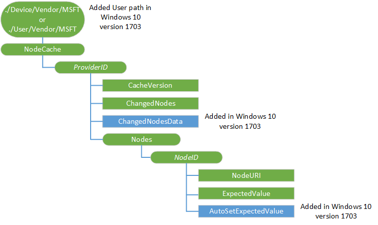

# NodeCache CSP


The NodeCache configuration service provider is used to manage the client cache. This configuration service provider is to be used only by enterprise management servers. It provides a level of abstraction that decouples the management of the node list from a specific backing store. It synchronizes the client cache with the server side cache. It also provides an API for monitoring device-side cache changes.

NodeCache supports the comparison of hash values instead of actual node values:

``` syntax
<Type xmlns="syncml:metinf">
application/x-nodemon-sha256
</type>
```

NodeCache will hash the values and compare with a hash value that was sent down by the server. This supports checking a parent node and its children recursively.

The following diagram shows the NodeCache configuration service provider in tree format.



<a href="" id="--device-vendor-msft"></a>**./Device/Vendor/MSFT and ./User/Vendor/MSFT**  
Required. The root node for the NodeCache object. Supported operation is Get. This configuration service provider is used for enterprise device management only. This is a predefined MIME type to identify this managed object in OMA DM syntax.

<a href="" id="providerid"></a>***ProviderID***  
Optional. Group settings per DM server. Each group of settings is distinguished by the server’s Provider ID. It should be the same DM server **PROVIDER-ID** value that was supplied through the [w7 APPLICATION configuration service provider](w7-application-csp.md) XML during the enrollment process. Only one enterprise management server is supported. That is, there should be only one *ProviderID* node under **NodeCache**. Scope is dynamic.

Supported operations are Get, Add, and Delete.

<a href="" id="providerid-cacheversion"></a>***ProviderID*/CacheVersion**  
Optional. Character string representing the cache version set by the server. Scope is dynamic.

Data type is string. Supported operations are Get, Add, and Replace.

<a href="" id="providerid-changednodes"></a>***ProviderID*/ChangedNodes**  
Optional. List of nodes whose values do not match their expected values as specified in **/*NodeID*/ExpectedValue**. Scope is dynamic.

Data type is string. Supported operation is Get.

<a href="" id="providerid-changednodesdata"></a>***ProviderID*/ChangedNodesData**  
Added in Windows 10, version 1703. Optional. XML containing nodes whose values do not match their expected values as specified in /NodeID/ExpectedValue.

Suppported operation is Get.

<a href="" id="providerid-nodes"></a>***ProviderID*/Nodes**  
Required. Root node for cached nodes. Scope is dynamic.

Supported operation is Get.

<a href="" id="-nodes-nodeid"></a>**/Nodes/****_NodeID_**  
Optional. Information about each cached node is stored under *NodeID* as specified by the server. This value must not contain a comma. Scope is dynamic.

Supported operations are Get, Add, and Delete.

<a href="" id="-nodeid-nodeuri"></a>**/*NodeID*/NodeURI**  
Required. This node's value is a complete OMA DM node URI. It can specify either an interior or leaf node in the device management tree. Scope is dynamic.

Data type is string. Supported operations are Get, Add, and Delete.

<a href="" id="-nodeid-expectedvalue"></a>**/*NodeID*/ExpectedValue**  
Required. This is the value that the server expects to be on the device. When the configuration service provider initiates a session, it checks the expected value against the node's actual value. Scope is dynamic. Supported values are string and x-nodemon-nonexistent.

Supported operations are Get, Add, and Delete.

Here's an example for setting the ExpectedValue to nonexistent.

``` syntax
<Add>
   <CmdID>10</CmdID>
   <Item>
      <Target>
         <LocURI>./Vendor/MSFT/NodeCache/MDMSRV1/Nodes/Node_0002/ExpectedValue</LocURI>
      </Target>
      <Meta>
         <Format xmlns="syncml:metinf">chr</Format>
         <Type xmlns="syncml:metinf">application/x-nodemon-nonexistent</Type>
      </Meta>
   </Item>
</Add>
```

<a href="" id="-nodeid-autosetexpectedvalue"></a>**/*NodeID*/AutoSetExpectedValue**  
Added in Windows 10, version 1703. Required. This automatically sets the value on the device to match the actual value of the node. The node is specified in NodeURI.

Supported operations are Add, Get, and Delete.

## A typical DM session with the NodeCache configuration service provider


1.  The device connects to a DM server.

2.  The server queries the **NodeCache** version by issuing a Get operation for ./Vendor/MSFT/NodeCache/*ProviderID*/CacheVersion LocURI

3.  If the device **CacheVersion** and the server-side cache differ (due to a device crash or server crash), the server can clear the server-side cache and go to Step 5.

4.  The server updates the server-side cache:

    1.  Sends a Get operation for ./Vendor/MSFT/NodeCache/*ProviderID*/ChangedNodes LocURI

    2.  Response is a list of changed node IDs. Each ID in the list corresponds to a node under ./Vendor/MSFT/NodeCache/*ProviderID*/Nodes root

    3.  For each node in the invalid nodes list, the server sends a `GET` command to retrieve the actual value of the node. For example, `GET <NodeURI>`, where `NodeURI` is a full device LocURI that corresponds to the invalid cache node.

    4.  Nodes in the server-side cache are updated with the actual values received from the device.

    5.  For each updated node, a `REPLACE` command is sent to the device to update the device-side cache:

        `REPLACE ./Vendor/MSFT/NodeCache/ProviderID/Nodes/NodeID/ExpectedValue => ActualValue`

    6.  A new cache version is created and sent to the device:

        `REPLACE ./Vendor/MSFT/NodeCache/ProviderID/CacheVersion => new_version`

        The `new_version` value is stored by the server.

5.  The management server retrieves the corresponding value from the server-side cache:

    1.  If a value already exists in the server-side cache, retrieve the value from the server-side cache instead of going to the device.

    2.  If a value does not exist in the server-side cache, do the following:

        1.  Create a new entry with a unique *NodeID* in the server-side cache.

        2.  Query the device to retrieve the actual value of the URI.

        3.  Create a new node under ./Vendor/MSFT/NodeCache/*ProviderID*/Nodes with *NodeID* value.

        4.  Set up **NodeURI** and **ExpectedValue** for the ./Vendor/MSFT/NodeCache/*ProviderID*/Nodes/*NodeID* node.

        5.  Update the **CachedNodes** version.

## OMA DM examples


Creating settings for node caching:

``` syntax
<Add>
   <CmdID>2</CmdID>
   <Item>
      <Target>
         <LocURI>./Vendor/MSFT/NodeCache/MDMSRV1</LocURI>
      </Target>
      <Meta>
         <Format xmlns="syncml:metinf">node</Format>
      </Meta>
   </Item>
</Add>
<Add>
   <CmdID>4</CmdID>
   <Item>
      <Target>
         <LocURI>./Vendor/MSFT/NodeCache/MDMSRV1/Nodes/Node_0001</LocURI>
      </Target>
      <Meta>
         <Format xmlns="syncml:metinf">node</Format>
      </Meta>
   </Item>
</Add>
<Add>
   <CmdID>5</CmdID>
   <Item>
      <Target>
         <LocURI>./Vendor/MSFT/NodeCache/MDMSRV1/Nodes/Node_0001/NodeURI</LocURI>
      </Target>
      <Data>./Vendor/MSFT/DeviceLock/Provider/MDMSRV1/DevicePasswordEnabled</Data>
   </Item>
</Add>
<Add>
   <CmdID>6</CmdID>
   <Item>
      <Target>
         <LocURI>./Vendor/MSFT/NodeCache/MDMSRV1/Nodes/Node_0001/ExpectedValue</LocURI>
      </Target>
      <Data>0</Data>
   </Item>
</Add>
<Add>
   <CmdID>8</CmdID>
   <Item>
      <Target>
         <LocURI>./Vendor/MSFT/NodeCache/MDMSRV1/Nodes/Node_0002</LocURI>
      </Target>
      <Meta>
         <Format xmlns="syncml:metinf">node</Format>
      </Meta>
   </Item>
</Add>
<Add>
   <CmdID>9</CmdID>
   <Item>
      <Target>
         <LocURI>./Vendor/MSFT/NodeCache/MDMSRV1/Nodes/Node_0002/NodeURI</LocURI>
      </Target>
      <Data>
         ./Vendor/MSFT/DeviceLock/Provider/MDMSRV1/AlphanumericDevicePasswordRequired
      </Data>
   </Item>
</Add>
<Add>
   <CmdID>10</CmdID>
   <Item>
      <Target>
         <LocURI>./Vendor/MSFT/NodeCache/MDMSRV1/Nodes/Node_0002/ExpectedValue</LocURI>
      </Target>
      <Data>0</Data>
   </Item>
</Add>
```

Getting nodes under Provider ID MDMSRV1, cache version, changed nodes, node, expected value:

``` syntax
<Get>
   <CmdID>18</CmdID>
   <Item>
      <Target>
         <LocURI>./Vendor/MSFT/NodeCache/MDMSRV1</LocURI>
      </Target>
   </Item>
</Get>
<Get>
   <CmdID>19</CmdID>
   <Item>
      <Target>
         <LocURI>./Vendor/MSFT/NodeCache/MDMSRV1/CacheVersion</LocURI>
      </Target>
   </Item>
</Get>
<Get>
   <CmdID>20</CmdID>
   <Item>
      <Target>
         <LocURI>./Vendor/MSFT/NodeCache/MDMSRV1/ChangedNodes</LocURI>
      </Target>
   </Item>
</Get>
<Get>
   <CmdID>21</CmdID>
   <Item>
      <Target>
         <LocURI>./Vendor/MSFT/NodeCache/MDMSRV1/Nodes/Node_0001</LocURI>
      </Target>
   </Item>
</Get>
<Get>
   <CmdID>22</CmdID>
   <Item>
      <Target>
         <LocURI>./Vendor/MSFT/NodeCache/MDMSRV1/Nodes/Node_0001/ExpectedValue</LocURI>
      </Target>
   </Item>
</Get>
```

Replacing the cache version, node URI, and expected value:

``` syntax
<Replace>
   <CmdID>2</CmdID>
   <Item>
      <Target>
         <LocURI>./Vendor/MSFT/NodeCache/MDMSRV1/CacheVersion</LocURI>
      </Target>
      <Data>SCCM0001@!Replace</Data>
   </Item>
</Replace>
<Replace>
   <CmdID>2</CmdID>
   <Item>
      <Target>
         <LocURI>./Vendor/MSFT/NodeCache/MDMSRV1/Nodes/Node_0001/NodeURI</LocURI>
      </Target>
      <Data>./Vendor/MSFT/DeviceLock/DeviceValue/AllowSimpleDevicePassword</Data>
    </Item>
</Replace>
<Replace>
   <CmdID>2</CmdID>
   <Item>
      <Target>
         <LocURI>./Vendor/MSFT/NodeCache/MDMSRV1/Nodes/Node_0001/ExpectedValue</LocURI>
      </Target>
      <Data>2</Data>
   </Item>
</Replace>
```

For AutoSetExpectedValue, a Replace operation with empty data will query the ./DevDetail/Ext/Microsoft/DeviceName.

```syntax
          <Add>
            <CmdID>2001</CmdID>
            <Item>
              <Target>
                <LocURI>./Vendor/MSFT/NodeCache/MDM%20SyncML%20Server/Nodes/20</LocURI>
              </Target>
              <Meta>
                <Format xmlns="syncml:metinf">node</Format>
              </Meta>
            </Item>
          </Add>
          <Add>
            <CmdID>2002</CmdID>
            <Item>
              <Target>
                <LocURI>./Vendor/MSFT/NodeCache/MDM%20SyncML%20Server/Nodes/20/NodeURI</LocURI>
              </Target>
              <Data>./DevDetail/Ext/Microsoft/DeviceName</Data>
            </Item>
          </Add>
          <Replace>
            <CmdID>2003</CmdID>
            <Item>
              <Target>
               <LocURI>./Vendor/MSFT/NodeCache/MDM%20SyncML%20Server/Nodes/20/AutoSetExpectedValue</LocURI>
              </Target>
              <Data></Data>
            </Item>
          </Replace>
```

A Get operation on ./Vendor/MSFT/NodeCache/MDM%20SyncML%20Server/Nodes/20/ExpectedValue returns what the Device Name was when the AutoSet was called.

A Get operation on the ChangedNodesData returns an encoded XML. Here is example:

```syntax
<Nodes><Node Id="10" Uri=""></Node><Node Id="20" Uri="./DevDetail/Ext/Microsoft/DeviceName">U09NRU5FV1ZBTFVF</Node></Nodes>
```
It represents this:

```syntax
<Nodes>
    <Node Id="10" Uri=""></Node>
    <Node Id="20" Uri="./DevDetail/Ext/Microsoft/DeviceName">U09NRU5FV1ZBTFVF</Node>
</Nodes>
```
Id is the node ID that was added by the MDM server, and Uri is the path that the node is tracking.
If a Uri is not set, the node will always be reported as changed, as in Node id 10.

The value inside of the node tag is the actual value returned by the Uri, which means that for Node Id 20 the DeviceName did not match what was previously expected, and the device name is now U09NRU5FV1ZBTFVF instead of what it was previously.


## Related topics


[Configuration service provider reference](configuration-service-provider-reference.md)

 

 


