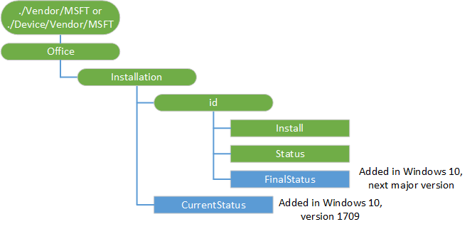

# Office CSP

> [!WARNING]
> Some information relates to prereleased product which may be substantially modified before it's commercially released. Microsoft makes no warranties, express or implied, with respect to the information provided here.

The Office configuration service provider (CSP) enables a Microsoft Office client to be installed on a device via the Office Deployment Tool (ODT). For more information, see [Configuration options for the Office Deployment Tool](https://technet.microsoft.com/library/jj219426.aspx) and [How to assign Office 365 apps to Windows 10 devices with Microsoft Intune](https://docs.microsoft.com/intune/apps-add-office365). 

This CSP was added in Windows 10, version 1703.

For additional information, see [Office DDF](office-ddf.md).

The following diagram shows the Office configuration service provider in tree format.



<a href="" id="office"></a>**./Device/Vendor/MSFT/Office/ or ./User/Vendor/MSFT/Office**  
The root node for the Office configuration service provider.</p>

<a href="" id="installation"></a>**Installation**  
Specifies the options for the Microsoft Office installation.

The supported operations are Add, Delete, Get, and Replace.

<a href="" id="id"></a>**Installation/_id_**  
Specifies a unique identifier that represents the ID of the Microsoft Office product to install. 

The supported operations are Add, Delete, Get, and Replace.

<a href="" id="install"></a>**Installation/_id_/Install**  
Installs Office by using the XML data specified in the configuration.xml file. 

The supported operations are Get and Execute.

<a href="" id="status"></a>**Installation/_id_/Status**  
The Microsoft Office installation status. 

The only supported operation is Get.

<a href="" id="finalstatus"></a>**Installation/_id_/FinalStatus**  
Added in Windows 10, version 1809. Indicates the status of the Final Office 365 installation.

The only supported operation is Get.

Behavior:  
-  When Office CSP is triggered to install, it will first check if the FinalStatus node exists or not. If the node exists, delete it.
-  When Office installation reaches any terminal states (either success or failure), this node is created that contains the following values:  
    - When status = 0: 70 (succeeded)
    - When status != 0: 60 (failed)

<a href="" id="currentstatus"></a>**Installation/CurrentStatus**  
Returns an XML of current Office 365 installation status on the device.

The only supported operation is Get.

## Examples

Sample SyncML to install Office 365 Business Retail from current channel.

```syntax
<SyncML xmlns="SYNCML:SYNCML1.2">
  <SyncBody>
    <Exec>
      <CmdID>7</CmdID>
        <Item>
          <Target>
            <LocURI>./Vendor/MSFT/Office/Installation/0AA79349-F334-4859-96E8-B4AB43E9FEA0/install</LocURI>
          </Target>
          <Meta>
            <Format xmlns="syncml:metinf">chr</Format>
          </Meta> 
          <Data>&lt;Configuration&gt;&lt;Add OfficeClientEdition=&quot;32&quot; Channel=&quot;Current&quot;&gt;&lt;Product ID=&quot;O365BusinessRetail&quot;&gt;&lt;Language ID=&quot;en-us&quot; /&gt;&lt;/Product&gt;&lt;/Add&gt;&lt;Display Level=&quot;None&quot; AcceptEULA=&quot;TRUE&quot; /&gt;&lt;/Configuration&gt;</Data>
        </Item>
    </Exec>
    <Final/>
  </SyncBody>
</SyncML>
```

To uninstall the Office 365 from the system:

```syntax
<SyncML xmlns="SYNCML:SYNCML1.2">
  <SyncBody>
    <Exec>
      <CmdID>7</CmdID>
        <Item>
          <Target>
            <LocURI>./Vendor/MSFT/Office/Installation/E24B23D8-94A8-4997-9E6E-8FF25025845B/install</LocURI>
          </Target>
          <Meta>
            <Format xmlns="syncml:metinf">chr</Format>
          </Meta> 
          <Data>&lt;Configuration&gt;&lt;Remove All=&quot;TRUE&quot;/&gt;&lt;Display Level=&quot;None&quot; AcceptEULA=&quot;TRUE&quot; /&gt;&lt;/Configuration&gt;</Data>
        </Item>
    </Exec>
    <Final/>
  </SyncBody>
</SyncML>
```

To get the current status of Office 365 on the device.

``` syntax
<SyncML xmlns="SYNCML:SYNCML1.2">
  <SyncBody>
    <Get>
      <CmdID>7</CmdID>
        <Item>
          <Target>
            <LocURI>./Vendor/MSFT/Office/Installation/CurrentStatus</LocURI>
          </Target>
        </Item>
    </Get>
    <Final/>
  </SyncBody>
</SyncML>
```

## Status code

<table>
<colgroup>
<col width="30%" />
<col width="50%" />
<col width="20%" />

</colgroup>
<thead>
<tr class="header">
<th>Status</th>
<th>Description</th>
<th>Comment</th>
</tr>
</thead>
<tbody>
<tr>
<td>0</td>
<td>Installation succeeded</td>
<td>OK</td>
</tr>
<tr>
<td>997</td>
<td>Installation in progress</td>
<td></td>
</tr>
<tr>
<td>13</td>
<td>ERROR_INVALID_DATA 
<p>Cannot verify signature of the downloaded Office Deployment Tool (ODT)<p></td>
<td>Failure</td>
</tr>
<tr>
<td>1460</td>
<td>ERROR_TIMEOUT 
<p>Failed to download ODT</p></td>
<td>Failure</td>
</tr>
<tr>
<td>1602 </td>
<td>ERROR_INSTALL_USEREXIT 
<p>User cancelled the installation </p></td>
<td>Failure</td>
</tr>
<tr>
<td>1603</td>
<td>ERROR_INSTALL_FAILURE
<p>Failed any pre-req check.</p>
<ul>
<li>SxS (Tried to install when 2016 MSI is installed)</li>
<li>Bit mismatch between the currently installed Office and the Office that was attempting to be installed (such as when you try to install a 32-bit version while 64-bit version is currently installed.)</li>
</ul>
</td>
<td>Failure</td>
</tr>
<tr>
<td>17000</td>
<td>ERROR_PROCESSPOOL_INITIALIZATION 
<p>Failed to start C2RClient </p></td>
<td>Failure</td>
</tr>
<tr>
<td>17001</td>
<td>ERROR_QUEUE_SCENARIO 
<p>Failed to queue installation scenario in C2RClient</p></td>
<td>Failure</td>
</tr>
<tr>
<td>17002</td>
<td>ERROR_COMPLETING_SCENARIO 
<p>Failed to complete the process. Possible reasons:</p>
<ul>
<li>Installation cancelled by user</li>
<li>Installation cancelled by another installation</li>
<li>Out of disk space during installation </li>
<li>Unknown language ID</li>
</ul></td>
<td>Failure</td>
</tr>
<tr>
<td>17003</td>
<td>ERROR_ANOTHER_RUNNING_SCENARIO 
<p>Another scenario is running</p></td>
<td>Failure</td>
</tr>
<tr>
<td>17004</td>
<td>ERROR_COMPLETING_SCENARIO_NEED_CLEAN_UP
<p>Possible reasons:</p>
<ul> 
<li>Unknown SKUs</li>
<li>Content does't exist on CDN
<ul><li>such as trying to install an unsupported LAP, like zh-sg</li>
<li>CDN issue that content is not available</li></ul>
</li>
<li>Signature check issue, such as failed the signature check for Office content</li>
<li>User cancelled
</ul>
</td>
<td>Failure</td>
</tr>
<tr>
<td>17005</td>
<td>ERROR_SCENARIO_CANCELLED_AS_PLANNED</td>
<td>Failure</td>
</tr>
<tr>
<td>17006</td>
<td>ERROR_SCENARIO_CANCELLED
<p>Blocked update by running apps</p></td>
<td>Failure</td>
</tr>
<tr>
<td>17007</td>
<td>ERROR_REMOVE_INSTALLATION_NEEDED
<p>The client is requesting client clean up in a "Remove Installation" scenario</p></td>
<td>Failure</td>
</tr>
<tr>
<td>17100</td>
<td>ERROR_HANDLING_COMMAND_LINE
<p>C2RClient command line error </p></td>
<td>Failure</td>
</tr>
<tr>
<td>0x80004005</td>
<td>E_FAIL 
<p>ODT cannot be used to install Volume license</p></td>
<td>Failure</td>
</tr>
<tr>
<td>0x8000ffff </td>
<td>E_UNEXPECTED
<p>Tried to uninstall when there is no C2R Office on the machine.</p></td>
<td>Failure</td>
</tr>
</tbody>
</table>
