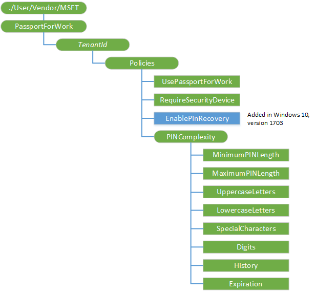
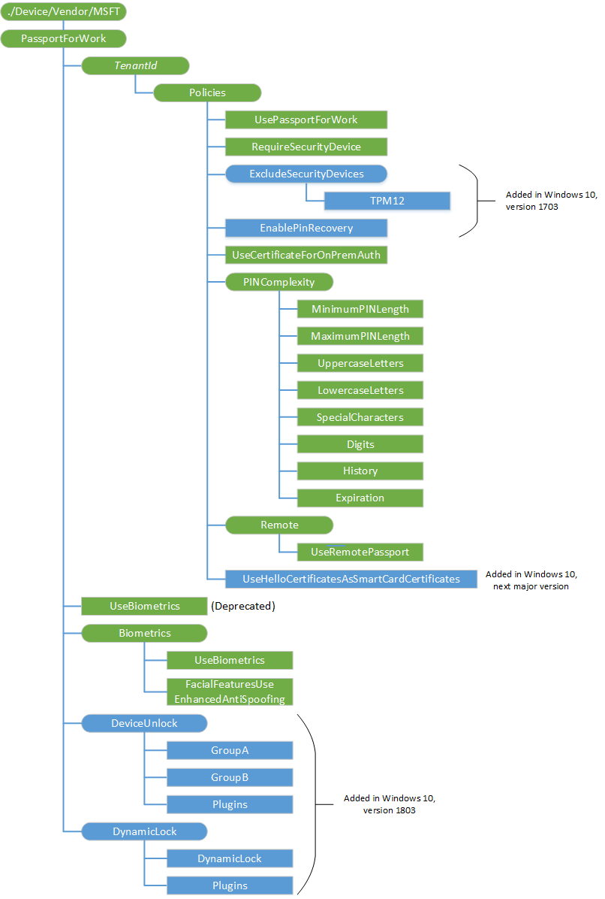

# PassportForWork CSP

The PassportForWork configuration service provider is used to provision Windows Hello for Business (formerly Microsoft Passport for Work). It allows you to login to Windows using your Active Directory or Azure Active Directory account and replace passwords, smartcards, and virtual smart cards.

> [!IMPORTANT]
> Starting with Windows 10, version 1607 all devices only have one PIN associated with Windows Hello for Business. This means that any PIN on a device will be subject to the policies specified in the PassportForWork CSP. The values specified take precedence over any complexity rules set via Exchange ActiveSync (EAS) or the DeviceLock CSP.
 
### User configuration diagram

The following diagram shows the PassportForWork configuration service provider in tree format.



### Device configuration diagram

The following diagram shows the PassportForWork configuration service provider in tree format.



<a href="" id="passportforwork"></a>**PassportForWork**  
Root node for PassportForWork configuration service provider.

<a href="" id="tenantid"></a>***TenantId***  
A globally unique identifier (GUID), without curly braces ( { , } ), that is used as part of Windows Hello for Business provisioning and management. To get a GUID, use the PowerShell cmdlet [Get-AzureAccount](https://docs.microsoft.com/powershell/module/servicemanagement/azure/get-azureaccount). For more information see [Get Windows Azure Active Directory Tenant ID in Windows PowerShell](https://devblogs.microsoft.com/scripting/get-windows-azure-active-directory-tenant-id-in-windows-powershell).

<a href="" id="tenantid-policies"></a>***TenantId*/Policies**  
Node for defining the Windows Hello for Business policy settings.

<a href="" id="tenantid-policies-usepassportforwork"></a>***TenantId*/Policies/UsePassportForWork**  
Boolean value that sets Windows Hello for Business as a method for signing into Windows.

Default value is true. If you set this policy to false, the user cannot provision Windows Hello for Business except on Azure Active Directory joined mobile phones where provisioning is required.

Supported operations are Add, Get, Delete, and Replace.

<a href="" id="tenantid-policies-requiresecuritydevice"></a>***TenantId*/Policies/RequireSecurityDevice**  
Boolean value that requires a Trusted Platform Module (TPM) for Windows Hello for Business. TPM provides an additional security benefit over software so that data stored in it cannot be used on other devices.

Default value is false. If you set this policy to true, only devices with a usable TPM can provision Windows Hello for Business. If you set this policy to false, all devices can provision Windows Hello for Business using software even if there is not a usable TPM. If you do not configure this setting, all devices can provision Windows Hello for Business using software if the TPM is non-functional or unavailable.

Supported operations are Add, Get, Delete, and Replace.

<a href="" id="tenantid-policies-excludesecuritydevices--only-for---device-vendor-msft-"></a>***TenantId*/Policies/ExcludeSecurityDevices** (only for ./Device/Vendor/MSFT)  
Added in Windows 10, version 1703. Root node for excluded security devices.
*Not supported on Windows Holographic and Windows Holographic for Business.*

<a href="" id="tenantid-policies-excludesecuritydevices-tpm12--only-for---device-vendor-msft-"></a>***TenantId*/Policies/ExcludeSecurityDevices/TPM12** (only for ./Device/Vendor/MSFT)  
Added in Windows 10, version 1703. Some Trusted Platform Modules (TPMs) are compliant only with the older 1.2 revision of the TPM specification defined by the Trusted Computing Group (TCG).

Default value is false. If you enable this policy setting, TPM revision 1.2 modules will be disallowed from being used with Windows Hello for Business.

If you disable or do not configure this policy setting, TPM revision 1.2 modules will be allowed to be used with Windows Hello for Business.

Supported operations are Add, Get, Delete, and Replace.

<a href="" id="tenantid-policies-enablepinrecovery"></a>***TenantId*/Policies/EnablePinRecovery**  
Added in Windows 10, version 1703. Boolean value that enables a user to change their PIN by using the Windows Hello for Business PIN recovery service. 
This cloud service encrypts a recovery secret, which is stored locally on the client, and can be decrypted only by the cloud service.

Default value is false. If you enable this policy setting, the PIN recovery secret will be stored on the device and the user can change their PIN if needed.

If you disable or do not configure this policy setting, the PIN recovery secret will not be created or stored. If the user's PIN is forgotten, the only way to get a new PIN is by deleting the existing PIN and creating a new one, which will require the user to re-register with any services the old PIN provided access to.

Supported operations are Add, Get, Delete, and Replace.

<a href="" id="tenantid-policies-usecertificateforonpremauth--only-for---device-vendor-msft-"></a>***TenantId*/Policies/UseCertificateForOnPremAuth** (only for ./Device/Vendor/MSFT)  
Boolean value that enables Windows Hello for Business to use certificates to authenticate on-premises resources.

If you enable this policy setting, Windows Hello for Business will wait until the device has received a certificate payload from the mobile device management server before provisioning a PIN.

If you disable or do not configure this policy setting, the PIN will be provisioned when the user logs in, without waiting for a certificate payload.

Supported operations are Add, Get, Delete, and Replace.

<a href="" id="tenantid-policies-pincomplexity"></a>***TenantId*/Policies/PINComplexity**  
Node for defining PIN settings.

<a href="" id="tenantid-policies-pincomplexity-minimumpinlength"></a>***TenantId*/Policies/PINComplexity/MinimumPINLength**  
Integer value that sets the minimum number of characters required for the PIN. Default value is 4. The lowest number you can configure for this policy setting is 4. The largest number you can configure must be less than the number configured in the Maximum PIN length policy setting or the number 127, whichever is the lowest.

If you configure this policy setting, the PIN length must be greater than or equal to this number. If you disable or do not configure this policy setting, the PIN length must be greater than or equal to 4.

> [!NOTE]
> If the conditions specified above for the minimum PIN length are not met, default values will be used for both the maximum and minimum PIN lengths.

 
Value type is int. Supported operations are Add, Get, Delete, and Replace.

<a href="" id="tenantid-policies-pincomplexity-maximumpinlength"></a>***TenantId*/Policies/PINComplexity/MaximumPINLength**  
Integer value that sets the maximum number of characters allowed for the PIN. Default value is 127. The largest number you can configure for this policy setting is 127. The lowest number you can configure must be larger than the number configured in the Minimum PIN length policy setting or the number 4, whichever is greater.

If you configure this policy setting, the PIN length must be less than or equal to this number. If you disable or do not configure this policy setting, the PIN length must be less than or equal to 127.

> [!NOTE]
> If the conditions specified above for the maximum PIN length are not met, default values will be used for both the maximum and minimum PIN lengths.

 
Supported operations are Add, Get, Delete, and Replace.

<a href="" id="tenantid-policies-pincomplexity-uppercaseletters"></a>***TenantId*/Policies/PINComplexity/UppercaseLetters**  
Integer value that configures the use of uppercase letters in the Windows Hello for Business PIN.

Valid values:

-   0 - Allows the use of uppercase letters in PIN.
-   1 - Requires the use of at least one uppercase letters in PIN.
-   2 - Does not allow the use of uppercase letters in PIN.

Default value is 2. Default PIN complexity behavior is that digits are required and all other character sets are not allowed. If all character sets are allowed but none are explicitly required, then the default PIN complexity behavior will apply.

Supported operations are Add, Get, Delete, and Replace.

<a href="" id="tenantid-policies-pincomplexity-lowercaseletters"></a>***TenantId*/Policies/PINComplexity/LowercaseLetters**  
Integer value that configures the use of lowercase letters in the Windows Hello for Business PIN.

Valid values:

-   0 - Allows the use of lowercase letters in PIN.
-   1 - Requires the use of at least one lowercase letters in PIN.
-   2 - Does not allow the use of lowercase letters in PIN.

Default value is 2. Default PIN complexity behavior is that digits are required and all other character sets are not allowed. If all character sets are allowed but none are explicitly required, then the default PIN complexity behavior will apply.

Supported operations are Add, Get, Delete, and Replace.

<a href="" id="tenantid-policies-pincomplexity-specialcharacters"></a>***TenantId*/Policies/PINComplexity/SpecialCharacters**  
Integer value that configures the use of special characters in the Windows Hello for Business PIN. Valid special characters for Windows Hello for Business PIN gestures include: ! " \# $ % & ' ( ) \* + , - . / : ; &lt; = &gt; ? @ \[ \\ \] ^ \_ \` { | } ~ .

Valid values:

-   0 - Allows the use of special characters in PIN.
-   1 - Requires the use of at least one special character in PIN.
-   2 - Does not allow the use of special characters in PIN.

Default value is 2. Default PIN complexity behavior is that digits are required and all other character sets are not allowed. If all character sets are allowed but none are explicitly required, then the default PIN complexity behavior will apply.

Supported operations are Add, Get, Delete, and Replace.

<a href="" id="tenantid-policies-pincomplexity-digits"></a>***TenantId*/Policies/PINComplexity/Digits**  
Integer value that configures the use of digits in the Windows Hello for Business PIN.

Valid values:

-   0 - Allows the use of digits in PIN.
-   1 - Requires the use of at least one digit in PIN.
-   2 - Does not allow the use of digits in PIN.

Default value is 1. Default PIN complexity behavior is that digits are required and all other character sets are not allowed. If all character sets are allowed but none are explicitly required, then the default PIN complexity behavior will apply.

Supported operations are Add, Get, Delete, and Replace.

<a href="" id="tenantid-policies-pincomplexity-history"></a>***TenantId*/Policies/PINComplexity/History**  
Integer value that specifies the number of past PINs that can be associated to a user account that can’t be reused. The largest number you can configure for this policy setting is 50. The lowest number you can configure for this policy setting is 0. If this policy is set to 0, then storage of previous PINs is not required. This node was added in Windows 10, version 1511.

The current PIN of the user is included in the set of PINs associated with the user account. PIN history is not preserved through a PIN reset.

Default value is 0.

Supported operations are Add, Get, Delete, and Replace.

<a href="" id="tenantid-policies-pincomplexity-expiration"></a>***TenantId*/Policies/PINComplexity/Expiration**  
Integer value specifies the period of time (in days) that a PIN can be used before the system requires the user to change it. The largest number you can configure for this policy setting is 730. The lowest number you can configure for this policy setting is 0. If this policy is set to 0, then the user’s PIN will never expire. This node was added in Windows 10, version 1511.

Default is 0.

Supported operations are Add, Get, Delete, and Replace.

<a href="" id="tenantid-policies-remote--only-for---device-vendor-msft-"></a>***TenantId*/Policies/Remote** (only for ./Device/Vendor/MSFT)  
Interior node for defining remote Windows Hello for Business policies. This node was added in Windows 10, version 1511.
*Not supported on Windows Holographic and Windows Holographic for Business.*

<a href="" id="tenantid-policies-remote-useremotepassport--only-for---device-vendor-msft-"></a>***TenantId*/Policies/Remote/UseRemotePassport** (only for ./Device/Vendor/MSFT)  
Boolean value used to enable or disable the use of remote Windows Hello for Business. Remote Windows Hello for Business provides the ability for a portable, registered device to be usable as a companion device for desktop authentication. Remote Windows Hello for Business requires that the desktop be Azure AD joined and that the companion device has a Windows Hello for Business PIN. This node was added in Windows 10, version 1511.

Default value is false. If you set this policy to true, Remote Windows Hello for Business will be enabled and a portable, registered device can be used as a companion device for desktop authentication. If you set this policy to false, Remote Windows Hello for Business will be disabled.

Supported operations are Add, Get, Delete, and Replace.

*Not supported on Windows Holographic and Windows Holographic for Business.*

<a href="" id="tenantid-policies-usehellocertificatesassmartcardcertificates"></a>***TenantId*/Policies/UseHelloCertificatesAsSmartCardCertificates** (only for ./Device/Vendor/MSFT)  
Added in Windows 10, version 1809. If you enable this policy setting, applications use Windows Hello for Business certificates as smart card certificates. Biometric factors are unavailable when a user is asked to authorize the use of the certificate's private key. This policy setting is designed to allow compatibility with applications that rely exclusively on smart card certificates.

If you disable or do not configure this policy setting, applications do not use Windows Hello for Business certificates as smart card certificates, and biometric factors are available when a user is asked to authorize the use of the certificate's private key.

Windows requires a user to lock and unlock their session after changing this setting if the user is currently signed in.

Value type is bool. Supported operations are Add, Get, Replace, and Delete.

<a href="" id="usebiometrics"></a>**UseBiometrics**  
This node is deprecated. Use **Biometrics/UseBiometrics** node instead.

<a href="" id="biometrics--only-for---device-vendor-msft-"></a>**Biometrics** (only for ./Device/Vendor/MSFT)  
Node for defining biometric settings. This node was added in Windows 10, version 1511.
*Not supported on Windows Holographic and Windows Holographic for Business.*

<a href="" id="biometrics-usebiometrics--only-for---device-vendor-msft-"></a>**Biometrics/UseBiometrics** (only for ./Device/Vendor/MSFT)  
Boolean value used to enable or disable the use of biometric gestures, such as face and fingerprint, as an alternative to the PIN gesture for Windows Hello for Business. Users must still configure a PIN if they configure biometric gestures to use in case of failures. This node was added in Windows 10, version 1511.

Default value is true, enabling the biometric gestures for use with Windows Hello for Business. If you set this policy to false, biometric gestures are disabled for use with Windows Hello for Business.


Supported operations are Add, Get, Delete, and Replace.

*Not supported on Windows Holographic and Windows Holographic for Business.*

<a href="" id="biometrics-facialfeaturesuseenhancedantispoofing--only-for---device-vendor-msft-"></a>**Biometrics/FacialFeaturesUseEnhancedAntiSpoofing** (only for ./Device/Vendor/MSFT)  
Boolean value used to enable or disable enhanced anti-spoofing for facial feature recognition on Windows Hello face authentication. This node was added in Windows 10, version 1511.

Default value is false. If you set this policy to false or don't configure this setting, Windows doesn't require enhanced anti-spoofing for Windows Hello face authentication.

If you set this policy to true, Windows requires all users on managed devices to use enhanced anti-spoofing for Windows Hello face authentication. Windows Hello face authentication is disabled on devices that do not support enhanced anti-spoofing.

Note that enhanced anti-spoofing for Windows Hello face authentication is not required on unmanaged devices.

Supported operations are Add, Get, Delete, and Replace.

*Not supported on Windows Holographic and Windows Holographic for Business.*

<a href="" id="deviceunlock"></a>**DeviceUnlock** (only for ./Device/Vendor/MSFT)  
Added in Windows 10, version 1803. Interior node.

<a href="" id="deviceunlock"></a>**DeviceUnlock/GroupA** (only for ./Device/Vendor/MSFT)  
Added in Windows 10, version 1803. Contains a list of credential providers by GUID (comma separated) that are the first step of authentication.

Value type is string. Supported operations are Add, Get, Replace, and Delete.

<a href="" id="deviceunlock-groupb"></a>**DeviceUnlock/GroupB** (only for ./Device/Vendor/MSFT)  
Added in Windows 10, version 1803. Contains a list of credential providers by GUID (comma separated) that are the second step of authentication.

Value type is string. Supported operations are Add, Get, Replace, and Delete.

<a href="" id="deviceunlock-plugins"></a>**DeviceUnlock/Plugins** (only for ./Device/Vendor/MSFT)  
Added in Windows 10, version 1803. List of plugins (comma separated) that the passive provider monitors to detect user presence.

Value type is string. Supported operations are Add, Get, Replace, and Delete.

<a href="" id="dynamiclock"></a>**DynamicLock** (only for ./Device/Vendor/MSFT)  
Added in Windows 10, version 1803. Interior node.


<a href="" id="dynamiclock-dynamiclock"></a>**DynamicLock/DynamicLock** (only for ./Device/Vendor/MSFT)  
Added in Windows 10, version 1803. Enables the dynamic lock.

Value type is bool. Supported operations are Add, Get, Replace, and Delete.

<a href="" id="dynamiclock-plugins"></a>**DynamicLock/Plugins** (only for ./Device/Vendor/MSFT)  
Added in Windows 10, version 1803. List of plugins (comma separated) that the passive provider monitors to detect user absence.

Value type is string. Supported operations are Add, Get, Replace, and Delete.

<a href="" id="securitykey"></a>**SecurityKey** (only for ./Device/Vendor/MSFT)  
Added in Windows 10, version 1903. Interior node.

Scope is permanent. Supported operation is Get.


<a href="" id="securitykey-usesecuritykeyforsignin"></a>**SecurityKey/UseSecurityKeyForSignin** (only for ./Device/Vendor/MSFT)  
Added in Windows 10, version 1903. Enables users to sign-in to their device with a [FIDO2 security key](https://docs.microsoft.com/en-us/azure/active-directory/authentication/concept-authentication-passwordless#fido2-security-keys) that is compatible with Microsoft’s implementation.

Scope is dynamic. Supported operations are Add, Get, Replace, and Delete.

Value type is integer. 

Valid values:  
- 0 (default) - disabled.
- 1 - enabled.

## Examples

Here's an example for setting Windows Hello for Business and setting the PIN policies. It also turns on the use of biometrics and TPM.

``` syntax
<SyncML xmlns="SYNCML:SYNCML1.2">
          <SyncBody>
            <Add>
              <CmdID>2</CmdID>
              <Item>
                <Target>
                  <LocURI>
                    ./Vendor/MSFT/PassportForWork/5NEMDU42-45CC-8CBL-8BPF-D7092646325F
                  </LocURI>
                </Target>
              </Item>
            </Add>
            <Add>
              <CmdID>3</CmdID>
              <Item>
                <Target>
                  <LocURI>
                    ./Vendor/MSFT/PassportForWork/5NEMDU42-45CC-8CBL-8BPF-D7092646325F/Policies/UsePassportForWork
                  </LocURI>
                </Target>
                <Meta>
                  <Format xmlns="syncml:metinf">bool</Format>
                  <Type>text/plain</Type>
                </Meta>
                <Data>true</Data>
              </Item>
            </Add>
            <Add>
              <CmdID>4</CmdID>
              <Item>
                <Target>
                  <LocURI>
                    ./Vendor/MSFT/PassportForWork/5NEMDU42-45CC-8CBL-8BPF-D7092646325F/Policies/RequireSecurityDevice
                  </LocURI>
                </Target>
                <Meta>
                  <Format xmlns="syncml:metinf">bool</Format>
                  <Type>text/plain</Type>
                </Meta>
                <Data>true</Data>
              </Item>
            </Add>
            <Add>
              <CmdID>5</CmdID>
              <Item>
                <Target>
                  <LocURI>
                    ./Vendor/MSFT/PassportForWork/5NEMDU42-45CC-8CBL-8BPF-D7092646325F/Policies/PINComplexity/MinimumPINLength
                  </LocURI>
                </Target>
                <Meta>
                  <Format xmlns="syncml:metinf">int</Format>
                  <Type>text/plain</Type>
                </Meta>
                <Data>8</Data>
              </Item>
            </Add>
            <Add>
              <CmdID>6</CmdID>
              <Item>
                <Target>
                  <LocURI>
                    ./Vendor/MSFT/PassportForWork/5NEMDU42-45CC-8CBL-8BPF-D7092646325F/Policies/PINComplexity/MaximumPINLength
                  </LocURI>
                </Target>
                <Meta>
                  <Format xmlns="syncml:metinf">int</Format>
                  <Type>text/plain</Type>
                </Meta>
                <Data>16</Data>
              </Item>
            </Add>
            <Add>
              <CmdID>7</CmdID>
              <Item>
                <Target>
                  <LocURI>
                    ./Vendor/MSFT/PassportForWork/5NEMDU42-45CC-8CBL-8BPF-D7092646325F/Policies/PINComplexity/UppercaseLetters
                  </LocURI>
                </Target>
                <Meta>
                  <Format xmlns="syncml:metinf">int</Format>
                  <Type>text/plain</Type>
                </Meta>
                <Data>0</Data>
              </Item>
            </Add>
            <Add>
              <CmdID>8</CmdID>
              <Item>
                <Target>
                  <LocURI>
                    ./Vendor/MSFT/PassportForWork/5NEMDU42-45CC-8CBL-8BPF-D7092646325F/Policies/PINComplexity/LowercaseLetters
                  </LocURI>
                </Target>
                <Meta>
                  <Format xmlns="syncml:metinf">int</Format>
                  <Type>text/plain</Type>
                </Meta>
                <Data>1</Data>
              </Item>
            </Add>
            <Add>
              <CmdID>9</CmdID>
              <Item>
                <Target>
                  <LocURI>
                    ./Vendor/MSFT/PassportForWork/5NEMDU42-45CC-8CBL-8BPF-D7092646325F/Policies/PINComplexity/SpecialCharacters
                  </LocURI>
                </Target>
                <Meta>
                  <Format xmlns="syncml:metinf">int</Format>
                  <Type>text/plain</Type>
                </Meta>
                <Data>2</Data>
              </Item>
            </Add>
            <Add>
              <CmdID>10</CmdID>
              <Item>
                <Target>
                  <LocURI>
                    ./Vendor/MSFT/PassportForWork/5NEMDU42-45CC-8CBL-8BPF-D7092646325F/Policies/PINComplexity/Digits
                  </LocURI>
                </Target>
                <Meta>
                  <Format xmlns="syncml:metinf">int</Format>
                  <Type>text/plain</Type>
                </Meta>
                <Data>1</Data>
              </Item>
            </Add>
            <Add>
              <CmdID>11</CmdID>
              <Item>
                <Target>
                  <LocURI>
                    ./Vendor/MSFT/PassportForWork/5NEMDU42-45CC-8CBL-8BPF-D7092646325F/Policies/PINComplexity/History
                  </LocURI>
                </Target>
                <Meta>
                  <Format xmlns="syncml:metinf">int</Format>
                  <Type>text/plain</Type>
                </Meta>
                <Data>20</Data>
              </Item>
            </Add>
            <Add>
              <CmdID>12</CmdID>
              <Item>
                <Target>
                  <LocURI>
                    ./Vendor/MSFT/PassportForWork/5NEMDU42-45CC-8CBL-8BPF-D7092646325F/Policies/PINComplexity/Expiration
                  </LocURI>
                </Target>
                <Meta>
                  <Format xmlns="syncml:metinf">int</Format>
                  <Type>text/plain</Type>
                </Meta>
                <Data>70</Data>
              </Item>
            </Add>
            <Add>
              <CmdID>13</CmdID>
              <Item>
                <Target>
                  <LocURI>
                    ./Vendor/MSFT/PassportForWork/5NEMDU42-45CC-8CBL-8BPF-D7092646325F/Policies/Remote/UseRemotePassport
                  </LocURI>
                </Target>
                <Meta>
                  <Format xmlns="syncml:metinf">bool</Format>
                  <Type>text/plain</Type>
                </Meta>
                <Data>true</Data>
              </Item>
            </Add>
            <Add>
              <CmdID>14</CmdID>
              <Item>
                <Target>
                  <LocURI>
                    ./Vendor/MSFT/PassportForWork/Biometrics/UseBiometrics
                  </LocURI>
                </Target>
                <Meta>
                  <Format xmlns="syncml:metinf">bool</Format>
                  <Type>text/plain</Type>
                </Meta>
                <Data>true</Data>
              </Item>
            </Add>
    <Add>
              <CmdID>15</CmdID>
              <Item>
                <Target>
                  <LocURI>
                    ./Vendor/MSFT/PassportForWork/Biometrics/FacialFeatureUseEnhancedAntiSpoofing
                  </LocURI>
                </Target>
                <Meta>
                  <Format xmlns="syncml:metinf">bool</Format>
                  <Type>text/plain</Type>
                </Meta>
                <Data>true</Data>
              </Item>
            </Add>
            <Final/> 
          </SyncBody>
        </SyncML>
```

 

 


