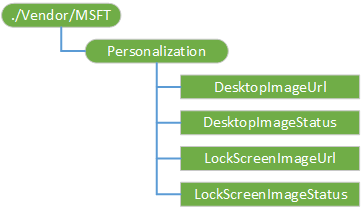

# Personalization CSP

The Personalization CSP can set the lock screen and desktop background images. Setting these policies also prevents the user from changing the image. You can also use the Personalization settings in a provisioning package.

This CSP was added in Windows 10, version 1703.

> [!Note]
> Personalization CSP is supported in Windows 10 Enterprise and Education SKUs. It works in Windows 10 Pro and Windows 10 Pro in S mode if SetEduPolicies in [SharedPC CSP](sharedpc-csp.md) is set.

The following diagram shows the Personalization configuration service provider in tree format.



<a href="" id="personalization"></a>**./Vendor/MSFT/Personalization**  
<p style="margin-left: 20px">Defines the root node for the Personalization configuration service provider.</p>

<a href="" id="desktopimageurl"></a>**DesktopImageUrl**  
<p style="margin-left: 20px">Specify a jpg, jpeg or png image to be used as Desktop Image. This setting can take a http or https Url to a remote image to be downloaded, a file Url to a local image.</p>
<p style="margin-left: 20px">Value type is string. Supported operations are Add, Get, Delete, and Replace.</p>

<a href="" id="desktopimagestatus"></a>**DesktopImageStatus**  
<p style="margin-left: 20px">Represents the status of the desktop image. Valid values:</p>
<ul>
<li>1 - Successfully downloaded or copied.</li>
<li>2 - Download or copy in progress.</li>
<li>3 - Download or copy failed.</li>
<li>4 - Unknown file type.</li>
<li>5 - Unsupported URL scheme.</li>
<li>6 - Max retry failed.</li>
<li>7 - Blocked, SKU not allowed</li>
</ul>
<p style="margin-left: 20px">Supporter operation is Get.</p>

> [!Note]
> This setting is only used to query status. To set the image, use the DesktopImageUrl setting.

<a href="" id="lockscreenimageurl"></a>**LockScreenImageUrl**  
<p style="margin-left: 20px">Specify a jpg, jpeg or png image to be used as Lock Screen Image. This setting can take a http or https Url to a remote image to be downloaded, a file Url to a local image.</p>
<p style="margin-left: 20px">Value type is string. Supported operations are Add, Get, Delete, and Replace.</p>


<a href="" id="lockscreenimagestatus"></a>**LockScreenImageStatus**  
<p style="margin-left: 20px">Represents the status of the lock screen image. Valid values:</p>
<ul>
<li>1 - Successfully downloaded or copied.</li>
<li>2 - Download or copy in progress.</li>
<li>3 - Download or copy failed.</li>
<li>4 - Unknown file type.</li>
<li>5 - Unsupported URL scheme.</li>
<li>6 - Max retry failed.</li>
<li>7 - Blocked, SKU not allowed</li>
</ul>
<p style="margin-left: 20px">Supporter operation is Get.</p>

> [!Note]
> This setting is only used to query status. To set the image, use the LockScreenImageUrl setting.


## Example SyncML

``` syntax
<SyncML xmlns="SYNCML:SYNCML1.2">
  <SyncBody>
    <Replace>
      <CmdID>1</CmdID>
      <Item>
        <Target>
          <LocURI>
            ./Vendor/MSFT/Personalization/LockScreenImageUrl
          </LocURI>
        </Target>
        <Meta>
          <Format xmlns="syncml:metinf">chr</Format>
          <Type>text/plain</Type>
        </Meta>
        <Data>https://www.contoso.com/desktopimage.jpeg</Data>
      </Item>
    </Replace>
    <Replace>
      <CmdID>2</CmdID>
      <Item>
        <Target>
          <LocURI>
            ./Vendor/MSFT/Personalization/DesktopImageUrl
          </LocURI>
        </Target>
        <Meta>
          <Format xmlns="syncml:metinf">chr</Format>
          <Type>text/plain</Type>
        </Meta>
        <Data>https://www.contoso.com/lockscreenimage.JPG</Data>
      </Item>
    </Replace>
    <Final/> 
  </SyncBody>
</SyncML>
```


